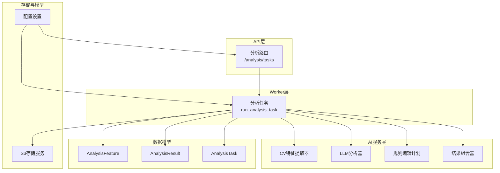
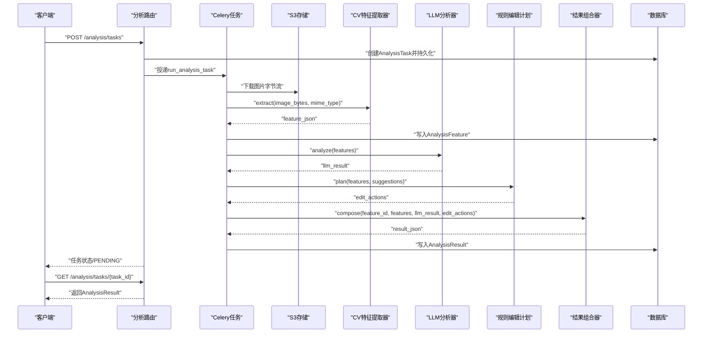
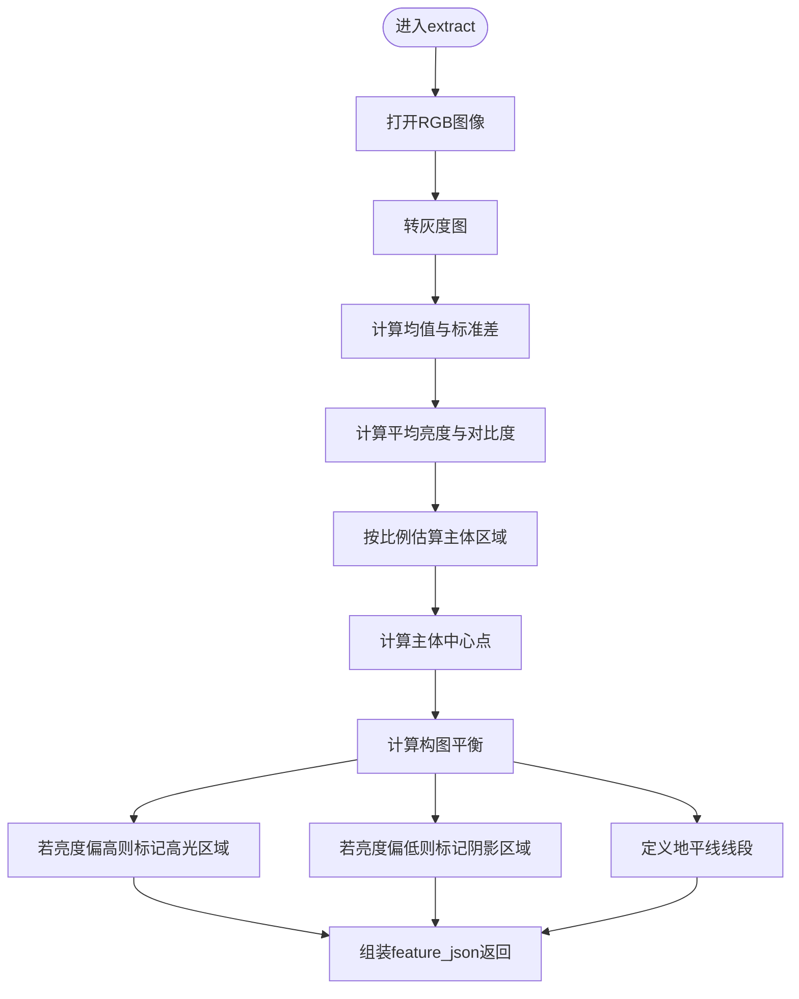
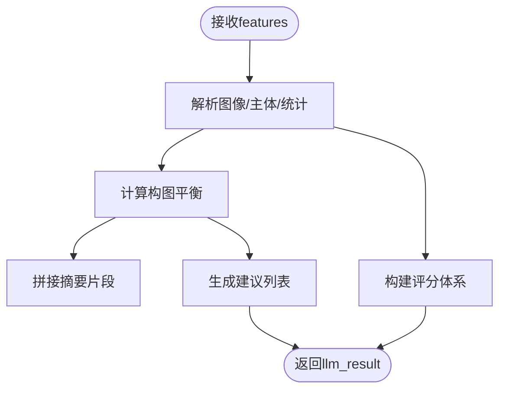
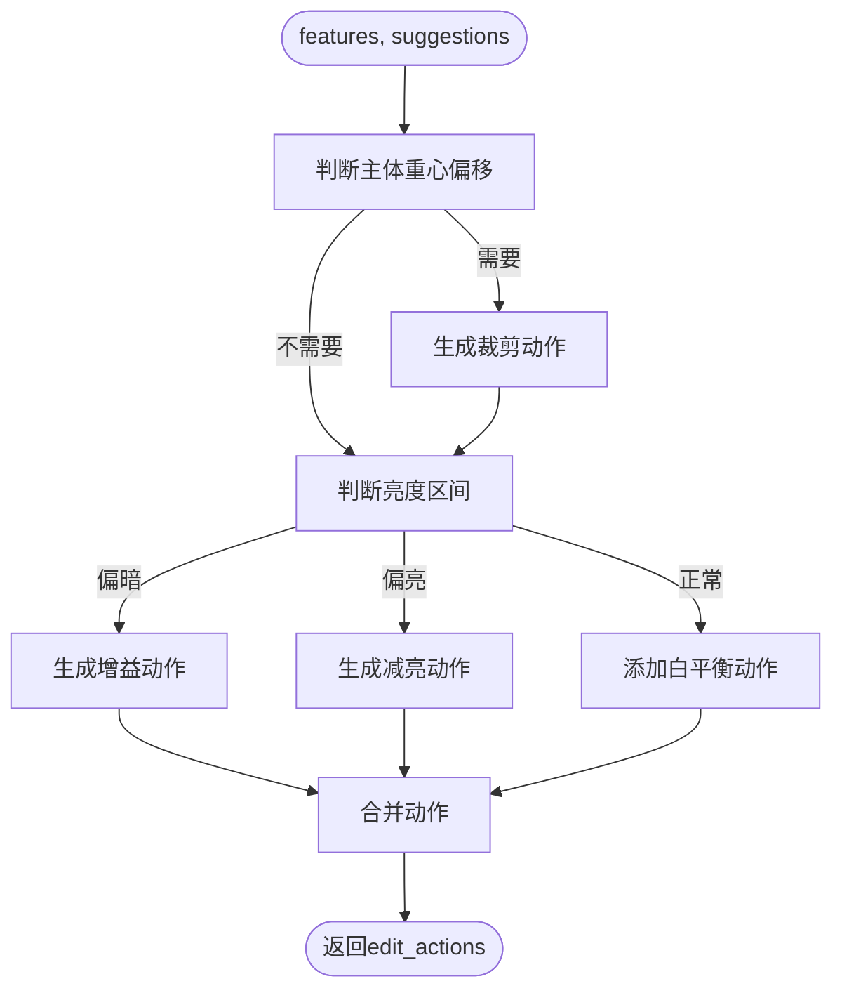
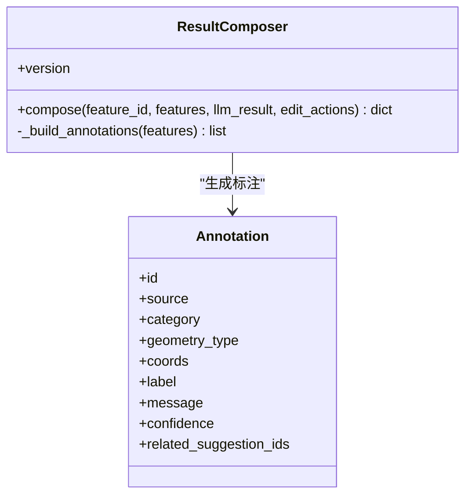
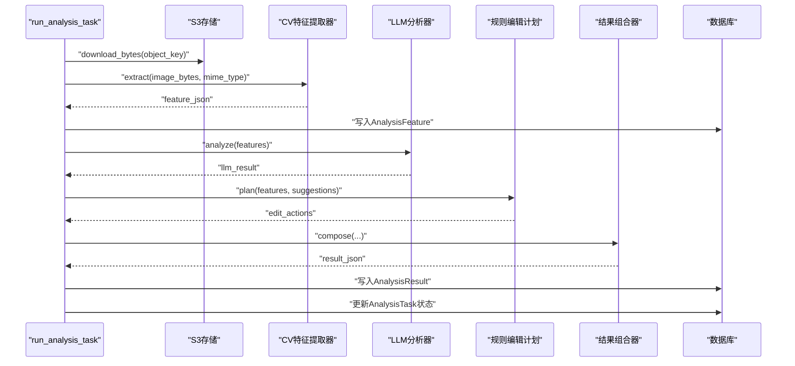
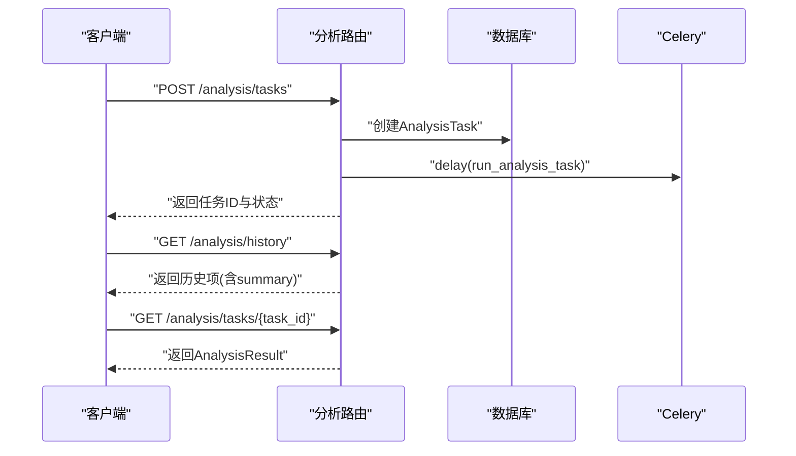
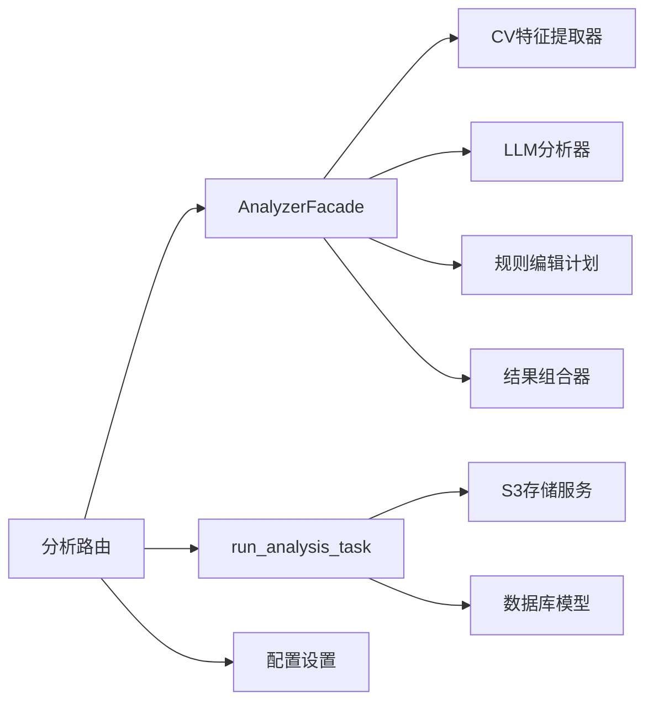

# AI分析服务

<cite>
**本文引用的文件**
- [apps/api/app/services/ai/analyzer.py](file://apps/api/app/services/ai/analyzer.py)
- [apps/api/app/services/cv/feature_extractor.py](file://apps/api/app/services/cv/feature_extractor.py)
- [apps/api/app/services/llm/analyzer.py](file://apps/api/app/services/llm/analyzer.py)
- [apps/api/app/services/rules/edit_planner.py](file://apps/api/app/services/rules/edit_planner.py)
- [apps/api/app/services/composer/result_composer.py](file://apps/api/app/services/composer/result_composer.py)
- [apps/api/app/tasks/analyze_photo.py](file://apps/api/app/tasks/analyze_photo.py)
- [apps/api/app/modules/analysis/router.py](file://apps/api/app/modules/analysis/router.py)
- [apps/api/app/schemas/analysis.py](file://apps/api/app/schemas/analysis.py)
- [apps/api/app/core/config.py](file://apps/api/app/core/config.py)
- [apps/api/app/services/storage/s3_storage.py](file://apps/api/app/services/storage/s3_storage.py)
- [apps/api/app/models/analysis_result.py](file://apps/api/app/models/analysis_result.py)
- [apps/api/app/models/analysis_task.py](file://apps/api/app/models/analysis_task.py)
- [apps/api/app/models/analysis_feature.py](file://apps/api/app/models/analysis_feature.py)
- [packages/contracts/analysis-result.schema.json](file://packages/contracts/analysis-result.schema.json)
- [docs/architecture-v2.md](file://docs/architecture-v2.md)
</cite>

## 目录
1. [简介](#简介)
2. [项目结构](#项目结构)
3. [核心组件](#核心组件)
4. [架构总览](#架构总览)
5. [详细组件分析](#详细组件分析)
6. [依赖分析](#依赖分析)
7. [性能考虑](#性能考虑)
8. [故障排查指南](#故障排查指南)
9. [结论](#结论)
10. [附录](#附录)

## 简介
本文件面向“AI摄影教练”的AI分析服务，系统性阐述计算机视觉模块如何提取图像特征，大语言模型如何生成分析建议，规则引擎如何制定编辑计划，以及结果组合器如何整合分析输出。文档覆盖AI服务的架构设计、算法实现、推理流程、性能优化、配置项、调优参数、监控指标、质量评估与持续改进机制。

## 项目结构
AI分析服务位于后端API应用中，采用“API层-Worker层-AI服务层”三层协作模式：
- API层：FastAPI路由负责任务创建、查询与历史管理。
- Worker层：Celery异步任务执行特征提取、分析与结果落库。
- AI服务层：CV特征提取、LLM分析、规则编辑计划、结果组合器四个子服务协同工作。

图表来源
- [apps/api/app/modules/analysis/router.py:45-74](file://apps/api/app/modules/analysis/router.py#L45-L74)
- [apps/api/app/tasks/analyze_photo.py:19-108](file://apps/api/app/tasks/analyze_photo.py#L19-L108)
- [apps/api/app/services/cv/feature_extractor.py:12-98](file://apps/api/app/services/cv/feature_extractor.py#L12-L98)
- [apps/api/app/services/llm/analyzer.py:5-139](file://apps/api/app/services/llm/analyzer.py#L5-L139)
- [apps/api/app/services/rules/edit_planner.py:5-97](file://apps/api/app/services/rules/edit_planner.py#L5-L97)
- [apps/api/app/services/composer/result_composer.py:5-99](file://apps/api/app/services/composer/result_composer.py#L5-L99)
- [apps/api/app/services/storage/s3_storage.py:11-59](file://apps/api/app/services/storage/s3_storage.py#L11-L59)
- [apps/api/app/models/analysis_feature.py:10-29](file://apps/api/app/models/analysis_feature.py#L10-L29)
- [apps/api/app/models/analysis_result.py:10-28](file://apps/api/app/models/analysis_result.py#L10-L28)
- [apps/api/app/models/analysis_task.py:10-36](file://apps/api/app/models/analysis_task.py#L10-L36)
- [apps/api/app/core/config.py:6-47](file://apps/api/app/core/config.py#L6-L47)

章节来源
- [apps/api/app/modules/analysis/router.py:1-151](file://apps/api/app/modules/analysis/router.py#L1-L151)
- [apps/api/app/tasks/analyze_photo.py:1-108](file://apps/api/app/tasks/analyze_photo.py#L1-L108)
- [apps/api/app/core/config.py:1-47](file://apps/api/app/core/config.py#L1-L47)
- [docs/architecture-v2.md:1-424](file://docs/architecture-v2.md#L1-L424)

## 核心组件
- 分析门面（AnalyzerFacade）：协调CV、LLM、规则与组合器，提供统一入口。
- CV特征提取器：从图像字节流中提取亮度、对比度、主体区域、高光/阴影区域、地平线等客观事实。
- LLM分析器：基于CV事实生成可读性摘要、建议列表与评分体系。
- 规则编辑计划：将建议转化为可执行的编辑动作（裁剪、曝光、白平衡等）。
- 结果组合器：将CV事实、LLM建议、编辑动作与标注统一为稳定协议输出。
- 异步任务（run_analysis_task）：拉起存储下载、特征提取、LLM分析、规则计划与结果落库。
- API路由：创建任务、查询任务详情与历史、重试失败任务。
- 存储服务：封装S3客户端，提供上传/下载与桶可用性保障。
- 数据模型：AnalysisTask、AnalysisFeature、AnalysisResult支撑任务生命周期与结果持久化。

章节来源
- [apps/api/app/services/ai/analyzer.py:10-27](file://apps/api/app/services/ai/analyzer.py#L10-L27)
- [apps/api/app/services/cv/feature_extractor.py:12-98](file://apps/api/app/services/cv/feature_extractor.py#L12-L98)
- [apps/api/app/services/llm/analyzer.py:5-139](file://apps/api/app/services/llm/analyzer.py#L5-L139)
- [apps/api/app/services/rules/edit_planner.py:5-97](file://apps/api/app/services/rules/edit_planner.py#L5-L97)
- [apps/api/app/services/composer/result_composer.py:5-99](file://apps/api/app/services/composer/result_composer.py#L5-L99)
- [apps/api/app/tasks/analyze_photo.py:19-108](file://apps/api/app/tasks/analyze_photo.py#L19-L108)
- [apps/api/app/modules/analysis/router.py:45-151](file://apps/api/app/modules/analysis/router.py#L45-L151)
- [apps/api/app/services/storage/s3_storage.py:11-59](file://apps/api/app/services/storage/s3_storage.py#L11-L59)
- [apps/api/app/models/analysis_task.py:10-36](file://apps/api/app/models/analysis_task.py#L10-L36)
- [apps/api/app/models/analysis_feature.py:10-29](file://apps/api/app/models/analysis_feature.py#L10-L29)
- [apps/api/app/models/analysis_result.py:10-28](file://apps/api/app/models/analysis_result.py#L10-L28)

## 架构总览
AI分析服务遵循“CV产出事实、LLM产出解释、规则引擎产出可执行动作、组合器统一协议”的分层原则。推理链路如下：

图表来源
- [apps/api/app/modules/analysis/router.py:45-90](file://apps/api/app/modules/analysis/router.py#L45-L90)
- [apps/api/app/tasks/analyze_photo.py:19-108](file://apps/api/app/tasks/analyze_photo.py#L19-L108)
- [apps/api/app/services/cv/feature_extractor.py:15-91](file://apps/api/app/services/cv/feature_extractor.py#L15-L91)
- [apps/api/app/services/llm/analyzer.py:8-118](file://apps/api/app/services/llm/analyzer.py#L8-L118)
- [apps/api/app/services/rules/edit_planner.py:6-34](file://apps/api/app/services/rules/edit_planner.py#L6-L34)
- [apps/api/app/services/composer/result_composer.py:8-23](file://apps/api/app/services/composer/result_composer.py#L8-L23)
- [apps/api/app/services/storage/s3_storage.py:45-50](file://apps/api/app/services/storage/s3_storage.py#L45-L50)
- [apps/api/app/models/analysis_feature.py:10-29](file://apps/api/app/models/analysis_feature.py#L10-L29)
- [apps/api/app/models/analysis_result.py:10-28](file://apps/api/app/models/analysis_result.py#L10-L28)

## 详细组件分析

### 计算机视觉模块（CV特征提取）
- 输入：图像字节流与MIME类型。
- 输出：包含版本号、图像尺寸与类型、亮度/对比度/构图平衡、主体区域、高光/阴影区域、地平线等客观事实。
- 关键点：
  - 使用图像灰度统计计算平均亮度与对比度。
  - 基于宽高比例估算主体区域与中心点，推导构图平衡。
  - 检测高光/阴影区域并给出像素坐标与坐标空间。
  - 提供地平线线段坐标，便于后续构图与校正。
- 性能与稳定性：
  - 使用LRU缓存实例化一次，避免重复初始化开销。
  - 对数值进行边界夹取，保证输出稳定。

图表来源
- [apps/api/app/services/cv/feature_extractor.py:15-91](file://apps/api/app/services/cv/feature_extractor.py#L15-L91)

章节来源
- [apps/api/app/services/cv/feature_extractor.py:12-98](file://apps/api/app/services/cv/feature_extractor.py#L12-L98)

### 大语言模型模块（LLM分析）
- 输入：CV特征（图像、主体、统计）。
- 输出：摘要、建议列表（含问题、动作、优先级）、评分体系（构图、曝光、色彩、故事）。
- 关键点：
  - 基于主体中心与画幅宽度计算构图平衡，结合亮度区间生成建议。
  - 为每个建议分配优先级与可读性文本，便于前端展示。
  - 构建评分函数，综合平衡、亮度、对比度与故事性，形成量化指标。
- 可扩展性：
  - 当前为规则驱动的“模拟LLM”，后续可替换为真实多模态模型，保持输入/输出协议不变。

图表来源
- [apps/api/app/services/llm/analyzer.py:8-118](file://apps/api/app/services/llm/analyzer.py#L8-L118)

章节来源
- [apps/api/app/services/llm/analyzer.py:5-139](file://apps/api/app/services/llm/analyzer.py#L5-L139)

### 规则引擎（编辑计划）
- 输入：CV特征与LLM建议。
- 输出：可执行编辑动作列表（裁剪、曝光、白平衡等），包含动作参数、原因、是否可预览、应用模式等。
- 关键点：
  - 根据主体重心偏移自动生成裁剪参数，使主体靠近三分线。
  - 基于平均亮度区间自动选择增益/减亮策略与强度。
  - 默认附加轻量白平衡动作，为后续调色预留稳定基线。
- 可执行性：
  - 动作参数以结构化形式表达，前端可直接渲染与执行。

图表来源
- [apps/api/app/services/rules/edit_planner.py:6-34](file://apps/api/app/services/rules/edit_planner.py#L6-L34)

章节来源
- [apps/api/app/services/rules/edit_planner.py:5-97](file://apps/api/app/services/rules/edit_planner.py#L5-L97)

### 结果组合器（统一协议）
- 输入：特征ID、CV特征、LLM结果、编辑动作。
- 输出：符合稳定协议的完整分析结果，包含版本、摘要、建议、评分、特征引用、标注与编辑动作。
- 关键点：
  - 将CV特征转换为标注（主体框、高光/阴影区域、地平线），并建立与建议的关联。
  - 保持版本号与协议一致性，便于前端渲染与历史对比。
- 协议约束：
  - 建议需包含问题与动作；评分范围0-100；标注与动作均有明确结构与来源。

图表来源
- [apps/api/app/services/composer/result_composer.py:5-99](file://apps/api/app/services/composer/result_composer.py#L5-L99)

章节来源
- [apps/api/app/services/composer/result_composer.py:5-99](file://apps/api/app/services/composer/result_composer.py#L5-L99)
- [packages/contracts/analysis-result.schema.json:1-76](file://packages/contracts/analysis-result.schema.json#L1-L76)

### 异步任务与数据流
- run_analysis_task负责完整的异步分析流水线：下载图片、提取特征、LLM分析、规则计划、结果组合与落库。
- AnalysisTask记录任务元数据与状态；AnalysisFeature保存CV特征；AnalysisResult保存最终结果。
- 支持重试机制：将失败任务重置为PENDING并重新投递。

图表来源
- [apps/api/app/tasks/analyze_photo.py:19-108](file://apps/api/app/tasks/analyze_photo.py#L19-L108)
- [apps/api/app/models/analysis_task.py:10-36](file://apps/api/app/models/analysis_task.py#L10-L36)
- [apps/api/app/models/analysis_feature.py:10-29](file://apps/api/app/models/analysis_feature.py#L10-L29)
- [apps/api/app/models/analysis_result.py:10-28](file://apps/api/app/models/analysis_result.py#L10-L28)

章节来源
- [apps/api/app/tasks/analyze_photo.py:19-108](file://apps/api/app/tasks/analyze_photo.py#L19-L108)
- [apps/api/app/models/analysis_task.py:10-36](file://apps/api/app/models/analysis_task.py#L10-L36)
- [apps/api/app/models/analysis_feature.py:10-29](file://apps/api/app/models/analysis_feature.py#L10-L29)
- [apps/api/app/models/analysis_result.py:10-28](file://apps/api/app/models/analysis_result.py#L10-L28)

### API路由与任务编排
- 创建任务：校验图片归属、写入AnalysisTask并投递异步任务。
- 查询任务：支持按任务ID获取详情与历史列表，历史项包含摘要以便快速浏览。
- 重试任务：仅对FAILED或SUCCEEDED的任务允许重试，重置状态并重新执行。

图表来源
- [apps/api/app/modules/analysis/router.py:45-151](file://apps/api/app/modules/analysis/router.py#L45-L151)

章节来源
- [apps/api/app/modules/analysis/router.py:1-151](file://apps/api/app/modules/analysis/router.py#L1-L151)
- [apps/api/app/schemas/analysis.py:8-52](file://apps/api/app/schemas/analysis.py#L8-L52)

## 依赖分析
- 组件内聚与解耦：
  - CV、LLM、规则、组合器均为独立服务，通过统一协议交互，降低耦合度。
  - AnalyzerFacade作为门面，集中编排各子服务，便于替换与扩展。
- 外部依赖：
  - 存储：S3兼容对象存储，提供上传/下载与桶可用性检查。
  - 配置：集中于Settings，支持环境变量注入与CORS、JWT等配置。
  - 数据库：PostgreSQL，使用GIN索引加速JSON查询。
- 循环依赖：
  - 未发现循环导入；服务通过工厂函数与LRU缓存实例化，避免重复初始化。

图表来源
- [apps/api/app/services/ai/analyzer.py:10-27](file://apps/api/app/services/ai/analyzer.py#L10-L27)
- [apps/api/app/modules/analysis/router.py:45-74](file://apps/api/app/modules/analysis/router.py#L45-L74)
- [apps/api/app/tasks/analyze_photo.py:19-108](file://apps/api/app/tasks/analyze_photo.py#L19-L108)
- [apps/api/app/services/storage/s3_storage.py:11-59](file://apps/api/app/services/storage/s3_storage.py#L11-L59)
- [apps/api/app/core/config.py:6-47](file://apps/api/app/core/config.py#L6-L47)

章节来源
- [apps/api/app/services/ai/analyzer.py:1-27](file://apps/api/app/services/ai/analyzer.py#L1-L27)
- [apps/api/app/services/storage/s3_storage.py:1-59](file://apps/api/app/services/storage/s3_storage.py#L1-L59)
- [apps/api/app/core/config.py:1-47](file://apps/api/app/core/config.py#L1-L47)

## 性能考虑
- 缓存策略：
  - 所有服务均通过LRU缓存工厂函数实例化，避免重复初始化开销。
- I/O优化：
  - S3客户端配置连接与读取超时、重试次数，确保网络抖动下的稳定性。
  - 数据库存储JSON字段并建立GIN索引，加速结构化查询。
- 并发与异步：
  - 使用Celery异步执行，避免阻塞API请求；任务状态机支持重试与幂等。
- 计算复杂度：
  - CV特征提取为O(W×H)像素处理，但仅涉及简单统计与固定比例计算，常数因子较小。
  - LLM分析与规则计划为O(n)建议/动作生成，n为建议数量，整体线性可控。
- 建议优化：
  - 图像预处理（缩放/裁剪）可在入库前完成，减少CV计算量。
  - 建议池化与缓存LLM中间态，降低重复任务成本。

[本节为通用性能讨论，无需特定文件引用]

## 故障排查指南
- 任务状态异常：
  - FAILED任务：查看错误码与错误信息，确认图片是否存在、存储是否可用、模型名称与提示词版本是否正确。
  - 重试：通过重试接口将任务重置为PENDING并重新执行。
- 存储问题：
  - S3下载/上传异常：检查endpoint、access_key、secret_key、region与桶名；确认桶存在且可访问。
- 数据一致性：
  - AnalysisFeature与AnalysisResult版本号不一致：确认组合器版本与协议schema匹配。
- 协议校验：
  - 建议缺失问题/动作、评分越界、标注几何类型不符：对照analysis-result.schema.json逐项校验。

章节来源
- [apps/api/app/tasks/analyze_photo.py:97-107](file://apps/api/app/tasks/analyze_photo.py#L97-L107)
- [apps/api/app/modules/analysis/router.py:128-151](file://apps/api/app/modules/analysis/router.py#L128-L151)
- [apps/api/app/services/storage/s3_storage.py:23-50](file://apps/api/app/services/storage/s3_storage.py#L23-L50)
- [packages/contracts/analysis-result.schema.json:1-76](file://packages/contracts/analysis-result.schema.json#L1-L76)

## 结论
AI分析服务以清晰的分层与协议化输出为核心，实现了从图像到建议再到可执行动作的完整闭环。当前以规则驱动的模拟LLM满足MVP需求，后续可无缝替换为真实多模态模型。通过引入AnalysisFeature与AnalysisResult表，服务具备良好的可扩展性与可维护性，能够支撑标注协议、自动裁剪与修图能力的逐步演进。

[本节为总结性内容，无需特定文件引用]

## 附录

### 配置选项与调优参数
- 应用与环境
  - app_name、env、api_prefix
- 数据库与消息队列
  - db_url、redis_url
- 对象存储
  - s3_endpoint、s3_access_key、s3_secret_key、s3_bucket、s3_region
- 模型与提示词
  - model_name、prompt_version
- CORS与JWT
  - cors_origins、jwt_secret_key、jwt_algorithm、access_token_expire_minutes、refresh_token_expire_days
- 调优建议
  - 将S3超时与重试参数与网络环境匹配；为不同任务类型设置独立队列；为LLM与CV分别配置资源限制。

章节来源
- [apps/api/app/core/config.py:6-47](file://apps/api/app/core/config.py#L6-L47)

### 监控指标建议
- 任务级指标
  - 任务创建数、成功/失败率、平均耗时、重试次数
- 服务级指标
  - CV特征提取耗时、LLM分析耗时、规则计划耗时、组合器耗时
- 存储与数据库
  - S3下载/上传成功率与延迟、数据库查询QPS与慢查询
- 输出质量
  - 建议覆盖率（建议数/任务数）、评分分布、标注命中率

[本节为通用监控建议，无需特定文件引用]

### 质量评估与持续改进
- 协议稳定性
  - 严格遵守analysis-result.schema.json，确保前后端契约一致。
- 建议可执行性
  - 编辑动作参数需可直接执行；建议文本应与动作参数一一对应。
- 用户反馈闭环
  - 收集用户对建议与动作的采纳率、满意度评分，持续优化规则与评分函数。
- 模型演进路径
  - 从规则LLM过渡到真实多模态模型，保持输入/输出协议不变，确保平滑迁移。

章节来源
- [packages/contracts/analysis-result.schema.json:1-76](file://packages/contracts/analysis-result.schema.json#L1-L76)
- [docs/architecture-v2.md:384-424](file://docs/architecture-v2.md#L384-L424)