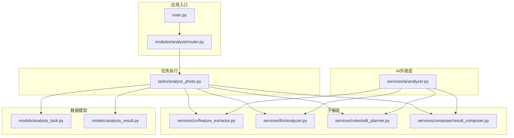
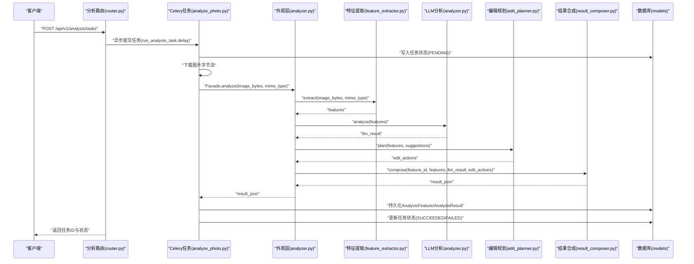
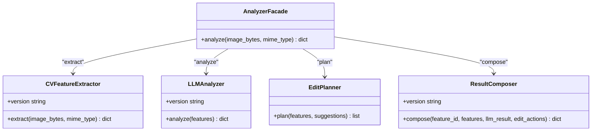
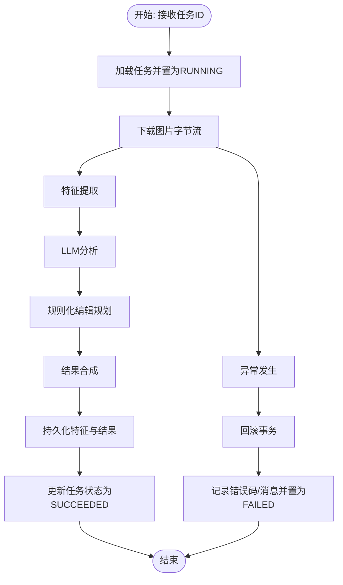
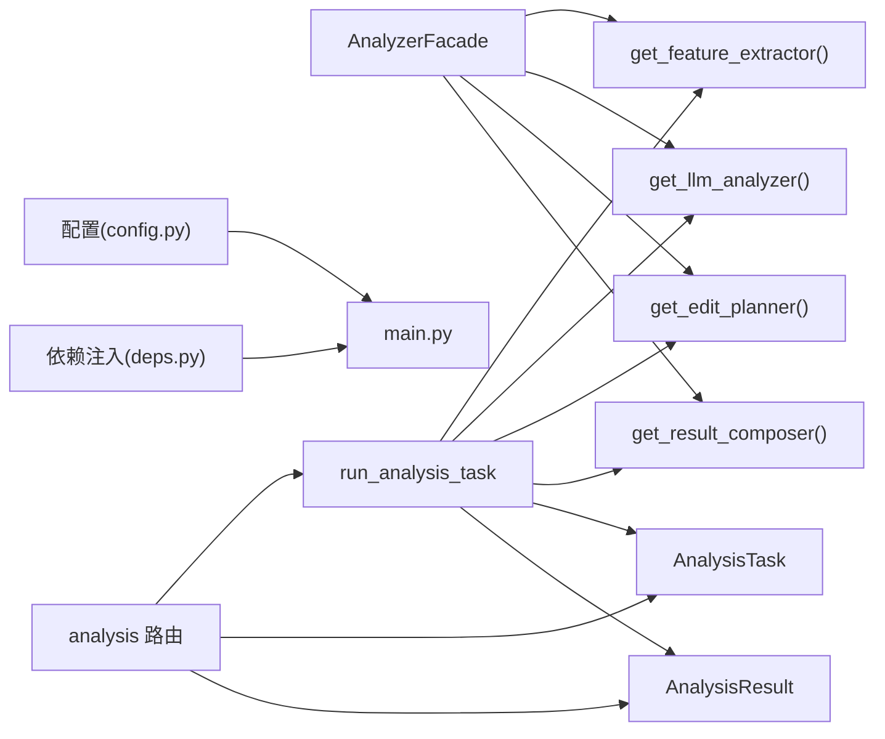

# 分析器外观模式

<cite>
**本文引用的文件**
- [analyzer.py](file://apps/api/app/services/ai/analyzer.py)
- [feature_extractor.py](file://apps/api/app/services/cv/feature_extractor.py)
- [analyzer.py](file://apps/api/app/services/llm/analyzer.py)
- [result_composer.py](file://apps/api/app/services/composer/result_composer.py)
- [edit_planner.py](file://apps/api/app/services/rules/edit_planner.py)
- [analyze_photo.py](file://apps/api/app/tasks/analyze_photo.py)
- [router.py](file://apps/api/app/modules/analysis/router.py)
- [analysis_task.py](file://apps/api/app/models/analysis_task.py)
- [analysis_result.py](file://apps/api/app/models/analysis_result.py)
- [main.py](file://apps/api/app/main.py)
- [config.py](file://apps/api/app/core/config.py)
- [deps.py](file://apps/api/app/deps.py)
- [requirements.txt](file://apps/api/app/requirements.txt)
- [analysis.py](file://apps/api/app/schemas/analysis.py)
</cite>

## 目录
1. [简介](#简介)
2. [项目结构](#项目结构)
3. [核心组件](#核心组件)
4. [架构总览](#架构总览)
5. [详细组件分析](#详细组件分析)
6. [依赖分析](#依赖分析)
7. [性能考量](#性能考量)
8. [故障排查指南](#故障排查指南)
9. [结论](#结论)
10. [附录](#附录)

## 简介
本设计文档围绕 AnalyzerFacade 外观模式展开，系统化阐述其在 AI 分析服务中的作用：如何以统一入口简化复杂 AI 组件的调用与编排，协调计算机视觉特征提取、大模型分析、规则化编辑规划与结果合成等多模块协作。文档还覆盖缓存策略、性能优化、错误传播与恢复、扩展性设计以及客户端调用简化路径。

## 项目结构
该服务采用分层与按功能域划分的组织方式：
- 应用入口与路由：FastAPI 应用注册各模块路由，暴露分析任务的创建、查询与重试接口。
- 业务任务：Celery 任务负责异步执行完整的分析流水线，持久化中间特征与最终结果。
- 服务层：AI 外观层封装多子服务调用；CV、LLM、规则与合成服务各自职责清晰。
- 数据模型：分析任务与结果的 ORM 映射，支持历史查询与状态跟踪。
- 配置与依赖：设置项集中管理，认证依赖注入保障安全访问。

图表来源
- [main.py:1-36](file://apps/api/app/main.py#L1-L36)
- [router.py:1-151](file://apps/api/app/modules/analysis/router.py#L1-L151)
- [analyze_photo.py:1-108](file://apps/api/app/tasks/analyze_photo.py#L1-L108)
- [analyzer.py:10-27](file://apps/api/app/services/ai/analyzer.py#L10-L27)
- [feature_extractor.py:12-98](file://apps/api/app/services/cv/feature_extractor.py#L12-L98)
- [analyzer.py:5-139](file://apps/api/app/services/llm/analyzer.py#L5-L139)
- [edit_planner.py:5-97](file://apps/api/app/services/rules/edit_planner.py#L5-L97)
- [result_composer.py:5-99](file://apps/api/app/services/composer/result_composer.py#L5-L99)
- [analysis_task.py:10-36](file://apps/api/app/models/analysis_task.py#L10-L36)
- [analysis_result.py:10-28](file://apps/api/app/models/analysis_result.py#L10-L28)

章节来源
- [main.py:1-36](file://apps/api/app/main.py#L1-L36)
- [router.py:1-151](file://apps/api/app/modules/analysis/router.py#L1-L151)
- [requirements.txt:1-19](file://apps/api/app/requirements.txt#L1-L19)

## 核心组件
- AnalyzerFacade 外观类：对外提供单一 analyze 接口，内部编排特征提取、LLM 分析、规则化编辑规划与结果合成。
- 缓存工厂函数：每个子服务均提供带 LRU 缓存的工厂函数，确保单例实例与调用性能。
- Celery 异步任务：run_analysis_task 负责从存储下载图片、执行完整分析流水线、持久化特征与结果，并维护任务状态。
- FastAPI 路由：提供创建分析任务、查询任务详情、历史查询与重试接口。
- 数据模型：AnalysisTask 与 AnalysisResult 支持任务生命周期与结果检索。

章节来源
- [analyzer.py:10-27](file://apps/api/app/services/ai/analyzer.py#L10-L27)
- [feature_extractor.py:94-98](file://apps/api/app/services/cv/feature_extractor.py#L94-L98)
- [analyzer.py:135-139](file://apps/api/app/services/llm/analyzer.py#L135-L139)
- [result_composer.py:95-99](file://apps/api/app/services/composer/result_composer.py#L95-L99)
- [edit_planner.py:93-97](file://apps/api/app/services/rules/edit_planner.py#L93-L97)
- [analyze_photo.py:19-108](file://apps/api/app/tasks/analyze_photo.py#L19-L108)
- [router.py:45-151](file://apps/api/app/modules/analysis/router.py#L45-L151)
- [analysis_task.py:10-36](file://apps/api/app/models/analysis_task.py#L10-L36)
- [analysis_result.py:10-28](file://apps/api/app/models/analysis_result.py#L10-L28)

## 架构总览
AnalyzerFacade 将多子服务整合为统一入口，屏蔽调用细节与顺序依赖，使客户端只需一次调用即可获得完整分析结果。同时，系统通过 Celery 任务异步执行，结合数据库持久化与状态管理，实现高可用与可观测性。

图表来源
- [router.py:45-74](file://apps/api/app/modules/analysis/router.py#L45-L74)
- [analyze_photo.py:19-108](file://apps/api/app/tasks/analyze_photo.py#L19-L108)
- [analyzer.py:10-27](file://apps/api/app/services/ai/analyzer.py#L10-L27)
- [feature_extractor.py:15-91](file://apps/api/app/services/cv/feature_extractor.py#L15-L91)
- [analyzer.py:8-118](file://apps/api/app/services/llm/analyzer.py#L8-L118)
- [edit_planner.py:6-34](file://apps/api/app/services/rules/edit_planner.py#L6-L34)
- [result_composer.py:8-23](file://apps/api/app/services/composer/result_composer.py#L8-L23)
- [analysis_task.py:10-36](file://apps/api/app/models/analysis_task.py#L10-L36)
- [analysis_result.py:10-28](file://apps/api/app/models/analysis_result.py#L10-L28)

## 详细组件分析

### 外观层 AnalyzerFacade
- 职责：封装分析流程编排，统一对外接口，隐藏子服务调用细节。
- 流程：依次调用特征提取、LLM 分析、规则化编辑规划，最后合成结果。
- 缓存：通过工厂函数提供单例实例，降低对象创建开销。

图表来源
- [analyzer.py:10-27](file://apps/api/app/services/ai/analyzer.py#L10-L27)
- [feature_extractor.py:12-98](file://apps/api/app/services/cv/feature_extractor.py#L12-L98)
- [analyzer.py:5-139](file://apps/api/app/services/llm/analyzer.py#L5-L139)
- [edit_planner.py:5-97](file://apps/api/app/services/rules/edit_planner.py#L5-L97)
- [result_composer.py:5-99](file://apps/api/app/services/composer/result_composer.py#L5-L99)

章节来源
- [analyzer.py:10-27](file://apps/api/app/services/ai/analyzer.py#L10-L27)

### 计算机视觉特征提取
- 输入：图片二进制与 MIME 类型。
- 输出：图像尺寸、统计信息（亮度、对比度、构图均衡）、主体框、高光/阴影区域、地平线参考线等。
- 特点：基于 PIL 进行图像处理与统计计算，输出结构化特征供后续模块使用。

章节来源
- [feature_extractor.py:15-91](file://apps/api/app/services/cv/feature_extractor.py#L15-L91)

### LLM 分析器
- 输入：特征字典。
- 输出：摘要、建议列表与评分（构图、曝光、色彩、故事性）。
- 规则：根据主体重心与平均亮度生成建议，并计算综合评分。

章节来源
- [analyzer.py:8-118](file://apps/api/app/services/llm/analyzer.py#L8-L118)

### 规则化编辑规划
- 输入：特征与 LLM 建议。
- 输出：编辑动作列表（裁剪、曝光、白平衡等），含参数、预览与非破坏性/破坏性说明。
- 规则：依据主体重心与平均亮度自动给出裁剪与曝光调整方案。

章节来源
- [edit_planner.py:6-34](file://apps/api/app/services/rules/edit_planner.py#L6-L34)

### 结果合成器
- 输入：特征、LLM 结果与编辑动作。
- 输出：统一格式的结果，包含版本、摘要、建议、评分、注释与编辑动作。
- 注释：根据特征生成主体、高光、阴影、地平线等注解，建立建议与注解的关联。

章节来源
- [result_composer.py:8-23](file://apps/api/app/services/composer/result_composer.py#L8-L23)

### 异步分析任务 run_analysis_task
- 生命周期：接收任务ID，更新状态为 RUNNING，下载图片，执行完整分析流水线，持久化特征与结果，最终更新任务状态为 SUCCEEDED 或 FAILED。
- 错误处理：捕获异常，回滚事务，记录错误码与消息，保证状态一致性。
- 数据持久化：AnalysisFeature 存储中间特征，AnalysisResult 存储最终结果。

图表来源
- [analyze_photo.py:20-108](file://apps/api/app/tasks/analyze_photo.py#L20-L108)

章节来源
- [analyze_photo.py:19-108](file://apps/api/app/tasks/analyze_photo.py#L19-L108)

### FastAPI 分析路由
- 创建任务：校验图片归属，写入任务并异步触发分析任务。
- 查询详情：按任务ID查询任务与结果。
- 历史查询：按用户维度分页查询最近分析任务摘要。
- 重试任务：仅允许失败或成功状态的任务进行重试，重置状态并重新调度。

章节来源
- [router.py:45-151](file://apps/api/app/modules/analysis/router.py#L45-L151)

## 依赖分析
- 外观层依赖：AnalyzerFacade 依赖四个子服务的工厂函数，形成清晰的上层聚合。
- 任务依赖：run_analysis_task 同时依赖子服务工厂与数据库模型，承担端到端编排职责。
- 路由依赖：分析路由依赖任务与数据库，提供 REST 接口。
- 配置与认证：配置集中管理，依赖注入提供用户鉴权与数据库会话。

图表来源
- [analyzer.py:10-27](file://apps/api/app/services/ai/analyzer.py#L10-L27)
- [feature_extractor.py:94-98](file://apps/api/app/services/cv/feature_extractor.py#L94-L98)
- [analyzer.py:135-139](file://apps/api/app/services/llm/analyzer.py#L135-L139)
- [edit_planner.py:93-97](file://apps/api/app/services/rules/edit_planner.py#L93-L97)
- [result_composer.py:95-99](file://apps/api/app/services/composer/result_composer.py#L95-L99)
- [analyze_photo.py:19-108](file://apps/api/app/tasks/analyze_photo.py#L19-L108)
- [analysis_task.py:10-36](file://apps/api/app/models/analysis_task.py#L10-L36)
- [analysis_result.py:10-28](file://apps/api/app/models/analysis_result.py#L10-L28)
- [router.py:45-151](file://apps/api/app/modules/analysis/router.py#L45-L151)
- [config.py:6-47](file://apps/api/app/core/config.py#L6-L47)
- [deps.py:15-41](file://apps/api/app/deps.py#L15-L41)
- [main.py:1-36](file://apps/api/app/main.py#L1-L36)

章节来源
- [requirements.txt:1-19](file://apps/api/app/requirements.txt#L1-L19)

## 性能考量
- 单例缓存：各子服务均提供 LRU 缓存的工厂函数，避免重复初始化带来的开销，适合短生命周期请求的高频复用。
- 异步执行：通过 Celery 任务异步处理耗时分析，释放 Web 请求线程，提升吞吐与响应时间稳定性。
- 数据持久化：中间特征与最终结果分别持久化，便于重试与审计，减少重复计算。
- 图像处理：特征提取阶段使用 PIL 快速统计与几何估算，输出结构化特征，降低后续模块的计算负担。
- 评分与建议：评分与建议生成逻辑内聚在 LLM 分析器中，避免跨模块重复计算。

[本节为通用性能讨论，无需列出具体文件来源]

## 故障排查指南
- 任务失败状态：run_analysis_task 捕获异常后回滚事务，记录错误码与消息，并将任务状态置为 FAILED，便于前端展示与重试。
- 权限校验：路由层严格校验任务与图片归属，防止越权访问。
- 重试机制：仅允许失败或成功的任务进行重试，重置状态并重新调度，避免并发冲突。
- 健康检查：应用提供健康检查端点，便于运维监控。

章节来源
- [analyze_photo.py:97-107](file://apps/api/app/tasks/analyze_photo.py#L97-L107)
- [router.py:128-151](file://apps/api/app/modules/analysis/router.py#L128-L151)
- [main.py:32-36](file://apps/api/app/main.py#L32-L36)

## 结论
AnalyzerFacade 外观模式有效简化了 AI 分析服务的调用复杂度，将多子服务的编排逻辑集中在一处，既提升了客户端体验，也增强了系统内聚性与可维护性。配合 Celery 异步任务、数据库持久化与严格的权限控制，系统实现了高可用、可观测与可扩展的分析能力。未来可在以下方面进一步演进：
- 扩展更多 AI 模块（如风格迁移、滤镜推荐）并纳入外观层编排。
- 引入分布式缓存与结果预计算，进一步降低延迟。
- 增加链路追踪与指标埋点，完善可观测性体系。
- 提供分析结果的增量更新与版本对比能力，增强用户体验。

[本节为总结性内容，无需列出具体文件来源]

## 附录
- 客户端调用路径：通过分析路由创建任务，随后轮询任务详情或历史接口获取结果。
- 关键配置：应用名称、API 前缀、数据库与 Redis 连接、S3 存储参数、JWT 密钥与过期时间等。
- 数据模型字段：任务表包含用户ID、图片ID、状态、尝试次数、错误信息与时间戳；结果表包含版本与 JSON 结果。

章节来源
- [router.py:45-151](file://apps/api/app/modules/analysis/router.py#L45-L151)
- [config.py:6-47](file://apps/api/app/core/config.py#L6-L47)
- [analysis_task.py:10-36](file://apps/api/app/models/analysis_task.py#L10-L36)
- [analysis_result.py:10-28](file://apps/api/app/models/analysis_result.py#L10-L28)
- [analysis.py:8-52](file://apps/api/app/schemas/analysis.py#L8-L52)