# 大语言模型分析器

<cite>
**本文引用的文件**
- [apps/api/app/services/llm/analyzer.py](file://apps/api/app/services/llm/analyzer.py)
- [apps/api/app/services/ai/analyzer.py](file://apps/api/app/services/ai/analyzer.py)
- [apps/api/app/services/composer/result_composer.py](file://apps/api/app/services/composer/result_composer.py)
- [apps/api/app/services/cv/feature_extractor.py](file://apps/api/app/services/cv/feature_extractor.py)
- [apps/api/app/services/rules/edit_planner.py](file://apps/api/app/services/rules/edit_planner.py)
- [apps/api/app/tasks/analyze_photo.py](file://apps/api/app/tasks/analyze_photo.py)
- [apps/api/app/modules/analysis/router.py](file://apps/api/app/modules/analysis/router.py)
- [apps/api/app/schemas/analysis.py](file://apps/api/app/schemas/analysis.py)
- [apps/api/app/models/analysis_result.py](file://apps/api/app/models/analysis_result.py)
- [apps/api/app/models/analysis_task.py](file://apps/api/app/models/analysis_task.py)
- [apps/api/app/core/config.py](file://apps/api/app/core/config.py)
- [apps/api/app/core/celery_app.py](file://apps/api/app/core/celery_app.py)
- [apps/api/app/main.py](file://apps/api/app/main.py)
- [packages/contracts/analysis-result.schema.json](file://packages/contracts/analysis-result.schema.json)
- [apps/api/requirements.txt](file://apps/api/requirements.txt)
</cite>

## 目录
1. [简介](#简介)
2. [项目结构](#项目结构)
3. [核心组件](#核心组件)
4. [架构总览](#架构总览)
5. [详细组件分析](#详细组件分析)
6. [依赖分析](#依赖分析)
7. [性能考虑](#性能考虑)
8. [故障排查指南](#故障排查指南)
9. [结论](#结论)
10. [附录](#附录)

## 简介
本项目是一个面向摄影图像的智能分析系统，通过计算机视觉提取图像特征，结合规则引擎与大语言模型（LLM）生成摄影分析建议与评分，并输出标准化的结果结构，供前端展示与自动化编辑动作执行。系统采用异步任务队列进行批处理，支持任务重试、历史查询与结果持久化。

## 项目结构
后端采用 FastAPI + SQLAlchemy + Celery 架构，模块按职责分层：
- API 层：FastAPI 路由与请求响应模型
- 服务层：CV 特征提取、LLM 分析、规则编辑规划、结果组装
- 任务层：Celery 异步任务封装分析流程
- 数据层：数据库模型与迁移
- 配置层：应用配置与 Celery 设置
- 合同层：JSON Schema 定义输出结构契约

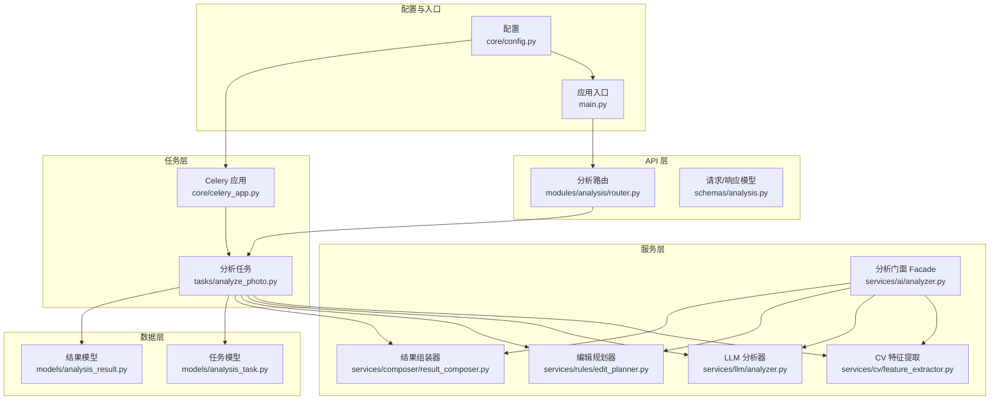

图表来源
- [apps/api/app/modules/analysis/router.py:1-151](file://apps/api/app/modules/analysis/router.py#L1-L151)
- [apps/api/app/tasks/analyze_photo.py:1-108](file://apps/api/app/tasks/analyze_photo.py#L1-L108)
- [apps/api/app/services/ai/analyzer.py:1-27](file://apps/api/app/services/ai/analyzer.py#L1-L27)
- [apps/api/app/services/cv/feature_extractor.py:1-98](file://apps/api/app/services/cv/feature_extractor.py#L1-L98)
- [apps/api/app/services/llm/analyzer.py:1-139](file://apps/api/app/services/llm/analyzer.py#L1-L139)
- [apps/api/app/services/rules/edit_planner.py:1-97](file://apps/api/app/services/rules/edit_planner.py#L1-L97)
- [apps/api/app/services/composer/result_composer.py:1-99](file://apps/api/app/services/composer/result_composer.py#L1-L99)
- [apps/api/app/models/analysis_task.py:1-36](file://apps/api/app/models/analysis_task.py#L1-L36)
- [apps/api/app/models/analysis_result.py:1-28](file://apps/api/app/models/analysis_result.py#L1-L28)
- [apps/api/app/core/celery_app.py:1-21](file://apps/api/app/core/celery_app.py#L1-L21)
- [apps/api/app/core/config.py:1-47](file://apps/api/app/core/config.py#L1-L47)
- [apps/api/app/main.py:1-36](file://apps/api/app/main.py#L1-L36)

章节来源
- [apps/api/app/main.py:1-36](file://apps/api/app/main.py#L1-L36)
- [apps/api/app/core/config.py:1-47](file://apps/api/app/core/config.py#L1-L47)
- [apps/api/app/core/celery_app.py:1-21](file://apps/api/app/core/celery_app.py#L1-L21)

## 核心组件
- CV 特征提取器：从图像字节流中计算亮度、对比度、主体框、高光/阴影区域、地平线参考线等基础特征。
- LLM 分析器：基于特征生成摘要、建议与评分，提供可解释的建议与优先级。
- 规则编辑规划器：根据亮度与主体重心生成可预览的非破坏性/破坏性编辑动作。
- 结果组装器：将特征、LLM 结果、编辑动作与标注统一为标准输出结构。
- 分析门面：串联 CV → LLM → 规划 → 组装的完整流程。
- 异步任务：封装任务状态管理、存储下载、特征持久化与结果落库。
- API 路由：提供任务创建、详情查询、历史列表与重试接口。
- 数据模型：任务与结果的数据库表结构及索引设计。
- 输出契约：JSON Schema 约束输出字段与取值范围。

章节来源
- [apps/api/app/services/cv/feature_extractor.py:1-98](file://apps/api/app/services/cv/feature_extractor.py#L1-L98)
- [apps/api/app/services/llm/analyzer.py:1-139](file://apps/api/app/services/llm/analyzer.py#L1-L139)
- [apps/api/app/services/rules/edit_planner.py:1-97](file://apps/api/app/services/rules/edit_planner.py#L1-L97)
- [apps/api/app/services/composer/result_composer.py:1-99](file://apps/api/app/services/composer/result_composer.py#L1-L99)
- [apps/api/app/services/ai/analyzer.py:1-27](file://apps/api/app/services/ai/analyzer.py#L1-L27)
- [apps/api/app/tasks/analyze_photo.py:1-108](file://apps/api/app/tasks/analyze_photo.py#L1-L108)
- [apps/api/app/modules/analysis/router.py:1-151](file://apps/api/app/modules/analysis/router.py#L1-L151)
- [apps/api/app/models/analysis_task.py:1-36](file://apps/api/app/models/analysis_task.py#L1-L36)
- [apps/api/app/models/analysis_result.py:1-28](file://apps/api/app/models/analysis_result.py#L1-L28)
- [packages/contracts/analysis-result.schema.json:1-76](file://packages/contracts/analysis-result.schema.json#L1-L76)

## 架构总览
系统以“异步任务驱动 + 服务编排”的方式实现图像分析流水线。用户通过 API 创建分析任务，Celery 任务拉取图片、执行 CV 提取、LLM 分析、规则规划与结果组装，最终将结果写入数据库并返回任务详情。

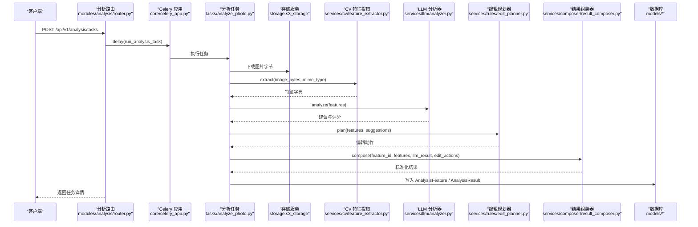

图表来源
- [apps/api/app/modules/analysis/router.py:45-74](file://apps/api/app/modules/analysis/router.py#L45-L74)
- [apps/api/app/core/celery_app.py:5-19](file://apps/api/app/core/celery_app.py#L5-L19)
- [apps/api/app/tasks/analyze_photo.py:19-108](file://apps/api/app/tasks/analyze_photo.py#L19-L108)
- [apps/api/app/services/cv/feature_extractor.py:15-91](file://apps/api/app/services/cv/feature_extractor.py#L15-L91)
- [apps/api/app/services/llm/analyzer.py:8-118](file://apps/api/app/services/llm/analyzer.py#L8-L118)
- [apps/api/app/services/rules/edit_planner.py:6-34](file://apps/api/app/services/rules/edit_planner.py#L6-L34)
- [apps/api/app/services/composer/result_composer.py:8-23](file://apps/api/app/services/composer/result_composer.py#L8-L23)
- [apps/api/app/models/analysis_feature.py:1-28](file://apps/api/app/models/analysis_feature.py#L1-L28)
- [apps/api/app/models/analysis_result.py:10-28](file://apps/api/app/models/analysis_result.py#L10-L28)

## 详细组件分析

### LLM 分析器（LLMAnalyzer）
- 输入：CV 提取的特征字典（图像尺寸、主体框、统计量、高光/阴影区域、地平线等）
- 处理逻辑：
  - 计算主体水平重心与画面宽度的比例，评估构图平衡
  - 基于平均亮度判断曝光是否偏暗/偏亮，给出建议
  - 生成多条建议（构图、曝光、故事性），含问题描述、操作建议与优先级
  - 计算四类评分（构图、曝光、色彩、故事），并限制在 0~100 区间
- 输出：版本号、摘要、建议列表、评分字典

```mermaid
flowchart TD
Start(["输入: features"]) --> Parse["解析 image/subject/stats"]
Parse --> Balance["计算主体重心比例 balance"]
Parse --> Brightness["读取 mean_brightness"]
Balance --> ComposeRule{"balance 是否偏离中心?"}
Brightness --> ExposureRule{"亮度是否偏暗/偏亮?"}
ComposeRule --> |是| AddCompSugg["添加构图建议"]
ComposeRule --> |否| AddCompSugg2["添加轻微收紧建议"]
ExposureRule --> |偏暗| AddExpSugg1["添加提升曝光建议"]
ExposureRule --> |偏亮| AddExpSugg2["添加降低曝光建议"]
ExposureRule --> |正常| AddExpSugg3["微调对比提升层次"]
AddCompSugg --> StorySugg["添加故事性建议"]
AddCompSugg2 --> StorySugg
AddExpSugg1 --> StorySugg
AddExpSugg2 --> StorySugg
AddExpSugg3 --> StorySugg
StorySugg --> Scores["计算 scores(composition/exposure/color/story)"]
Scores --> Out(["输出: version/summary/suggestions/scores"])
```

图表来源
- [apps/api/app/services/llm/analyzer.py:8-132](file://apps/api/app/services/llm/analyzer.py#L8-L132)

章节来源
- [apps/api/app/services/llm/analyzer.py:1-139](file://apps/api/app/services/llm/analyzer.py#L1-L139)

### CV 特征提取器（CVFeatureExtractor）
- 输入：图像字节流与 MIME 类型
- 处理逻辑：
  - 转换为 RGB 并灰度统计，得到平均亮度与对比度
  - 估算主体矩形（固定比例）与中心点
  - 基于亮度阈值估计高光/阴影区域（像素坐标）
  - 生成地平线参考线（近似水平）
- 输出：版本、图像元信息、统计量、主体框、区域与参考线

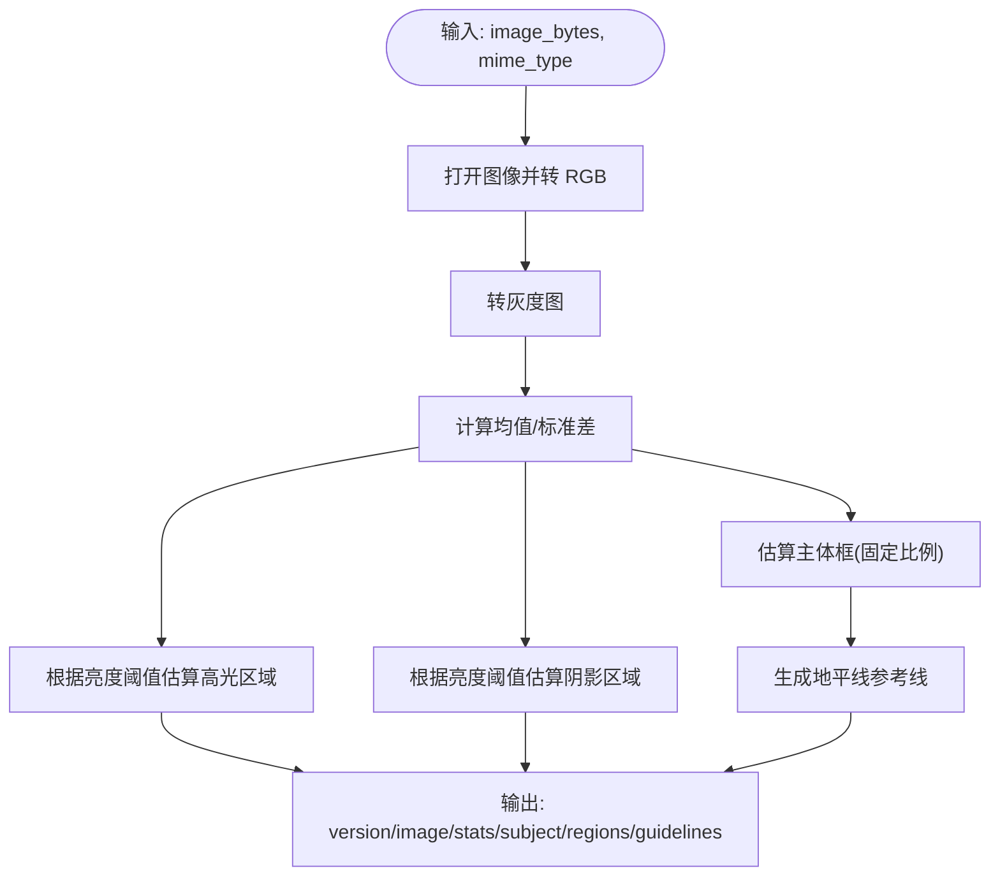

图表来源
- [apps/api/app/services/cv/feature_extractor.py:15-91](file://apps/api/app/services/cv/feature_extractor.py#L15-L91)

章节来源
- [apps/api/app/services/cv/feature_extractor.py:1-98](file://apps/api/app/services/cv/feature_extractor.py#L1-L98)

### 编辑规划器（EditPlanner）
- 输入：特征与 LLM 建议
- 处理逻辑：
  - 若主体重心偏离三分线，规划裁剪动作（非破坏性/破坏性）
  - 若亮度异常，规划曝光调整（非破坏性）
  - 添加白平衡作为稳定基线（非破坏性）
- 输出：编辑动作列表（含 id、类型、参数、原因、可预览性、应用模式）

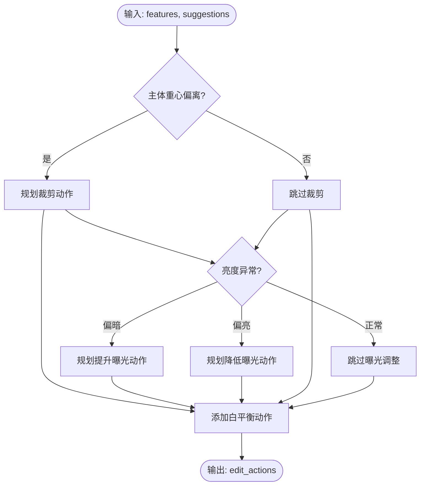

图表来源
- [apps/api/app/services/rules/edit_planner.py:6-90](file://apps/api/app/services/rules/edit_planner.py#L6-L90)

章节来源
- [apps/api/app/services/rules/edit_planner.py:1-97](file://apps/api/app/services/rules/edit_planner.py#L1-L97)

### 结果组装器（ResultComposer）
- 输入：特征 ID、特征字典、LLM 结果、编辑动作
- 处理逻辑：
  - 组合版本、摘要、建议、评分
  - 构建标注：主体框、高光/阴影区域、地平线参考线，关联相关建议
- 输出：标准化结果对象（符合 JSON Schema）

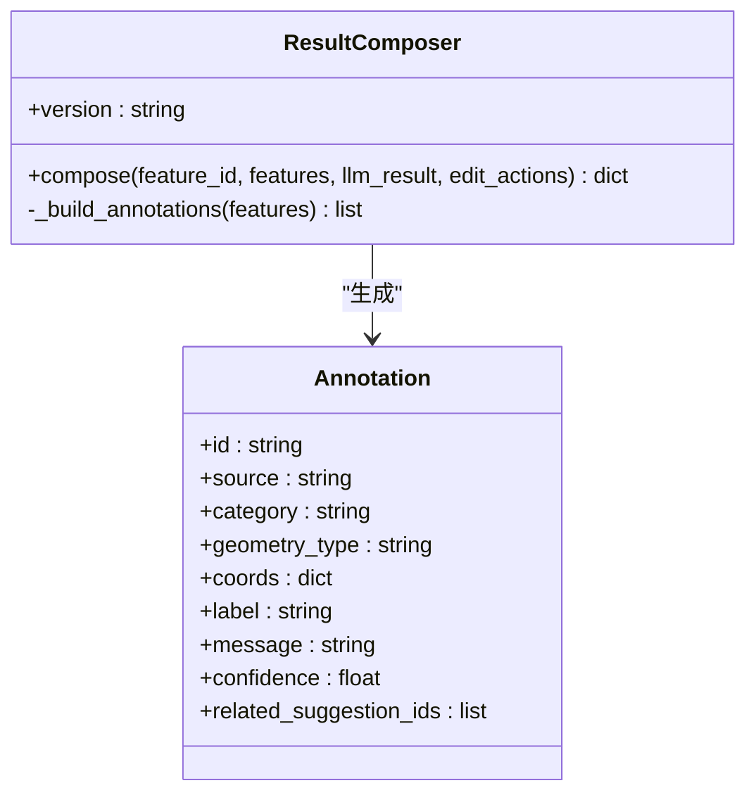

图表来源
- [apps/api/app/services/composer/result_composer.py:5-92](file://apps/api/app/services/composer/result_composer.py#L5-L92)

章节来源
- [apps/api/app/services/composer/result_composer.py:1-99](file://apps/api/app/services/composer/result_composer.py#L1-L99)

### 分析门面（AnalyzerFacade）
- 输入：图像字节流与 MIME 类型
- 处理逻辑：串联 CV → LLM → 规划 → 组装
- 输出：标准化结果

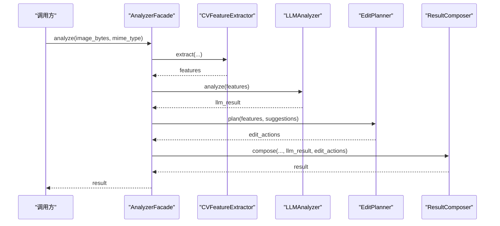

图表来源
- [apps/api/app/services/ai/analyzer.py:10-20](file://apps/api/app/services/ai/analyzer.py#L10-L20)

章节来源
- [apps/api/app/services/ai/analyzer.py:1-27](file://apps/api/app/services/ai/analyzer.py#L1-L27)

### 异步分析任务（run_analysis_task）
- 功能：下载图片 → 提取特征 → LLM 分析 → 规划编辑 → 组装结果 → 写入数据库 → 更新任务状态
- 错误处理：捕获异常，回滚事务，记录错误码与消息，状态置为 FAILED

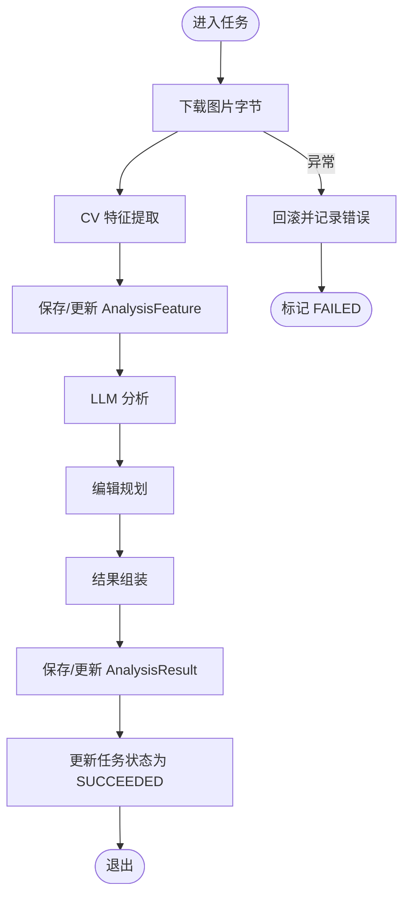

图表来源
- [apps/api/app/tasks/analyze_photo.py:19-108](file://apps/api/app/tasks/analyze_photo.py#L19-L108)

章节来源
- [apps/api/app/tasks/analyze_photo.py:1-108](file://apps/api/app/tasks/analyze_photo.py#L1-L108)

### API 路由与任务管理
- 创建任务：校验图片归属，写入任务记录，投递 Celery 任务
- 查询详情：按任务 ID 获取任务与结果
- 历史列表：按用户与时间倒序列出任务摘要
- 重试任务：仅允许 FAILED/SUCCEEDED 的任务重试

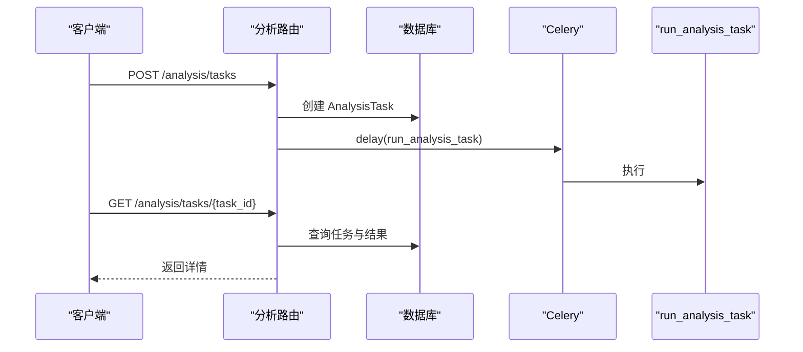

图表来源
- [apps/api/app/modules/analysis/router.py:45-151](file://apps/api/app/modules/analysis/router.py#L45-L151)

章节来源
- [apps/api/app/modules/analysis/router.py:1-151](file://apps/api/app/modules/analysis/router.py#L1-L151)
- [apps/api/app/schemas/analysis.py:1-52](file://apps/api/app/schemas/analysis.py#L1-L52)

### 数据模型与持久化
- AnalysisTask：任务元数据、状态、尝试次数、错误信息、时间戳
- AnalysisResult：任务唯一结果、版本、JSON 结果体、创建时间
- AnalysisFeature：中间特征缓存，与任务/图片关联

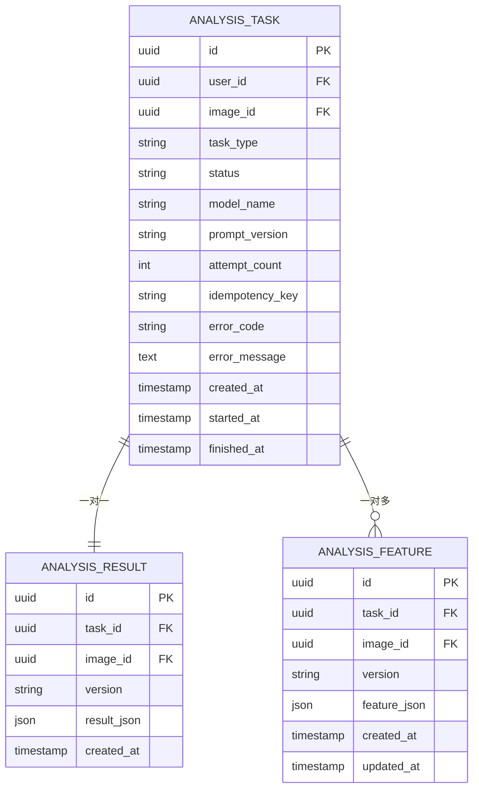

图表来源
- [apps/api/app/models/analysis_task.py:10-35](file://apps/api/app/models/analysis_task.py#L10-L35)
- [apps/api/app/models/analysis_result.py:10-27](file://apps/api/app/models/analysis_result.py#L10-L27)
- [apps/api/app/models/analysis_feature.py:1-28](file://apps/api/app/models/analysis_feature.py#L1-L28)

章节来源
- [apps/api/app/models/analysis_task.py:1-36](file://apps/api/app/models/analysis_task.py#L1-L36)
- [apps/api/app/models/analysis_result.py:1-28](file://apps/api/app/models/analysis_result.py#L1-L28)

### 输出格式标准化与解释性
- JSON Schema 约束：要求 version、summary、suggestions、scores、annotations、edit_actions 存在；scores 与 annotations 为对象或数组
- 建议字段：id、type（枚举）、text、problem、action、priority（高/中/低）
- 标注字段：几何类型（bbox/line）、坐标系、置信度、关联建议
- 解释性：标注 message 说明来源与用途；编辑动作包含 reason 与 apply_mode，便于前端展示与用户理解

章节来源
- [packages/contracts/analysis-result.schema.json:1-76](file://packages/contracts/analysis-result.schema.json#L1-L76)
- [apps/api/app/services/composer/result_composer.py:26-92](file://apps/api/app/services/composer/result_composer.py#L26-L92)
- [apps/api/app/services/rules/edit_planner.py:21-32](file://apps/api/app/services/rules/edit_planner.py#L21-L32)

## 依赖分析
- 外部依赖：FastAPI、SQLAlchemy、Celery、Redis、Pillow、Pydantic Settings、Alembic、boto3（S3）
- 内部模块耦合：API 路由依赖任务；任务依赖服务层；服务层彼此独立并通过门面组合；结果与特征模型持久化到数据库
- 配置注入：通过 Settings 提供模型名称、提示版本、CORS、S3、JWT 等配置

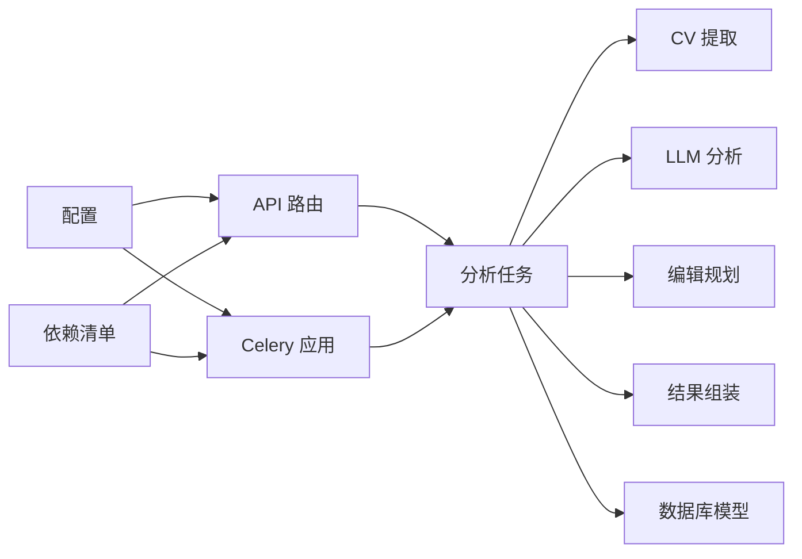

图表来源
- [apps/api/requirements.txt:1-19](file://apps/api/requirements.txt#L1-L19)
- [apps/api/app/modules/analysis/router.py:1-151](file://apps/api/app/modules/analysis/router.py#L1-L151)
- [apps/api/app/tasks/analyze_photo.py:1-108](file://apps/api/app/tasks/analyze_photo.py#L1-L108)
- [apps/api/app/core/celery_app.py:1-21](file://apps/api/app/core/celery_app.py#L1-L21)
- [apps/api/app/core/config.py:1-47](file://apps/api/app/core/config.py#L1-L47)

章节来源
- [apps/api/requirements.txt:1-19](file://apps/api/requirements.txt#L1-L19)
- [apps/api/app/core/config.py:1-47](file://apps/api/app/core/config.py#L1-L47)
- [apps/api/app/core/celery_app.py:1-21](file://apps/api/app/core/celery_app.py#L1-L21)

## 性能考虑
- 缓存：各服务通过 lru_cache(maxsize=1) 缓存单例实例，降低重复初始化开销
- 图像处理：使用 Pillow 进行灰度统计与裁剪区域估算，避免复杂深度学习推理
- 异步化：分析任务放入 Celery 队列，避免阻塞 API 请求
- 数据库：为分析任务与结果建立复合索引，加速查询与排序
- 可扩展性：建议将 LLM 分析替换为外部模型服务时，通过配置项切换并增加超时与重试策略

## 故障排查指南
- 任务失败：查看 AnalysisTask 的 error_code 与 error_message 字段，定位异常类型与简要信息
- 图片缺失：确认 ImageAsset 存在且与当前用户绑定，检查存储服务连接与对象键
- 特征为空：确认 CV 提取未抛出异常，检查图像字节与 MIME 类型
- 结果未落库：确认数据库事务提交路径，检查 AnalysisResult 写入逻辑
- 重试机制：仅 FAILED/SUCCEEDED 的任务可重试，确保任务状态正确

章节来源
- [apps/api/app/tasks/analyze_photo.py:97-107](file://apps/api/app/tasks/analyze_photo.py#L97-L107)
- [apps/api/app/modules/analysis/router.py:128-151](file://apps/api/app/modules/analysis/router.py#L128-L151)
- [apps/api/app/models/analysis_task.py:26-30](file://apps/api/app/models/analysis_task.py#L26-L30)

## 结论
该系统以“CV 特征 + 规则 + LLM 生成”的混合方式实现了高质量的摄影分析与建议生成。通过标准化输出契约与可追溯的标注/动作，提升了结果的解释性与可复现性。异步任务与数据库持久化保障了稳定性与可观测性。未来可在以下方面持续改进：
- 将 LLM 分析接入外部模型服务，支持温度参数与提示版本动态配置
- 增加 A/B 测试与反馈收集，持续优化建议与评分算法
- 扩展更多摄影风格与场景的规则与建议模板
- 加强错误监控与告警，完善可观测性体系

## 附录

### 提示工程与上下文构建思路
- 上下文来源：图像尺寸、主体位置、亮度/对比度、高光/阴影区域、地平线参考线
- 建议生成：基于规则的条件分支，结合优先级与可操作性描述
- 评分计算：综合构图、曝光、色彩与故事性，映射到 0~100 区间

章节来源
- [apps/api/app/services/llm/analyzer.py:8-132](file://apps/api/app/services/llm/analyzer.py#L8-L132)
- [apps/api/app/services/cv/feature_extractor.py:15-91](file://apps/api/app/services/cv/feature_extractor.py#L15-L91)

### 与外部 AI 服务的集成方式
- 当前实现：本地规则与 LLM 分析器，未直接调用外部模型
- 接入建议：通过配置项指定模型名称与提示版本；在 LLM 分析器中替换为外部调用（如 HTTP 客户端），传入上下文与参数，接收结构化响应并映射到现有输出格式

章节来源
- [apps/api/app/core/config.py:22-23](file://apps/api/app/core/config.py#L22-L23)
- [apps/api/app/modules/analysis/router.py:63-64](file://apps/api/app/modules/analysis/router.py#L63-L64)

### 模型配置选项与温度参数
- 配置项：model_name、prompt_version（当前用于任务记录，未在分析流程中直接使用）
- 温度参数：当前未启用；建议在外部模型调用时作为可配置参数，配合提示版本进行 A/B 实验

章节来源
- [apps/api/app/core/config.py:22-23](file://apps/api/app/core/config.py#L22-L23)
- [apps/api/app/modules/analysis/router.py:63-64](file://apps/api/app/modules/analysis/router.py#L63-L64)

### 输出质量控制方法
- JSON Schema 校验：前端与下游系统可据此验证输出完整性
- 标注与动作：通过 confidence 与 related_suggestion_ids 提升可追溯性
- 评分一致性：对边界值进行截断与归一化，保证跨图像可比性

章节来源
- [packages/contracts/analysis-result.schema.json:1-76](file://packages/contracts/analysis-result.schema.json#L1-L76)
- [apps/api/app/services/composer/result_composer.py:26-92](file://apps/api/app/services/composer/result_composer.py#L26-L92)
- [apps/api/app/services/llm/analyzer.py:121-132](file://apps/api/app/services/llm/analyzer.py#L121-L132)