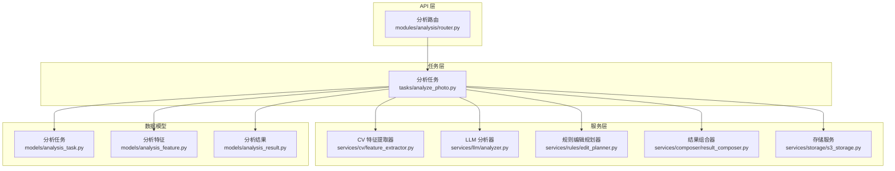
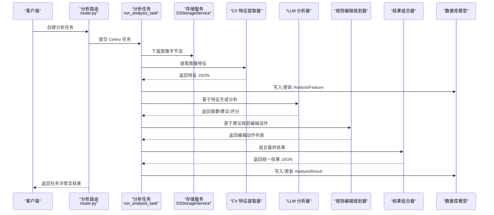
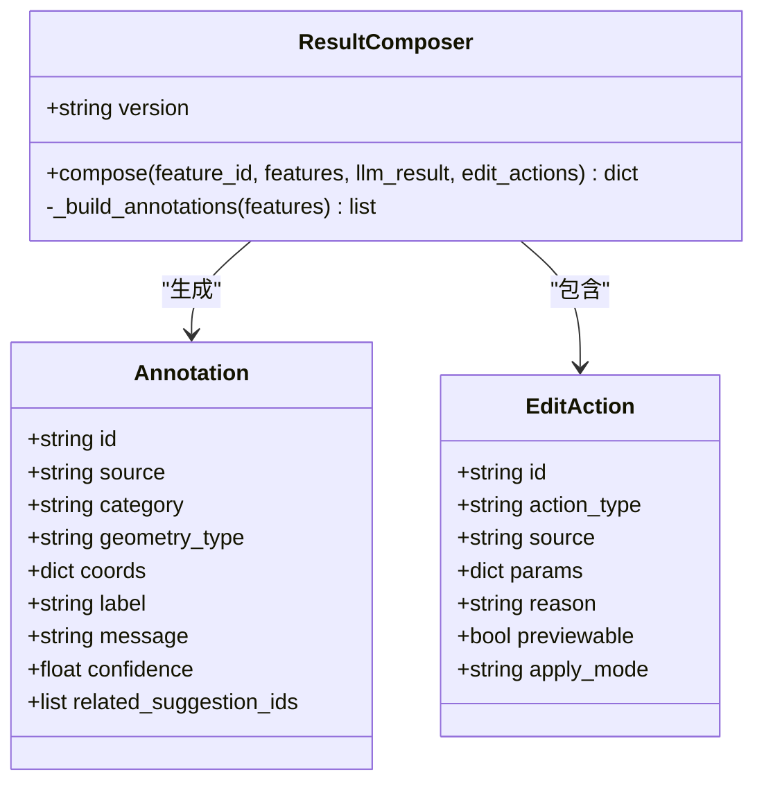
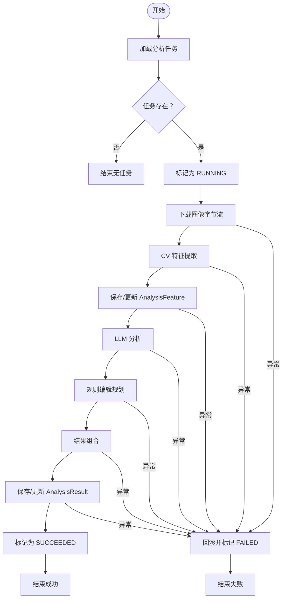
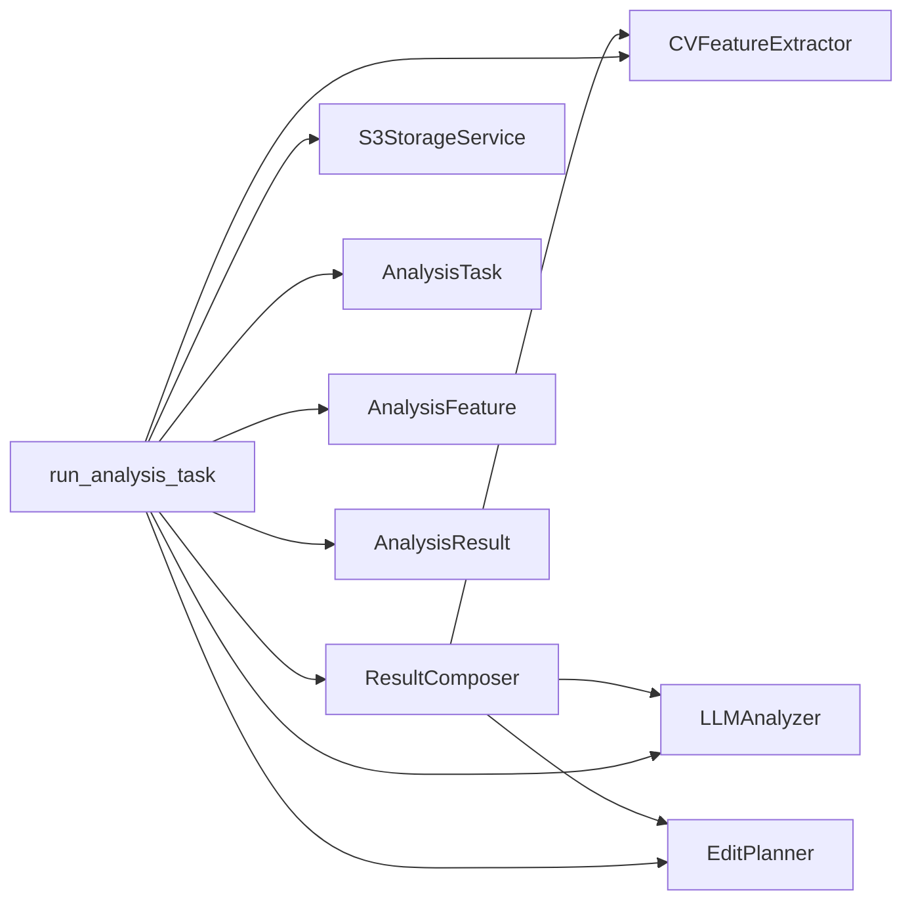

# 结果组合器模块

<cite>
**本文引用的文件**
- [apps/api/app/services/composer/result_composer.py](file://apps/api/app/services/composer/result_composer.py)
- [apps/api/app/services/cv/feature_extractor.py](file://apps/api/app/services/cv/feature_extractor.py)
- [apps/api/app/services/llm/analyzer.py](file://apps/api/app/services/llm/analyzer.py)
- [apps/api/app/services/rules/edit_planner.py](file://apps/api/app/services/rules/edit_planner.py)
- [apps/api/app/tasks/analyze_photo.py](file://apps/api/app/tasks/analyze_photo.py)
- [apps/api/app/modules/analysis/router.py](file://apps/api/app/modules/analysis/router.py)
- [apps/api/app/models/analysis_result.py](file://apps/api/app/models/analysis_result.py)
- [apps/api/app/models/analysis_feature.py](file://apps/api/app/models/analysis_feature.py)
- [apps/api/app/models/analysis_task.py](file://apps/api/app/models/analysis_task.py)
- [apps/api/app/services/storage/s3_storage.py](file://apps/api/app/services/storage/s3_storage.py)
- [packages/contracts/analysis-result.schema.json](file://packages/contracts/analysis-result.schema.json)
- [packages/contracts/annotation.schema.json](file://packages/contracts/annotation.schema.json)
- [packages/contracts/edit-action.schema.json](file://packages/contracts/edit-action.schema.json)
- [apps/api/app/core/config.py](file://apps/api/app/core/config.py)
</cite>

## 目录
1. [简介](#简介)
2. [项目结构](#项目结构)
3. [核心组件](#核心组件)
4. [架构总览](#架构总览)
5. [详细组件分析](#详细组件分析)
6. [依赖关系分析](#依赖关系分析)
7. [性能考量](#性能考量)
8. [故障排查指南](#故障排查指南)
9. [结论](#结论)
10. [附录](#附录)

## 简介
本文件针对“结果组合器模块”进行深入技术说明，聚焦于如何将计算机视觉特征、大语言模型（LLM）分析结果与规则引擎编辑建议整合为统一的分析报告。内容涵盖数据结构设计、字段映射规则与格式标准化、结果验证与完整性检查、错误恢复策略、配置选项、输出格式定制以及性能优化方法，并解释分析结果的可视化准备、元数据管理与用户体验优化。

## 项目结构
该模块位于后端服务的 composer 子目录中，围绕分析任务生命周期组织：从任务创建、图像下载、特征提取、LLM 分析、规则编辑规划到最终结果组合与持久化。API 路由负责对外暴露分析接口，Celery 任务负责异步执行完整分析流水线。

图表来源
- [apps/api/app/modules/analysis/router.py:1-151](file://apps/api/app/modules/analysis/router.py#L1-L151)
- [apps/api/app/tasks/analyze_photo.py:1-108](file://apps/api/app/tasks/analyze_photo.py#L1-L108)
- [apps/api/app/services/composer/result_composer.py:1-99](file://apps/api/app/services/composer/result_composer.py#L1-L99)
- [apps/api/app/services/cv/feature_extractor.py:1-98](file://apps/api/app/services/cv/feature_extractor.py#L1-L98)
- [apps/api/app/services/llm/analyzer.py:1-139](file://apps/api/app/services/llm/analyzer.py#L1-L139)
- [apps/api/app/services/rules/edit_planner.py:1-97](file://apps/api/app/services/rules/edit_planner.py#L1-L97)
- [apps/api/app/services/storage/s3_storage.py:1-59](file://apps/api/app/services/storage/s3_storage.py#L1-L59)
- [apps/api/app/models/analysis_task.py:1-36](file://apps/api/app/models/analysis_task.py#L1-L36)
- [apps/api/app/models/analysis_feature.py:1-29](file://apps/api/app/models/analysis_feature.py#L1-L29)
- [apps/api/app/models/analysis_result.py:1-28](file://apps/api/app/models/analysis_result.py#L1-L28)

章节来源
- [apps/api/app/modules/analysis/router.py:1-151](file://apps/api/app/modules/analysis/router.py#L1-L151)
- [apps/api/app/tasks/analyze_photo.py:1-108](file://apps/api/app/tasks/analyze_photo.py#L1-L108)

## 核心组件
- 结果组合器（ResultComposer）
  - 职责：将特征、LLM 结果与编辑动作整合为统一的分析报告对象；生成注解（annotations）列表，映射 CV 输出到标注结构。
  - 关键点：版本号固定；从 LLM 结果抽取摘要、建议与可选评分；构建 features_ref 引用；调用内部方法生成注解数组。
- 计算机视觉特征提取器（CVFeatureExtractor）
  - 职责：从图像字节流中提取统计与几何特征，包括主体框、高光/阴影区域、地平线参考线等。
  - 关键点：返回标准结构，包含坐标系、尺寸、统计值与指导线。
- LLM 分析器（LLMAnalyzer）
  - 职责：基于 CV 特征生成自然语言摘要、建议列表与评分体系。
  - 关键点：综合主体重心与亮度分布，生成多条建议；计算构图、曝光、色彩、故事性评分。
- 规则编辑规划器（EditPlanner）
  - 职责：根据特征与建议生成可执行的编辑动作（裁剪、曝光、白平衡等），并标注预览与应用模式。
  - 关键点：自动裁剪与曝光调整策略明确，参数可直接用于前端或下游编辑器。
- 任务编排（run_analysis_task）
  - 职责：串联上述组件，完成特征提取、LLM 分析、规则规划与结果组合，并持久化到数据库。
  - 关键点：异常捕获与状态回滚；幂等写入特征与结果记录；支持重试。
- API 路由（Analysis Router）
  - 职责：对外提供创建任务、查询详情、历史查询与重试接口；返回标准化响应模型。
  - 关键点：鉴权与权限控制；结果序列化与摘要提取。

章节来源
- [apps/api/app/services/composer/result_composer.py:1-99](file://apps/api/app/services/composer/result_composer.py#L1-L99)
- [apps/api/app/services/cv/feature_extractor.py:1-98](file://apps/api/app/services/cv/feature_extractor.py#L1-L98)
- [apps/api/app/services/llm/analyzer.py:1-139](file://apps/api/app/services/llm/analyzer.py#L1-L139)
- [apps/api/app/services/rules/edit_planner.py:1-97](file://apps/api/app/services/rules/edit_planner.py#L1-L97)
- [apps/api/app/tasks/analyze_photo.py:1-108](file://apps/api/app/tasks/analyze_photo.py#L1-L108)
- [apps/api/app/modules/analysis/router.py:1-151](file://apps/api/app/modules/analysis/router.py#L1-L151)

## 架构总览
下图展示从用户请求到最终结果返回的完整流程，包括数据流与关键决策点。

图表来源
- [apps/api/app/modules/analysis/router.py:45-73](file://apps/api/app/modules/analysis/router.py#L45-L73)
- [apps/api/app/tasks/analyze_photo.py:19-108](file://apps/api/app/tasks/analyze_photo.py#L19-L108)
- [apps/api/app/services/storage/s3_storage.py:45-50](file://apps/api/app/services/storage/s3_storage.py#L45-L50)
- [apps/api/app/services/cv/feature_extractor.py:15-91](file://apps/api/app/services/cv/feature_extractor.py#L15-L91)
- [apps/api/app/services/llm/analyzer.py:8-118](file://apps/api/app/services/llm/analyzer.py#L8-L118)
- [apps/api/app/services/rules/edit_planner.py:6-34](file://apps/api/app/services/rules/edit_planner.py#L6-L34)
- [apps/api/app/services/composer/result_composer.py:8-23](file://apps/api/app/services/composer/result_composer.py#L8-L23)
- [apps/api/app/models/analysis_result.py:10-27](file://apps/api/app/models/analysis_result.py#L10-L27)
- [apps/api/app/models/analysis_feature.py:10-28](file://apps/api/app/models/analysis_feature.py#L10-L28)

## 详细组件分析

### 结果组合器（ResultComposer）
- 数据结构设计
  - 输出对象包含版本、摘要、建议、可选评分、特征引用、注解数组与编辑动作数组。
  - 注解（annotations）从 CV 特征中抽取主体、高光、阴影、地平线等几何信息，标注来源、类别、置信度与关联建议 ID。
- 字段映射规则
  - 摘要与建议直接来自 LLM 结果；评分可选；特征引用指向 AnalysisFeature 的主键。
  - 注解的几何类型依据实际数据选择 bbox 或 line；坐标系统一为 image_pixels。
- 格式标准化
  - 所有注解与编辑动作均遵循对应 JSON Schema，确保字段完整性与类型一致性。
- 错误处理
  - 组合器本身无外部依赖，错误主要来自上游输入缺失或格式不符；建议在上游阶段严格校验。
- 性能优化
  - 使用 LRU 缓存实例化单例，降低重复初始化开销。

图表来源
- [apps/api/app/services/composer/result_composer.py:5-99](file://apps/api/app/services/composer/result_composer.py#L5-L99)
- [packages/contracts/annotation.schema.json:1-60](file://packages/contracts/annotation.schema.json#L1-L60)
- [packages/contracts/edit-action.schema.json:1-30](file://packages/contracts/edit-action.schema.json#L1-L30)

章节来源
- [apps/api/app/services/composer/result_composer.py:1-99](file://apps/api/app/services/composer/result_composer.py#L1-L99)
- [packages/contracts/annotation.schema.json:1-60](file://packages/contracts/annotation.schema.json#L1-L60)
- [packages/contracts/edit-action.schema.json:1-30](file://packages/contracts/edit-action.schema.json#L1-L30)

### 计算机视觉特征提取器（CVFeatureExtractor）
- 功能要点
  - 计算平均亮度、对比度、主体包围盒、高光/阴影区域与地平线参考线。
  - 返回统一结构，便于 LLM 与规则引擎消费。
- 复杂度
  - 时间复杂度近似 O(W×H)，其中 W、H 为图像宽高；主要受像素访问与统计计算影响。
- 优化建议
  - 对于超大图像，可在进入算法前按比例缩放；缓存统计结果以复用。

章节来源
- [apps/api/app/services/cv/feature_extractor.py:1-98](file://apps/api/app/services/cv/feature_extractor.py#L1-L98)

### LLM 分析器（LLMAnalyzer）
- 功能要点
  - 基于主体重心与亮度分布生成摘要与建议；计算构图、曝光、色彩、故事性评分。
- 复杂度
  - 纯逻辑计算，时间复杂度近似 O(1)。
- 优化建议
  - 将规则参数化，便于通过配置调整阈值与权重；支持多语言摘要输出。

章节来源
- [apps/api/app/services/llm/analyzer.py:1-139](file://apps/api/app/services/llm/analyzer.py#L1-L139)

### 规则编辑规划器（EditPlanner）
- 功能要点
  - 自动裁剪：根据主体重心偏移计算目标裁剪框，使主体靠近黄金分割线。
  - 自动曝光：根据平均亮度阈值决定提升或降低曝光。
  - 白平衡：提供轻量非破坏性白平衡动作作为补充。
- 复杂度
  - 纯几何与阈值判断，O(1)。
- 优化建议
  - 支持更多编辑动作类型（对比度、饱和度等）；增强动作参数的自适应范围。

章节来源
- [apps/api/app/services/rules/edit_planner.py:1-97](file://apps/api/app/services/rules/edit_planner.py#L1-L97)

### 任务编排（run_analysis_task）
- 流程要点
  - 下载图像 → 提取特征 → 写入 AnalysisFeature → LLM 分析 → 规则规划 → 组合结果 → 写入 AnalysisResult → 更新任务状态。
- 完整性检查
  - 任务存在性校验；图像存在性校验；特征与结果的版本号写入。
- 错误恢复
  - 捕获异常并回滚；设置失败状态与错误码/消息；支持重试。
- 幂等性
  - 若已存在 AnalysisFeature/AnalysisResult，则更新而非重复插入。

图表来源
- [apps/api/app/tasks/analyze_photo.py:19-108](file://apps/api/app/tasks/analyze_photo.py#L19-L108)

章节来源
- [apps/api/app/tasks/analyze_photo.py:1-108](file://apps/api/app/tasks/analyze_photo.py#L1-L108)

### API 路由（Analysis Router）
- 功能要点
  - 创建任务：鉴权校验后提交 Celery 任务。
  - 查询详情：返回任务状态、模型名、提示词版本、尝试次数、错误信息与最终结果。
  - 历史查询：分页返回最近分析任务摘要。
  - 重试：仅允许失败或成功的任务重试。
- 响应模型
  - 使用 Pydantic 模型保证输出结构一致与类型安全。

章节来源
- [apps/api/app/modules/analysis/router.py:1-151](file://apps/api/app/modules/analysis/router.py#L1-L151)

## 依赖关系分析
- 组件耦合
  - ResultComposer 与上游三者（CV、LLM、规则）松耦合，仅依赖约定的数据结构。
  - run_analysis_task 作为编排器，集中协调各服务与数据库交互。
- 外部依赖
  - S3 存储用于图像读写；PostgreSQL 用于持久化任务、特征与结果。
- 可能的循环依赖
  - 当前模块未见循环导入；服务通过工厂函数获取实例，避免直接相互引用。

图表来源
- [apps/api/app/services/composer/result_composer.py:1-99](file://apps/api/app/services/composer/result_composer.py#L1-L99)
- [apps/api/app/services/cv/feature_extractor.py:1-98](file://apps/api/app/services/cv/feature_extractor.py#L1-L98)
- [apps/api/app/services/llm/analyzer.py:1-139](file://apps/api/app/services/llm/analyzer.py#L1-L139)
- [apps/api/app/services/rules/edit_planner.py:1-97](file://apps/api/app/services/rules/edit_planner.py#L1-L97)
- [apps/api/app/tasks/analyze_photo.py:1-108](file://apps/api/app/tasks/analyze_photo.py#L1-L108)
- [apps/api/app/services/storage/s3_storage.py:1-59](file://apps/api/app/services/storage/s3_storage.py#L1-L59)
- [apps/api/app/models/analysis_task.py:1-36](file://apps/api/app/models/analysis_task.py#L1-L36)
- [apps/api/app/models/analysis_feature.py:1-29](file://apps/api/app/models/analysis_feature.py#L1-L29)
- [apps/api/app/models/analysis_result.py:1-28](file://apps/api/app/models/analysis_result.py#L1-L28)

## 性能考量
- 缓存与实例化
  - 各服务均使用 LRU 缓存单例，减少重复初始化成本。
- I/O 优化
  - S3 客户端连接与读取超时配置合理；建议对热点图像进行本地缓存或 CDN 加速。
- 数据库索引
  - AnalysisFeature 与 AnalysisResult 的 JSON 字段建立 GIN 索引，有利于检索与聚合。
- 任务并发
  - 建议通过 Celery 配置并发数与队列隔离，避免 CPU 密集型与 I/O 密集型任务互相阻塞。
- 图像处理
  - 对超大图像进行预缩放；批量处理时复用内存缓冲区。

## 故障排查指南
- 常见问题
  - 图像存储不可用：S3 客户端抛出异常，API 返回 503；检查 endpoint、密钥与桶是否存在。
  - 任务状态异常：FAILED 时检查 error_code 与 error_message；必要时触发重试。
  - 结果为空：确认 AnalysisResult 是否已写入；核对版本号与 JSON Schema。
- 排查步骤
  - 检查 run_analysis_task 日志与数据库状态变更。
  - 验证 CV/LLM/规则输出是否符合预期结构。
  - 使用 JSON Schema 校验最终结果，定位缺失字段或类型错误。
- 恢复策略
  - 重试失败任务；清理脏数据后重新运行；必要时手动注入测试数据验证流程。

章节来源
- [apps/api/app/services/storage/s3_storage.py:11-59](file://apps/api/app/services/storage/s3_storage.py#L11-L59)
- [apps/api/app/tasks/analyze_photo.py:97-107](file://apps/api/app/tasks/analyze_photo.py#L97-L107)
- [packages/contracts/analysis-result.schema.json:1-76](file://packages/contracts/analysis-result.schema.json#L1-L76)

## 结论
结果组合器模块通过清晰的数据契约与严格的格式校验，将 CV、LLM 与规则引擎的输出整合为统一的分析报告。配合完善的任务编排、数据库持久化与 API 接口，实现了从图像到可执行建议的闭环。建议在生产环境中进一步完善配置项、扩展编辑动作类型与多语言支持，并持续优化图像处理与存储性能。

## 附录

### 输出格式与字段规范
- 分析结果 JSON Schema
  - 必填字段：version、summary、suggestions、scores、annotations、edit_actions。
  - scores：包含 composition、exposure、color、story 等评分对象。
  - features_ref：包含 feature_id 引用。
- 注解 JSON Schema
  - 必填字段：id、source、category、geometry_type、coords、label、message、confidence。
  - 支持的 source：cv、llm、rule；category：composition、exposure、color、story、guideline、detail、crop；geometry_type：bbox、point、line、polygon。
- 编辑动作 JSON Schema
  - 必填字段：id、action_type、source、params、reason、previewable、apply_mode。
  - 支持的 action_type：crop、exposure、white_balance、contrast、saturation；apply_mode：destructive、non_destructive。

章节来源
- [packages/contracts/analysis-result.schema.json:1-76](file://packages/contracts/analysis-result.schema.json#L1-L76)
- [packages/contracts/annotation.schema.json:1-60](file://packages/contracts/annotation.schema.json#L1-L60)
- [packages/contracts/edit-action.schema.json:1-30](file://packages/contracts/edit-action.schema.json#L1-L30)

### 配置选项与环境变量
- 关键配置
  - 数据库连接、Redis 连接、S3 端点与凭证、桶名、区域。
  - 模型名称与提示词版本，用于任务记录。
  - CORS 允许的源列表。
- 建议
  - 生产环境务必覆盖默认密钥与端点；启用 HTTPS 与最小权限访问。

章节来源
- [apps/api/app/core/config.py:1-47](file://apps/api/app/core/config.py#L1-L47)