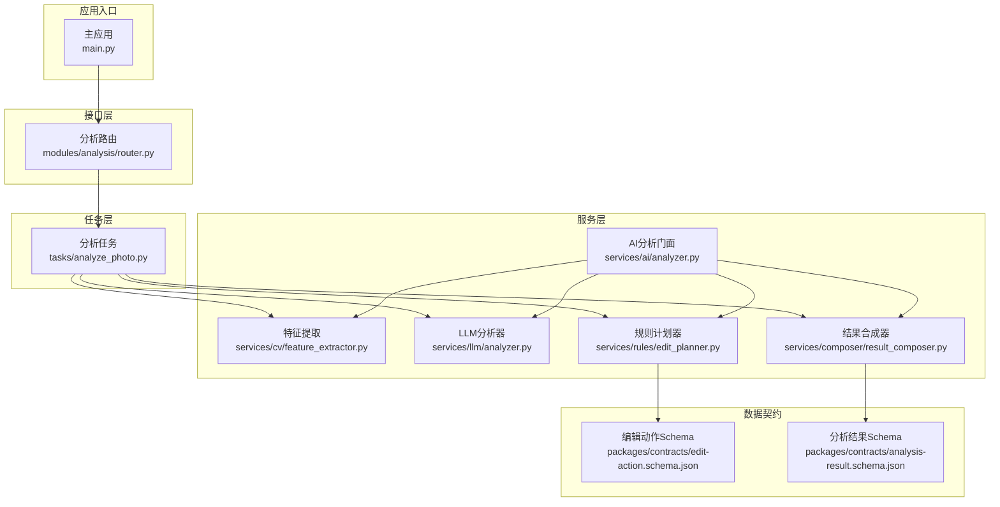
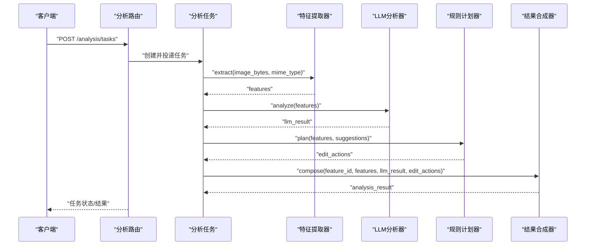
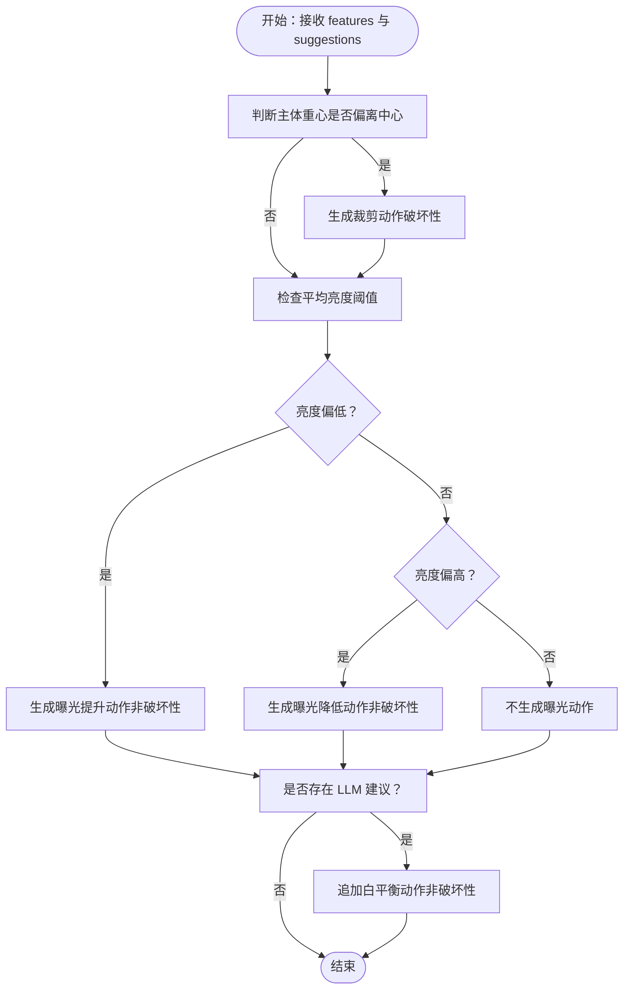
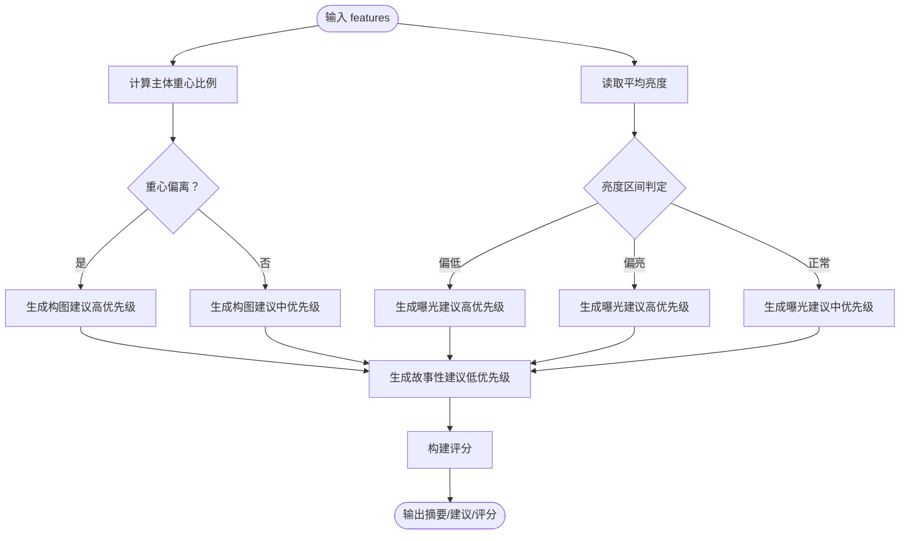
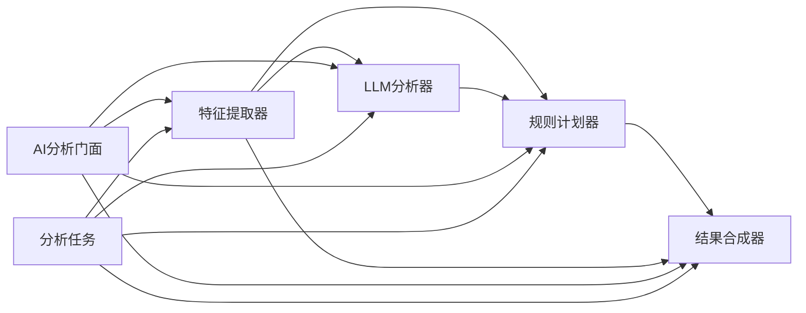

# 规则引擎模块

<cite>
**本文引用的文件**
- [apps/api/app/services/rules/edit_planner.py](file://apps/api/app/services/rules/edit_planner.py)
- [apps/api/app/services/llm/analyzer.py](file://apps/api/app/services/llm/analyzer.py)
- [apps/api/app/services/cv/feature_extractor.py](file://apps/api/app/services/cv/feature_extractor.py)
- [apps/api/app/services/composer/result_composer.py](file://apps/api/app/services/composer/result_composer.py)
- [apps/api/app/services/ai/analyzer.py](file://apps/api/app/services/ai/analyzer.py)
- [apps/api/app/tasks/analyze_photo.py](file://apps/api/app/tasks/analyze_photo.py)
- [apps/api/app/modules/analysis/router.py](file://apps/api/app/modules/analysis/router.py)
- [apps/api/app/main.py](file://apps/api/app/main.py)
- [packages/contracts/edit-action.schema.json](file://packages/contracts/edit-action.schema.json)
- [packages/contracts/analysis-result.schema.json](file://packages/contracts/analysis-result.schema.json)
- [apps/api/app/models/analysis_feature.py](file://apps/api/app/models/analysis_feature.py)
</cite>

## 目录
1. [简介](#简介)
2. [项目结构](#项目结构)
3. [核心组件](#核心组件)
4. [架构总览](#架构总览)
5. [详细组件分析](#详细组件分析)
6. [依赖分析](#依赖分析)
7. [性能考虑](#性能考虑)
8. [故障排查指南](#故障排查指南)
9. [结论](#结论)
10. [附录](#附录)

## 简介
本文件面向“规则引擎模块”，聚焦于编辑计划制定的规则体系与实现，涵盖以下主题：
- 规则体系：曝光补偿、色彩校正（白平衡）、构图建议（自动裁剪）等摄影编辑规则
- 规则匹配算法、优先级排序与冲突解决机制
- 规则配置的灵活性设计、自定义规则扩展与动态规则加载思路
- 性能优化、缓存策略与实时调整能力
- 规则与LLM建议的融合方式及最终编辑动作的生成流程

该模块以“特征提取 → LLM建议 → 规则计划 → 结果合成”的流水线为核心，通过统一的数据契约保证各组件间协作的一致性。

## 项目结构
规则引擎所在的应用服务位于后端API工程中，采用分层与模块化组织：
- 服务层：规则计划、LLM建议、计算机视觉特征提取、结果合成、AI分析门面
- 任务层：基于Celery的任务执行与持久化
- 接口层：FastAPI路由，提供分析任务创建、查询与重试
- 合同层：JSON Schema定义编辑动作与分析结果的数据结构

图表来源
- [apps/api/app/modules/analysis/router.py:1-151](file://apps/api/app/modules/analysis/router.py#L1-L151)
- [apps/api/app/tasks/analyze_photo.py:1-108](file://apps/api/app/tasks/analyze_photo.py#L1-L108)
- [apps/api/app/services/cv/feature_extractor.py:1-98](file://apps/api/app/services/cv/feature_extractor.py#L1-L98)
- [apps/api/app/services/llm/analyzer.py:1-139](file://apps/api/app/services/llm/analyzer.py#L1-L139)
- [apps/api/app/services/rules/edit_planner.py:1-97](file://apps/api/app/services/rules/edit_planner.py#L1-L97)
- [apps/api/app/services/composer/result_composer.py:1-99](file://apps/api/app/services/composer/result_composer.py#L1-L99)
- [apps/api/app/services/ai/analyzer.py:1-27](file://apps/api/app/services/ai/analyzer.py#L1-L27)
- [apps/api/app/main.py:1-36](file://apps/api/app/main.py#L1-L36)
- [packages/contracts/edit-action.schema.json:1-30](file://packages/contracts/edit-action.schema.json#L1-L30)
- [packages/contracts/analysis-result.schema.json:1-76](file://packages/contracts/analysis-result.schema.json#L1-L76)

章节来源
- [apps/api/app/main.py:1-36](file://apps/api/app/main.py#L1-L36)
- [apps/api/app/modules/analysis/router.py:1-151](file://apps/api/app/modules/analysis/router.py#L1-L151)

## 核心组件
- 特征提取器：从图像字节流中提取尺寸、亮度统计、主体框、高光/阴影区域、地平线参考线等基础特征
- LLM分析器：基于特征输出摄影建议与评分，包含构图、曝光、色彩、故事性四个维度
- 规则计划器：依据特征与LLM建议生成具体的编辑动作（裁剪、曝光、白平衡），并标注来源与应用模式
- 结果合成器：将特征注解、LLM建议、编辑动作整合为统一的分析结果
- AI分析门面：串联特征提取、LLM分析、规则计划与结果合成，提供统一入口
- 分析任务：异步执行上述流程，支持重试与持久化
- 路由接口：对外暴露任务创建、详情查询与历史查询

章节来源
- [apps/api/app/services/cv/feature_extractor.py:12-98](file://apps/api/app/services/cv/feature_extractor.py#L12-L98)
- [apps/api/app/services/llm/analyzer.py:5-139](file://apps/api/app/services/llm/analyzer.py#L5-L139)
- [apps/api/app/services/rules/edit_planner.py:5-97](file://apps/api/app/services/rules/edit_planner.py#L5-L97)
- [apps/api/app/services/composer/result_composer.py:5-99](file://apps/api/app/services/composer/result_composer.py#L5-L99)
- [apps/api/app/services/ai/analyzer.py:10-27](file://apps/api/app/services/ai/analyzer.py#L10-L27)
- [apps/api/app/tasks/analyze_photo.py:19-108](file://apps/api/app/tasks/analyze_photo.py#L19-L108)

## 架构总览
规则引擎遵循“特征驱动 + 建议融合 + 规则计划 + 动作合成”的流水线式架构。前端或任务触发后，系统按顺序执行：
1) 特征提取：计算亮度均值、对比度、主体重心、高光/阴影区域、地平线参考线
2) LLM建议：基于特征生成构图、曝光、色彩、故事性建议与评分
3) 规则计划：根据主体重心与亮度阈值生成裁剪与曝光动作；若存在LLM建议，则追加白平衡动作
4) 结果合成：构建注解（主体、高光、阴影、地平线）与最终分析结果

图表来源
- [apps/api/app/modules/analysis/router.py:45-74](file://apps/api/app/modules/analysis/router.py#L45-L74)
- [apps/api/app/tasks/analyze_photo.py:19-108](file://apps/api/app/tasks/analyze_photo.py#L19-L108)
- [apps/api/app/services/cv/feature_extractor.py:15-91](file://apps/api/app/services/cv/feature_extractor.py#L15-L91)
- [apps/api/app/services/llm/analyzer.py:8-118](file://apps/api/app/services/llm/analyzer.py#L8-L118)
- [apps/api/app/services/rules/edit_planner.py:6-34](file://apps/api/app/services/rules/edit_planner.py#L6-L34)
- [apps/api/app/services/composer/result_composer.py:8-23](file://apps/api/app/services/composer/result_composer.py#L8-L23)

## 详细组件分析

### 规则计划器（EditPlanner）
职责与行为
- 输入：图像尺寸、主体位置、亮度统计、LLM建议列表
- 输出：编辑动作数组（裁剪、曝光、白平衡），每个动作包含类型、参数、来源、是否可预览、应用模式与说明
- 关键规则
  - 自动裁剪：当主体重心偏离画面中心（左右偏离比例超出阈值）时，生成裁剪动作，目标是将主体推向三分线附近
  - 曝光补偿：基于平均亮度阈值生成增益/减亮动作，分别针对偏暗与偏亮场景
  - 白平衡：若存在LLM建议，追加轻量白平衡动作，为后续调色预留稳定基线
- 冲突与优先级
  - 当主体重心接近中心时跳过裁剪；否则仅生成一次裁剪动作
  - 曝光动作与裁剪动作互斥（同一帧内仅一次破坏性操作），白平衡作为非破坏性动作可叠加
  - 若同时满足多条规则，按“裁剪 → 曝光 → 白平衡”的顺序组合，确保破坏性操作优先且可控

图表来源
- [apps/api/app/services/rules/edit_planner.py:6-34](file://apps/api/app/services/rules/edit_planner.py#L6-L34)
- [apps/api/app/services/rules/edit_planner.py:36-90](file://apps/api/app/services/rules/edit_planner.py#L36-L90)

章节来源
- [apps/api/app/services/rules/edit_planner.py:5-97](file://apps/api/app/services/rules/edit_planner.py#L5-L97)

### LLM分析器（LLMAnalyzer）
职责与行为
- 输入：特征字典（图像尺寸、主体、统计信息）
- 输出：摘要、建议列表（含优先级）、评分
- 建议生成逻辑
  - 构图建议：根据主体重心与画面宽度的比例，给出“偏左/偏右/基本稳定”三类建议，并附带裁剪幅度与理由
  - 曝光建议：根据平均亮度落在不同区间，给出“偏暗/偏亮/可优化区间”的建议与操作指引
  - 故事性建议：在主体位置合理的基础上，建议清理边缘干扰元素，增强叙事焦点
- 评分构建
  - 组合评分：综合构图与曝光得分，辅以色彩与故事性子项，形成统一的打分体系

图表来源
- [apps/api/app/services/llm/analyzer.py:8-118](file://apps/api/app/services/llm/analyzer.py#L8-L118)

章节来源
- [apps/api/app/services/llm/analyzer.py:5-139](file://apps/api/app/services/llm/analyzer.py#L5-L139)

### 计算机视觉特征提取器（CVFeatureExtractor）
职责与行为
- 输入：图像字节流与MIME类型
- 输出：包含图像尺寸、亮度统计、主体框、高光/阴影区域、地平线参考线的特征字典
- 关键点
  - 使用灰度统计计算平均亮度与对比度
  - 主体框采用固定比例近似，便于规则与LLM建议复用
  - 高光/阴影区域与地平线参考线为后续动作提供几何锚点

章节来源
- [apps/api/app/services/cv/feature_extractor.py:12-98](file://apps/api/app/services/cv/feature_extractor.py#L12-L98)

### 结果合成器（ResultComposer）
职责与行为
- 输入：特征、LLM结果、编辑动作
- 输出：统一的分析结果对象，包含版本、摘要、建议、评分、注解与编辑动作
- 注解构建
  - 主体检测区域：用于构图分析与自动裁剪
  - 高光/阴影区域：联动曝光调整
  - 地平线参考线：用于构图与校正能力

章节来源
- [apps/api/app/services/composer/result_composer.py:5-99](file://apps/api/app/services/composer/result_composer.py#L5-L99)

### AI分析门面（AnalyzerFacade）
职责与行为
- 将特征提取、LLM分析、规则计划与结果合成串联为一次分析调用
- 提供单次请求的统一入口，便于前端直连

章节来源
- [apps/api/app/services/ai/analyzer.py:10-27](file://apps/api/app/services/ai/analyzer.py#L10-L27)

### 分析任务（run_analysis_task）
职责与行为
- 异步执行完整分析流程，支持重试与失败回滚
- 将中间产物（特征、结果）持久化到数据库，便于历史查询与审计

章节来源
- [apps/api/app/tasks/analyze_photo.py:19-108](file://apps/api/app/tasks/analyze_photo.py#L19-L108)

### 数据契约（JSON Schema）
- 编辑动作Schema：约束动作类型（裁剪、曝光、白平衡、对比度、饱和度）、来源（CV/LLM/Rule）、应用模式（破坏性/非破坏性）等字段
- 分析结果Schema：约束结果对象结构，包括版本、摘要、建议、评分、注解与编辑动作数组

章节来源
- [packages/contracts/edit-action.schema.json:1-30](file://packages/contracts/edit-action.schema.json#L1-L30)
- [packages/contracts/analysis-result.schema.json:1-76](file://packages/contracts/analysis-result.schema.json#L1-L76)

## 依赖分析
组件耦合与协作
- 规则计划器依赖特征中的主体位置与亮度统计
- LLM分析器依赖特征中的主体、统计信息与亮度区间
- 结果合成器依赖特征与LLM结果，同时注入规则生成的动作
- 任务层与路由层通过门面与服务层解耦，便于扩展与测试
- 缓存装饰器贯穿关键服务，降低重复初始化成本

图表来源
- [apps/api/app/services/ai/analyzer.py:10-27](file://apps/api/app/services/ai/analyzer.py#L10-L27)
- [apps/api/app/tasks/analyze_photo.py:41-74](file://apps/api/app/tasks/analyze_photo.py#L41-L74)
- [apps/api/app/services/cv/feature_extractor.py:15-91](file://apps/api/app/services/cv/feature_extractor.py#L15-L91)
- [apps/api/app/services/llm/analyzer.py:8-118](file://apps/api/app/services/llm/analyzer.py#L8-L118)
- [apps/api/app/services/rules/edit_planner.py:6-34](file://apps/api/app/services/rules/edit_planner.py#L6-L34)
- [apps/api/app/services/composer/result_composer.py:8-23](file://apps/api/app/services/composer/result_composer.py#L8-L23)

## 性能考虑
- 缓存策略
  - 所有核心服务均使用进程级单例缓存，避免重复实例化带来的开销
  - 建议在生产环境启用进程池或容器级缓存，进一步降低冷启动成本
- I/O与CPU热点
  - 图像解码与统计计算为CPU密集型；建议在任务层异步执行，避免阻塞主线程
  - 对外接口层使用异步任务队列，保障高并发下的稳定性
- 数据持久化
  - 特征与结果表建立索引与GIN索引，加速查询与检索
  - 建议对高频字段增加物化视图或缓存表，支撑历史查询与报表
- 实时调整
  - 规则阈值可通过配置注入（当前代码为硬编码），建议引入外部配置中心或模型参数表，支持热更新
  - 动作参数（如曝光系数、裁剪比例）可参数化，便于A/B测试与动态调整

[本节为通用性能指导，不直接分析具体文件]

## 故障排查指南
常见问题与定位
- 任务失败
  - 检查任务状态与错误码，确认数据库连接、存储下载与分析流程是否异常
  - 关注异常捕获与回滚逻辑，确保失败状态正确写入
- 结果为空或不一致
  - 核查特征提取是否成功返回主体、高光/阴影区域与地平线
  - 确认LLM建议与规则动作是否被正确注入到结果中
- 权限与鉴权
  - 路由层对资源访问进行用户绑定与权限校验，需确保当前用户与资源归属一致

章节来源
- [apps/api/app/tasks/analyze_photo.py:97-107](file://apps/api/app/tasks/analyze_photo.py#L97-L107)
- [apps/api/app/modules/analysis/router.py:52-56](file://apps/api/app/modules/analysis/router.py#L52-L56)
- [apps/api/app/modules/analysis/router.py:82-86](file://apps/api/app/modules/analysis/router.py#L82-L86)

## 结论
规则引擎模块以清晰的流水线与严格的契约约束实现了从特征到动作的自动化编辑建议。其优势在于：
- 规则明确、可解释性强，适合快速落地与持续演进
- 与LLM建议融合自然，既保证规则的确定性，又引入建议的灵活性
- 通过缓存与异步任务提升了性能与可用性
建议后续在以下方面持续优化：
- 引入规则配置中心与动态加载，支持A/B实验与灰度发布
- 扩展规则类型（如色彩校正、对比度、饱和度），并与LLM建议形成互补
- 完善冲突消解与优先级合并策略，提升复杂场景下的动作一致性

[本节为总结性内容，不直接分析具体文件]

## 附录

### 规则与LLM建议的融合方式
- LLM负责提出建议与评分，规则负责生成可执行的动作
- 当存在建议时，规则追加轻量白平衡动作，为后续调色提供稳定基线
- 最终编辑动作数组由规则计划器与LLM建议共同决定，确保既有确定性又有创造性

章节来源
- [apps/api/app/services/rules/edit_planner.py:21-32](file://apps/api/app/services/rules/edit_planner.py#L21-L32)
- [apps/api/app/services/llm/analyzer.py:102-111](file://apps/api/app/services/llm/analyzer.py#L102-L111)

### 数据模型与持久化
- 特征表：保存任务对应的特征JSON与版本信息，支持GIN索引加速检索
- 结果表：保存分析结果JSON，便于历史回溯与审计

章节来源
- [apps/api/app/models/analysis_feature.py:10-29](file://apps/api/app/models/analysis_feature.py#L10-L29)