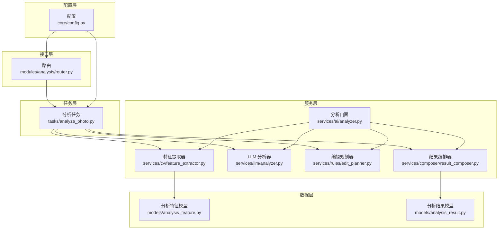
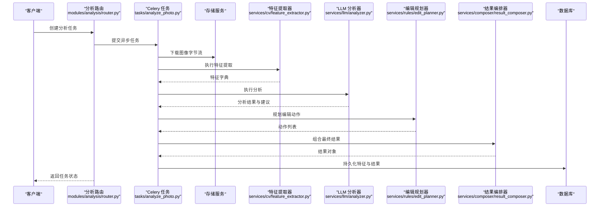
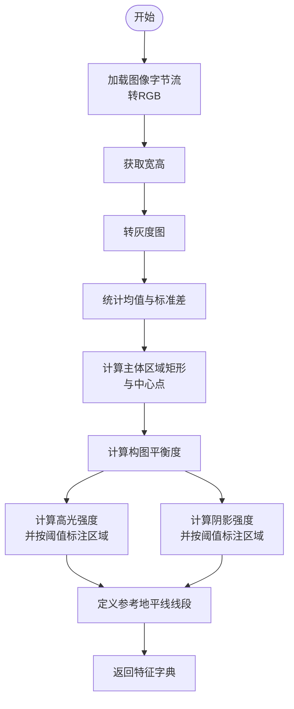
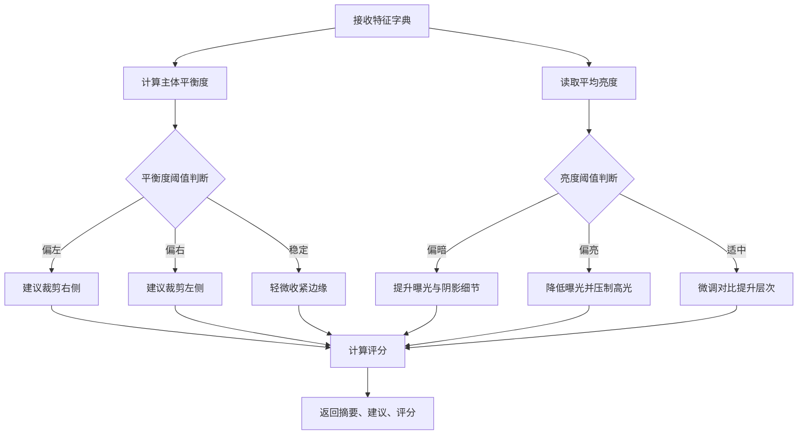
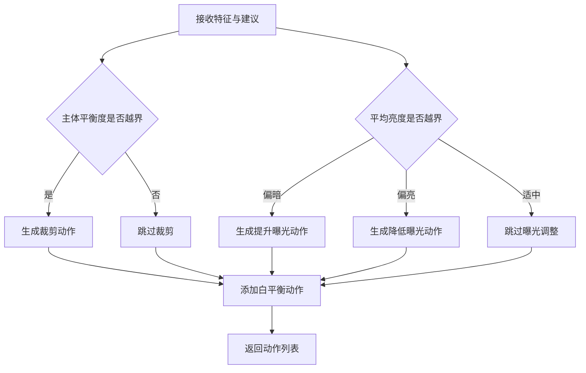
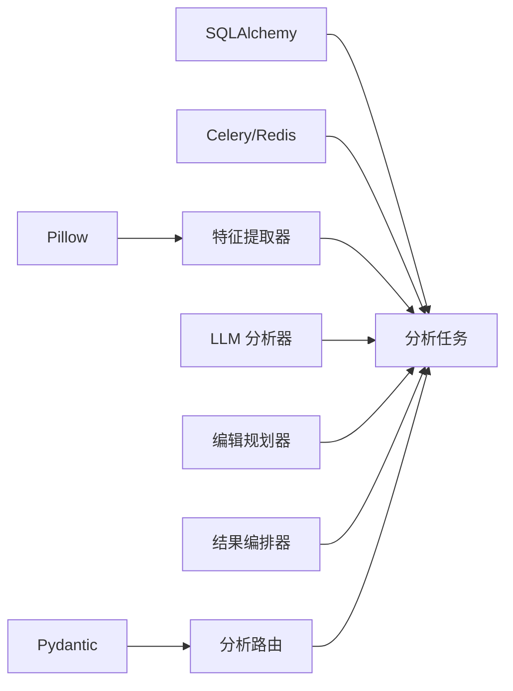

# 计算机视觉模块

<cite>
**本文引用的文件**
- [feature_extractor.py](file://apps/api/app/services/cv/feature_extractor.py)
- [analyzer.py](file://apps/api/app/services/ai/analyzer.py)
- [result_composer.py](file://apps/api/app/services/composer/result_composer.py)
- [analyzer.py](file://apps/api/app/services/llm/analyzer.py)
- [edit_planner.py](file://apps/api/app/services/rules/edit_planner.py)
- [analyze_photo.py](file://apps/api/app/tasks/analyze_photo.py)
- [router.py](file://apps/api/app/modules/analysis/router.py)
- [analysis_feature.py](file://apps/api/app/models/analysis_feature.py)
- [analysis_result.py](file://apps/api/app/models/analysis_result.py)
- [config.py](file://apps/api/app/core/config.py)
- [requirements.txt](file://apps/api/requirements.txt)
</cite>

## 目录
1. [简介](#简介)
2. [项目结构](#项目结构)
3. [核心组件](#核心组件)
4. [架构总览](#架构总览)
5. [详细组件分析](#详细组件分析)
6. [依赖分析](#依赖分析)
7. [性能考虑](#性能考虑)
8. [故障排查指南](#故障排查指南)
9. [结论](#结论)
10. [附录](#附录)

## 简介
本技术文档面向“计算机视觉模块”，聚焦图像特征提取与摄影指导建议的自动化流水线。当前实现以Pillow（PIL）为基础进行图像处理，提取亮度、对比度、主体区域、高光/阴影区域以及构图参考线等基础特征；随后由规则引擎与提示词驱动的分析器生成建议与评分，并通过结果编排器整合为统一输出。文档将系统阐述工作流程、输入输出格式、性能优化策略、配置参数与阈值设定，并给出质量评估方法与不同图像类型的处理差异。

## 项目结构
该模块位于后端服务 apps/api 下，采用分层设计：
- 服务层：计算机视觉特征提取、LLM分析、编辑规划、结果编排
- 任务层：基于 Celery 的异步分析任务
- 接口层：FastAPI 路由，提供任务创建、查询与重试
- 数据模型：分析任务、结果与特征的持久化定义
- 配置层：应用配置与外部服务连接参数

图表来源
- [router.py:1-151](file://apps/api/app/modules/analysis/router.py#L1-L151)
- [analyze_photo.py:1-108](file://apps/api/app/tasks/analyze_photo.py#L1-L108)
- [feature_extractor.py:1-98](file://apps/api/app/services/cv/feature_extractor.py#L1-L98)
- [analyzer.py:1-27](file://apps/api/app/services/ai/analyzer.py#L1-L27)
- [analyzer.py:1-139](file://apps/api/app/services/llm/analyzer.py#L1-L139)
- [edit_planner.py:1-97](file://apps/api/app/services/rules/edit_planner.py#L1-L97)
- [result_composer.py:1-98](file://apps/api/app/services/composer/result_composer.py#L1-L98)
- [analysis_feature.py:1-29](file://apps/api/app/models/analysis_feature.py#L1-L29)
- [analysis_result.py:1-28](file://apps/api/app/models/analysis_result.py#L1-L28)
- [config.py:1-47](file://apps/api/app/core/config.py#L1-L47)

章节来源
- [router.py:1-151](file://apps/api/app/modules/analysis/router.py#L1-L151)
- [analyze_photo.py:1-108](file://apps/api/app/tasks/analyze_photo.py#L1-L108)
- [config.py:1-47](file://apps/api/app/core/config.py#L1-L47)

## 核心组件
- 计算机视觉特征提取器：从图像字节流中提取亮度、对比度、主体区域、高光/阴影区域、构图参考线等基础特征，返回结构化特征字典。
- LLM 分析器：基于特征计算画面重心、曝光状态与色彩对比，生成摘要、建议与评分。
- 编辑规划器：根据重心与曝光阈值生成自动裁剪与曝光调整动作。
- 结果编排器：将特征、LLM 建议与编辑动作整合为统一结果对象。
- 分析门面：封装特征提取、LLM 分析与编辑规划的调用顺序。
- 异步分析任务：Celery 任务负责下载图像、执行分析、持久化特征与结果。
- FastAPI 路由：对外提供任务创建、查询与重试接口。

章节来源
- [feature_extractor.py:12-98](file://apps/api/app/services/cv/feature_extractor.py#L12-L98)
- [analyzer.py:10-26](file://apps/api/app/services/ai/analyzer.py#L10-L26)
- [analyzer.py:5-139](file://apps/api/app/services/llm/analyzer.py#L5-L139)
- [edit_planner.py:5-97](file://apps/api/app/services/rules/edit_planner.py#L5-L97)
- [result_composer.py:5-98](file://apps/api/app/services/composer/result_composer.py#L5-L98)
- [analyze_photo.py:19-108](file://apps/api/app/tasks/analyze_photo.py#L19-L108)

## 架构总览
下图展示从接口到存储的完整调用链路与数据流向：

图表来源
- [router.py:45-74](file://apps/api/app/modules/analysis/router.py#L45-L74)
- [analyze_photo.py:19-108](file://apps/api/app/tasks/analyze_photo.py#L19-L108)
- [feature_extractor.py:15-91](file://apps/api/app/services/cv/feature_extractor.py#L15-L91)
- [analyzer.py:8-118](file://apps/api/app/services/llm/analyzer.py#L8-L118)
- [edit_planner.py:6-34](file://apps/api/app/services/rules/edit_planner.py#L6-L34)
- [result_composer.py:8-23](file://apps/api/app/services/composer/result_composer.py#L8-L23)

## 详细组件分析

### 计算机视觉特征提取器
- 输入
  - 图像字节流：任意支持 Pillow 打开的格式
  - MIME 类型：用于记录图像类型
- 处理流程
  - 将图像转为 RGB，获取宽高
  - 转灰度图，统计均值亮度与标准差对比度
  - 计算主体区域（固定比例矩形），并得到主体中心点
  - 计算构图平衡度（主体中心相对宽度的比例）
  - 基于亮度阈值与归一化计算高光/阴影强度
  - 若强度超过阈值，标注对应区域（像素坐标系）
  - 定义参考地平线线段（像素坐标系）
- 输出
  - 版本号、图像元信息、统计特征、主体区域、高光/阴影区域、参考线
- 性能优化
  - 使用内存缓冲区解析图像，避免磁盘 IO
  - 对单实例使用 LRU 缓存，降低重复初始化成本
- 算法复杂度
  - 时间复杂度近似 O(W×H)，主要来自灰度转换与统计
  - 空间复杂度近似 O(W×H)，灰度图缓存

图表来源
- [feature_extractor.py:15-91](file://apps/api/app/services/cv/feature_extractor.py#L15-L91)

章节来源
- [feature_extractor.py:12-98](file://apps/api/app/services/cv/feature_extractor.py#L12-L98)

### LLM 分析器
- 输入
  - 特征字典（含图像尺寸、主体、统计特征）
- 处理流程
  - 计算主体水平平衡度与平均亮度
  - 根据平衡度生成构图建议（偏左/偏右/稳定）
  - 根据亮度生成曝光建议（偏暗/偏亮/适中）
  - 补充叙事建议（背景参与度）
  - 计算构图、曝光、色彩、故事四维评分
- 输出
  - 版本号、摘要、建议列表、评分字典
- 性能优化
  - 逻辑纯函数式，无外部依赖，计算开销极低
- 算法复杂度
  - 时间/空间复杂度均为 O(1)

图表来源
- [analyzer.py:8-118](file://apps/api/app/services/llm/analyzer.py#L8-L118)

章节来源
- [analyzer.py:5-139](file://apps/api/app/services/llm/analyzer.py#L5-L139)

### 编辑规划器
- 输入
  - 特征字典与 LLM 建议列表
- 处理流程
  - 根据主体平衡度决定是否需要自动裁剪
  - 根据平均亮度决定是否需要曝光调整
  - 添加白平衡作为通用预设动作
- 输出
  - 编辑动作列表（裁剪、曝光、白平衡）
- 性能优化
  - 纯计算逻辑，无外部依赖
- 算法复杂度
  - O(1)

图表来源
- [edit_planner.py:6-34](file://apps/api/app/services/rules/edit_planner.py#L6-L34)

章节来源
- [edit_planner.py:5-97](file://apps/api/app/services/rules/edit_planner.py#L5-L97)

### 结果编排器
- 输入
  - 特征 ID、特征字典、LLM 结果、编辑动作
- 处理流程
  - 组装版本号、摘要、建议、评分、特征引用
  - 构建注解：主体框、高光/阴影框、参考线
- 输出
  - 结果对象（包含版本、摘要、建议、评分、注解、编辑动作）

章节来源
- [result_composer.py:5-98](file://apps/api/app/services/composer/result_composer.py#L5-L98)

### 分析门面
- 输入
  - 图像字节流与 MIME 类型
- 处理流程
  - 依次调用特征提取、LLM 分析、编辑规划、结果编排
- 输出
  - 最终结果对象

章节来源
- [analyzer.py:10-26](file://apps/api/app/services/ai/analyzer.py#L10-L26)

### 异步分析任务
- 流程
  - 更新任务状态为运行中
  - 从存储下载图像字节流
  - 执行特征提取并持久化特征
  - 执行 LLM 分析与编辑规划
  - 编排结果并持久化分析结果
  - 设置任务完成状态
- 错误处理
  - 捕获异常并回滚，记录错误码与消息

章节来源
- [analyze_photo.py:19-108](file://apps/api/app/tasks/analyze_photo.py#L19-L108)

### FastAPI 路由
- 能力
  - 创建分析任务（提交 Celery 任务）
  - 查询任务详情（读取分析结果）
  - 获取历史（分页查询）
  - 重试失败任务
- 权限控制
  - 仅允许任务/图片归属用户访问

章节来源
- [router.py:45-151](file://apps/api/app/modules/analysis/router.py#L45-L151)

## 依赖分析
- 库依赖
  - Pillow：图像加载与统计
  - SQLAlchemy：数据库 ORM
  - Celery/Redis：异步任务队列
  - Pydantic：请求/响应模型
- 内部依赖
  - 路由依赖任务；任务依赖特征提取器、LLM 分析器、编辑规划器、结果编排器
  - 特征提取器与结果编排器对 Pillow 有直接依赖
  - LLM 分析器与编辑规划器为纯逻辑组件，无外部依赖

图表来源
- [requirements.txt:1-19](file://apps/api/requirements.txt#L1-L19)
- [feature_extractor.py:5-5](file://apps/api/app/services/cv/feature_extractor.py#L5-L5)
- [analyze_photo.py:13-16](file://apps/api/app/tasks/analyze_photo.py#L13-L16)
- [router.py:14-22](file://apps/api/app/modules/analysis/router.py#L14-L22)

章节来源
- [requirements.txt:1-19](file://apps/api/requirements.txt#L1-L19)

## 性能考虑
- 图像预处理
  - 使用内存缓冲区加载图像，避免多次磁盘 IO
  - 先转灰度再统计，降低计算量
- 缓存策略
  - 单例特征提取器与结果编排器使用 LRU 缓存，减少重复初始化
- 并发与异步
  - 采用 Celery 异步执行，避免阻塞接口
- 存储与索引
  - JSON 字段建立 GIN 索引，便于检索与聚合
- 可扩展性
  - 当前实现为基础特征提取，若需高级特征（边缘、纹理、直方图），可在现有框架内扩展，保持接口一致

[本节为通用性能建议，无需特定文件引用]

## 故障排查指南
- 任务状态异常
  - 检查任务表状态与错误字段，定位异常原因
- 图像下载失败
  - 核对存储服务配置与对象键
- 特征提取异常
  - 确认图像字节流有效且可被 Pillow 解码
- 结果为空
  - 检查 LLM 分析与编辑规划是否正常返回
- 权限问题
  - 确保任务与图片归属当前用户

章节来源
- [analyze_photo.py:97-107](file://apps/api/app/tasks/analyze_photo.py#L97-L107)
- [router.py:82-89](file://apps/api/app/modules/analysis/router.py#L82-L89)

## 结论
本模块以轻量、可扩展的方式实现了从图像到建议的完整链路：基础特征提取、规则与提示词驱动的分析、动作规划与结果编排。当前实现聚焦构图与曝光两大维度，具备良好的可维护性与扩展性。未来可在保持接口稳定的前提下，引入更丰富的图像特征与算法，以覆盖更多场景与图像类型。

[本节为总结性内容，无需特定文件引用]

## 附录

### 输入输出规范与示例路径
- 特征提取输入
  - 参数：image_bytes（字节流）、mime_type（字符串）
  - 示例路径：[extract:15-16](file://apps/api/app/services/cv/feature_extractor.py#L15-L16)
- 特征提取输出
  - 字段：version、image、stats、subject、regions、guidelines
  - 示例路径：[返回结构:65-91](file://apps/api/app/services/cv/feature_extractor.py#L65-L91)
- LLM 分析输入
  - 字段：image、subject、stats
  - 示例路径：[输入读取:9-11](file://apps/api/app/services/llm/analyzer.py#L9-L11)
- LLM 分析输出
  - 字段：version、summary、suggestions、scores
  - 示例路径：[输出组装:113-118](file://apps/api/app/services/llm/analyzer.py#L113-L118)
- 编辑规划输出
  - 字段：动作列表（裁剪、曝光、白平衡）
  - 示例路径：[动作生成:52-66](file://apps/api/app/services/rules/edit_planner.py#L52-L66)
- 结果编排输出
  - 字段：version、summary、suggestions、scores、features_ref、annotations、edit_actions
  - 示例路径：[结果组装:14-23](file://apps/api/app/services/composer/result_composer.py#L14-L23)

章节来源
- [feature_extractor.py:15-91](file://apps/api/app/services/cv/feature_extractor.py#L15-L91)
- [analyzer.py:9-118](file://apps/api/app/services/llm/analyzer.py#L9-L118)
- [edit_planner.py:6-34](file://apps/api/app/services/rules/edit_planner.py#L6-L34)
- [result_composer.py:8-23](file://apps/api/app/services/composer/result_composer.py#L8-L23)

### 配置参数与阈值
- 配置项
  - 模型名称、提示词版本、CORS 允许域、JWT 密钥与过期时间等
  - 示例路径：[配置类:6-46](file://apps/api/app/core/config.py#L6-L46)
- 特征提取阈值
  - 主体区域比例（宽/高/起始点比例）
  - 高光/阴影强度阈值与标注阈值
  - 示例路径：[主体与区域计算:24-63](file://apps/api/app/services/cv/feature_extractor.py#L24-L63)
- LLM 分析阈值
  - 平衡度阈值（偏左/偏右边界）
  - 亮度阈值（偏暗/偏亮边界）
  - 示例路径：[平衡度与亮度判断:18-30](file://apps/api/app/services/llm/analyzer.py#L18-L30)
- 编辑规划阈值
  - 平衡度越界阈值、亮度越界阈值
  - 示例路径：[裁剪与曝光决策:43-89](file://apps/api/app/services/rules/edit_planner.py#L43-L89)

章节来源
- [config.py:6-46](file://apps/api/app/core/config.py#L6-L46)
- [feature_extractor.py:24-63](file://apps/api/app/services/cv/feature_extractor.py#L24-L63)
- [analyzer.py:18-30](file://apps/api/app/services/llm/analyzer.py#L18-L30)
- [edit_planner.py:43-89](file://apps/api/app/services/rules/edit_planner.py#L43-L89)

### OpenCV 与 PIL 使用说明
- 当前实现
  - 使用 Pillow 进行图像加载、灰度转换与统计
  - 未使用 OpenCV
- 如需引入 OpenCV
  - 替换灰度转换与统计为 OpenCV 的灰度与直方图计算
  - 在特征提取器中增加边缘检测、纹理分析、色彩直方图等模块
  - 注意保持输入输出格式与版本号一致

章节来源
- [feature_extractor.py:16-22](file://apps/api/app/services/cv/feature_extractor.py#L16-L22)
- [requirements.txt:10-10](file://apps/api/requirements.txt#L10-L10)

### 不同图像类型的处理差异与算法选择
- 人像
  - 主体区域按面部中心定位，优先保证主体居中与留白比例
- 风景
  - 地平线参考线用于引导水平校正与裁剪
  - 高光/阴影区域辅助曝光与对比度调整
- 街拍/运动
  - 更关注主体稳定性与动态构图，必要时放宽裁剪阈值
- 算法选择依据
  - 以经验阈值为主，结合场景特点可微调平衡度与亮度边界

[本节为概念性说明，无需特定文件引用]