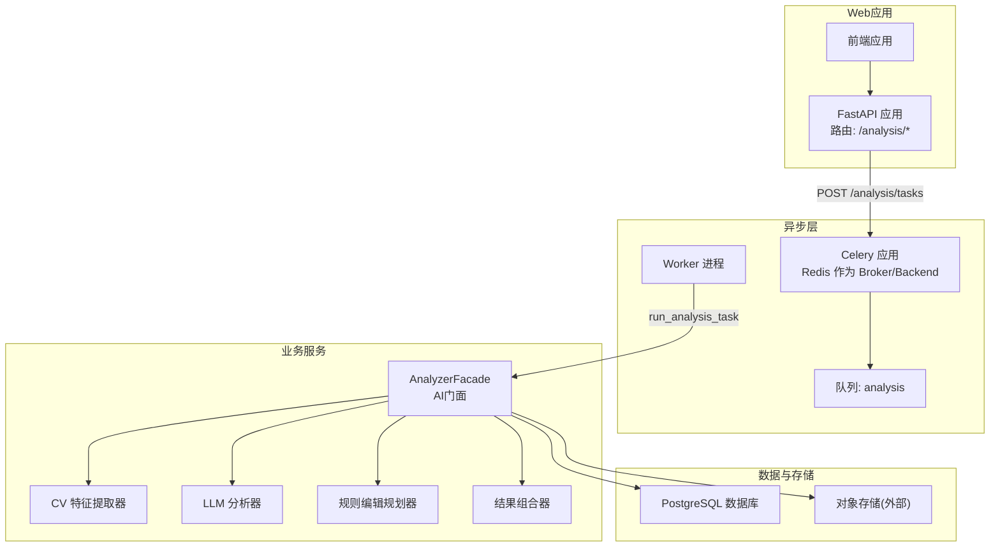
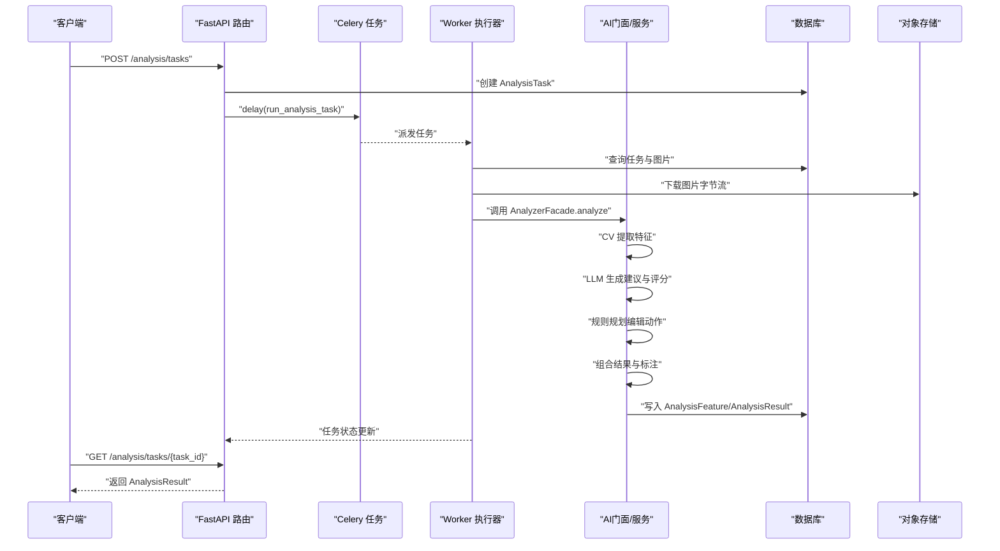
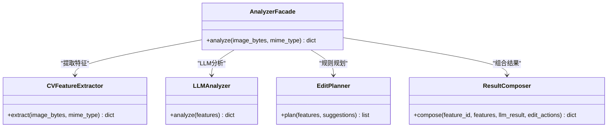
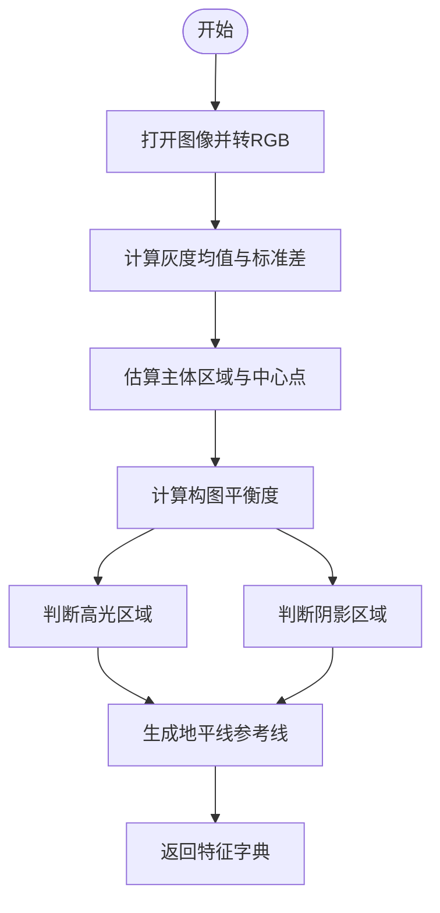
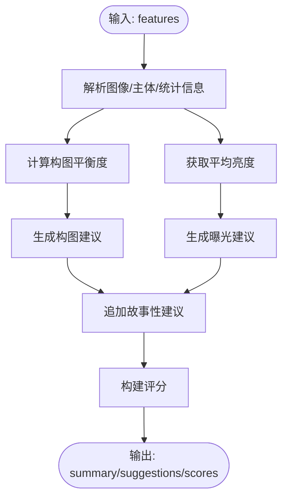
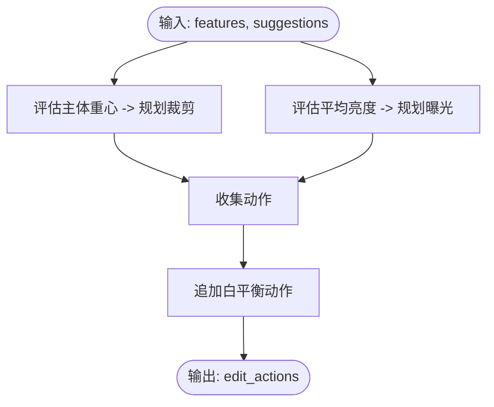
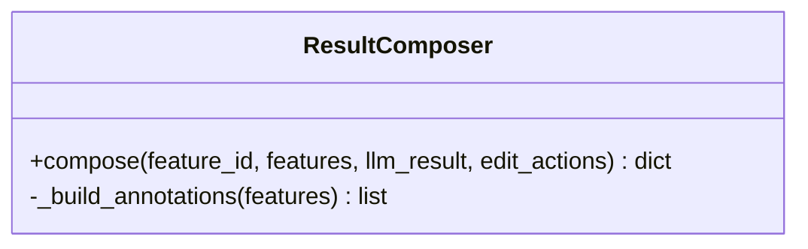
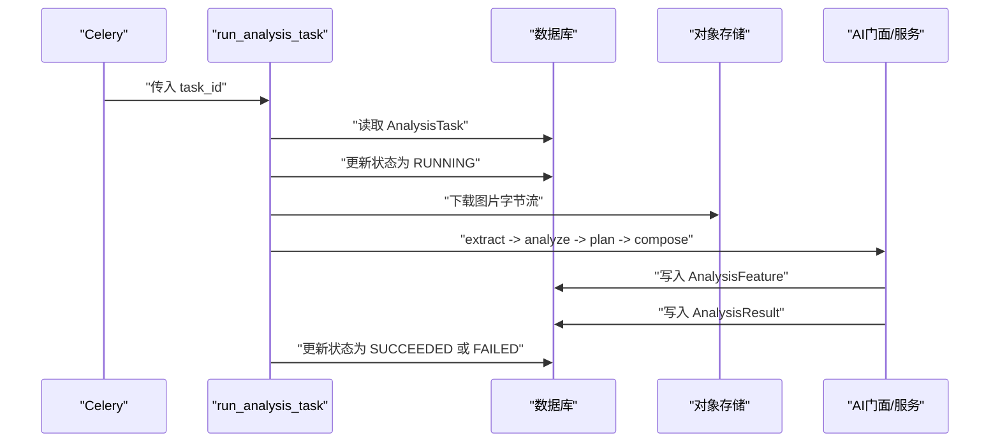
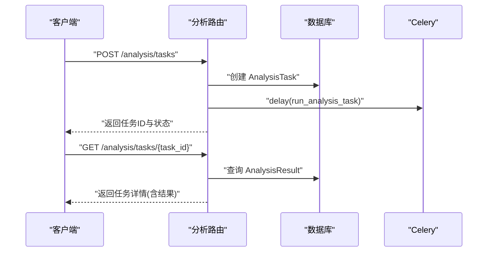
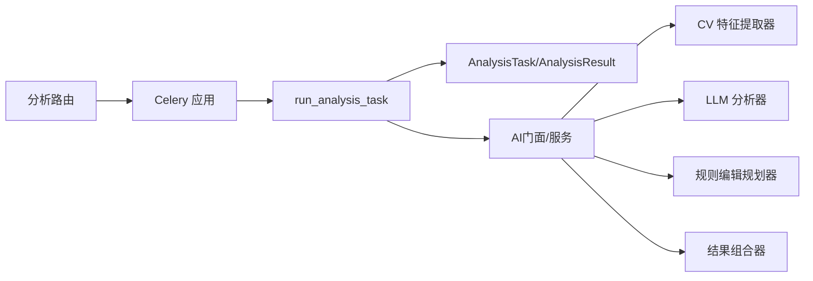

# AI分析系统

<cite>
**本文引用的文件**
- [apps/api/app/main.py](file://apps/api/app/main.py)
- [apps/api/app/core/celery_app.py](file://apps/api/app/core/celery_app.py)
- [apps/api/app/modules/analysis/router.py](file://apps/api/app/modules/analysis/router.py)
- [apps/api/app/tasks/analyze_photo.py](file://apps/api/app/tasks/analyze_photo.py)
- [apps/api/app/services/ai/analyzer.py](file://apps/api/app/services/ai/analyzer.py)
- [apps/api/app/services/cv/feature_extractor.py](file://apps/api/app/services/cv/feature_extractor.py)
- [apps/api/app/services/llm/analyzer.py](file://apps/api/app/services/llm/analyzer.py)
- [apps/api/app/services/rules/edit_planner.py](file://apps/api/app/services/rules/edit_planner.py)
- [apps/api/app/services/composer/result_composer.py](file://apps/api/app/services/composer/result_composer.py)
- [apps/api/app/models/analysis_task.py](file://apps/api/app/models/analysis_task.py)
- [apps/api/app/models/analysis_result.py](file://apps/api/app/models/analysis_result.py)
- [apps/api/app/schemas/analysis.py](file://apps/api/app/schemas/analysis.py)
</cite>

## 目录
1. [简介](#简介)
2. [项目结构](#项目结构)
3. [核心组件](#核心组件)
4. [架构总览](#架构总览)
5. [详细组件分析](#详细组件分析)
6. [依赖分析](#依赖分析)
7. [性能考虑](#性能考虑)
8. [故障排查指南](#故障排查指南)
9. [结论](#结论)
10. [附录](#附录)

## 简介
本文件为“AI摄影分析系统”的技术文档，聚焦于AI分析的整体架构与工作流程：计算机视觉（CV）特征提取、大语言模型（LLM）分析、规则引擎编辑规划与结果组合器的协同工作机制。文档记录各AI服务的实现细节、输入输出格式与调用方式，解释分析算法的技术原理与性能考量，说明异步任务处理与状态管理机制，并提供调试与监控方法。

## 项目结构
后端采用FastAPI应用，结合Celery进行异步任务处理；前端通过HTTP接口提交图片分析请求，后端将任务投递到队列并返回任务ID，客户端轮询获取结果。数据库使用SQLAlchemy ORM持久化任务与结果；Redis作为消息代理与结果存储后端。

图表来源
- [apps/api/app/main.py:11-24](file://apps/api/app/main.py#L11-L24)
- [apps/api/app/core/celery_app.py:5-19](file://apps/api/app/core/celery_app.py#L5-L19)
- [apps/api/app/modules/analysis/router.py:45-74](file://apps/api/app/modules/analysis/router.py#L45-L74)
- [apps/api/app/tasks/analyze_photo.py:19-108](file://apps/api/app/tasks/analyze_photo.py#L19-L108)
- [apps/api/app/services/ai/analyzer.py:10-26](file://apps/api/app/services/ai/analyzer.py#L10-L26)

章节来源
- [apps/api/app/main.py:11-36](file://apps/api/app/main.py#L11-L36)
- [apps/api/app/core/celery_app.py:1-21](file://apps/api/app/core/celery_app.py#L1-L21)
- [apps/api/app/modules/analysis/router.py:24-151](file://apps/api/app/modules/analysis/router.py#L24-L151)

## 核心组件
- AI门面（AnalyzerFacade）
  - 职责：编排CV特征提取、LLM分析、规则编辑规划与结果组合。
  - 输入：图像字节流与MIME类型。
  - 输出：统一的分析结果结构。
- 计算机视觉（CV）特征提取器
  - 提取图像尺寸、亮度、对比度、主体区域、高光/阴影区域、地平线参考线等。
- 大语言模型（LLM）分析器
  - 基于CV特征生成摘要、建议与评分。
- 规则编辑规划器
  - 将建议转化为具体的编辑动作（裁剪、曝光、白平衡等）。
- 结果组合器
  - 组合特征、LLM结果、编辑动作与标注信息，形成最终输出。
- 异步任务执行器（run_analysis_task）
  - 从数据库加载任务与图片，调用上述服务，持久化中间特征与最终结果，更新任务状态。

章节来源
- [apps/api/app/services/ai/analyzer.py:10-26](file://apps/api/app/services/ai/analyzer.py#L10-L26)
- [apps/api/app/services/cv/feature_extractor.py:12-98](file://apps/api/app/services/cv/feature_extractor.py#L12-L98)
- [apps/api/app/services/llm/analyzer.py:5-139](file://apps/api/app/services/llm/analyzer.py#L5-L139)
- [apps/api/app/services/rules/edit_planner.py:5-97](file://apps/api/app/services/rules/edit_planner.py#L5-L97)
- [apps/api/app/services/composer/result_composer.py:5-99](file://apps/api/app/services/composer/result_composer.py#L5-L99)
- [apps/api/app/tasks/analyze_photo.py:19-108](file://apps/api/app/tasks/analyze_photo.py#L19-L108)

## 架构总览
系统采用“请求-异步任务-服务编排”的分层架构。Web层接收请求并入队；Worker层执行长耗时任务；服务层完成AI分析与编辑规划；数据库持久化任务与结果；对象存储用于下载/上传图片。

图表来源
- [apps/api/app/modules/analysis/router.py:45-74](file://apps/api/app/modules/analysis/router.py#L45-L74)
- [apps/api/app/tasks/analyze_photo.py:19-108](file://apps/api/app/tasks/analyze_photo.py#L19-L108)
- [apps/api/app/services/ai/analyzer.py:10-26](file://apps/api/app/services/ai/analyzer.py#L10-L26)

## 详细组件分析

### AI门面（AnalyzerFacade）
- 协同顺序：CV → LLM → 规则 → 组合
- 缓存策略：LRU缓存单例实例，降低重复初始化成本
- 返回结构：包含版本、摘要、建议、评分、特征引用、标注与编辑动作

图表来源
- [apps/api/app/services/ai/analyzer.py:10-26](file://apps/api/app/services/ai/analyzer.py#L10-L26)
- [apps/api/app/services/cv/feature_extractor.py:94-98](file://apps/api/app/services/cv/feature_extractor.py#L94-L98)
- [apps/api/app/services/llm/analyzer.py:135-139](file://apps/api/app/services/llm/analyzer.py#L135-L139)
- [apps/api/app/services/rules/edit_planner.py:93-97](file://apps/api/app/services/rules/edit_planner.py#L93-L97)
- [apps/api/app/services/composer/result_composer.py:95-99](file://apps/api/app/services/composer/result_composer.py#L95-L99)

章节来源
- [apps/api/app/services/ai/analyzer.py:10-26](file://apps/api/app/services/ai/analyzer.py#L10-L26)

### 计算机视觉（CV）特征提取器
- 输入：图像字节流与MIME类型
- 输出：包含版本、图像元信息、统计指标、主体框、高光/阴影区域、参考线等
- 技术要点：
  - 使用灰度统计计算平均亮度与对比度
  - 主体区域按经验比例估算并转换为中心坐标
  - 高光/阴影区域基于亮度阈值判定
  - 地平线参考线用于后续构图建议

图表来源
- [apps/api/app/services/cv/feature_extractor.py:15-91](file://apps/api/app/services/cv/feature_extractor.py#L15-L91)

章节来源
- [apps/api/app/services/cv/feature_extractor.py:12-98](file://apps/api/app/services/cv/feature_extractor.py#L12-L98)

### 大语言模型（LLM）分析器
- 输入：CV特征
- 输出：版本、摘要、建议列表、评分
- 技术要点：
  - 基于主体中心与宽度比评估构图平衡
  - 基于平均亮度评估曝光倾向
  - 生成多条建议（构图、曝光、故事性），并给出优先级
  - 构建综合评分（构图、曝光、色彩、故事）

图表来源
- [apps/api/app/services/llm/analyzer.py:8-118](file://apps/api/app/services/llm/analyzer.py#L8-L118)

章节来源
- [apps/api/app/services/llm/analyzer.py:5-139](file://apps/api/app/services/llm/analyzer.py#L5-L139)

### 规则编辑规划器
- 输入：CV特征与LLM建议
- 输出：编辑动作列表（裁剪、曝光、白平衡等）
- 技术要点：
  - 根据主体重心偏移自动规划裁剪区域，使主体靠近黄金分割线
  - 根据平均亮度自动规划曝光调整参数
  - 追加非破坏性白平衡动作以备后续调色

图表来源
- [apps/api/app/services/rules/edit_planner.py:6-34](file://apps/api/app/services/rules/edit_planner.py#L6-L34)

章节来源
- [apps/api/app/services/rules/edit_planner.py:5-97](file://apps/api/app/services/rules/edit_planner.py#L5-L97)

### 结果组合器
- 输入：特征ID、CV特征、LLM结果、编辑动作
- 输出：统一结果结构，包含版本、摘要、建议、评分、特征引用、标注与编辑动作
- 标注生成：根据主体、高光、阴影、地平线生成几何标注与关联建议ID

图表来源
- [apps/api/app/services/composer/result_composer.py:5-99](file://apps/api/app/services/composer/result_composer.py#L5-L99)

章节来源
- [apps/api/app/services/composer/result_composer.py:5-99](file://apps/api/app/services/composer/result_composer.py#L5-L99)

### 异步任务执行器（run_analysis_task）
- 任务生命周期：创建任务 → 更新状态为运行中 → 下载图片 → 调用服务链 → 写入特征与结果 → 更新状态为成功/失败
- 数据持久化：AnalysisFeature保存中间特征；AnalysisResult保存最终结果
- 错误处理：捕获异常，回滚事务，记录错误码与消息

图表来源
- [apps/api/app/tasks/analyze_photo.py:19-108](file://apps/api/app/tasks/analyze_photo.py#L19-L108)

章节来源
- [apps/api/app/tasks/analyze_photo.py:19-108](file://apps/api/app/tasks/analyze_photo.py#L19-L108)

### Web API与路由
- 创建分析任务：校验图片归属，创建任务并入队
- 查询任务详情：返回任务状态、尝试次数、错误信息与最终结果
- 获取历史：按用户与时间排序返回任务简要信息
- 重试任务：仅允许失败或成功的任务重试，重置状态并重新入队

图表来源
- [apps/api/app/modules/analysis/router.py:45-151](file://apps/api/app/modules/analysis/router.py#L45-L151)

章节来源
- [apps/api/app/modules/analysis/router.py:24-151](file://apps/api/app/modules/analysis/router.py#L24-L151)

## 依赖分析
- 组件内聚与耦合
  - AnalyzerFacade对CV、LLM、规则、组合器存在直接依赖，形成清晰的编排层
  - 各服务均为纯函数式封装，便于替换与扩展
- 外部依赖
  - Redis：Celery的Broker与Backend
  - PostgreSQL：持久化任务与结果
  - 对象存储：图片下载/上传（通过存储服务抽象）
- 可能的循环依赖
  - 当前模块间无循环导入，依赖方向自上而下

图表来源
- [apps/api/app/modules/analysis/router.py:22-23](file://apps/api/app/modules/analysis/router.py#L22-L23)
- [apps/api/app/core/celery_app.py:5-19](file://apps/api/app/core/celery_app.py#L5-L19)
- [apps/api/app/tasks/analyze_photo.py:6-16](file://apps/api/app/tasks/analyze_photo.py#L6-L16)
- [apps/api/app/services/ai/analyzer.py:4-7](file://apps/api/app/services/ai/analyzer.py#L4-L7)

章节来源
- [apps/api/app/core/celery_app.py:1-21](file://apps/api/app/core/celery_app.py#L1-L21)
- [apps/api/app/tasks/analyze_photo.py:1-17](file://apps/api/app/tasks/analyze_photo.py#L1-L17)
- [apps/api/app/services/ai/analyzer.py:1-8](file://apps/api/app/services/ai/analyzer.py#L1-L8)

## 性能考虑
- 缓存策略
  - 各服务均使用LRU缓存单例，减少重复初始化开销
- I/O优化
  - 图片下载与数据库写入为瓶颈，建议：
    - 对热点图片做本地缓存
    - 批量写入AnalysisFeature/AnalysisResult
    - 使用连接池与索引优化（已有GIN索引）
- 并发与队列
  - 通过Celery队列隔离与并发控制，建议：
    - 为不同类型任务设置独立队列
    - 根据资源情况调整worker数量
- 算法复杂度
  - CV特征提取为O(W×H)，在常见照片分辨率下可接受
  - LLM分析为常数时间逻辑分支，整体线性
- 存储与网络
  - 对象存储延迟与带宽影响整体时延，建议就近部署与CDN

## 故障排查指南
- 任务状态异常
  - 检查任务表字段：attempt_count、status、error_code、error_message
  - 排查Worker日志与Redis队列积压
- 数据一致性
  - 确认AnalysisFeature/AnalysisResult是否正确写入
  - 核对任务与图片的外键关系
- 接口权限
  - 确保用户对图片与任务有访问权限
- 调试步骤
  - 启用详细日志（FastAPI/Celery/数据库）
  - 使用任务ID在数据库中定位记录
  - 在Worker侧打印中间结果（特征、建议、动作）
- 监控建议
  - 监控队列长度、任务执行时延、成功率
  - 监控数据库慢查询与索引命中率
  - 监控对象存储下载成功率与耗时

章节来源
- [apps/api/app/models/analysis_task.py:10-36](file://apps/api/app/models/analysis_task.py#L10-L36)
- [apps/api/app/models/analysis_result.py:10-28](file://apps/api/app/models/analysis_result.py#L10-L28)
- [apps/api/app/modules/analysis/router.py:76-151](file://apps/api/app/modules/analysis/router.py#L76-L151)
- [apps/api/app/tasks/analyze_photo.py:97-107](file://apps/api/app/tasks/analyze_photo.py#L97-L107)

## 结论
该系统通过“门面+服务链+异步任务”的设计，实现了从图片到建议与编辑动作的完整闭环。CV负责客观特征，LLM负责语义建议，规则引擎负责自动化编辑，结果组合器统一输出。通过Redis与Celery实现高吞吐异步处理，配合数据库持久化与前端API交互，满足实际生产需求。建议持续优化I/O与缓存策略，完善监控告警体系，以进一步提升稳定性与可观测性。

## 附录

### 数据模型与字段说明
- AnalysisTask
  - 字段：id、user_id、image_id、task_type、status、model_name、prompt_version、attempt_count、idempotency_key、error_code、error_message、created_at、started_at、finished_at
- AnalysisResult
  - 字段：id、task_id、image_id、version、result_json、created_at

章节来源
- [apps/api/app/models/analysis_task.py:10-36](file://apps/api/app/models/analysis_task.py#L10-L36)
- [apps/api/app/models/analysis_result.py:10-28](file://apps/api/app/models/analysis_result.py#L10-L28)

### API定义概览
- 创建分析任务
  - 方法：POST /analysis/tasks
  - 请求体：image_id
  - 响应体：task_id、task_type、status
- 获取任务详情
  - 方法：GET /analysis/tasks/{task_id}
  - 响应体：任务与结果详情
- 获取历史
  - 方法：GET /analysis/history
  - 参数：limit（默认20，范围1-100）
  - 响应体：历史项列表
- 重试任务
  - 方法：POST /analysis/tasks/{task_id}/retry
  - 响应体：重试后的任务状态

章节来源
- [apps/api/app/schemas/analysis.py:8-52](file://apps/api/app/schemas/analysis.py#L8-L52)
- [apps/api/app/modules/analysis/router.py:45-151](file://apps/api/app/modules/analysis/router.py#L45-L151)