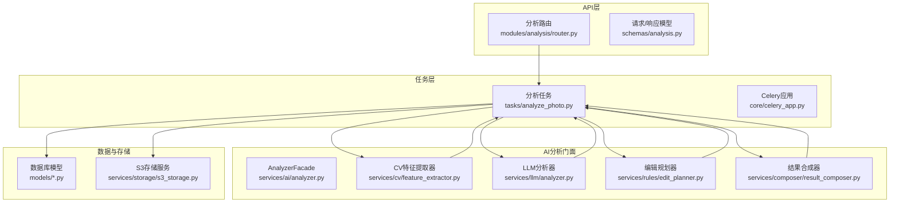
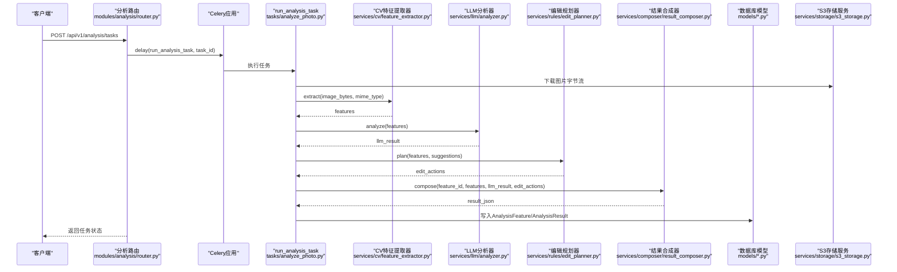
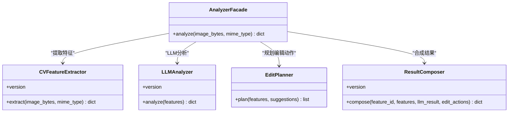
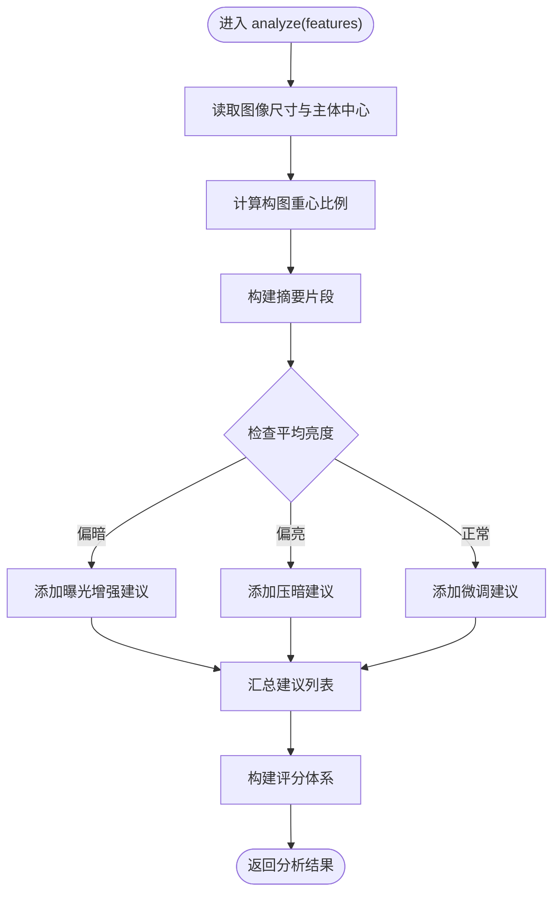
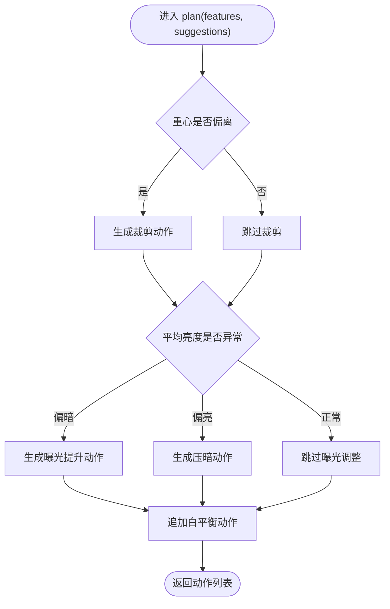
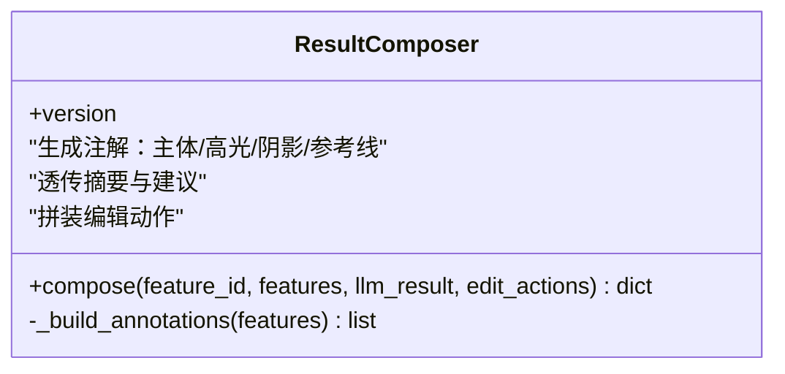
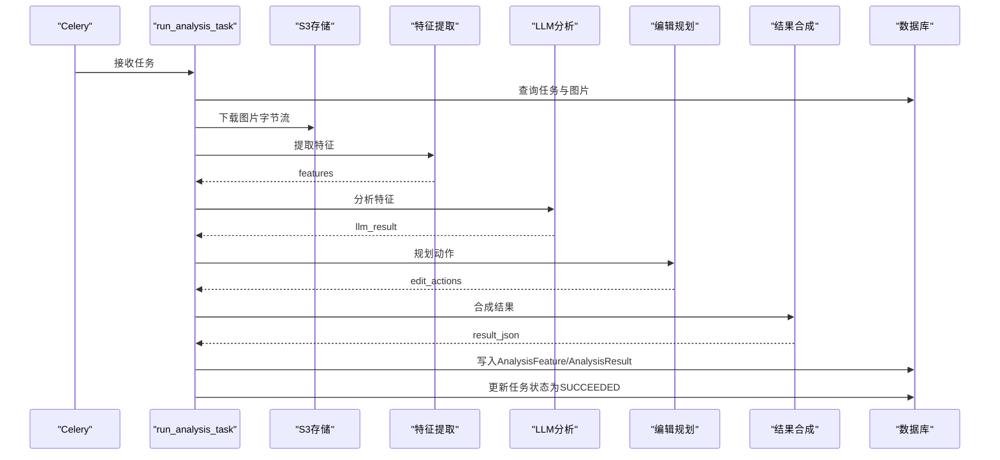
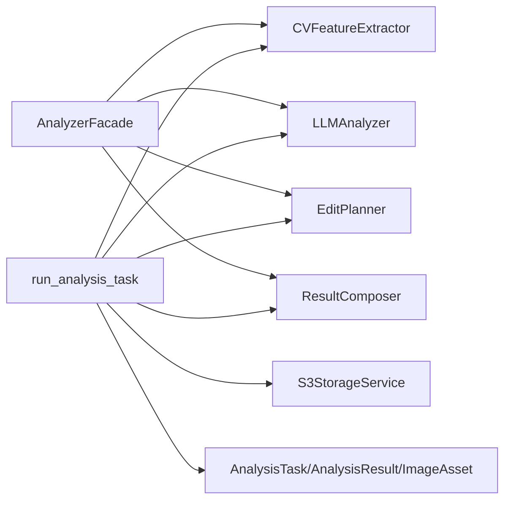

# 分析门面模式

<cite>
**本文档引用的文件**
- [apps/api/app/services/ai/analyzer.py](file://apps/api/app/services/ai/analyzer.py)
- [apps/api/app/services/llm/analyzer.py](file://apps/api/app/services/llm/analyzer.py)
- [apps/api/app/services/composer/result_composer.py](file://apps/api/app/services/composer/result_composer.py)
- [apps/api/app/services/cv/feature_extractor.py](file://apps/api/app/services/cv/feature_extractor.py)
- [apps/api/app/services/rules/edit_planner.py](file://apps/api/app/services/rules/edit_planner.py)
- [apps/api/app/tasks/analyze_photo.py](file://apps/api/app/tasks/analyze_photo.py)
- [apps/api/app/modules/analysis/router.py](file://apps/api/app/modules/analysis/router.py)
- [apps/api/app/schemas/analysis.py](file://apps/api/app/schemas/analysis.py)
- [apps/api/app/models/analysis_result.py](file://apps/api/app/models/analysis_result.py)
- [apps/api/app/models/analysis_task.py](file://apps/api/app/models/analysis_task.py)
- [apps/api/app/models/image_asset.py](file://apps/api/app/models/image_asset.py)
- [apps/api/app/main.py](file://apps/api/app/main.py)
- [apps/api/app/deps.py](file://apps/api/app/deps.py)
- [apps/api/app/core/config.py](file://apps/api/app/core/config.py)
- [apps/api/app/services/storage/s3_storage.py](file://apps/api/app/services/storage/s3_storage.py)
</cite>

## 目录
1. [引言](#引言)
2. [项目结构](#项目结构)
3. [核心组件](#核心组件)
4. [架构总览](#架构总览)
5. [详细组件分析](#详细组件分析)
6. [依赖分析](#依赖分析)
7. [性能考量](#性能考量)
8. [故障排查指南](#故障排查指南)
9. [结论](#结论)
10. [附录](#附录)

## 引言
本文件围绕“AI分析门面模式”展开，系统化阐述 AnalyzerFacade 类的设计理念与实现细节，重点覆盖以下方面：
- 统一接口封装：通过单一入口协调多子服务，屏蔽内部复杂性
- 组件协调与生命周期管理：明确各子服务的职责边界与协作顺序
- 错误传播与状态管理：在任务执行与API层的错误处理与状态流转
- LRU缓存机制：在服务工厂函数上的应用与性能优化策略
- 完整调用链路与数据流：从前端到后端、从任务队列到数据库的全流程
- 扩展性与维护性：门面模式与其他设计模式的结合与演进方向

## 项目结构
后端采用FastAPI + Celery异步任务的分层架构，AI分析流程由门面类统一编排，核心模块如下：
- 路由与API：对外暴露分析任务创建、查询与重试接口
- 任务执行：Celery任务拉起完整的分析流水线
- AI分析门面：统一调度特征提取、LLM分析、规则规划与结果合成
- 子服务：计算机视觉特征提取、大语言模型分析、编辑动作规划、结果合成
- 数据模型与存储：任务、结果、图片资产的持久化与S3对象存储

图表来源
- [apps/api/app/modules/analysis/router.py:1-151](file://apps/api/app/modules/analysis/router.py#L1-L151)
- [apps/api/app/tasks/analyze_photo.py:1-108](file://apps/api/app/tasks/analyze_photo.py#L1-L108)
- [apps/api/app/services/ai/analyzer.py:1-27](file://apps/api/app/services/ai/analyzer.py#L1-L27)
- [apps/api/app/services/cv/feature_extractor.py:1-98](file://apps/api/app/services/cv/feature_extractor.py#L1-L98)
- [apps/api/app/services/llm/analyzer.py:1-139](file://apps/api/app/services/llm/analyzer.py#L1-L139)
- [apps/api/app/services/rules/edit_planner.py:1-97](file://apps/api/app/services/rules/edit_planner.py#L1-L97)
- [apps/api/app/services/composer/result_composer.py:1-99](file://apps/api/app/services/composer/result_composer.py#L1-L99)
- [apps/api/app/models/analysis_result.py:1-28](file://apps/api/app/models/analysis_result.py#L1-L28)
- [apps/api/app/models/analysis_task.py:1-36](file://apps/api/app/models/analysis_task.py#L1-L36)
- [apps/api/app/models/image_asset.py:1-32](file://apps/api/app/models/image_asset.py#L1-L32)
- [apps/api/app/services/storage/s3_storage.py:1-59](file://apps/api/app/services/storage/s3_storage.py#L1-L59)

章节来源
- [apps/api/app/main.py:1-36](file://apps/api/app/main.py#L1-L36)
- [apps/api/app/modules/analysis/router.py:1-151](file://apps/api/app/modules/analysis/router.py#L1-L151)

## 核心组件
本节聚焦AnalyzerFacade类及其配套工厂函数，阐明其作为门面的核心职责与实现要点。

- 统一接口封装
  - AnalyzerFacade.analyze 提供单一入口，按序调用特征提取、LLM分析、规则规划与结果合成
  - 工厂函数 get_analyzer 返回单例实例，配合LRU缓存确保内存中仅存在一个实例

- 组件协调
  - 特征提取：CVFeatureExtractor.extract 输出图像统计、主体框、高光/阴影区域与参考线
  - LLM分析：LLMAnalyzer.analyze 基于特征生成摘要、建议与评分
  - 规则规划：EditPlanner.plan 基于特征与建议生成可执行的编辑动作
  - 结果合成：ResultComposer.compose 将上述产物整合为最终分析结果

- 生命周期管理
  - 门面实例通过工厂函数缓存，避免重复初始化
  - 子服务同样以工厂函数形式提供单例，保证资源复用与一致性

- 错误传播与状态管理
  - 门面本身不直接处理异常；若需在API或任务层进行错误捕获与状态更新，请参考任务执行模块与路由层的错误处理逻辑

章节来源
- [apps/api/app/services/ai/analyzer.py:10-27](file://apps/api/app/services/ai/analyzer.py#L10-L27)

## 架构总览
下图展示从HTTP请求到异步任务执行再到数据库落盘的完整调用链路与数据流。

图表来源
- [apps/api/app/modules/analysis/router.py:45-74](file://apps/api/app/modules/analysis/router.py#L45-L74)
- [apps/api/app/tasks/analyze_photo.py:19-108](file://apps/api/app/tasks/analyze_photo.py#L19-L108)
- [apps/api/app/services/cv/feature_extractor.py:15-91](file://apps/api/app/services/cv/feature_extractor.py#L15-L91)
- [apps/api/app/services/llm/analyzer.py:8-118](file://apps/api/app/services/llm/analyzer.py#L8-L118)
- [apps/api/app/services/rules/edit_planner.py:6-91](file://apps/api/app/services/rules/edit_planner.py#L6-L91)
- [apps/api/app/services/composer/result_composer.py:8-23](file://apps/api/app/services/composer/result_composer.py#L8-L23)
- [apps/api/app/models/analysis_result.py:10-28](file://apps/api/app/models/analysis_result.py#L10-L28)
- [apps/api/app/models/analysis_task.py:10-36](file://apps/api/app/models/analysis_task.py#L10-L36)
- [apps/api/app/models/image_asset.py:10-32](file://apps/api/app/models/image_asset.py#L10-L32)
- [apps/api/app/services/storage/s3_storage.py:45-50](file://apps/api/app/services/storage/s3_storage.py#L45-L50)

## 详细组件分析

### AnalyzerFacade 类分析
AnalyzerFacade 作为门面，负责将多步骤分析流程封装为单一方法调用，确保调用方无需关心内部子服务的实现细节。

图表来源
- [apps/api/app/services/ai/analyzer.py:10-27](file://apps/api/app/services/ai/analyzer.py#L10-L27)
- [apps/api/app/services/cv/feature_extractor.py:12-91](file://apps/api/app/services/cv/feature_extractor.py#L12-L91)
- [apps/api/app/services/llm/analyzer.py:5-118](file://apps/api/app/services/llm/analyzer.py#L5-L118)
- [apps/api/app/services/rules/edit_planner.py:5-91](file://apps/api/app/services/rules/edit_planner.py#L5-L91)
- [apps/api/app/services/composer/result_composer.py:5-23](file://apps/api/app/services/composer/result_composer.py#L5-L23)

章节来源
- [apps/api/app/services/ai/analyzer.py:10-27](file://apps/api/app/services/ai/analyzer.py#L10-L27)

### LLM分析器工作流
LLMAnalyzer.analyze 基于图像统计与主体位置计算摘要、建议与评分，体现规则驱动与经验权重的结合。

图表来源
- [apps/api/app/services/llm/analyzer.py:8-132](file://apps/api/app/services/llm/analyzer.py#L8-L132)

章节来源
- [apps/api/app/services/llm/analyzer.py:8-132](file://apps/api/app/services/llm/analyzer.py#L8-L132)

### 编辑规划器决策树
EditPlanner.plan 根据主体重心与平均亮度生成裁剪与曝光调整动作，体现基于规则的自动化编辑建议。

图表来源
- [apps/api/app/services/rules/edit_planner.py:6-91](file://apps/api/app/services/rules/edit_planner.py#L6-L91)

章节来源
- [apps/api/app/services/rules/edit_planner.py:6-91](file://apps/api/app/services/rules/edit_planner.py#L6-L91)

### 结果合成器的数据装配
ResultComposer.compose 将LLM摘要、建议、评分与CV标注信息整合为统一的结果结构，便于前端消费。

图表来源
- [apps/api/app/services/composer/result_composer.py:5-92](file://apps/api/app/services/composer/result_composer.py#L5-L92)

章节来源
- [apps/api/app/services/composer/result_composer.py:8-92](file://apps/api/app/services/composer/result_composer.py#L8-L92)

### 任务执行与状态管理
run_analysis_task 串联下载图片、特征提取、LLM分析、规则规划与结果合成，并写入数据库与更新任务状态。

图表来源
- [apps/api/app/tasks/analyze_photo.py:19-108](file://apps/api/app/tasks/analyze_photo.py#L19-L108)
- [apps/api/app/services/storage/s3_storage.py:45-50](file://apps/api/app/services/storage/s3_storage.py#L45-L50)
- [apps/api/app/services/cv/feature_extractor.py:15-91](file://apps/api/app/services/cv/feature_extractor.py#L15-L91)
- [apps/api/app/services/llm/analyzer.py:8-118](file://apps/api/app/services/llm/analyzer.py#L8-L118)
- [apps/api/app/services/rules/edit_planner.py:6-91](file://apps/api/app/services/rules/edit_planner.py#L6-L91)
- [apps/api/app/services/composer/result_composer.py:8-23](file://apps/api/app/services/composer/result_composer.py#L8-L23)
- [apps/api/app/models/analysis_result.py:10-28](file://apps/api/app/models/analysis_result.py#L10-L28)
- [apps/api/app/models/analysis_task.py:10-36](file://apps/api/app/models/analysis_task.py#L10-L36)

章节来源
- [apps/api/app/tasks/analyze_photo.py:19-108](file://apps/api/app/tasks/analyze_photo.py#L19-L108)

## 依赖分析
- 组件耦合与内聚
  - AnalyzerFacade 对外提供单一接口，内部聚合多个子服务，内聚性良好
  - 子服务之间通过数据契约（字典结构）交互，降低直接耦合
- 直接与间接依赖
  - 门面依赖子服务工厂函数，间接依赖具体实现
  - 任务层同时依赖门面与子服务工厂，形成“门面+工厂”的双重抽象
- 外部依赖与集成点
  - S3存储服务提供图片下载/上传能力
  - 数据库模型承载任务与结果的持久化
  - FastAPI路由与Celery任务构成API与异步执行的集成点

图表来源
- [apps/api/app/services/ai/analyzer.py:10-27](file://apps/api/app/services/ai/analyzer.py#L10-L27)
- [apps/api/app/tasks/analyze_photo.py:19-108](file://apps/api/app/tasks/analyze_photo.py#L19-L108)
- [apps/api/app/services/storage/s3_storage.py:11-50](file://apps/api/app/services/storage/s3_storage.py#L11-L50)
- [apps/api/app/models/analysis_result.py:10-28](file://apps/api/app/models/analysis_result.py#L10-L28)
- [apps/api/app/models/analysis_task.py:10-36](file://apps/api/app/models/analysis_task.py#L10-L36)
- [apps/api/app/models/image_asset.py:10-32](file://apps/api/app/models/image_asset.py#L10-L32)

章节来源
- [apps/api/app/services/ai/analyzer.py:10-27](file://apps/api/app/services/ai/analyzer.py#L10-L27)
- [apps/api/app/tasks/analyze_photo.py:19-108](file://apps/api/app/tasks/analyze_photo.py#L19-L108)

## 性能考量
- LRU缓存策略
  - 门面与子服务均通过工厂函数使用LRU缓存，maxsize=1，确保单例实例常驻内存，减少重复初始化开销
  - 配置层面：工厂函数与设置类均启用LRU缓存，提升启动阶段与热路径的性能
- I/O与网络
  - S3下载/上传采用超时与重试配置，避免阻塞主线程
  - 图像解析与统计计算在内存中完成，尽量减少磁盘IO
- 数据库索引
  - 分析结果表针对JSON字段建立GIN索引，有利于检索与聚合
- 并发与异步
  - 使用Celery异步执行分析任务，避免阻塞Web请求线程
- 可扩展性
  - 门面模式允许替换任意子服务实现，便于引入新算法或第三方服务
  - 子服务接口保持稳定，利于灰度发布与A/B测试

章节来源
- [apps/api/app/services/ai/analyzer.py:23-25](file://apps/api/app/services/ai/analyzer.py#L23-L25)
- [apps/api/app/services/llm/analyzer.py:135-137](file://apps/api/app/services/llm/analyzer.py#L135-L137)
- [apps/api/app/services/composer/result_composer.py:95-97](file://apps/api/app/services/composer/result_composer.py#L95-L97)
- [apps/api/app/services/cv/feature_extractor.py:94-96](file://apps/api/app/services/cv/feature_extractor.py#L94-L96)
- [apps/api/app/services/rules/edit_planner.py:93-95](file://apps/api/app/services/rules/edit_planner.py#L93-L95)
- [apps/api/app/services/storage/s3_storage.py:13-21](file://apps/api/app/services/storage/s3_storage.py#L13-L21)
- [apps/api/app/models/analysis_result.py:24-27](file://apps/api/app/models/analysis_result.py#L24-L27)

## 故障排查指南
- 任务失败与状态回滚
  - run_analysis_task 在异常分支中回滚事务、更新任务状态与错误信息，便于前端重试
- 权限与鉴权
  - 路由层通过依赖注入校验用户身份与资源权限，避免越权访问
- 存储可用性
  - S3服务在不可用时抛出HTTP 503，便于快速定位外部依赖问题
- 数据一致性
  - 任务与结果模型具备唯一约束与时间索引，有助于查询与去重

章节来源
- [apps/api/app/tasks/analyze_photo.py:97-107](file://apps/api/app/tasks/analyze_photo.py#L97-L107)
- [apps/api/app/modules/analysis/router.py:52-56](file://apps/api/app/modules/analysis/router.py#L52-L56)
- [apps/api/app/deps.py:15-40](file://apps/api/app/deps.py#L15-L40)
- [apps/api/app/services/storage/s3_storage.py:23-50](file://apps/api/app/services/storage/s3_storage.py#L23-L50)
- [apps/api/app/models/analysis_result.py:14-22](file://apps/api/app/models/analysis_result.py#L14-L22)
- [apps/api/app/models/analysis_task.py:14-30](file://apps/api/app/models/analysis_task.py#L14-L30)

## 结论
AnalyzerFacade 通过统一接口封装与组件协调，有效简化了AI分析流程的调用复杂度；配合LRU缓存、异步任务与完善的错误处理，形成了高内聚、低耦合且易于扩展的架构。该模式为后续引入更多AI能力与第三方服务提供了清晰的演进路径。

## 附录
- 请求/响应模型与路由
  - 请求体、响应体与历史查询接口定义清晰，便于前后端协同开发
- 配置与环境
  - 设置类支持环境变量加载与LRU缓存，便于在不同环境中部署

章节来源
- [apps/api/app/schemas/analysis.py:8-52](file://apps/api/app/schemas/analysis.py#L8-L52)
- [apps/api/app/modules/analysis/router.py:27-151](file://apps/api/app/modules/analysis/router.py#L27-L151)
- [apps/api/app/core/config.py:6-47](file://apps/api/app/core/config.py#L6-L47)