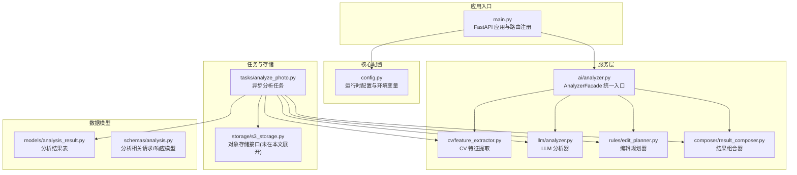
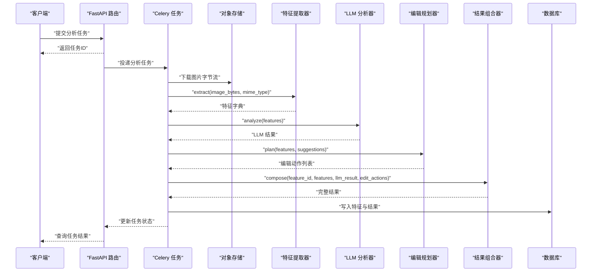
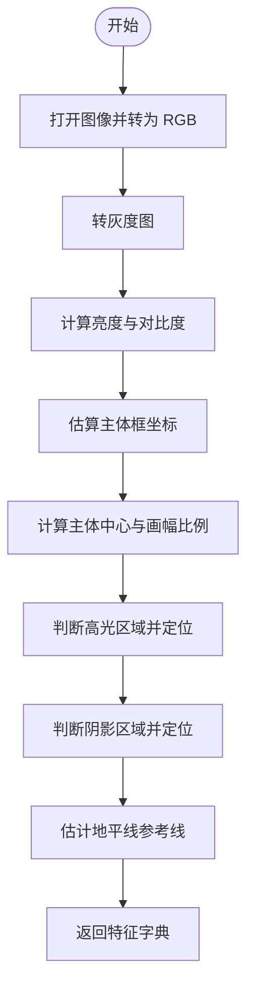
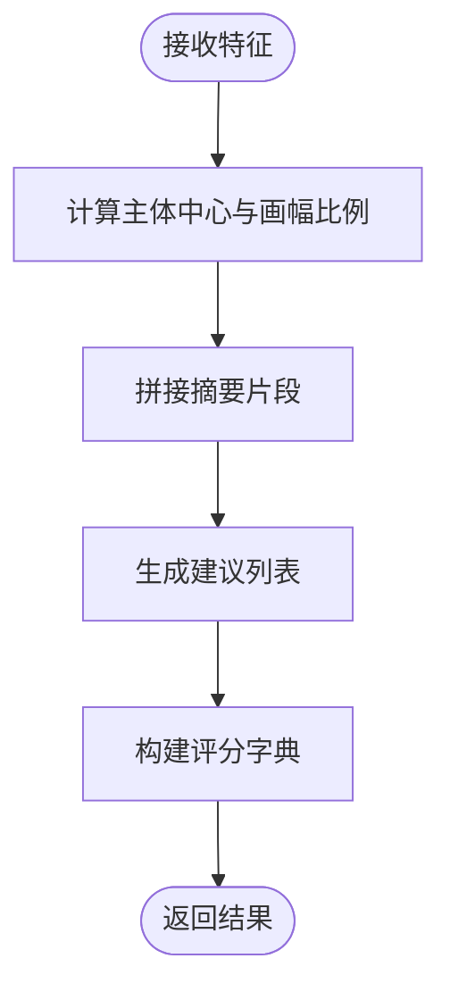
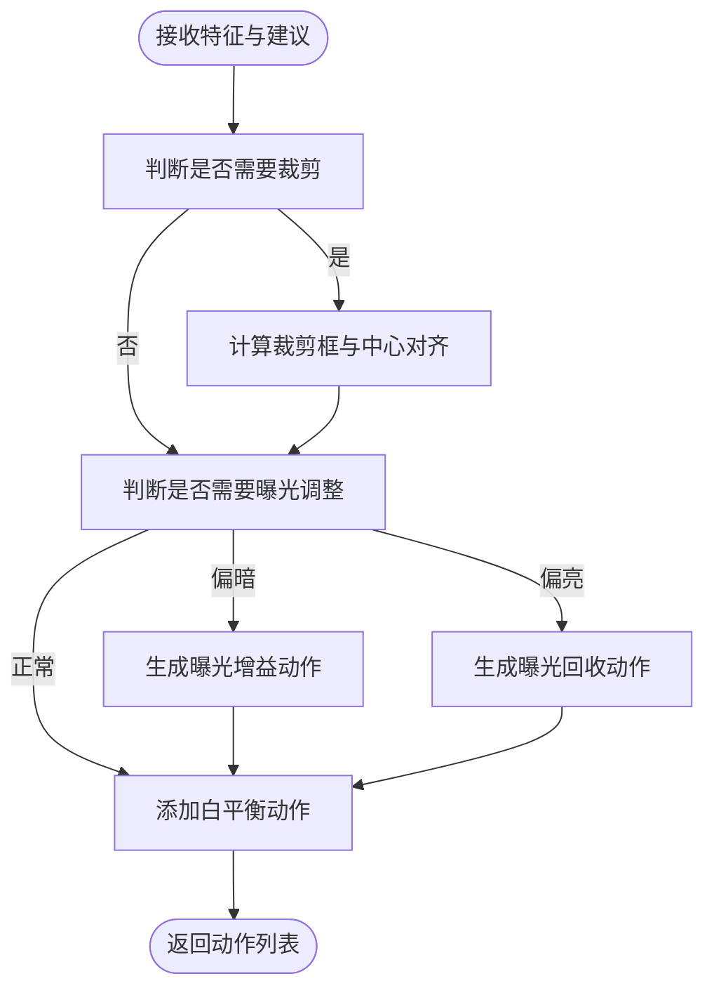
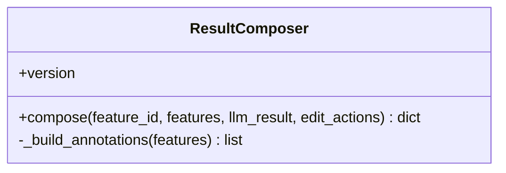
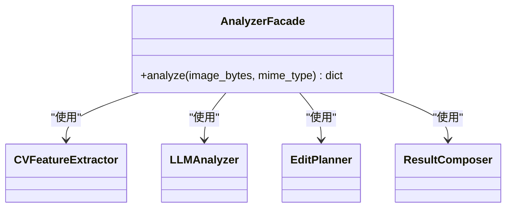
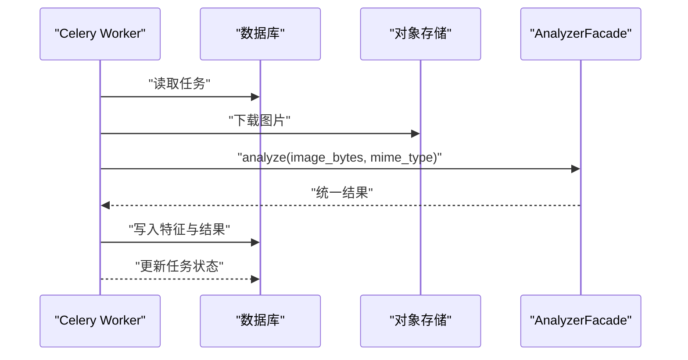
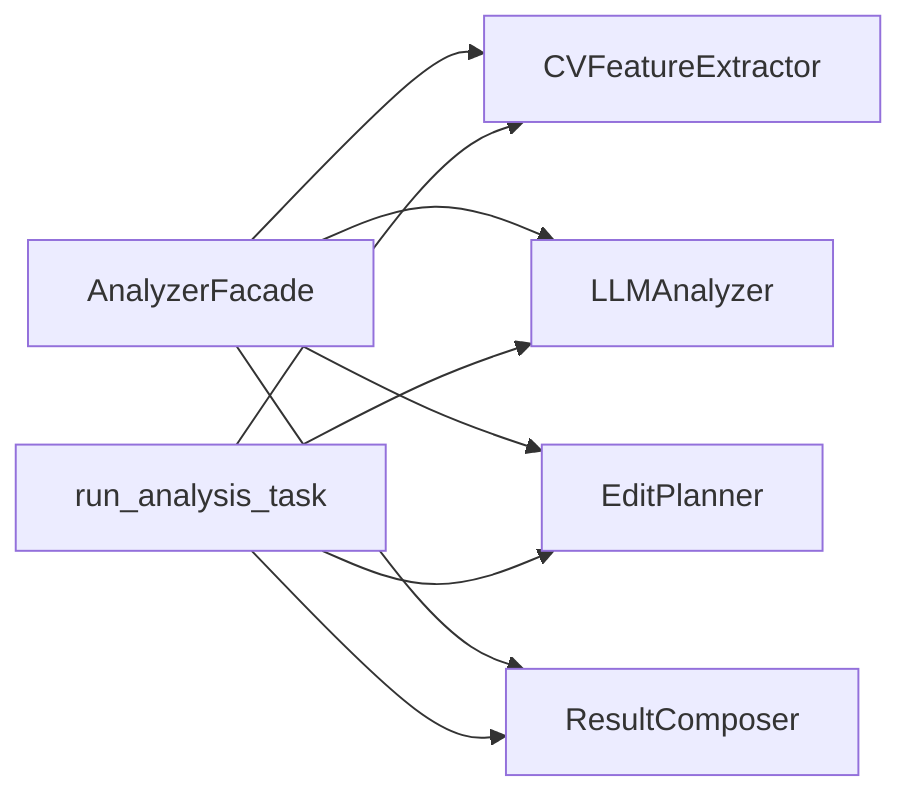

# 大语言模型分析

<cite>
**本文引用的文件**
- [apps/api/app/main.py](file://apps/api/app/main.py)
- [apps/api/app/core/config.py](file://apps/api/app/core/config.py)
- [apps/api/app/services/cv/feature_extractor.py](file://apps/api/app/services/cv/feature_extractor.py)
- [apps/api/app/services/llm/analyzer.py](file://apps/api/app/services/llm/analyzer.py)
- [apps/api/app/services/ai/analyzer.py](file://apps/api/app/services/ai/analyzer.py)
- [apps/api/app/services/rules/edit_planner.py](file://apps/api/app/services/rules/edit_planner.py)
- [apps/api/app/services/composer/result_composer.py](file://apps/api/app/services/composer/result_composer.py)
- [apps/api/app/tasks/analyze_photo.py](file://apps/api/app/tasks/analyze_photo.py)
- [apps/api/app/models/analysis_result.py](file://apps/api/app/models/analysis_result.py)
- [apps/api/app/schemas/analysis.py](file://apps/api/app/schemas/analysis.py)
</cite>

## 目录
1. [简介](#简介)
2. [项目结构](#项目结构)
3. [核心组件](#核心组件)
4. [架构总览](#架构总览)
5. [详细组件分析](#详细组件分析)
6. [依赖分析](#依赖分析)
7. [性能考虑](#性能考虑)
8. [故障排查指南](#故障排查指南)
9. [结论](#结论)
10. [附录](#附录)

## 简介
本技术文档面向“大语言模型分析系统”，聚焦于摄影图像的智能分析与建议生成。系统通过计算机视觉提取图像特征，结合规则化的编辑建议与结构化输出，形成可执行的摄影改进方案。文档覆盖以下主题：
- LLM 在摄影分析中的应用：提示工程、多模态输入（图像像素与统计特征）、结构化输出（评分、建议、注释）。
- 分析器配置参数、模型选择与调用方式。
- 将计算机视觉特征转换为 LLM 可理解的文本格式的方法。
- 摄影技巧建议生成的算法逻辑与质量控制机制。
- 输出后处理与标准化流程，以及与人类专家评审一致性的评估思路。

## 项目结构
后端采用 FastAPI 应用，服务层按职责拆分：CV 特征提取、LLM 分析、编辑规划、结果组合与任务编排；数据库模型与任务队列负责持久化与异步执行；前端通过 API 调用完成交互。

图表来源
- [apps/api/app/main.py:1-36](file://apps/api/app/main.py#L1-L36)
- [apps/api/app/core/config.py:1-47](file://apps/api/app/core/config.py#L1-L47)
- [apps/api/app/services/ai/analyzer.py:1-27](file://apps/api/app/services/ai/analyzer.py#L1-L27)
- [apps/api/app/services/cv/feature_extractor.py:1-98](file://apps/api/app/services/cv/feature_extractor.py#L1-L98)
- [apps/api/app/services/llm/analyzer.py:1-139](file://apps/api/app/services/llm/analyzer.py#L1-L139)
- [apps/api/app/services/rules/edit_planner.py:1-97](file://apps/api/app/services/rules/edit_planner.py#L1-L97)
- [apps/api/app/services/composer/result_composer.py:1-99](file://apps/api/app/services/composer/result_composer.py#L1-L99)
- [apps/api/app/tasks/analyze_photo.py:1-108](file://apps/api/app/tasks/analyze_photo.py#L1-L108)
- [apps/api/app/models/analysis_result.py:1-28](file://apps/api/app/models/analysis_result.py#L1-L28)
- [apps/api/app/schemas/analysis.py:1-52](file://apps/api/app/schemas/analysis.py#L1-L52)

章节来源
- [apps/api/app/main.py:1-36](file://apps/api/app/main.py#L1-L36)
- [apps/api/app/core/config.py:1-47](file://apps/api/app/core/config.py#L1-L47)

## 核心组件
- 配置中心：集中管理应用名称、API 前缀、数据库与缓存连接、S3 存储、模型名称与提示版本、CORS 来源、JWT 参数等。
- 特征提取器：从图像字节流解析尺寸、亮度与对比度统计、主体框、高光/阴影区域、地平线参考线等。
- LLM 分析器：基于特征生成摘要、建议与评分，提供构图、曝光、色彩与故事性四个维度的打分。
- 编辑规划器：依据主体重心与平均亮度，自动生成裁剪与曝光调整动作，附加白平衡建议。
- 结果组合器：将 LLM 结果、特征与编辑动作整合为统一输出，附加可视化标注。
- 分析门面：串联 CV 提取、LLM 分析、编辑规划与结果组合，对外暴露统一分析接口。
- 异步任务：Celery 任务加载图片、执行分析、写入特征与结果、更新任务状态。
- 数据模型与模式：定义分析结果表结构与分析任务的请求/响应模型。

章节来源
- [apps/api/app/core/config.py:6-47](file://apps/api/app/core/config.py#L6-L47)
- [apps/api/app/services/cv/feature_extractor.py:12-98](file://apps/api/app/services/cv/feature_extractor.py#L12-L98)
- [apps/api/app/services/llm/analyzer.py:5-139](file://apps/api/app/services/llm/analyzer.py#L5-L139)
- [apps/api/app/services/rules/edit_planner.py:5-97](file://apps/api/app/services/rules/edit_planner.py#L5-L97)
- [apps/api/app/services/composer/result_composer.py:5-99](file://apps/api/app/services/composer/result_composer.py#L5-L99)
- [apps/api/app/services/ai/analyzer.py:10-27](file://apps/api/app/services/ai/analyzer.py#L10-L27)
- [apps/api/app/tasks/analyze_photo.py:19-108](file://apps/api/app/tasks/analyze_photo.py#L19-L108)
- [apps/api/app/models/analysis_result.py:10-28](file://apps/api/app/models/analysis_result.py#L10-L28)
- [apps/api/app/schemas/analysis.py:8-52](file://apps/api/app/schemas/analysis.py#L8-L52)

## 架构总览
系统采用“特征驱动 + 规则建议 + 结构化输出”的流水线式设计。前端触发分析任务，后端异步执行，最终返回统一的 JSON 结构，便于前端渲染与后续自动化编辑。

图表来源
- [apps/api/app/tasks/analyze_photo.py:19-108](file://apps/api/app/tasks/analyze_photo.py#L19-L108)
- [apps/api/app/services/ai/analyzer.py:10-27](file://apps/api/app/services/ai/analyzer.py#L10-L27)
- [apps/api/app/services/cv/feature_extractor.py:15-98](file://apps/api/app/services/cv/feature_extractor.py#L15-L98)
- [apps/api/app/services/llm/analyzer.py:8-139](file://apps/api/app/services/llm/analyzer.py#L8-L139)
- [apps/api/app/services/rules/edit_planner.py:6-97](file://apps/api/app/services/rules/edit_planner.py#L6-L97)
- [apps/api/app/services/composer/result_composer.py:8-99](file://apps/api/app/services/composer/result_composer.py#L8-L99)

## 详细组件分析

### 配置与运行时参数
- 关键参数
  - 应用名称、环境、API 前缀
  - 数据库与 Redis 连接
  - S3 端点、访问密钥、桶名、区域
  - 模型名称与提示版本
  - CORS 允许来源列表
  - JWT 密钥、算法、过期时间
- 使用方式
  - 通过环境变量注入，运行时缓存实例，避免重复 IO。
  - FastAPI 启动时初始化数据库，注册路由。

章节来源
- [apps/api/app/core/config.py:6-47](file://apps/api/app/core/config.py#L6-L47)
- [apps/api/app/main.py:27-36](file://apps/api/app/main.py#L27-L36)

### 计算机视觉特征提取
- 输入：图像字节流与 MIME 类型
- 输出：包含版本号、图像尺寸与类型、亮度/对比度统计、主体框、高光/阴影区域、地平线参考线等字段的字典
- 关键逻辑
  - 将图像转为灰度以计算亮度与对比度
  - 主体框按经验比例估算，中心点用于构图平衡判断
  - 高光/阴影区域按阈值与经验坐标估算
  - 地平线参考线用于后续构图与校正

图表来源
- [apps/api/app/services/cv/feature_extractor.py:15-98](file://apps/api/app/services/cv/feature_extractor.py#L15-L98)

章节来源
- [apps/api/app/services/cv/feature_extractor.py:12-98](file://apps/api/app/services/cv/feature_extractor.py#L12-L98)

### LLM 分析器（摄影建议与评分）
- 输入：特征字典（图像、主体、统计、区域、参考线）
- 输出：包含版本、摘要、建议列表、评分字典的结果
- 建议类型与优先级
  - 构图（composition）：针对主体重心偏移给出裁剪建议
  - 曝光（exposure）：针对平均亮度偏低或偏高给出曝光调整建议
  - 故事（story）：针对背景参与度不足给出清理建议
- 评分构建
  - 构图：基于主体中心偏离程度
  - 曝光：基于平均亮度与目标区间的距离
  - 色彩：基于对比度的近似映射
  - 故事：综合构图与曝光的加权

图表来源
- [apps/api/app/services/llm/analyzer.py:8-139](file://apps/api/app/services/llm/analyzer.py#L8-L139)

章节来源
- [apps/api/app/services/llm/analyzer.py:5-139](file://apps/api/app/services/llm/analyzer.py#L5-L139)

### 编辑规划器（自动化编辑动作）
- 输入：特征字典与 LLM 建议列表
- 输出：编辑动作列表（裁剪、曝光、白平衡）
- 规则要点
  - 裁剪：当主体重心偏离三分线范围时，计算目标裁剪框与中心对齐策略
  - 曝光：根据平均亮度阈值自动选择增益或回收策略
  - 白平衡：提供非破坏性且可预览的轻量白平衡动作

图表来源
- [apps/api/app/services/rules/edit_planner.py:6-97](file://apps/api/app/services/rules/edit_planner.py#L6-L97)

章节来源
- [apps/api/app/services/rules/edit_planner.py:5-97](file://apps/api/app/services/rules/edit_planner.py#L5-L97)

### 结果组合器（结构化输出）
- 输入：特征 ID、特征字典、LLM 结果、编辑动作
- 输出：统一结果结构，包含摘要、建议、评分、特征引用、注释与编辑动作
- 注释生成
  - 主体框：用于标注主体检测区域
  - 高光/阴影：标注高亮与暗部区域，关联对应建议
  - 地平线：标注参考线，支持后续构图与校正

图表来源
- [apps/api/app/services/composer/result_composer.py:5-99](file://apps/api/app/services/composer/result_composer.py#L5-L99)

章节来源
- [apps/api/app/services/composer/result_composer.py:5-99](file://apps/api/app/services/composer/result_composer.py#L5-L99)

### 分析门面（统一分析入口）
- 组合 CV 提取、LLM 分析、编辑规划与结果组合
- 对外暴露统一分析接口，便于 API 层直接调用

图表来源
- [apps/api/app/services/ai/analyzer.py:10-27](file://apps/api/app/services/ai/analyzer.py#L10-L27)
- [apps/api/app/services/cv/feature_extractor.py:94-98](file://apps/api/app/services/cv/feature_extractor.py#L94-L98)
- [apps/api/app/services/llm/analyzer.py:135-139](file://apps/api/app/services/llm/analyzer.py#L135-L139)
- [apps/api/app/services/rules/edit_planner.py:93-97](file://apps/api/app/services/rules/edit_planner.py#L93-L97)
- [apps/api/app/services/composer/result_composer.py:95-99](file://apps/api/app/services/composer/result_composer.py#L95-L99)

章节来源
- [apps/api/app/services/ai/analyzer.py:10-27](file://apps/api/app/services/ai/analyzer.py#L10-L27)

### 异步分析任务（Celery）
- 流程
  - 加载任务与图片
  - 执行特征提取、LLM 分析、编辑规划与结果组合
  - 写入特征与结果到数据库，更新任务状态
- 错误处理
  - 捕获异常并回滚，记录错误码与消息

图表来源
- [apps/api/app/tasks/analyze_photo.py:19-108](file://apps/api/app/tasks/analyze_photo.py#L19-L108)
- [apps/api/app/services/ai/analyzer.py:10-27](file://apps/api/app/services/ai/analyzer.py#L10-L27)

章节来源
- [apps/api/app/tasks/analyze_photo.py:19-108](file://apps/api/app/tasks/analyze_photo.py#L19-L108)

### 数据模型与模式
- 分析结果表：保存任务 ID、图片 ID、版本、JSON 结果与时间戳，含索引优化
- 分析任务模式：定义任务详情、历史项与重试响应的数据结构

章节来源
- [apps/api/app/models/analysis_result.py:10-28](file://apps/api/app/models/analysis_result.py#L10-L28)
- [apps/api/app/schemas/analysis.py:8-52](file://apps/api/app/schemas/analysis.py#L8-L52)

## 依赖分析
- 组件耦合
  - AnalyzerFacade 作为门面，依赖 CV、LLM、规划与组合模块
  - 任务执行链路复用门面逻辑，保证一致性
- 外部依赖
  - 图像处理依赖 Pillow
  - 异步任务依赖 Celery 与数据库会话
  - 存储依赖对象存储服务（接口抽象）

图表来源
- [apps/api/app/services/ai/analyzer.py:10-27](file://apps/api/app/services/ai/analyzer.py#L10-L27)
- [apps/api/app/tasks/analyze_photo.py:19-108](file://apps/api/app/tasks/analyze_photo.py#L19-L108)

章节来源
- [apps/api/app/services/ai/analyzer.py:10-27](file://apps/api/app/services/ai/analyzer.py#L10-L27)
- [apps/api/app/tasks/analyze_photo.py:19-108](file://apps/api/app/tasks/analyze_photo.py#L19-L108)

## 性能考虑
- 缓存策略
  - 各服务组件均使用单例缓存，降低重复初始化开销
- I/O 优化
  - 图像解码与统计计算在内存中完成，尽量避免多次 IO
- 并发与异步
  - 通过 Celery 异步执行分析任务，释放 Web 请求线程
- 数据库索引
  - 结果表对图片与时间建立索引，加速历史查询与检索

## 故障排查指南
- 常见问题
  - 图片未找到：检查对象存储键是否存在与权限
  - 任务失败：查看任务错误码与消息，确认异常栈
  - 输出为空：检查特征提取是否成功、LLM 分析是否返回建议
- 排查步骤
  - 核对配置项（数据库、Redis、S3、CORS、JWT）
  - 查看任务状态与日志
  - 验证特征字典完整性与合理性
  - 确认建议与动作是否被正确组合

章节来源
- [apps/api/app/tasks/analyze_photo.py:97-108](file://apps/api/app/tasks/analyze_photo.py#L97-L108)

## 结论
该系统以“特征驱动 + 规则建议 + 结构化输出”为核心，实现了从图像到建议再到可执行动作的闭环。通过统一的门面与任务编排，确保前后端与存储层的解耦与可扩展性。建议在未来引入真实 LLM 与更丰富的提示模板，同时完善与人类专家评审的一致性评估指标与反馈机制。

## 附录

### 摄影建议生成算法与质量控制
- 算法逻辑
  - 构图建议：基于主体中心与画幅比例，判断是否偏离三分线，若偏离则建议裁剪收紧
  - 曝光建议：基于平均亮度阈值，分别给出增益或回收策略
  - 故事建议：在主体位置合理的基础上，建议清理分散注意力的边缘区域
- 质量控制
  - 建议与注释双向关联，便于前端展示与用户交互
  - 动作具备预览与非破坏性标记，降低风险
  - 评分体系提供量化参考，便于排序与筛选

章节来源
- [apps/api/app/services/llm/analyzer.py:32-111](file://apps/api/app/services/llm/analyzer.py#L32-L111)
- [apps/api/app/services/composer/result_composer.py:26-92](file://apps/api/app/services/composer/result_composer.py#L26-L92)
- [apps/api/app/services/rules/edit_planner.py:36-90](file://apps/api/app/services/rules/edit_planner.py#L36-L90)

### 与人类专家评审的一致性评估
- 建议指标
  - 建议类型与优先级是否符合专家共识
  - 动作描述与可执行性是否清晰
  - 评分与专家主观评价的相关性
- 实施建议
  - 建立专家标注样本集，计算与专家评审的一致率
  - 引入 A/B 测试，对比不同规则阈值的效果
  - 收集用户反馈，持续迭代建议与动作