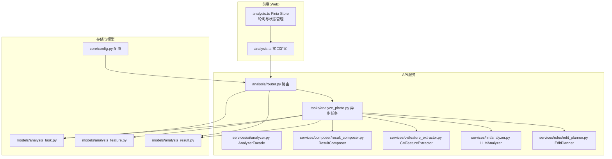
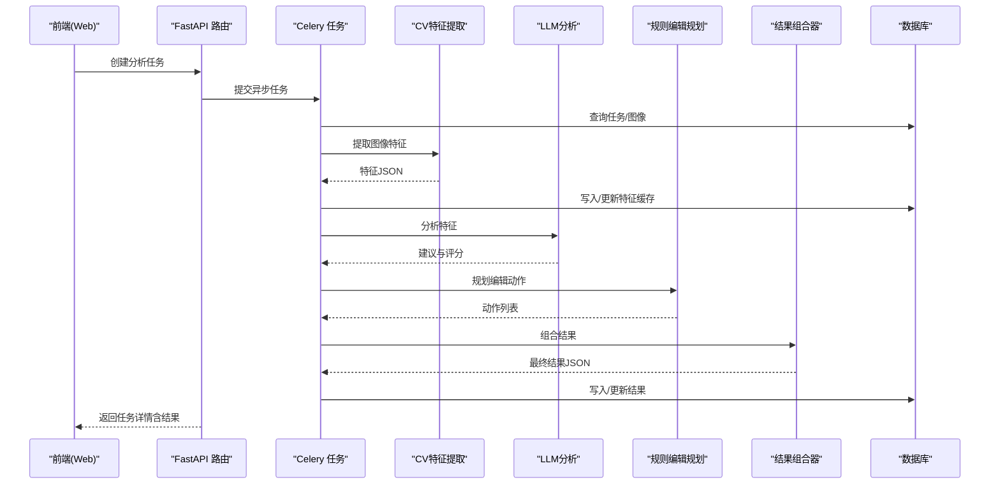
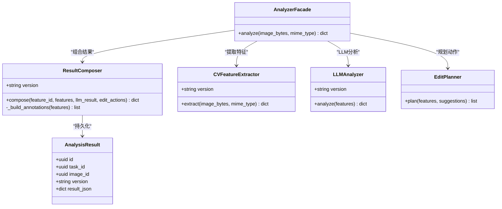
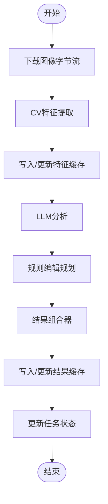
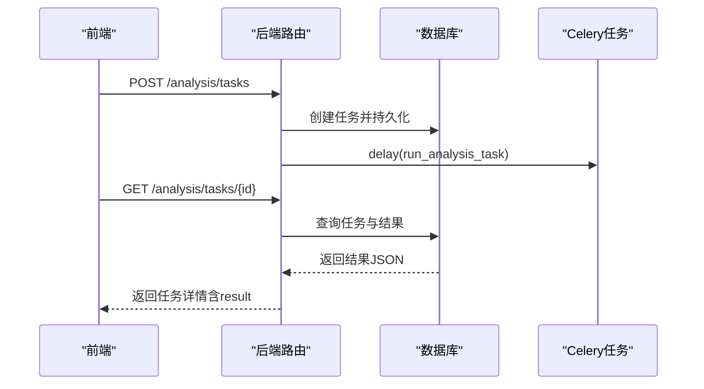
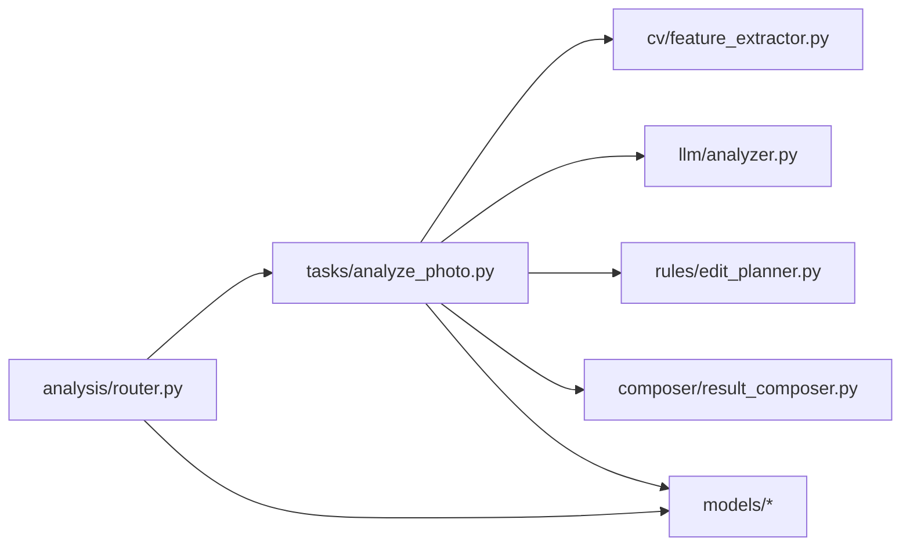

# 结果组合器

<cite>
**本文引用的文件**
- [apps/api/app/services/composer/result_composer.py](file://apps/api/app/services/composer/result_composer.py)
- [apps/api/app/services/ai/analyzer.py](file://apps/api/app/services/ai/analyzer.py)
- [apps/api/app/services/cv/feature_extractor.py](file://apps/api/app/services/cv/feature_extractor.py)
- [apps/api/app/services/llm/analyzer.py](file://apps/api/app/services/llm/analyzer.py)
- [apps/api/app/services/rules/edit_planner.py](file://apps/api/app/services/rules/edit_planner.py)
- [apps/api/app/tasks/analyze_photo.py](file://apps/api/app/tasks/analyze_photo.py)
- [apps/api/app/modules/analysis/router.py](file://apps/api/app/modules/analysis/router.py)
- [apps/api/app/models/analysis_result.py](file://apps/api/app/models/analysis_result.py)
- [apps/api/app/models/analysis_feature.py](file://apps/api/app/models/analysis_feature.py)
- [apps/api/app/models/analysis_task.py](file://apps/api/app/models/analysis_task.py)
- [apps/api/app/core/config.py](file://apps/api/app/core/config.py)
- [packages/contracts/analysis-result.schema.json](file://packages/contracts/analysis-result.schema.json)
- [packages/contracts/annotation.schema.json](file://packages/contracts/annotation.schema.json)
- [packages/contracts/edit-action.schema.json](file://packages/contracts/edit-action.schema.json)
- [apps/web/src/api/analysis.ts](file://apps/web/src/api/analysis.ts)
- [apps/web/src/stores/analysis.ts](file://apps/web/src/stores/analysis.ts)
</cite>

## 目录
1. [简介](#简介)
2. [项目结构](#项目结构)
3. [核心组件](#核心组件)
4. [架构总览](#架构总览)
5. [详细组件分析](#详细组件分析)
6. [依赖分析](#依赖分析)
7. [性能考虑](#性能考虑)
8. [故障排查指南](#故障排查指南)
9. [结论](#结论)
10. [附录](#附录)

## 简介
本文件为“AI分析结果组合器”的技术文档，聚焦于如何将来自计算机视觉（CV）、大语言模型（LLM）与规则引擎的多源分析结果进行整合与格式化，形成统一的分析结果对象。内容涵盖：
- 数据结构设计与字段映射
- 版本兼容性与契约校验
- 结果的层次化组织与元数据管理
- 用户体验优化与前端接口规范
- 质量检查与异常处理机制
- 缓存策略与性能优化
- 与前端展示层的数据传输协议

## 项目结构
后端采用分层架构：API路由层负责任务编排与查询；Celery异步任务层执行特征提取、LLM分析与编辑动作规划；组合器将各组件结果聚合为最终输出；数据库持久化任务、特征与结果；前端通过HTTP接口消费结果。

图表来源
- [apps/api/app/modules/analysis/router.py:1-151](file://apps/api/app/modules/analysis/router.py#L1-L151)
- [apps/api/app/tasks/analyze_photo.py:1-108](file://apps/api/app/tasks/analyze_photo.py#L1-L108)
- [apps/api/app/services/ai/analyzer.py:1-27](file://apps/api/app/services/ai/analyzer.py#L1-L27)
- [apps/api/app/services/composer/result_composer.py:1-99](file://apps/api/app/services/composer/result_composer.py#L1-L99)
- [apps/api/app/services/cv/feature_extractor.py:1-98](file://apps/api/app/services/cv/feature_extractor.py#L1-L98)
- [apps/api/app/services/llm/analyzer.py:1-139](file://apps/api/app/services/llm/analyzer.py#L1-L139)
- [apps/api/app/services/rules/edit_planner.py:1-97](file://apps/api/app/services/rules/edit_planner.py#L1-L97)
- [apps/api/app/models/analysis_task.py:1-36](file://apps/api/app/models/analysis_task.py#L1-L36)
- [apps/api/app/models/analysis_feature.py:1-29](file://apps/api/app/models/analysis_feature.py#L1-L29)
- [apps/api/app/models/analysis_result.py:1-28](file://apps/api/app/models/analysis_result.py#L1-L28)
- [apps/api/app/core/config.py:1-47](file://apps/api/app/core/config.py#L1-L47)

章节来源
- [apps/api/app/modules/analysis/router.py:1-151](file://apps/api/app/modules/analysis/router.py#L1-L151)
- [apps/api/app/tasks/analyze_photo.py:1-108](file://apps/api/app/tasks/analyze_photo.py#L1-L108)

## 核心组件
- 组合器（ResultComposer）
  - 职责：将特征、LLM分析结果与编辑动作整合为统一的分析结果对象，生成注解（annotations）与建议（suggestions）之间的关联。
  - 关键点：版本号固定为“1.1”；注解来源于CV特征；支持LRU缓存实例化。
- 分析门面（AnalyzerFacade）
  - 职责：协调CV特征提取、LLM分析与规则编辑动作规划，调用组合器产出最终结果。
- 异步任务（run_analysis_task）
  - 职责：从存储下载图像字节流，依次执行特征提取、LLM分析、动作规划与结果组合，并持久化到数据库。
- 路由层（analysis/router.py）
  - 职责：创建任务、查询任务详情、拉取历史、重试任务；返回符合前端契约的响应体。
- 数据模型
  - AnalysisTask：任务生命周期与元数据。
  - AnalysisFeature：中间特征缓存（JSON字段）。
  - AnalysisResult：最终结果缓存（JSON字段），带版本与索引优化。

章节来源
- [apps/api/app/services/composer/result_composer.py:1-99](file://apps/api/app/services/composer/result_composer.py#L1-L99)
- [apps/api/app/services/ai/analyzer.py:1-27](file://apps/api/app/services/ai/analyzer.py#L1-L27)
- [apps/api/app/tasks/analyze_photo.py:1-108](file://apps/api/app/tasks/analyze_photo.py#L1-L108)
- [apps/api/app/modules/analysis/router.py:1-151](file://apps/api/app/modules/analysis/router.py#L1-L151)
- [apps/api/app/models/analysis_task.py:1-36](file://apps/api/app/models/analysis_task.py#L1-L36)
- [apps/api/app/models/analysis_feature.py:1-29](file://apps/api/app/models/analysis_feature.py#L1-L29)
- [apps/api/app/models/analysis_result.py:1-28](file://apps/api/app/models/analysis_result.py#L1-L28)

## 架构总览
下图展示了从前端请求到最终结果返回的完整流程，以及各组件间的依赖关系与数据流向。

图表来源
- [apps/api/app/modules/analysis/router.py:45-74](file://apps/api/app/modules/analysis/router.py#L45-L74)
- [apps/api/app/tasks/analyze_photo.py:19-108](file://apps/api/app/tasks/analyze_photo.py#L19-L108)
- [apps/api/app/services/ai/analyzer.py:10-21](file://apps/api/app/services/ai/analyzer.py#L10-L21)
- [apps/api/app/services/composer/result_composer.py:8-23](file://apps/api/app/services/composer/result_composer.py#L8-L23)

## 详细组件分析

### 组件A：结果组合器（ResultComposer）
- 设计要点
  - 输出结构包含版本、摘要、建议、评分、特征引用、注解与编辑动作。
  - 注解构建逻辑基于CV特征中的主体、高光、阴影与地平线等几何信息，标注来源、类别、几何类型、坐标系、置信度与关联建议ID。
  - 使用LRU缓存单例，降低重复实例化开销。
- 字段映射与约束
  - 建议（suggestions）与评分（scores）直接来自LLM分析结果。
  - 注解（annotations）由CV特征转换而来，几何类型覆盖bbox与line，坐标系为像素。
  - 特征引用（features_ref）指向AnalysisFeature记录ID，便于溯源与复用。
- 版本兼容性
  - 组合器版本固定为“1.1”，与AnalysisResult.version保持一致，确保前后端契约一致。

图表来源
- [apps/api/app/services/composer/result_composer.py:5-99](file://apps/api/app/services/composer/result_composer.py#L5-L99)
- [apps/api/app/services/ai/analyzer.py:10-27](file://apps/api/app/services/ai/analyzer.py#L10-L27)
- [apps/api/app/services/cv/feature_extractor.py:12-98](file://apps/api/app/services/cv/feature_extractor.py#L12-L98)
- [apps/api/app/services/llm/analyzer.py:5-139](file://apps/api/app/services/llm/analyzer.py#L5-L139)
- [apps/api/app/services/rules/edit_planner.py:5-97](file://apps/api/app/services/rules/edit_planner.py#L5-L97)
- [apps/api/app/models/analysis_result.py:10-28](file://apps/api/app/models/analysis_result.py#L10-L28)

章节来源
- [apps/api/app/services/composer/result_composer.py:1-99](file://apps/api/app/services/composer/result_composer.py#L1-L99)

### 组件B：异步分析任务（run_analysis_task）
- 流程要点
  - 下载图像字节流，执行特征提取、LLM分析、动作规划与结果组合。
  - 将特征与结果分别写入AnalysisFeature与AnalysisResult表，维护版本字段。
  - 更新AnalysisTask状态与错误信息，异常时回滚并记录错误码与消息。
- 性能与可靠性
  - 使用数据库事务包裹，异常回滚保证一致性。
  - 支持重试：路由层提供重试接口，将任务置为PENDING并重新调度。

图表来源
- [apps/api/app/tasks/analyze_photo.py:19-108](file://apps/api/app/tasks/analyze_photo.py#L19-L108)

章节来源
- [apps/api/app/tasks/analyze_photo.py:1-108](file://apps/api/app/tasks/analyze_photo.py#L1-L108)

### 组件C：路由与前端接口（analysis/router.py 与 analysis.ts）
- 后端路由
  - 创建任务：校验图像归属，写入任务并投递Celery任务。
  - 获取任务详情：按用户权限查询，返回包含结果的详细响应。
  - 历史查询：按用户与时间排序返回摘要。
  - 重试任务：仅允许FAILED/SUCCEEDED状态的任务重试。
- 前端契约
  - 定义建议、注解、编辑动作与分析结果的TS类型，与JSON Schema一致。
  - Store使用轮询策略定期拉取任务状态，直至完成或失败。

图表来源
- [apps/api/app/modules/analysis/router.py:45-90](file://apps/api/app/modules/analysis/router.py#L45-L90)
- [apps/web/src/api/analysis.ts:36-66](file://apps/web/src/api/analysis.ts#L36-L66)
- [apps/web/src/stores/analysis.ts:76-90](file://apps/web/src/stores/analysis.ts#L76-L90)

章节来源
- [apps/api/app/modules/analysis/router.py:1-151](file://apps/api/app/modules/analysis/router.py#L1-L151)
- [apps/web/src/api/analysis.ts:1-101](file://apps/web/src/api/analysis.ts#L1-L101)
- [apps/web/src/stores/analysis.ts:1-142](file://apps/web/src/stores/analysis.ts#L1-L142)

## 依赖分析
- 组件耦合
  - AnalyzerFacade作为门面，依赖CV、LLM与规则模块，再委托组合器。
  - run_analysis_task直接依赖上述四个服务与组合器，同时与数据库模型交互。
  - 路由层依赖任务与结果模型，向前端暴露统一接口。
- 外部依赖
  - 存储服务用于下载图像字节流。
  - Redis/数据库用于任务队列与持久化。
- 可能的循环依赖
  - 当前文件间无循环导入，职责清晰分离。

图表来源
- [apps/api/app/modules/analysis/router.py:1-151](file://apps/api/app/modules/analysis/router.py#L1-L151)
- [apps/api/app/tasks/analyze_photo.py:1-108](file://apps/api/app/tasks/analyze_photo.py#L1-L108)
- [apps/api/app/services/ai/analyzer.py:1-27](file://apps/api/app/services/ai/analyzer.py#L1-L27)
- [apps/api/app/services/composer/result_composer.py:1-99](file://apps/api/app/services/composer/result_composer.py#L1-L99)
- [apps/api/app/models/analysis_result.py:1-28](file://apps/api/app/models/analysis_result.py#L1-L28)

章节来源
- [apps/api/app/modules/analysis/router.py:1-151](file://apps/api/app/modules/analysis/router.py#L1-L151)
- [apps/api/app/tasks/analyze_photo.py:1-108](file://apps/api/app/tasks/analyze_photo.py#L1-L108)

## 性能考虑
- 缓存策略
  - 组合器、门面、CV、LLM、规则与编辑规划均使用LRU缓存单例，减少重复初始化成本。
  - 建议：可引入Redis缓存热点结果与特征，结合ETag或版本号实现条件请求。
- 数据库优化
  - AnalysisResult与AnalysisFeature对JSON字段建立GIN索引，加速查询与过滤。
  - 对常用查询字段建立复合索引，如任务状态与创建时间。
- I/O与并发
  - 图像下载与特征提取、LLM分析、动作规划串行执行，建议在可行场景并行化（注意资源限制）。
  - Celery任务拆分与限流，避免瞬时高峰导致资源争用。
- 前端轮询
  - Store以固定间隔轮询，建议根据任务耗时动态调整轮询周期，或在任务完成后立即刷新。

章节来源
- [apps/api/app/services/composer/result_composer.py:95-99](file://apps/api/app/services/composer/result_composer.py#L95-L99)
- [apps/api/app/services/ai/analyzer.py:23-27](file://apps/api/app/services/ai/analyzer.py#L23-L27)
- [apps/api/app/services/cv/feature_extractor.py:94-98](file://apps/api/app/services/cv/feature_extractor.py#L94-L98)
- [apps/api/app/services/llm/analyzer.py:135-139](file://apps/api/app/services/llm/analyzer.py#L135-L139)
- [apps/api/app/services/rules/edit_planner.py:93-97](file://apps/api/app/services/rules/edit_planner.py#L93-L97)
- [apps/api/app/models/analysis_result.py:24-27](file://apps/api/app/models/analysis_result.py#L24-L27)
- [apps/api/app/models/analysis_feature.py:24-27](file://apps/api/app/models/analysis_feature.py#L24-L27)
- [apps/web/src/stores/analysis.ts:15-21](file://apps/web/src/stores/analysis.ts#L15-L21)

## 故障排查指南
- 常见问题
  - 图像未找到：任务创建阶段若图像不存在，会抛出404；检查图像ID与用户绑定。
  - 权限不足：非任务所属用户访问任务详情，返回403；确认鉴权与用户上下文。
  - 任务运行中：重试接口要求任务状态为FAILED或SUCCEEDED，否则返回400。
  - 异常回滚：任务执行异常时，状态置为FAILED并记录错误码与消息，可在任务详情查看。
- 建议排查步骤
  - 查看任务状态与错误信息：GET /analysis/tasks/{id}
  - 拉取历史摘要：GET /analysis/history，快速定位最近任务。
  - 重试任务：POST /analysis/tasks/{id}/retry，观察状态变化。
  - 核对版本与契约：比对前端TS类型与JSON Schema，确保字段与枚举一致。

章节来源
- [apps/api/app/modules/analysis/router.py:76-151](file://apps/api/app/modules/analysis/router.py#L76-L151)
- [apps/api/app/tasks/analyze_photo.py:97-107](file://apps/api/app/tasks/analyze_photo.py#L97-L107)

## 结论
结果组合器作为多源AI分析的“粘合层”，通过标准化的数据结构与严格的版本控制，实现了CV、LLM与规则引擎的无缝集成。配合完善的数据库索引、LRU缓存与Celery异步任务，系统在功能完整性与性能稳定性之间取得平衡。前端通过明确的契约与轮询策略，提供了良好的用户体验。后续可在缓存命中率、并发扩展与前端交互上进一步优化。

## 附录

### 数据结构与字段映射
- 分析结果对象
  - 字段：version、summary、suggestions、scores、features_ref、annotations、edit_actions
  - 来源：组合器统一产出，版本固定为“1.1”
- 建议（suggestions）
  - 类型：composition/exposure/color/story/other
  - 优先级：high/medium/low
- 注解（annotations）
  - 几何类型：bbox/line/point/polygon
  - 坐标系：image_pixels
  - 来源：cv/rule/llm
- 编辑动作（edit_actions）
  - 类型：crop/exposure/white_balance/contrast/saturation
  - 应用模式：destructive/non_destructive
  - 预览：previewable

章节来源
- [packages/contracts/analysis-result.schema.json:1-76](file://packages/contracts/analysis-result.schema.json#L1-L76)
- [packages/contracts/annotation.schema.json:1-60](file://packages/contracts/annotation.schema.json#L1-L60)
- [packages/contracts/edit-action.schema.json:1-30](file://packages/contracts/edit-action.schema.json#L1-L30)
- [apps/web/src/api/analysis.ts:5-44](file://apps/web/src/api/analysis.ts#L5-L44)

### 版本兼容性与契约校验
- 组合器版本：固定“1.1”
- 数据模型版本：AnalysisResult.version默认“1.1”，AnalysisFeature.version默认“1.0”
- JSON Schema：后端与前端契约一致，确保字段存在性与类型约束
- 建议：未来升级时，组合器版本号与Schema版本号需同步变更，并在路由层提供多版本兼容策略

章节来源
- [apps/api/app/services/composer/result_composer.py:6-6](file://apps/api/app/services/composer/result_composer.py#L6-L6)
- [apps/api/app/models/analysis_result.py:20-20](file://apps/api/app/models/analysis_result.py#L20-L20)
- [apps/api/app/models/analysis_feature.py:20-20](file://apps/api/app/models/analysis_feature.py#L20-L20)
- [packages/contracts/analysis-result.schema.json:1-76](file://packages/contracts/analysis-result.schema.json#L1-L76)

### 与前端展示层的接口规范
- 请求/响应
  - 创建任务：POST /analysis/tasks → CreateAnalysisTaskResponse
  - 获取任务详情：GET /analysis/tasks/{id} → AnalysisTaskDetailResponse（含AnalysisResult）
  - 历史查询：GET /analysis/history → AnalysisHistoryResponse
  - 重试任务：POST /analysis/tasks/{id}/retry → RetryTaskResponse
- 前端轮询
  - Store以固定间隔轮询任务状态，完成后刷新历史列表
  - 错误处理：捕获异常并显示提示信息

章节来源
- [apps/api/app/modules/analysis/router.py:45-151](file://apps/api/app/modules/analysis/router.py#L45-L151)
- [apps/web/src/api/analysis.ts:82-100](file://apps/web/src/api/analysis.ts#L82-L100)
- [apps/web/src/stores/analysis.ts:76-140](file://apps/web/src/stores/analysis.ts#L76-L140)