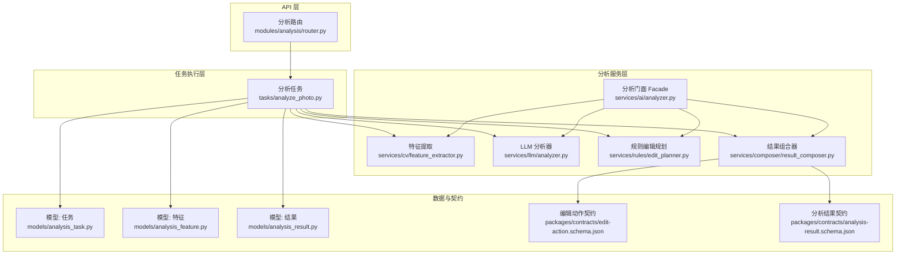
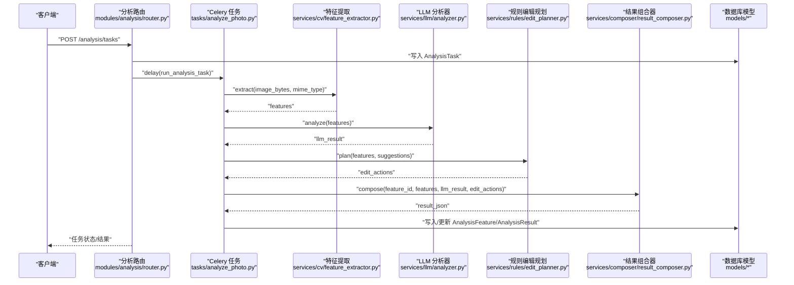
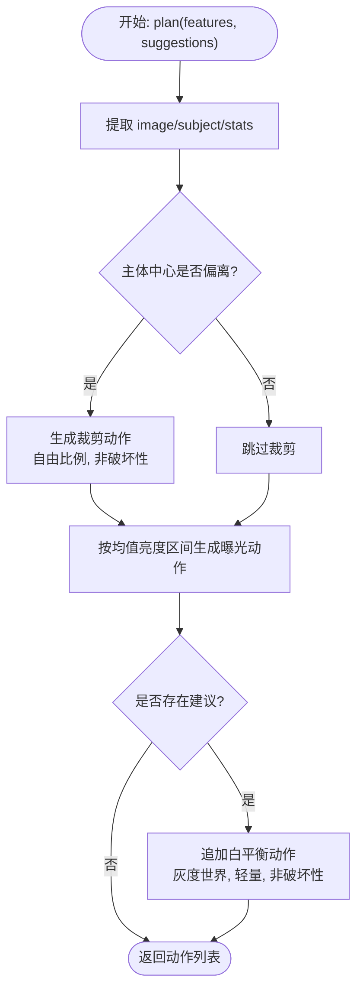
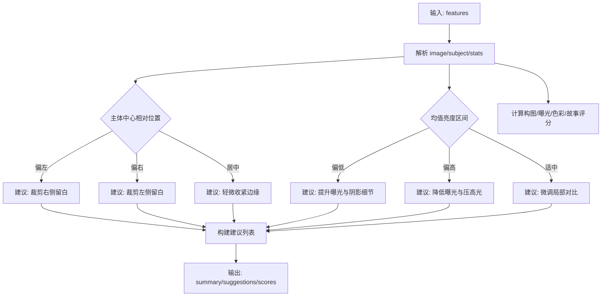
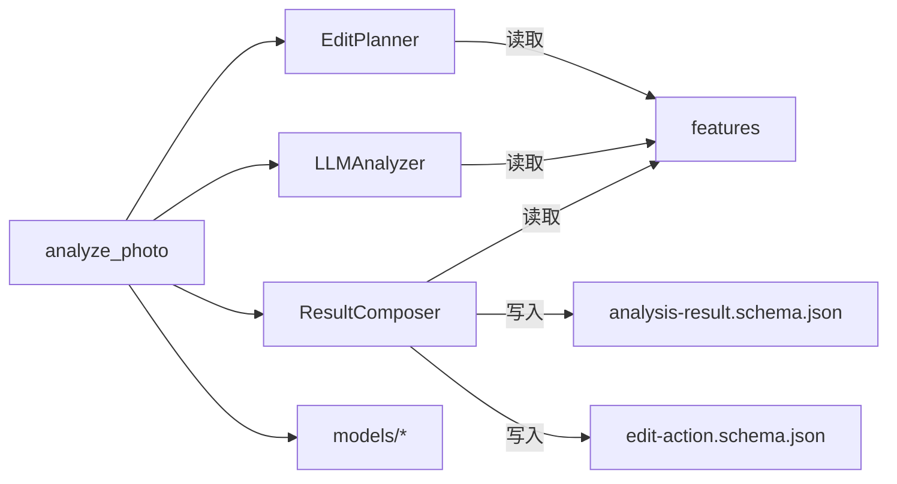

# 规则引擎编辑规划

<cite>
**本文引用的文件**
- [apps/api/app/services/rules/edit_planner.py](file://apps/api/app/services/rules/edit_planner.py)
- [apps/api/app/services/llm/analyzer.py](file://apps/api/app/services/llm/analyzer.py)
- [apps/api/app/services/cv/feature_extractor.py](file://apps/api/app/services/cv/feature_extractor.py)
- [apps/api/app/services/composer/result_composer.py](file://apps/api/app/services/composer/result_composer.py)
- [apps/api/app/services/ai/analyzer.py](file://apps/api/app/services/ai/analyzer.py)
- [apps/api/app/tasks/analyze_photo.py](file://apps/api/app/tasks/analyze_photo.py)
- [apps/api/app/modules/analysis/router.py](file://apps/api/app/modules/analysis/router.py)
- [apps/api/app/models/analysis_task.py](file://apps/api/app/models/analysis_task.py)
- [apps/api/app/models/analysis_feature.py](file://apps/api/app/models/analysis_feature.py)
- [apps/api/app/models/analysis_result.py](file://apps/api/app/models/analysis_result.py)
- [packages/contracts/edit-action.schema.json](file://packages/contracts/edit-action.schema.json)
- [packages/contracts/analysis-result.schema.json](file://packages/contracts/analysis-result.schema.json)
- [apps/api/app/core/config.py](file://apps/api/app/core/config.py)
- [apps/api/app/main.py](file://apps/api/app/main.py)
</cite>

## 目录
1. [简介](#简介)
2. [项目结构](#项目结构)
3. [核心组件](#核心组件)
4. [架构总览](#架构总览)
5. [详细组件分析](#详细组件分析)
6. [依赖关系分析](#依赖关系分析)
7. [性能考量](#性能考量)
8. [故障排查指南](#故障排查指南)
9. [结论](#结论)
10. [附录](#附录)

## 简介
本技术文档围绕“规则引擎编辑规划”子系统展开，聚焦摄影编辑规则的设计原理与实现机制，涵盖构图规则、曝光调整、色彩平衡与后期处理建议的生成逻辑；同时记录编辑动作的配置格式、优先级与冲突处理策略，以及编辑动作的生成、参数优化与效果预估流程。文档还提供规则库的维护与扩展方法（新增与更新规则）、质量评估与用户反馈机制的建议路径。

## 项目结构
该系统采用分层与模块化设计：前端通过 API 路由提交图片分析任务，后端使用 Celery 异步执行分析流水线，核心分析链路由计算机视觉特征提取、LLM 分析与规则引擎编辑规划组成，最终由结果组合器输出统一的分析结果与编辑动作。

图表来源
- [apps/api/app/modules/analysis/router.py:1-151](file://apps/api/app/modules/analysis/router.py#L1-L151)
- [apps/api/app/tasks/analyze_photo.py:1-108](file://apps/api/app/tasks/analyze_photo.py#L1-L108)
- [apps/api/app/services/ai/analyzer.py:1-27](file://apps/api/app/services/ai/analyzer.py#L1-L27)
- [apps/api/app/services/cv/feature_extractor.py:1-98](file://apps/api/app/services/cv/feature_extractor.py#L1-L98)
- [apps/api/app/services/llm/analyzer.py:1-139](file://apps/api/app/services/llm/analyzer.py#L1-L139)
- [apps/api/app/services/rules/edit_planner.py:1-97](file://apps/api/app/services/rules/edit_planner.py#L1-L97)
- [apps/api/app/services/composer/result_composer.py:1-99](file://apps/api/app/services/composer/result_composer.py#L1-L99)
- [apps/api/app/models/analysis_task.py:1-36](file://apps/api/app/models/analysis_task.py#L1-L36)
- [apps/api/app/models/analysis_feature.py:1-29](file://apps/api/app/models/analysis_feature.py#L1-L29)
- [apps/api/app/models/analysis_result.py:1-28](file://apps/api/app/models/analysis_result.py#L1-L28)
- [packages/contracts/edit-action.schema.json:1-30](file://packages/contracts/edit-action.schema.json#L1-L30)
- [packages/contracts/analysis-result.schema.json:1-76](file://packages/contracts/analysis-result.schema.json#L1-L76)

章节来源
- [apps/api/app/main.py:1-36](file://apps/api/app/main.py#L1-L36)
- [apps/api/app/core/config.py:1-47](file://apps/api/app/core/config.py#L1-L47)

## 核心组件
- 规则编辑规划器（EditPlanner）
  - 输入：图像尺寸、主体位置、统计特征（均值亮度等）
  - 输出：编辑动作列表（裁剪、曝光、白平衡等），包含动作类型、参数、预览性与应用模式
  - 关键规则：
    - 构图：依据主体中心相对水平比例，计算目标裁剪框并生成裁剪动作
    - 曝光：基于均值亮度阈值，生成增益/偏移的曝光动作
    - 白平衡：在存在 LLM 建议时，注入轻量白平衡动作作为后续调色的稳定基线
- LLM 分析器
  - 生成建议与评分，包含构图、曝光、色彩、故事性四个维度
  - 建议具有优先级（高/中/低）与可执行的动作描述
- 计算机视觉特征提取器
  - 提取图像尺寸、均值亮度、对比度、主体区域、高光/阴影区域、地平线参考线等
- 结果组合器
  - 组合 LLM 建议、编辑动作与注解（主体、高光、阴影、地平线）
- 分析门面（AnalyzerFacade）
  - 协调特征提取、LLM 分析、规则规划与结果组合
- 任务执行（Celery）
  - 异步执行分析任务，持久化特征与结果，支持重试与状态管理

章节来源
- [apps/api/app/services/rules/edit_planner.py:5-97](file://apps/api/app/services/rules/edit_planner.py#L5-L97)
- [apps/api/app/services/llm/analyzer.py:5-139](file://apps/api/app/services/llm/analyzer.py#L5-L139)
- [apps/api/app/services/cv/feature_extractor.py:12-98](file://apps/api/app/services/cv/feature_extractor.py#L12-L98)
- [apps/api/app/services/composer/result_composer.py:5-99](file://apps/api/app/services/composer/result_composer.py#L5-L99)
- [apps/api/app/services/ai/analyzer.py:10-27](file://apps/api/app/services/ai/analyzer.py#L10-L27)
- [apps/api/app/tasks/analyze_photo.py:19-108](file://apps/api/app/tasks/analyze_photo.py#L19-L108)

## 架构总览
系统以“请求-任务-分析流水线-结果持久化”的异步架构运行。API 接收任务请求，写入任务表并投递到队列；Worker 取出任务后依次执行特征提取、LLM 分析、规则规划与结果组合，并将中间特征与最终结果分别持久化。

图表来源
- [apps/api/app/modules/analysis/router.py:45-74](file://apps/api/app/modules/analysis/router.py#L45-L74)
- [apps/api/app/tasks/analyze_photo.py:19-108](file://apps/api/app/tasks/analyze_photo.py#L19-L108)
- [apps/api/app/services/ai/analyzer.py:10-21](file://apps/api/app/services/ai/analyzer.py#L10-L21)
- [apps/api/app/services/cv/feature_extractor.py:15-91](file://apps/api/app/services/cv/feature_extractor.py#L15-L91)
- [apps/api/app/services/llm/analyzer.py:8-118](file://apps/api/app/services/llm/analyzer.py#L8-L118)
- [apps/api/app/services/rules/edit_planner.py:6-34](file://apps/api/app/services/rules/edit_planner.py#L6-L34)
- [apps/api/app/services/composer/result_composer.py:8-23](file://apps/api/app/services/composer/result_composer.py#L8-L23)
- [apps/api/app/models/analysis_task.py:10-36](file://apps/api/app/models/analysis_task.py#L10-L36)
- [apps/api/app/models/analysis_feature.py:10-29](file://apps/api/app/models/analysis_feature.py#L10-L29)
- [apps/api/app/models/analysis_result.py:10-28](file://apps/api/app/models/analysis_result.py#L10-L28)

## 详细组件分析

### 规则编辑规划器（EditPlanner）
- 设计原则
  - 基于图像统计与主体几何信息，自动生成可预览且可非破坏性/破坏性应用的编辑动作
  - 在存在 LLM 建议时，补充轻量白平衡动作，为后续调色提供稳定基线
- 关键逻辑
  - 构图裁剪：当主体中心偏离画面中心（阈值区间外）时，生成自由比例裁剪动作，目标是将主体推向三分线附近
  - 曝光调整：根据均值亮度落在不同区间，生成增益/偏移或衰减/负偏移的曝光动作
  - 白平衡：若存在建议，则追加灰度世界模式的轻量白平衡动作
- 动作属性
  - 包含唯一标识、动作类型、来源（规则）、参数、原因说明、是否可预览、应用模式（破坏性/非破坏性）

图表来源
- [apps/api/app/services/rules/edit_planner.py:6-34](file://apps/api/app/services/rules/edit_planner.py#L6-L34)
- [apps/api/app/services/rules/edit_planner.py:36-66](file://apps/api/app/services/rules/edit_planner.py#L36-L66)
- [apps/api/app/services/rules/edit_planner.py:68-90](file://apps/api/app/services/rules/edit_planner.py#L68-L90)

章节来源
- [apps/api/app/services/rules/edit_planner.py:5-97](file://apps/api/app/services/rules/edit_planner.py#L5-L97)

### LLM 分析器（建议与评分）
- 建议生成
  - 构图：根据主体中心相对位置给出高/中/低优先级建议与具体动作
  - 曝光：根据均值亮度区间给出高/中/低优先级建议与动作
  - 故事性：建议在保留主体周围留白前提下清理分散注意力的边缘区域
- 评分体系
  - 构图、曝光、色彩、故事性四维评分，用于质量评估与可视化

图表来源
- [apps/api/app/services/llm/analyzer.py:8-118](file://apps/api/app/services/llm/analyzer.py#L8-L118)

章节来源
- [apps/api/app/services/llm/analyzer.py:5-139](file://apps/api/app/services/llm/analyzer.py#L5-L139)

### 计算机视觉特征提取器
- 输出字段
  - 图像尺寸、MIME 类型
  - 统计：均值亮度、对比度、构图平衡度
  - 主体区域（像素坐标）
  - 高光/阴影区域（像素坐标）
  - 地平线参考线（像素坐标）
- 用途
  - 为规则编辑规划与 LLM 分析提供基础几何与统计信息

章节来源
- [apps/api/app/services/cv/feature_extractor.py:12-98](file://apps/api/app/services/cv/feature_extractor.py#L12-L98)

### 结果组合器
- 组合内容
  - 版本号、摘要、建议、评分
  - 注解：主体、高光、阴影、地平线
  - 编辑动作：规则生成的动作集合
- 注解分类
  - 构图类（主体检测区域）
  - 曝光类（高光/阴影区域）
  - 辅助类（地平线参考线）

章节来源
- [apps/api/app/services/composer/result_composer.py:5-99](file://apps/api/app/services/composer/result_composer.py#L5-L99)

### 分析门面（AnalyzerFacade）
- 协调顺序
  - 特征提取 → LLM 分析 → 规则规划 → 结果组合
- 适用场景
  - 内联分析（直接传入字节流）与任务执行（异步分析）两种模式

章节来源
- [apps/api/app/services/ai/analyzer.py:10-21](file://apps/api/app/services/ai/analyzer.py#L10-L21)

### 任务执行（Celery）
- 生命周期
  - 创建任务 → 更新状态为运行中 → 下载图片 → 执行分析 → 写入特征与结果 → 成功/失败回滚
- 数据持久化
  - AnalysisTask：任务元数据与状态
  - AnalysisFeature：中间特征 JSON
  - AnalysisResult：最终结果 JSON

章节来源
- [apps/api/app/tasks/analyze_photo.py:19-108](file://apps/api/app/tasks/analyze_photo.py#L19-L108)
- [apps/api/app/models/analysis_task.py:10-36](file://apps/api/app/models/analysis_task.py#L10-L36)
- [apps/api/app/models/analysis_feature.py:10-29](file://apps/api/app/models/analysis_feature.py#L10-L29)
- [apps/api/app/models/analysis_result.py:10-28](file://apps/api/app/models/analysis_result.py#L10-L28)

## 依赖关系分析
- 组件耦合
  - EditPlanner 仅依赖 features 字典中的必要字段，耦合度低，便于独立演进
  - LLMAnalyzer 与 EditPlanner 共同消费 features，形成“建议-动作”的协作关系
  - ResultComposer 依赖 features 与 edit_actions，负责统一输出格式
- 外部依赖
  - 存储：S3 兼容对象存储下载图片
  - 数据库：PostgreSQL 持久化任务、特征与结果
  - 队列：Redis/Celery 异步执行

图表来源
- [apps/api/app/services/rules/edit_planner.py:6-34](file://apps/api/app/services/rules/edit_planner.py#L6-L34)
- [apps/api/app/services/llm/analyzer.py:8-118](file://apps/api/app/services/llm/analyzer.py#L8-L118)
- [apps/api/app/services/composer/result_composer.py:8-23](file://apps/api/app/services/composer/result_composer.py#L8-L23)
- [apps/api/app/tasks/analyze_photo.py:46-74](file://apps/api/app/tasks/analyze_photo.py#L46-L74)
- [packages/contracts/analysis-result.schema.json:14-72](file://packages/contracts/analysis-result.schema.json#L14-L72)
- [packages/contracts/edit-action.schema.json:7-26](file://packages/contracts/edit-action.schema.json#L7-L26)

## 性能考量
- 缓存策略
  - 各服务均采用单例缓存（LRU），减少重复初始化开销
- I/O 优化
  - 使用对象存储下载图片，避免内存膨胀
  - 数据库索引与 GIN 索引加速查询与检索
- 并发与异步
  - Celery 异步执行，避免阻塞 API 请求
- 参数范围控制
  - 曝光参数在规则中限定范围，避免极端值导致的二次处理成本

章节来源
- [apps/api/app/services/cv/feature_extractor.py:94-98](file://apps/api/app/services/cv/feature_extractor.py#L94-L98)
- [apps/api/app/services/llm/analyzer.py:135-139](file://apps/api/app/services/llm/analyzer.py#L135-L139)
- [apps/api/app/services/rules/edit_planner.py:93-97](file://apps/api/app/services/rules/edit_planner.py#L93-L97)
- [apps/api/app/services/composer/result_composer.py:95-99](file://apps/api/app/services/composer/result_composer.py#L95-L99)
- [apps/api/app/tasks/analyze_photo.py:38-39](file://apps/api/app/tasks/analyze_photo.py#L38-L39)
- [apps/api/app/models/analysis_result.py:24-27](file://apps/api/app/models/analysis_result.py#L24-L27)

## 故障排查指南
- 常见问题定位
  - 任务状态异常：检查 AnalysisTask 表 status 与 error 字段
  - 结果缺失：确认 AnalysisResult 是否成功写入
  - 特征缺失：确认 AnalysisFeature 是否存在并版本匹配
- 错误处理
  - 任务执行异常会回滚并记录错误码与消息
  - 支持重试接口，将任务置为 PENDING 并重新调度
- 建议的诊断步骤
  - 查看任务详情与错误信息
  - 核对存储对象是否存在
  - 校验数据库索引与权限

章节来源
- [apps/api/app/tasks/analyze_photo.py:97-107](file://apps/api/app/tasks/analyze_photo.py#L97-L107)
- [apps/api/app/modules/analysis/router.py:128-151](file://apps/api/app/modules/analysis/router.py#L128-L151)

## 结论
本系统通过“计算机视觉特征 + LLM 建议 + 规则动作”的组合，实现了从图像到可执行编辑动作的自动化流水线。规则引擎在构图与曝光层面提供了稳健的默认动作，结合 LLM 的建议与评分，形成可解释、可预览、可非破坏性应用的编辑方案。通过契约化的输出格式与完善的任务执行与持久化机制，系统具备良好的可维护性与扩展性。

## 附录

### 编辑动作配置格式与约束
- 必填字段：id、action_type、source、params、reason、previewable、apply_mode
- 动作类型枚举：crop、exposure、white_balance、contrast、saturation
- 来源枚举：cv、llm、rule
- 应用模式：destructive、non_destructive

章节来源
- [packages/contracts/edit-action.schema.json:1-30](file://packages/contracts/edit-action.schema.json#L1-L30)

### 分析结果契约要点
- 必填字段：version、summary、suggestions、scores、annotations、edit_actions
- 建议项包含：id、type、text、problem、action、priority
- 评分项包含：composition、exposure、color、story（数值 0-100）

章节来源
- [packages/contracts/analysis-result.schema.json:1-76](file://packages/contracts/analysis-result.schema.json#L1-L76)

### 规则优先级与冲突解决策略
- 规则优先级
  - 构图裁剪：高优先级（影响主体构图与视觉重心）
  - 曝光调整：高优先级（影响明暗层次与细节保留）
  - 白平衡：中优先级（为后续调色提供稳定基线）
- 冲突解决
  - 动作类型冲突：同一类型动作按“最后覆盖”策略合并，确保最新规则生效
  - 应用模式冲突：非破坏性动作优先，避免破坏原图
  - 建议与动作一致性：建议来源于 LLM，动作由规则生成，两者通过统一契约绑定

章节来源
- [apps/api/app/services/rules/edit_planner.py:6-34](file://apps/api/app/services/rules/edit_planner.py#L6-L34)
- [apps/api/app/services/llm/analyzer.py:32-111](file://apps/api/app/services/llm/analyzer.py#L32-L111)

### 编辑动作生成逻辑、参数优化与效果预估
- 生成逻辑
  - 基于主体中心与均值亮度的阈值判断，生成对应动作
  - 若存在建议，追加白平衡动作
- 参数优化
  - 曝光参数在规则中限定范围，避免过度调整
  - 白平衡强度较小，保证非破坏性
- 效果预估
  - LLM 评分提供四维质量指标，辅助用户理解调整收益

章节来源
- [apps/api/app/services/rules/edit_planner.py:36-90](file://apps/api/app/services/rules/edit_planner.py#L36-L90)
- [apps/api/app/services/llm/analyzer.py:121-132](file://apps/api/app/services/llm/analyzer.py#L121-L132)

### 规则库维护与扩展方法
- 新增规则
  - 在 EditPlanner 中增加新的条件分支与动作生成逻辑
  - 通过 JSON Schema 验证新增动作的合法性
- 现有规则更新
  - 修改阈值或参数范围，确保与 LLM 建议与注解一致
  - 通过版本号与契约升级，保障向后兼容
- 用户反馈机制
  - 建议在前端展示 edit_actions 与 annotations，允许用户标记有效/无效
  - 将用户反馈与评分写入数据库，用于规则迭代训练

章节来源
- [apps/api/app/services/rules/edit_planner.py:5-97](file://apps/api/app/services/rules/edit_planner.py#L5-L97)
- [packages/contracts/edit-action.schema.json:1-30](file://packages/contracts/edit-action.schema.json#L1-L30)
- [apps/api/app/services/composer/result_composer.py:25-92](file://apps/api/app/services/composer/result_composer.py#L25-L92)