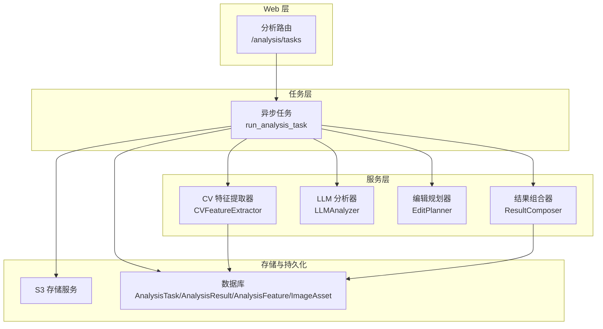
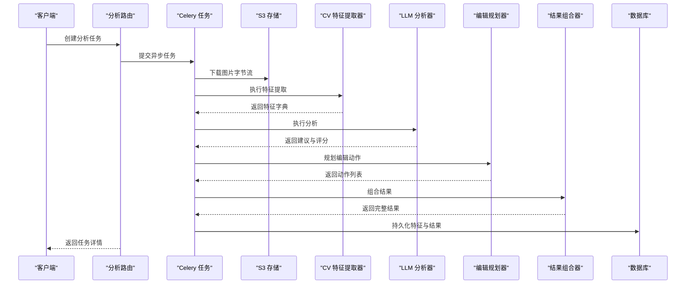
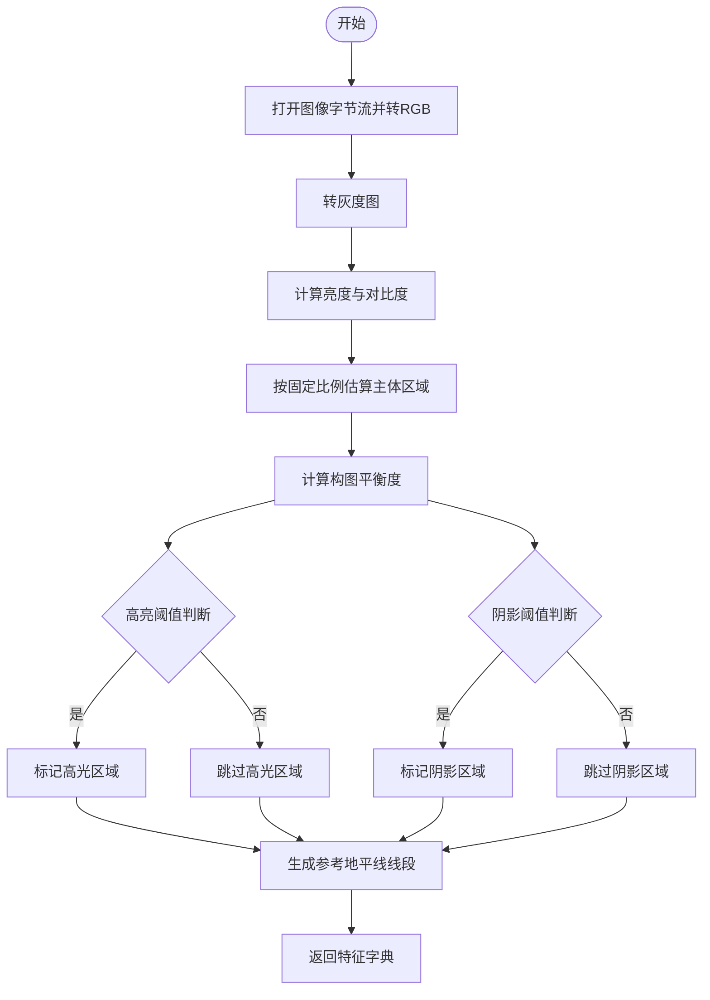
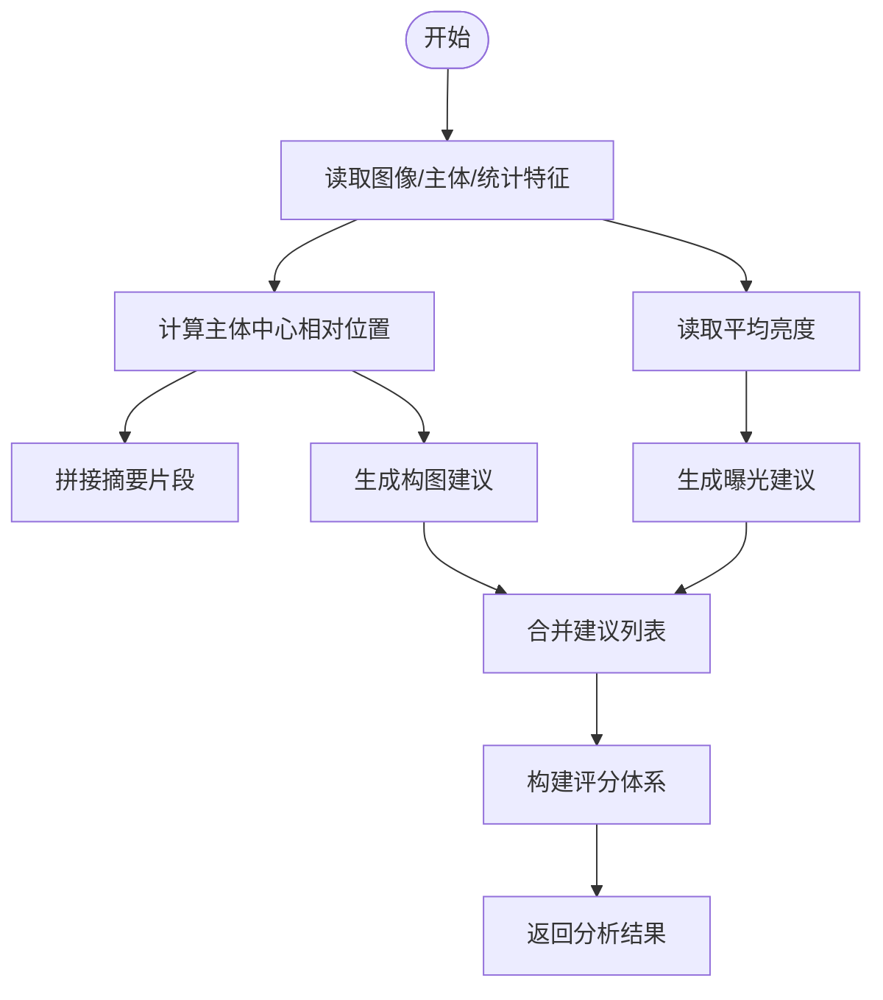
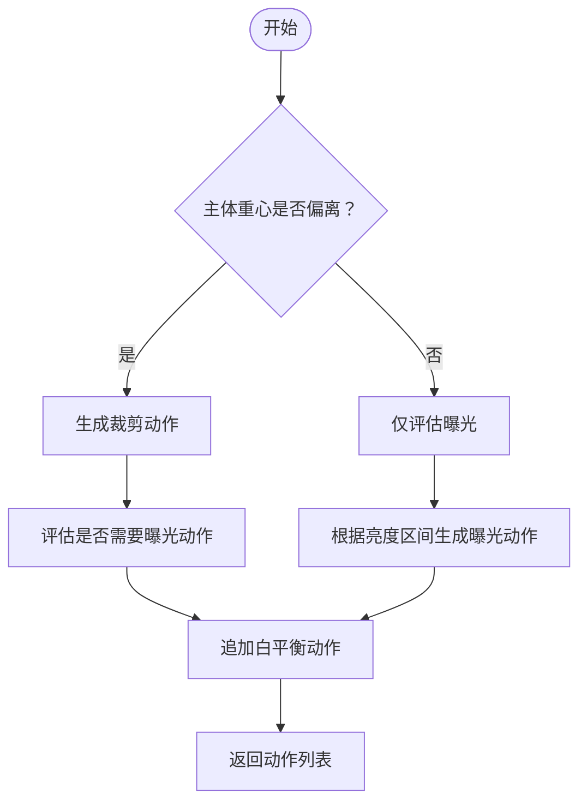
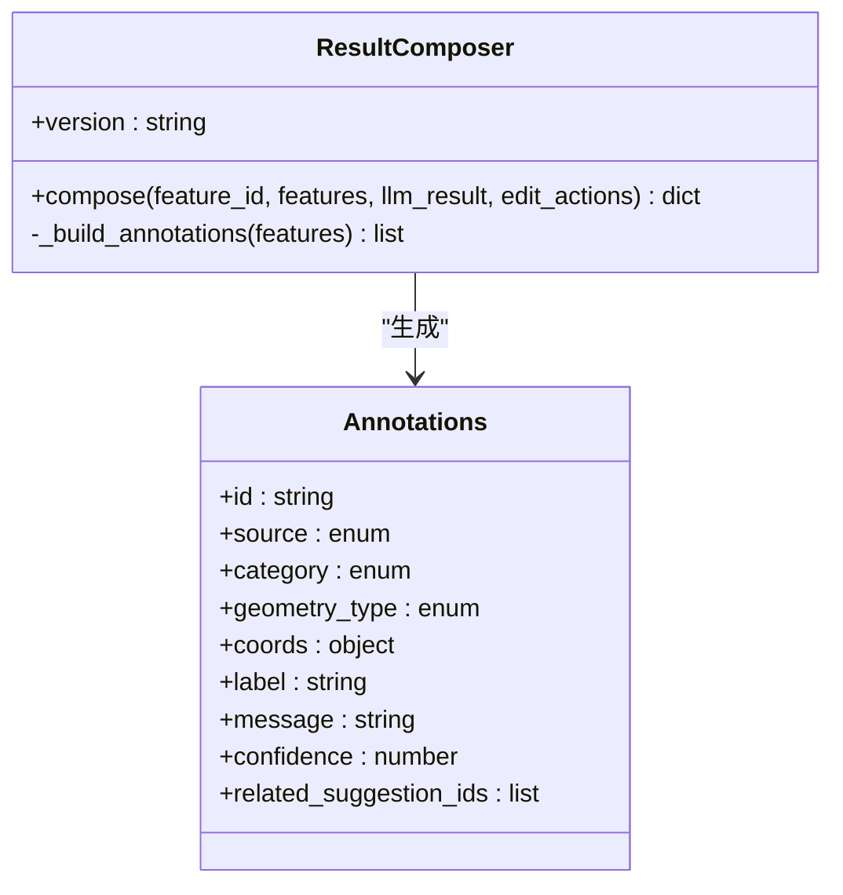
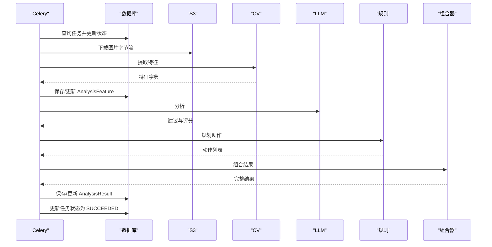
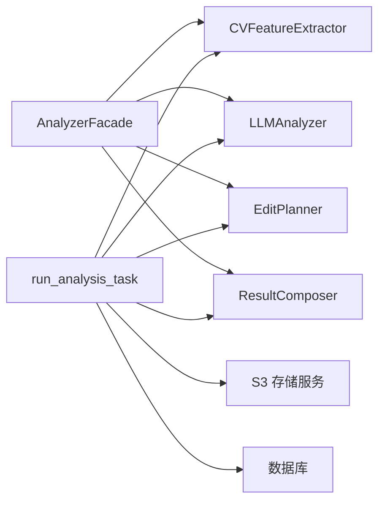

# 计算机视觉分析

<cite>
**本文引用的文件**
- [feature_extractor.py](file://apps/api/app/services/cv/feature_extractor.py)
- [analyzer.py](file://apps/api/app/services/ai/analyzer.py)
- [analyzer.py](file://apps/api/app/services/llm/analyzer.py)
- [edit_planner.py](file://apps/api/app/services/rules/edit_planner.py)
- [result_composer.py](file://apps/api/app/services/composer/result_composer.py)
- [analyze_photo.py](file://apps/api/app/tasks/analyze_photo.py)
- [router.py](file://apps/api/app/modules/analysis/router.py)
- [analysis_feature.py](file://apps/api/app/models/analysis_feature.py)
- [analysis_result.py](file://apps/api/app/models/analysis_result.py)
- [analysis_task.py](file://apps/api/app/models/analysis_task.py)
- [image_asset.py](file://apps/api/app/models/image_asset.py)
- [config.py](file://apps/api/app/core/config.py)
- [analysis-result.schema.json](file://packages/contracts/analysis-result.schema.json)
- [annotation.schema.json](file://packages/contracts/annotation.schema.json)
- [edit-action.schema.json](file://packages/contracts/edit-action.schema.json)
</cite>

## 目录
1. [简介](#简介)
2. [项目结构](#项目结构)
3. [核心组件](#核心组件)
4. [架构总览](#架构总览)
5. [详细组件分析](#详细组件分析)
6. [依赖分析](#依赖分析)
7. [性能考虑](#性能考虑)
8. [故障排查指南](#故障排查指南)
9. [结论](#结论)
10. [附录](#附录)

## 简介
本技术文档面向“计算机视觉特征提取系统”，聚焦图像预处理、特征检测、关键点提取与图像描述符计算等核心步骤，结合项目中的实际实现，系统阐述算法原理、技术实现、数据结构、配置参数、调用接口与返回规范，并提供图像质量评估与特征完整性检查的方法、常见问题诊断与解决方案，以及与AI组件（LLM、规则引擎、结果组合器）的集成方式。

## 项目结构
该系统采用分层架构：Web 层（FastAPI 路由）、任务层（Celery 异步任务）、服务层（CV 特征提取、LLM 分析、规则编辑规划、结果组合）、持久化层（SQLAlchemy 模型与索引），并通过 S3 存储服务下载图片字节流进行分析。

图表来源
- [router.py:45-74](file://apps/api/app/modules/analysis/router.py#L45-L74)
- [analyze_photo.py:19-108](file://apps/api/app/tasks/analyze_photo.py#L19-L108)
- [feature_extractor.py:12-98](file://apps/api/app/services/cv/feature_extractor.py#L12-L98)
- [analyzer.py:5-139](file://apps/api/app/services/llm/analyzer.py#L5-L139)
- [edit_planner.py:5-97](file://apps/api/app/services/rules/edit_planner.py#L5-L97)
- [result_composer.py:5-99](file://apps/api/app/services/composer/result_composer.py#L5-L99)
- [analysis_feature.py:10-29](file://apps/api/app/models/analysis_feature.py#L10-L29)
- [analysis_result.py:10-28](file://apps/api/app/models/analysis_result.py#L10-L28)
- [image_asset.py:10-32](file://apps/api/app/models/image_asset.py#L10-L32)

章节来源
- [router.py:1-151](file://apps/api/app/modules/analysis/router.py#L1-L151)
- [analyze_photo.py:1-108](file://apps/api/app/tasks/analyze_photo.py#L1-L108)

## 核心组件
- CV 特征提取器：负责图像预处理（RGB/L 转换）、统计特征（亮度、对比度、构图平衡）、主体区域估计、高光/阴影区域定位、参考地平线线段标注。
- LLM 分析器：基于 CV 提取的统计与几何特征，生成摘要、建议与评分体系。
- 编辑规划器：根据亮度状态与主体重心，自动生成裁剪与曝光调整动作；附加白平衡规则动作。
- 结果组合器：整合特征引用、注解（主体、高光、阴影、地平线）、编辑动作与 LLM 建议，输出统一结果结构。
- 异步任务：拉取图片字节流，执行特征提取、LLM 分析、规则规划与结果组合，持久化到数据库。
- Web 路由：提供任务创建、查询、历史列表与重试接口。

章节来源
- [feature_extractor.py:12-98](file://apps/api/app/services/cv/feature_extractor.py#L12-L98)
- [analyzer.py:5-139](file://apps/api/app/services/llm/analyzer.py#L5-L139)
- [edit_planner.py:5-97](file://apps/api/app/services/rules/edit_planner.py#L5-L97)
- [result_composer.py:5-99](file://apps/api/app/services/composer/result_composer.py#L5-L99)
- [analyze_photo.py:19-108](file://apps/api/app/tasks/analyze_photo.py#L19-L108)
- [router.py:45-151](file://apps/api/app/modules/analysis/router.py#L45-L151)

## 架构总览
系统通过 FastAPI 路由触发 Celery 任务，任务从 S3 下载图片字节流，调用 CV 特征提取器获取基础特征，随后交给 LLM 分析器生成建议与评分，编辑规划器给出可执行的编辑动作，最终由结果组合器汇总并持久化至数据库。

图表来源
- [router.py:45-74](file://apps/api/app/modules/analysis/router.py#L45-L74)
- [analyze_photo.py:19-108](file://apps/api/app/tasks/analyze_photo.py#L19-L108)
- [feature_extractor.py:15-91](file://apps/api/app/services/cv/feature_extractor.py#L15-L91)
- [analyzer.py:8-118](file://apps/api/app/services/llm/analyzer.py#L8-L118)
- [edit_planner.py:6-34](file://apps/api/app/services/rules/edit_planner.py#L6-L34)
- [result_composer.py:8-23](file://apps/api/app/services/composer/result_composer.py#L8-L23)

## 详细组件分析

### CV 特征提取器
- 输入：图像字节流、MIME 类型
- 输出：版本号、图像尺寸与类型、统计特征（平均亮度、对比度、构图平衡）、主体区域、高光/阴影区域、参考地平线线段
- 关键流程：
  - 将输入转换为 RGB，再转灰度以计算亮度与对比度
  - 使用固定比例估算主体区域（中心坐标、宽高）
  - 计算构图平衡度（主体中心相对宽度的比例）
  - 基于亮度阈值判断是否标记高光/阴影区域
  - 生成参考地平线线段
- 数据结构要点：
  - 几何对象使用像素坐标系，支持 bbox 与 line 两种几何类型
  - 区域与指导线均包含坐标空间标识
- 性能与缓存：通过 LRU 缓存单例实例，降低重复初始化成本

图表来源
- [feature_extractor.py:15-91](file://apps/api/app/services/cv/feature_extractor.py#L15-L91)

章节来源
- [feature_extractor.py:12-98](file://apps/api/app/services/cv/feature_extractor.py#L12-L98)

### LLM 分析器
- 输入：CV 提取的特征字典
- 输出：版本号、摘要、建议列表（含优先级与可执行动作文本）、评分体系（构图、曝光、色彩、故事）
- 关键逻辑：
  - 基于主体中心相对位置与平均亮度，生成摘要与建议
  - 根据亮度范围自动补充曝光建议
  - 构建评分：综合平衡度与亮度、对比度，形成四维评分
- 数据结构要点：
  - 建议项包含唯一 ID、类型（构图、曝光、色彩、故事等）、问题描述、动作建议、优先级
  - 评分对象包含 composition、exposure、color、story 四个字段

图表来源
- [analyzer.py:8-118](file://apps/api/app/services/llm/analyzer.py#L8-L118)

章节来源
- [analyzer.py:5-139](file://apps/api/app/services/llm/analyzer.py#L5-L139)

### 编辑规划器
- 输入：CV 特征与 LLM 建议
- 输出：编辑动作列表（裁剪、曝光、白平衡）
- 关键逻辑：
  - 若主体重心偏离三分线两侧，生成裁剪动作（目标中心对齐至 1/3 或 2/3 处）
  - 根据平均亮度决定自动曝光调整（增益/偏移参数）
  - 追加白平衡动作作为规则兜底
- 数据结构要点：
  - 动作包含 ID、类型、来源（规则）、参数、原因、是否可预览、应用模式（破坏性/非破坏性）

图表来源
- [edit_planner.py:6-34](file://apps/api/app/services/rules/edit_planner.py#L6-L34)
- [edit_planner.py:36-90](file://apps/api/app/services/rules/edit_planner.py#L36-L90)

章节来源
- [edit_planner.py:5-97](file://apps/api/app/services/rules/edit_planner.py#L5-L97)

### 结果组合器
- 输入：特征引用、CV 特征、LLM 结果、编辑动作
- 输出：统一结果结构（版本号、摘要、建议、评分、注解、编辑动作）
- 注解生成：
  - 主体区域：用于构图分析与自动裁剪
  - 高光/阴影区域：联动曝光调整
  - 地平线：用于构图与校正
- 数据结构要点：
  - 注解包含几何类型（bbox/line）、坐标、置信度、关联建议 ID
  - 结果包含 features_ref 引用特征 ID

图表来源
- [result_composer.py:5-99](file://apps/api/app/services/composer/result_composer.py#L5-L99)
- [annotation.schema.json:1-60](file://packages/contracts/annotation.schema.json#L1-L60)

章节来源
- [result_composer.py:5-99](file://apps/api/app/services/composer/result_composer.py#L5-L99)

### 异步分析任务
- 任务入口：run_analysis_task
- 流程：
  - 更新任务状态为 RUNNING
  - 从 S3 下载图片字节流
  - 执行 CV 特征提取，持久化 AnalysisFeature
  - LLM 分析与规则规划，组合结果，持久化 AnalysisResult
  - 成功则更新状态为 SUCCEEDED，失败回滚并记录错误码与消息
- 并发与幂等：通过任务 ID 与重试机制保证一致性

图表来源
- [analyze_photo.py:19-108](file://apps/api/app/tasks/analyze_photo.py#L19-L108)

章节来源
- [analyze_photo.py:1-108](file://apps/api/app/tasks/analyze_photo.py#L1-L108)

### Web 路由与任务管理
- 接口：
  - POST /analysis/tasks：创建分析任务，入队异步任务
  - GET /analysis/tasks/{task_id}：查询任务详情与结果
  - GET /analysis/history：查询用户历史与摘要
  - POST /analysis/tasks/{task_id}/retry：重试失败/成功任务
- 权限控制：校验任务与图片归属用户
- 限流与健壮性：查询参数限制历史条数上限

章节来源
- [router.py:45-151](file://apps/api/app/modules/analysis/router.py#L45-L151)

## 依赖分析
- 组件耦合：
  - AnalyzerFacade 依赖 CV 特征提取器、LLM 分析器、编辑规划器与结果组合器
  - run_analysis_task 依赖上述四个服务与存储服务
- 外部依赖：
  - PIL/Pillow：图像解码与统计
  - SQLAlchemy：数据库 ORM 与索引
  - Celery/Redis：异步任务编排
  - MinIO/S3：对象存储
- 可能的循环依赖：未发现直接循环导入；服务通过工厂函数与 LRU 缓存提供单例，避免重复依赖

图表来源
- [analyzer.py:10-26](file://apps/api/app/services/ai/analyzer.py#L10-L26)
- [analyze_photo.py:13-16](file://apps/api/app/tasks/analyze_photo.py#L13-L16)

章节来源
- [analyzer.py:1-27](file://apps/api/app/services/ai/analyzer.py#L1-L27)
- [analyze_photo.py:1-17](file://apps/api/app/tasks/analyze_photo.py#L1-L17)

## 性能考虑
- 图像解码与统计：
  - 使用灰度图计算亮度与对比度，避免重复通道转换
  - 通过 LRU 缓存单例特征提取器，减少初始化开销
- 异步处理：
  - 任务在 Celery 中异步执行，避免阻塞 Web 请求
  - Redis 作为消息中间件，支持水平扩展
- 数据库写入：
  - 先 flush 再 commit，减少锁竞争
  - 对 JSON 字段建立 GIN 索引，加速检索与聚合
- 存储访问：
  - 从 S3 下载字节流后立即处理，避免本地磁盘 IO
- 建议优化：
  - 对大图可增加缩放阈值与金字塔策略（当前实现未包含）
  - 对热点特征可引入二级缓存（如 Redis）以降低重复计算

[本节为通用性能讨论，无需特定文件来源]

## 故障排查指南
- 任务状态异常：
  - FAILED：查看任务表中的错误码与错误消息，定位具体异常类型与堆栈
  - 重试：通过 /analysis/tasks/{task_id}/retry 将任务重置为 PENDING 并重新入队
- 图片缺失或权限不足：
  - 404：确认 ImageAsset 是否存在且对象键正确
  - 403：确认任务所属用户与图片归属一致
- 特征为空或不完整：
  - 检查 CV 特征提取是否抛出异常（如解码失败）
  - 核对返回字典是否包含必要字段（stats、subject、guidelines、regions）
- 结果为空：
  - 确认 LLM 分析与规则规划是否正常返回
  - 检查结果组合器是否正确生成注解与动作
- 数据库索引与查询：
  - 确认 GIN 索引已生效，避免 JSON 查询慢
  - 检查时间索引是否命中，优化历史查询性能

章节来源
- [router.py:76-151](file://apps/api/app/modules/analysis/router.py#L76-L151)
- [analyze_photo.py:97-107](file://apps/api/app/tasks/analyze_photo.py#L97-L107)

## 结论
本系统以“计算机视觉特征提取”为核心，结合 LLM 与规则引擎，形成从图像字节流到可执行编辑动作的完整链路。通过异步任务与数据库持久化，实现了高可用与可观测性。当前实现聚焦于统计与几何特征，具备良好的扩展性，可在不改变接口契约的前提下引入更复杂的深度学习特征提取模块。

[本节为总结性内容，无需特定文件来源]

## 附录

### 支持的图像格式与分辨率
- 图像格式：由 PIL 解码器支持的格式均可（如 JPEG、PNG、WEBP 等），具体取决于上传时的 MIME 类型与解码能力
- 分辨率限制：代码未设置硬性上限，但需关注内存占用与处理耗时；建议在网关或上传层做尺寸与体积限制

[本节为通用说明，无需特定文件来源]

### 配置参数与环境变量
- 数据库连接：db_url
- 缓存/队列：redis_url
- 对象存储：s3_endpoint、s3_access_key、s3_secret_key、s3_bucket、s3_region
- 模型与提示词：model_name、prompt_version
- CORS：cors_origins（解析为 cors_origin_list）

章节来源
- [config.py:13-38](file://apps/api/app/core/config.py#L13-L38)

### 调用接口与返回数据结构
- 接口：
  - POST /api/v1/analysis/tasks：创建任务并返回任务 ID
  - GET /api/v1/analysis/tasks/{task_id}：查询任务详情与结果
  - GET /api/v1/analysis/history：查询历史与摘要
  - POST /api/v1/analysis/tasks/{task_id}/retry：重试任务
- 返回结构：
  - 任务详情：包含任务状态、错误信息、结果 JSON
  - 历史项：包含摘要字符串
  - 结果 JSON：符合 analysis-result.schema.json 的结构

章节来源
- [router.py:45-151](file://apps/api/app/modules/analysis/router.py#L45-L151)
- [analysis-result.schema.json:1-76](file://packages/contracts/analysis-result.schema.json#L1-L76)

### 数据模型与索引
- AnalysisTask：任务元数据与状态
- AnalysisResult：分析结果 JSON 与版本
- AnalysisFeature：特征 JSON 与版本
- ImageAsset：图片元数据（MIME、尺寸、存储键等）
- 索引：
  - AnalysisFeature：image_id+created_at、feature_json(GIN)
  - AnalysisResult：image_id+created_at、result_json(GIN)
  - AnalysisTask：user_id+created_at、status+created_at

章节来源
- [analysis_task.py:10-36](file://apps/api/app/models/analysis_task.py#L10-L36)
- [analysis_result.py:10-28](file://apps/api/app/models/analysis_result.py#L10-L28)
- [analysis_feature.py:10-29](file://apps/api/app/models/analysis_feature.py#L10-L29)
- [image_asset.py:10-32](file://apps/api/app/models/image_asset.py#L10-L32)

### 数据契约（Schema）
- 分析结果：包含版本、摘要、建议数组、评分对象、注解数组、编辑动作数组
- 注解：包含几何类型、坐标、置信度、来源与类别
- 编辑动作：包含动作类型、来源、参数、原因、预览性与应用模式

章节来源
- [analysis-result.schema.json:1-76](file://packages/contracts/analysis-result.schema.json#L1-L76)
- [annotation.schema.json:1-60](file://packages/contracts/annotation.schema.json#L1-L60)
- [edit-action.schema.json:1-30](file://packages/contracts/edit-action.schema.json#L1-L30)