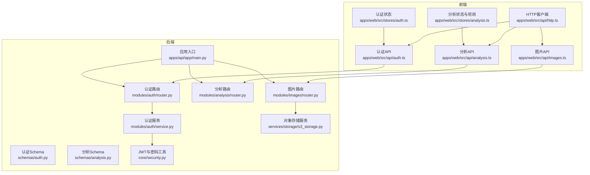
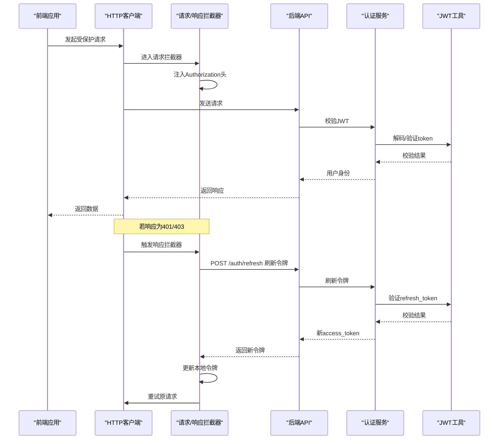
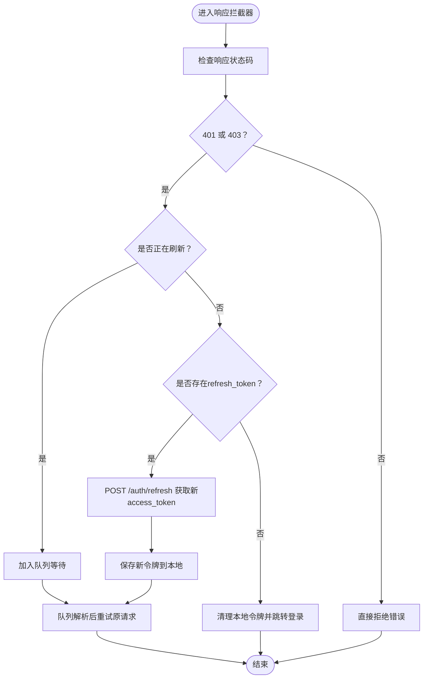
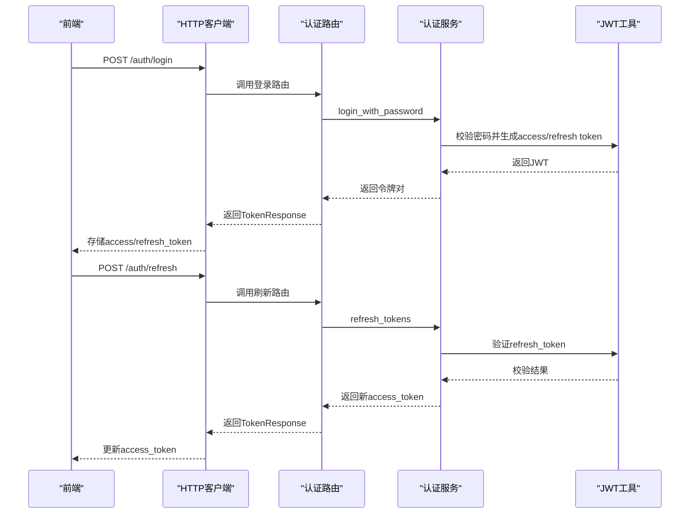
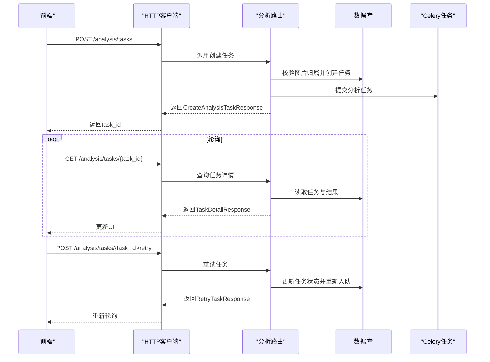
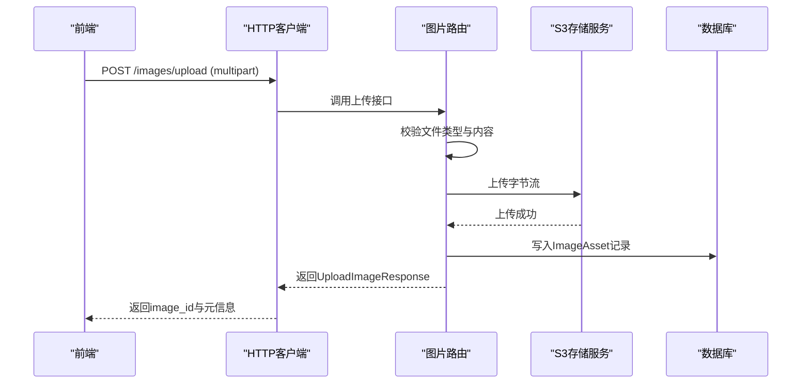
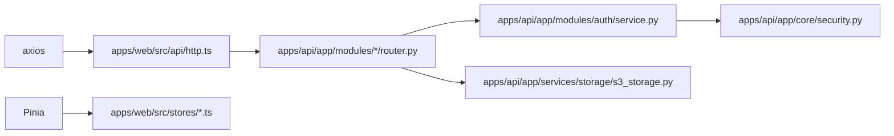

# API集成

<cite>
**本文引用的文件**
- [apps/web/src/api/http.ts](file://apps/web/src/api/http.ts)
- [apps/web/src/api/auth.ts](file://apps/web/src/api/auth.ts)
- [apps/web/src/api/analysis.ts](file://apps/web/src/api/analysis.ts)
- [apps/web/src/api/images.ts](file://apps/web/src/api/images.ts)
- [apps/web/src/stores/auth.ts](file://apps/web/src/stores/auth.ts)
- [apps/web/src/stores/analysis.ts](file://apps/web/src/stores/analysis.ts)
- [apps/api/app/main.py](file://apps/api/app/main.py)
- [apps/api/app/modules/auth/router.py](file://apps/api/app/modules/auth/router.py)
- [apps/api/app/modules/analysis/router.py](file://apps/api/app/modules/analysis/router.py)
- [apps/api/app/modules/images/router.py](file://apps/api/app/modules/images/router.py)
- [apps/api/app/schemas/auth.py](file://apps/api/app/schemas/auth.py)
- [apps/api/app/schemas/analysis.py](file://apps/api/app/schemas/analysis.py)
- [apps/api/app/modules/auth/service.py](file://apps/api/app/modules/auth/service.py)
- [apps/api/app/services/storage/s3_storage.py](file://apps/api/app/services/storage/s3_storage.py)
- [apps/api/app/core/security.py](file://apps/api/app/core/security.py)
</cite>

## 目录
1. [简介](#简介)
2. [项目结构](#项目结构)
3. [核心组件](#核心组件)
4. [架构总览](#架构总览)
5. [详细组件分析](#详细组件分析)
6. [依赖分析](#依赖分析)
7. [性能考虑](#性能考虑)
8. [故障排查指南](#故障排查指南)
9. [结论](#结论)
10. [附录](#附录)

## 简介
本文件面向“AI摄影教练”前端的API集成，系统性梳理HTTP客户端封装、请求/响应拦截器、认证与令牌刷新机制、各API模块（分析、认证、图片）的接口调用方式与数据模型、错误处理与重试策略、类型安全与参数校验方案，以及离线与缓存策略的实现要点。目标是帮助开发者快速理解并正确使用前端API层，确保在复杂交互场景下具备健壮性与可维护性。

## 项目结构
前端API层位于 apps/web/src/api，采用按功能域拆分的模块化组织：
- http.ts：统一HTTP客户端与拦截器
- auth.ts：认证相关接口与类型定义
- analysis.ts：分析任务相关接口与类型定义
- images.ts：图片上传接口与类型定义
- stores/*：Pinia状态管理，封装业务流程与轮询控制

后端API位于 apps/api/app，采用FastAPI + 路由模块化：
- main.py：应用入口与CORS配置、路由挂载
- modules/*/router.py：各模块路由与权限控制
- schemas/*：Pydantic输入/输出模型
- modules/auth/service.py：认证服务与JWT工具
- services/storage/s3_storage.py：对象存储封装

图表来源
- [apps/web/src/api/http.ts:1-94](file://apps/web/src/api/http.ts#L1-L94)
- [apps/web/src/api/auth.ts:1-56](file://apps/web/src/api/auth.ts#L1-L56)
- [apps/web/src/api/analysis.ts:1-101](file://apps/web/src/api/analysis.ts#L1-L101)
- [apps/web/src/api/images.ts:1-22](file://apps/web/src/api/images.ts#L1-L22)
- [apps/web/src/stores/auth.ts:1-41](file://apps/web/src/stores/auth.ts#L1-L41)
- [apps/web/src/stores/analysis.ts:1-142](file://apps/web/src/stores/analysis.ts#L1-L142)
- [apps/api/app/main.py:1-36](file://apps/api/app/main.py#L1-L36)
- [apps/api/app/modules/auth/router.py:1-93](file://apps/api/app/modules/auth/router.py#L1-L93)
- [apps/api/app/modules/analysis/router.py:1-151](file://apps/api/app/modules/analysis/router.py#L1-L151)
- [apps/api/app/modules/images/router.py:1-77](file://apps/api/app/modules/images/router.py#L1-L77)
- [apps/api/app/modules/auth/service.py:1-145](file://apps/api/app/modules/auth/service.py#L1-L145)
- [apps/api/app/services/storage/s3_storage.py:1-59](file://apps/api/app/services/storage/s3_storage.py#L1-L59)
- [apps/api/app/schemas/auth.py:1-37](file://apps/api/app/schemas/auth.py#L1-L37)
- [apps/api/app/schemas/analysis.py:1-52](file://apps/api/app/schemas/analysis.py#L1-L52)
- [apps/api/app/core/security.py:1-72](file://apps/api/app/core/security.py#L1-L72)

章节来源
- [apps/web/src/api/http.ts:1-94](file://apps/web/src/api/http.ts#L1-L94)
- [apps/api/app/main.py:1-36](file://apps/api/app/main.py#L1-L36)

## 核心组件
- HTTP客户端与拦截器
  - 统一基础地址与超时设置
  - 请求拦截：自动从本地存储读取访问令牌并注入Authorization头
  - 响应拦截：针对401/403进行并发安全的令牌刷新；刷新成功后重试原请求；刷新失败则清空本地令牌并跳转登录页
- 认证模块
  - 注册、登录、刷新、登出、获取/更新个人资料、修改密码等接口
  - 类型安全：RegisterParams/LoginParams/TokenResponse/UserProfile
- 分析模块
  - 创建任务、查询任务详情、获取历史、重试任务
  - 类型安全：TaskStatus、Suggestion、Annotation、EditAction、AnalysisResult、HistoryItem等
- 图片模块
  - 上传图片接口，支持multipart/form-data
  - 类型安全：UploadImageResponse
- 状态管理
  - 认证状态：持久化令牌与用户信息
  - 分析状态：上传、轮询、历史、错误与加载态

章节来源
- [apps/web/src/api/http.ts:1-94](file://apps/web/src/api/http.ts#L1-L94)
- [apps/web/src/api/auth.ts:1-56](file://apps/web/src/api/auth.ts#L1-L56)
- [apps/web/src/api/analysis.ts:1-101](file://apps/web/src/api/analysis.ts#L1-L101)
- [apps/web/src/api/images.ts:1-22](file://apps/web/src/api/images.ts#L1-L22)
- [apps/web/src/stores/auth.ts:1-41](file://apps/web/src/stores/auth.ts#L1-L41)
- [apps/web/src/stores/analysis.ts:1-142](file://apps/web/src/stores/analysis.ts#L1-L142)

## 架构总览
前端通过统一HTTP客户端发起请求，后端以FastAPI路由暴露REST接口，并在启动时挂载CORS中间件。认证与令牌刷新由前端拦截器与后端服务共同完成，图片上传经由对象存储服务落地。

图表来源
- [apps/web/src/api/http.ts:10-91](file://apps/web/src/api/http.ts#L10-L91)
- [apps/api/app/modules/auth/router.py:49-53](file://apps/api/app/modules/auth/router.py#L49-L53)
- [apps/api/app/modules/auth/service.py:77-92](file://apps/api/app/modules/auth/service.py#L77-L92)
- [apps/api/app/core/security.py:49-72](file://apps/api/app/core/security.py#L49-L72)

## 详细组件分析

### HTTP客户端与拦截器
- 基础配置
  - 基础URL来自环境变量，未配置时回退至“/api/v1”
  - 超时时间30秒
- 请求拦截
  - 从localStorage读取access_token并注入Authorization: Bearer <token>
- 响应拦截
  - 401/403错误处理：并发令牌刷新队列、防止重复刷新、刷新成功后重试原请求
  - 无refresh_token或刷新失败：清理本地令牌并跳转登录页
  - 其他错误透传

图表来源
- [apps/web/src/api/http.ts:19-91](file://apps/web/src/api/http.ts#L19-L91)

章节来源
- [apps/web/src/api/http.ts:1-94](file://apps/web/src/api/http.ts#L1-L94)

### 认证API模块
- 接口概览
  - 注册：提交邮箱、密码、昵称，返回access_token与refresh_token
  - 登录：提交邮箱、密码，返回令牌
  - 刷新：提交refresh_token，返回新access_token（可附带新refresh_token）
  - 登出：通知客户端清理令牌
  - 获取/更新个人资料：/users/me
  - 修改密码：提交当前密码与新密码
- 类型安全
  - RegisterParams/LoginParams/TokenResponse/UserProfile
- 后端实现要点
  - 路由：/auth/register、/auth/login、/auth/refresh、/auth/logout、/users/me、/users/me/change-password
  - 服务：密码哈希、JWT签发与校验、邮箱验证与重置流程
  - Schema：Pydantic模型约束输入参数与输出格式

图表来源
- [apps/web/src/api/auth.ts:29-55](file://apps/web/src/api/auth.ts#L29-L55)
- [apps/api/app/modules/auth/router.py:42-53](file://apps/api/app/modules/auth/router.py#L42-L53)
- [apps/api/app/modules/auth/service.py:50-92](file://apps/api/app/modules/auth/service.py#L50-L92)
- [apps/api/app/core/security.py:32-46](file://apps/api/app/core/security.py#L32-L46)

章节来源
- [apps/web/src/api/auth.ts:1-56](file://apps/web/src/api/auth.ts#L1-L56)
- [apps/api/app/modules/auth/router.py:1-93](file://apps/api/app/modules/auth/router.py#L1-L93)
- [apps/api/app/schemas/auth.py:1-37](file://apps/api/app/schemas/auth.py#L1-L37)
- [apps/api/app/modules/auth/service.py:1-145](file://apps/api/app/modules/auth/service.py#L1-L145)
- [apps/api/app/core/security.py:1-72](file://apps/api/app/core/security.py#L1-L72)

### 分析API模块
- 接口概览
  - 创建任务：提交image_id，返回task_id与初始状态
  - 查询任务详情：根据task_id返回任务与结果
  - 获取历史：分页返回任务摘要列表
  - 重试任务：仅当任务处于SUCCEEDED/FAILED时允许重试
- 类型安全
  - TaskStatus、Suggestion、Annotation、EditAction、AnalysisResult、HistoryItem、TaskDetailResponse、HistoryResponse
- 后端实现要点
  - 路由：/analysis/tasks、/analysis/tasks/{task_id}、/analysis/history、/analysis/tasks/{task_id}/retry
  - 权限：基于当前用户ID校验资源归属
  - 数据模型：AnalysisTask、AnalysisResult、ImageAsset
  - 异步执行：通过Celery任务调度分析流程

图表来源
- [apps/web/src/api/analysis.ts:82-100](file://apps/web/src/api/analysis.ts#L82-L100)
- [apps/api/app/modules/analysis/router.py:45-151](file://apps/api/app/modules/analysis/router.py#L45-L151)

章节来源
- [apps/web/src/api/analysis.ts:1-101](file://apps/web/src/api/analysis.ts#L1-L101)
- [apps/api/app/modules/analysis/router.py:1-151](file://apps/api/app/modules/analysis/router.py#L1-L151)
- [apps/api/app/schemas/analysis.py:1-52](file://apps/api/app/schemas/analysis.py#L1-L52)

### 图片API模块
- 接口概览
  - 上传图片：multipart/form-data，返回图片元数据（含image_id、尺寸、对象键等）
- 后端实现要点
  - 路由：/images/upload
  - 校验：仅允许image/*类型，禁止空文件
  - 处理：PIL校验图像有效性，生成对象键，写入S3兼容存储
  - 持久化：记录ImageAsset元信息

图表来源
- [apps/web/src/api/images.ts:12-20](file://apps/web/src/api/images.ts#L12-L20)
- [apps/api/app/modules/images/router.py:20-77](file://apps/api/app/modules/images/router.py#L20-L77)
- [apps/api/app/services/storage/s3_storage.py:34-50](file://apps/api/app/services/storage/s3_storage.py#L34-L50)

章节来源
- [apps/web/src/api/images.ts:1-22](file://apps/web/src/api/images.ts#L1-L22)
- [apps/api/app/modules/images/router.py:1-77](file://apps/api/app/modules/images/router.py#L1-L77)
- [apps/api/app/services/storage/s3_storage.py:1-59](file://apps/api/app/services/storage/s3_storage.py#L1-L59)

### 错误处理与重试机制
- 前端
  - 响应拦截器内对401/403进行令牌刷新与重试，避免重复刷新，使用队列串行化等待
  - 刷新失败或无refresh_token时，清理本地令牌并跳转登录
  - 业务层捕获异常并设置错误消息与加载态
- 后端
  - 认证：密码校验失败、账户非活跃、令牌无效/过期均返回401
  - 资源权限：非任务/图片归属者返回403
  - 输入校验：Pydantic模型保证请求参数合法性
  - 存储：S3异常统一转换为503不可用

章节来源
- [apps/web/src/api/http.ts:19-91](file://apps/web/src/api/http.ts#L19-L91)
- [apps/web/src/stores/analysis.ts:34-123](file://apps/web/src/stores/analysis.ts#L34-L123)
- [apps/api/app/modules/auth/service.py:50-92](file://apps/api/app/modules/auth/service.py#L50-L92)
- [apps/api/app/modules/analysis/router.py:52-56](file://apps/api/app/modules/analysis/router.py#L52-L56)
- [apps/api/app/services/storage/s3_storage.py:23-50](file://apps/api/app/services/storage/s3_storage.py#L23-L50)

### 类型安全与参数验证
- 前端
  - 所有API函数返回值使用泛型约束，确保响应类型与期望一致
  - 参数使用接口定义，如RegisterParams/LoginParams/TokenResponse/UserProfile等
- 后端
  - Pydantic模型作为输入/输出契约，自动进行字段类型与约束校验
  - FastAPI路由层自动将模型序列化为JSON并生成OpenAPI文档

章节来源
- [apps/web/src/api/auth.ts:1-56](file://apps/web/src/api/auth.ts#L1-L56)
- [apps/web/src/api/analysis.ts:1-101](file://apps/web/src/api/analysis.ts#L1-L101)
- [apps/web/src/api/images.ts:1-22](file://apps/web/src/api/images.ts#L1-L22)
- [apps/api/app/schemas/auth.py:1-37](file://apps/api/app/schemas/auth.py#L1-L37)
- [apps/api/app/schemas/analysis.py:1-52](file://apps/api/app/schemas/analysis.py#L1-L52)

### 离线处理与缓存策略
- 现状
  - 前端未实现离线缓存与持久化策略
  - 分析流程依赖实时轮询与后端任务执行
- 建议
  - 本地缓存：对分析历史与任务详情进行轻量缓存，结合ETag/Last-Modified做条件请求
  - 离线上传：在Service Worker或Workbox中实现上传队列与断点续传
  - 状态同步：利用IndexedDB或LocalStorage记录关键状态，页面恢复后继续轮询
  - 降级策略：网络异常时提示用户并允许手动重试

[本节为通用建议，不直接分析具体文件]

## 依赖分析
- 前端
  - axios作为HTTP客户端，统一拦截器处理认证与刷新
  - Pinia用于状态持久化与跨组件共享
- 后端
  - FastAPI路由模块化，CORS中间件允许跨域
  - 认证服务依赖JWT工具与数据库会话
  - 图片上传依赖S3兼容存储服务

图表来源
- [apps/web/src/api/http.ts:1-94](file://apps/web/src/api/http.ts#L1-L94)
- [apps/web/src/stores/auth.ts:1-41](file://apps/web/src/stores/auth.ts#L1-L41)
- [apps/web/src/stores/analysis.ts:1-142](file://apps/web/src/stores/analysis.ts#L1-L142)
- [apps/api/app/modules/auth/router.py:1-93](file://apps/api/app/modules/auth/router.py#L1-L93)
- [apps/api/app/modules/auth/service.py:1-145](file://apps/api/app/modules/auth/service.py#L1-L145)
- [apps/api/app/services/storage/s3_storage.py:1-59](file://apps/api/app/services/storage/s3_storage.py#L1-L59)
- [apps/api/app/core/security.py:1-72](file://apps/api/app/core/security.py#L1-L72)

章节来源
- [apps/api/app/main.py:1-36](file://apps/api/app/main.py#L1-L36)
- [apps/api/app/modules/auth/router.py:1-93](file://apps/api/app/modules/auth/router.py#L1-L93)
- [apps/api/app/modules/analysis/router.py:1-151](file://apps/api/app/modules/analysis/router.py#L1-L151)
- [apps/api/app/modules/images/router.py:1-77](file://apps/api/app/modules/images/router.py#L1-L77)

## 性能考虑
- 轮询间隔
  - 分析轮询间隔为1800ms，建议根据任务耗时与UI反馈动态调整
- 超时与重试
  - 前端HTTP超时30秒；响应拦截器内对401/403进行一次刷新重试，避免无限重试
- 并发控制
  - 刷新令牌时使用队列避免并发刷新导致的重复请求
- 存储I/O
  - 图片上传使用S3兼容存储，注意连接与读写超时配置

[本节提供一般性指导，不直接分析具体文件]

## 故障排查指南
- 无法登录/频繁掉线
  - 检查本地是否同时存在access_token与refresh_token
  - 查看响应拦截器是否正确触发刷新逻辑
- 403权限错误
  - 确认当前用户是否拥有对应图片或任务的访问权限
- 上传失败
  - 确认文件类型为image/*，文件非空
  - 检查S3存储可用性与桶权限
- 分析任务长时间PENDING
  - 检查Celery任务队列与后端日志
  - 尝试重试任务

章节来源
- [apps/web/src/api/http.ts:19-91](file://apps/web/src/api/http.ts#L19-L91)
- [apps/api/app/modules/analysis/router.py:52-56](file://apps/api/app/modules/analysis/router.py#L52-L56)
- [apps/api/app/modules/images/router.py:26-37](file://apps/api/app/modules/images/router.py#L26-L37)
- [apps/api/app/services/storage/s3_storage.py:23-50](file://apps/api/app/services/storage/s3_storage.py#L23-L50)

## 结论
前端API层通过统一HTTP客户端与拦截器实现了认证令牌的自动注入与刷新，配合后端严格的权限校验与输入校验，形成了类型安全、可维护的接口体系。分析与图片模块的业务流程清晰，建议在现有基础上完善离线与缓存策略，进一步提升用户体验与系统韧性。

## 附录
- 环境变量
  - VITE_API_BASE_URL：后端API基础URL
- CORS
  - 应用启动时配置CORS，允许凭据与所有方法/头
- JWT配置
  - 密钥、算法、过期时间等由后端配置管理

章节来源
- [apps/web/src/api/http.ts:3-8](file://apps/web/src/api/http.ts#L3-L8)
- [apps/api/app/main.py:13-19](file://apps/api/app/main.py#L13-L19)
- [apps/api/app/core/security.py:32-46](file://apps/api/app/core/security.py#L32-L46)