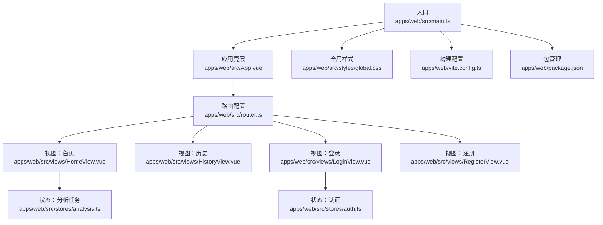
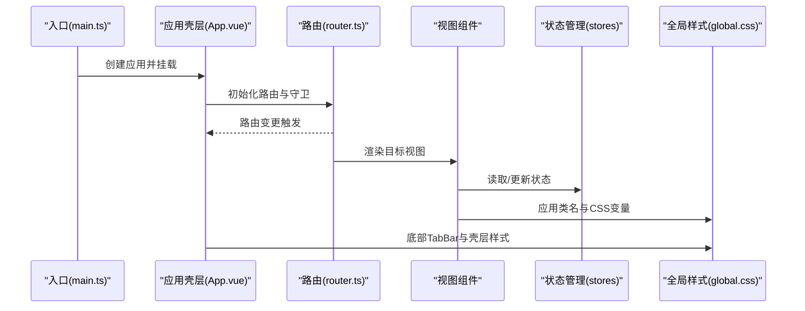
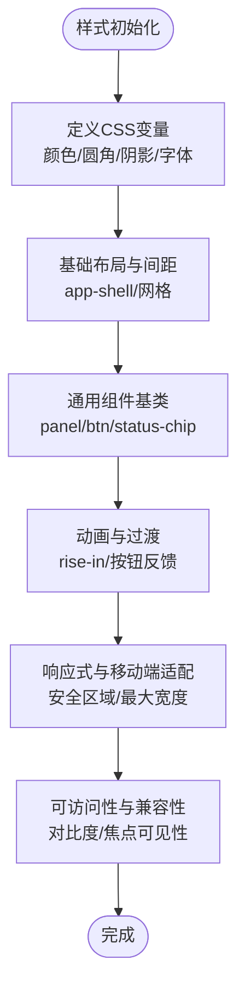
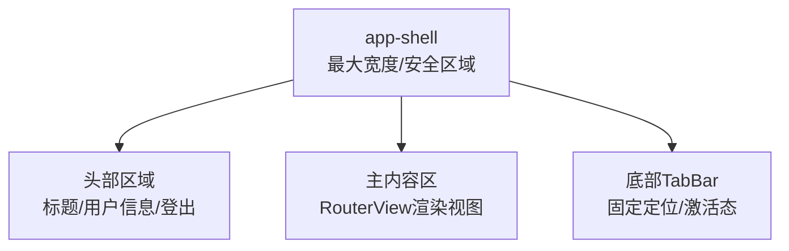
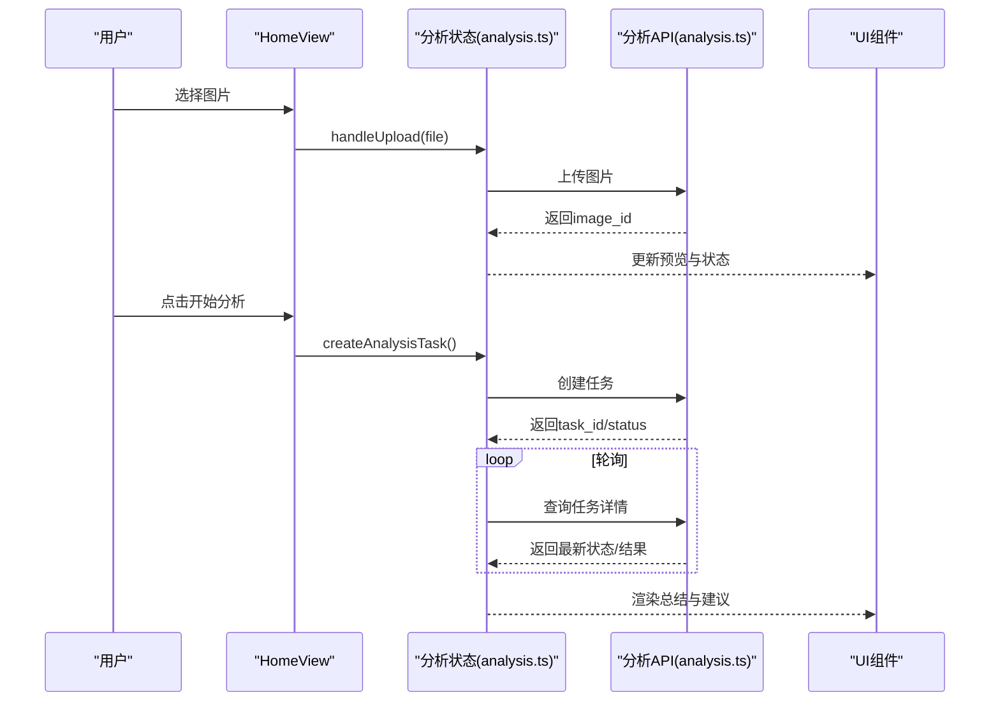
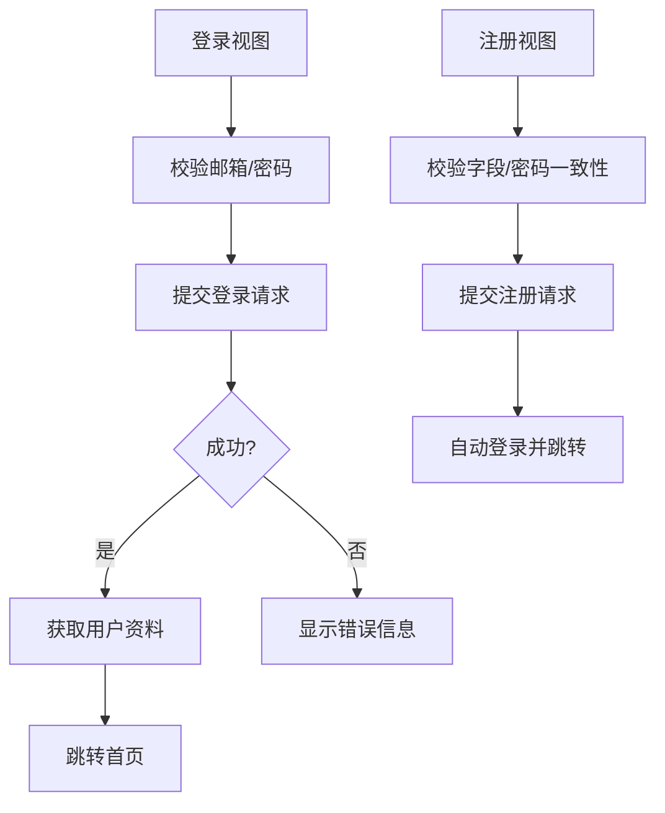
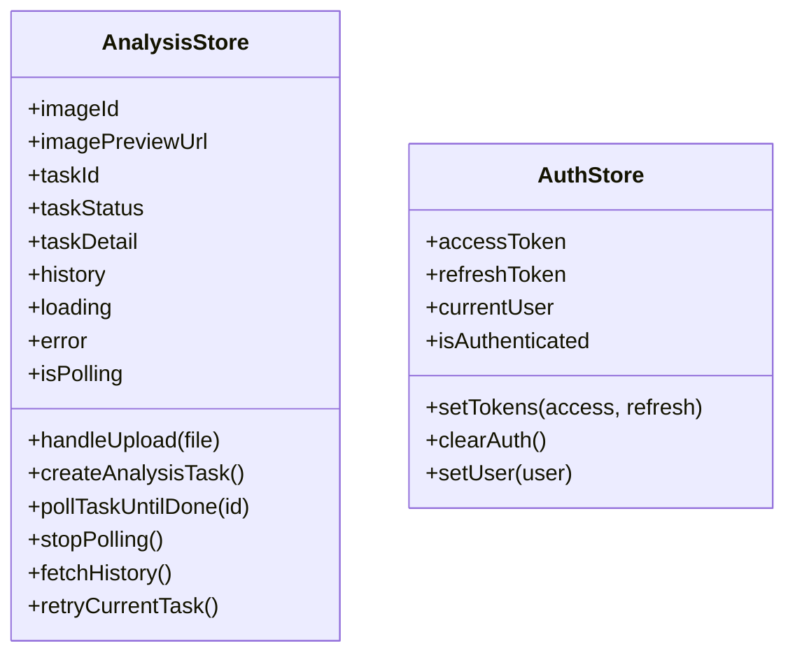
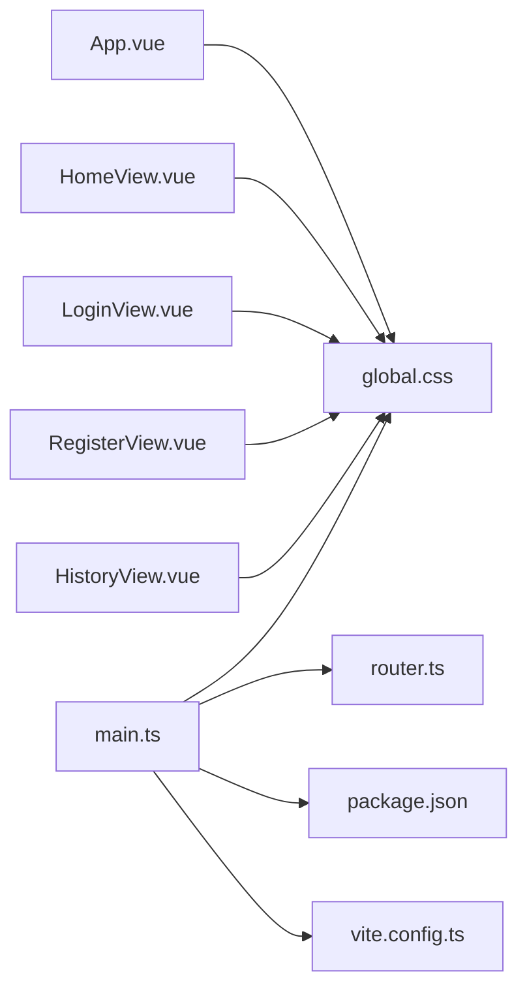

# UI组件

<cite>
**本文引用的文件**
- [apps/web/src/styles/global.css](file://apps/web/src/styles/global.css)
- [apps/web/src/main.ts](file://apps/web/src/main.ts)
- [apps/web/src/App.vue](file://apps/web/src/App.vue)
- [apps/web/src/views/HomeView.vue](file://apps/web/src/views/HomeView.vue)
- [apps/web/src/views/LoginView.vue](file://apps/web/src/views/LoginView.vue)
- [apps/web/src/views/RegisterView.vue](file://apps/web/src/views/RegisterView.vue)
- [apps/web/src/views/HistoryView.vue](file://apps/web/src/views/HistoryView.vue)
- [apps/web/src/stores/analysis.ts](file://apps/web/src/stores/analysis.ts)
- [apps/web/src/stores/auth.ts](file://apps/web/src/stores/auth.ts)
- [apps/web/src/router.ts](file://apps/web/src/router.ts)
- [apps/web/vite.config.ts](file://apps/web/vite.config.ts)
- [apps/web/package.json](file://apps/web/package.json)
</cite>

## 目录
1. [简介](#简介)
2. [项目结构](#项目结构)
3. [核心组件](#核心组件)
4. [架构总览](#架构总览)
5. [详细组件分析](#详细组件分析)
6. [依赖分析](#依赖分析)
7. [性能考虑](#性能考虑)
8. [故障排查指南](#故障排查指南)
9. [结论](#结论)
10. [附录](#附录)

## 简介
本文件面向“AI摄影教练”前端UI组件，系统化梳理全局样式与CSS变量体系、响应式与移动端适配策略、自定义组件样式与主题扩展机制、动画与过渡效果、可访问性与跨浏览器兼容性最佳实践。内容基于仓库中的实际代码进行分析，并提供可视化图表帮助理解。

## 项目结构
前端位于 apps/web，采用 Vue 3 + Vite 架构，通过 Pinia 进行状态管理，使用 Vue Router 实现页面路由与导航守卫。全局样式集中于 styles/global.css，各视图组件以单文件组件形式组织，按功能模块划分。

**图表来源**
- [apps/web/src/main.ts:1-14](file://apps/web/src/main.ts#L1-L14)
- [apps/web/src/App.vue:1-96](file://apps/web/src/App.vue#L1-L96)
- [apps/web/src/router.ts:1-30](file://apps/web/src/router.ts#L1-L30)
- [apps/web/src/views/HomeView.vue:1-111](file://apps/web/src/views/HomeView.vue#L1-L111)
- [apps/web/src/views/HistoryView.vue:1-42](file://apps/web/src/views/HistoryView.vue#L1-L42)
- [apps/web/src/views/LoginView.vue:1-127](file://apps/web/src/views/LoginView.vue#L1-L127)
- [apps/web/src/views/RegisterView.vue:1-160](file://apps/web/src/views/RegisterView.vue#L1-L160)
- [apps/web/src/stores/analysis.ts:1-142](file://apps/web/src/stores/analysis.ts#L1-L142)
- [apps/web/src/stores/auth.ts:1-41](file://apps/web/src/stores/auth.ts#L1-L41)
- [apps/web/src/styles/global.css:1-303](file://apps/web/src/styles/global.css#L1-L303)
- [apps/web/vite.config.ts:1-26](file://apps/web/vite.config.ts#L1-L26)
- [apps/web/package.json:1-26](file://apps/web/package.json#L1-L26)

**章节来源**
- [apps/web/src/main.ts:1-14](file://apps/web/src/main.ts#L1-L14)
- [apps/web/src/styles/global.css:1-303](file://apps/web/src/styles/global.css#L1-L303)

## 核心组件
- 全局样式与CSS变量
  - 在根作用域定义主题变量，如背景渐变、表面色、文本色、主色/强调色/危险/成功/待定等，以及圆角半径与阴影等设计令牌。
  - 使用 CSS 变量统一控制颜色与间距，便于主题扩展与一致性。
- 应用壳层与布局
  - app-shell 容器限定最大宽度并处理安全区域与内边距；tabbar 固定底部导航，支持安全区域适配。
- 视图组件
  - 首页：上传图片、创建分析任务、展示AI点评与建议列表。
  - 历史：展示最近分析任务列表。
  - 登录/注册：基础表单与错误提示。
- 状态管理
  - 分析任务状态：上传、轮询、结果、历史、错误等。
  - 认证状态：令牌存储、用户信息、鉴权守卫。

**章节来源**
- [apps/web/src/styles/global.css:1-303](file://apps/web/src/styles/global.css#L1-L303)
- [apps/web/src/App.vue:1-96](file://apps/web/src/App.vue#L1-L96)
- [apps/web/src/views/HomeView.vue:1-111](file://apps/web/src/views/HomeView.vue#L1-L111)
- [apps/web/src/views/HistoryView.vue:1-42](file://apps/web/src/views/HistoryView.vue#L1-L42)
- [apps/web/src/views/LoginView.vue:1-127](file://apps/web/src/views/LoginView.vue#L1-L127)
- [apps/web/src/views/RegisterView.vue:1-160](file://apps/web/src/views/RegisterView.vue#L1-L160)
- [apps/web/src/stores/analysis.ts:1-142](file://apps/web/src/stores/analysis.ts#L1-L142)
- [apps/web/src/stores/auth.ts:1-41](file://apps/web/src/stores/auth.ts#L1-L41)

## 架构总览
下图展示从入口到视图、状态与样式的整体交互关系。

**图表来源**
- [apps/web/src/main.ts:1-14](file://apps/web/src/main.ts#L1-L14)
- [apps/web/src/App.vue:1-96](file://apps/web/src/App.vue#L1-L96)
- [apps/web/src/router.ts:1-30](file://apps/web/src/router.ts#L1-L30)
- [apps/web/src/styles/global.css:1-303](file://apps/web/src/styles/global.css#L1-L303)

## 详细组件分析

### 全局样式与CSS变量体系
- 主题变量
  - 背景：起止渐变色用于页面背景，营造温暖质感。
  - 表面：卡片与面板的背景与边框色，配合半透明增强层次感。
  - 文本：主/次级文本色，确保对比度与可读性。
  - 色彩语义：主色、强调色、危险、成功、待定，用于状态指示与按钮强调。
  - 圆角与阴影：统一的圆角与阴影值，保证视觉一致性。
- 字体系统
  - 默认字体链包含中英文友好字体，兼顾中文排版与国际化需求。
- 布局与间距
  - app-shell 控制最大宽度与安全区域内边距，确保在刘海屏/圆角屏上体验一致。
  - 视图网格采用统一的 gap，形成清晰的信息层级。
- 组件基类
  - panel：卡片容器，含圆角、边框、阴影与入场动画。
  - btn 系列：主按钮、强调按钮、幽灵按钮，统一过渡与交互反馈。
  - 状态标签：状态芯片按状态映射不同色彩与背景。
  - 预览图：限制最大高度与裁切方式，适配移动端展示。
  - TabBar：固定底部导航，支持激活态高亮与模糊背景。
- 动画与过渡
  - 面板入场动画 rise-in，提升页面切换的流畅感。
  - 按钮按下微动效与禁用态透明度，改善触控反馈。

**图表来源**
- [apps/web/src/styles/global.css:1-303](file://apps/web/src/styles/global.css#L1-L303)

**章节来源**
- [apps/web/src/styles/global.css:1-303](file://apps/web/src/styles/global.css#L1-L303)

### 应用壳层与TabBar
- 壳层容器
  - 限定最大宽度，居中显示；使用环境变量处理安全区域，避免被刘海遮挡。
- TabBar
  - 固定定位，横向三栏布局；激活态高亮与模糊背景增强可读性；支持安全区域自适应。

**图表来源**
- [apps/web/src/App.vue:35-64](file://apps/web/src/App.vue#L35-L64)
- [apps/web/src/styles/global.css:46-291](file://apps/web/src/styles/global.css#L46-L291)

**章节来源**
- [apps/web/src/App.vue:1-96](file://apps/web/src/App.vue#L1-L96)
- [apps/web/src/styles/global.css:46-291](file://apps/web/src/styles/global.css#L46-L291)

### 首页视图（上传与分析）
- 功能流程
  - 选择图片 -> 预览 -> 创建分析任务 -> 轮询任务 -> 展示结果与建议。
- 样式要点
  - 使用 panel 基础样式组织区块；状态芯片根据任务状态动态切换类名；按钮禁用态与加载文案。
- 数据流
  - 通过分析状态管理 store 控制上传、轮询、错误与历史刷新。

**图表来源**
- [apps/web/src/views/HomeView.vue:1-111](file://apps/web/src/views/HomeView.vue#L1-L111)
- [apps/web/src/stores/analysis.ts:1-142](file://apps/web/src/stores/analysis.ts#L1-L142)
- [apps/web/src/api/analysis.ts:1-101](file://apps/web/src/api/analysis.ts#L1-L101)

**章节来源**
- [apps/web/src/views/HomeView.vue:1-111](file://apps/web/src/views/HomeView.vue#L1-L111)
- [apps/web/src/stores/analysis.ts:1-142](file://apps/web/src/stores/analysis.ts#L1-L142)

### 登录与注册视图
- 表单与交互
  - 输入校验、提交状态、错误提示；登录成功后拉取用户资料并跳转首页。
- 样式风格
  - 与全局样式保持一致，输入框聚焦时突出主色边框，链接文字使用主色强调。

**图表来源**
- [apps/web/src/views/LoginView.vue:1-127](file://apps/web/src/views/LoginView.vue#L1-L127)
- [apps/web/src/views/RegisterView.vue:1-160](file://apps/web/src/views/RegisterView.vue#L1-L160)
- [apps/web/src/stores/auth.ts:1-41](file://apps/web/src/stores/auth.ts#L1-L41)

**章节来源**
- [apps/web/src/views/LoginView.vue:1-127](file://apps/web/src/views/LoginView.vue#L1-L127)
- [apps/web/src/views/RegisterView.vue:1-160](file://apps/web/src/views/RegisterView.vue#L1-L160)
- [apps/web/src/stores/auth.ts:1-41](file://apps/web/src/stores/auth.ts#L1-L41)

### 历史视图
- 功能：加载并展示最近分析任务列表，格式化时间与状态。
- 样式：使用历史列表与条目基类，空状态提示。

**章节来源**
- [apps/web/src/views/HistoryView.vue:1-42](file://apps/web/src/views/HistoryView.vue#L1-L42)

### 状态管理（分析与认证）
- 分析任务状态
  - 管理图片ID/预览、任务ID/状态/详情、历史列表、加载与错误状态；提供轮询与重试逻辑。
- 认证状态
  - 存储访问令牌与刷新令牌，持久化至本地存储；计算是否已认证；提供清理与设置用户信息方法。

**图表来源**
- [apps/web/src/stores/analysis.ts:1-142](file://apps/web/src/stores/analysis.ts#L1-L142)
- [apps/web/src/stores/auth.ts:1-41](file://apps/web/src/stores/auth.ts#L1-L41)

**章节来源**
- [apps/web/src/stores/analysis.ts:1-142](file://apps/web/src/stores/analysis.ts#L1-L142)
- [apps/web/src/stores/auth.ts:1-41](file://apps/web/src/stores/auth.ts#L1-L41)

### 路由与导航守卫
- 路由规则：登录/注册允许游客访问，其余页面需鉴权。
- 导航守卫：在进入受保护路由前检查鉴权状态，未登录则重定向至登录页；已登录访问游客页则重定向至首页。

**章节来源**
- [apps/web/src/router.ts:1-30](file://apps/web/src/router.ts#L1-L30)

## 依赖分析
- 入口依赖
  - main.ts 引入全局样式，挂载应用并注册路由与状态库。
- 构建与开发
  - vite.config.ts 提供Vue插件与开发服务器代理配置；package.json 定义运行脚本与依赖版本。
- 样式依赖
  - App.vue 与各视图组件均依赖 global.css 中的类名与CSS变量，形成统一视觉语言。

**图表来源**
- [apps/web/src/main.ts:1-14](file://apps/web/src/main.ts#L1-L14)
- [apps/web/src/styles/global.css:1-303](file://apps/web/src/styles/global.css#L1-L303)
- [apps/web/src/App.vue:1-96](file://apps/web/src/App.vue#L1-L96)
- [apps/web/src/views/HomeView.vue:1-111](file://apps/web/src/views/HomeView.vue#L1-L111)
- [apps/web/src/views/LoginView.vue:1-127](file://apps/web/src/views/LoginView.vue#L1-L127)
- [apps/web/src/views/RegisterView.vue:1-160](file://apps/web/src/views/RegisterView.vue#L1-L160)
- [apps/web/src/views/HistoryView.vue:1-42](file://apps/web/src/views/HistoryView.vue#L1-L42)
- [apps/web/vite.config.ts:1-26](file://apps/web/vite.config.ts#L1-L26)
- [apps/web/package.json:1-26](file://apps/web/package.json#L1-L26)

**章节来源**
- [apps/web/src/main.ts:1-14](file://apps/web/src/main.ts#L1-L14)
- [apps/web/vite.config.ts:1-26](file://apps/web/vite.config.ts#L1-L26)
- [apps/web/package.json:1-26](file://apps/web/package.json#L1-L26)

## 性能考虑
- 图片预览
  - 使用对象URL生成预览，注意在组件卸载时释放内存，避免内存泄漏。
- 轮询策略
  - 合理的轮询间隔与停止条件，避免长时间轮询造成资源浪费。
- 样式体积
  - 将通用样式集中在全局样式中，减少重复定义；使用CSS变量降低维护成本。
- 构建优化
  - 使用Vite进行快速开发与打包，按需引入插件与依赖。

**章节来源**
- [apps/web/src/stores/analysis.ts:92-94](file://apps/web/src/stores/analysis.ts#L92-L94)

## 故障排查指南
- 登录/注册失败
  - 检查网络请求返回的状态码与错误信息，确保代理配置正确指向后端服务。
- 任务状态异常
  - 确认任务轮询逻辑是否正常执行，查看状态变化与历史刷新是否触发。
- 样式不生效
  - 确认全局样式已正确引入，组件类名与CSS变量使用是否正确。

**章节来源**
- [apps/web/src/views/LoginView.vue:36-46](file://apps/web/src/views/LoginView.vue#L36-L46)
- [apps/web/src/views/RegisterView.vue:55-67](file://apps/web/src/views/RegisterView.vue#L55-L67)
- [apps/web/src/stores/analysis.ts:76-90](file://apps/web/src/stores/analysis.ts#L76-L90)
- [apps/web/src/main.ts:6](file://apps/web/src/main.ts#L6)

## 结论
本项目通过集中化的CSS变量与通用组件基类，实现了统一的视觉语言与良好的可维护性。结合路由守卫与Pinia状态管理，形成了清晰的数据流与用户体验路径。未来可在现有基础上进一步完善主题切换机制与无障碍能力，持续提升跨设备与跨浏览器的一致性体验。

## 附录
- 响应式与移动端适配
  - 使用安全区域变量与最大宽度约束，确保在不同机型上的稳定显示。
- 动画与过渡
  - 面板入场动画与按钮交互反馈，提升用户感知与操作确认。
- 可访问性与兼容性
  - 保持足够的对比度与焦点可见性；在输入框与按钮上提供明确的交互反馈。