# 前端应用文档

<cite>
**本文档引用的文件**
- [apps/web/src/main.ts](file://apps/web/src/main.ts)
- [apps/web/src/App.vue](file://apps/web/src/App.vue)
- [apps/web/src/router.ts](file://apps/web/src/router.ts)
- [apps/web/package.json](file://apps/web/package.json)
- [apps/web/vite.config.ts](file://apps/web/vite.config.ts)
- [apps/web/src/stores/auth.ts](file://apps/web/src/stores/auth.ts)
- [apps/web/src/stores/analysis.ts](file://apps/web/src/stores/analysis.ts)
- [apps/web/src/views/HomeView.vue](file://apps/web/src/views/HomeView.vue)
- [apps/web/src/views/LoginView.vue](file://apps/web/src/views/LoginView.vue)
- [apps/web/src/views/RegisterView.vue](file://apps/web/src/views/RegisterView.vue)
- [apps/web/src/views/HistoryView.vue](file://apps/web/src/views/HistoryView.vue)
- [apps/web/src/views/ProfileView.vue](file://apps/web/src/views/ProfileView.vue)
- [apps/web/src/api/auth.ts](file://apps/web/src/api/auth.ts)
- [apps/web/src/api/analysis.ts](file://apps/web/src/api/analysis.ts)
- [apps/web/src/styles/global.css](file://apps/web/src/styles/global.css)
</cite>

## 目录
1. [简介](#简介)
2. [项目结构](#项目结构)
3. [核心组件](#核心组件)
4. [架构总览](#架构总览)
5. [详细组件分析](#详细组件分析)
6. [依赖关系分析](#依赖关系分析)
7. [性能考虑](#性能考虑)
8. [故障排除指南](#故障排除指南)
9. [结论](#结论)
10. [附录](#附录)

## 简介
本项目是 AI 摄影教练的前端应用，基于 Vue 3 + TypeScript + Pinia + Vue Router 构建。应用提供照片上传与 AI 分析、历史记录查看、用户个人资料管理等功能，并通过全局样式系统实现统一的主题与视觉风格。应用采用前后端分离架构，前端通过 Vite 进行开发与构建，支持本地代理到后端 API。

## 项目结构
前端应用位于 apps/web 目录，采用典型的 Vue 3 单页应用结构：
- 应用入口：main.ts 创建应用实例，挂载 Pinia 和路由
- 根组件：App.vue 提供头部导航、主内容区域和底部标签栏
- 路由配置：router.ts 定义页面路由与导航守卫
- 视图组件：各页面视图按功能划分
- 状态管理：Pinia Store 管理认证与分析任务状态
- API 层：封装 HTTP 请求与类型定义
- 样式系统：全局 CSS 变量与组件级样式

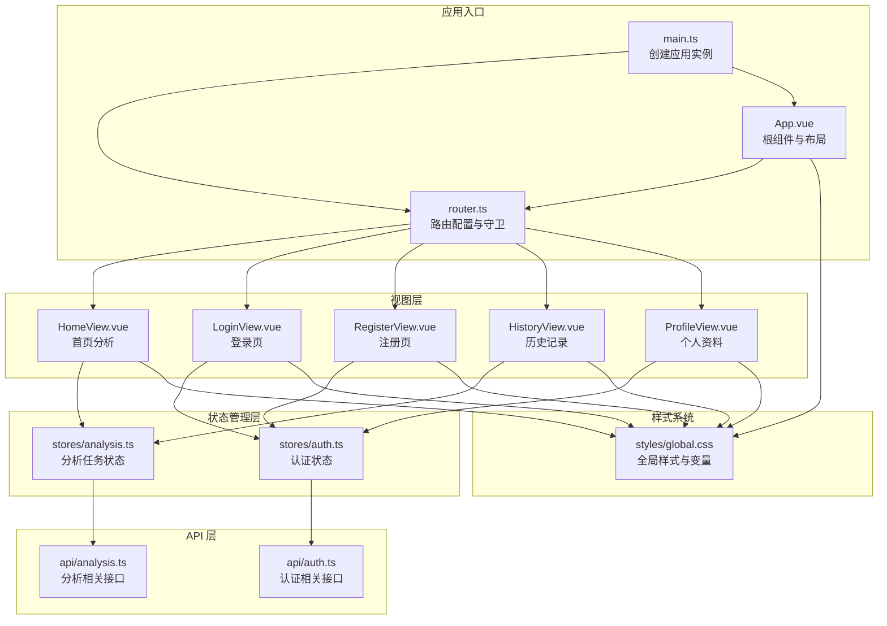

**图表来源**
- [apps/web/src/main.ts:1-14](file://apps/web/src/main.ts#L1-L14)
- [apps/web/src/router.ts:1-30](file://apps/web/src/router.ts#L1-L30)
- [apps/web/src/App.vue:1-96](file://apps/web/src/App.vue#L1-L96)
- [apps/web/src/stores/analysis.ts:1-142](file://apps/web/src/stores/analysis.ts#L1-L142)
- [apps/web/src/stores/auth.ts:1-41](file://apps/web/src/stores/auth.ts#L1-L41)
- [apps/web/src/api/analysis.ts:1-101](file://apps/web/src/api/analysis.ts#L1-L101)
- [apps/web/src/api/auth.ts:1-56](file://apps/web/src/api/auth.ts#L1-L56)
- [apps/web/src/styles/global.css:1-303](file://apps/web/src/styles/global.css#L1-L303)

**章节来源**
- [apps/web/src/main.ts:1-14](file://apps/web/src/main.ts#L1-L14)
- [apps/web/src/router.ts:1-30](file://apps/web/src/router.ts#L1-L30)
- [apps/web/src/App.vue:1-96](file://apps/web/src/App.vue#L1-L96)
- [apps/web/package.json:1-26](file://apps/web/package.json#L1-L26)
- [apps/web/vite.config.ts:1-26](file://apps/web/vite.config.ts#L1-L26)

## 核心组件
本节概述应用的关键组件及其职责：
- 应用入口与初始化：创建 Vue 实例，安装 Pinia 与路由，引入全局样式
- 根组件与布局：提供头部标题、用户信息、登出按钮与底部导航栏
- 路由系统：定义登录、注册、首页、历史、个人资料等路由，并实现导航守卫
- 状态管理：认证状态（Token、用户信息）与分析任务状态（图片、任务、历史）
- API 封装：认证与分析相关的 HTTP 接口
- 样式系统：CSS 变量定义主题色、圆角、阴影等基础样式

**章节来源**
- [apps/web/src/main.ts:1-14](file://apps/web/src/main.ts#L1-L14)
- [apps/web/src/App.vue:1-96](file://apps/web/src/App.vue#L1-L96)
- [apps/web/src/router.ts:1-30](file://apps/web/src/router.ts#L1-L30)
- [apps/web/src/stores/auth.ts:1-41](file://apps/web/src/stores/auth.ts#L1-L41)
- [apps/web/src/stores/analysis.ts:1-142](file://apps/web/src/stores/analysis.ts#L1-L142)
- [apps/web/src/api/auth.ts:1-56](file://apps/web/src/api/auth.ts#L1-L56)
- [apps/web/src/api/analysis.ts:1-101](file://apps/web/src/api/analysis.ts#L1-L101)
- [apps/web/src/styles/global.css:1-303](file://apps/web/src/styles/global.css#L1-L303)

## 架构总览
应用采用“视图层 + 状态管理层 + API 层 + 样式系统”的分层架构：
- 视图层：各页面组件负责用户交互与展示
- 状态管理层：Pinia Store 管理跨组件共享的状态
- API 层：封装 HTTP 请求，提供类型安全的接口
- 样式系统：全局 CSS 变量与组件作用域样式

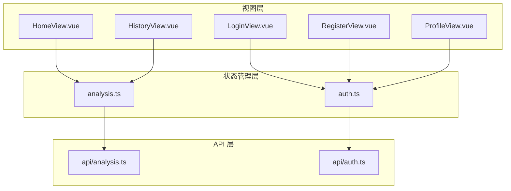

**图表来源**
- [apps/web/src/views/HomeView.vue:1-111](file://apps/web/src/views/HomeView.vue#L1-L111)
- [apps/web/src/views/LoginView.vue:1-127](file://apps/web/src/views/LoginView.vue#L1-L127)
- [apps/web/src/views/RegisterView.vue:1-160](file://apps/web/src/views/RegisterView.vue#L1-L160)
- [apps/web/src/views/HistoryView.vue:1-42](file://apps/web/src/views/HistoryView.vue#L1-L42)
- [apps/web/src/views/ProfileView.vue:1-243](file://apps/web/src/views/ProfileView.vue#L1-L243)
- [apps/web/src/stores/analysis.ts:1-142](file://apps/web/src/stores/analysis.ts#L1-L142)
- [apps/web/src/stores/auth.ts:1-41](file://apps/web/src/stores/auth.ts#L1-L41)
- [apps/web/src/api/analysis.ts:1-101](file://apps/web/src/api/analysis.ts#L1-L101)
- [apps/web/src/api/auth.ts:1-56](file://apps/web/src/api/auth.ts#L1-L56)

## 详细组件分析

### 应用入口与初始化
- 初始化流程：创建 Vue 应用实例，安装 Pinia 与路由，引入全局样式，挂载到 DOM
- 全局样式：引入全局 CSS 变量与通用样式类

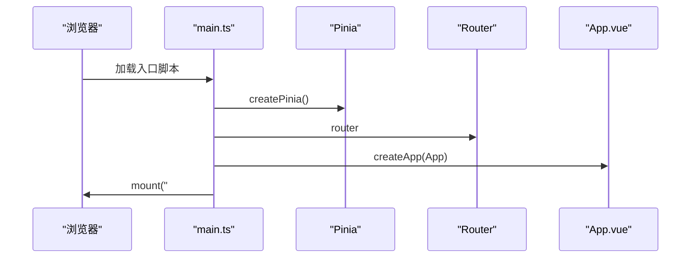

**图表来源**
- [apps/web/src/main.ts:1-14](file://apps/web/src/main.ts#L1-L14)

**章节来源**
- [apps/web/src/main.ts:1-14](file://apps/web/src/main.ts#L1-L14)
- [apps/web/src/styles/global.css:1-303](file://apps/web/src/styles/global.css#L1-L303)

### 根组件与布局（App.vue）
- 功能：提供头部标题、用户显示与登出；根据认证状态显示底部导航栏；渲染 RouterView
- 导航：定义底部三个标签项（分析、历史、个人），点击切换路由
- 认证集成：读取认证状态决定是否显示用户信息与登出按钮

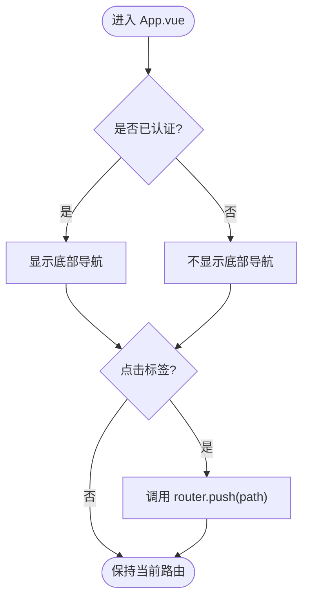

**图表来源**
- [apps/web/src/App.vue:10-32](file://apps/web/src/App.vue#L10-L32)

**章节来源**
- [apps/web/src/App.vue:1-96](file://apps/web/src/App.vue#L1-L96)

### 路由系统（router.ts）
- 路由定义：登录、注册、首页、历史、个人资料五个路由
- 导航守卫：requiresAuth 与 guest 元信息控制访问权限
  - 需要认证：未认证则跳转登录
  - 游客限制：已认证则跳转首页

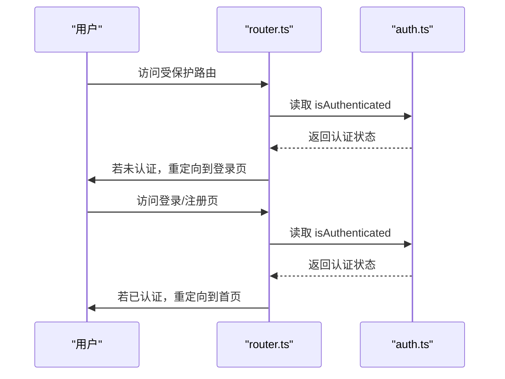

**图表来源**
- [apps/web/src/router.ts:10-30](file://apps/web/src/router.ts#L10-L30)
- [apps/web/src/stores/auth.ts:10-10](file://apps/web/src/stores/auth.ts#L10-L10)

**章节来源**
- [apps/web/src/router.ts:1-30](file://apps/web/src/router.ts#L1-L30)

### 认证状态管理（stores/auth.ts）
- 状态：访问令牌、刷新令牌、当前用户信息
- 计算属性：isAuthenticated 基于访问令牌是否存在
- 方法：setTokens 写入本地存储；clearAuth 清空认证信息；setUser 设置用户信息
- 使用场景：登录/注册成功后写入 Token 与用户信息；登出时清空并跳转登录

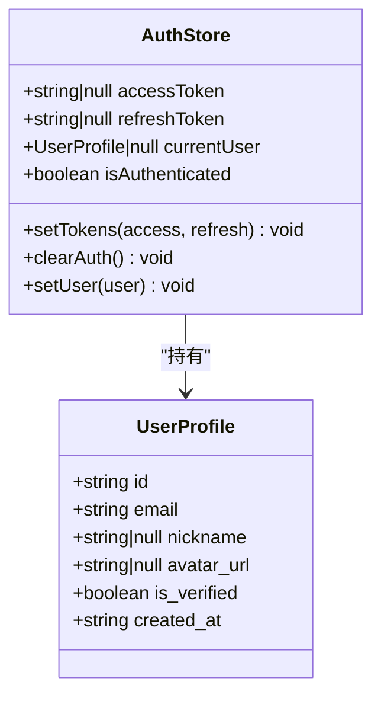

**图表来源**
- [apps/web/src/stores/auth.ts:1-41](file://apps/web/src/stores/auth.ts#L1-L41)
- [apps/web/src/api/auth.ts:3-10](file://apps/web/src/api/auth.ts#L3-L10)

**章节来源**
- [apps/web/src/stores/auth.ts:1-41](file://apps/web/src/stores/auth.ts#L1-L41)
- [apps/web/src/api/auth.ts:1-56](file://apps/web/src/api/auth.ts#L1-L56)

### 分析任务状态管理（stores/analysis.ts）
- 状态：图片 ID、预览 URL、任务 ID、任务状态、任务详情、历史列表、加载与错误状态、轮询标志
- 方法：
  - handleUpload：上传图片并生成预览
  - createAnalysisTask：创建分析任务并轮询直到完成
  - pollTaskUntilDone：定时轮询任务详情
  - stopPolling：停止轮询
  - fetchHistory：获取历史记录
  - retryCurrentTask：重试当前任务
- 轮询策略：固定间隔轮询，完成后刷新历史

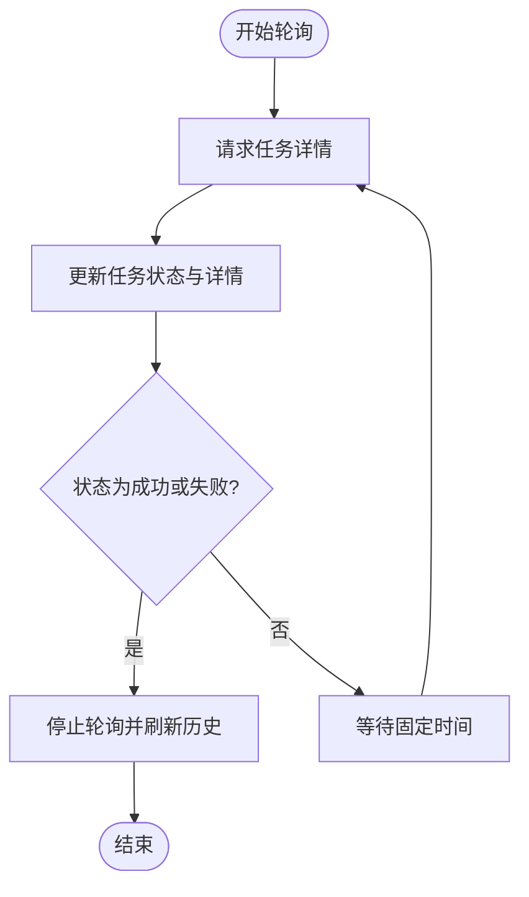

**图表来源**
- [apps/web/src/stores/analysis.ts:76-90](file://apps/web/src/stores/analysis.ts#L76-L90)

**章节来源**
- [apps/web/src/stores/analysis.ts:1-142](file://apps/web/src/stores/analysis.ts#L1-L142)
- [apps/web/src/api/analysis.ts:1-101](file://apps/web/src/api/analysis.ts#L1-L101)

### 首页视图（views/HomeView.vue）
- 功能：文件选择、图片预览、创建分析任务、重试失败任务、展示 AI 点评
- 交互：绑定文件输入事件，调用分析 Store 的方法；根据任务状态动态渲染 UI
- 生命周期：组件卸载时停止轮询

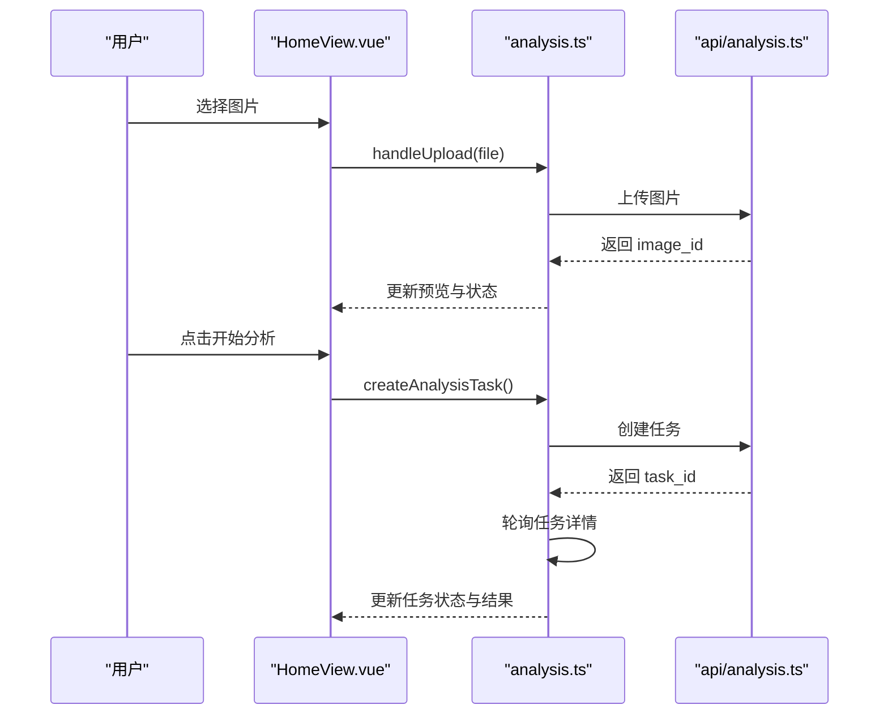

**图表来源**
- [apps/web/src/views/HomeView.vue:1-111](file://apps/web/src/views/HomeView.vue#L1-L111)
- [apps/web/src/stores/analysis.ts:34-74](file://apps/web/src/stores/analysis.ts#L34-L74)
- [apps/web/src/api/analysis.ts:82-95](file://apps/web/src/api/analysis.ts#L82-L95)

**章节来源**
- [apps/web/src/views/HomeView.vue:1-111](file://apps/web/src/views/HomeView.vue#L1-L111)

### 登录视图（views/LoginView.vue）
- 功能：邮箱与密码登录，登录成功后写入 Token 与用户信息并跳转首页
- 错误处理：根据响应状态返回相应提示
- 表单校验：必填字段校验

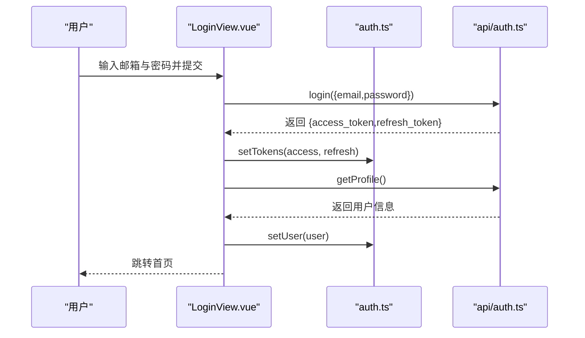

**图表来源**
- [apps/web/src/views/LoginView.vue:15-46](file://apps/web/src/views/LoginView.vue#L15-L46)
- [apps/web/src/stores/auth.ts:12-29](file://apps/web/src/stores/auth.ts#L12-L29)
- [apps/web/src/api/auth.ts:33-47](file://apps/web/src/api/auth.ts#L33-L47)

**章节来源**
- [apps/web/src/views/LoginView.vue:1-127](file://apps/web/src/views/LoginView.vue#L1-L127)

### 注册视图（views/RegisterView.vue）
- 功能：邮箱、密码、确认密码与可选昵称注册，注册成功后自动登录并跳转首页
- 校验规则：密码长度与一致性校验
- 错误处理：根据状态码返回不同提示

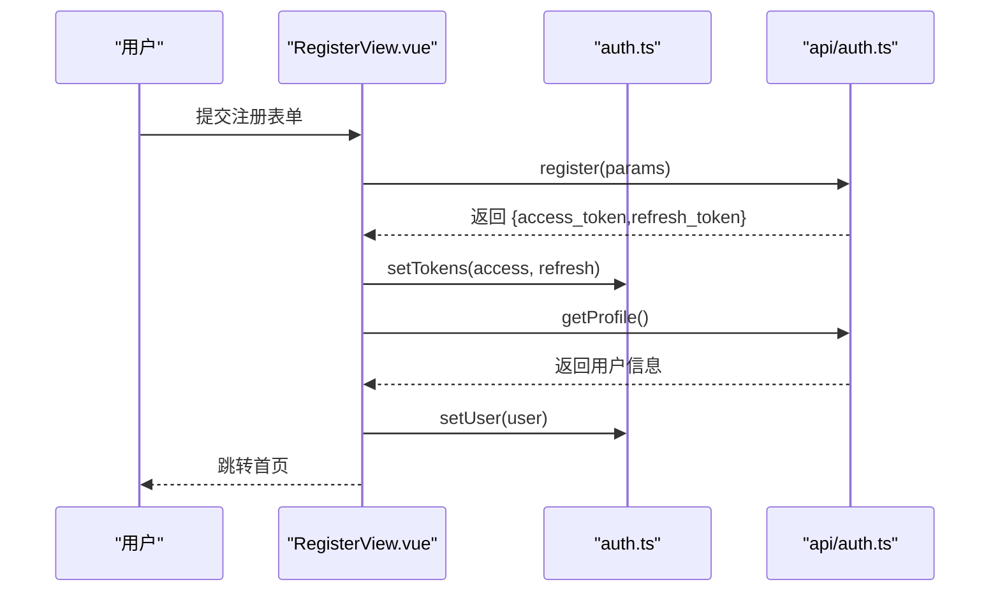

**图表来源**
- [apps/web/src/views/RegisterView.vue:25-67](file://apps/web/src/views/RegisterView.vue#L25-L67)
- [apps/web/src/stores/auth.ts:12-29](file://apps/web/src/stores/auth.ts#L12-L29)
- [apps/web/src/api/auth.ts:29-47](file://apps/web/src/api/auth.ts#L29-L47)

**章节来源**
- [apps/web/src/views/RegisterView.vue:1-160](file://apps/web/src/views/RegisterView.vue#L1-L160)

### 历史记录视图（views/HistoryView.vue）
- 功能：首次进入时加载最近 20 条分析任务历史
- 展示：状态与时间、摘要信息；无记录时显示提示

**章节来源**
- [apps/web/src/views/HistoryView.vue:1-42](file://apps/web/src/views/HistoryView.vue#L1-L42)
- [apps/web/src/stores/analysis.ts:96-104](file://apps/web/src/stores/analysis.ts#L96-L104)
- [apps/web/src/api/analysis.ts:92-95](file://apps/web/src/api/analysis.ts#L92-L95)

### 个人资料视图（views/ProfileView.vue）
- 功能：展示与编辑用户资料（昵称、头像）、修改密码
- 数据流：加载资料 -> 编辑 -> 更新 -> 成功反馈
- 安全：修改密码前进行字段与强度校验

**章节来源**
- [apps/web/src/views/ProfileView.vue:1-243](file://apps/web/src/views/ProfileView.vue#L1-L243)
- [apps/web/src/api/auth.ts:45-55](file://apps/web/src/api/auth.ts#L45-L55)

### API 层设计
- 认证接口：注册、登录、刷新 Token、登出、获取/更新用户资料、修改密码
- 分析接口：创建任务、查询任务详情、获取历史、重试任务
- 类型定义：为请求参数与响应数据提供 TypeScript 类型

**章节来源**
- [apps/web/src/api/auth.ts:1-56](file://apps/web/src/api/auth.ts#L1-L56)
- [apps/web/src/api/analysis.ts:1-101](file://apps/web/src/api/analysis.ts#L1-L101)

### 样式系统与主题定制
- 主题变量：背景渐变、表面色、文本色、主色、强调色、危险色、成功色、半径、阴影等
- 组件样式：按钮、面板、状态标签、预览图、历史列表、标签栏等
- 响应式与安全区域：适配移动端安全区域与固定底部标签栏

**章节来源**
- [apps/web/src/styles/global.css:1-303](file://apps/web/src/styles/global.css#L1-L303)

## 依赖关系分析
- 开发与运行时依赖：Vue 3、Vue Router、Pinia、Axios、TypeScript、Vite
- 构建脚本：dev、build、preview
- 代理配置：开发环境代理到后端 API

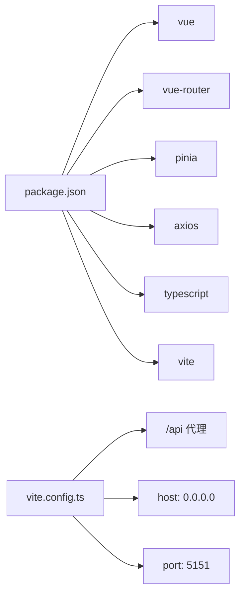

**图表来源**
- [apps/web/package.json:1-26](file://apps/web/package.json#L1-L26)
- [apps/web/vite.config.ts:1-26](file://apps/web/vite.config.ts#L1-L26)

**章节来源**
- [apps/web/package.json:1-26](file://apps/web/package.json#L1-L26)
- [apps/web/vite.config.ts:1-26](file://apps/web/vite.config.ts#L1-L26)

## 性能考虑
- 图片预览：使用对象 URL 生成预览，上传成功后及时释放旧 URL
- 轮询策略：固定间隔轮询任务状态，避免频繁请求；组件卸载时停止轮询
- 样式优化：使用 CSS 变量减少重复定义，统一动画与过渡效果
- 构建优化：Vite 快速冷启动与热更新，生产构建压缩资源

## 故障排除指南
- 登录失败：检查邮箱与密码格式，关注 400/401 状态码对应的错误提示
- 注册失败：检查密码长度与一致性，关注 400/409 状态码
- 分析任务异常：确认图片上传成功，检查网络与后端服务状态；必要时重试任务
- 历史记录为空：首次使用或无历史时为空，上传图片并完成分析后出现
- 导航跳转异常：确保导航守卫逻辑生效，未认证用户无法访问受保护路由

**章节来源**
- [apps/web/src/views/LoginView.vue:36-46](file://apps/web/src/views/LoginView.vue#L36-L46)
- [apps/web/src/views/RegisterView.vue:55-67](file://apps/web/src/views/RegisterView.vue#L55-L67)
- [apps/web/src/stores/analysis.ts:68-74](file://apps/web/src/stores/analysis.ts#L68-L74)
- [apps/web/src/router.ts:21-30](file://apps/web/src/router.ts#L21-L30)

## 结论
本应用以清晰的分层架构实现了照片上传与 AI 分析、用户认证与个人资料管理等核心功能。通过 Pinia 管理认证与分析状态，Vue Router 控制页面流转，全局样式系统保证视觉一致性。开发与构建流程简洁高效，具备良好的扩展性与维护性。

## 附录
- 开发命令：dev、build、preview
- 开发服务器：host=0.0.0.0，port=5151，代理 /api 到后端
- 主题变量：可在全局 CSS 中调整颜色与尺寸变量以定制主题

**章节来源**
- [apps/web/package.json:6-10](file://apps/web/package.json#L6-L10)
- [apps/web/vite.config.ts:4-24](file://apps/web/vite.config.ts#L4-L24)
- [apps/web/src/styles/global.css:1-16](file://apps/web/src/styles/global.css#L1-L16)