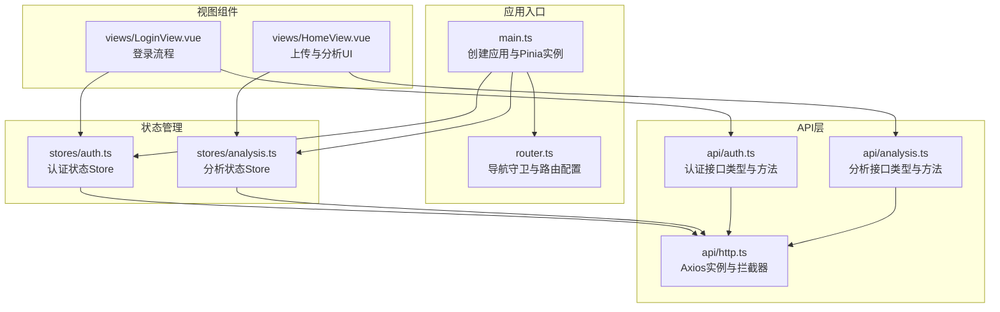
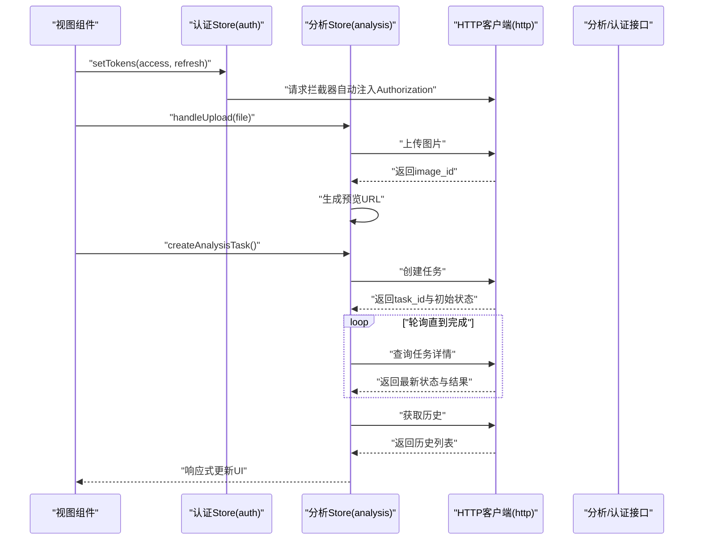
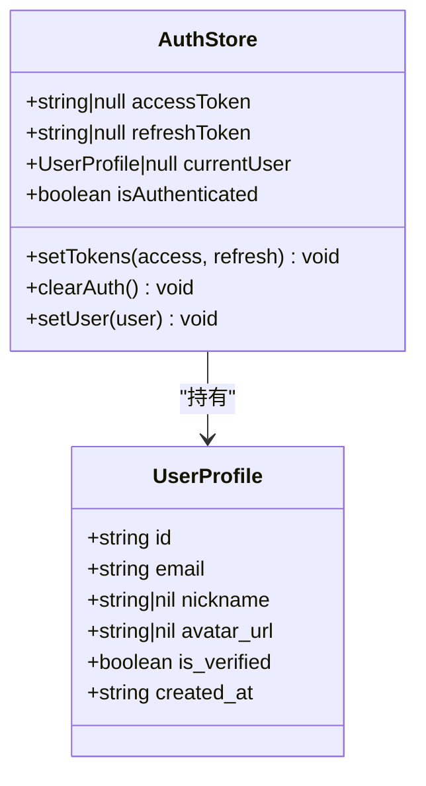
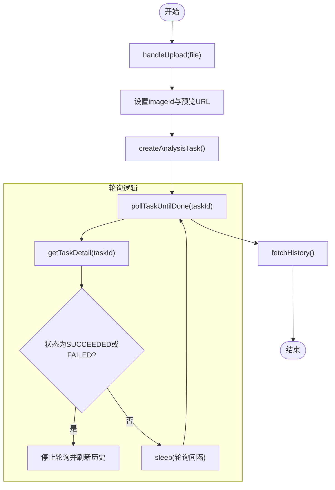
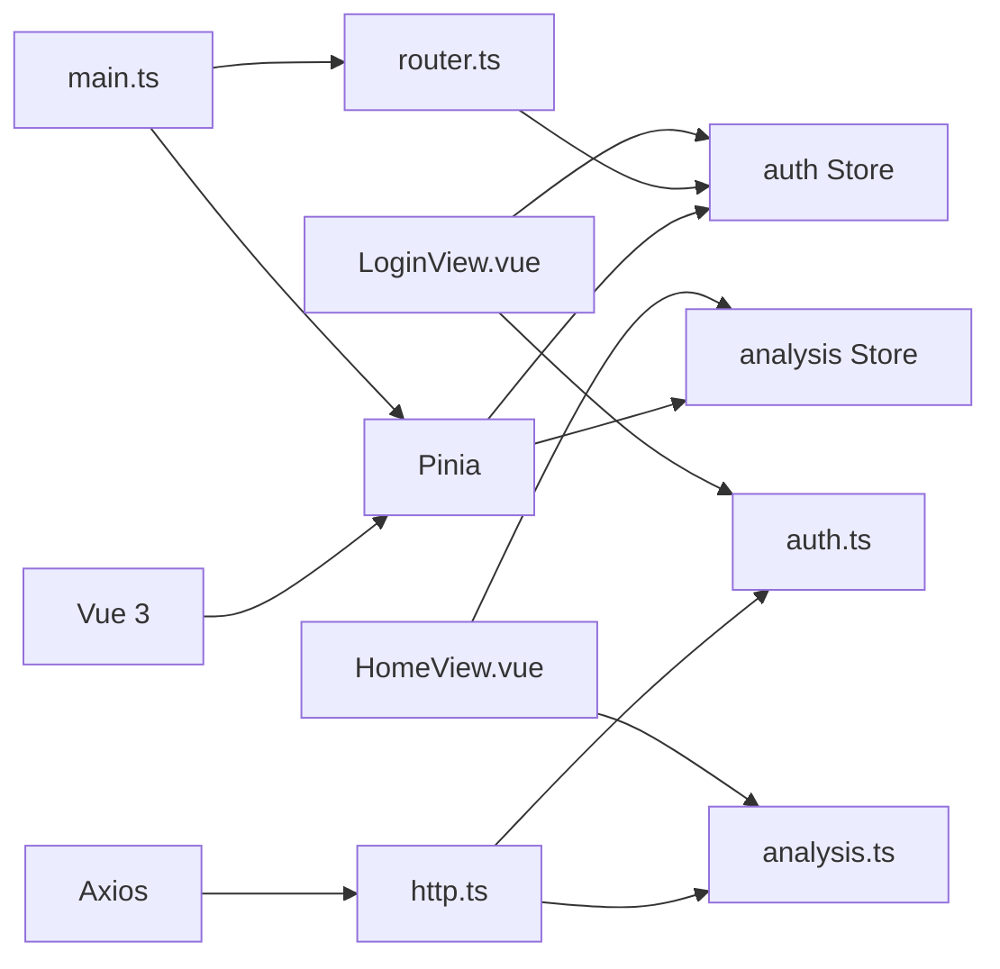

# 状态管理

<cite>
**本文引用的文件列表**
- [apps/web/src/stores/auth.ts](file://apps/web/src/stores/auth.ts)
- [apps/web/src/stores/analysis.ts](file://apps/web/src/stores/analysis.ts)
- [apps/web/src/api/auth.ts](file://apps/web/src/api/auth.ts)
- [apps/web/src/api/analysis.ts](file://apps/web/src/api/analysis.ts)
- [apps/web/src/api/http.ts](file://apps/web/src/api/http.ts)
- [apps/web/src/main.ts](file://apps/web/src/main.ts)
- [apps/web/src/router.ts](file://apps/web/src/router.ts)
- [apps/web/src/views/LoginView.vue](file://apps/web/src/views/LoginView.vue)
- [apps/web/src/views/HomeView.vue](file://apps/web/src/views/HomeView.vue)
- [apps/web/package.json](file://apps/web/package.json)
</cite>

## 目录
1. [简介](#简介)
2. [项目结构](#项目结构)
3. [核心组件](#核心组件)
4. [架构总览](#架构总览)
5. [详细组件分析](#详细组件分析)
6. [依赖关系分析](#依赖关系分析)
7. [性能考量](#性能考量)
8. [故障排查指南](#故障排查指南)
9. [结论](#结论)
10. [附录](#附录)

## 简介
本文件面向“AI摄影教练”前端的状态管理系统，系统采用 Vue 3 + Pinia 的组合式 Store 设计，围绕两个核心 Store 展开：
- 认证状态 Store（auth）：负责令牌与用户信息的存储、同步与清理，并通过导航守卫实现路由级鉴权控制。
- 分析状态 Store（analysis）：负责图像上传、任务创建、轮询查询、结果展示与历史加载等全流程状态管理。

文档将从架构、数据流、响应式更新机制、持久化与恢复、调试与性能优化等方面进行深入解析，并提供可视化图示帮助理解。

## 项目结构
前端应用位于 apps/web，状态管理相关代码主要分布在以下位置：
- 应用入口与全局配置：main.ts、router.ts
- 状态 Store：stores/auth.ts、stores/analysis.ts
- API 客户端与拦截器：api/http.ts、api/auth.ts、api/analysis.ts
- 视图组件：views/LoginView.vue、views/HomeView.vue 等

图表来源
- [apps/web/src/main.ts:1-14](file://apps/web/src/main.ts#L1-L14)
- [apps/web/src/router.ts:1-30](file://apps/web/src/router.ts#L1-L30)
- [apps/web/src/stores/auth.ts:1-41](file://apps/web/src/stores/auth.ts#L1-L41)
- [apps/web/src/stores/analysis.ts:1-142](file://apps/web/src/stores/analysis.ts#L1-L142)
- [apps/web/src/api/http.ts:1-94](file://apps/web/src/api/http.ts#L1-L94)
- [apps/web/src/api/auth.ts:1-56](file://apps/web/src/api/auth.ts#L1-L56)
- [apps/web/src/api/analysis.ts:1-101](file://apps/web/src/api/analysis.ts#L1-L101)
- [apps/web/src/views/LoginView.vue:1-127](file://apps/web/src/views/LoginView.vue#L1-L127)
- [apps/web/src/views/HomeView.vue:1-111](file://apps/web/src/views/HomeView.vue#L1-L111)

章节来源
- [apps/web/src/main.ts:1-14](file://apps/web/src/main.ts#L1-L14)
- [apps/web/src/router.ts:1-30](file://apps/web/src/router.ts#L1-L30)

## 核心组件
本节聚焦两个核心 Store 的职责划分与交互模式。

- 认证状态 Store（auth）
  - 职责：维护访问令牌、刷新令牌、当前用户信息；提供认证态判断与令牌设置/清理能力；与本地存储联动实现持久化。
  - 关键字段：accessToken、refreshToken、currentUser、isAuthenticated。
  - 关键动作：setTokens、clearAuth、setUser。
  - 与路由集成：通过导航守卫根据 isAuthenticated 控制页面访问权限。

- 分析状态 Store（analysis）
  - 职责：管理图像上传、任务创建、轮询查询、结果展示、历史加载与重试逻辑；提供 loading、error、polling 等状态标记。
  - 关键字段：imageId、imagePreviewUrl、taskId、taskStatus、taskDetail、history、loading、error、isPolling。
  - 关键动作：handleUpload、createAnalysisTask、pollTaskUntilDone、stopPolling、fetchHistory、retryCurrentTask。
  - 与 API 集成：封装对分析服务的调用，处理异常与轮询停止。

章节来源
- [apps/web/src/stores/auth.ts:1-41](file://apps/web/src/stores/auth.ts#L1-L41)
- [apps/web/src/stores/analysis.ts:1-142](file://apps/web/src/stores/analysis.ts#L1-L142)
- [apps/web/src/router.ts:21-30](file://apps/web/src/router.ts#L21-L30)

## 架构总览
下图展示了从视图到 Store，再到 API 层的整体数据流与控制流。

图表来源
- [apps/web/src/views/LoginView.vue:15-46](file://apps/web/src/views/LoginView.vue#L15-L46)
- [apps/web/src/views/HomeView.vue:31-48](file://apps/web/src/views/HomeView.vue#L31-L48)
- [apps/web/src/stores/analysis.ts:34-104](file://apps/web/src/stores/analysis.ts#L34-L104)
- [apps/web/src/api/http.ts:10-17](file://apps/web/src/api/http.ts#L10-L17)
- [apps/web/src/api/analysis.ts:82-95](file://apps/web/src/api/analysis.ts#L82-L95)

## 详细组件分析

### 认证状态 Store（auth）
- 设计模式
  - 组合式 Store：使用 defineStore 返回一个函数式 Store，内部通过 ref/computed 管理响应式状态与派生状态。
  - 本地存储持久化：初始化时从 localStorage 读取令牌，变更时同步写入；清理时移除。
  - 类型安全：UserProfile、TokenResponse 等接口定义来自 api/auth.ts，确保数据结构一致性。
- 状态定义
  - accessToken、refreshToken：字符串或空，用于鉴权。
  - currentUser：用户档案对象或空。
  - isAuthenticated：基于 accessToken 是否存在的布尔值。
- Getter 与 Action
  - getter：isAuthenticated。
  - actions：setTokens、clearAuth、setUser。
- 与路由集成
  - 在导航守卫中读取 isAuthenticated，决定是否放行或重定向至登录页。

图表来源
- [apps/web/src/stores/auth.ts:5-40](file://apps/web/src/stores/auth.ts#L5-L40)
- [apps/web/src/api/auth.ts:3-10](file://apps/web/src/api/auth.ts#L3-L10)

章节来源
- [apps/web/src/stores/auth.ts:1-41](file://apps/web/src/stores/auth.ts#L1-L41)
- [apps/web/src/api/auth.ts:1-56](file://apps/web/src/api/auth.ts#L1-L56)
- [apps/web/src/router.ts:21-30](file://apps/web/src/router.ts#L21-L30)

### 分析状态 Store（analysis）
- 设计模式
  - 组合式 Store：集中管理上传、任务、轮询、历史与错误状态。
  - 轮询策略：通过 sleep 与 while 循环实现轮询，支持 stopPolling 主动停止。
  - 错误处理：统一捕获异常并设置 error 字段，finally 中统一关闭 loading。
  - 预览与资源释放：上传成功后生成 Blob URL 并在新上传前释放旧 URL。
- 状态定义
  - imageId、imagePreviewUrl：当前上传图片的标识与预览地址。
  - taskId、taskStatus、taskDetail：任务标识、状态与完整详情。
  - history：历史记录数组。
  - loading、error、isPolling：UI 状态与错误信息。
- 关键 Action 流程
  - handleUpload：上传图片，设置 imageId 与预览 URL，清空任务相关状态。
  - createAnalysisTask：校验 imageId 后创建任务，进入轮询直至完成并拉取历史。
  - pollTaskUntilDone：持续查询任务详情，根据状态切换停止轮询并刷新历史。
  - retryCurrentTask：重试当前任务并重新轮询。
  - stopPolling：中断轮询。
  - fetchHistory：拉取历史列表。
- 与 API 集成
  - 依赖 api/analysis.ts 的 createTask、getTaskDetail、getHistory、retryTask。
  - 依赖 api/http.ts 的 axios 实例与拦截器（自动注入 Authorization）。

图表来源
- [apps/web/src/stores/analysis.ts:34-104](file://apps/web/src/stores/analysis.ts#L34-L104)
- [apps/web/src/api/analysis.ts:82-95](file://apps/web/src/api/analysis.ts#L82-L95)

章节来源
- [apps/web/src/stores/analysis.ts:1-142](file://apps/web/src/stores/analysis.ts#L1-L142)
- [apps/web/src/api/analysis.ts:1-101](file://apps/web/src/api/analysis.ts#L1-L101)

### 组件间共享与响应式更新
- 共享机制
  - 所有组件通过 useXxxStore() 获取 Store 实例，Store 内部状态为响应式 ref，多个组件订阅同一 Store 实例，实现跨组件共享。
  - 在 HomeView 中使用 storeToRefs 将 Store 的响应式字段解构为可直接绑定的响应式引用，保证模板与逻辑层的双向响应。
- 响应式原理
  - Store 内部使用 ref/computed，Vue 的响应式系统自动追踪依赖并在状态变化时触发视图更新。
  - 轮询与异步操作在 Store 内部修改状态，视图组件无需手动订阅，即可自动渲染最新状态。

章节来源
- [apps/web/src/views/HomeView.vue:1-111](file://apps/web/src/views/HomeView.vue#L1-L111)
- [apps/web/src/stores/analysis.ts:1-142](file://apps/web/src/stores/analysis.ts#L1-L142)

### 状态持久化与恢复
- 认证持久化
  - 初始化：从 localStorage 读取 access_token 与 refresh_token，设置到 Store。
  - 更新：setTokens 将新令牌写入 localStorage；clearAuth 清空令牌与用户信息。
  - 恢复：应用重启后，Store 会从 localStorage 恢复初始状态。
- 分析状态持久化
  - Store 内部不直接持久化分析状态；但可通过以下方式间接实现：
    - 将关键状态（如 imageId、taskId、taskStatus）序列化后保存到 localStorage，在应用启动时恢复。
    - 结合路由与导航守卫，根据恢复状态决定是否继续轮询或展示历史。
- 注意事项
  - 令牌与用户信息属于敏感数据，需谨慎处理；避免在日志或调试工具中泄露。
  - 预览 URL 仅在内存中存在，刷新后会失效，需在需要时重新生成。

章节来源
- [apps/web/src/stores/auth.ts:6-25](file://apps/web/src/stores/auth.ts#L6-L25)
- [apps/web/src/api/http.ts:10-17](file://apps/web/src/api/http.ts#L10-L17)

### 调试与性能优化最佳实践
- 调试
  - 使用浏览器 Vue DevTools 查看 Store 状态与变更历史，定位状态异常。
  - 在开发环境开启网络面板，观察请求拦截器是否正确注入 Authorization。
  - 对于轮询场景，可在 UI 上显示 isPolling 状态，便于确认轮询是否被意外停止。
- 性能优化
  - 轮询间隔：当前固定轮询间隔为常量，可根据任务复杂度动态调整，避免频繁请求。
  - 资源释放：每次上传新图片前释放旧的 Blob URL，防止内存泄漏。
  - 错误收敛：统一错误处理，避免重复弹窗或多次重试导致的资源浪费。
  - 取消轮询：在组件卸载时调用 stopPolling，防止后台继续轮询造成资源占用。
- 安全性
  - 令牌存储在 localStorage，注意 XSS 防护；必要时考虑 HttpOnly Cookie 或更安全的存储方案。
  - 请求拦截器统一注入 Authorization，避免在各处重复设置。

章节来源
- [apps/web/src/stores/analysis.ts:76-94](file://apps/web/src/stores/analysis.ts#L76-L94)
- [apps/web/src/views/HomeView.vue:46-48](file://apps/web/src/views/HomeView.vue#L46-L48)
- [apps/web/src/api/http.ts:10-17](file://apps/web/src/api/http.ts#L10-L17)

## 依赖关系分析
- 外部依赖
  - Vue 3：组合式 API、响应式系统。
  - Pinia：状态管理库，提供 Store 定义与响应式状态。
  - Axios：HTTP 客户端，配合拦截器实现统一鉴权与刷新。
- 内部依赖
  - main.ts 注册 Pinia 与路由。
  - router.ts 依赖 auth Store 进行鉴权控制。
  - LoginView 与 HomeView 依赖对应 Store 与 API 接口。
  - analysis Store 依赖 analysis API 与 http 客户端。

图表来源
- [apps/web/package.json:11-23](file://apps/web/package.json#L11-L23)
- [apps/web/src/main.ts:1-14](file://apps/web/src/main.ts#L1-L14)
- [apps/web/src/router.ts:1-30](file://apps/web/src/router.ts#L1-L30)
- [apps/web/src/api/http.ts:1-94](file://apps/web/src/api/http.ts#L1-L94)
- [apps/web/src/api/auth.ts:1-56](file://apps/web/src/api/auth.ts#L1-L56)
- [apps/web/src/api/analysis.ts:1-101](file://apps/web/src/api/analysis.ts#L1-L101)
- [apps/web/src/views/LoginView.vue:1-127](file://apps/web/src/views/LoginView.vue#L1-L127)
- [apps/web/src/views/HomeView.vue:1-111](file://apps/web/src/views/HomeView.vue#L1-L111)

章节来源
- [apps/web/package.json:1-26](file://apps/web/package.json#L1-L26)
- [apps/web/src/main.ts:1-14](file://apps/web/src/main.ts#L1-L14)

## 性能考量
- 轮询频率与并发
  - 当前轮询间隔为固定常量，建议根据任务类型动态调整，减少不必要的请求。
  - 在多个任务同时进行时，避免重复轮询相同任务，使用 taskId 去重。
- 内存与资源
  - 预览 URL 使用 Blob URL，及时释放旧 URL，避免内存泄漏。
  - 组件卸载时主动停止轮询，防止后台任务占用资源。
- 网络与错误处理
  - 统一错误处理，避免重复重试与弹窗风暴。
  - 利用 Axios 拦截器实现 401 自动刷新，减少重复鉴权逻辑。

[本节为通用指导，不直接分析具体文件]

## 故障排查指南
- 登录后无法访问受保护页面
  - 检查导航守卫是否正确读取 isAuthenticated。
  - 确认登录成功后是否调用了 setTokens 设置令牌。
- 401/403 未自动刷新
  - 检查请求拦截器是否注入了 Authorization。
  - 确认 localStorage 中是否存在 refresh_token。
  - 观察响应拦截器是否正确处理刷新队列与重试。
- 轮询不生效或卡死
  - 检查 isPolling 是否被意外置为 false。
  - 确认 stopPolling 是否在组件卸载时调用。
  - 查看任务状态是否稳定过渡到 SUCCEEDED/FAILED。
- 图片预览不更新
  - 确认 handleUpload 是否正确设置了 imagePreviewUrl。
  - 检查是否在新上传前释放了旧的 Blob URL。

章节来源
- [apps/web/src/router.ts:21-30](file://apps/web/src/router.ts#L21-L30)
- [apps/web/src/api/http.ts:10-17](file://apps/web/src/api/http.ts#L10-L17)
- [apps/web/src/api/http.ts:37-91](file://apps/web/src/api/http.ts#L37-L91)
- [apps/web/src/stores/analysis.ts:76-94](file://apps/web/src/stores/analysis.ts#L76-L94)
- [apps/web/src/views/HomeView.vue:46-48](file://apps/web/src/views/HomeView.vue#L46-L48)

## 结论
本项目采用组合式 Pinia Store 将认证与分析两大业务域的状态进行清晰分离，结合 Vue 的响应式系统实现了高效的跨组件状态共享与更新。通过请求拦截器与刷新队列，系统在安全性与可用性上具备良好表现。后续可在轮询策略、资源释放与错误收敛方面进一步优化，以提升用户体验与系统稳定性。

[本节为总结性内容，不直接分析具体文件]

## 附录
- 关键流程回顾
  - 登录流程：LoginView 调用登录接口，成功后 setTokens 并获取用户资料，随后路由跳转。
  - 分析流程：HomeView 上传图片，创建任务，Store 轮询查询，完成后拉取历史并展示结果。
- 建议扩展
  - 将关键状态持久化到 localStorage，并在应用启动时恢复。
  - 引入更细粒度的错误分类与提示，提升用户反馈质量。
  - 对轮询策略进行参数化与动态调整，降低网络压力。

[本节为概念性内容，不直接分析具体文件]