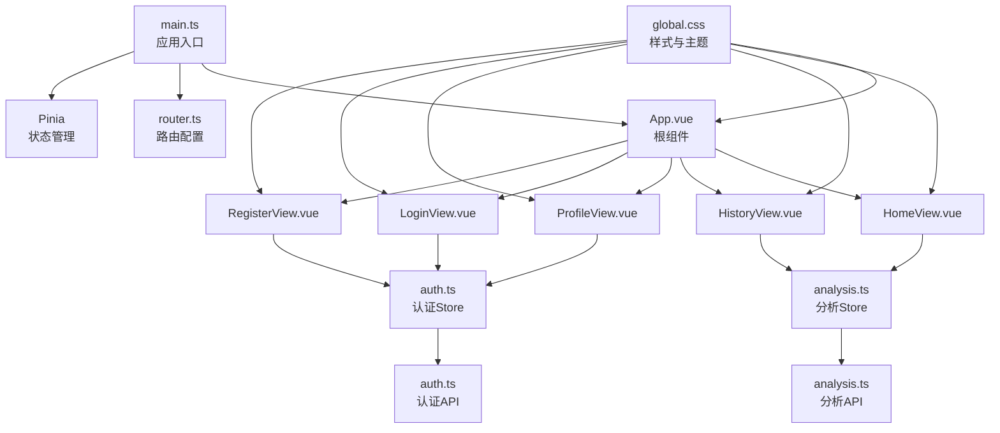
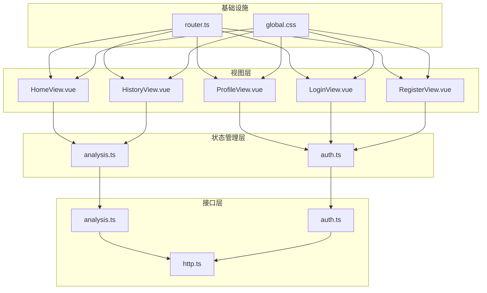
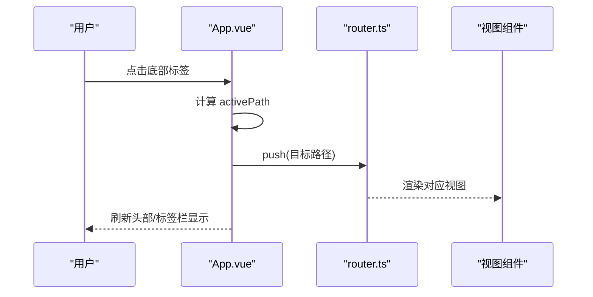
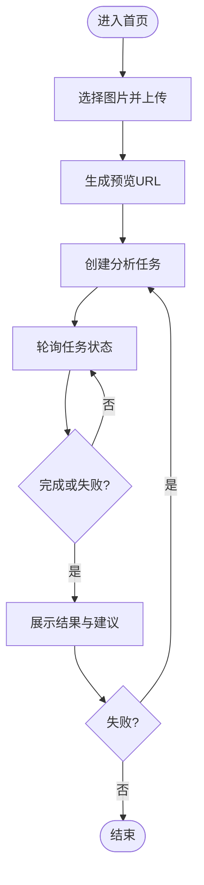
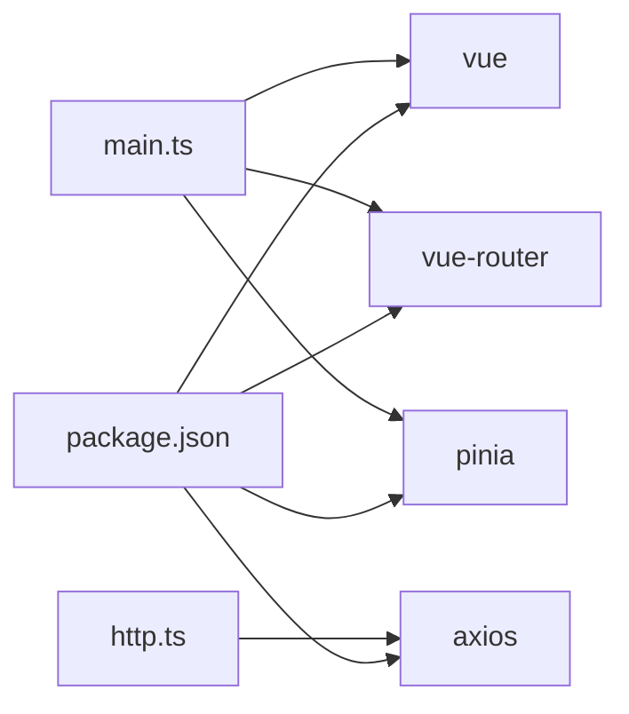

# 组件架构

<cite>
**本文引用的文件**
- [apps/web/src/App.vue](file://apps/web/src/App.vue)
- [apps/web/src/main.ts](file://apps/web/src/main.ts)
- [apps/web/src/router.ts](file://apps/web/src/router.ts)
- [apps/web/src/views/HomeView.vue](file://apps/web/src/views/HomeView.vue)
- [apps/web/src/views/HistoryView.vue](file://apps/web/src/views/HistoryView.vue)
- [apps/web/src/views/LoginView.vue](file://apps/web/src/views/LoginView.vue)
- [apps/web/src/views/ProfileView.vue](file://apps/web/src/views/ProfileView.vue)
- [apps/web/src/views/RegisterView.vue](file://apps/web/src/views/RegisterView.vue)
- [apps/web/src/stores/auth.ts](file://apps/web/src/stores/auth.ts)
- [apps/web/src/stores/analysis.ts](file://apps/web/src/stores/analysis.ts)
- [apps/web/src/api/auth.ts](file://apps/web/src/api/auth.ts)
- [apps/web/src/api/analysis.ts](file://apps/web/src/api/analysis.ts)
- [apps/web/src/styles/global.css](file://apps/web/src/styles/global.css)
- [apps/web/src/api/http.ts](file://apps/web/src/api/http.ts)
- [apps/web/package.json](file://apps/web/package.json)
- [apps/web/src/env.d.ts](file://apps/web/src/env.d.ts)
</cite>

## 目录
1. [简介](#简介)
2. [项目结构](#项目结构)
3. [核心组件](#核心组件)
4. [架构总览](#架构总览)
5. [组件详解](#组件详解)
6. [依赖关系分析](#依赖关系分析)
7. [性能与可维护性](#性能与可维护性)
8. [故障排查指南](#故障排查指南)
9. [结论](#结论)
10. [附录](#附录)

## 简介
本文件面向“AI摄影教练”前端应用，系统化梳理基于 Vue 3 的单文件组件（SFC）架构与组织方式，重点覆盖：
- 根组件 App.vue 的布局与路由集成
- 视图组件的职责划分与交互流程
- 状态管理（Pinia Store）与数据流
- 生命周期管理与响应式绑定机制
- 组件复用与扩展最佳实践
- 样式系统与主题定制方案

## 项目结构
前端位于 apps/web，采用 Vite + Vue 3 + TypeScript + Pinia + Vue Router 架构。核心目录与职责如下：
- src/main.ts：应用入口，挂载根组件，注册插件（Pinia、Router）
- src/App.vue：根组件，负责头部导航、主要内容区域、底部标签栏
- src/views：视图层，按页面拆分（首页、历史、登录、注册、个人中心）
- src/stores：状态管理，按领域拆分（认证、分析）
- src/api：接口层，封装 HTTP 客户端与业务 API
- src/styles：全局样式与主题变量
- src/router.ts：路由配置与导航守卫
- package.json：依赖与脚本

图表来源
- [apps/web/src/main.ts:1-14](file://apps/web/src/main.ts#L1-L14)
- [apps/web/src/App.vue:1-96](file://apps/web/src/App.vue#L1-L96)
- [apps/web/src/router.ts:1-30](file://apps/web/src/router.ts#L1-L30)
- [apps/web/src/stores/analysis.ts:1-142](file://apps/web/src/stores/analysis.ts#L1-L142)
- [apps/web/src/stores/auth.ts:1-41](file://apps/web/src/stores/auth.ts#L1-L41)
- [apps/web/src/api/analysis.ts:1-101](file://apps/web/src/api/analysis.ts#L1-L101)
- [apps/web/src/api/auth.ts:1-56](file://apps/web/src/api/auth.ts#L1-L56)
- [apps/web/src/styles/global.css:1-303](file://apps/web/src/styles/global.css#L1-L303)

章节来源
- [apps/web/src/main.ts:1-14](file://apps/web/src/main.ts#L1-L14)
- [apps/web/src/router.ts:1-30](file://apps/web/src/router.ts#L1-L30)
- [apps/web/package.json:1-26](file://apps/web/package.json#L1-L26)

## 核心组件
- 根组件 App.vue：统一布局容器，包含头部标题与用户信息、主要内容区域（RouterView）、底部标签栏；通过 Pinia 认证 Store 控制显示逻辑与登出行为
- 视图组件：
  - 首页 HomeView.vue：图片上传、分析任务创建、轮询任务状态、展示 AI 点评与建议
  - 历史 HistoryView.vue：加载并展示历史任务列表
  - 登录 LoginView.vue：邮箱+密码登录，错误提示，跳转首页
  - 注册 RegisterView.vue：邮箱+密码+昵称注册，自动登录并跳转首页
  - 个人 ProfileView.vue：展示与编辑用户资料、修改密码
- 状态管理：
  - 认证 Store（auth.ts）：令牌持久化、用户信息、鉴权状态
  - 分析 Store（analysis.ts）：图片上传、任务创建、轮询、历史加载、重试
- 接口层：
  - HTTP 客户端（http.ts）：基础配置、请求/响应拦截、Token 注入与刷新
  - 认证 API（auth.ts）：注册、登录、刷新、登出、获取/更新资料
  - 分析 API（analysis.ts）：创建任务、查询详情、历史、重试

章节来源
- [apps/web/src/App.vue:1-96](file://apps/web/src/App.vue#L1-L96)
- [apps/web/src/views/HomeView.vue:1-111](file://apps/web/src/views/HomeView.vue#L1-L111)
- [apps/web/src/views/HistoryView.vue:1-42](file://apps/web/src/views/HistoryView.vue#L1-L42)
- [apps/web/src/views/LoginView.vue:1-127](file://apps/web/src/views/LoginView.vue#L1-L127)
- [apps/web/src/views/RegisterView.vue:1-160](file://apps/web/src/views/RegisterView.vue#L1-L160)
- [apps/web/src/views/ProfileView.vue:1-243](file://apps/web/src/views/ProfileView.vue#L1-L243)
- [apps/web/src/stores/auth.ts:1-41](file://apps/web/src/stores/auth.ts#L1-L41)
- [apps/web/src/stores/analysis.ts:1-142](file://apps/web/src/stores/analysis.ts#L1-L142)
- [apps/web/src/api/http.ts:1-94](file://apps/web/src/api/http.ts#L1-L94)
- [apps/web/src/api/auth.ts:1-56](file://apps/web/src/api/auth.ts#L1-L56)
- [apps/web/src/api/analysis.ts:1-101](file://apps/web/src/api/analysis.ts#L1-L101)

## 架构总览
整体采用“根组件 + 视图组件 + 状态管理 + 接口层”的分层架构，数据自上而下流动，事件自下而上冒泡。

图表来源
- [apps/web/src/views/HomeView.vue:1-111](file://apps/web/src/views/HomeView.vue#L1-L111)
- [apps/web/src/views/HistoryView.vue:1-42](file://apps/web/src/views/HistoryView.vue#L1-L42)
- [apps/web/src/views/ProfileView.vue:1-243](file://apps/web/src/views/ProfileView.vue#L1-L243)
- [apps/web/src/views/LoginView.vue:1-127](file://apps/web/src/views/LoginView.vue#L1-L127)
- [apps/web/src/views/RegisterView.vue:1-160](file://apps/web/src/views/RegisterView.vue#L1-L160)
- [apps/web/src/stores/analysis.ts:1-142](file://apps/web/src/stores/analysis.ts#L1-L142)
- [apps/web/src/stores/auth.ts:1-41](file://apps/web/src/stores/auth.ts#L1-L41)
- [apps/web/src/api/analysis.ts:1-101](file://apps/web/src/api/analysis.ts#L1-L101)
- [apps/web/src/api/auth.ts:1-56](file://apps/web/src/api/auth.ts#L1-L56)
- [apps/web/src/api/http.ts:1-94](file://apps/web/src/api/http.ts#L1-L94)
- [apps/web/src/router.ts:1-30](file://apps/web/src/router.ts#L1-L30)
- [apps/web/src/styles/global.css:1-303](file://apps/web/src/styles/global.css#L1-L303)

## 组件详解

### 根组件 App.vue
- 职责
  - 统一布局：头部标题与用户信息、主要内容区域（RouterView）、底部标签栏
  - 导航控制：根据路由路径高亮标签项，点击切换路由
  - 认证联动：显示当前用户昵称/邮箱，登出时清理认证状态并跳转登录
- 关键点
  - 使用计算属性 activePath 与路由 path 对齐，实现底部标签激活态
  - 使用计算属性 displayName 组合昵称或邮箱，避免空值问题
  - 底部标签栏仅在已认证状态下显示
- 数据流
  - 输入：路由对象、认证 Store
  - 输出：渲染头部、主内容、标签栏；触发路由跳转与登出

图表来源
- [apps/web/src/App.vue:10-32](file://apps/web/src/App.vue#L10-L32)
- [apps/web/src/router.ts:10-19](file://apps/web/src/router.ts#L10-L19)

章节来源
- [apps/web/src/App.vue:1-96](file://apps/web/src/App.vue#L1-L96)

### 视图组件：首页 HomeView.vue
- 职责
  - 图片上传与预览
  - 创建分析任务并轮询状态
  - 展示 AI 总结与建议
  - 失败时支持重试
- 关键点
  - 通过分析 Store 管理 imagePreviewUrl、taskStatus、taskDetail、loading、error、isPolling
  - 生命周期：组件卸载时停止轮询，避免内存泄漏
  - 状态映射：statusText/statusClass 将枚举状态映射为文案与样式类
- 数据流
  - 输入：分析 Store 的响应式状态
  - 输出：渲染上传面板、任务面板、点评面板；触发上传、创建任务、重试

图表来源
- [apps/web/src/views/HomeView.vue:12-48](file://apps/web/src/views/HomeView.vue#L12-L48)
- [apps/web/src/stores/analysis.ts:76-94](file://apps/web/src/stores/analysis.ts#L76-L94)

章节来源
- [apps/web/src/views/HomeView.vue:1-111](file://apps/web/src/views/HomeView.vue#L1-L111)
- [apps/web/src/stores/analysis.ts:1-142](file://apps/web/src/stores/analysis.ts#L1-L142)

### 视图组件：历史 HistoryView.vue
- 职责
  - 首次进入时拉取历史记录
  - 展示任务状态与时间
- 关键点
  - 使用 onMounted 生命周期触发 fetchHistory
  - 无历史时展示空状态文案

章节来源
- [apps/web/src/views/HistoryView.vue:1-42](file://apps/web/src/views/HistoryView.vue#L1-L42)
- [apps/web/src/stores/analysis.ts:96-104](file://apps/web/src/stores/analysis.ts#L96-L104)

### 视图组件：登录 LoginView.vue
- 职责
  - 表单校验（邮箱/密码非空）
  - 调用登录 API，写入令牌，拉取用户资料，跳转首页
  - 错误处理与提交态控制
- 关键点
  - 使用 auth Store 写入令牌与用户信息
  - 导航守卫确保未登录用户无法访问受保护路由

章节来源
- [apps/web/src/views/LoginView.vue:1-127](file://apps/web/src/views/LoginView.vue#L1-L127)
- [apps/web/src/router.ts:21-30](file://apps/web/src/router.ts#L21-L30)
- [apps/web/src/api/auth.ts:29-43](file://apps/web/src/api/auth.ts#L29-L43)
- [apps/web/src/stores/auth.ts:12-25](file://apps/web/src/stores/auth.ts#L12-L25)

### 视图组件：注册 RegisterView.vue
- 职责
  - 表单校验（密码长度、两次密码一致）
  - 注册成功后自动登录并跳转首页
- 关键点
  - 可选昵称参数传递给后端
  - 错误码分支提示（重复邮箱、非法参数）

章节来源
- [apps/web/src/views/RegisterView.vue:1-160](file://apps/web/src/views/RegisterView.vue#L1-L160)
- [apps/web/src/api/auth.ts:29-31](file://apps/web/src/api/auth.ts#L29-L31)
- [apps/web/src/stores/auth.ts:12-25](file://apps/web/src/stores/auth.ts#L12-L25)

### 视图组件：个人 ProfileView.vue
- 职责
  - 展示用户资料（邮箱、昵称、头像、验证状态）
  - 编辑昵称与头像 URL 并更新
  - 修改密码（当前密码、新密码、确认新密码）
- 关键点
  - 加载与更新均调用后端 API，并同步到 auth Store
  - 密码修改前进行字段完整性与一致性校验

章节来源
- [apps/web/src/views/ProfileView.vue:1-243](file://apps/web/src/views/ProfileView.vue#L1-L243)
- [apps/web/src/api/auth.ts:45-55](file://apps/web/src/api/auth.ts#L45-L55)
- [apps/web/src/stores/auth.ts:27-29](file://apps/web/src/stores/auth.ts#L27-L29)

### 状态管理：认证 Store（auth.ts）
- 职责
  - 维护 access_token、refresh_token、currentUser
  - 提供 isAuthenticated 计算属性
  - 持久化到 localStorage，登出时清理
- 关键点
  - setTokens/clearAuth 与本地存储保持一致
  - setUser 同步当前用户信息

章节来源
- [apps/web/src/stores/auth.ts:1-41](file://apps/web/src/stores/auth.ts#L1-L41)

### 状态管理：分析 Store（analysis.ts）
- 职责
  - 管理图片上传、任务创建、轮询、历史、重试
  - 提供 loading/error/isPolling 等状态
- 关键点
  - 轮询间隔常量与 sleep 辅助函数
  - stopPolling 在组件卸载时调用，防止后台轮询
  - retryCurrentTask 支持失败重试

章节来源
- [apps/web/src/stores/analysis.ts:1-142](file://apps/web/src/stores/analysis.ts#L1-L142)

### 接口层：HTTP 客户端（http.ts）
- 职责
  - 统一 baseURL、超时
  - 请求拦截：自动注入 Bearer Token
  - 响应拦截：401/403 自动刷新，失败队列与重试
- 关键点
  - 使用独立 axios 实例刷新 Token，避免拦截器循环
  - 刷新失败时清理本地存储并跳转登录

章节来源
- [apps/web/src/api/http.ts:1-94](file://apps/web/src/api/http.ts#L1-L94)

### 接口层：认证 API（auth.ts）
- 职责
  - 注册、登录、刷新、登出、获取/更新资料、修改密码
- 关键点
  - 返回类型与参数类型明确，便于调用方约束

章节来源
- [apps/web/src/api/auth.ts:1-56](file://apps/web/src/api/auth.ts#L1-L56)

### 接口层：分析 API（analysis.ts）
- 职责
  - 创建任务、查询任务详情、获取历史、重试任务
- 关键点
  - 类型定义清晰，涵盖任务状态、建议、标注、编辑动作等

章节来源
- [apps/web/src/api/analysis.ts:1-101](file://apps/web/src/api/analysis.ts#L1-L101)

### 样式系统与主题定制（global.css）
- 主题变量
  - 背景色、表面色、文本色、主色/强调色/危险色、成功色、待定色
  - 圆角半径、阴影
- 布局与组件
  - .app-shell、.app-header、.app-main、.view、.panel
  - 按钮、状态标签、预览图、历史列表、底部标签栏
- 关键点
  - 大量使用 CSS 变量，便于主题切换
  - 底部标签栏固定定位，适配安全区域

章节来源
- [apps/web/src/styles/global.css:1-303](file://apps/web/src/styles/global.css#L1-L303)

## 依赖关系分析
- 运行时依赖
  - vue、vue-router、pinia、axios
- 开发依赖
  - vite、vue-tsc、typescript、@vitejs/plugin-vue
- 入口与插件
  - main.ts 中 createApp(App) → app.use(Pinia, Router) → mount
- 路由守卫
  - requiresAuth/guest 元信息控制访问权限

图表来源
- [apps/web/package.json:1-26](file://apps/web/package.json#L1-L26)
- [apps/web/src/main.ts:1-14](file://apps/web/src/main.ts#L1-L14)
- [apps/web/src/api/http.ts:1-94](file://apps/web/src/api/http.ts#L1-L94)

章节来源
- [apps/web/package.json:1-26](file://apps/web/package.json#L1-L26)
- [apps/web/src/main.ts:1-14](file://apps/web/src/main.ts#L1-L14)
- [apps/web/src/router.ts:21-30](file://apps/web/src/router.ts#L21-L30)

## 性能与可维护性
- 性能
  - 首页轮询采用固定间隔，组件卸载时停止轮询，避免资源浪费
  - 图片预览使用 URL.createObjectURL，及时在卸载时 revoke
  - 按需渲染：未登录隐藏底部标签栏，减少 DOM
- 可维护性
  - 视图组件职责单一，通过 Store 解耦数据与 UI
  - API 层集中处理 Token 注入与刷新，降低重复代码
  - 样式变量集中定义，便于主题定制与一致性
- 扩展建议
  - 将通用 UI 片段（如按钮、表单、状态标签）抽取为可复用组件
  - 将轮询策略抽象为 Hook，统一管理
  - 引入错误边界或全局错误提示组件，提升用户体验

## 故障排查指南
- 登录/注册失败
  - 检查邮箱/密码格式与长度，关注 401/400/409 等状态码提示
  - 确认网络请求是否携带 Authorization（localStorage 是否存在 access_token）
- 任务分析无结果
  - 确认已上传图片且 imageId 存在
  - 查看 isPolling 与 taskStatus，必要时重试
  - 检查后端返回的任务状态与错误信息
- 历史为空
  - 首次进入会自动拉取，若仍为空，检查网络与权限
- Token 刷新异常
  - 若出现 401/403，确认 refresh_token 是否存在
  - 检查刷新队列是否阻塞，以及 localStorage 是否被意外清空

章节来源
- [apps/web/src/views/LoginView.vue:36-46](file://apps/web/src/views/LoginView.vue#L36-L46)
- [apps/web/src/views/RegisterView.vue:55-67](file://apps/web/src/views/RegisterView.vue#L55-L67)
- [apps/web/src/stores/analysis.ts:34-53](file://apps/web/src/stores/analysis.ts#L34-L53)
- [apps/web/src/api/http.ts:37-91](file://apps/web/src/api/http.ts#L37-L91)

## 结论
本项目以 App.vue 为核心容器，结合视图组件与 Pinia Store，形成清晰的数据流与职责边界；通过全局样式与主题变量实现一致的视觉体验；借助路由守卫与 HTTP 拦截保障安全性与可用性。整体架构具备良好的可读性、可维护性与扩展性，适合进一步沉淀通用组件与完善错误处理体系。

## 附录
- 类型声明
  - env.d.ts 为 .vue 模块提供类型支持
- 最佳实践清单
  - 组件内尽量只做 UI 与事件处理，数据与副作用放入 Store 或 API 层
  - 使用 computed/computed 组合响应式状态，避免直接修改响应式对象
  - 在 onUnmounted 中清理定时器、轮询与订阅
  - 为关键交互添加禁用态与加载态，提升可用性
  - 使用 CSS 变量统一风格，避免硬编码颜色与尺寸

章节来源
- [apps/web/src/env.d.ts:1-9](file://apps/web/src/env.d.ts#L1-L9)