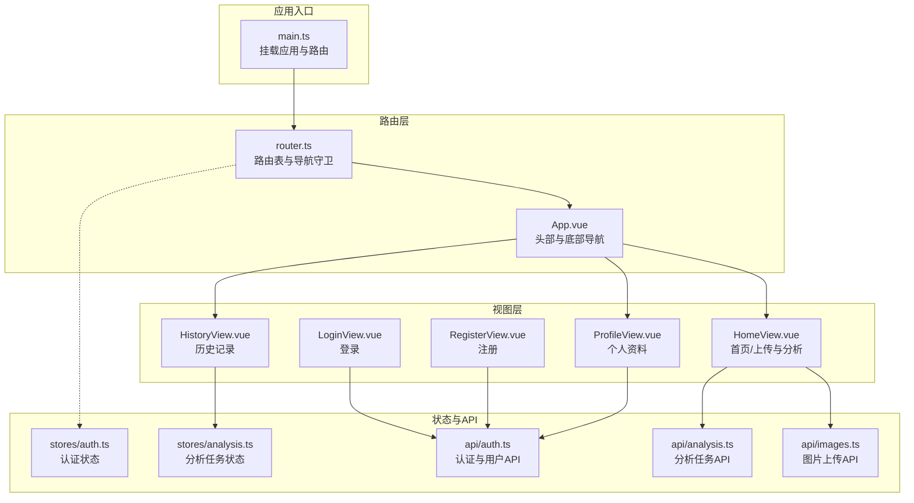
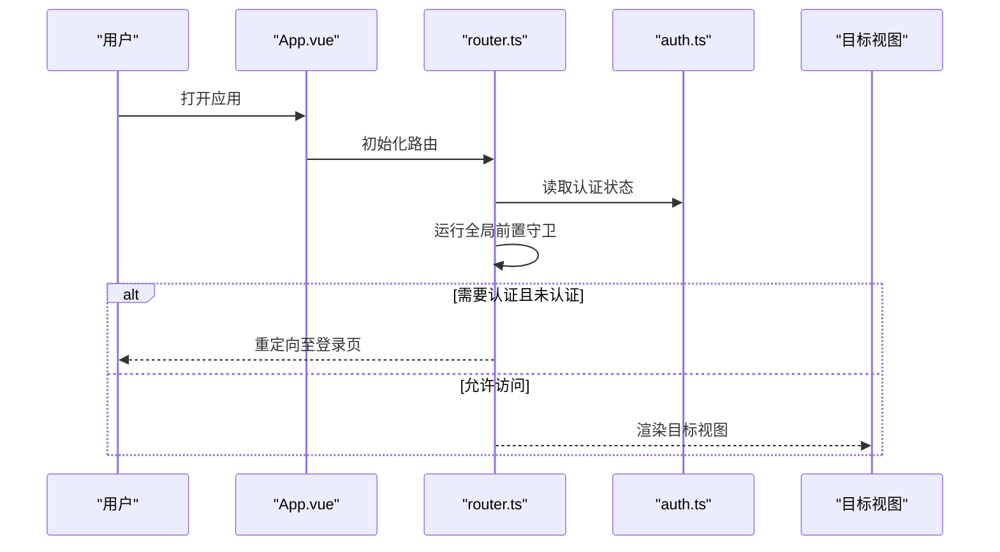
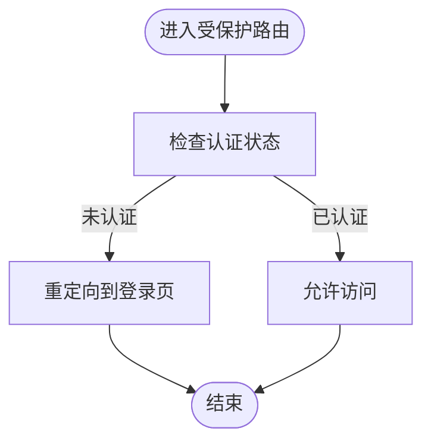
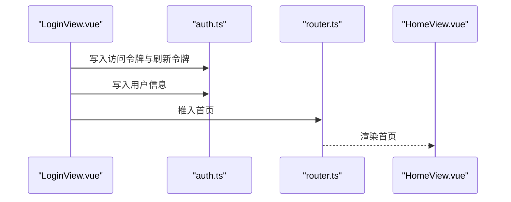
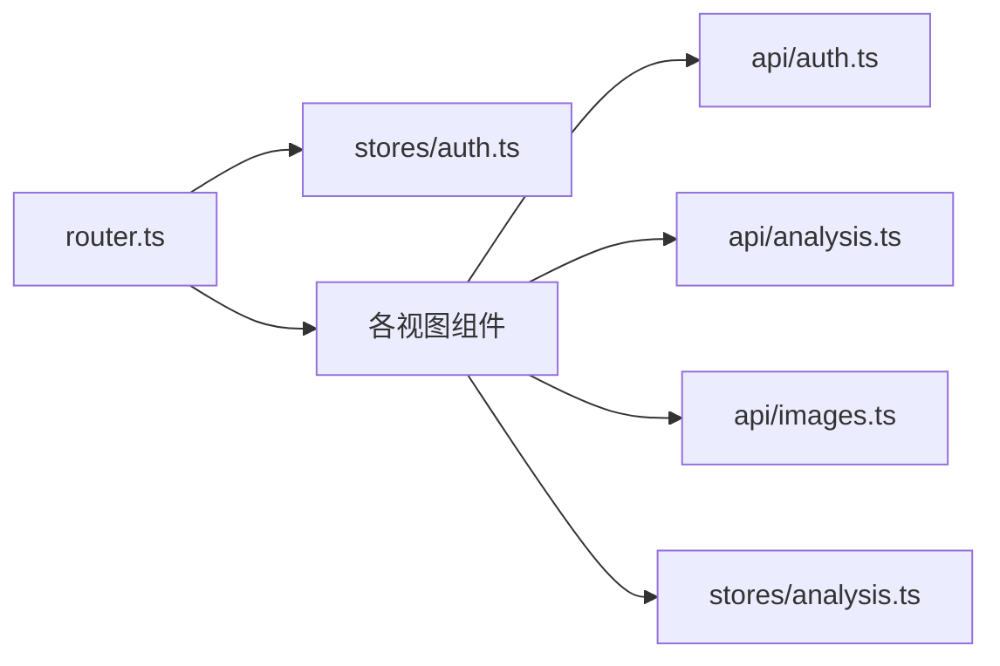

# 路由系统

<cite>
**本文引用的文件**
- [apps/web/src/router.ts](file://apps/web/src/router.ts)
- [apps/web/src/main.ts](file://apps/web/src/main.ts)
- [apps/web/src/App.vue](file://apps/web/src/App.vue)
- [apps/web/src/views/HomeView.vue](file://apps/web/src/views/HomeView.vue)
- [apps/web/src/views/HistoryView.vue](file://apps/web/src/views/HistoryView.vue)
- [apps/web/src/views/LoginView.vue](file://apps/web/src/views/LoginView.vue)
- [apps/web/src/views/RegisterView.vue](file://apps/web/src/views/RegisterView.vue)
- [apps/web/src/views/ProfileView.vue](file://apps/web/src/views/ProfileView.vue)
- [apps/web/src/stores/auth.ts](file://apps/web/src/stores/auth.ts)
- [apps/web/src/stores/analysis.ts](file://apps/web/src/stores/analysis.ts)
- [apps/web/src/api/auth.ts](file://apps/web/src/api/auth.ts)
- [apps/web/src/api/analysis.ts](file://apps/web/src/api/analysis.ts)
- [apps/web/src/api/images.ts](file://apps/web/src/api/images.ts)
- [apps/web/package.json](file://apps/web/package.json)
- [apps/web/vite.config.ts](file://apps/web/vite.config.ts)
</cite>

## 目录
1. [简介](#简介)
2. [项目结构](#项目结构)
3. [核心组件](#核心组件)
4. [架构总览](#架构总览)
5. [详细组件分析](#详细组件分析)
6. [依赖关系分析](#依赖关系分析)
7. [性能考虑](#性能考虑)
8. [故障排查指南](#故障排查指南)
9. [结论](#结论)
10. [附录](#附录)

## 简介
本文件面向“AI摄影教练”前端的Vue Router路由系统，系统性梳理路由表定义、导航守卫、认证保护、参数与查询处理、懒加载与代码分割、以及路由历史管理与前进后退等实现要点。文档同时给出关键流程的时序与类图，帮助开发者快速理解并扩展路由能力。

## 项目结构
前端应用采用单页应用（SPA）架构，基于 Vue 3 + Vue Router 4 + Pinia 状态管理，通过路由控制页面切换与权限校验，配合 API 层完成用户认证与分析任务管理。

图表来源
- [apps/web/src/main.ts:1-14](file://apps/web/src/main.ts#L1-L14)
- [apps/web/src/router.ts:1-30](file://apps/web/src/router.ts#L1-L30)
- [apps/web/src/App.vue:1-96](file://apps/web/src/App.vue#L1-L96)
- [apps/web/src/views/HomeView.vue:1-111](file://apps/web/src/views/HomeView.vue#L1-L111)
- [apps/web/src/views/HistoryView.vue:1-42](file://apps/web/src/views/HistoryView.vue#L1-L42)
- [apps/web/src/views/LoginView.vue:1-127](file://apps/web/src/views/LoginView.vue#L1-L127)
- [apps/web/src/views/RegisterView.vue:1-160](file://apps/web/src/views/RegisterView.vue#L1-L160)
- [apps/web/src/views/ProfileView.vue:1-243](file://apps/web/src/views/ProfileView.vue#L1-L243)
- [apps/web/src/stores/auth.ts:1-41](file://apps/web/src/stores/auth.ts#L1-L41)
- [apps/web/src/stores/analysis.ts:1-142](file://apps/web/src/stores/analysis.ts#L1-L142)
- [apps/web/src/api/auth.ts:1-56](file://apps/web/src/api/auth.ts#L1-L56)
- [apps/web/src/api/analysis.ts:1-101](file://apps/web/src/api/analysis.ts#L1-L101)
- [apps/web/src/api/images.ts:1-22](file://apps/web/src/api/images.ts#L1-L22)

章节来源
- [apps/web/src/main.ts:1-14](file://apps/web/src/main.ts#L1-L14)
- [apps/web/src/router.ts:1-30](file://apps/web/src/router.ts#L1-L30)

## 核心组件
- 路由器与路由表：在路由模块中定义基础路径与元信息，使用历史模式。
- 导航守卫：全局前置守卫根据元信息与认证状态进行跳转控制。
- 视图组件：分别承载首页、历史、登录、注册、个人中心等页面。
- 认证状态：Pinia Store 维护访问令牌、刷新令牌与用户信息，并暴露认证态。
- 分析状态：Pinia Store 管理图片上传、任务创建、轮询与历史列表。
- API 层：封装认证、用户资料、图片上传与分析任务接口。

章节来源
- [apps/web/src/router.ts:10-30](file://apps/web/src/router.ts#L10-L30)
- [apps/web/src/stores/auth.ts:1-41](file://apps/web/src/stores/auth.ts#L1-L41)
- [apps/web/src/stores/analysis.ts:1-142](file://apps/web/src/stores/analysis.ts#L1-L142)
- [apps/web/src/api/auth.ts:1-56](file://apps/web/src/api/auth.ts#L1-L56)
- [apps/web/src/api/analysis.ts:1-101](file://apps/web/src/api/analysis.ts#L1-L101)
- [apps/web/src/api/images.ts:1-22](file://apps/web/src/api/images.ts#L1-L22)

## 架构总览
下图展示了从应用启动到路由守卫生效、再到视图渲染的整体流程。

图表来源
- [apps/web/src/main.ts:1-14](file://apps/web/src/main.ts#L1-L14)
- [apps/web/src/router.ts:21-30](file://apps/web/src/router.ts#L21-L30)
- [apps/web/src/stores/auth.ts:10](file://apps/web/src/stores/auth.ts#L10)

## 详细组件分析

### 路由表与导航守卫
- 路由表定义
  - 登录页与注册页：允许未认证用户访问，设置元信息为访客模式。
  - 首页、历史、个人中心：要求认证，设置元信息为需要认证。
- 导航守卫
  - 前置守卫读取目标路由元信息与认证状态：
    - 若目标路由标记需要认证且用户未认证，则重定向至登录页；
    - 若目标路由标记访客且用户已认证，则重定向至首页。
- 动态路由匹配
  - 当前路由表为静态路径，未使用动态段或通配符；如需扩展，可在路由表中增加动态参数占位符。
- 嵌套路由
  - 当前未使用嵌套路由；如需多级菜单或子页面，可在路由表中为父级路由配置 children 字段。

章节来源
- [apps/web/src/router.ts:12-19](file://apps/web/src/router.ts#L12-L19)
- [apps/web/src/router.ts:22-29](file://apps/web/src/router.ts#L22-L29)

### 认证状态与路由保护
- 认证状态来源
  - 访问令牌存在即视为已认证，令牌持久化于本地存储。
- 登录/注册后的跳转
  - 登录与注册成功后，调用路由推入首页，确保用户进入受保护区域。
- 登出行为
  - 清空认证状态并跳转至登录页，保证安全退出。

图表来源
- [apps/web/src/router.ts:24-26](file://apps/web/src/router.ts#L24-L26)
- [apps/web/src/stores/auth.ts:10](file://apps/web/src/stores/auth.ts#L10)

章节来源
- [apps/web/src/stores/auth.ts:10](file://apps/web/src/stores/auth.ts#L10)
- [apps/web/src/views/LoginView.vue:35](file://apps/web/src/views/LoginView.vue#L35)
- [apps/web/src/views/RegisterView.vue:54](file://apps/web/src/views/RegisterView.vue#L54)
- [apps/web/src/App.vue:29-32](file://apps/web/src/App.vue#L29-L32)

### 路由参数传递与查询字符串处理
- 路由参数
  - 当前路由表未使用动态段，未涉及路由参数传递。
- 查询字符串
  - 历史记录接口通过查询参数限制返回条数；在视图中直接调用 API 并传入参数。

章节来源
- [apps/web/src/api/analysis.ts:92-95](file://apps/web/src/api/analysis.ts#L92-L95)
- [apps/web/src/views/HistoryView.vue:14-16](file://apps/web/src/views/HistoryView.vue#L14-L16)

### 路由懒加载与代码分割
- 当前实现
  - 路由组件导入为同步导入，未启用路由级别的懒加载。
- 优化建议
  - 将视图组件改为动态导入，利用打包工具的代码分割能力，减少首屏体积。
  - 在大型应用中，可结合路由元信息与异步组件实现按需加载。

章节来源
- [apps/web/src/router.ts:4-8](file://apps/web/src/router.ts#L4-L8)
- [apps/web/package.json:11-23](file://apps/web/package.json#L11-L23)

### 路由历史管理与前进后退
- 前进后退
  - 应用未显式使用浏览器历史 API；导航主要通过路由实例进行页面跳转。
- 历史记录
  - 历史记录页面通过 API 拉取最近任务列表，用于展示而非路由历史栈管理。

章节来源
- [apps/web/src/App.vue:23-32](file://apps/web/src/App.vue#L23-L32)
- [apps/web/src/views/HistoryView.vue:14-16](file://apps/web/src/views/HistoryView.vue#L14-L16)

### 视图组件与路由交互
- 首页
  - 处理图片上传、创建分析任务、轮询任务状态与展示结果。
- 历史
  - 首次挂载时拉取历史数据，展示最近任务摘要。
- 登录/注册
  - 成功后写入令牌与用户信息并跳转首页。
- 个人中心
  - 加载与更新用户资料，支持修改密码。

图表来源
- [apps/web/src/views/LoginView.vue:24-35](file://apps/web/src/views/LoginView.vue#L24-L35)
- [apps/web/src/stores/auth.ts:12-29](file://apps/web/src/stores/auth.ts#L12-L29)
- [apps/web/src/router.ts:35](file://apps/web/src/router.ts#L35)

章节来源
- [apps/web/src/views/HomeView.vue:1-111](file://apps/web/src/views/HomeView.vue#L1-L111)
- [apps/web/src/views/HistoryView.vue:1-42](file://apps/web/src/views/HistoryView.vue#L1-L42)
- [apps/web/src/views/LoginView.vue:1-127](file://apps/web/src/views/LoginView.vue#L1-L127)
- [apps/web/src/views/RegisterView.vue:1-160](file://apps/web/src/views/RegisterView.vue#L1-L160)
- [apps/web/src/views/ProfileView.vue:1-243](file://apps/web/src/views/ProfileView.vue#L1-L243)

## 依赖关系分析
- 技术栈
  - Vue 3、Vue Router 4、Pinia、TypeScript、Vite。
- 关键依赖
  - 路由与状态管理紧密耦合：守卫依赖认证状态；视图依赖状态与 API。
- 可能的耦合点
  - 路由元信息与认证状态耦合；若未来引入更复杂的权限模型，应将元信息抽象为策略或守卫函数。

图表来源
- [apps/web/src/router.ts:1-30](file://apps/web/src/router.ts#L1-L30)
- [apps/web/src/stores/auth.ts:1-41](file://apps/web/src/stores/auth.ts#L1-L41)
- [apps/web/src/stores/analysis.ts:1-142](file://apps/web/src/stores/analysis.ts#L1-L142)
- [apps/web/src/api/auth.ts:1-56](file://apps/web/src/api/auth.ts#L1-L56)
- [apps/web/src/api/analysis.ts:1-101](file://apps/web/src/api/analysis.ts#L1-L101)
- [apps/web/src/api/images.ts:1-22](file://apps/web/src/api/images.ts#L1-L22)

章节来源
- [apps/web/src/router.ts:1-30](file://apps/web/src/router.ts#L1-L30)
- [apps/web/src/stores/auth.ts:1-41](file://apps/web/src/stores/auth.ts#L1-L41)
- [apps/web/src/stores/analysis.ts:1-142](file://apps/web/src/stores/analysis.ts#L1-L142)
- [apps/web/src/api/auth.ts:1-56](file://apps/web/src/api/auth.ts#L1-L56)
- [apps/web/src/api/analysis.ts:1-101](file://apps/web/src/api/analysis.ts#L1-L101)
- [apps/web/src/api/images.ts:1-22](file://apps/web/src/api/images.ts#L1-L22)

## 性能考虑
- 代码分割
  - 将视图组件改为异步导入，减少初始包体，提升首屏加载速度。
- 路由守卫逻辑
  - 守卫仅读取轻量状态，避免复杂计算；必要时可缓存认证状态。
- 图片与任务轮询
  - 轮询间隔与停止逻辑已在分析状态中实现，避免不必要的网络请求。

章节来源
- [apps/web/src/router.ts:4-8](file://apps/web/src/router.ts#L4-L8)
- [apps/web/src/stores/analysis.ts:76-94](file://apps/web/src/stores/analysis.ts#L76-L94)

## 故障排查指南
- 登录后仍被重定向到登录页
  - 检查认证状态是否正确写入与持久化；确认守卫逻辑与元信息一致。
- 注册成功但未跳转
  - 检查注册流程中的路由推入逻辑与异常分支。
- 历史记录为空
  - 检查历史接口参数与网络请求状态；确认分析任务已完成。
- 登出无效
  - 检查清空认证状态与路由跳转顺序。

章节来源
- [apps/web/src/router.ts:24-26](file://apps/web/src/router.ts#L24-L26)
- [apps/web/src/views/LoginView.vue:35](file://apps/web/src/views/LoginView.vue#L35)
- [apps/web/src/views/RegisterView.vue:54](file://apps/web/src/views/RegisterView.vue#L54)
- [apps/web/src/views/HistoryView.vue:14-16](file://apps/web/src/views/HistoryView.vue#L14-L16)
- [apps/web/src/App.vue:30-32](file://apps/web/src/App.vue#L30-L32)

## 结论
当前路由系统简洁清晰，通过少量路由与全局守卫实现了基础的认证保护。后续可在保持现有结构的前提下，引入路由懒加载、动态路由与嵌套路由，以进一步提升性能与可维护性。同时建议将权限策略抽象为可配置的守卫策略，便于扩展更细粒度的访问控制。

## 附录
- 开发与构建
  - 使用 Vite 提供开发服务器与代理配置，支持本地 API 代理。
- 依赖版本
  - Vue 3、Vue Router 4、Pinia、TypeScript、Axios 等。

章节来源
- [apps/web/vite.config.ts:1-26](file://apps/web/vite.config.ts#L1-L26)
- [apps/web/package.json:11-23](file://apps/web/package.json#L11-L23)