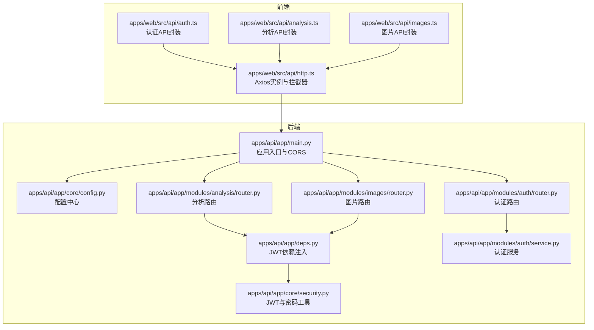
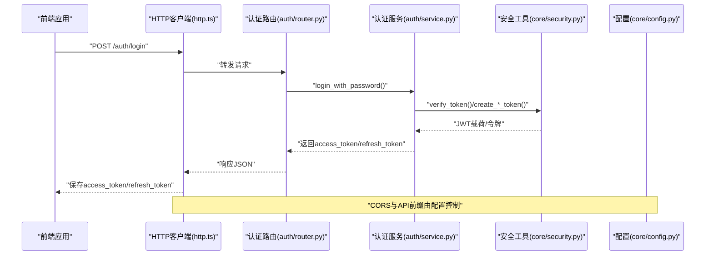
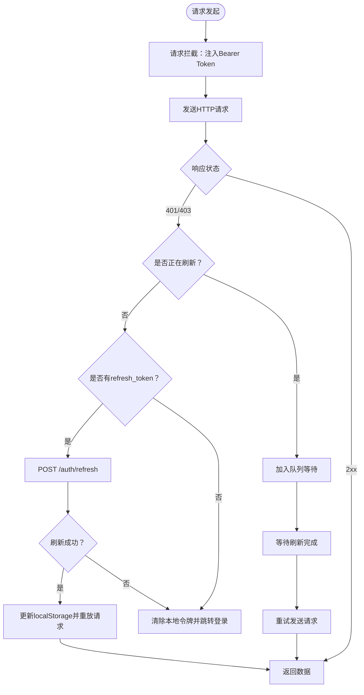
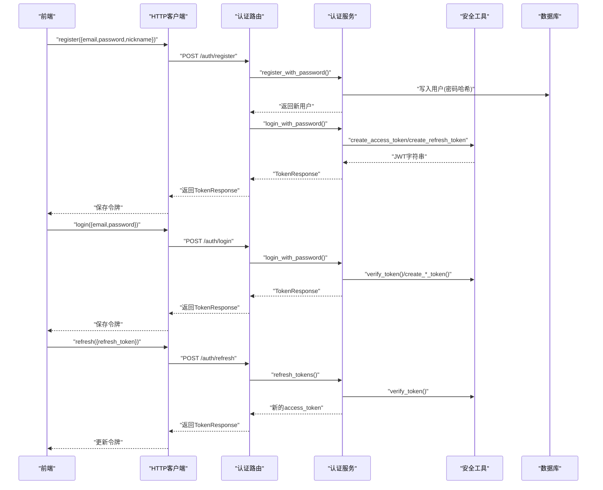
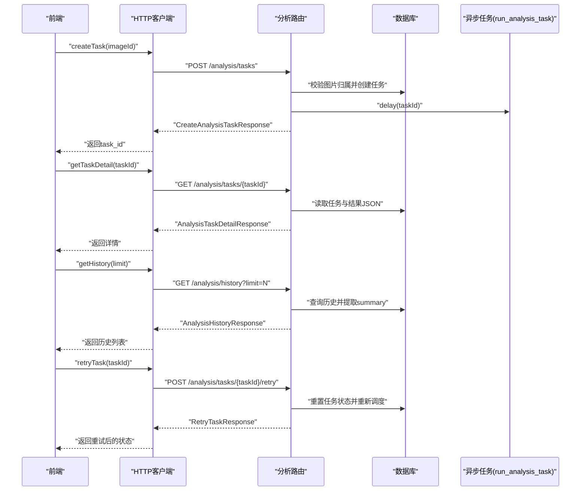
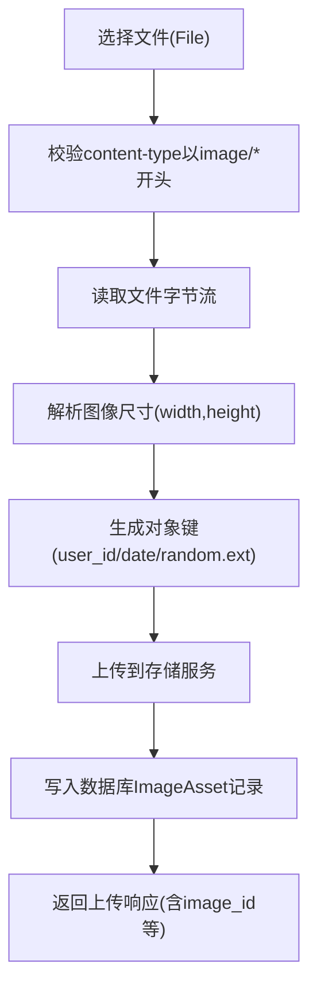
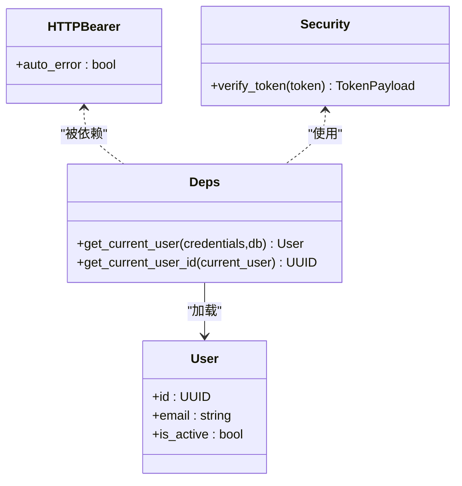
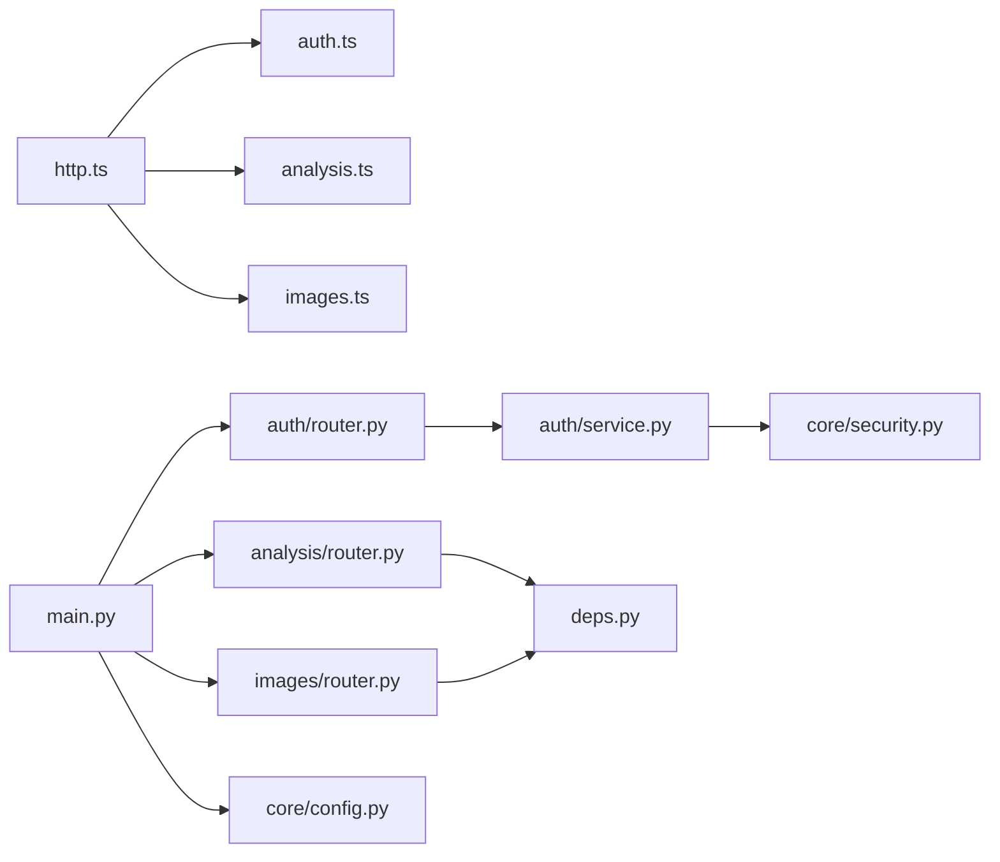

# API集成与HTTP客户端

<cite>
**本文引用的文件**
- [apps/web/src/api/http.ts](file://apps/web/src/api/http.ts)
- [apps/web/src/api/auth.ts](file://apps/web/src/api/auth.ts)
- [apps/web/src/api/analysis.ts](file://apps/web/src/api/analysis.ts)
- [apps/web/src/api/images.ts](file://apps/web/src/api/images.ts)
- [apps/api/app/main.py](file://apps/api/app/main.py)
- [apps/api/app/deps.py](file://apps/api/app/deps.py)
- [apps/api/app/core/config.py](file://apps/api/app/core/config.py)
- [apps/api/app/core/security.py](file://apps/api/app/core/security.py)
- [apps/api/app/modules/auth/router.py](file://apps/api/app/modules/auth/router.py)
- [apps/api/app/modules/auth/service.py](file://apps/api/app/modules/auth/service.py)
- [apps/api/app/modules/analysis/router.py](file://apps/api/app/modules/analysis/router.py)
- [apps/api/app/modules/images/router.py](file://apps/api/app/modules/images/router.py)
- [apps/api/app/schemas/auth.py](file://apps/api/app/schemas/auth.py)
- [apps/api/app/schemas/analysis.py](file://apps/api/app/schemas/analysis.py)
- [apps/api/app/schemas/image.py](file://apps/api/app/schemas/image.py)
</cite>

## 目录
1. [简介](#简介)
2. [项目结构](#项目结构)
3. [核心组件](#核心组件)
4. [架构总览](#架构总览)
5. [详细组件分析](#详细组件分析)
6. [依赖关系分析](#依赖关系分析)
7. [性能考虑](#性能考虑)
8. [故障排查指南](#故障排查指南)
9. [结论](#结论)
10. [附录](#附录)

## 简介
本文件面向前端与后端工程师，系统化梳理AI摄影教练项目的API集成与HTTP客户端设计，重点覆盖以下方面：
- HTTP客户端封装与请求/响应拦截器配置
- 认证API的实现（登录、注册、令牌刷新）
- 分析API的调用流程（任务创建、状态查询、历史与重试）
- 图片API的功能（上传）
- 错误处理策略与重试机制
- API版本管理与兼容性处理建议

## 项目结构
项目采用前后端分离架构，前端通过Axios封装的HTTP客户端调用后端FastAPI接口；后端通过模块化路由组织认证、分析与图片等业务域。

图表来源
- [apps/web/src/api/http.ts:1-94](file://apps/web/src/api/http.ts#L1-L94)
- [apps/web/src/api/auth.ts:1-56](file://apps/web/src/api/auth.ts#L1-L56)
- [apps/web/src/api/analysis.ts:1-101](file://apps/web/src/api/analysis.ts#L1-L101)
- [apps/web/src/api/images.ts:1-22](file://apps/web/src/api/images.ts#L1-L22)
- [apps/api/app/main.py:1-36](file://apps/api/app/main.py#L1-L36)
- [apps/api/app/deps.py:1-41](file://apps/api/app/deps.py#L1-L41)
- [apps/api/app/core/config.py:1-47](file://apps/api/app/core/config.py#L1-L47)
- [apps/api/app/core/security.py:1-72](file://apps/api/app/core/security.py#L1-L72)
- [apps/api/app/modules/auth/router.py:1-93](file://apps/api/app/modules/auth/router.py#L1-L93)
- [apps/api/app/modules/auth/service.py:1-145](file://apps/api/app/modules/auth/service.py#L1-L145)
- [apps/api/app/modules/analysis/router.py:1-151](file://apps/api/app/modules/analysis/router.py#L1-L151)
- [apps/api/app/modules/images/router.py:1-77](file://apps/api/app/modules/images/router.py#L1-L77)

章节来源
- [apps/api/app/main.py:1-36](file://apps/api/app/main.py#L1-L36)
- [apps/api/app/core/config.py:1-47](file://apps/api/app/core/config.py#L1-L47)

## 核心组件
- HTTP客户端封装与拦截器
  - 基础URL与超时设置
  - 请求拦截：自动注入Bearer Token
  - 响应拦截：401/403自动刷新令牌与重试
- 认证API
  - 注册、登录、刷新、登出、邮箱验证、忘记/重置密码
  - 服务层基于JWT与密码哈希
- 分析API
  - 创建分析任务、查询任务详情、获取历史、重试任务
- 图片API
  - 上传原图，返回图片资产信息
- 配置与安全
  - 统一配置中心（含API前缀、CORS、JWT参数）
  - JWT载荷校验与密码哈希

章节来源
- [apps/web/src/api/http.ts:1-94](file://apps/web/src/api/http.ts#L1-L94)
- [apps/api/app/core/config.py:1-47](file://apps/api/app/core/config.py#L1-L47)
- [apps/api/app/core/security.py:1-72](file://apps/api/app/core/security.py#L1-L72)
- [apps/api/app/modules/auth/router.py:1-93](file://apps/api/app/modules/auth/router.py#L1-L93)
- [apps/api/app/modules/auth/service.py:1-145](file://apps/api/app/modules/auth/service.py#L1-L145)
- [apps/api/app/modules/analysis/router.py:1-151](file://apps/api/app/modules/analysis/router.py#L1-L151)
- [apps/api/app/modules/images/router.py:1-77](file://apps/api/app/modules/images/router.py#L1-L77)

## 架构总览
下图展示从前端HTTP客户端到后端路由与服务层的整体交互路径，以及认证与依赖注入的关键节点。

图表来源
- [apps/web/src/api/http.ts:1-94](file://apps/web/src/api/http.ts#L1-L94)
- [apps/api/app/modules/auth/router.py:1-93](file://apps/api/app/modules/auth/router.py#L1-L93)
- [apps/api/app/modules/auth/service.py:1-145](file://apps/api/app/modules/auth/service.py#L1-L145)
- [apps/api/app/core/security.py:1-72](file://apps/api/app/core/security.py#L1-L72)
- [apps/api/app/core/config.py:1-47](file://apps/api/app/core/config.py#L1-L47)

## 详细组件分析

### HTTP客户端封装与拦截器
- 基础配置
  - baseURL来源于环境变量，未配置时默认“/api/v1”
  - 超时时间30秒
- 请求拦截
  - 从localStorage读取access_token并注入Authorization头
- 响应拦截
  - 处理401/403错误
  - 并发刷新去重：isRefreshing与failedQueue队列
  - 使用独立的axios实例调用“/auth/refresh”，避免循环触发拦截器
  - 成功后更新localStorage中的access_token（可选更新refresh_token），重放原始请求
  - 刷新失败或无refresh_token时清空本地令牌并跳转登录页

图表来源
- [apps/web/src/api/http.ts:1-94](file://apps/web/src/api/http.ts#L1-L94)

章节来源
- [apps/web/src/api/http.ts:1-94](file://apps/web/src/api/http.ts#L1-L94)

### 认证API实现
- 接口定义
  - 注册：邮箱、密码、昵称
  - 登录：邮箱、密码
  - 刷新：refresh_token
  - 登出：客户端清理令牌
  - 邮箱验证、重发验证、忘记密码、重置密码
- 后端实现要点
  - 路由层接收Schema并调用AuthService
  - 服务层执行业务逻辑（密码哈希、JWT签发/校验、用户状态检查）
  - 安全工具提供密码哈希/校验、JWT编码/解码与过期处理
- 数据模型
  - TokenResponse包含access_token、refresh_token与token_type
  - Register/Login/Refresh请求模型定义字段约束

图表来源
- [apps/web/src/api/auth.ts:1-56](file://apps/web/src/api/auth.ts#L1-L56)
- [apps/api/app/modules/auth/router.py:1-93](file://apps/api/app/modules/auth/router.py#L1-L93)
- [apps/api/app/modules/auth/service.py:1-145](file://apps/api/app/modules/auth/service.py#L1-L145)
- [apps/api/app/core/security.py:1-72](file://apps/api/app/core/security.py#L1-L72)
- [apps/api/app/schemas/auth.py:1-37](file://apps/api/app/schemas/auth.py#L1-L37)

章节来源
- [apps/web/src/api/auth.ts:1-56](file://apps/web/src/api/auth.ts#L1-L56)
- [apps/api/app/modules/auth/router.py:1-93](file://apps/api/app/modules/auth/router.py#L1-L93)
- [apps/api/app/modules/auth/service.py:1-145](file://apps/api/app/modules/auth/service.py#L1-L145)
- [apps/api/app/core/security.py:1-72](file://apps/api/app/core/security.py#L1-L72)
- [apps/api/app/schemas/auth.py:1-37](file://apps/api/app/schemas/auth.py#L1-L37)

### 分析API调用方式
- 功能清单
  - 创建任务：提交image_id，返回task_id与初始状态
  - 查询任务详情：按task_id返回任务元数据与最终结果JSON
  - 获取历史：分页查询当前用户的分析历史
  - 重试任务：仅允许FAILED/SUCCEEDED的任务在用户授权下重试
- 关键权限与校验
  - 任务与图片归属校验：必须为当前用户所有
  - 任务状态限制：RUNNING任务不可重试
- 数据模型
  - CreateAnalysisTaskResponse、AnalysisTaskDetailResponse、AnalysisHistoryResponse、RetryTaskResponse

图表来源
- [apps/web/src/api/analysis.ts:1-101](file://apps/web/src/api/analysis.ts#L1-L101)
- [apps/api/app/modules/analysis/router.py:1-151](file://apps/api/app/modules/analysis/router.py#L1-L151)
- [apps/api/app/schemas/analysis.py:1-52](file://apps/api/app/schemas/analysis.py#L1-L52)

章节来源
- [apps/web/src/api/analysis.ts:1-101](file://apps/web/src/api/analysis.ts#L1-L101)
- [apps/api/app/modules/analysis/router.py:1-151](file://apps/api/app/modules/analysis/router.py#L1-L151)
- [apps/api/app/schemas/analysis.py:1-52](file://apps/api/app/schemas/analysis.py#L1-L52)

### 图片API功能
- 上传原图
  - 校验文件类型为image/*
  - 读取文件内容并解析尺寸
  - 生成对象键（user_id/date/random.ext）
  - 上传至存储服务并写入数据库ImageAsset记录
  - 返回image_id、mime_type、size_bytes、width、height、object_key
- 权限与安全
  - 通过依赖注入获取当前用户ID并校验图片归属
  - 支持扩展：未来可增加缩略图、水印、EXIF处理等

图表来源
- [apps/web/src/api/images.ts:1-22](file://apps/web/src/api/images.ts#L1-L22)
- [apps/api/app/modules/images/router.py:1-77](file://apps/api/app/modules/images/router.py#L1-L77)
- [apps/api/app/schemas/image.py:1-14](file://apps/api/app/schemas/image.py#L1-L14)

章节来源
- [apps/web/src/api/images.ts:1-22](file://apps/web/src/api/images.ts#L1-L22)
- [apps/api/app/modules/images/router.py:1-77](file://apps/api/app/modules/images/router.py#L1-L77)
- [apps/api/app/schemas/image.py:1-14](file://apps/api/app/schemas/image.py#L1-L14)

### 认证中间件与依赖注入
- JWT Bearer认证
  - HTTPBearer自动从Authorization头提取凭据
  - 依赖函数get_current_user解析JWT并加载用户
  - 用户不存在或非活跃则拒绝访问
- 依赖链路
  - deps依赖security与数据库
  - 各业务路由依赖deps获取当前用户ID

图表来源
- [apps/api/app/deps.py:1-41](file://apps/api/app/deps.py#L1-L41)
- [apps/api/app/core/security.py:1-72](file://apps/api/app/core/security.py#L1-L72)

章节来源
- [apps/api/app/deps.py:1-41](file://apps/api/app/deps.py#L1-L41)
- [apps/api/app/core/security.py:1-72](file://apps/api/app/core/security.py#L1-L72)

## 依赖关系分析
- 前端依赖
  - http.ts为统一HTTP客户端，其他模块仅依赖该实例
  - auth.ts、analysis.ts、images.ts分别封装对应领域API
- 后端依赖
  - main.py集中注册路由与CORS
  - 各模块路由依赖deps进行认证校验
  - 认证服务依赖security与数据库
  - 配置中心提供API前缀、CORS、JWT参数

图表来源
- [apps/web/src/api/http.ts:1-94](file://apps/web/src/api/http.ts#L1-L94)
- [apps/web/src/api/auth.ts:1-56](file://apps/web/src/api/auth.ts#L1-L56)
- [apps/web/src/api/analysis.ts:1-101](file://apps/web/src/api/analysis.ts#L1-L101)
- [apps/web/src/api/images.ts:1-22](file://apps/web/src/api/images.ts#L1-L22)
- [apps/api/app/main.py:1-36](file://apps/api/app/main.py#L1-L36)
- [apps/api/app/modules/auth/router.py:1-93](file://apps/api/app/modules/auth/router.py#L1-L93)
- [apps/api/app/modules/analysis/router.py:1-151](file://apps/api/app/modules/analysis/router.py#L1-L151)
- [apps/api/app/modules/images/router.py:1-77](file://apps/api/app/modules/images/router.py#L1-L77)
- [apps/api/app/modules/auth/service.py:1-145](file://apps/api/app/modules/auth/service.py#L1-L145)
- [apps/api/app/deps.py:1-41](file://apps/api/app/deps.py#L1-L41)
- [apps/api/app/core/security.py:1-72](file://apps/api/app/core/security.py#L1-L72)
- [apps/api/app/core/config.py:1-47](file://apps/api/app/core/config.py#L1-L47)

章节来源
- [apps/api/app/main.py:1-36](file://apps/api/app/main.py#L1-L36)
- [apps/api/app/deps.py:1-41](file://apps/api/app/deps.py#L1-L41)
- [apps/api/app/core/config.py:1-47](file://apps/api/app/core/config.py#L1-L47)

## 性能考虑
- HTTP客户端
  - 合理设置超时，避免长时间阻塞
  - 401自动刷新减少重复登录开销
- 后端
  - 分析任务异步执行，避免阻塞请求线程
  - 数据库查询限制（历史limit）防止过度扫描
- 存储
  - 上传时计算SHA256可用于去重或完整性校验
  - 对象键按日期分桶，便于归档与清理

## 故障排查指南
- 常见错误与处理
  - 401/403：检查本地access_token是否过期；确认刷新流程是否成功；查看failedQueue是否正确处理并发刷新
  - 401（认证失败）：核对Authorization头是否正确注入；确认JWT密钥与算法配置一致
  - 403（权限不足）：确认任务/图片归属校验是否通过
  - 404（资源不存在）：确认task_id或image_id有效
  - 400（参数/文件非法）：检查文件类型、大小与内容
- 日志与调试
  - 认证服务在开发模式下输出邮箱验证与重置密码令牌（用于调试）
  - 建议在HTTP拦截器中增加错误日志与重试次数统计

章节来源
- [apps/web/src/api/http.ts:1-94](file://apps/web/src/api/http.ts#L1-L94)
- [apps/api/app/modules/auth/service.py:1-145](file://apps/api/app/modules/auth/service.py#L1-L145)
- [apps/api/app/modules/analysis/router.py:1-151](file://apps/api/app/modules/analysis/router.py#L1-L151)
- [apps/api/app/modules/images/router.py:1-77](file://apps/api/app/modules/images/router.py#L1-L77)

## 结论
本项目通过统一的HTTP客户端与完善的认证/分析/图片API，实现了清晰的前后端职责划分。前端拦截器提供了健壮的令牌刷新与重试机制，后端通过依赖注入与服务层确保了认证与业务逻辑的可维护性。建议在生产环境中进一步完善：
- 引入API版本号与兼容性策略
- 增强错误码与国际化消息
- 加强速率限制与安全审计

## 附录

### API版本管理与兼容性建议
- 版本策略
  - 在配置中心定义api_prefix，如“/api/v1”、“/api/v2”，迁移时保留旧版本一段时间
- 兼容性处理
  - 路由层对新增字段做向后兼容解析
  - 服务层对历史数据做默认值填充
  - 文档与变更记录同步发布

章节来源
- [apps/api/app/core/config.py:1-47](file://apps/api/app/core/config.py#L1-L47)
- [apps/api/app/main.py:1-36](file://apps/api/app/main.py#L1-L36)