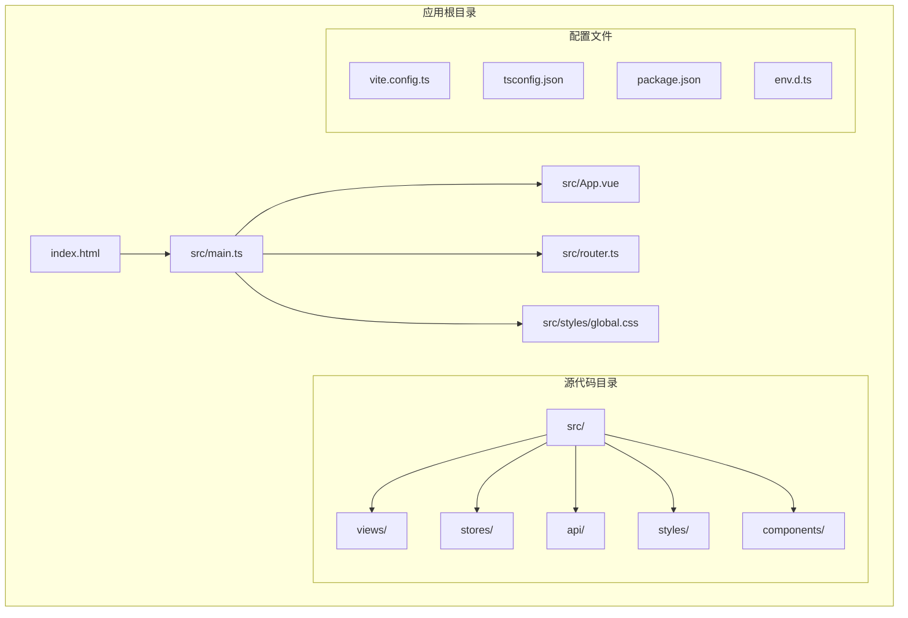
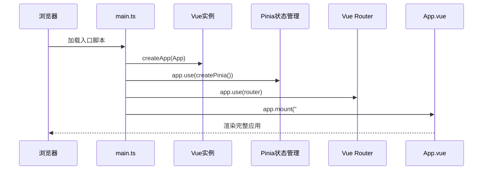
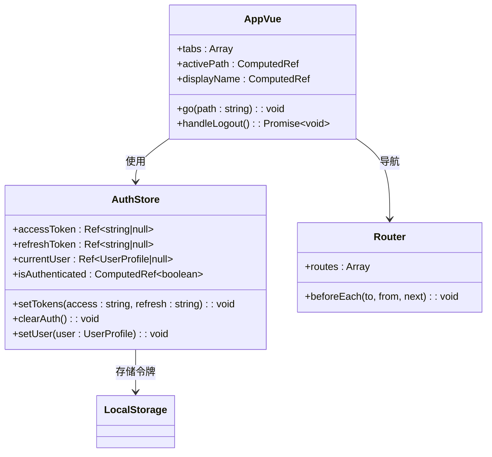
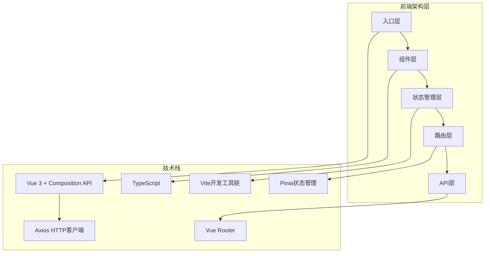
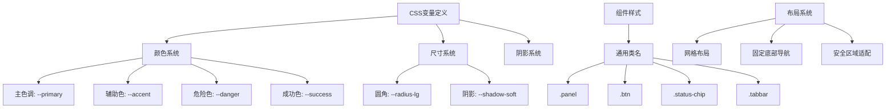
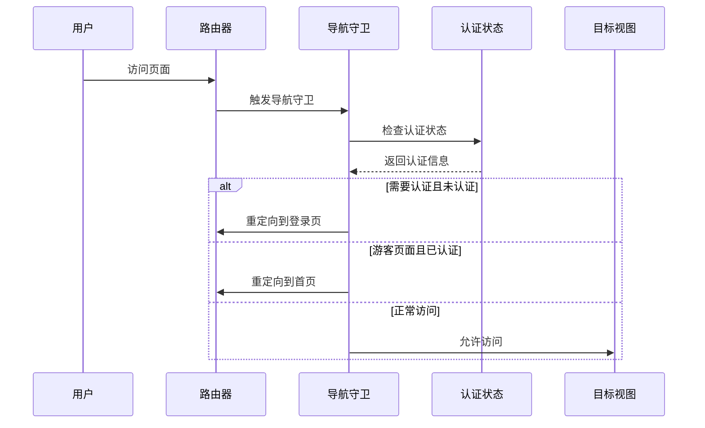
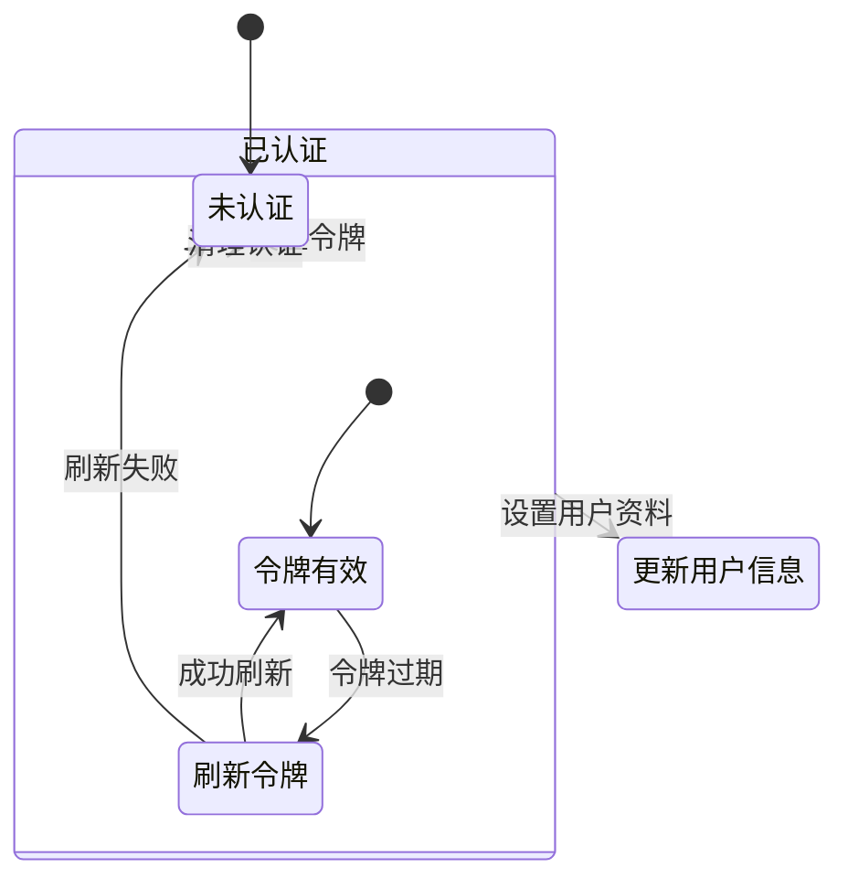
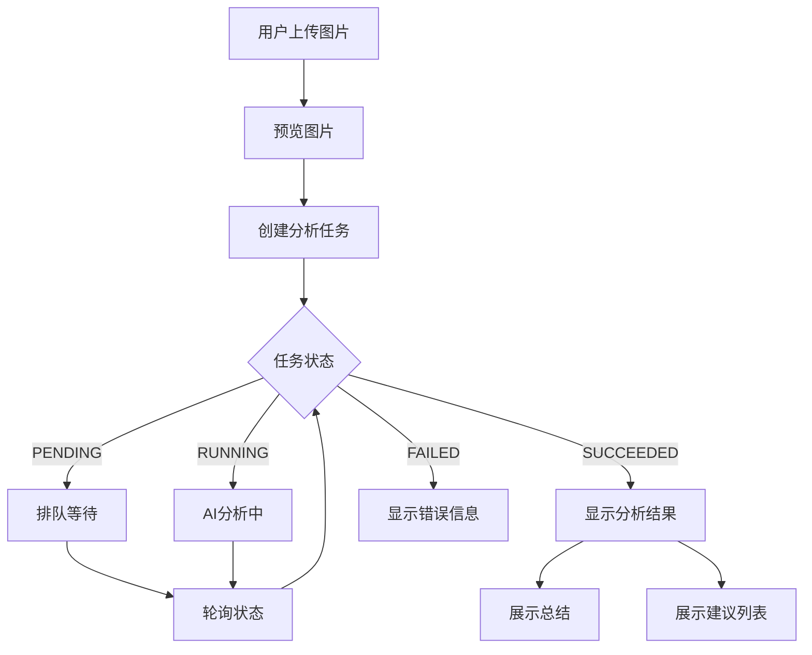
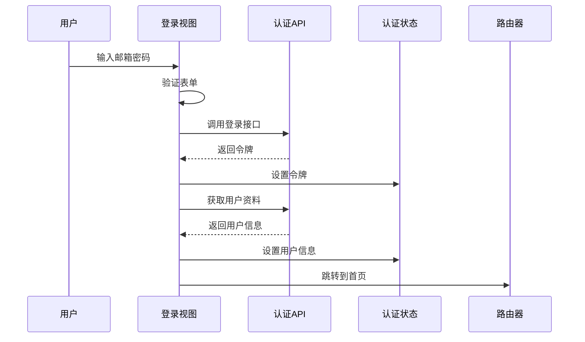

# Vue应用初始化与配置

<cite>
**本文档引用的文件**
- [apps/web/src/main.ts](file://apps/web/src/main.ts)
- [apps/web/src/App.vue](file://apps/web/src/App.vue)
- [apps/web/src/env.d.ts](file://apps/web/src/env.d.ts)
- [apps/web/vite.config.ts](file://apps/web/vite.config.ts)
- [apps/web/package.json](file://apps/web/package.json)
- [apps/web/src/router.ts](file://apps/web/src/router.ts)
- [apps/web/src/styles/global.css](file://apps/web/src/styles/global.css)
- [apps/web/src/stores/auth.ts](file://apps/web/src/stores/auth.ts)
- [apps/web/index.html](file://apps/web/index.html)
- [apps/web/tsconfig.json](file://apps/web/tsconfig.json)
- [apps/web/src/views/HomeView.vue](file://apps/web/src/views/HomeView.vue)
- [apps/web/src/views/LoginView.vue](file://apps/web/src/views/LoginView.vue)
- [apps/web/src/api/auth.ts](file://apps/web/src/api/auth.ts)
</cite>

## 目录
1. [简介](#简介)
2. [项目结构](#项目结构)
3. [核心组件](#核心组件)
4. [架构概览](#架构概览)
5. [详细组件分析](#详细组件分析)
6. [依赖关系分析](#依赖关系分析)
7. [性能考虑](#性能考虑)
8. [故障排除指南](#故障排除指南)
9. [结论](#结论)

## 简介

AI摄影教练Vue.js应用是一个基于现代前端技术栈构建的照片分析平台。该应用采用Vue 3 + TypeScript + Vite + Pinia + Vue Router的组合，提供了完整的照片上传、AI分析和结果展示功能。本文档详细说明了应用的初始化和配置过程，包括入口点设置、插件安装、全局样式引入、根组件结构以及环境变量配置等关键配置。

## 项目结构

应用采用模块化组织方式，主要目录结构如下：



**图表来源**
- [apps/web/src/main.ts:1-14](file://apps/web/src/main.ts#L1-L14)
- [apps/web/src/App.vue:1-96](file://apps/web/src/App.vue#L1-L96)
- [apps/web/vite.config.ts:1-26](file://apps/web/vite.config.ts#L1-L26)

**章节来源**
- [apps/web/src/main.ts:1-14](file://apps/web/src/main.ts#L1-L14)
- [apps/web/index.html:1-14](file://apps/web/index.html#L1-L14)

## 核心组件

### 应用入口点配置

应用的入口点位于 `src/main.ts`，负责创建Vue实例、安装插件和挂载应用：



**图表来源**
- [apps/web/src/main.ts:1-14](file://apps/web/src/main.ts#L1-L14)
- [apps/web/index.html:8-11](file://apps/web/index.html#L8-L11)

应用入口点的关键配置包括：
- **Vue实例创建**：使用 `createApp(App)` 创建根组件实例
- **插件安装**：安装Pinia状态管理和Vue Router路由系统
- **全局样式引入**：导入全局CSS样式文件
- **应用挂载**：将应用挂载到DOM元素 `#app`

**章节来源**
- [apps/web/src/main.ts:1-14](file://apps/web/src/main.ts#L1-L14)
- [apps/web/index.html:8-11](file://apps/web/index.html#L8-L11)

### 根组件结构分析

`App.vue` 作为应用的根组件，承担着全局布局和状态管理的核心职责：



**图表来源**
- [apps/web/src/App.vue:1-33](file://apps/web/src/App.vue#L1-L33)
- [apps/web/src/stores/auth.ts:5-40](file://apps/web/src/stores/auth.ts#L5-L40)

根组件的主要功能：
- **导航栏管理**：定义应用的主要导航选项（分析、历史、个人）
- **用户状态显示**：根据认证状态显示用户信息和登出按钮
- **路由控制**：提供页面跳转功能
- **登出处理**：清理认证状态并重定向到登录页

**章节来源**
- [apps/web/src/App.vue:1-96](file://apps/web/src/App.vue#L1-L96)
- [apps/web/src/stores/auth.ts:1-41](file://apps/web/src/stores/auth.ts#L1-L41)

## 架构概览

应用采用现代化的前端架构模式，结合了多种设计原则：



**图表来源**
- [apps/web/src/main.ts:1-14](file://apps/web/src/main.ts#L1-L14)
- [apps/web/package.json:11-23](file://apps/web/package.json#L11-L23)

架构特点：
- **响应式设计**：使用CSS变量实现主题统一和动态切换
- **模块化开发**：按功能划分目录结构，便于维护和扩展
- **类型安全**：全面使用TypeScript确保代码质量
- **开发体验**：集成Vite提供快速热更新和构建优化

## 详细组件分析

### 全局CSS样式系统

应用采用CSS变量驱动的设计系统，实现了统一的主题管理和响应式布局：



**图表来源**
- [apps/web/src/styles/global.css:1-16](file://apps/web/src/styles/global.css#L1-L16)
- [apps/web/src/styles/global.css:46-303](file://apps/web/src/styles/global.css#L46-L303)

样式系统的核心特性：
- **CSS变量系统**：定义了完整的色彩体系和尺寸规范
- **渐变背景**：使用多层径向渐变创造丰富的视觉效果
- **响应式设计**：支持移动端和桌面端的自适应布局
- **动画效果**：包含淡入等轻量级过渡动画

**章节来源**
- [apps/web/src/styles/global.css:1-303](file://apps/web/src/styles/global.css#L1-L303)

### 路由系统配置

应用使用Vue Router实现单页应用的页面导航：



**图表来源**
- [apps/web/src/router.ts:21-30](file://apps/web/src/router.ts#L21-L30)
- [apps/web/src/stores/auth.ts:10](file://apps/web/src/stores/auth.ts#L10)

路由配置要点：
- **认证保护**：通过元信息标记需要认证的页面
- **游客保护**：防止已认证用户访问登录注册页面
- **历史记录**：使用HTML5 History模式实现平滑导航

**章节来源**
- [apps/web/src/router.ts:1-30](file://apps/web/src/router.ts#L1-L30)

### 状态管理系统

应用使用Pinia实现集中式状态管理：



**图表来源**
- [apps/web/src/stores/auth.ts:5-40](file://apps/web/src/stores/auth.ts#L5-L40)

状态管理功能：
- **令牌存储**：本地存储访问令牌和刷新令牌
- **用户信息**：管理当前登录用户的资料
- **认证状态**：计算属性跟踪认证状态
- **持久化**：自动同步状态到localStorage

**章节来源**
- [apps/web/src/stores/auth.ts:1-41](file://apps/web/src/stores/auth.ts#L1-L41)

### 视图组件分析

#### 主页视图组件

主页是应用的核心功能页面，提供照片上传和AI分析功能：



**图表来源**
- [apps/web/src/views/HomeView.vue:12-25](file://apps/web/src/views/HomeView.vue#L12-L25)
- [apps/web/src/views/HomeView.vue:31-48](file://apps/web/src/views/HomeView.vue#L31-L48)

**章节来源**
- [apps/web/src/views/HomeView.vue:1-111](file://apps/web/src/views/HomeView.vue#L1-L111)

#### 登录视图组件

登录页面提供用户身份验证功能：



**图表来源**
- [apps/web/src/views/LoginView.vue:15-46](file://apps/web/src/views/LoginView.vue#L15-L46)
- [apps/web/src/api/auth.ts:33-47](file://apps/web/src/api/auth.ts#L33-L47)

**章节来源**
- [apps/web/src/views/LoginView.vue:1-127](file://apps/web/src/views/LoginView.vue#L1-L127)
- [apps/web/src/api/auth.ts:1-56](file://apps/web/src/api/auth.ts#L1-L56)

## 依赖关系分析

应用的依赖关系体现了清晰的分层架构：

```mermaid
graph TB
subgraph "运行时依赖"
A[Vue 3.5.21]
B[Pinia 3.0.3]
C[Vue Router 4.5.1]
D[Axios 1.11.0]
end
subgraph "开发时依赖"
E[Vite 7.1.3]
F[TypeScript 5.9.2]
G[@vitejs/plugin-vue 6.0.1]
H[vue-tsc 3.0.6]
I["@types/node 24.3.0"]
end
subgraph "应用代码"
J[main.ts]
K[App.vue]
L[router.ts]
M[stores/]
N[views/]
O[styles/]
end
J --> A
J --> B
J --> C
K --> A
L --> C
M --> B
N --> A
O --> A
E --> G
F --> H
I --> A
```

**图表来源**
- [apps/web/package.json:11-23](file://apps/web/package.json#L11-L23)
- [apps/web/src/main.ts:1-14](file://apps/web/src/main.ts#L1-L14)

**章节来源**
- [apps/web/package.json:1-26](file://apps/web/package.json#L1-L26)

## 性能考虑

应用在多个层面考虑了性能优化：

### 启动性能优化
- **懒加载组件**：路由级别的代码分割减少初始包大小
- **按需导入**：第三方库采用动态导入策略
- **缓存策略**：利用浏览器缓存机制提升二次加载速度

### 运行时性能优化
- **虚拟滚动**：对于大量数据的列表使用虚拟滚动
- **防抖节流**：对高频事件进行防抖处理
- **内存管理**：及时清理定时器和事件监听器

### 开发体验优化
- **热更新**：Vite提供毫秒级的热模块替换
- **类型检查**：TypeScript提供编译时错误检测
- **代码分割**：自动进行代码分割和懒加载

## 故障排除指南

### 常见问题及解决方案

#### 应用无法启动
1. **检查依赖安装**：确保所有依赖正确安装
2. **验证Node版本**：确认Node.js版本满足要求
3. **检查端口占用**：默认端口5151可能被其他程序占用

#### 路由跳转异常
1. **检查路由配置**：确认路由路径和名称配置正确
2. **验证导航守卫**：检查认证状态是否正确
3. **查看控制台错误**：排查JavaScript运行时错误

#### 样式显示异常
1. **检查CSS变量**：确认CSS变量定义正确
2. **验证样式优先级**：避免样式覆盖问题
3. **检查scoped样式**：确认组件样式作用域

#### API请求失败
1. **检查代理配置**：确认开发服务器代理设置正确
2. **验证环境变量**：确认API端点配置正确
3. **查看网络面板**：分析具体的HTTP错误

**章节来源**
- [apps/web/vite.config.ts:4-25](file://apps/web/vite.config.ts#L4-L25)
- [apps/web/src/router.ts:21-30](file://apps/web/src/router.ts#L21-L30)

## 结论

AI摄影教练Vue.js应用展现了现代前端开发的最佳实践。通过精心设计的架构和配置，应用实现了：

- **清晰的代码结构**：模块化的目录组织便于维护和扩展
- **完善的类型系统**：TypeScript提供强大的类型安全保障
- **优秀的用户体验**：响应式设计和流畅的交互体验
- **高效的开发流程**：现代化工具链提升开发效率

该应用为类似的照片分析类应用提供了良好的参考模板，其配置方案和架构设计值得在实际项目中借鉴和应用。