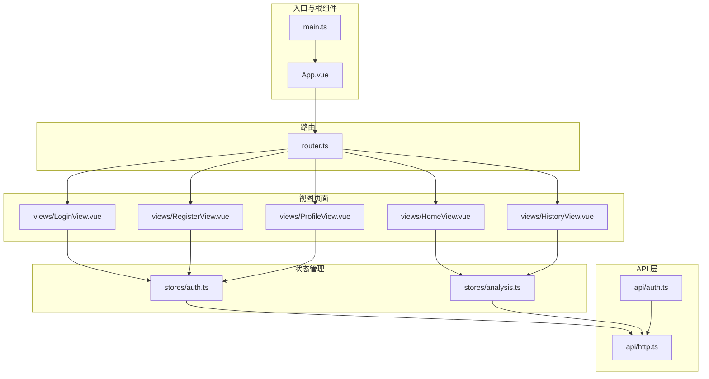
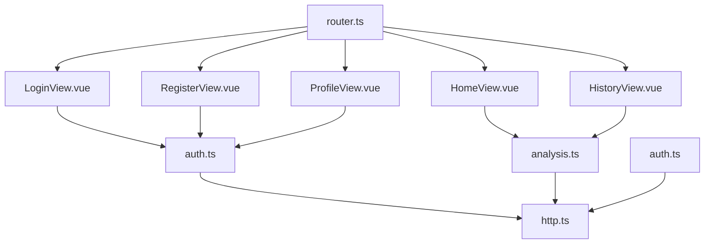
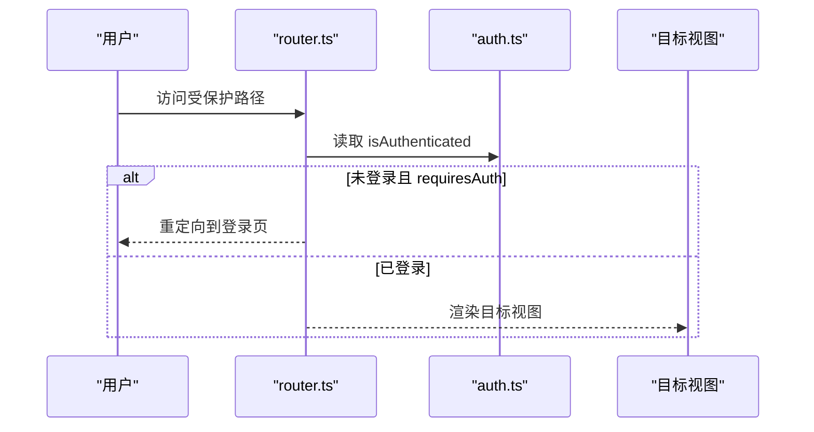
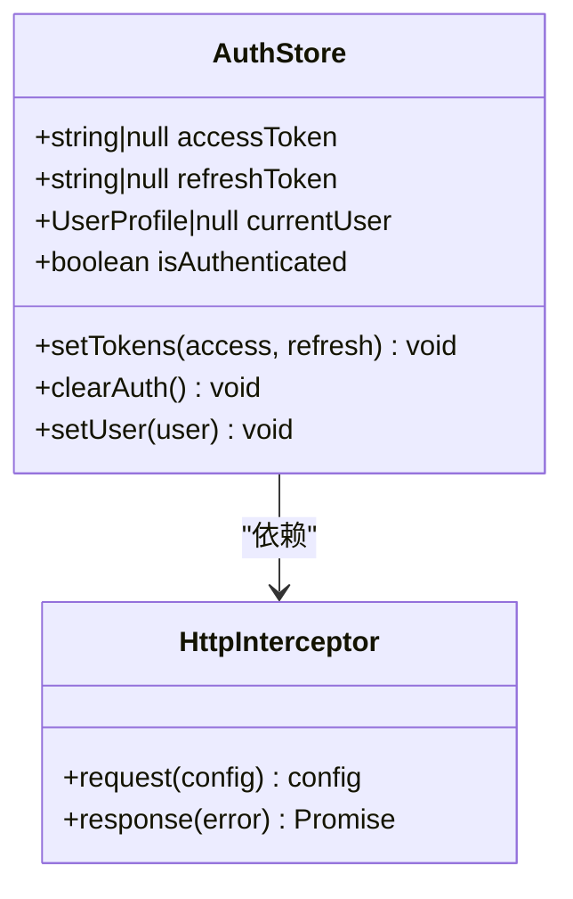
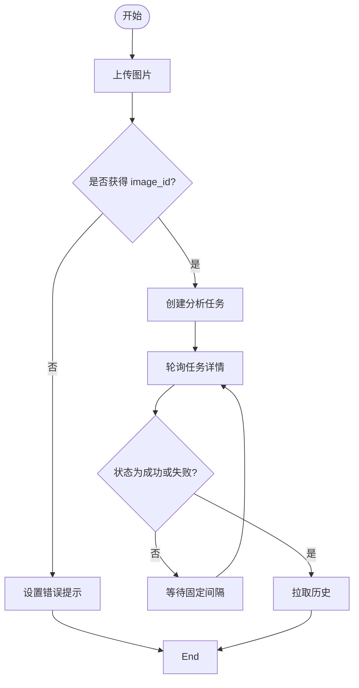
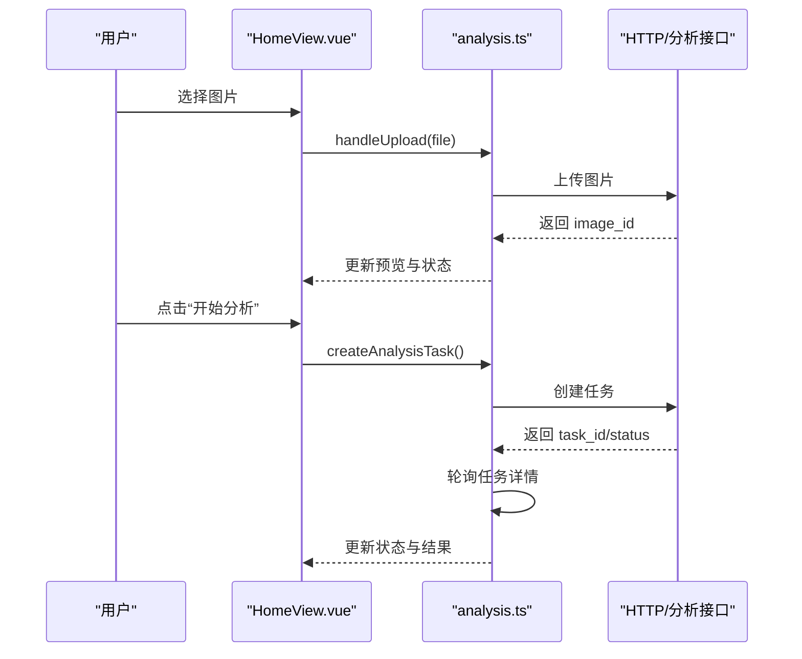
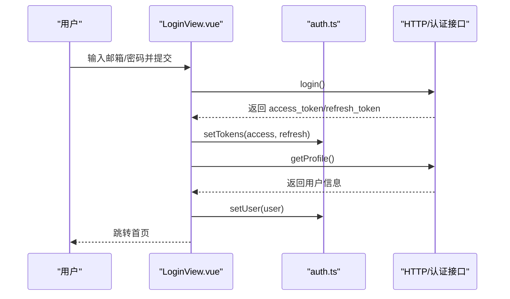
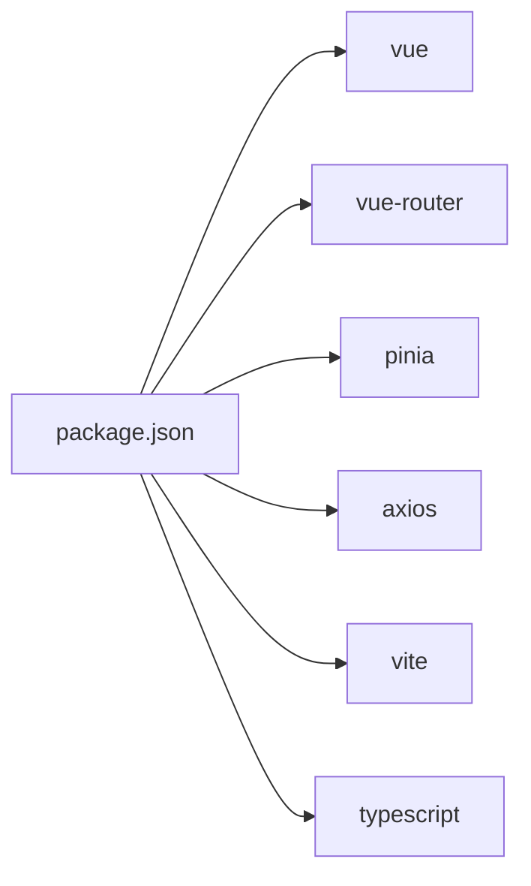

# 前端应用架构

<cite>
**本文引用的文件**
- [apps/web/src/main.ts](file://apps/web/src/main.ts)
- [apps/web/src/router.ts](file://apps/web/src/router.ts)
- [apps/web/src/App.vue](file://apps/web/src/App.vue)
- [apps/web/src/stores/auth.ts](file://apps/web/src/stores/auth.ts)
- [apps/web/src/stores/analysis.ts](file://apps/web/src/stores/analysis.ts)
- [apps/web/src/api/http.ts](file://apps/web/src/api/http.ts)
- [apps/web/src/api/auth.ts](file://apps/web/src/api/auth.ts)
- [apps/web/src/views/HomeView.vue](file://apps/web/src/views/HomeView.vue)
- [apps/web/src/views/LoginView.vue](file://apps/web/src/views/LoginView.vue)
- [apps/web/src/views/RegisterView.vue](file://apps/web/src/views/RegisterView.vue)
- [apps/web/src/views/ProfileView.vue](file://apps/web/src/views/ProfileView.vue)
- [apps/web/src/views/HistoryView.vue](file://apps/web/src/views/HistoryView.vue)
- [apps/web/src/styles/global.css](file://apps/web/src/styles/global.css)
- [apps/web/package.json](file://apps/web/package.json)
- [apps/web/vite.config.ts](file://apps/web/vite.config.ts)
</cite>

## 目录
1. [引言](#引言)
2. [项目结构](#项目结构)
3. [核心组件](#核心组件)
4. [架构总览](#架构总览)
5. [详细组件分析](#详细组件分析)
6. [依赖关系分析](#依赖关系分析)
7. [性能考虑](#性能考虑)
8. [故障排查指南](#故障排查指南)
9. [结论](#结论)
10. [附录](#附录)

## 引言
本文件面向“AI摄影教练”前端应用，系统性梳理基于 Vue.js 3 的单页应用架构，涵盖组件结构、路由与导航守卫、状态管理（Pinia）、API 集成、页面交互逻辑、响应式与用户体验优化策略，以及构建与部署流程。目标是帮助开发者快速理解并高效迭代该前端应用。

## 项目结构
前端工程位于 apps/web，采用“按功能域分层”的组织方式：
- 入口与根组件：main.ts、App.vue
- 路由：router.ts
- 状态管理：stores 下的 auth.ts、analysis.ts
- API 层：api 下的 http.ts、auth.ts、images.ts（由 analysis store 引用）
- 视图页面：views 下的 HomeView、LoginView、RegisterView、ProfileView、HistoryView
- 样式：styles/global.css
- 构建与运行：package.json、vite.config.ts

图表来源
- [apps/web/src/main.ts:1-14](file://apps/web/src/main.ts#L1-L14)
- [apps/web/src/App.vue:1-96](file://apps/web/src/App.vue#L1-L96)
- [apps/web/src/router.ts:1-30](file://apps/web/src/router.ts#L1-L30)
- [apps/web/src/stores/auth.ts:1-41](file://apps/web/src/stores/auth.ts#L1-L41)
- [apps/web/src/stores/analysis.ts:1-142](file://apps/web/src/stores/analysis.ts#L1-L142)
- [apps/web/src/api/http.ts:1-94](file://apps/web/src/api/http.ts#L1-L94)
- [apps/web/src/api/auth.ts:1-56](file://apps/web/src/api/auth.ts#L1-L56)
- [apps/web/src/views/HomeView.vue:1-111](file://apps/web/src/views/HomeView.vue#L1-L111)
- [apps/web/src/views/LoginView.vue:1-127](file://apps/web/src/views/LoginView.vue#L1-L127)
- [apps/web/src/views/RegisterView.vue:1-160](file://apps/web/src/views/RegisterView.vue#L1-L160)
- [apps/web/src/views/ProfileView.vue:1-243](file://apps/web/src/views/ProfileView.vue#L1-L243)
- [apps/web/src/views/HistoryView.vue:1-42](file://apps/web/src/views/HistoryView.vue#L1-L42)

章节来源
- [apps/web/src/main.ts:1-14](file://apps/web/src/main.ts#L1-L14)
- [apps/web/src/router.ts:1-30](file://apps/web/src/router.ts#L1-L30)
- [apps/web/src/App.vue:1-96](file://apps/web/src/App.vue#L1-L96)
- [apps/web/src/stores/auth.ts:1-41](file://apps/web/src/stores/auth.ts#L1-L41)
- [apps/web/src/stores/analysis.ts:1-142](file://apps/web/src/stores/analysis.ts#L1-L142)
- [apps/web/src/api/http.ts:1-94](file://apps/web/src/api/http.ts#L1-L94)
- [apps/web/src/api/auth.ts:1-56](file://apps/web/src/api/auth.ts#L1-L56)
- [apps/web/src/views/HomeView.vue:1-111](file://apps/web/src/views/HomeView.vue#L1-L111)
- [apps/web/src/views/LoginView.vue:1-127](file://apps/web/src/views/LoginView.vue#L1-L127)
- [apps/web/src/views/RegisterView.vue:1-160](file://apps/web/src/views/RegisterView.vue#L1-L160)
- [apps/web/src/views/ProfileView.vue:1-243](file://apps/web/src/views/ProfileView.vue#L1-L243)
- [apps/web/src/views/HistoryView.vue:1-42](file://apps/web/src/views/HistoryView.vue#L1-L42)
- [apps/web/src/styles/global.css:1-303](file://apps/web/src/styles/global.css#L1-L303)
- [apps/web/package.json:1-26](file://apps/web/package.json#L1-L26)
- [apps/web/vite.config.ts:1-26](file://apps/web/vite.config.ts#L1-L26)

## 核心组件
- 应用入口与挂载：通过 main.ts 创建应用实例，安装 Pinia 和路由，挂载到 DOM。
- 根组件与全局布局：App.vue 提供头部、主内容区与底部标签栏，统一处理用户显示名与登出。
- 路由与导航守卫：router.ts 定义页面路由与导航守卫，控制登录/注册页对访客开放、其余页面需鉴权访问。
- 状态管理：
  - 认证状态：auth store 维护令牌与用户信息，提供 setTokens/clearAuth/setUser 等方法。
  - 分析任务：analysis store 管理图片上传、任务创建、轮询状态、历史拉取与重试。
- API 层：
  - http.ts 封装 axios，注入 Bearer Token 并处理 401 自动刷新；提供统一基础地址。
  - auth.ts 定义认证与用户相关接口，供登录、注册、资料查询与修改使用。

章节来源
- [apps/web/src/main.ts:1-14](file://apps/web/src/main.ts#L1-L14)
- [apps/web/src/App.vue:1-96](file://apps/web/src/App.vue#L1-L96)
- [apps/web/src/router.ts:1-30](file://apps/web/src/router.ts#L1-L30)
- [apps/web/src/stores/auth.ts:1-41](file://apps/web/src/stores/auth.ts#L1-L41)
- [apps/web/src/stores/analysis.ts:1-142](file://apps/web/src/stores/analysis.ts#L1-L142)
- [apps/web/src/api/http.ts:1-94](file://apps/web/src/api/http.ts#L1-L94)
- [apps/web/src/api/auth.ts:1-56](file://apps/web/src/api/auth.ts#L1-L56)

## 架构总览
应用采用“视图组件 + Pinia Store + API 层 + 路由守卫”的分层架构。视图组件通过 Store 与 API 交互，Store 通过 http.ts 发起请求并持久化令牌；路由守卫根据认证状态控制页面访问。

图表来源
- [apps/web/src/views/HomeView.vue:1-111](file://apps/web/src/views/HomeView.vue#L1-L111)
- [apps/web/src/views/LoginView.vue:1-127](file://apps/web/src/views/LoginView.vue#L1-L127)
- [apps/web/src/views/RegisterView.vue:1-160](file://apps/web/src/views/RegisterView.vue#L1-L160)
- [apps/web/src/views/ProfileView.vue:1-243](file://apps/web/src/views/ProfileView.vue#L1-L243)
- [apps/web/src/views/HistoryView.vue:1-42](file://apps/web/src/views/HistoryView.vue#L1-L42)
- [apps/web/src/stores/auth.ts:1-41](file://apps/web/src/stores/auth.ts#L1-L41)
- [apps/web/src/stores/analysis.ts:1-142](file://apps/web/src/stores/analysis.ts#L1-L142)
- [apps/web/src/api/http.ts:1-94](file://apps/web/src/api/http.ts#L1-L94)
- [apps/web/src/api/auth.ts:1-56](file://apps/web/src/api/auth.ts#L1-L56)
- [apps/web/src/router.ts:1-30](file://apps/web/src/router.ts#L1-L30)

## 详细组件分析

### 路由与导航守卫
- 路由定义：包含登录、注册、首页、历史、个人资料五个页面，分别对应不同 meta 标记以控制访问权限。
- 导航守卫：
  - requiresAuth：未登录用户访问受保护页面时重定向至登录页。
  - guest：已登录用户访问登录/注册页时重定向至首页。

图表来源
- [apps/web/src/router.ts:21-30](file://apps/web/src/router.ts#L21-L30)
- [apps/web/src/stores/auth.ts:10-10](file://apps/web/src/stores/auth.ts#L10-L10)

章节来源
- [apps/web/src/router.ts:1-30](file://apps/web/src/router.ts#L1-L30)
- [apps/web/src/stores/auth.ts:1-41](file://apps/web/src/stores/auth.ts#L1-L41)

### 认证状态管理（Pinia）
- 数据模型：accessToken、refreshToken、currentUser、isAuthenticated。
- 方法：
  - setTokens：写入本地存储并同步状态。
  - clearAuth：清理令牌与用户信息。
  - setUser：设置当前用户。
- 与 API 集成：http.ts 请求拦截器自动注入 Bearer Token；响应拦截器在 401 时尝试刷新并重试原请求。

图表来源
- [apps/web/src/stores/auth.ts:1-41](file://apps/web/src/stores/auth.ts#L1-L41)
- [apps/web/src/api/http.ts:10-91](file://apps/web/src/api/http.ts#L10-L91)

章节来源
- [apps/web/src/stores/auth.ts:1-41](file://apps/web/src/stores/auth.ts#L1-L41)
- [apps/web/src/api/http.ts:1-94](file://apps/web/src/api/http.ts#L1-L94)

### 分析任务状态管理（Pinia）
- 数据模型：imageId、imagePreviewUrl、taskId、taskStatus、taskDetail、history、loading、error、isPolling。
- 关键流程：
  - 图片上传：调用 uploadImage，生成 image_id 并生成预览 URL。
  - 创建任务：调用 createTask，得到 task_id 与初始状态，进入轮询。
  - 轮询：按固定间隔获取任务详情，直到成功或失败，随后拉取历史。
  - 重试：对当前任务发起 retryTask 后重新轮询。
  - 停止轮询：组件卸载时停止轮询，避免内存泄漏。
- 与 API 集成：analysis store 直接调用 analysis.ts 与 images.ts（由 analysis store 内部引入）。

图表来源
- [apps/web/src/stores/analysis.ts:34-104](file://apps/web/src/stores/analysis.ts#L34-L104)

章节来源
- [apps/web/src/stores/analysis.ts:1-142](file://apps/web/src/stores/analysis.ts#L1-L142)

### 页面组件与交互逻辑

#### 首页（HomeView）
- 功能要点：
  - 文件选择与预览：隐藏文件输入框，点击按钮触发选择；上传成功后生成预览 URL。
  - 任务创建：根据是否存在图片与轮询状态禁用按钮；点击后创建任务并轮询。
  - 结果展示：当任务成功时展示 AI 总结与建议列表。
  - 错误提示：捕获上传/创建/重试过程中的错误并显示。
- 生命周期：组件卸载时停止轮询。

图表来源
- [apps/web/src/views/HomeView.vue:1-111](file://apps/web/src/views/HomeView.vue#L1-L111)
- [apps/web/src/stores/analysis.ts:34-104](file://apps/web/src/stores/analysis.ts#L34-L104)
- [apps/web/src/api/http.ts:1-94](file://apps/web/src/api/http.ts#L1-L94)

章节来源
- [apps/web/src/views/HomeView.vue:1-111](file://apps/web/src/views/HomeView.vue#L1-L111)
- [apps/web/src/stores/analysis.ts:1-142](file://apps/web/src/stores/analysis.ts#L1-L142)

#### 登录页（LoginView）
- 表单校验：邮箱与密码必填。
- 登录流程：调用登录接口，成功后写入令牌与用户信息，跳转首页。
- 错误处理：针对 401/400 与其它异常给出明确提示。

图表来源
- [apps/web/src/views/LoginView.vue:1-127](file://apps/web/src/views/LoginView.vue#L1-L127)
- [apps/web/src/api/auth.ts:29-47](file://apps/web/src/api/auth.ts#L29-L47)
- [apps/web/src/stores/auth.ts:12-29](file://apps/web/src/stores/auth.ts#L12-L29)

章节来源
- [apps/web/src/views/LoginView.vue:1-127](file://apps/web/src/views/LoginView.vue#L1-L127)
- [apps/web/src/api/auth.ts:1-56](file://apps/web/src/api/auth.ts#L1-L56)
- [apps/web/src/stores/auth.ts:1-41](file://apps/web/src/stores/auth.ts#L1-L41)

#### 注册页（RegisterView）
- 表单校验：邮箱、密码长度与一致性校验。
- 注册流程：调用注册接口，成功后自动登录并跳转首页。
- 错误处理：针对 409/400 与其它异常给出提示。

章节来源
- [apps/web/src/views/RegisterView.vue:1-160](file://apps/web/src/views/RegisterView.vue#L1-L160)
- [apps/web/src/api/auth.ts:29-31](file://apps/web/src/api/auth.ts#L29-L31)
- [apps/web/src/stores/auth.ts:12-29](file://apps/web/src/stores/auth.ts#L12-L29)

#### 个人资料页（ProfileView）
- 加载：首次进入时拉取用户资料并填充表单。
- 更新资料：支持修改昵称与头像 URL，成功后同步 Pinia 状态。
- 修改密码：校验当前密码与新密码一致性及长度，成功后清空表单字段。

章节来源
- [apps/web/src/views/ProfileView.vue:1-243](file://apps/web/src/views/ProfileView.vue#L1-L243)
- [apps/web/src/api/auth.ts:45-55](file://apps/web/src/api/auth.ts#L45-L55)
- [apps/web/src/stores/auth.ts:27-29](file://apps/web/src/stores/auth.ts#L27-L29)

#### 历史页（HistoryView）
- 加载：组件挂载时拉取最近 20 条任务历史。
- 展示：按状态与时间排序展示摘要信息。

章节来源
- [apps/web/src/views/HistoryView.vue:1-42](file://apps/web/src/views/HistoryView.vue#L1-L42)
- [apps/web/src/stores/analysis.ts:96-104](file://apps/web/src/stores/analysis.ts#L96-L104)

### 组件间通信与数据流
- 单向数据流：视图组件通过 Store 方法触发副作用（上传、创建任务、拉取历史），Store 通过 http.ts 发起网络请求，成功后更新本地状态。
- 跨组件共享：Pinia Store 在多个视图之间共享状态，如认证状态与分析任务状态。
- 事件与回调：文件选择、按钮点击等用户交互通过事件绑定触发 Store 方法。

章节来源
- [apps/web/src/views/HomeView.vue:1-111](file://apps/web/src/views/HomeView.vue#L1-L111)
- [apps/web/src/views/LoginView.vue:1-127](file://apps/web/src/views/LoginView.vue#L1-L127)
- [apps/web/src/views/RegisterView.vue:1-160](file://apps/web/src/views/RegisterView.vue#L1-L160)
- [apps/web/src/views/ProfileView.vue:1-243](file://apps/web/src/views/ProfileView.vue#L1-L243)
- [apps/web/src/views/HistoryView.vue:1-42](file://apps/web/src/views/HistoryView.vue#L1-L42)
- [apps/web/src/stores/analysis.ts:1-142](file://apps/web/src/stores/analysis.ts#L1-L142)
- [apps/web/src/stores/auth.ts:1-41](file://apps/web/src/stores/auth.ts#L1-L41)

## 依赖关系分析
- 运行时依赖：vue、vue-router、pinia、axios。
- 开发依赖：@vitejs/plugin-vue、typescript、vite、vue-tsc。
- 构建工具：Vite，开发服务器代理 /api 与 /healthz 到后端服务。

图表来源
- [apps/web/package.json:11-23](file://apps/web/package.json#L11-L23)

章节来源
- [apps/web/package.json:1-26](file://apps/web/package.json#L1-L26)
- [apps/web/vite.config.ts:1-26](file://apps/web/vite.config.ts#L1-L26)

## 性能考虑
- 轮询节流：analysis store 使用固定轮询间隔，避免频繁请求；组件卸载时及时停止轮询，防止资源浪费。
- 对象 URL 管理：上传成功后释放旧的预览对象 URL，避免内存泄漏。
- 本地存储：令牌与用户信息持久化于 localStorage，减少重复登录成本。
- 样式与动画：统一的 CSS 变量与过渡动画，保证在低端设备上的流畅体验。

章节来源
- [apps/web/src/stores/analysis.ts:15-21](file://apps/web/src/stores/analysis.ts#L15-L21)
- [apps/web/src/stores/analysis.ts:40-43](file://apps/web/src/stores/analysis.ts#L40-L43)
- [apps/web/src/stores/auth.ts:6-25](file://apps/web/src/stores/auth.ts#L6-L25)
- [apps/web/src/styles/global.css:1-303](file://apps/web/src/styles/global.css#L1-L303)

## 故障排查指南
- 401/403 自动刷新：
  - 当响应为 401/403 且未重试过时，拦截器会尝试使用 refresh_token 刷新 access_token，并重放原始请求。
  - 若刷新失败或无 refresh_token，清除本地认证状态并跳转登录页。
- 登录/注册错误：
  - 登录：401/400 提示邮箱或密码错误；其他错误提示“登录失败，请稍后重试”。
  - 注册：409 提示邮箱已被注册；400 提示输入不合法；其他错误提示“注册失败，请稍后重试”。

章节来源
- [apps/web/src/api/http.ts:19-91](file://apps/web/src/api/http.ts#L19-L91)
- [apps/web/src/views/LoginView.vue:36-46](file://apps/web/src/views/LoginView.vue#L36-L46)
- [apps/web/src/views/RegisterView.vue:55-67](file://apps/web/src/views/RegisterView.vue#L55-L67)

## 结论
该前端应用以 Vue 3 + Pinia 为核心，结合 axios 拦截器实现统一认证与自动刷新，采用分层架构清晰分离视图、状态与 API。路由守卫保障页面访问安全，各页面围绕上传、分析、历史与资料管理形成完整闭环。通过合理的轮询与资源管理策略，兼顾了用户体验与性能表现。

## 附录

### 响应式设计与用户体验
- 布局：最大宽度约束与安全区域适配，底部标签栏固定定位，提升移动端可用性。
- 主题：CSS 变量统一色板与圆角、阴影，营造柔和视觉风格。
- 交互：按钮禁用态、加载态与成功/错误反馈，确保用户感知明确。

章节来源
- [apps/web/src/styles/global.css:1-303](file://apps/web/src/styles/global.css#L1-L303)
- [apps/web/src/App.vue:23-32](file://apps/web/src/App.vue#L23-L32)

### 构建与部署
- 开发：Vite 提供热更新与代理，开发服务器监听 5151 端口，代理 /api 与 /healthz 到后端。
- 构建：TypeScript 类型检查与 Vite 打包，输出静态资源。
- 预览：本地预览构建产物。

章节来源
- [apps/web/vite.config.ts:1-26](file://apps/web/vite.config.ts#L1-L26)
- [apps/web/package.json:6-10](file://apps/web/package.json#L6-L10)