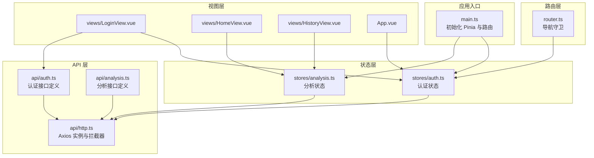
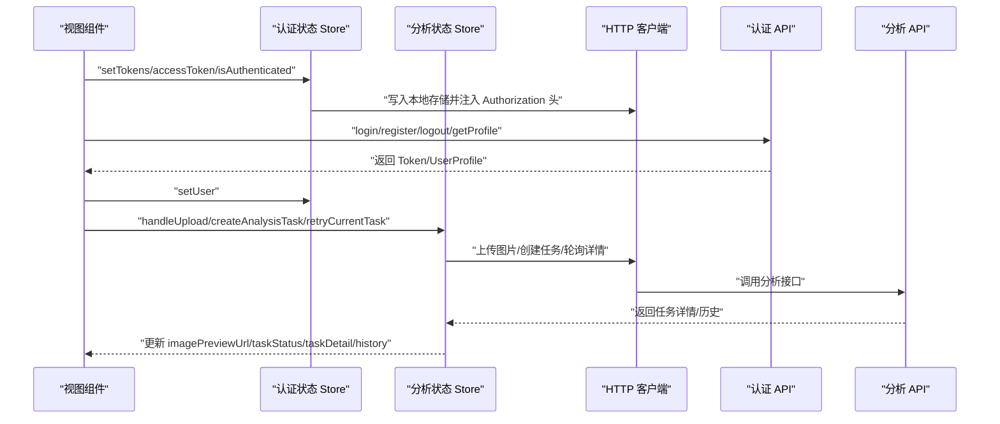
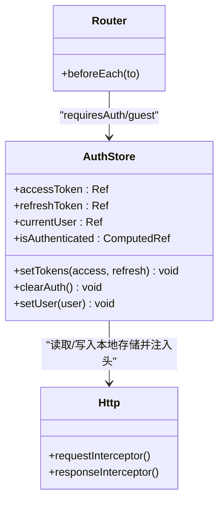
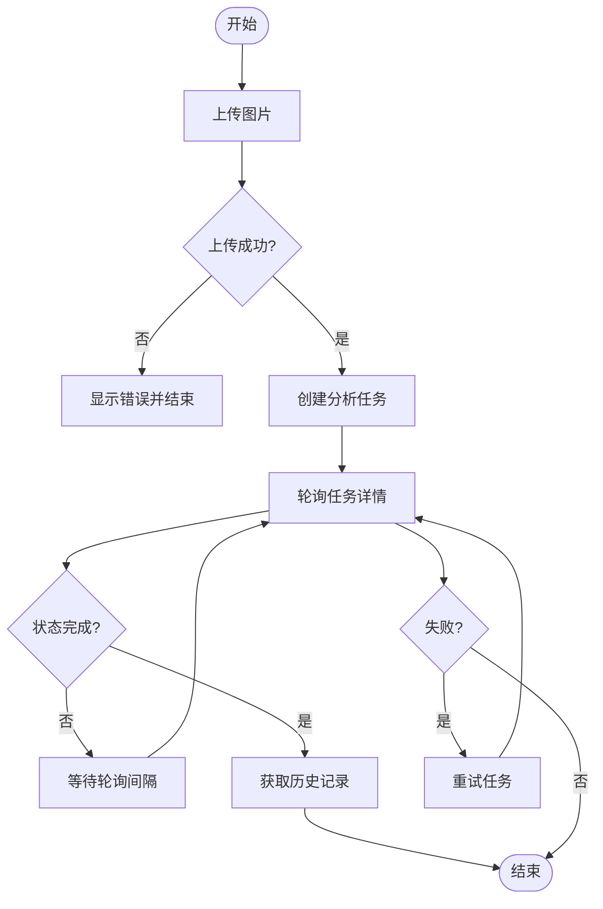
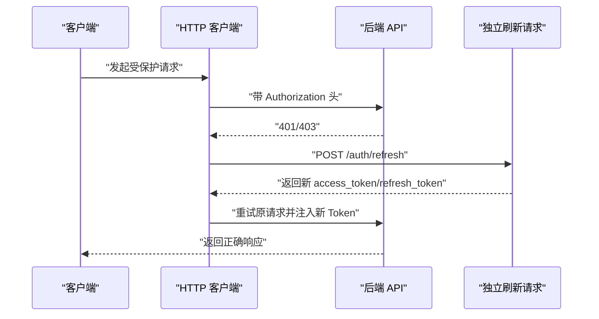
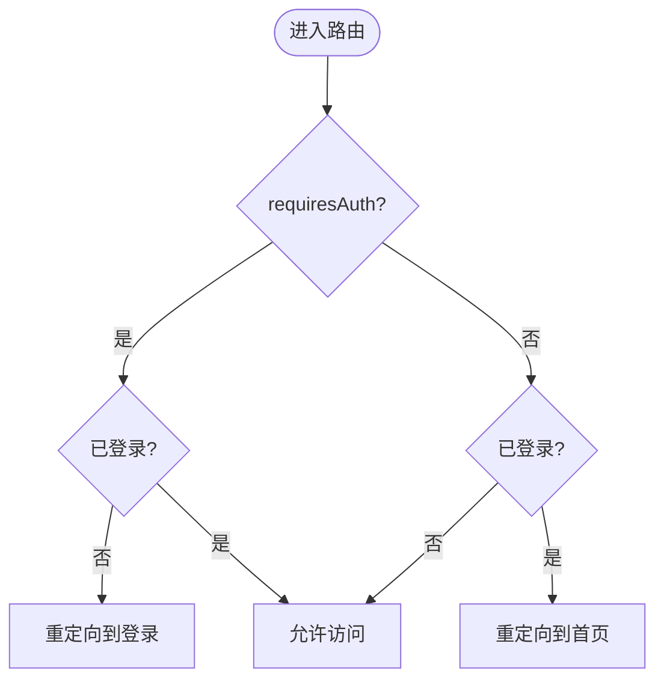
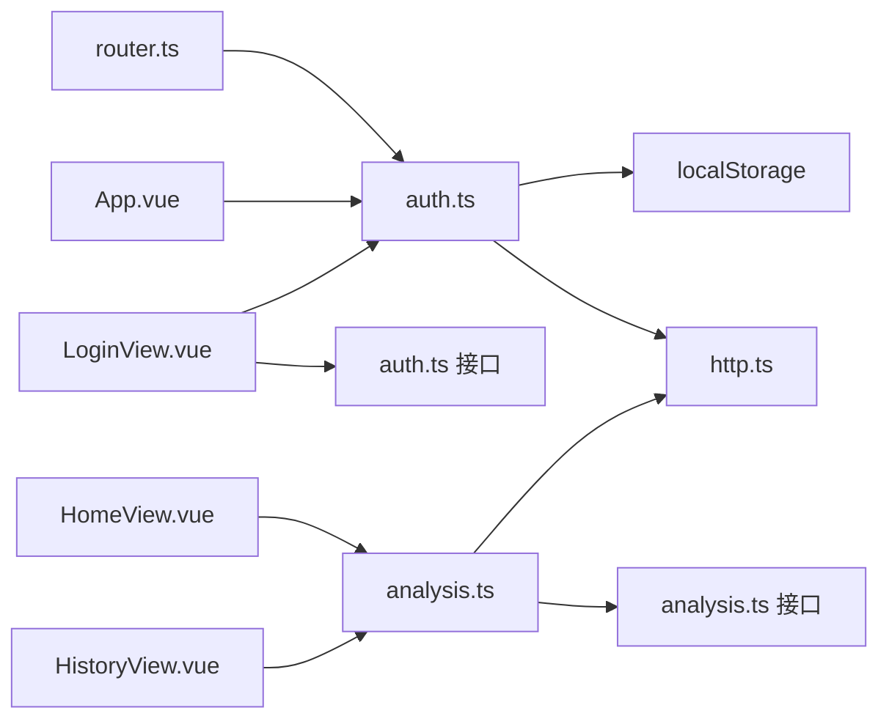

# 状态管理设计

<cite>
**本文引用的文件**
- [apps/web/src/main.ts](file://apps/web/src/main.ts)
- [apps/web/src/stores/auth.ts](file://apps/web/src/stores/auth.ts)
- [apps/web/src/stores/analysis.ts](file://apps/web/src/stores/analysis.ts)
- [apps/web/src/api/auth.ts](file://apps/web/src/api/auth.ts)
- [apps/web/src/api/analysis.ts](file://apps/web/src/api/analysis.ts)
- [apps/web/src/api/http.ts](file://apps/web/src/api/http.ts)
- [apps/web/src/router.ts](file://apps/web/src/router.ts)
- [apps/web/src/views/LoginView.vue](file://apps/web/src/views/LoginView.vue)
- [apps/web/src/views/HomeView.vue](file://apps/web/src/views/HomeView.vue)
- [apps/web/src/views/HistoryView.vue](file://apps/web/src/views/HistoryView.vue)
- [apps/web/src/App.vue](file://apps/web/src/App.vue)
- [apps/web/package.json](file://apps/web/package.json)
</cite>

## 目录
1. [简介](#简介)
2. [项目结构](#项目结构)
3. [核心组件](#核心组件)
4. [架构总览](#架构总览)
5. [详细组件分析](#详细组件分析)
6. [依赖关系分析](#依赖关系分析)
7. [性能考量](#性能考量)
8. [故障排查指南](#故障排查指南)
9. [结论](#结论)
10. [附录](#附录)

## 简介
本文件系统性梳理 AI 摄影教练 Web 应用的状态管理设计与实现，重点围绕 Pinia 状态管理库在认证与分析两大场景中的应用。内容涵盖：
- 认证状态 Store 的结构与方法（登录状态、令牌管理、权限控制）
- 分析状态 Store 的功能（任务状态跟踪、结果数据管理、UI 状态控制）
- 状态持久化策略与跨组件数据共享模式
- 状态调试与性能优化技巧

## 项目结构
前端采用 Vue 3 + Pinia 架构，状态管理集中在 stores 目录，API 层通过 axios 封装统一处理请求与响应拦截，路由层结合导航守卫实现权限控制。

图表来源
- [apps/web/src/main.ts:1-14](file://apps/web/src/main.ts#L1-L14)
- [apps/web/src/stores/auth.ts:1-41](file://apps/web/src/stores/auth.ts#L1-L41)
- [apps/web/src/stores/analysis.ts:1-142](file://apps/web/src/stores/analysis.ts#L1-L142)
- [apps/web/src/api/http.ts:1-94](file://apps/web/src/api/http.ts#L1-L94)
- [apps/web/src/api/auth.ts:1-56](file://apps/web/src/api/auth.ts#L1-L56)
- [apps/web/src/api/analysis.ts:1-101](file://apps/web/src/api/analysis.ts#L1-L101)
- [apps/web/src/router.ts:1-30](file://apps/web/src/router.ts#L1-L30)
- [apps/web/src/views/LoginView.vue:1-127](file://apps/web/src/views/LoginView.vue#L1-L127)
- [apps/web/src/views/HomeView.vue:1-111](file://apps/web/src/views/HomeView.vue#L1-L111)
- [apps/web/src/views/HistoryView.vue:1-42](file://apps/web/src/views/HistoryView.vue#L1-L42)
- [apps/web/src/App.vue:1-96](file://apps/web/src/App.vue#L1-L96)

章节来源
- [apps/web/src/main.ts:1-14](file://apps/web/src/main.ts#L1-L14)
- [apps/web/src/router.ts:1-30](file://apps/web/src/router.ts#L1-L30)

## 核心组件
- 认证状态 Store（auth.ts）：管理访问令牌、刷新令牌、用户信息与登录态；提供设置令牌、清理认证、设置用户等方法。
- 分析状态 Store（analysis.ts）：管理图片上传、任务创建、轮询状态、历史记录、错误与加载状态；提供上传、创建任务、停止轮询、获取历史、重试任务等方法。
- HTTP 客户端（http.ts）：统一配置基础 URL、请求头注入 Bearer Token、响应拦截处理 401/403 并自动刷新令牌。
- 路由与导航守卫（router.ts）：基于 meta 字段控制是否需要登录或仅访客可访问，并联动认证状态进行跳转。
- 视图组件：LoginView、HomeView、HistoryView、App 等通过组合式 API 使用 Store 并绑定 UI。

章节来源
- [apps/web/src/stores/auth.ts:1-41](file://apps/web/src/stores/auth.ts#L1-L41)
- [apps/web/src/stores/analysis.ts:1-142](file://apps/web/src/stores/analysis.ts#L1-L142)
- [apps/web/src/api/http.ts:1-94](file://apps/web/src/api/http.ts#L1-L94)
- [apps/web/src/router.ts:1-30](file://apps/web/src/router.ts#L1-L30)

## 架构总览
下图展示了从视图到状态再到 API 的完整调用链路，以及认证与分析两条主要状态流。

图表来源
- [apps/web/src/views/LoginView.vue:15-46](file://apps/web/src/views/LoginView.vue#L15-L46)
- [apps/web/src/views/HomeView.vue:31-44](file://apps/web/src/views/HomeView.vue#L31-L44)
- [apps/web/src/views/HistoryView.vue:14-16](file://apps/web/src/views/HistoryView.vue#L14-L16)
- [apps/web/src/stores/auth.ts:12-29](file://apps/web/src/stores/auth.ts#L12-L29)
- [apps/web/src/stores/analysis.ts:34-123](file://apps/web/src/stores/analysis.ts#L34-L123)
- [apps/web/src/api/http.ts:10-17](file://apps/web/src/api/http.ts#L10-L17)
- [apps/web/src/api/auth.ts:29-55](file://apps/web/src/api/auth.ts#L29-L55)
- [apps/web/src/api/analysis.ts:82-100](file://apps/web/src/api/analysis.ts#L82-L100)

## 详细组件分析

### 认证状态 Store 设计与实现
- 数据模型
  - accessToken/refreshtoken：来自本地存储，用于鉴权与刷新。
  - currentUser：当前用户资料。
  - isAuthenticated：基于 accessToken 是否存在计算得出。
- 方法
  - setTokens(access, refresh)：同时更新内存与本地存储。
  - clearAuth()：清空所有认证相关状态与本地存储。
  - setUser(user)：设置当前用户信息。
- 与 HTTP 客户端协作
  - 请求拦截器自动注入 Authorization 头。
  - 响应拦截器在 401/403 时尝试刷新令牌，若失败则清空本地存储并跳转登录页。
- 与路由集成
  - 导航守卫根据 meta.requiresAuth/guest 控制访问权限。

图表来源
- [apps/web/src/stores/auth.ts:5-39](file://apps/web/src/stores/auth.ts#L5-L39)
- [apps/web/src/api/http.ts:10-17](file://apps/web/src/api/http.ts#L10-L17)
- [apps/web/src/router.ts:22-29](file://apps/web/src/router.ts#L22-L29)

章节来源
- [apps/web/src/stores/auth.ts:1-41](file://apps/web/src/stores/auth.ts#L1-L41)
- [apps/web/src/api/http.ts:10-17](file://apps/web/src/api/http.ts#L10-L17)
- [apps/web/src/router.ts:22-29](file://apps/web/src/router.ts#L22-L29)

### 分析状态 Store 设计与实现
- 数据模型
  - imageId/imagePreviewUrl：上传后的图片标识与预览 URL。
  - taskId/taskStatus/taskDetail：任务 ID、状态与详情。
  - history：历史记录列表。
  - loading/error/isPolling：UI 加载、错误与轮询控制。
- 关键流程
  - 图片上传：调用上传接口，成功后更新 imageId 与预览 URL，并清理任务相关状态。
  - 创建任务：基于 imageId 创建任务，记录 taskId 与初始状态，启动轮询。
  - 轮询逻辑：定时拉取任务详情，直到完成或失败，随后刷新历史。
  - 历史获取：分页获取最近任务列表。
  - 重试任务：针对失败的任务发起重试并继续轮询。
  - 停止轮询：组件卸载时主动停止轮询，避免内存泄漏。
- 错误处理
  - 统一捕获异常并设置 error，避免 UI 卡死。
- 性能注意
  - 轮询间隔固定，避免过于频繁导致资源浪费。
  - 预览 URL 使用 revokeObjectURL 清理旧资源。

图表来源
- [apps/web/src/stores/analysis.ts:34-123](file://apps/web/src/stores/analysis.ts#L34-L123)

章节来源
- [apps/web/src/stores/analysis.ts:1-142](file://apps/web/src/stores/analysis.ts#L1-L142)

### API 层与 HTTP 客户端
- HTTP 客户端
  - 基础配置：baseURL、超时时间。
  - 请求拦截：自动注入 Bearer Token。
  - 响应拦截：401/403 自动刷新令牌，支持并发请求排队与重试。
- 认证 API
  - 注册、登录、刷新、登出、获取/更新用户资料、修改密码。
- 分析 API
  - 创建任务、获取任务详情、获取历史、重试任务。

图表来源
- [apps/web/src/api/http.ts:37-91](file://apps/web/src/api/http.ts#L37-L91)
- [apps/web/src/api/auth.ts:37-55](file://apps/web/src/api/auth.ts#L37-L55)

章节来源
- [apps/web/src/api/http.ts:1-94](file://apps/web/src/api/http.ts#L1-L94)
- [apps/web/src/api/auth.ts:1-56](file://apps/web/src/api/auth.ts#L1-L56)
- [apps/web/src/api/analysis.ts:1-101](file://apps/web/src/api/analysis.ts#L1-L101)

### 路由与权限控制
- 路由配置：区分需要登录与仅访客可访问的页面。
- 导航守卫：在进入路由前检查认证状态，不符合条件则重定向至登录或首页。

图表来源
- [apps/web/src/router.ts:22-29](file://apps/web/src/router.ts#L22-L29)

章节来源
- [apps/web/src/router.ts:1-30](file://apps/web/src/router.ts#L1-L30)

### 视图组件与状态绑定
- LoginView：收集表单，调用认证 API，设置令牌与用户信息，跳转首页。
- HomeView：绑定分析状态，控制上传、开始分析、重试按钮，展示任务状态与结果。
- HistoryView：挂载时获取历史记录。
- App：显示头部、用户信息与登出按钮，配合导航守卫控制可见性。

章节来源
- [apps/web/src/views/LoginView.vue:15-46](file://apps/web/src/views/LoginView.vue#L15-L46)
- [apps/web/src/views/HomeView.vue:12-48](file://apps/web/src/views/HomeView.vue#L12-L48)
- [apps/web/src/views/HistoryView.vue:14-16](file://apps/web/src/views/HistoryView.vue#L14-L16)
- [apps/web/src/App.vue:29-32](file://apps/web/src/App.vue#L29-L32)

## 依赖关系分析
- 状态依赖
  - 认证状态 Store 依赖本地存储与 HTTP 客户端。
  - 分析状态 Store 依赖 HTTP 客户端与分析 API。
- 组件依赖
  - 视图组件通过组合式 API 使用 Store。
  - 路由守卫依赖认证状态 Store。
- 外部依赖
  - Pinia、Vue、Axios。

图表来源
- [apps/web/src/stores/auth.ts:1-41](file://apps/web/src/stores/auth.ts#L1-L41)
- [apps/web/src/stores/analysis.ts:1-142](file://apps/web/src/stores/analysis.ts#L1-L142)
- [apps/web/src/api/http.ts:1-94](file://apps/web/src/api/http.ts#L1-L94)
- [apps/web/src/api/auth.ts:1-56](file://apps/web/src/api/auth.ts#L1-L56)
- [apps/web/src/api/analysis.ts:1-101](file://apps/web/src/api/analysis.ts#L1-L101)
- [apps/web/src/views/LoginView.vue:1-127](file://apps/web/src/views/LoginView.vue#L1-L127)
- [apps/web/src/views/HomeView.vue:1-111](file://apps/web/src/views/HomeView.vue#L1-L111)
- [apps/web/src/views/HistoryView.vue:1-42](file://apps/web/src/views/HistoryView.vue#L1-L42)
- [apps/web/src/App.vue:1-96](file://apps/web/src/App.vue#L1-L96)
- [apps/web/src/router.ts:1-30](file://apps/web/src/router.ts#L1-L30)

章节来源
- [apps/web/package.json:11-23](file://apps/web/package.json#L11-L23)

## 性能考量
- 轮询节流
  - 固定轮询间隔，避免过于频繁的请求。
- 内存与资源
  - 预览 URL 使用对象 URL，组件卸载时停止轮询，防止内存泄漏。
- 请求并发
  - 响应拦截器对 401/403 的刷新采用互斥标记与队列机制，避免重复刷新与死循环。
- 本地存储
  - 令牌与用户信息持久化于本地存储，减少重复登录成本。
- UI 响应
  - 使用 loading/error/isPolling 等布尔值控制按钮与提示，提升交互体验。

章节来源
- [apps/web/src/stores/analysis.ts:15-94](file://apps/web/src/stores/analysis.ts#L15-L94)
- [apps/web/src/api/http.ts:20-86](file://apps/web/src/api/http.ts#L20-L86)

## 故障排查指南
- 登录失败
  - 检查网络与后端服务状态；确认邮箱/密码格式；查看错误提示。
  - 若出现 401/400，组件会提示错误信息。
- 令牌过期或失效
  - 响应拦截器会尝试刷新令牌；若刷新失败，会清空本地存储并跳转登录页。
  - 可手动清除浏览器本地存储中的 access_token/refresh_token 后重新登录。
- 任务无法完成
  - 检查网络与后端分析服务；查看任务状态与错误信息；必要时重试任务。
  - 若长时间无响应，可在组件卸载时确保停止轮询。
- 历史记录为空
  - 确认已创建过分析任务；首次进入需手动触发获取历史。
- 页面跳转异常
  - 检查路由元信息与导航守卫逻辑；确认认证状态是否正确。

章节来源
- [apps/web/src/views/LoginView.vue:36-45](file://apps/web/src/views/LoginView.vue#L36-L45)
- [apps/web/src/api/http.ts:56-86](file://apps/web/src/api/http.ts#L56-L86)
- [apps/web/src/stores/analysis.ts:76-94](file://apps/web/src/stores/analysis.ts#L76-L94)
- [apps/web/src/router.ts:22-29](file://apps/web/src/router.ts#L22-L29)

## 结论
本项目采用 Pinia 进行状态管理，将认证与分析两大业务域拆分为独立 Store，结合 axios 的请求/响应拦截实现自动鉴权与令牌刷新，路由守卫保障页面访问权限。通过本地存储实现状态持久化，配合组件级状态绑定实现跨组件数据共享。整体架构清晰、职责分离明确，具备良好的扩展性与可维护性。

## 附录
- 状态持久化策略
  - 认证：access_token/refresh_token 存储于本地存储，随请求自动注入 Authorization 头。
  - 分析：任务状态与历史记录在内存中管理，不进行持久化，避免缓存污染。
- 跨组件数据共享
  - 通过 Pinia Store 在多个视图间共享状态，使用 storeToRefs 将响应式引用传递给模板。
- 调试建议
  - 使用浏览器开发者工具观察 Network 中的 Authorization 头与刷新请求。
  - 在 Console 中打印 Store 状态变化，定位异常分支。
  - 对关键流程添加日志输出（如轮询状态、错误信息），便于问题定位。