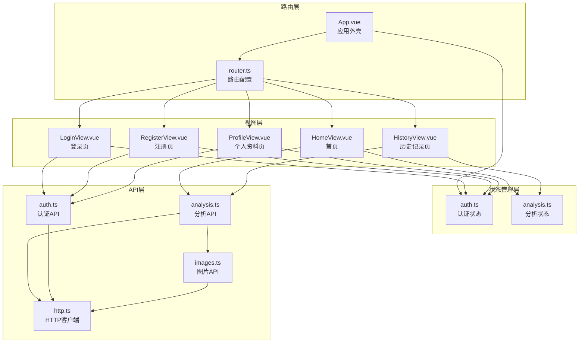
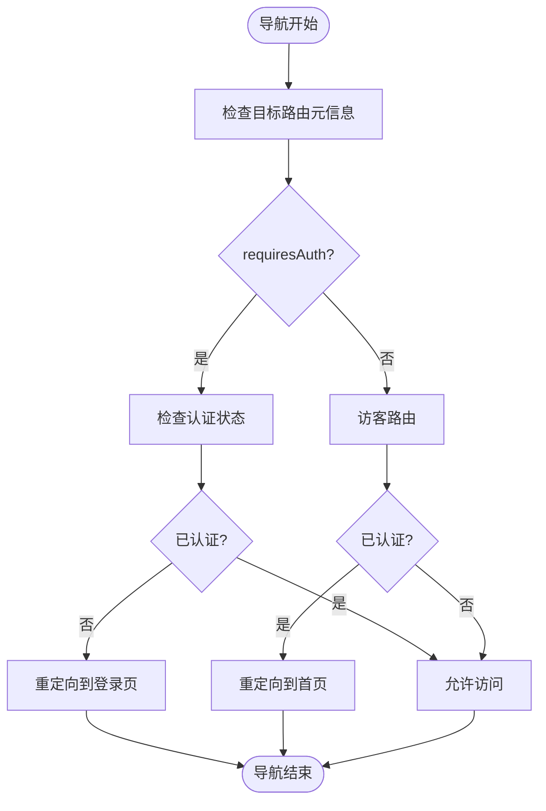
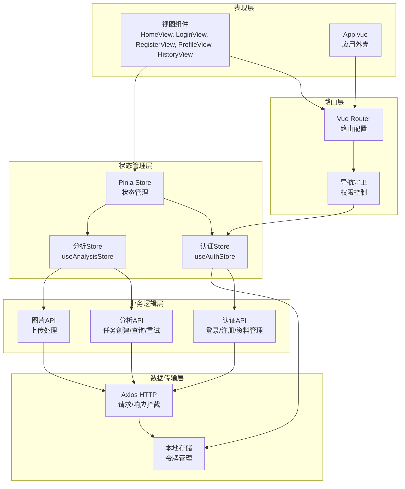
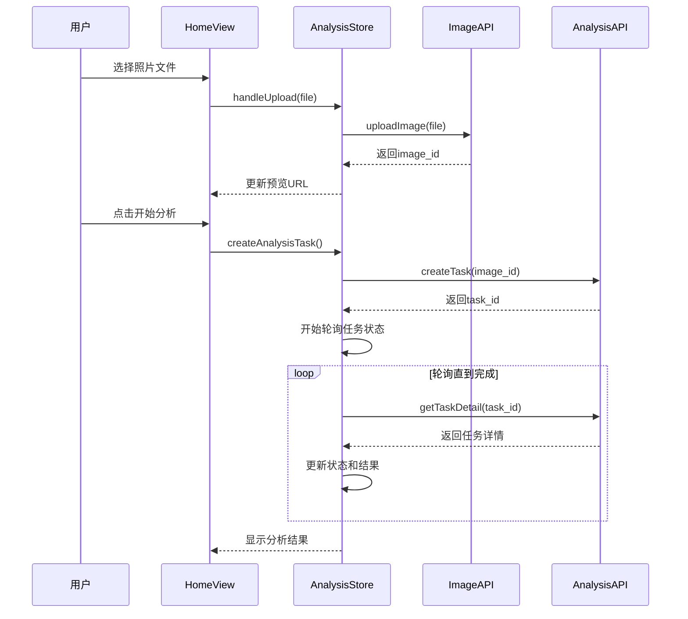
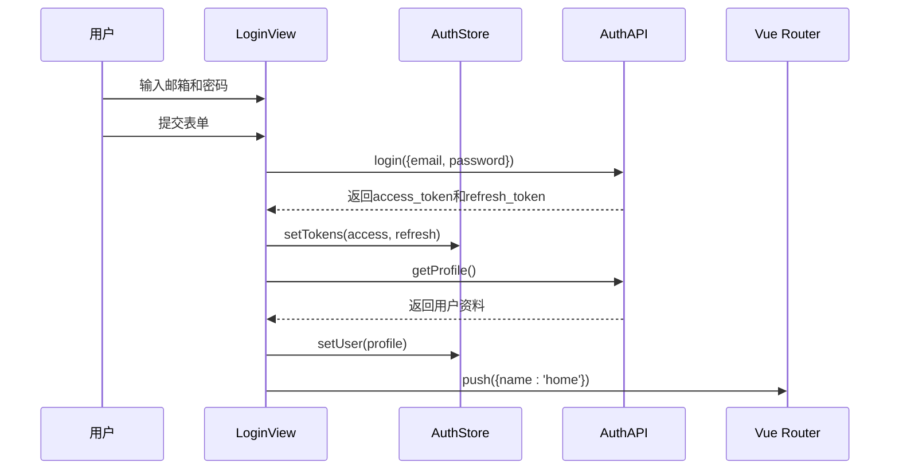
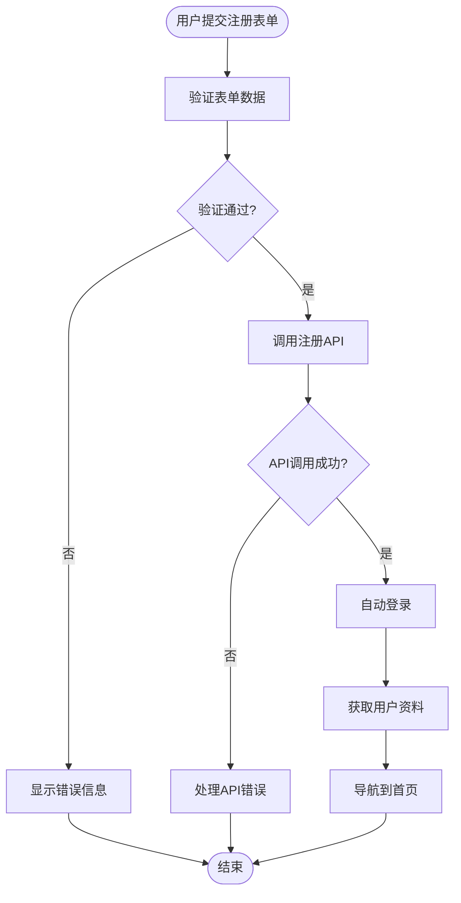
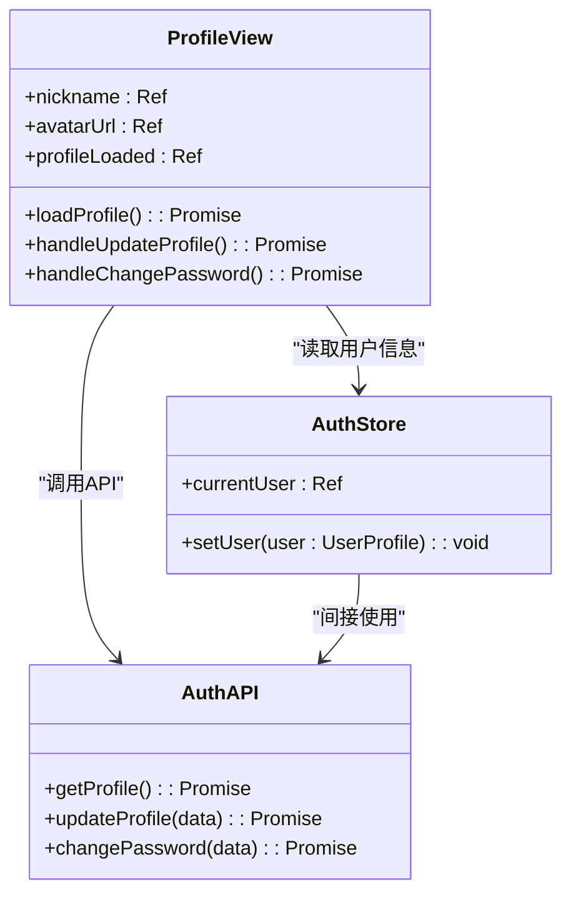
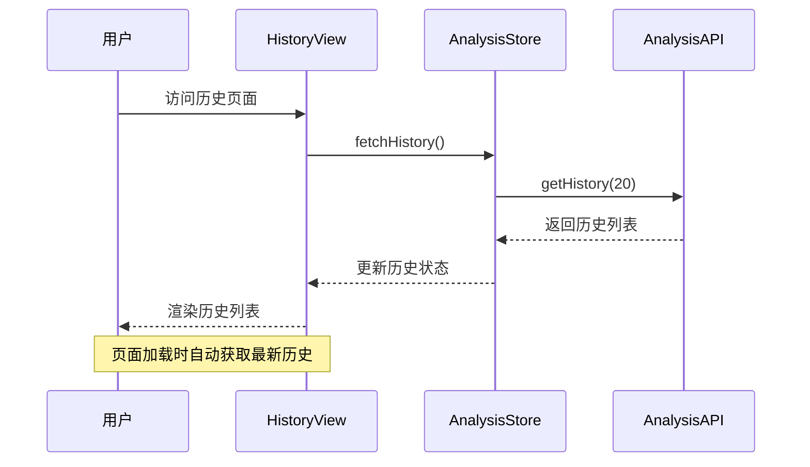
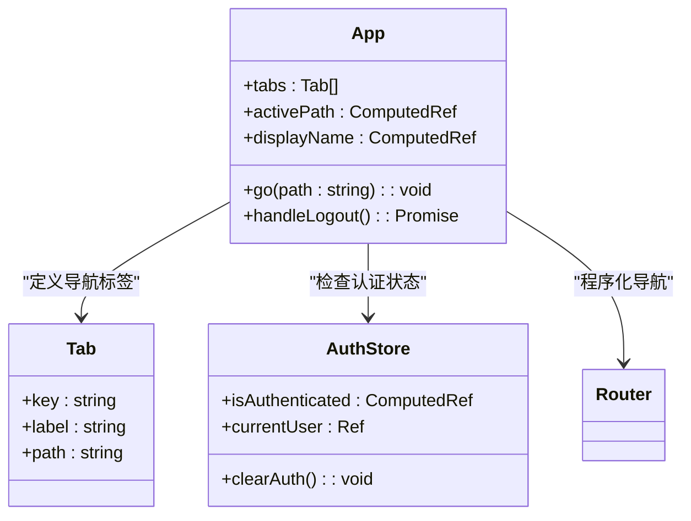
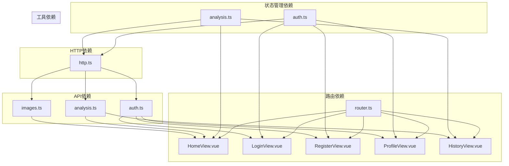

# 路由系统设计

<cite>
**本文档引用的文件**
- [apps/web/src/router.ts](file://apps/web/src/router.ts)
- [apps/web/src/main.ts](file://apps/web/src/main.ts)
- [apps/web/src/App.vue](file://apps/web/src/App.vue)
- [apps/web/src/views/HomeView.vue](file://apps/web/src/views/HomeView.vue)
- [apps/web/src/views/LoginView.vue](file://apps/web/src/views/LoginView.vue)
- [apps/web/src/views/RegisterView.vue](file://apps/web/src/views/RegisterView.vue)
- [apps/web/src/views/ProfileView.vue](file://apps/web/src/views/ProfileView.vue)
- [apps/web/src/views/HistoryView.vue](file://apps/web/src/views/HistoryView.vue)
- [apps/web/src/stores/auth.ts](file://apps/web/src/stores/auth.ts)
- [apps/web/src/stores/analysis.ts](file://apps/web/src/stores/analysis.ts)
- [apps/web/src/api/auth.ts](file://apps/web/src/api/auth.ts)
- [apps/web/src/api/analysis.ts](file://apps/web/src/api/analysis.ts)
- [apps/web/src/api/images.ts](file://apps/web/src/api/images.ts)
- [apps/web/src/api/http.ts](file://apps/web/src/api/http.ts)
</cite>

## 目录
1. [简介](#简介)
2. [项目结构](#项目结构)
3. [核心组件](#核心组件)
4. [架构概览](#架构概览)
5. [详细组件分析](#详细组件分析)
6. [依赖关系分析](#依赖关系分析)
7. [性能考虑](#性能考虑)
8. [故障排除指南](#故障排除指南)
9. [结论](#结论)

## 简介

AI摄影教练路由系统是一个基于Vue 3和Vue Router构建的单页应用(SPA)，专注于为用户提供AI摄影分析服务。该系统采用现代前端架构，通过路由守卫实现权限控制，结合Pinia状态管理和Axios HTTP客户端实现完整的用户认证和照片分析工作流。

系统包含五个主要页面：首页用于照片分析，登录页用于用户认证，注册页用于新用户创建账户，个人资料页用于用户信息管理，历史记录页用于查看分析历史。所有路由都通过统一的导航守卫进行权限验证，确保只有认证用户才能访问受保护的页面。

## 项目结构

路由系统采用模块化设计，主要文件组织如下：

**图表来源**
- [apps/web/src/router.ts:1-30](file://apps/web/src/router.ts#L1-L30)
- [apps/web/src/App.vue:1-96](file://apps/web/src/App.vue#L1-L96)
- [apps/web/src/stores/auth.ts:1-41](file://apps/web/src/stores/auth.ts#L1-L41)
- [apps/web/src/stores/analysis.ts:1-142](file://apps/web/src/stores/analysis.ts#L1-L142)

**章节来源**
- [apps/web/src/router.ts:1-30](file://apps/web/src/router.ts#L1-L30)
- [apps/web/src/main.ts:1-14](file://apps/web/src/main.ts#L1-L14)

## 核心组件

### 路由配置系统

路由系统采用Vue Router 4的组合式API设计，通过createRouter和createWebHistory创建历史模式路由。路由表包含五个主要页面，每个页面都有明确的元信息(meta)用于权限控制。

路由配置特点：
- **历史模式**：使用HTML5 History API，提供干净的URL
- **元信息驱动**：通过meta字段区分访客页面和认证页面
- **命名路由**：所有路由都具有唯一的名称，便于程序化导航
- **集中式配置**：路由定义集中在单一文件中，便于维护

### 导航守卫实现

系统实现了全局前置导航守卫，通过beforeEach钩子实现智能权限控制：

**图表来源**
- [apps/web/src/router.ts:21-30](file://apps/web/src/router.ts#L21-L30)

**章节来源**
- [apps/web/src/router.ts:10-30](file://apps/web/src/router.ts#L10-L30)

## 架构概览

系统采用分层架构设计，各层职责清晰分离：

**图表来源**
- [apps/web/src/App.vue:1-96](file://apps/web/src/App.vue#L1-L96)
- [apps/web/src/stores/auth.ts:1-41](file://apps/web/src/stores/auth.ts#L1-L41)
- [apps/web/src/stores/analysis.ts:1-142](file://apps/web/src/stores/analysis.ts#L1-L142)
- [apps/web/src/api/http.ts:1-94](file://apps/web/src/api/http.ts#L1-L94)

## 详细组件分析

### 首页组件 (HomeView)

首页是系统的核心功能页面，提供照片上传和AI分析功能：

**图表来源**
- [apps/web/src/views/HomeView.vue:1-111](file://apps/web/src/views/HomeView.vue#L1-L111)
- [apps/web/src/stores/analysis.ts:34-90](file://apps/web/src/stores/analysis.ts#L34-L90)

首页功能特性：
- **文件上传**：支持图片文件选择和预览
- **任务创建**：调用后端API创建分析任务
- **状态轮询**：实时监控分析进度
- **结果展示**：显示AI分析的总结和建议
- **错误处理**：提供重试机制和错误提示

**章节来源**
- [apps/web/src/views/HomeView.vue:1-111](file://apps/web/src/views/HomeView.vue#L1-L111)
- [apps/web/src/stores/analysis.ts:23-142](file://apps/web/src/stores/analysis.ts#L23-L142)

### 登录页面 (LoginView)

登录页面负责用户身份验证和令牌管理：

**图表来源**
- [apps/web/src/views/LoginView.vue:15-46](file://apps/web/src/views/LoginView.vue#L15-L46)
- [apps/web/src/api/auth.ts:33-35](file://apps/web/src/api/auth.ts#L33-L35)

登录流程特点：
- **表单验证**：前端基础验证确保必填字段完整
- **令牌存储**：使用localStorage持久化存储认证令牌
- **用户资料**：登录成功后获取并缓存用户信息
- **导航跳转**：成功登录后自动跳转到首页

**章节来源**
- [apps/web/src/views/LoginView.vue:1-127](file://apps/web/src/views/LoginView.vue#L1-L127)
- [apps/web/src/api/auth.ts:29-47](file://apps/web/src/api/auth.ts#L29-L47)

### 注册页面 (RegisterView)

注册页面提供新用户创建账户的功能：

**图表来源**
- [apps/web/src/views/RegisterView.vue:25-67](file://apps/web/src/views/RegisterView.vue#L25-L67)

注册流程特性：
- **密码强度验证**：确保密码长度至少8位
- **重复密码验证**：确认两次输入的密码一致
- **自动登录**：注册成功后自动完成登录流程
- **可选昵称**：昵称字段为可选项

**章节来源**
- [apps/web/src/views/RegisterView.vue:1-160](file://apps/web/src/views/RegisterView.vue#L1-L160)

### 个人资料页面 (ProfileView)

个人资料页面允许用户查看和编辑个人信息：

**图表来源**
- [apps/web/src/views/ProfileView.vue:1-243](file://apps/web/src/views/ProfileView.vue#L1-L243)
- [apps/web/src/stores/auth.ts:27-29](file://apps/web/src/stores/auth.ts#L27-L29)

个人资料功能：
- **资料展示**：显示用户的邮箱、昵称、头像等信息
- **资料编辑**：支持修改昵称和头像URL
- **密码修改**：提供安全的密码修改功能
- **状态反馈**：操作成功和失败的状态提示

**章节来源**
- [apps/web/src/views/ProfileView.vue:1-243](file://apps/web/src/views/ProfileView.vue#L1-L243)

### 历史记录页面 (HistoryView)

历史记录页面展示用户的分析历史：

**图表来源**
- [apps/web/src/views/HistoryView.vue:14-16](file://apps/web/src/views/HistoryView.vue#L14-L16)
- [apps/web/src/stores/analysis.ts:96-104](file://apps/web/src/stores/analysis.ts#L96-L104)

历史记录特性：
- **自动加载**：页面挂载时自动获取历史数据
- **分页限制**：默认显示最近20条记录
- **格式化显示**：时间戳格式化为本地化字符串
- **空状态处理**：无历史记录时显示友好提示

**章节来源**
- [apps/web/src/views/HistoryView.vue:1-42](file://apps/web/src/views/HistoryView.vue#L1-L42)
- [apps/web/src/stores/analysis.ts:96-104](file://apps/web/src/stores/analysis.ts#L96-L104)

### 应用外壳 (App.vue)

应用外壳提供全局导航和用户界面：

**图表来源**
- [apps/web/src/App.vue:10-32](file://apps/web/src/App.vue#L10-L32)
- [apps/web/src/stores/auth.ts:10](file://apps/web/src/stores/auth.ts#L10)

应用外壳功能：
- **全局导航**：提供底部导航栏，包含首页、历史、个人三个主要页面
- **用户状态显示**：显示当前登录用户的昵称或邮箱
- **登出功能**：一键清除认证状态并返回登录页
- **条件渲染**：仅在用户认证时显示导航栏

**章节来源**
- [apps/web/src/App.vue:1-96](file://apps/web/src/App.vue#L1-L96)

## 依赖关系分析

系统采用松耦合的设计，各组件间依赖关系清晰：

**图表来源**
- [apps/web/src/router.ts:4-8](file://apps/web/src/router.ts#L4-L8)
- [apps/web/src/stores/auth.ts:1-41](file://apps/web/src/stores/auth.ts#L1-L41)
- [apps/web/src/stores/analysis.ts:1-142](file://apps/web/src/stores/analysis.ts#L1-L142)

**章节来源**
- [apps/web/src/router.ts:1-30](file://apps/web/src/router.ts#L1-L30)
- [apps/web/src/stores/auth.ts:1-41](file://apps/web/src/stores/auth.ts#L1-L41)
- [apps/web/src/stores/analysis.ts:1-142](file://apps/web/src/stores/analysis.ts#L1-L142)

## 性能考虑

### 路由性能优化

1. **懒加载策略**：当前路由配置直接导入组件，对于大型应用建议使用动态导入实现按需加载
2. **状态缓存**：Pinia store提供内存状态缓存，减少重复API调用
3. **轮询优化**：分析任务轮询间隔为1800ms，平衡了实时性和性能

### 组件性能优化

1. **计算属性**：广泛使用computed进行响应式数据计算，避免不必要的重新渲染
2. **生命周期管理**：在组件卸载时清理轮询，防止内存泄漏
3. **条件渲染**：根据状态条件性渲染内容，减少DOM节点数量

### 网络性能优化

1. **请求拦截器**：统一添加认证头，避免重复代码
2. **自动刷新机制**：401错误时自动刷新令牌，提升用户体验
3. **错误队列**：并发请求时的令牌刷新排队机制

## 故障排除指南

### 常见问题及解决方案

#### 认证相关问题

**问题**：登录后无法访问受保护页面
- **原因**：localStorage中的令牌丢失或过期
- **解决方案**：检查浏览器localStorage，确认令牌存在且有效

**问题**：页面频繁重定向到登录页
- **原因**：后端认证服务异常或令牌无效
- **解决方案**：检查网络连接和后端API状态

#### 分析功能问题

**问题**：照片上传失败
- **原因**：文件大小超过限制或格式不支持
- **解决方案**：检查文件类型和大小，确保符合要求

**问题**：分析任务长时间处于排队状态
- **原因**：后端处理队列繁忙
- **解决方案**：稍后重试或联系技术支持

#### 导航问题

**问题**：路由跳转不生效
- **原因**：导航守卫阻止了访问
- **解决方案**：检查用户认证状态和路由元信息

**章节来源**
- [apps/web/src/api/http.ts:37-91](file://apps/web/src/api/http.ts#L37-L91)
- [apps/web/src/router.ts:21-30](file://apps/web/src/router.ts#L21-L30)

## 结论

AI摄影教练路由系统展现了现代Vue.js应用的最佳实践：

**架构优势**：
- 清晰的分层架构，职责分离明确
- 基于元信息的权限控制系统
- 完整的用户认证和授权流程
- 响应式的状态管理模式

**技术特色**：
- 组合式API的现代化开发体验
- 类型安全的TypeScript实现
- 完善的错误处理和用户反馈机制
- 友好的用户体验设计

**改进建议**：
- 实现路由级别的懒加载以提升首屏性能
- 添加路由元信息的类型定义增强类型安全
- 考虑实现路由缓存策略优化页面切换性能
- 增加更详细的日志记录便于调试和监控

该路由系统为AI摄影分析应用提供了稳定可靠的技术基础，通过合理的架构设计和完善的权限控制，确保了良好的用户体验和系统的可维护性。