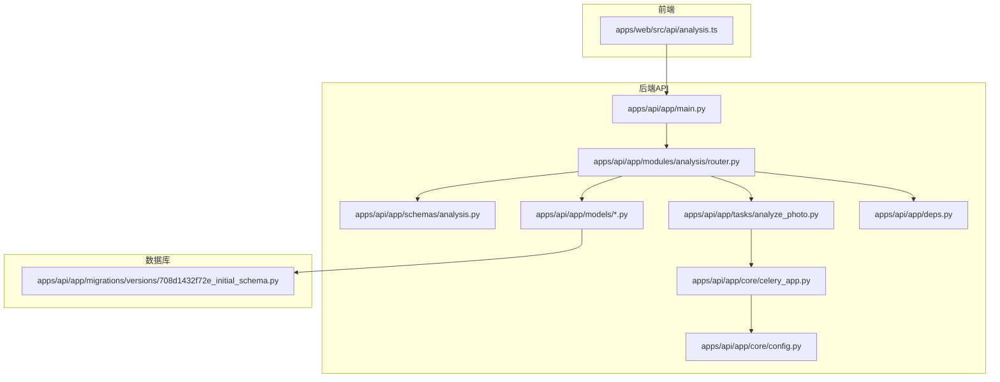
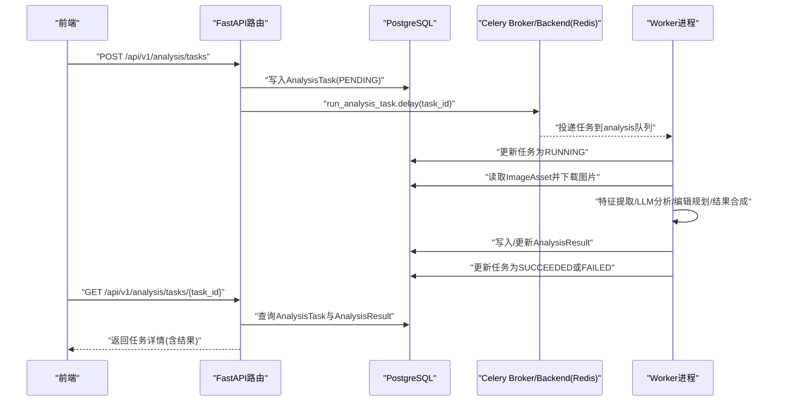
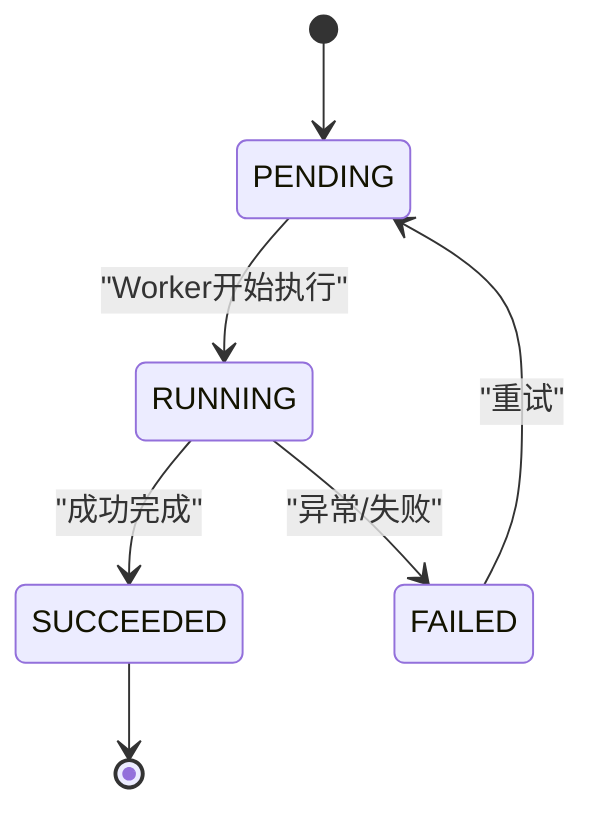
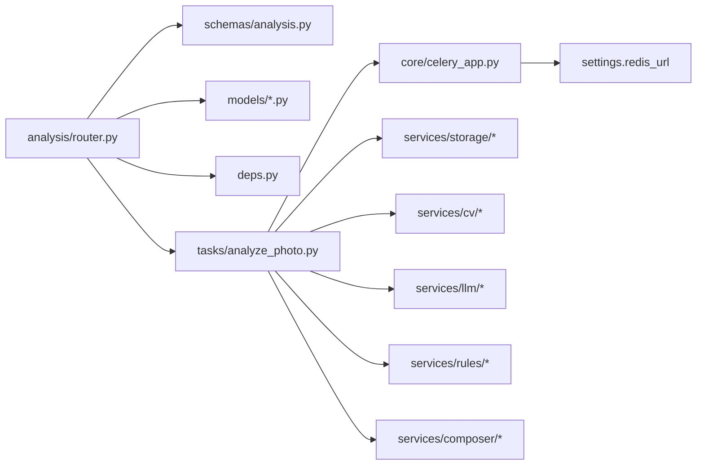

# 分析API

<cite>
**本文引用的文件**
- [apps/api/app/main.py](file://apps/api/app/main.py)
- [apps/api/app/modules/analysis/router.py](file://apps/api/app/modules/analysis/router.py)
- [apps/api/app/schemas/analysis.py](file://apps/api/app/schemas/analysis.py)
- [apps/api/app/models/analysis_task.py](file://apps/api/app/models/analysis_task.py)
- [apps/api/app/models/analysis_result.py](file://apps/api/app/models/analysis_result.py)
- [apps/api/app/models/image_asset.py](file://apps/api/app/models/image_asset.py)
- [apps/api/app/tasks/analyze_photo.py](file://apps/api/app/tasks/analyze_photo.py)
- [apps/api/app/core/celery_app.py](file://apps/api/app/core/celery_app.py)
- [apps/api/app/core/config.py](file://apps/api/app/core/config.py)
- [apps/api/app/deps.py](file://apps/api/app/deps.py)
- [apps/web/src/api/analysis.ts](file://apps/web/src/api/analysis.ts)
- [apps/api/app/migrations/versions/708d1432f72e_initial_schema.py](file://apps/api/app/migrations/versions/708d1432f72e_initial_schema.py)
</cite>

## 目录
1. [简介](#简介)
2. [项目结构](#项目结构)
3. [核心组件](#核心组件)
4. [架构总览](#架构总览)
5. [详细组件分析](#详细组件分析)
6. [依赖分析](#依赖分析)
7. [性能考虑](#性能考虑)
8. [故障排查指南](#故障排查指南)
9. [结论](#结论)
10. [附录](#附录)

## 简介
本文件为“AI摄影教练”项目的分析API完整技术文档，覆盖以下核心能力：
- 异步图像分析任务的创建、状态查询、历史记录与重试机制
- 任务状态流转（PENDING、RUNNING、SUCCEEDED、FAILED）
- 错误处理与错误码说明
- 任务队列工作原理与Celery集成方式
- 请求/响应示例与常见问题排查

该API基于FastAPI构建，采用JWT认证，使用PostgreSQL存储任务与结果，Redis作为消息中间件与Celery后端，通过异步任务队列执行图像分析。

## 项目结构
- 后端API应用位于 apps/api，包含路由、模型、服务、任务与配置
- 前端位于 apps/web，提供调用分析API的示例实现
- 数据库迁移脚本定义了 analysis_tasks、analysis_results、analysis_features 等核心表



图表来源
- [apps/api/app/main.py:1-36](file://apps/api/app/main.py#L1-L36)
- [apps/api/app/modules/analysis/router.py:1-151](file://apps/api/app/modules/analysis/router.py#L1-L151)
- [apps/api/app/schemas/analysis.py:1-52](file://apps/api/app/schemas/analysis.py#L1-L52)
- [apps/api/app/models/analysis_task.py:1-36](file://apps/api/app/models/analysis_task.py#L1-L36)
- [apps/api/app/models/analysis_result.py:1-28](file://apps/api/app/models/analysis_result.py#L1-L28)
- [apps/api/app/models/image_asset.py:1-32](file://apps/api/app/models/image_asset.py#L1-L32)
- [apps/api/app/tasks/analyze_photo.py:1-108](file://apps/api/app/tasks/analyze_photo.py#L1-L108)
- [apps/api/app/core/celery_app.py:1-21](file://apps/api/app/core/celery_app.py#L1-L21)
- [apps/api/app/core/config.py:1-47](file://apps/api/app/core/config.py#L1-L47)
- [apps/api/app/deps.py:1-41](file://apps/api/app/deps.py#L1-L41)
- [apps/web/src/api/analysis.ts:1-101](file://apps/web/src/api/analysis.ts#L1-L101)
- [apps/api/app/migrations/versions/708d1432f72e_initial_schema.py:1-138](file://apps/api/app/migrations/versions/708d1432f72e_initial_schema.py#L1-L138)

章节来源
- [apps/api/app/main.py:1-36](file://apps/api/app/main.py#L1-L36)
- [apps/api/app/modules/analysis/router.py:1-151](file://apps/api/app/modules/analysis/router.py#L1-L151)
- [apps/api/app/migrations/versions/708d1432f72e_initial_schema.py:22-118](file://apps/api/app/migrations/versions/708d1432f72e_initial_schema.py#L22-L118)

## 核心组件
- 路由器与端点
  - 创建任务：POST /api/v1/analysis/tasks
  - 查询任务详情：GET /api/v1/analysis/tasks/{task_id}
  - 历史记录：GET /api/v1/analysis/history
  - 重试任务：POST /api/v1/analysis/tasks/{task_id}/retry
- Pydantic模型（请求/响应）
  - CreateAnalysisTaskRequest、CreateAnalysisTaskResponse
  - AnalysisTaskDetailResponse、AnalysisHistoryItem、AnalysisHistoryResponse
  - RetryTaskResponse
- ORM模型
  - AnalysisTask、AnalysisResult、ImageAsset
- 异步任务
  - run_analysis_task：执行特征提取、LLM分析、编辑规划与结果合成
- Celery集成
  - Redis作为broker与backend，任务路由到analysis队列

章节来源
- [apps/api/app/modules/analysis/router.py:45-151](file://apps/api/app/modules/analysis/router.py#L45-L151)
- [apps/api/app/schemas/analysis.py:8-52](file://apps/api/app/schemas/analysis.py#L8-L52)
- [apps/api/app/models/analysis_task.py:10-36](file://apps/api/app/models/analysis_task.py#L10-L36)
- [apps/api/app/models/analysis_result.py:10-28](file://apps/api/app/models/analysis_result.py#L10-L28)
- [apps/api/app/models/image_asset.py:10-32](file://apps/api/app/models/image_asset.py#L10-L32)
- [apps/api/app/tasks/analyze_photo.py:19-108](file://apps/api/app/tasks/analyze_photo.py#L19-L108)
- [apps/api/app/core/celery_app.py:5-21](file://apps/api/app/core/celery_app.py#L5-L21)

## 架构总览
下图展示了从前端到API、数据库与Celery任务队列的整体交互：



图表来源
- [apps/api/app/modules/analysis/router.py:45-151](file://apps/api/app/modules/analysis/router.py#L45-L151)
- [apps/api/app/tasks/analyze_photo.py:19-108](file://apps/api/app/tasks/analyze_photo.py#L19-L108)
- [apps/api/app/core/celery_app.py:5-21](file://apps/api/app/core/celery_app.py#L5-L21)
- [apps/api/app/models/analysis_task.py:10-36](file://apps/api/app/models/analysis_task.py#L10-L36)
- [apps/api/app/models/analysis_result.py:10-28](file://apps/api/app/models/analysis_result.py#L10-L28)
- [apps/api/app/models/image_asset.py:10-32](file://apps/api/app/models/image_asset.py#L10-L32)

## 详细组件分析

### 端点：创建分析任务（POST /api/v1/analysis/tasks）
- 功能概述
  - 校验图像资产归属与存在性
  - 写入AnalysisTask（状态PENDING）
  - 异步投递run_analysis_task任务
  - 返回任务ID、类型与初始状态
- 请求参数
  - image_id：UUID，目标图像资产ID
- 响应字段
  - task_id：任务ID
  - task_type：固定为“ANALYZE”
  - status：初始为“PENDING”
- 权限与鉴权
  - 使用Bearer Token进行JWT认证
  - 仅允许任务所属用户操作
- 错误码
  - 404：图像不存在
  - 403：无权限访问该图像
- 示例
  - 请求：POST /api/v1/analysis/tasks
  - 请求体：{"image_id": "<图像ID>"}
  - 成功响应：{"task_id": "<任务ID>", "task_type": "ANALYZE", "status": "PENDING"}

章节来源
- [apps/api/app/modules/analysis/router.py:45-74](file://apps/api/app/modules/analysis/router.py#L45-L74)
- [apps/api/app/schemas/analysis.py:8-16](file://apps/api/app/schemas/analysis.py#L8-L16)
- [apps/api/app/deps.py:15-41](file://apps/api/app/deps.py#L15-L41)

### 端点：查询任务详情（GET /api/v1/analysis/tasks/{task_id}）
- 功能概述
  - 校验任务归属与存在性
  - 查询AnalysisTask与AnalysisResult
  - 返回任务状态、元数据与最终结果JSON
- 响应字段
  - 包含任务基础信息、尝试次数、错误码/消息、时间戳
  - result：AnalysisResult中的result_json（若存在）
- 权限与鉴权
  - 仅任务所属用户可见
- 错误码
  - 404：任务不存在
  - 403：无权限访问该任务
- 示例
  - 请求：GET /api/v1/analysis/tasks/<task_id>
  - 成功响应：包含任务详情与result字段

章节来源
- [apps/api/app/modules/analysis/router.py:76-90](file://apps/api/app/modules/analysis/router.py#L76-L90)
- [apps/api/app/schemas/analysis.py:18-32](file://apps/api/app/schemas/analysis.py#L18-L32)
- [apps/api/app/deps.py:15-41](file://apps/api/app/deps.py#L15-L41)

### 端点：历史记录（GET /api/v1/analysis/history）
- 功能概述
  - 分页查询当前用户的历史任务
  - 支持limit参数（默认20，范围1..100）
  - 提供摘要字段（来自AnalysisResult.summary）
- 响应字段
  - items：列表，每项包含任务ID、图像ID、类型、状态、时间戳与摘要
- 示例
  - 请求：GET /api/v1/analysis/history?limit=20
  - 成功响应：{"items": [...]}

章节来源
- [apps/api/app/modules/analysis/router.py:92-126](file://apps/api/app/modules/analysis/router.py#L92-L126)
- [apps/api/app/schemas/analysis.py:34-46](file://apps/api/app/schemas/analysis.py#L34-L46)

### 端点：重试任务（POST /api/v1/analysis/tasks/{task_id}/retry）
- 功能概述
  - 仅对FAILED或SUCCEEDED的任务允许重试
  - 将任务重置为PENDING并重新投递run_analysis_task
- 行为约束
  - 若任务仍在RUNNING中，返回400
- 响应字段
  - task_id、task_type、status（默认为“PENDING”）
- 示例
  - 请求：POST /api/v1/analysis/tasks/<task_id>/retry
  - 成功响应：{"task_id": "<task_id>", "task_type": "ANALYZE", "status": "PENDING"}

章节来源
- [apps/api/app/modules/analysis/router.py:128-151](file://apps/api/app/modules/analysis/router.py#L128-L151)
- [apps/api/app/schemas/analysis.py:48-52](file://apps/api/app/schemas/analysis.py#L48-L52)

### 任务状态流转与错误处理
- 状态机
  - PENDING → RUNNING → SUCCEEDED 或 FAILED
- 生命周期关键点
  - 创建任务时写入PENDING
  - Worker执行前更新为RUNNING并自增attempt_count
  - 成功：写入AnalysisResult，状态SUCCEEDED
  - 失败：回滚事务，记录error_code与error_message，状态FAILED
- 错误码与消息
  - 404：资源不存在（图像/任务）
  - 403：无权限
  - 400：任务仍在运行（不可重试）



图表来源
- [apps/api/app/tasks/analyze_photo.py:24-108](file://apps/api/app/tasks/analyze_photo.py#L24-L108)
- [apps/api/app/modules/analysis/router.py:139-140](file://apps/api/app/modules/analysis/router.py#L139-L140)

### 数据模型与索引
- AnalysisTask
  - 字段：id、user_id、image_id、task_type、status、model_name、prompt_version、attempt_count、error_code、error_message、created_at、started_at、finished_at
  - 索引：按user_id与created_at排序；按status与created_at排序
- AnalysisResult
  - 字段：id、task_id（唯一）、image_id、version、result_json、created_at
  - 索引：按image_id与created_at排序；result_json使用GIN索引
- ImageAsset
  - 字段：id、user_id、parent_image_id、asset_type、storage_provider、bucket、object_key、mime_type、size_bytes、width、height、sha256、exif_json、created_at
  - 约束：bucket+object_key唯一

```mermaid
erDiagram
USERS {
uuid id PK
string email UK
string nickname
boolean is_active
timestamp created_at
}
IMAGE_ASSETS {
uuid id PK
uuid user_id FK
uuid parent_image_id FK
string asset_type
string storage_provider
string bucket
string object_key
string mime_type
int size_bytes
int width
int height
string sha256
jsonb exif_json
timestamp created_at
}
ANALYSIS_TASKS {
uuid id PK
uuid user_id FK
uuid image_id FK
string task_type
string status
string model_name
string prompt_version
int attempt_count
string error_code
text error_message
timestamp created_at
timestamp started_at
timestamp finished_at
}
ANALYSIS_RESULTS {
uuid id PK
uuid task_id FK UK
uuid image_id FK
string version
jsonb result_json
timestamp created_at
}
USERS ||--o{ IMAGE_ASSETS : "拥有"
IMAGE_ASSETS ||--o{ ANALYSIS_TASKS : "被分析"
ANALYSIS_TASKS ||--|| ANALYSIS_RESULTS : "产生结果"
```

图表来源
- [apps/api/app/migrations/versions/708d1432f72e_initial_schema.py:22-118](file://apps/api/app/migrations/versions/708d1432f72e_initial_schema.py#L22-L118)
- [apps/api/app/models/analysis_task.py:10-36](file://apps/api/app/models/analysis_task.py#L10-L36)
- [apps/api/app/models/analysis_result.py:10-28](file://apps/api/app/models/analysis_result.py#L10-L28)
- [apps/api/app/models/image_asset.py:10-32](file://apps/api/app/models/image_asset.py#L10-L32)

## 依赖分析
- 组件耦合
  - 路由器依赖数据库会话、当前用户ID依赖JWT认证
  - 任务依赖存储服务下载图片，依赖多个子服务（特征提取、LLM、规则编辑、结果合成）
- 外部依赖
  - Redis：Celery broker与backend
  - PostgreSQL：持久化任务与结果
  - MinIO/S3：图片对象存储
- 队列与路由
  - 任务名称：app.tasks.analyze_photo.run_analysis_task
  - 队列：analysis



图表来源
- [apps/api/app/modules/analysis/router.py:1-25](file://apps/api/app/modules/analysis/router.py#L1-L25)
- [apps/api/app/schemas/analysis.py:1-21](file://apps/api/app/schemas/analysis.py#L1-L21)
- [apps/api/app/tasks/analyze_photo.py:1-17](file://apps/api/app/tasks/analyze_photo.py#L1-L17)
- [apps/api/app/core/celery_app.py:5-21](file://apps/api/app/core/celery_app.py#L5-L21)
- [apps/api/app/core/config.py:13-14](file://apps/api/app/core/config.py#L13-L14)

章节来源
- [apps/api/app/core/celery_app.py:5-21](file://apps/api/app/core/celery_app.py#L5-L21)
- [apps/api/app/core/config.py:13-14](file://apps/api/app/core/config.py#L13-L14)
- [apps/api/app/deps.py:15-41](file://apps/api/app/deps.py#L15-L41)

## 性能考虑
- 数据库索引
  - analysis_tasks：按user_id/created_at与status/created_at索引，支持高效分页与筛选
  - analysis_results：result_json使用GIN索引，便于复杂JSON查询
- 任务并发
  - 通过Celery队列隔离与多worker并行提升吞吐
- I/O优化
  - 图片下载与特征提取/LLM分析为I/O密集步骤，建议合理设置worker数量与队列优先级
- 前端轮询
  - 建议在任务状态为RUNNING时采用指数退避策略轮询，避免频繁请求

## 故障排查指南
- 常见错误与定位
  - 404：检查image_id或task_id是否正确；确认资源归属
  - 403：确认Bearer Token有效且用户匹配
  - 400：若任务仍为RUNNING，等待完成后重试
  - FAILED：查看任务的error_code与error_message，定位具体异常
- 日志与监控
  - 在Worker侧打印任务ID与阶段日志，便于追踪
  - 监控Redis队列长度与任务耗时分布
- 重试策略
  - 对FAILED任务使用/retry端点重置为PENDING并重新执行
  - 避免对RUNNING任务重复重试

章节来源
- [apps/api/app/modules/analysis/router.py:83-86](file://apps/api/app/modules/analysis/router.py#L83-L86)
- [apps/api/app/modules/analysis/router.py:135-140](file://apps/api/app/modules/analysis/router.py#L135-L140)
- [apps/api/app/tasks/analyze_photo.py:97-106](file://apps/api/app/tasks/analyze_photo.py#L97-L106)

## 结论
本分析API通过清晰的端点设计与严格的权限控制，结合Celery异步任务与PostgreSQL持久化，实现了从任务创建、执行、结果落库到历史查询与重试的完整闭环。建议在生产环境中完善超时与重试策略、增加任务幂等键与速率限制，并持续优化特征提取与LLM分析的性能。

## 附录

### 请求/响应示例（路径引用）
- 创建任务
  - 请求：POST /api/v1/analysis/tasks
  - 请求体：{"image_id": "<图像ID>"}
  - 响应：CreateAnalysisTaskResponse
  - 参考：[apps/api/app/schemas/analysis.py:8-16](file://apps/api/app/schemas/analysis.py#L8-L16)
- 查询任务详情
  - 请求：GET /api/v1/analysis/tasks/{task_id}
  - 响应：AnalysisTaskDetailResponse
  - 参考：[apps/api/app/schemas/analysis.py:18-32](file://apps/api/app/schemas/analysis.py#L18-L32)
- 历史记录
  - 请求：GET /api/v1/analysis/history?limit=20
  - 响应：AnalysisHistoryResponse
  - 参考：[apps/api/app/schemas/analysis.py:34-46](file://apps/api/app/schemas/analysis.py#L34-L46)
- 重试任务
  - 请求：POST /api/v1/analysis/tasks/{task_id}/retry
  - 响应：RetryTaskResponse
  - 参考：[apps/api/app/schemas/analysis.py:48-52](file://apps/api/app/schemas/analysis.py#L48-L52)

### 错误码一览
- 401：未认证（Bearer Token缺失或无效）
- 403：无权限访问资源
- 404：资源不存在（图像/任务）
- 400：业务错误（如任务仍在运行）

章节来源
- [apps/api/app/deps.py:20-33](file://apps/api/app/deps.py#L20-L33)
- [apps/api/app/modules/analysis/router.py:53-56](file://apps/api/app/modules/analysis/router.py#L53-L56)
- [apps/api/app/modules/analysis/router.py:83-86](file://apps/api/app/modules/analysis/router.py#L83-L86)
- [apps/api/app/modules/analysis/router.py:135-140](file://apps/api/app/modules/analysis/router.py#L135-L140)