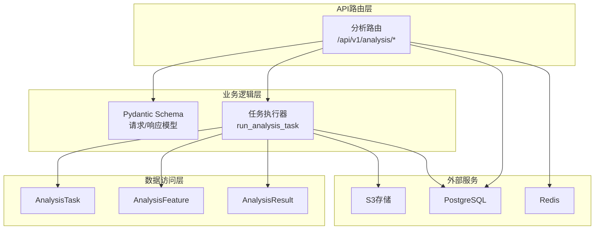
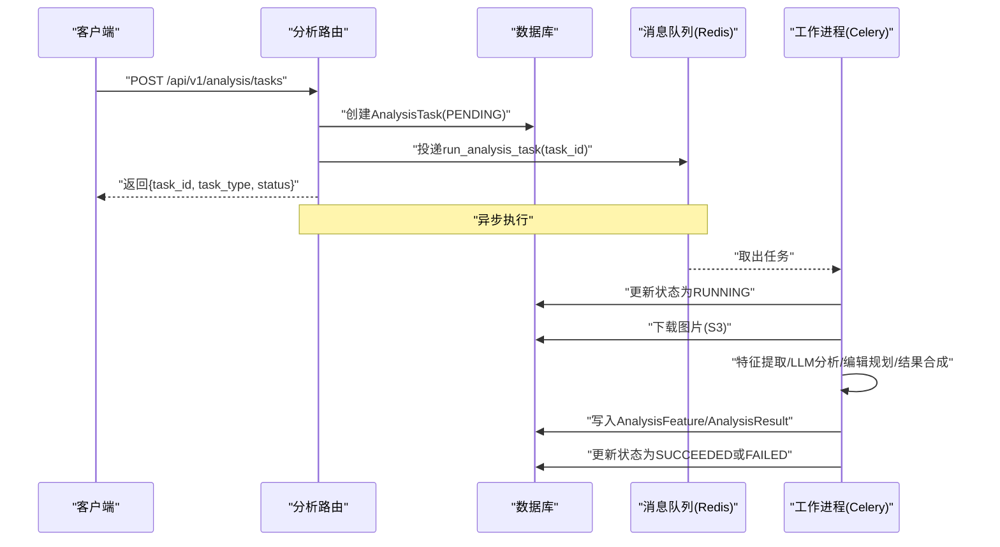
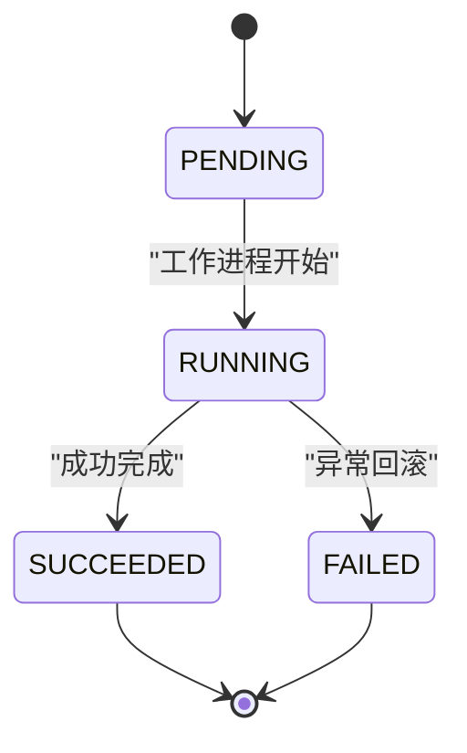
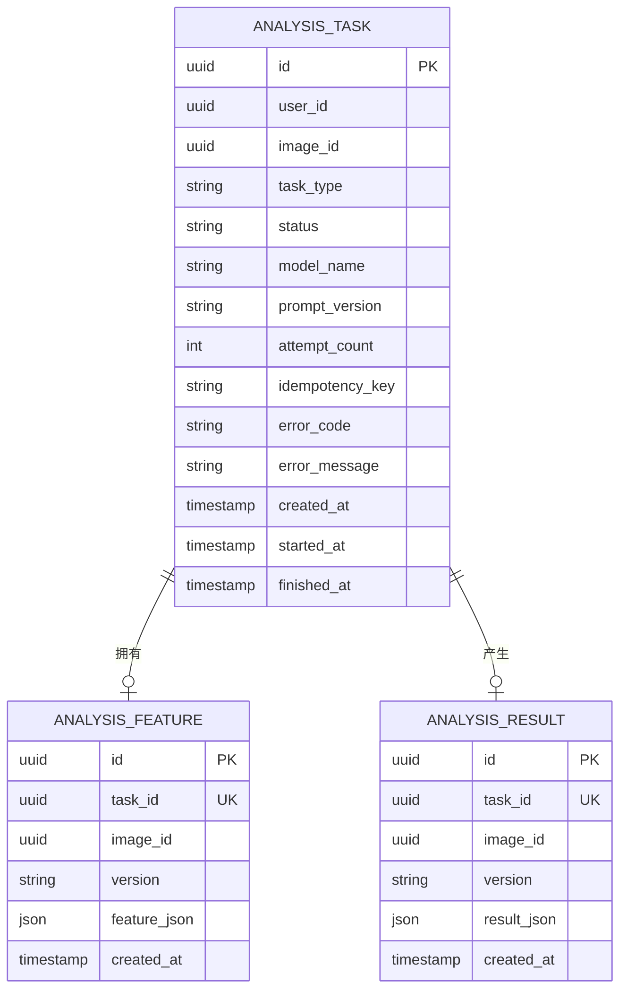
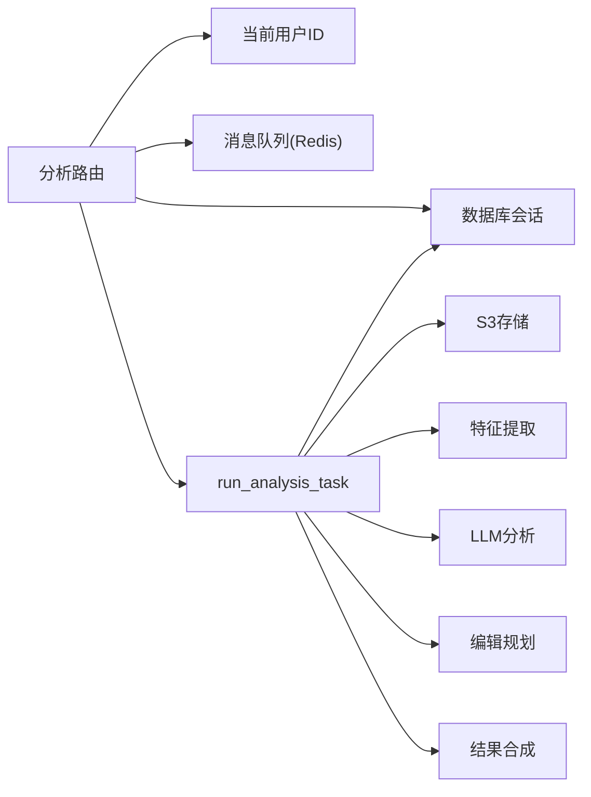

# 分析任务API

<cite>
**本文引用的文件**
- [apps/api/app/main.py](file://apps/api/app/main.py)
- [apps/api/app/modules/analysis/router.py](file://apps/api/app/modules/analysis/router.py)
- [apps/api/app/schemas/analysis.py](file://apps/api/app/schemas/analysis.py)
- [apps/api/app/models/analysis_task.py](file://apps/api/app/models/analysis_task.py)
- [apps/api/app/models/analysis_result.py](file://apps/api/app/models/analysis_result.py)
- [apps/api/app/models/analysis_feature.py](file://apps/api/app/models/analysis_feature.py)
- [apps/api/app/tasks/analyze_photo.py](file://apps/api/app/tasks/analyze_photo.py)
- [apps/api/app/core/config.py](file://apps/api/app/core/config.py)
</cite>

## 目录
1. [简介](#简介)
2. [项目结构](#项目结构)
3. [核心组件](#核心组件)
4. [架构总览](#架构总览)
5. [详细组件分析](#详细组件分析)
6. [依赖分析](#依赖分析)
7. [性能考虑](#性能考虑)
8. [故障排查指南](#故障排查指南)
9. [结论](#结论)
10. [附录](#附录)

## 简介
本文件为“AI摄影教练”项目中“分析任务API”的权威技术文档，覆盖以下内容：
- 任务创建、查询、历史查询与重试的完整接口定义
- 请求参数、响应结构与字段语义
- 异步任务状态流转（PENDING → RUNNING → SUCCEEDED/FAILED）
- 错误处理策略、重试机制与超时/重试限制建议
- 性能优化与最佳实践
- 完整的请求/响应示例路径与状态样例

## 项目结构
后端采用FastAPI + SQLAlchemy + Celery异步队列的分层架构：
- 路由层：在分析模块中定义REST接口
- 模型层：数据库实体（任务、特征、结果）
- 任务层：Celery任务执行具体分析流程
- 配置层：应用与外部服务（数据库、Redis、S3）配置

图表来源
- [apps/api/app/modules/analysis/router.py:1-151](file://apps/api/app/modules/analysis/router.py#L1-L151)
- [apps/api/app/tasks/analyze_photo.py:1-108](file://apps/api/app/tasks/analyze_photo.py#L1-L108)
- [apps/api/app/models/analysis_task.py:1-36](file://apps/api/app/models/analysis_task.py#L1-L36)
- [apps/api/app/models/analysis_feature.py:1-29](file://apps/api/app/models/analysis_feature.py#L1-L29)
- [apps/api/app/models/analysis_result.py:1-28](file://apps/api/app/models/analysis_result.py#L1-L28)
- [apps/api/app/core/config.py:1-47](file://apps/api/app/core/config.py#L1-L47)

章节来源
- [apps/api/app/main.py:1-36](file://apps/api/app/main.py#L1-L36)
- [apps/api/app/modules/analysis/router.py:1-151](file://apps/api/app/modules/analysis/router.py#L1-L151)
- [apps/api/app/core/config.py:1-47](file://apps/api/app/core/config.py#L1-L47)

## 核心组件
- 分析任务模型（AnalysisTask）：持久化任务元信息与状态
- 特征模型（AnalysisFeature）：缓存中间特征
- 结果模型（AnalysisResult）：缓存最终JSON结果
- 任务执行器（run_analysis_task）：Celery任务，串接特征提取、LLM分析、编辑规划与结果合成
- 路由与Schema：定义REST接口与请求/响应模型

章节来源
- [apps/api/app/models/analysis_task.py:1-36](file://apps/api/app/models/analysis_task.py#L1-L36)
- [apps/api/app/models/analysis_feature.py:1-29](file://apps/api/app/models/analysis_feature.py#L1-L29)
- [apps/api/app/models/analysis_result.py:1-28](file://apps/api/app/models/analysis_result.py#L1-L28)
- [apps/api/app/tasks/analyze_photo.py:1-108](file://apps/api/app/tasks/analyze_photo.py#L1-L108)
- [apps/api/app/schemas/analysis.py:1-52](file://apps/api/app/schemas/analysis.py#L1-L52)

## 架构总览
下图展示从HTTP请求到异步任务执行、数据库写入与结果返回的整体流程。

图表来源
- [apps/api/app/modules/analysis/router.py:45-74](file://apps/api/app/modules/analysis/router.py#L45-L74)
- [apps/api/app/tasks/analyze_photo.py:19-108](file://apps/api/app/tasks/analyze_photo.py#L19-L108)
- [apps/api/app/models/analysis_task.py:10-36](file://apps/api/app/models/analysis_task.py#L10-L36)
- [apps/api/app/models/analysis_feature.py:10-29](file://apps/api/app/models/analysis_feature.py#L10-L29)
- [apps/api/app/models/analysis_result.py:10-28](file://apps/api/app/models/analysis_result.py#L10-L28)

## 详细组件分析

### 接口总览
- 任务创建
  - 方法：POST
  - 路径：/api/v1/analysis/tasks
  - 权限：登录用户
  - 请求体：CreateAnalysisTaskRequest
  - 响应体：CreateAnalysisTaskResponse
- 任务详情查询
  - 方法：GET
  - 路径：/api/v1/analysis/tasks/{task_id}
  - 权限：仅任务所属用户
  - 响应体：AnalysisTaskDetailResponse
- 任务历史查询
  - 方法：GET
  - 路径：/api/v1/analysis/history
  - 权限：登录用户
  - 查询参数：limit（默认20，范围1~100）
  - 响应体：AnalysisHistoryResponse
- 任务重试
  - 方法：POST
  - 路径：/api/v1/analysis/tasks/{task_id}/retry
  - 权限：仅任务所属用户
  - 响应体：RetryTaskResponse

章节来源
- [apps/api/app/modules/analysis/router.py:45-151](file://apps/api/app/modules/analysis/router.py#L45-L151)
- [apps/api/app/schemas/analysis.py:8-52](file://apps/api/app/schemas/analysis.py#L8-L52)

### 任务创建接口
- 功能：为指定图片创建分析任务，立即投递至异步队列
- 请求参数
  - image_id: UUID（必填）
- 响应字段
  - task_id: UUID
  - task_type: 字符串，固定为“ANALYZE”
  - status: 字符串，初始为“PENDING”
- 行为说明
  - 校验图片是否存在且属于当前用户
  - 写入AnalysisTask（状态PENDING），提交后立即投递run_analysis_task
  - 返回创建结果

请求示例（路径）
- [apps/api/app/schemas/analysis.py:8-16](file://apps/api/app/schemas/analysis.py#L8-L16)

响应示例（路径）
- [apps/api/app/schemas/analysis.py:12-16](file://apps/api/app/schemas/analysis.py#L12-L16)

章节来源
- [apps/api/app/modules/analysis/router.py:45-74](file://apps/api/app/modules/analysis/router.py#L45-L74)

### 任务详情查询接口
- 功能：按任务ID查询任务详情与最终结果
- 路径参数
  - task_id: UUID（必填）
- 响应字段
  - 包含任务基础信息（见下方“任务详情字段”）
  - result: dict | None（最终JSON结果）
- 权限控制：仅任务所属用户可查询

任务详情字段
- task_id: UUID
- image_id: UUID
- task_type: 字符串
- status: 字符串（PENDING/RUNNING/SUCCEEDED/FAILED）
- model_name: 字符串
- prompt_version: 字符串
- attempt_count: 整数
- error_code: 字符串 | None
- error_message: 字符串 | None
- created_at/started_at/finished_at: 时间戳 | None
- result: dict | None

请求示例（路径）
- [apps/api/app/modules/analysis/router.py:76-90](file://apps/api/app/modules/analysis/router.py#L76-L90)

响应示例（路径）
- [apps/api/app/schemas/analysis.py:18-32](file://apps/api/app/schemas/analysis.py#L18-L32)

章节来源
- [apps/api/app/modules/analysis/router.py:76-90](file://apps/api/app/modules/analysis/router.py#L76-L90)
- [apps/api/app/schemas/analysis.py:18-32](file://apps/api/app/schemas/analysis.py#L18-L32)

### 任务历史查询接口
- 功能：查询当前用户的分析任务历史
- 查询参数
  - limit: 整数，默认20，最小1，最大100
- 响应字段
  - items: AnalysisHistoryItem 数组
- 历史项字段
  - task_id/image_id/task_type/status: 同上
  - created_at/finished_at: 时间戳 | None
  - summary: 字符串 | None（来自结果JSON中的摘要字段）

请求示例（路径）
- [apps/api/app/modules/analysis/router.py:92-125](file://apps/api/app/modules/analysis/router.py#L92-L125)

响应示例（路径）
- [apps/api/app/schemas/analysis.py:44-46](file://apps/api/app/schemas/analysis.py#L44-L46)

章节来源
- [apps/api/app/modules/analysis/router.py:92-125](file://apps/api/app/modules/analysis/router.py#L92-L125)
- [apps/api/app/schemas/analysis.py:34-46](file://apps/api/app/schemas/analysis.py#L34-L46)

### 任务重试接口
- 功能：对失败或成功的任务进行重试（仅限SUCCEEDED/FAILED）
- 路径参数
  - task_id: UUID（必填）
- 行为
  - 校验任务存在性与归属
  - 仅当任务状态为FAILED或SUCCEEDED时允许重试
  - 将任务重置为PENDING并重新投递run_analysis_task
- 响应字段
  - task_id/task_type/status（默认值见Schema）

请求示例（路径）
- [apps/api/app/modules/analysis/router.py:128-151](file://apps/api/app/modules/analysis/router.py#L128-L151)

响应示例（路径）
- [apps/api/app/schemas/analysis.py:48-52](file://apps/api/app/schemas/analysis.py#L48-L52)

章节来源
- [apps/api/app/modules/analysis/router.py:128-151](file://apps/api/app/modules/analysis/router.py#L128-L151)
- [apps/api/app/schemas/analysis.py:48-52](file://apps/api/app/schemas/analysis.py#L48-L52)

### 异步任务状态流转与执行流程
- 状态机
  - PENDING → RUNNING → SUCCEEDED 或 FAILED
- 执行步骤
  - 更新任务状态为RUNNING，记录开始时间与尝试次数
  - 下载图片字节流
  - 提取特征、LLM分析、编辑规划、结果合成
  - 写入AnalysisFeature与AnalysisResult
  - 成功则标记SUCCEEDED并结束；异常则回滚并标记FAILED

图表来源
- [apps/api/app/tasks/analyze_photo.py:19-108](file://apps/api/app/tasks/analyze_photo.py#L19-L108)
- [apps/api/app/models/analysis_task.py:10-36](file://apps/api/app/models/analysis_task.py#L10-L36)

章节来源
- [apps/api/app/tasks/analyze_photo.py:19-108](file://apps/api/app/tasks/analyze_photo.py#L19-L108)

### 数据模型与字段含义
- AnalysisTask
  - id: 任务主键
  - user_id/image_id: 关联用户与图片
  - task_type: 任务类型（固定ANALYZE）
  - status: 任务状态（PENDING/RUNNING/SUCCEEDED/FAILED）
  - model_name/prompt_version: 模型与提示词版本
  - attempt_count: 尝试次数
  - idempotency_key: 幂等键（可选）
  - error_code/error_message: 错误码与错误信息
  - created_at/started_at/finished_at: 创建/开始/完成时间
- AnalysisFeature
  - id/task_id/image_id: 关联
  - version: 特征版本
  - feature_json: 中间特征JSON
- AnalysisResult
  - id/task_id/image_id: 关联
  - version: 结果版本
  - result_json: 最终结果JSON

图表来源
- [apps/api/app/models/analysis_task.py:10-36](file://apps/api/app/models/analysis_task.py#L10-L36)
- [apps/api/app/models/analysis_feature.py:10-29](file://apps/api/app/models/analysis_feature.py#L10-L29)
- [apps/api/app/models/analysis_result.py:10-28](file://apps/api/app/models/analysis_result.py#L10-L28)

章节来源
- [apps/api/app/models/analysis_task.py:10-36](file://apps/api/app/models/analysis_task.py#L10-L36)
- [apps/api/app/models/analysis_feature.py:10-29](file://apps/api/app/models/analysis_feature.py#L10-L29)
- [apps/api/app/models/analysis_result.py:10-28](file://apps/api/app/models/analysis_result.py#L10-L28)

### 错误处理与重试策略
- 重试触发条件
  - 仅对FAILED或SUCCEEDED的任务允许重试
  - 对于RUNNING任务拒绝重试
- 重试行为
  - 将任务状态重置为PENDING，清空错误信息与时间戳
  - 重新投递run_analysis_task
- 异常处理
  - 工作进程捕获异常，回滚事务，设置FAILED状态与错误信息
  - 保留最近500字符错误信息
- 超时与重试限制
  - 当前代码未内置超时/最大重试次数限制
  - 建议：在Celery层面配置任务超时与最大重试次数，避免无限重试

章节来源
- [apps/api/app/modules/analysis/router.py:128-151](file://apps/api/app/modules/analysis/router.py#L128-L151)
- [apps/api/app/tasks/analyze_photo.py:97-108](file://apps/api/app/tasks/analyze_photo.py#L97-L108)

### 请求/响应示例（路径）
- 创建任务
  - 请求：[apps/api/app/schemas/analysis.py:8-16](file://apps/api/app/schemas/analysis.py#L8-L16)
  - 响应：[apps/api/app/schemas/analysis.py:12-16](file://apps/api/app/schemas/analysis.py#L12-L16)
- 任务详情
  - 请求：[apps/api/app/modules/analysis/router.py:76-90](file://apps/api/app/modules/analysis/router.py#L76-L90)
  - 响应：[apps/api/app/schemas/analysis.py:18-32](file://apps/api/app/schemas/analysis.py#L18-L32)
- 历史查询
  - 请求：[apps/api/app/modules/analysis/router.py:92-125](file://apps/api/app/modules/analysis/router.py#L92-L125)
  - 响应：[apps/api/app/schemas/analysis.py:44-46](file://apps/api/app/schemas/analysis.py#L44-L46)
- 重试任务
  - 请求：[apps/api/app/modules/analysis/router.py:128-151](file://apps/api/app/modules/analysis/router.py#L128-L151)
  - 响应：[apps/api/app/schemas/analysis.py:48-52](file://apps/api/app/schemas/analysis.py#L48-L52)

## 依赖分析
- 路由依赖
  - 分析路由依赖数据库会话、当前用户ID、任务执行器
- 任务依赖
  - run_analysis_task依赖存储服务、特征提取、LLM分析、编辑规划、结果合成
- 配置依赖
  - 默认模型名与提示词版本来源于配置

图表来源
- [apps/api/app/modules/analysis/router.py:1-25](file://apps/api/app/modules/analysis/router.py#L1-L25)
- [apps/api/app/tasks/analyze_photo.py:1-17](file://apps/api/app/tasks/analyze_photo.py#L1-L17)
- [apps/api/app/core/config.py:22-23](file://apps/api/app/core/config.py#L22-L23)

章节来源
- [apps/api/app/modules/analysis/router.py:1-25](file://apps/api/app/modules/analysis/router.py#L1-L25)
- [apps/api/app/tasks/analyze_photo.py:1-17](file://apps/api/app/tasks/analyze_photo.py#L1-L17)
- [apps/api/app/core/config.py:22-23](file://apps/api/app/core/config.py#L22-L23)

## 性能考虑
- 数据库索引
  - AnalysisTask：按(user_id, created_at)与(status, created_at)建立索引，有利于历史查询与状态筛选
  - AnalysisResult/AnalysisFeature：对JSON字段使用GIN索引，提升复杂查询性能
- 缓存与复用
  - 特征与结果按任务ID去重写入，避免重复计算
- 异步解耦
  - 使用Celery异步执行，前端通过轮询或历史接口获取结果
- 建议
  - 为任务状态增加状态索引以加速筛选
  - 对大结果JSON进行分页或摘要化返回（已有summary字段）
  - 在生产环境配置Celery并发与队列隔离，避免单队列阻塞

章节来源
- [apps/api/app/models/analysis_task.py:32-35](file://apps/api/app/models/analysis_task.py#L32-L35)
- [apps/api/app/models/analysis_result.py:24-27](file://apps/api/app/models/analysis_result.py#L24-L27)
- [apps/api/app/models/analysis_feature.py:24-27](file://apps/api/app/models/analysis_feature.py#L24-L27)

## 故障排查指南
- 404：任务或图片不存在
  - 检查task_id或image_id是否正确
- 403：权限不足
  - 确认任务归属当前用户
- 400：任务仍在运行不可重试
  - 等待任务完成后重试
- FAILED状态
  - 查看error_code与error_message定位问题
  - 可通过重试接口再次执行
- 结果为空
  - 任务可能仍处于RUNNING或尚未生成结果
  - 使用历史接口查看summary字段

章节来源
- [apps/api/app/modules/analysis/router.py:52-56](file://apps/api/app/modules/analysis/router.py#L52-L56)
- [apps/api/app/modules/analysis/router.py:83-86](file://apps/api/app/modules/analysis/router.py#L83-L86)
- [apps/api/app/modules/analysis/router.py:134-140](file://apps/api/app/modules/analysis/router.py#L134-L140)
- [apps/api/app/tasks/analyze_photo.py:97-108](file://apps/api/app/tasks/analyze_photo.py#L97-L108)

## 结论
本API提供了完整的异步分析任务生命周期管理：创建、查询、历史检索与重试。通过清晰的状态机与数据模型，结合Celery异步执行与数据库持久化，满足了从图片上传到结果返回的全流程需求。建议在生产环境中补充超时与重试上限、状态索引优化与结果分页策略，以进一步提升稳定性与性能。

## 附录
- 基础配置
  - 应用名称、API前缀、数据库URL、Redis地址、S3参数、默认模型名与提示词版本
- CORS与健康检查
  - 支持跨域配置与健康检查端点

章节来源
- [apps/api/app/core/config.py:9-47](file://apps/api/app/core/config.py#L9-L47)
- [apps/api/app/main.py:32-34](file://apps/api/app/main.py#L32-L34)