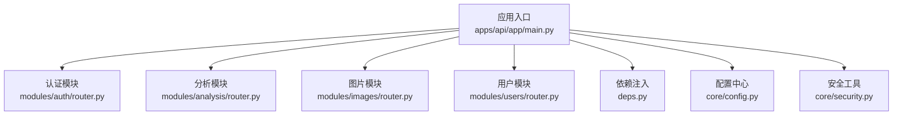
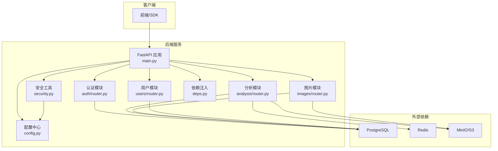
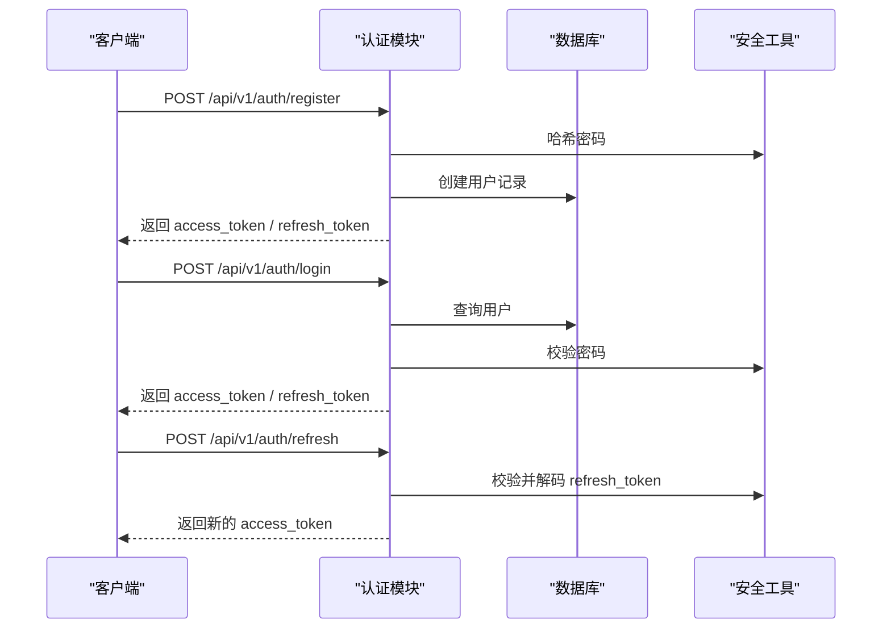
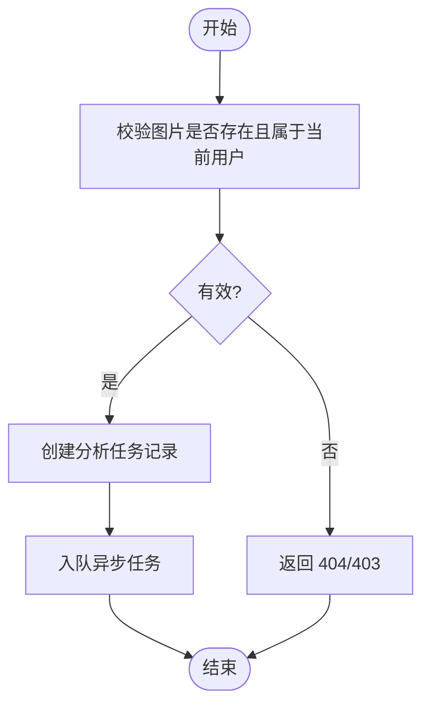
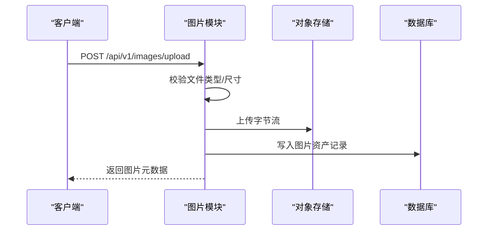
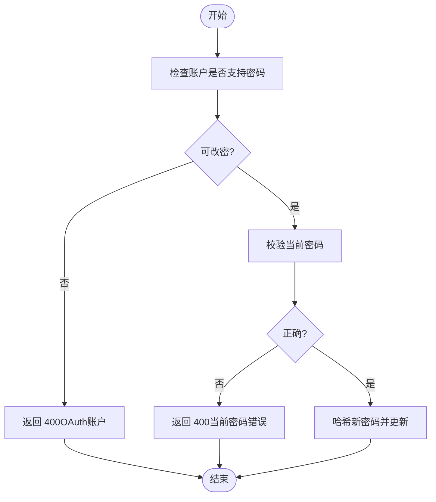
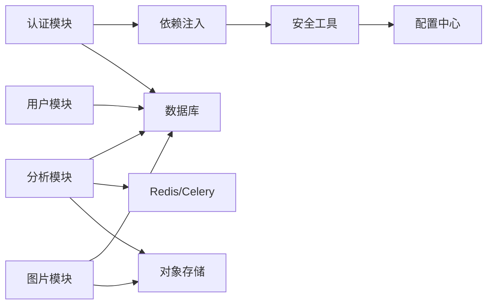

# 后端API文档

<cite>
**本文档引用的文件**
- [apps/api/app/main.py](file://apps/api/app/main.py)
- [apps/api/app/deps.py](file://apps/api/app/deps.py)
- [apps/api/app/core/config.py](file://apps/api/app/core/config.py)
- [apps/api/app/core/security.py](file://apps/api/app/core/security.py)
- [apps/api/app/modules/auth/router.py](file://apps/api/app/modules/auth/router.py)
- [apps/api/app/modules/analysis/router.py](file://apps/api/app/modules/analysis/router.py)
- [apps/api/app/modules/images/router.py](file://apps/api/app/modules/images/router.py)
- [apps/api/app/modules/users/router.py](file://apps/api/app/modules/users/router.py)
- [apps/api/app/schemas/auth.py](file://apps/api/app/schemas/auth.py)
- [apps/api/app/schemas/user.py](file://apps/api/app/schemas/user.py)
- [apps/api/app/schemas/analysis.py](file://apps/api/app/schemas/analysis.py)
- [apps/api/app/schemas/image.py](file://apps/api/app/schemas/image.py)
- [apps/api/app/models/user.py](file://apps/api/app/models/user.py)
- [apps/api/app/models/image_asset.py](file://apps/api/app/models/image_asset.py)
- [apps/api/app/models/analysis_task.py](file://apps/api/app/models/analysis_task.py)
</cite>

## 目录
1. [简介](#简介)
2. [项目结构](#项目结构)
3. [核心组件](#核心组件)
4. [架构总览](#架构总览)
5. [详细组件分析](#详细组件分析)
6. [依赖分析](#依赖分析)
7. [性能考虑](#性能考虑)
8. [故障排除指南](#故障排除指南)
9. [结论](#结论)
10. [附录](#附录)

## 简介
本文件为“AI摄影教练”后端API的完整技术文档，覆盖认证、分析、图片与用户四大模块的RESTful接口，包括：
- 接口路径、HTTP方法、请求参数、响应格式与错误码
- 认证机制、权限控制与安全要点
- 请求/响应示例与Schema定义
- 使用指南与最佳实践

后端基于FastAPI构建，采用JWT Bearer Token进行认证，支持CORS跨域访问，并通过数据库与对象存储完成数据持久化与资源管理。

## 项目结构
后端应用入口在主程序中注册四个子模块路由，并在启动时初始化数据库。各模块通过独立的router.py暴露REST接口，依赖注入层提供认证上下文，核心配置与安全模块提供JWT与环境变量管理。

图表来源
- [apps/api/app/main.py:1-36](file://apps/api/app/main.py#L1-L36)
- [apps/api/app/deps.py:1-41](file://apps/api/app/deps.py#L1-L41)
- [apps/api/app/core/config.py:1-47](file://apps/api/app/core/config.py#L1-L47)
- [apps/api/app/core/security.py:1-72](file://apps/api/app/core/security.py#L1-L72)

章节来源
- [apps/api/app/main.py:1-36](file://apps/api/app/main.py#L1-L36)

## 核心组件
- 应用入口与路由挂载
  - 在应用启动时初始化数据库，并注册认证、分析、图片、用户四个模块的路由，统一前缀为配置项指定的API前缀。
- 认证与权限
  - 通过HTTP Bearer Token进行认证，依赖注入层解析并校验JWT，获取当前用户并进行权限校验（如图片与任务归属校验）。
- 配置与安全
  - 配置中心集中管理数据库、Redis、S3、CORS与JWT等参数；安全模块提供密码哈希、JWT签发与校验能力。
- 数据模型
  - 用户、图片资产、分析任务三类核心实体，支撑认证、图片上传与分析流程。

章节来源
- [apps/api/app/main.py:1-36](file://apps/api/app/main.py#L1-L36)
- [apps/api/app/deps.py:1-41](file://apps/api/app/deps.py#L1-L41)
- [apps/api/app/core/config.py:1-47](file://apps/api/app/core/config.py#L1-L47)
- [apps/api/app/core/security.py:1-72](file://apps/api/app/core/security.py#L1-L72)
- [apps/api/app/models/user.py:1-28](file://apps/api/app/models/user.py#L1-L28)
- [apps/api/app/models/image_asset.py:1-32](file://apps/api/app/models/image_asset.py#L1-L32)
- [apps/api/app/models/analysis_task.py:1-36](file://apps/api/app/models/analysis_task.py#L1-L36)

## 架构总览
下图展示API调用链路与模块交互关系，包括认证中间件、服务层与外部依赖（数据库、Redis、S3）。

图表来源
- [apps/api/app/main.py:1-36](file://apps/api/app/main.py#L1-L36)
- [apps/api/app/modules/auth/router.py:1-93](file://apps/api/app/modules/auth/router.py#L1-L93)
- [apps/api/app/modules/analysis/router.py:1-151](file://apps/api/app/modules/analysis/router.py#L1-L151)
- [apps/api/app/modules/images/router.py:1-77](file://apps/api/app/modules/images/router.py#L1-L77)
- [apps/api/app/modules/users/router.py:1-71](file://apps/api/app/modules/users/router.py#L1-L71)
- [apps/api/app/deps.py:1-41](file://apps/api/app/deps.py#L1-L41)
- [apps/api/app/core/config.py:1-47](file://apps/api/app/core/config.py#L1-L47)
- [apps/api/app/core/security.py:1-72](file://apps/api/app/core/security.py#L1-L72)

## 详细组件分析

### 认证API
- 模块前缀：/api/v1/auth
- 认证方式：HTTP Bearer Token（JWT）
- 关键端点
  - POST /api/v1/auth/register
    - 功能：用户注册并返回访问/刷新令牌
    - 请求体：邮箱、密码、昵称（可选）
    - 响应体：access_token、refresh_token、token_type
    - 错误码：400（参数无效/密码过短）、409（邮箱冲突）
  - POST /api/v1/auth/login
    - 功能：邮箱+密码登录，返回访问/刷新令牌
    - 请求体：邮箱、密码
    - 响应体：同上
    - 错误码：401（凭据无效）
  - POST /api/v1/auth/refresh
    - 功能：使用refresh_token刷新access_token
    - 请求体：refresh_token
    - 响应体：同上
    - 错误码：401（token无效或过期）
  - POST /api/v1/auth/logout
    - 功能：登出提示（客户端清理本地token）
    - 响应体：消息
  - POST /api/v1/auth/verify-email
    - 功能：邮箱验证
    - 请求体：token
    - 响应体：消息
  - POST /api/v1/auth/resend-verification
    - 功能：重发验证邮件（开发中，需认证）
    - 响应体：消息
  - POST /api/v1/auth/forgot-password
    - 功能：发送密码重置邮件（邮箱存在与否均返回成功）
    - 请求体：邮箱
    - 响应体：消息
  - POST /api/v1/auth/reset-password
    - 功能：使用token重置密码
    - 请求体：token、新密码（≥8位）
    - 响应体：消息
    - 错误码：400（密码过短/参数无效）

- 认证流程时序

图表来源
- [apps/api/app/modules/auth/router.py:24-93](file://apps/api/app/modules/auth/router.py#L24-L93)
- [apps/api/app/core/security.py:22-72](file://apps/api/app/core/security.py#L22-L72)
- [apps/api/app/schemas/auth.py:5-37](file://apps/api/app/schemas/auth.py#L5-L37)

章节来源
- [apps/api/app/modules/auth/router.py:1-93](file://apps/api/app/modules/auth/router.py#L1-L93)
- [apps/api/app/schemas/auth.py:1-37](file://apps/api/app/schemas/auth.py#L1-L37)
- [apps/api/app/core/security.py:1-72](file://apps/api/app/core/security.py#L1-L72)

### 分析API
- 模块前缀：/api/v1/analysis
- 权限：需登录，仅允许操作本人的图片与任务
- 关键端点
  - POST /api/v1/analysis/tasks
    - 功能：创建分析任务
    - 请求体：image_id（UUID）
    - 响应体：task_id、task_type、status
    - 错误码：404（图片不存在）、403（无权限）
  - GET /api/v1/analysis/tasks/{task_id}
    - 功能：查询任务详情（含结果JSON）
    - 路径参数：task_id（UUID）
    - 响应体：任务与结果详情
    - 错误码：404（任务不存在）、403（无权限）
  - GET /api/v1/analysis/history
    - 功能：分页查询历史（默认20条，上限100）
    - 查询参数：limit（1-100）
    - 响应体：历史条目列表（含摘要）
    - 错误码：200
  - POST /api/v1/analysis/tasks/{task_id}/retry
    - 功能：重试失败/成功的任务
    - 路径参数：task_id（UUID）
    - 响应体：重试后的任务状态
    - 错误码：404（任务不存在）、403（无权限）、400（任务仍在运行）

- 处理逻辑流程

图表来源
- [apps/api/app/modules/analysis/router.py:45-74](file://apps/api/app/modules/analysis/router.py#L45-L74)
- [apps/api/app/modules/analysis/router.py:92-125](file://apps/api/app/modules/analysis/router.py#L92-L125)
- [apps/api/app/modules/analysis/router.py:128-151](file://apps/api/app/modules/analysis/router.py#L128-L151)

章节来源
- [apps/api/app/modules/analysis/router.py:1-151](file://apps/api/app/modules/analysis/router.py#L1-L151)
- [apps/api/app/schemas/analysis.py:1-52](file://apps/api/app/schemas/analysis.py#L1-L52)

### 图片API
- 模块前缀：/api/v1/images
- 权限：需登录
- 关键端点
  - POST /api/v1/images/upload
    - 功能：上传图片并保存元数据
    - 请求体：multipart/form-data，字段file（图片文件）
    - 响应体：image_id、mime_type、size_bytes、width、height、object_key
    - 错误码：400（非图片/空文件/无效图片）、401（未认证）
  - GET /api/v1/images/{image_id}（概念性说明）
    - 功能：下载图片（建议由对象存储直链或代理下载）
    - 权限：需登录且为图片所属用户
    - 响应：二进制图片流
    - 错误码：404（图片不存在）、403（无权限）

- 上传流程

图表来源
- [apps/api/app/modules/images/router.py:20-77](file://apps/api/app/modules/images/router.py#L20-L77)
- [apps/api/app/schemas/image.py:6-14](file://apps/api/app/schemas/image.py#L6-L14)

章节来源
- [apps/api/app/modules/images/router.py:1-77](file://apps/api/app/modules/images/router.py#L1-L77)
- [apps/api/app/schemas/image.py:1-14](file://apps/api/app/schemas/image.py#L1-L14)

### 用户API
- 模块前缀：/api/v1/users
- 权限：需登录（通过HTTP Bearer Token）
- 关键端点
  - GET /api/v1/users/me
    - 功能：获取当前用户资料
    - 响应体：id、email、nickname、avatar_url、is_verified、created_at
  - PATCH /api/v1/users/me
    - 功能：更新昵称与头像
    - 请求体：nickname（可选，最大长度50）、avatar_url（可选）
    - 响应体：同上
  - POST /api/v1/users/me/change-password
    - 功能：修改密码
    - 请求体：current_password、new_password（≥8位）
    - 错误码：400（OAuth账户不可改密/当前密码错误）、401（token无效）

- 密码变更流程

图表来源
- [apps/api/app/modules/users/router.py:51-71](file://apps/api/app/modules/users/router.py#L51-L71)
- [apps/api/app/core/security.py:22-29](file://apps/api/app/core/security.py#L22-L29)

章节来源
- [apps/api/app/modules/users/router.py:1-71](file://apps/api/app/modules/users/router.py#L1-L71)
- [apps/api/app/schemas/user.py:1-30](file://apps/api/app/schemas/user.py#L1-L30)

## 依赖分析
- 组件耦合
  - 路由模块依赖数据库会话与依赖注入层，实现认证与权限校验
  - 安全模块被认证路由与依赖注入共同使用
  - 分析模块依赖Celery/Redis队列与对象存储，实现异步分析与结果持久化
- 外部依赖
  - 数据库：PostgreSQL（SQLAlchemy ORM）
  - 缓存/队列：Redis（Celery）
  - 对象存储：MinIO/S3（用于图片存储）
- 可能的循环依赖
  - 当前结构清晰，模块间通过依赖注入与服务层解耦，未见循环导入

图表来源
- [apps/api/app/modules/auth/router.py:1-93](file://apps/api/app/modules/auth/router.py#L1-L93)
- [apps/api/app/modules/analysis/router.py:1-151](file://apps/api/app/modules/analysis/router.py#L1-L151)
- [apps/api/app/modules/images/router.py:1-77](file://apps/api/app/modules/images/router.py#L1-L77)
- [apps/api/app/modules/users/router.py:1-71](file://apps/api/app/modules/users/router.py#L1-L71)
- [apps/api/app/deps.py:1-41](file://apps/api/app/deps.py#L1-L41)
- [apps/api/app/core/config.py:1-47](file://apps/api/app/core/config.py#L1-L47)
- [apps/api/app/core/security.py:1-72](file://apps/api/app/core/security.py#L1-L72)

## 性能考虑
- 异步处理
  - 分析任务通过队列异步执行，避免阻塞请求线程
- 数据库索引
  - 分析任务表按用户与状态建立索引，提升历史查询与状态筛选效率
- 缓存策略
  - Redis用于任务队列与缓存，建议结合业务热点数据做LRU优化
- 存储优化
  - 图片上传后写入对象存储，建议开启CDN与压缩策略
- 并发与限流
  - 建议在网关层或应用层增加速率限制，防止滥用

## 故障排除指南
- 401 未认证/无效token
  - 检查Authorization头是否为Bearer Token，确认token未过期
  - 参考：依赖注入与安全工具的token校验逻辑
- 403 无权限
  - 确认请求资源归属当前用户（图片与任务均需归属校验）
- 404 资源不存在
  - 检查image_id/task_id是否正确，确认资源未被删除
- 400 参数错误
  - 密码长度不足、非图片文件、空文件、无效JSON等
- 登录/注册异常
  - 确认邮箱格式与密码强度；检查数据库唯一约束冲突

章节来源
- [apps/api/app/deps.py:15-34](file://apps/api/app/deps.py#L15-L34)
- [apps/api/app/core/security.py:49-72](file://apps/api/app/core/security.py#L49-L72)
- [apps/api/app/modules/analysis/router.py:52-56](file://apps/api/app/modules/analysis/router.py#L52-L56)
- [apps/api/app/modules/analysis/router.py:82-86](file://apps/api/app/modules/analysis/router.py#L82-L86)
- [apps/api/app/modules/images/router.py:26-37](file://apps/api/app/modules/images/router.py#L26-L37)

## 结论
本API文档系统性梳理了认证、分析、图片与用户模块的接口规范与实现要点。通过JWT认证、严格的权限校验与异步任务处理，系统在保证安全性的同时具备良好的扩展性。建议在生产环境中完善CORS白名单、强化速率限制与监控告警，并持续优化对象存储与数据库索引策略。

## 附录

### API一览表
- 认证
  - POST /api/v1/auth/register
  - POST /api/v1/auth/login
  - POST /api/v1/auth/refresh
  - POST /api/v1/auth/logout
  - POST /api/v1/auth/verify-email
  - POST /api/v1/auth/resend-verification
  - POST /api/v1/auth/forgot-password
  - POST /api/v1/auth/reset-password
- 分析
  - POST /api/v1/analysis/tasks
  - GET /api/v1/analysis/tasks/{task_id}
  - GET /api/v1/analysis/history
  - POST /api/v1/analysis/tasks/{task_id}/retry
- 图片
  - POST /api/v1/images/upload
  - GET /api/v1/images/{image_id}
- 用户
  - GET /api/v1/users/me
  - PATCH /api/v1/users/me
  - POST /api/v1/users/me/change-password

### 认证与安全要点
- 认证方式：HTTP Bearer Token（JWT）
- 令牌类型：access_token（短期）、refresh_token（长期）
- 安全建议：
  - 生产环境务必更换JWT密钥与启用HTTPS
  - 对敏感端点（修改密码、登出）进行二次校验
  - 限制CORS白名单，避免跨站风险

### Schema定义（摘要）
- 认证
  - RegisterRequest：邮箱、密码（≥8）、昵称（可选）
  - LoginRequest：邮箱、密码
  - TokenResponse：access_token、refresh_token、token_type
  - RefreshRequest：refresh_token
  - VerifyEmailRequest：token
  - ForgotPasswordRequest：邮箱
  - ResetPasswordRequest：token、新密码（≥8）
- 用户
  - UserProfile：id、email、nickname、avatar_url、is_verified、created_at
  - UpdateProfileRequest：nickname（≤50）、avatar_url
  - ChangePasswordRequest：current_password、new_password（≥8）
- 分析
  - CreateAnalysisTaskRequest：image_id
  - CreateAnalysisTaskResponse：task_id、task_type、status
  - AnalysisTaskDetailResponse：任务详情与结果JSON
  - AnalysisHistoryItem：任务简要与摘要
  - AnalysisHistoryResponse：历史列表
  - RetryTaskResponse：重试后的任务状态
- 图片
  - ImageUploadResponse：image_id、mime_type、size_bytes、width、height、object_key

章节来源
- [apps/api/app/schemas/auth.py:1-37](file://apps/api/app/schemas/auth.py#L1-L37)
- [apps/api/app/schemas/user.py:1-30](file://apps/api/app/schemas/user.py#L1-L30)
- [apps/api/app/schemas/analysis.py:1-52](file://apps/api/app/schemas/analysis.py#L1-L52)
- [apps/api/app/schemas/image.py:1-14](file://apps/api/app/schemas/image.py#L1-L14)