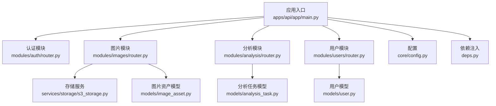
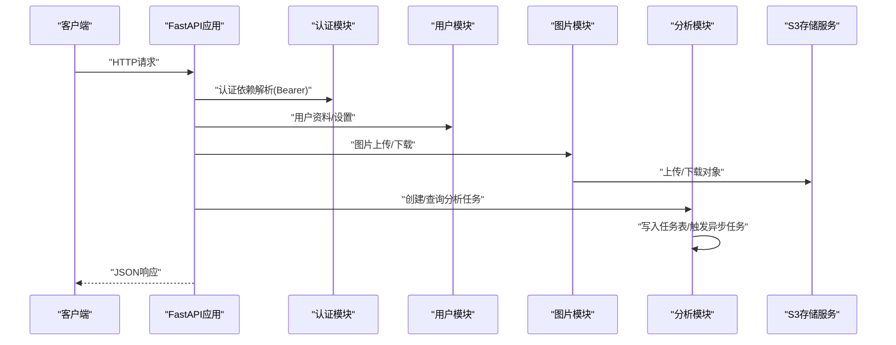
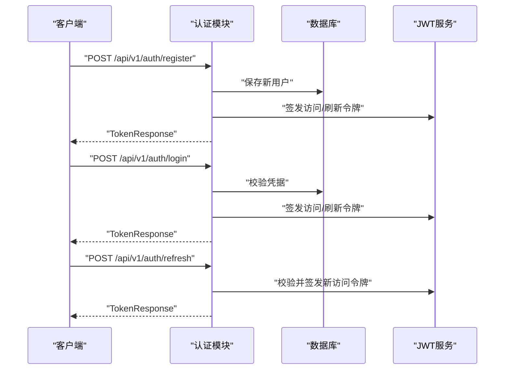
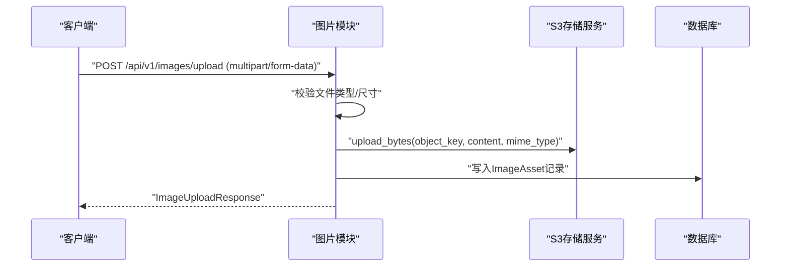
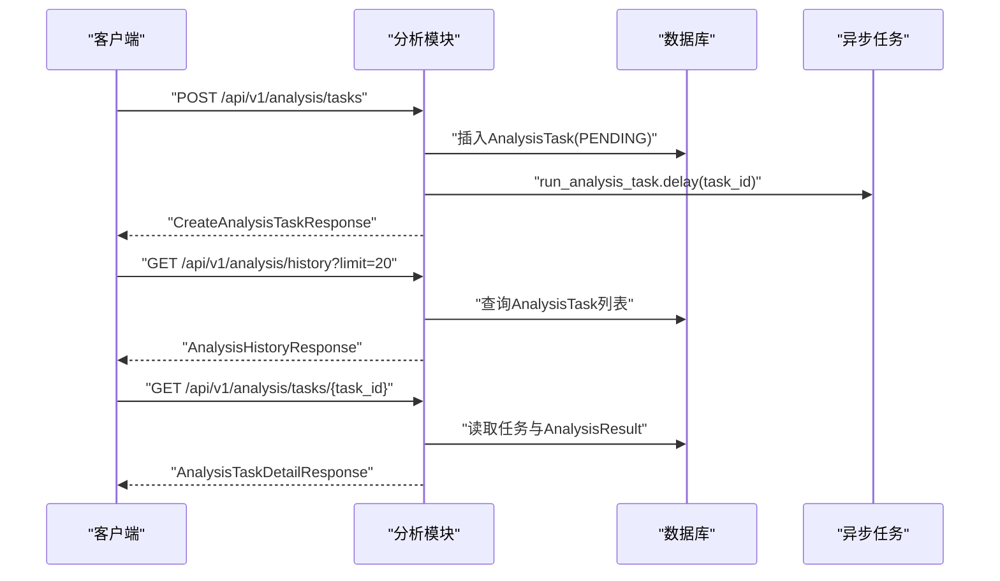
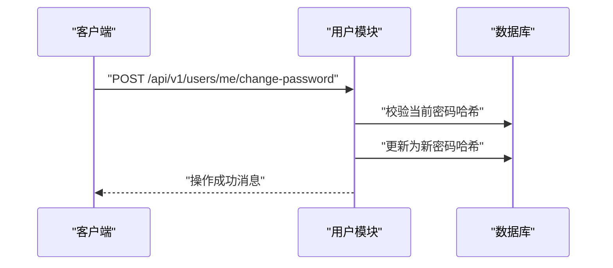
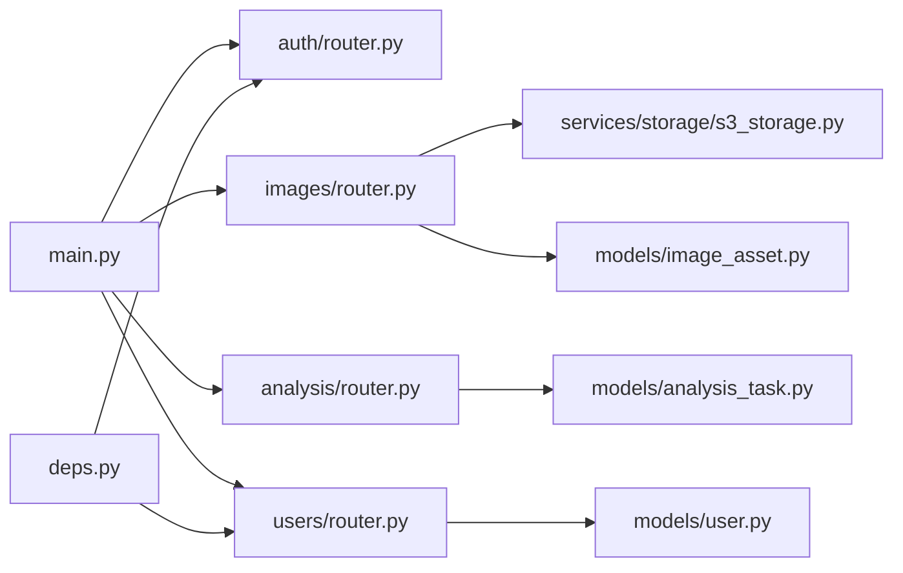

# 后端API文档

<cite>
**本文档引用的文件**
- [apps/api/app/main.py](file://apps/api/app/main.py)
- [apps/api/app/core/config.py](file://apps/api/app/core/config.py)
- [apps/api/app/deps.py](file://apps/api/app/deps.py)
- [apps/api/app/modules/auth/router.py](file://apps/api/app/modules/auth/router.py)
- [apps/api/app/schemas/auth.py](file://apps/api/app/schemas/auth.py)
- [apps/api/app/modules/images/router.py](file://apps/api/app/modules/images/router.py)
- [apps/api/app/schemas/image.py](file://apps/api/app/schemas/image.py)
- [apps/api/app/services/storage/s3_storage.py](file://apps/api/app/services/storage/s3_storage.py)
- [apps/api/app/modules/analysis/router.py](file://apps/api/app/modules/analysis/router.py)
- [apps/api/app/schemas/analysis.py](file://apps/api/app/schemas/analysis.py)
- [apps/api/app/models/analysis_task.py](file://apps/api/app/models/analysis_task.py)
- [apps/api/app/modules/users/router.py](file://apps/api/app/modules/users/router.py)
- [apps/api/app/schemas/user.py](file://apps/api/app/schemas/user.py)
- [apps/api/app/models/user.py](file://apps/api/app/models/user.py)
- [apps/api/app/models/image_asset.py](file://apps/api/app/models/image_asset.py)
</cite>

## 目录
1. [简介](#简介)
2. [项目结构](#项目结构)
3. [核心组件](#核心组件)
4. [架构总览](#架构总览)
5. [详细组件分析](#详细组件分析)
6. [依赖关系分析](#依赖关系分析)
7. [性能考量](#性能考量)
8. [故障排除指南](#故障排除指南)
9. [结论](#结论)
10. [附录](#附录)

## 简介
本文件为“AI摄影教练”后端API的完整技术文档，覆盖认证、图片管理、分析任务与用户管理四大模块的所有RESTful接口。文档包含：
- 接口清单与规范（HTTP方法、路径、请求参数、响应格式）
- 请求与响应示例（通过源码路径指引定位具体实现）
- 错误码与异常处理机制
- API版本控制策略与向后兼容性
- 客户端集成指南与最佳实践

## 项目结构
后端基于FastAPI构建，采用模块化路由组织方式，核心入口在应用主文件中注册各模块路由，并在启动时初始化数据库。

**图表来源**
- [apps/api/app/main.py:1-36](file://apps/api/app/main.py#L1-L36)
- [apps/api/app/modules/auth/router.py:1-93](file://apps/api/app/modules/auth/router.py#L1-L93)
- [apps/api/app/modules/images/router.py:1-77](file://apps/api/app/modules/images/router.py#L1-L77)
- [apps/api/app/modules/analysis/router.py:1-151](file://apps/api/app/modules/analysis/router.py#L1-L151)
- [apps/api/app/modules/users/router.py:1-71](file://apps/api/app/modules/users/router.py#L1-L71)
- [apps/api/app/core/config.py:1-47](file://apps/api/app/core/config.py#L1-L47)
- [apps/api/app/deps.py:1-41](file://apps/api/app/deps.py#L1-L41)
- [apps/api/app/services/storage/s3_storage.py:1-59](file://apps/api/app/services/storage/s3_storage.py#L1-L59)
- [apps/api/app/models/analysis_task.py:1-36](file://apps/api/app/models/analysis_task.py#L1-L36)
- [apps/api/app/models/user.py:1-28](file://apps/api/app/models/user.py#L1-L28)
- [apps/api/app/models/image_asset.py:1-32](file://apps/api/app/models/image_asset.py#L1-L32)

**章节来源**
- [apps/api/app/main.py:1-36](file://apps/api/app/main.py#L1-L36)
- [apps/api/app/core/config.py:1-47](file://apps/api/app/core/config.py#L1-L47)

## 核心组件
- 应用入口与路由注册：在应用启动时注册认证、图片、分析、用户四个模块的路由，并启用CORS跨域支持。
- 配置中心：集中管理API前缀、数据库连接、Redis、S3存储、JWT密钥与过期时间等。
- 依赖注入：提供基于Bearer Token的认证依赖，解析JWT并校验用户有效性。
- 存储服务：封装S3兼容对象存储，确保桶存在并提供上传/下载能力。

**章节来源**
- [apps/api/app/main.py:1-36](file://apps/api/app/main.py#L1-L36)
- [apps/api/app/core/config.py:1-47](file://apps/api/app/core/config.py#L1-L47)
- [apps/api/app/deps.py:1-41](file://apps/api/app/deps.py#L1-L41)
- [apps/api/app/services/storage/s3_storage.py:1-59](file://apps/api/app/services/storage/s3_storage.py#L1-L59)

## 架构总览
下图展示API调用链路与关键组件交互：

**图表来源**
- [apps/api/app/main.py:1-36](file://apps/api/app/main.py#L1-L36)
- [apps/api/app/deps.py:15-34](file://apps/api/app/deps.py#L15-L34)
- [apps/api/app/modules/auth/router.py:24-54](file://apps/api/app/modules/auth/router.py#L24-L54)
- [apps/api/app/modules/users/router.py:29-71](file://apps/api/app/modules/users/router.py#L29-L71)
- [apps/api/app/modules/images/router.py:20-77](file://apps/api/app/modules/images/router.py#L20-L77)
- [apps/api/app/modules/analysis/router.py:45-151](file://apps/api/app/modules/analysis/router.py#L45-L151)
- [apps/api/app/services/storage/s3_storage.py:34-50](file://apps/api/app/services/storage/s3_storage.py#L34-L50)

## 详细组件分析

### 认证接口
- 基础路径：`/api/v1/auth`
- 支持的HTTP方法与端点：
  - POST /register：注册并返回访问令牌与刷新令牌
  - POST /login：登录并返回访问令牌与刷新令牌
  - POST /refresh：使用刷新令牌换取新的访问令牌
  - POST /logout：登出提示（客户端清理本地令牌）
  - POST /verify-email：邮箱验证
  - POST /resend-verification：重发验证邮件（开发中）
  - POST /forgot-password：发送密码重置邮件
  - POST /reset-password：重置密码

- 请求与响应模型参考：
  - 注册请求：[RegisterRequest:5-9](file://apps/api/app/schemas/auth.py#L5-L9)
  - 登录请求：[LoginRequest:11-14](file://apps/api/app/schemas/auth.py#L11-L14)
  - 令牌响应：[TokenResponse:16-20](file://apps/api/app/schemas/auth.py#L16-L20)
  - 刷新请求：[RefreshRequest:22-24](file://apps/api/app/schemas/auth.py#L22-L24)
  - 邮箱验证请求：[VerifyEmailRequest:26-28](file://apps/api/app/schemas/auth.py#L26-L28)
  - 忘记密码请求：[ForgotPasswordRequest:30-32](file://apps/api/app/schemas/auth.py#L30-L32)
  - 重置密码请求：[ResetPasswordRequest:34-37](file://apps/api/app/schemas/auth.py#L34-L37)

- 示例请求与响应（通过源码路径定位）：
  - 注册请求示例：[apps/api/app/modules/auth/router.py:24-40](file://apps/api/app/modules/auth/router.py#L24-L40)
  - 登录响应示例：[apps/api/app/modules/auth/router.py:42-47](file://apps/api/app/modules/auth/router.py#L42-L47)
  - 刷新令牌响应示例：[apps/api/app/modules/auth/router.py:49-54](file://apps/api/app/modules/auth/router.py#L49-L54)
  - 邮箱验证示例：[apps/api/app/modules/auth/router.py:62-68](file://apps/api/app/modules/auth/router.py#L62-L68)
  - 忘记密码示例：[apps/api/app/modules/auth/router.py:78-85](file://apps/api/app/modules/auth/router.py#L78-L85)
  - 重置密码示例：[apps/api/app/modules/auth/router.py:87-93](file://apps/api/app/modules/auth/router.py#L87-L93)

- 认证流程（序列图）：

**图表来源**
- [apps/api/app/modules/auth/router.py:24-54](file://apps/api/app/modules/auth/router.py#L24-L54)
- [apps/api/app/schemas/auth.py:5-37](file://apps/api/app/schemas/auth.py#L5-L37)

**章节来源**
- [apps/api/app/modules/auth/router.py:1-93](file://apps/api/app/modules/auth/router.py#L1-L93)
- [apps/api/app/schemas/auth.py:1-37](file://apps/api/app/schemas/auth.py#L1-L37)

### 图片管理接口
- 基础路径：`/api/v1/images`
- 支持的HTTP方法与端点：
  - POST /upload：上传图片，返回图片元数据

- 请求与响应模型参考：
  - 上传响应：[ImageUploadResponse:6-14](file://apps/api/app/schemas/image.py#L6-L14)

- 存储与安全：
  - 使用S3兼容存储，自动确保桶存在
  - 上传文件类型限制为图像类型
  - 生成唯一对象键，包含用户ID、日期与随机后缀

- 示例请求与响应（通过源码路径定位）：
  - 上传接口实现：[apps/api/app/modules/images/router.py:20-77](file://apps/api/app/modules/images/router.py#L20-L77)
  - 存储服务封装：[apps/api/app/services/storage/s3_storage.py:34-50](file://apps/api/app/services/storage/s3_storage.py#L34-L50)

- 上传流程（序列图）：

**图表来源**
- [apps/api/app/modules/images/router.py:20-77](file://apps/api/app/modules/images/router.py#L20-L77)
- [apps/api/app/services/storage/s3_storage.py:34-50](file://apps/api/app/services/storage/s3_storage.py#L34-L50)
- [apps/api/app/models/image_asset.py:10-32](file://apps/api/app/models/image_asset.py#L10-L32)

**章节来源**
- [apps/api/app/modules/images/router.py:1-77](file://apps/api/app/modules/images/router.py#L1-L77)
- [apps/api/app/schemas/image.py:1-14](file://apps/api/app/schemas/image.py#L1-L14)
- [apps/api/app/services/storage/s3_storage.py:1-59](file://apps/api/app/services/storage/s3_storage.py#L1-L59)
- [apps/api/app/models/image_asset.py:1-32](file://apps/api/app/models/image_asset.py#L1-L32)

### 分析任务接口
- 基础路径：`/api/v1/analysis`
- 支持的HTTP方法与端点：
  - POST /tasks：创建分析任务
  - GET /tasks/{task_id}：查询任务详情（含结果）
  - GET /history：查询历史（分页）
  - POST /tasks/{task_id}/retry：重试失败或成功任务

- 请求与响应模型参考：
  - 创建任务请求：[CreateAnalysisTaskRequest:8-10](file://apps/api/app/schemas/analysis.py#L8-L10)
  - 创建任务响应：[CreateAnalysisTaskResponse:12-16](file://apps/api/app/schemas/analysis.py#L12-L16)
  - 任务详情响应：[AnalysisTaskDetailResponse:18-32](file://apps/api/app/schemas/analysis.py#L18-L32)
  - 历史项：[AnalysisHistoryItem:34-42](file://apps/api/app/schemas/analysis.py#L34-L42)
  - 历史响应：[AnalysisHistoryResponse:44-46](file://apps/api/app/schemas/analysis.py#L44-L46)
  - 重试响应：[RetryTaskResponse:48-52](file://apps/api/app/schemas/analysis.py#L48-L52)

- 数据模型参考：
  - 任务模型：[AnalysisTask:10-36](file://apps/api/app/models/analysis_task.py#L10-L36)

- 示例请求与响应（通过源码路径定位）：
  - 创建任务：[apps/api/app/modules/analysis/router.py:45-74](file://apps/api/app/modules/analysis/router.py#L45-L74)
  - 查询任务详情：[apps/api/app/modules/analysis/router.py:76-90](file://apps/api/app/modules/analysis/router.py#L76-L90)
  - 查询历史：[apps/api/app/modules/analysis/router.py:92-126](file://apps/api/app/modules/analysis/router.py#L92-L126)
  - 重试任务：[apps/api/app/modules/analysis/router.py:128-151](file://apps/api/app/modules/analysis/router.py#L128-L151)

- 任务流程（序列图）：

**图表来源**
- [apps/api/app/modules/analysis/router.py:45-151](file://apps/api/app/modules/analysis/router.py#L45-L151)
- [apps/api/app/models/analysis_task.py:10-36](file://apps/api/app/models/analysis_task.py#L10-L36)

**章节来源**
- [apps/api/app/modules/analysis/router.py:1-151](file://apps/api/app/modules/analysis/router.py#L1-L151)
- [apps/api/app/schemas/analysis.py:1-52](file://apps/api/app/schemas/analysis.py#L1-L52)
- [apps/api/app/models/analysis_task.py:1-36](file://apps/api/app/models/analysis_task.py#L1-L36)

### 用户管理接口
- 基础路径：`/api/v1/users`
- 支持的HTTP方法与端点：
  - GET /me：获取当前用户资料
  - PATCH /me：更新当前用户资料（昵称、头像）
  - POST /me/change-password：修改密码

- 请求与响应模型参考：
  - 用户资料响应：[UserProfile:8-18](file://apps/api/app/schemas/user.py#L8-L18)
  - 更新资料请求：[UpdateProfileRequest:20-24](file://apps/api/app/schemas/user.py#L20-L24)
  - 修改密码请求：[ChangePasswordRequest:26-30](file://apps/api/app/schemas/user.py#L26-L30)

- 示例请求与响应（通过源码路径定位）：
  - 获取资料：[apps/api/app/modules/users/router.py:29-33](file://apps/api/app/modules/users/router.py#L29-L33)
  - 更新资料：[apps/api/app/modules/users/router.py:35-49](file://apps/api/app/modules/users/router.py#L35-L49)
  - 修改密码：[apps/api/app/modules/users/router.py:51-71](file://apps/api/app/modules/users/router.py#L51-L71)

- 密码修改流程（序列图）：

**图表来源**
- [apps/api/app/modules/users/router.py:51-71](file://apps/api/app/modules/users/router.py#L51-L71)
- [apps/api/app/schemas/user.py:26-30](file://apps/api/app/schemas/user.py#L26-L30)
- [apps/api/app/models/user.py:12-28](file://apps/api/app/models/user.py#L12-L28)

**章节来源**
- [apps/api/app/modules/users/router.py:1-71](file://apps/api/app/modules/users/router.py#L1-L71)
- [apps/api/app/schemas/user.py:1-30](file://apps/api/app/schemas/user.py#L1-L30)
- [apps/api/app/models/user.py:1-28](file://apps/api/app/models/user.py#L1-L28)

## 依赖关系分析
- 路由依赖：主应用将认证、图片、分析、用户四个模块路由挂载到统一前缀。
- 认证依赖：全局依赖注入提供Bearer Token解析与用户校验。
- 存储依赖：图片模块通过存储服务封装S3操作。
- 模型依赖：分析模块与图片模块分别依赖各自的数据模型。

**图表来源**
- [apps/api/app/main.py:1-36](file://apps/api/app/main.py#L1-L36)
- [apps/api/app/deps.py:15-34](file://apps/api/app/deps.py#L15-L34)
- [apps/api/app/modules/auth/router.py:1-93](file://apps/api/app/modules/auth/router.py#L1-L93)
- [apps/api/app/modules/images/router.py:1-77](file://apps/api/app/modules/images/router.py#L1-L77)
- [apps/api/app/modules/analysis/router.py:1-151](file://apps/api/app/modules/analysis/router.py#L1-L151)
- [apps/api/app/modules/users/router.py:1-71](file://apps/api/app/modules/users/router.py#L1-L71)
- [apps/api/app/services/storage/s3_storage.py:1-59](file://apps/api/app/services/storage/s3_storage.py#L1-L59)
- [apps/api/app/models/analysis_task.py:1-36](file://apps/api/app/models/analysis_task.py#L1-L36)
- [apps/api/app/models/user.py:1-28](file://apps/api/app/models/user.py#L1-L28)
- [apps/api/app/models/image_asset.py:1-32](file://apps/api/app/models/image_asset.py#L1-L32)

**章节来源**
- [apps/api/app/main.py:1-36](file://apps/api/app/main.py#L1-L36)
- [apps/api/app/deps.py:1-41](file://apps/api/app/deps.py#L1-L41)

## 性能考量
- API前缀与版本控制：统一使用`/api/v1`作为前缀，便于未来版本演进与向后兼容。
- CORS配置：允许来自配置中列出的源进行跨域访问。
- 存储超时：S3客户端连接与读取超时已配置，避免阻塞请求。
- 数据库索引：分析任务表对用户与状态字段建立索引，优化历史查询性能。
- 异步任务：分析任务通过延迟队列执行，避免阻塞请求线程。

[本节为通用性能建议，不直接分析具体文件]

## 故障排除指南
- 401 未认证/令牌无效：检查请求头是否包含有效的Bearer Token，确认令牌未过期且用户有效。
- 403 权限不足：任务或图片资源归属校验失败，请确认资源属于当前用户。
- 404 资源不存在：请求的任务或图片ID不存在。
- 400 参数错误：图片上传非图像类型、空文件、密码长度不足等。
- 503 存储不可用：S3服务异常或桶创建失败，检查S3端点、凭证与网络连通性。

**章节来源**
- [apps/api/app/deps.py:15-34](file://apps/api/app/deps.py#L15-L34)
- [apps/api/app/modules/analysis/router.py:52-57](file://apps/api/app/modules/analysis/router.py#L52-L57)
- [apps/api/app/modules/images/router.py:26-38](file://apps/api/app/modules/images/router.py#L26-L38)
- [apps/api/app/services/storage/s3_storage.py:23-33](file://apps/api/app/services/storage/s3_storage.py#L23-L33)

## 结论
本API文档系统性地梳理了认证、图片、分析与用户管理模块的接口规范与实现要点。通过统一的版本前缀、严格的认证与权限控制、以及可扩展的存储与任务机制，为前端与客户端提供了清晰、稳定、可演进的后端能力。

[本节为总结性内容，不直接分析具体文件]

## 附录

### API版本控制与兼容性
- 版本前缀：所有接口均位于`/api/v1`前缀下，便于未来引入`/api/v2`等新版本。
- 兼容性策略：新增字段采用可选方式；变更现有字段需在新版本中体现；删除字段仅在新版本移除并在旧版本保留默认值。

**章节来源**
- [apps/api/app/core/config.py:11](file://apps/api/app/core/config.py#L11)
- [apps/api/app/main.py:21-24](file://apps/api/app/main.py#L21-L24)

### 客户端集成指南与最佳实践
- 认证流程：使用`/auth/login`获取访问令牌，后续请求在Authorization头中携带Bearer Token。
- 令牌刷新：当访问令牌过期时，使用`/auth/refresh`换取新令牌。
- 图片上传：使用multipart/form-data提交文件，注意仅支持图像类型。
- 分析任务：创建任务后轮询`/analysis/tasks/{task_id}`获取结果，或使用`/analysis/history`查看历史。
- 错误处理：根据HTTP状态码与响应体中的错误信息进行处理，必要时引导用户重新登录或重试。

[本节为通用集成建议，不直接分析具体文件]