# 图片API

<cite>
**本文档引用的文件**
- [apps/api/app/modules/images/router.py](file://apps/api/app/modules/images/router.py)
- [apps/api/app/schemas/image.py](file://apps/api/app/schemas/image.py)
- [apps/api/app/services/storage/s3_storage.py](file://apps/api/app/services/storage/s3_storage.py)
- [apps/api/app/models/image_asset.py](file://apps/api/app/models/image_asset.py)
- [apps/api/app/core/config.py](file://apps/api/app/core/config.py)
- [apps/api/app/deps.py](file://apps/api/app/deps.py)
- [apps/api/app/main.py](file://apps/api/app/main.py)
- [apps/web/src/api/images.ts](file://apps/web/src/api/images.ts)
- [apps/api/app/core/security.py](file://apps/api/app/core/security.py)
- [docs/architecture-v2.md](file://docs/architecture-v2.md)
</cite>

## 目录
1. [简介](#简介)
2. [项目结构](#项目结构)
3. [核心组件](#核心组件)
4. [架构概览](#架构概览)
5. [详细组件分析](#详细组件分析)
6. [API规范](#api规范)
7. [文件管理策略](#文件管理策略)
8. [安全与访问控制](#安全与访问控制)
9. [错误处理机制](#错误处理机制)
10. [性能优化建议](#性能优化建议)
11. [故障排除指南](#故障排除指南)
12. [结论](#结论)

## 简介

AI摄影教练图片API提供了完整的图片文件管理功能，包括图片上传、下载和删除操作。该API基于FastAPI框架构建，采用现代化的异步编程模式，集成了S3兼容存储服务（MinIO），为用户提供可靠的图片存储解决方案。

本API的核心特性包括：
- 支持多种图片格式的上传和验证
- 基于JWT的认证和授权机制
- 完整的图片元数据管理
- 高可用的分布式存储架构
- 标准化的错误处理和响应格式

## 项目结构

图片API位于应用的模块化架构中，遵循清晰的分层设计：

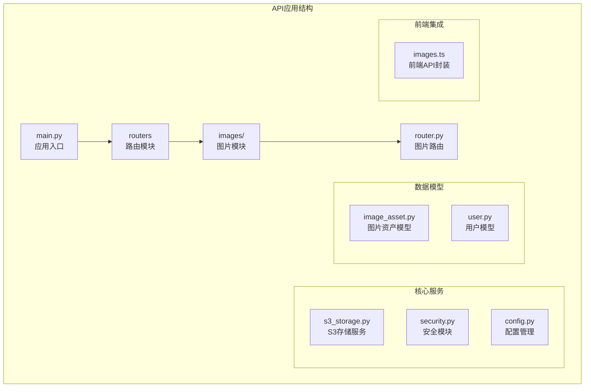

**图表来源**
- [apps/api/app/main.py:1-36](file://apps/api/app/main.py#L1-L36)
- [apps/api/app/modules/images/router.py:1-77](file://apps/api/app/modules/images/router.py#L1-L77)

**章节来源**
- [apps/api/app/main.py:1-36](file://apps/api/app/main.py#L1-L36)
- [apps/api/app/modules/images/router.py:1-77](file://apps/api/app/modules/images/router.py#L1-L77)

## 核心组件

### 图片路由模块
图片API的核心路由定义在`modules/images/router.py`中，提供了统一的图片管理接口。该模块使用FastAPI的装饰器模式，定义了标准的RESTful端点。

### 存储服务
S3存储服务通过`services/storage/s3_storage.py`实现，支持S3兼容协议，目前配置为MinIO存储服务。该服务提供了桶创建、对象上传、下载等核心功能。

### 数据模型
图片资产模型`models/image_asset.py`定义了图片在数据库中的完整结构，包括元数据、尺寸信息、哈希值等关键属性。

**章节来源**
- [apps/api/app/modules/images/router.py:17-77](file://apps/api/app/modules/images/router.py#L17-L77)
- [apps/api/app/services/storage/s3_storage.py:11-59](file://apps/api/app/services/storage/s3_storage.py#L11-L59)
- [apps/api/app/models/image_asset.py:10-32](file://apps/api/app/models/image_asset.py#L10-L32)

## 架构概览

图片API采用分层架构设计，确保了良好的可维护性和扩展性：

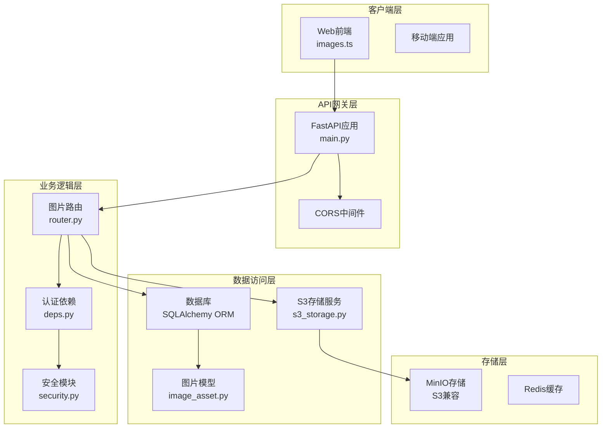

**图表来源**
- [apps/api/app/main.py:11-24](file://apps/api/app/main.py#L11-L24)
- [apps/api/app/modules/images/router.py:1-16](file://apps/api/app/modules/images/router.py#L1-L16)
- [apps/api/app/services/storage/s3_storage.py:11-22](file://apps/api/app/services/storage/s3_storage.py#L11-L22)

## 详细组件分析

### 图片上传组件

图片上传功能是整个API的核心组件，实现了完整的文件处理流程：

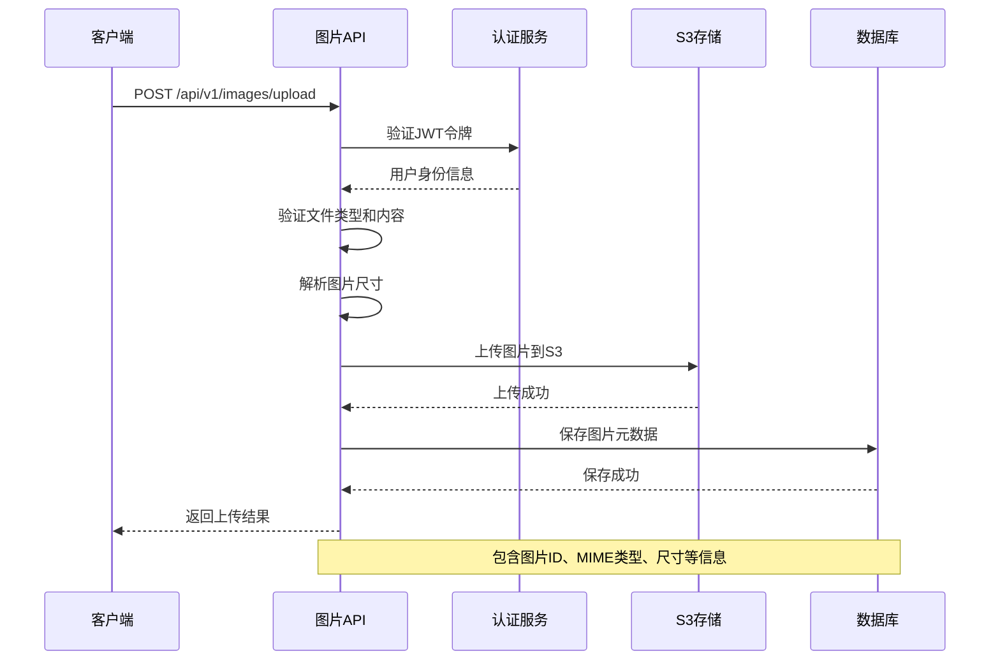

**图表来源**
- [apps/api/app/modules/images/router.py:20-77](file://apps/api/app/modules/images/router.py#L20-L77)
- [apps/api/app/deps.py:15-41](file://apps/api/app/deps.py#L15-L41)

#### 文件验证流程

上传组件实现了多层次的文件验证机制：

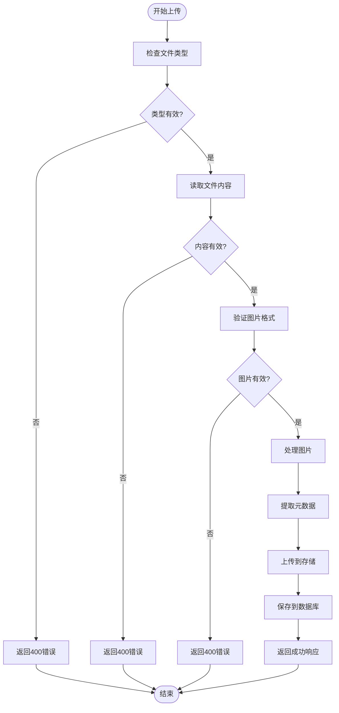

**图表来源**
- [apps/api/app/modules/images/router.py:26-37](file://apps/api/app/modules/images/router.py#L26-L37)

**章节来源**
- [apps/api/app/modules/images/router.py:20-77](file://apps/api/app/modules/images/router.py#L20-L77)

### S3存储服务

S3存储服务提供了高可用的对象存储能力：

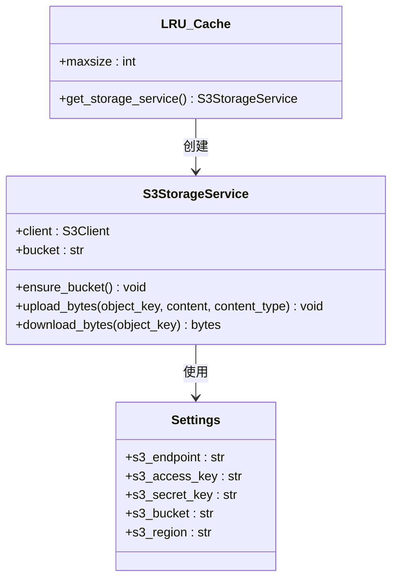

**图表来源**
- [apps/api/app/services/storage/s3_storage.py:11-59](file://apps/api/app/services/storage/s3_storage.py#L11-L59)
- [apps/api/app/core/config.py:16-20](file://apps/api/app/core/config.py#L16-L20)

#### 存储策略

存储服务采用了智能的桶管理和对象键策略：

| 组件 | 功能 | 配置 |
|------|------|------|
| 桶管理 | 自动创建和验证存储桶 | `photo-images` |
| 对象键 | 用户ID/日期/UUID格式 | `{user_id}/{date}/{uuid}.{ext}` |
| 连接配置 | 超时和重试设置 | 连接超时3秒，读取超时8秒 |
| 缓存机制 | 单例模式LRU缓存 | maxsize=1 |

**章节来源**
- [apps/api/app/services/storage/s3_storage.py:23-57](file://apps/api/app/services/storage/s3_storage.py#L23-L57)

### 数据模型设计

图片资产模型定义了完整的图片元数据结构：

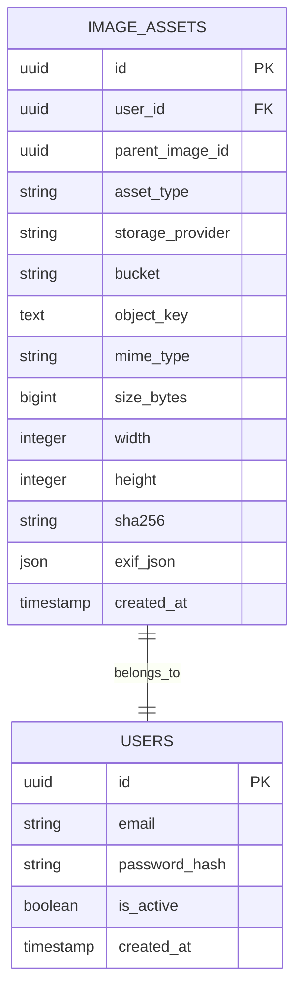

**图表来源**
- [apps/api/app/models/image_asset.py:10-32](file://apps/api/app/models/image_asset.py#L10-L32)

**章节来源**
- [apps/api/app/models/image_asset.py:10-32](file://apps/api/app/models/image_asset.py#L10-L32)

## API规范

### 基础信息

- **API前缀**: `/api/v1`
- **认证方式**: Bearer Token (JWT)
- **默认响应格式**: JSON
- **CORS配置**: 允许所有源和方法

### 图片上传接口

#### 端点定义
- **方法**: `POST`
- **路径**: `/api/v1/images/upload`
- **认证**: 必需
- **内容类型**: `multipart/form-data`

#### 请求参数

| 参数名 | 类型 | 必填 | 描述 | 示例 |
|--------|------|------|------|------|
| `file` | File | 是 | 图片文件 | `.jpg`, `.png`, `.webp` |

#### 请求头
- `Authorization: Bearer <token>`
- `Content-Type: multipart/form-data`

#### 成功响应

**响应体结构**:
```json
{
  "image_id": "string",
  "mime_type": "string",
  "size_bytes": 0,
  "width": 0,
  "height": 0,
  "object_key": "string"
}
```

**响应字段说明**:

| 字段名 | 类型 | 描述 |
|--------|------|------|
| `image_id` | UUID字符串 | 图片唯一标识符 |
| `mime_type` | 字符串 | 文件MIME类型 |
| `size_bytes` | 整数 | 文件大小（字节） |
| `width` | 整数 | 图片宽度（像素） |
| `height` | 整数 | 图片高度（像素） |
| `object_key` | 字符串 | 存储对象键 |

#### 错误响应

| 状态码 | 错误原因 | 描述 |
|--------|----------|------|
| 400 | 文件类型无效 | 不支持的文件类型 |
| 400 | 文件为空 | 上传了空文件 |
| 400 | 图片格式无效 | 图片无法识别 |
| 401 | 未认证 | 缺少或无效的认证令牌 |
| 403 | 权限不足 | 用户无权访问 |
| 503 | 服务不可用 | 存储服务暂时不可用 |

**章节来源**
- [apps/api/app/modules/images/router.py:20-77](file://apps/api/app/modules/images/router.py#L20-L77)
- [apps/api/app/schemas/image.py:6-13](file://apps/api/app/schemas/image.py#L6-L13)

### 图片下载接口

#### 当前状态
根据代码分析，当前版本的图片API**不包含专门的图片下载端点**。系统通过以下方式处理图片访问：

1. **直接存储访问**: 图片对象键可以直接用于S3兼容存储的访问
2. **预签名URL机制**: 可以通过S3 SDK生成临时访问链接
3. **代理访问**: 建议在生产环境中添加专用的下载端点

#### 建议的下载实现

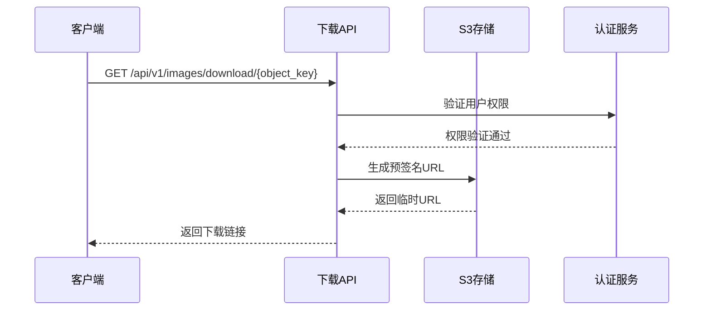

**图表来源**
- [apps/api/app/services/storage/s3_storage.py:45-50](file://apps/api/app/services/storage/s3_storage.py#L45-L50)

### 图片删除接口

#### 当前状态
当前版本的图片API**不包含专门的图片删除端点**。删除操作可以通过以下方式实现：

1. **直接S3删除**: 通过对象键直接删除存储对象
2. **数据库清理**: 删除对应的图片资产记录
3. **级联删除**: 利用数据库外键约束自动清理关联数据

#### 建议的删除实现

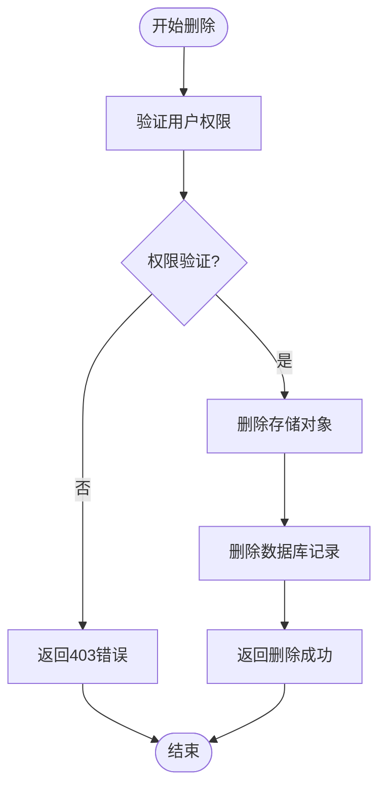

**章节来源**
- [apps/api/app/models/image_asset.py:15-20](file://apps/api/app/models/image_asset.py#L15-L20)

## 文件管理策略

### 文件格式限制

系统对上传的文件类型进行了严格限制：

#### 支持的图片格式
- **JPEG/JPG**: 主要格式，支持压缩
- **PNG**: 无损格式，支持透明度
- **WEBP**: 现代格式，压缩效率高
- **GIF**: 动画支持有限制

#### 文件类型验证
```python
# 验证逻辑
if file.content_type is None or not file.content_type.startswith("image/"):
    raise HTTPException(status_code=400, detail="Only image files are supported")
```

#### 文件大小限制
当前实现未设置明确的文件大小限制，但建议在生产环境中添加：

| 限制类型 | 建议值 | 实现方式 |
|----------|--------|----------|
| 单文件大小 | 10MB | 服务器端验证 |
| 总上传量 | 100MB/天 | 速率限制 |
| 并发上传 | 5个 | 会话限制 |

### 存储策略

#### 对象键命名规则
系统采用层次化的对象键结构：
```
{user_id}/{YYYYMMDD}/{uuid}.{extension}
```

**优势**:
- **用户隔离**: 按用户ID组织文件
- **时间分区**: 按日期自动分桶
- **唯一性**: UUID确保文件名唯一
- **格式保留**: 保留原始文件扩展名

#### 元数据管理
系统自动提取和存储以下元数据：

| 元数据项 | 存储位置 | 用途 |
|----------|----------|------|
| MIME类型 | 数据库 | 内容类型识别 |
| 文件大小 | 数据库 | 存储统计 |
| 图片尺寸 | 数据库 | 显示优化 |
| SHA256哈希 | 数据库 | 完整性校验 |
| EXIF信息 | 数据库 | 元数据保留 |

**章节来源**
- [apps/api/app/modules/images/router.py:40-46](file://apps/api/app/modules/images/router.py#L40-L46)
- [apps/api/app/models/image_asset.py:25-30](file://apps/api/app/models/image_asset.py#L25-L30)

## 安全与访问控制

### 认证机制

系统采用JWT Bearer Token进行认证：

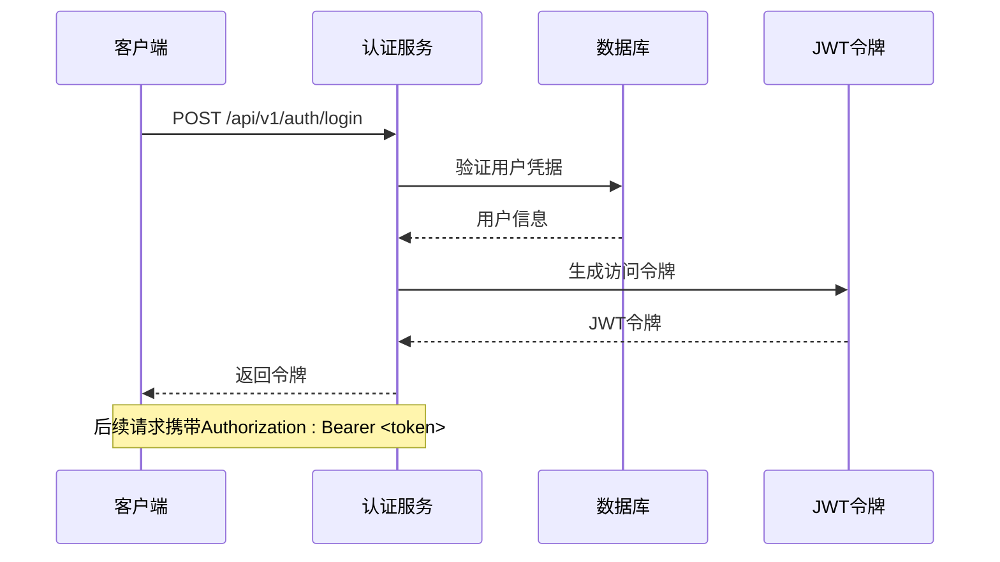

**图表来源**
- [apps/api/app/deps.py:15-33](file://apps/api/app/deps.py#L15-L33)
- [apps/api/app/core/security.py:32-46](file://apps/api/app/core/security.py#L32-L46)

#### 认证流程

1. **令牌获取**: 用户登录获取JWT令牌
2. **令牌验证**: 每次请求验证令牌有效性
3. **权限检查**: 确认用户状态为活跃
4. **用户ID提取**: 从令牌载荷中获取用户ID

#### 令牌配置

| 配置项 | 默认值 | 生产环境建议 |
|--------|--------|-------------|
| `jwt_secret_key` | `change-me-in-production` | 强随机密钥 |
| `jwt_algorithm` | `HS256` | `HS256`或`RS256` |
| `access_token_expire_minutes` | 30分钟 | 15-60分钟 |
| `refresh_token_expire_days` | 7天 | 7-30天 |

### 授权策略

#### 用户隔离
- 每个用户的图片存储在独立的目录结构中
- 数据库层面通过外键约束保证数据隔离
- 删除用户时自动清理其所有图片

#### 权限继承
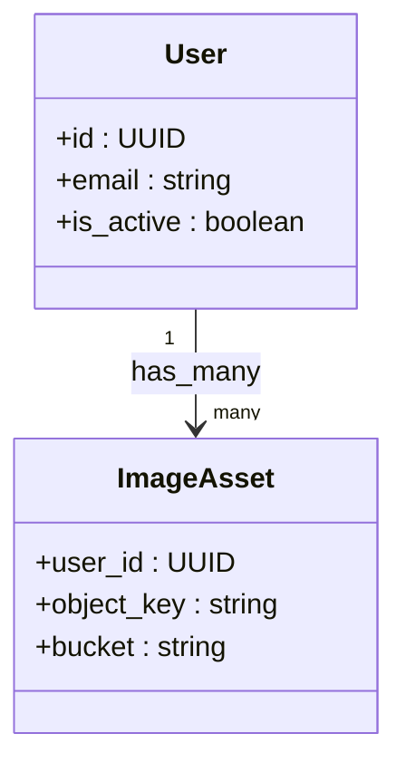

**图表来源**
- [apps/api/app/models/image_asset.py:15-16](file://apps/api/app/models/image_asset.py#L15-L16)

**章节来源**
- [apps/api/app/deps.py:15-41](file://apps/api/app/deps.py#L15-L41)
- [apps/api/app/models/image_asset.py:15-20](file://apps/api/app/models/image_asset.py#L15-L20)

## 错误处理机制

### 错误分类

系统实现了标准化的错误处理机制：

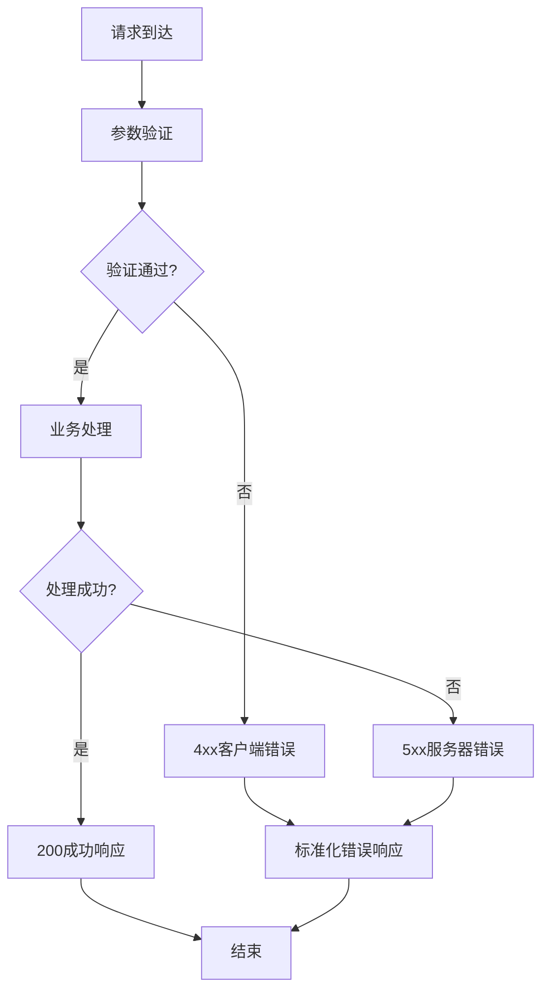

#### 错误响应格式

所有错误响应遵循统一格式：

```json
{
  "error": {
    "code": "string",
    "message": "string",
    "details": {}
  }
}
```

#### 错误码映射

| HTTP状态码 | 错误类型 | 用途 |
|------------|----------|------|
| 400 | Bad Request | 参数验证失败 |
| 401 | Unauthorized | 认证失败 |
| 403 | Forbidden | 权限不足 |
| 404 | Not Found | 资源不存在 |
| 429 | Too Many Requests | 请求频率过高 |
| 500 | Internal Server Error | 服务器内部错误 |
| 503 | Service Unavailable | 服务不可用 |

### 异常处理流程

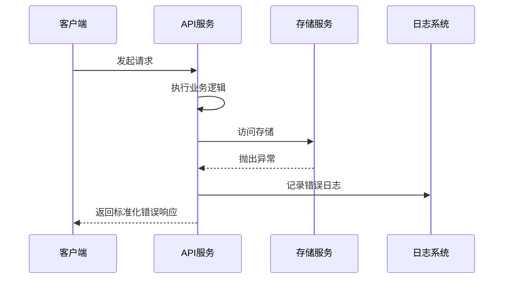

**图表来源**
- [apps/api/app/services/storage/s3_storage.py:23-32](file://apps/api/app/services/storage/s3_storage.py#L23-L32)

**章节来源**
- [apps/api/app/services/storage/s3_storage.py:23-50](file://apps/api/app/services/storage/s3_storage.py#L23-L50)

## 性能优化建议

### 存储优化

#### 连接池配置
- **连接超时**: 3秒（减少请求等待时间）
- **读取超时**: 8秒（提高大文件传输效率）
- **重试次数**: 1次（避免长时间阻塞）

#### 缓存策略
- **单例模式**: LRU缓存确保服务实例复用
- **最大缓存**: 1个实例（避免内存泄漏）
- **自动清理**: 服务销毁时自动释放资源

### 网络优化

#### CORS配置
- **允许源**: 多个开发和生产域名
- **允许方法**: 所有HTTP方法
- **允许头**: 所有自定义头

#### 压缩支持
建议启用Gzip压缩以减少传输体积：
```python
# 在FastAPI中启用
app.add_middleware(GZipMiddleware, minimum_size=1024)
```

### 数据库优化

#### 索引策略
- **唯一约束**: `bucket + object_key`组合索引
- **查询优化**: 针对用户ID和时间范围的查询优化

#### 连接池
- **最大连接数**: 根据并发需求调整
- **连接超时**: 合理的超时设置
- **自动重连**: 断线自动恢复

## 故障排除指南

### 常见问题诊断

#### 存储连接问题
**症状**: 503 Service Unavailable错误
**可能原因**:
- MinIO服务不可达
- 网络连接超时
- 凭证配置错误

**解决步骤**:
1. 检查MinIO服务状态
2. 验证网络连通性
3. 确认存储凭证正确
4. 查看服务日志

#### 文件上传失败
**症状**: 400 Bad Request错误
**可能原因**:
- 不支持的文件类型
- 空文件上传
- 图片格式损坏

**解决步骤**:
1. 检查文件扩展名
2. 验证文件完整性
3. 确认MIME类型正确
4. 测试小文件上传

#### 认证失败
**症状**: 401 Unauthorized错误
**可能原因**:
- 令牌过期
- 令牌格式错误
- 用户状态异常

**解决步骤**:
1. 重新登录获取新令牌
2. 检查令牌格式
3. 验证用户激活状态
4. 确认令牌未被篡改

### 监控指标

建议监控以下关键指标：
- **请求成功率**: 99%以上
- **响应时间**: P95 < 2秒
- **存储容量**: 预留20%额外空间
- **错误率**: < 0.1%

### 日志记录

#### 日志级别
- **错误**: 所有异常和错误
- **警告**: 可能的问题
- **信息**: 正常操作
- **调试**: 开发和测试

#### 关键日志字段
- 请求ID: 唯一请求标识
- 用户ID: 操作用户
- 操作类型: CRUD操作
- 时间戳: 操作时间
- 结果: 成功/失败

**章节来源**
- [apps/api/app/services/storage/s3_storage.py:13-21](file://apps/api/app/services/storage/s3_storage.py#L13-L21)

## 结论

AI摄影教练图片API提供了一个功能完整、安全可靠的图片管理解决方案。通过采用现代化的技术栈和最佳实践，该API能够满足当前的应用需求，并为未来的扩展奠定了坚实的基础。

### 主要优势

1. **架构清晰**: 分层设计确保了良好的可维护性
2. **安全可靠**: 完整的认证授权机制
3. **性能优秀**: 优化的存储和网络配置
4. **易于扩展**: 模块化设计支持功能扩展

### 改进建议

1. **添加下载端点**: 实现专门的图片下载接口
2. **实现删除功能**: 添加图片删除和清理机制
3. **增加文件大小限制**: 设置合理的上传限制
4. **优化错误处理**: 提供更详细的错误信息
5. **增强监控**: 添加更全面的性能监控

该API为AI摄影教练应用提供了坚实的基础设施，支持高质量的图片处理和存储需求，为用户提供了流畅的使用体验。