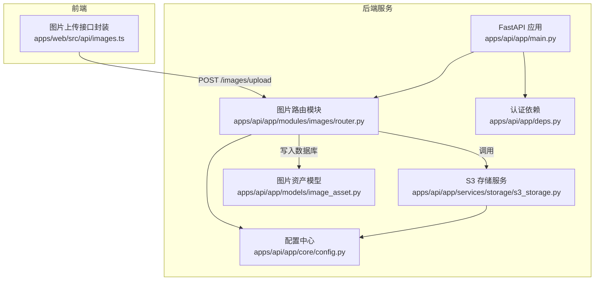
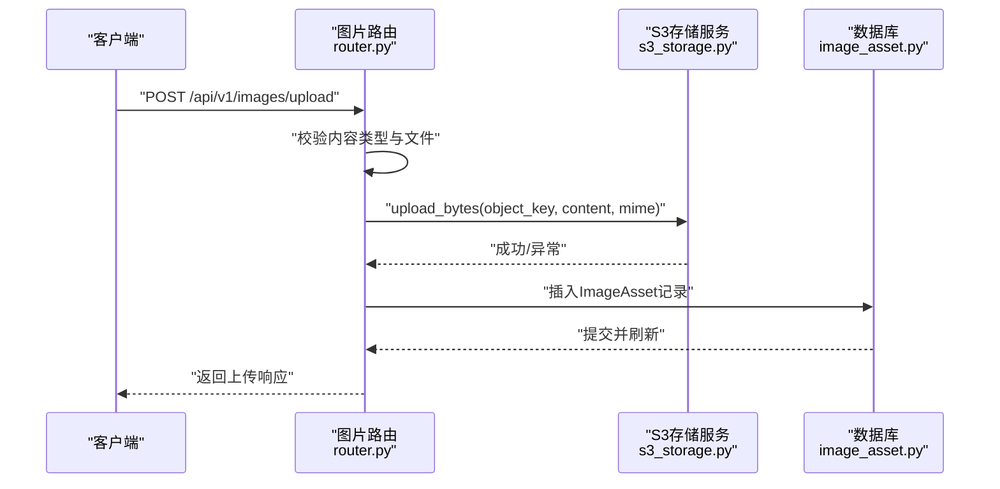
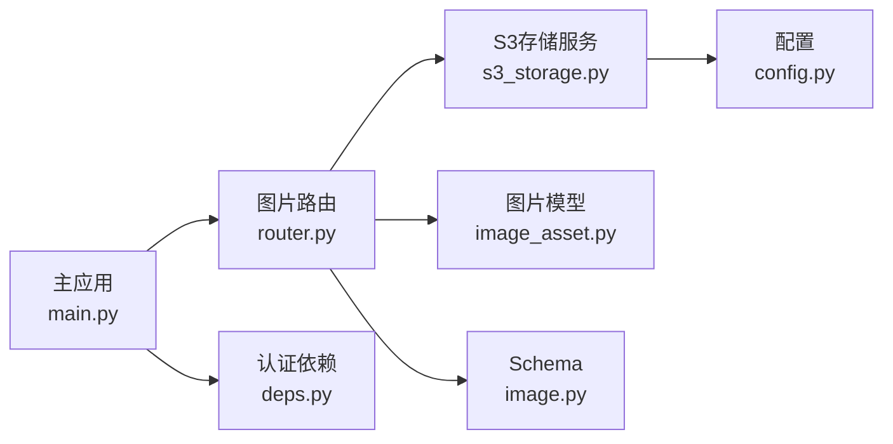
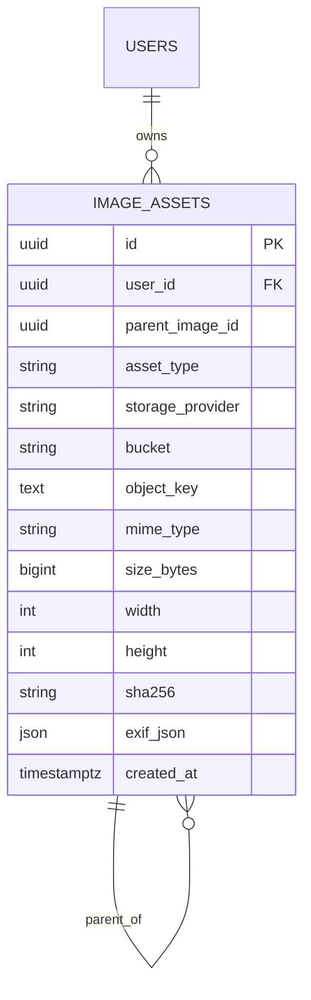
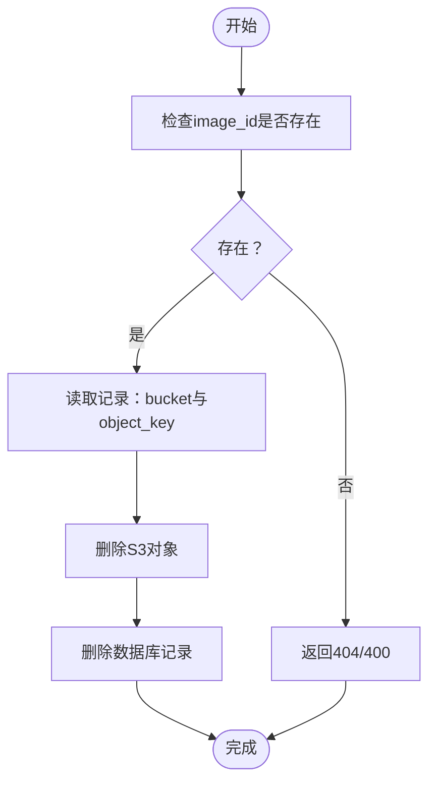

# 图片管理API

<cite>
**本文引用的文件**
- [apps/api/app/modules/images/router.py](file://apps/api/app/modules/images/router.py)
- [apps/api/app/schemas/image.py](file://apps/api/app/schemas/image.py)
- [apps/api/app/models/image_asset.py](file://apps/api/app/models/image_asset.py)
- [apps/api/app/services/storage/s3_storage.py](file://apps/api/app/services/storage/s3_storage.py)
- [apps/api/app/main.py](file://apps/api/app/main.py)
- [apps/api/app/core/config.py](file://apps/api/app/core/config.py)
- [apps/api/app/deps.py](file://apps/api/app/deps.py)
- [apps/web/src/api/images.ts](file://apps/web/src/api/images.ts)
- [apps/api/app/core/database.py](file://apps/api/app/core/database.py)
</cite>

## 目录
1. [简介](#简介)
2. [项目结构](#项目结构)
3. [核心组件](#核心组件)
4. [架构总览](#架构总览)
5. [详细组件分析](#详细组件分析)
6. [依赖分析](#依赖分析)
7. [性能考虑](#性能考虑)
8. [故障排除指南](#故障排除指南)
9. [结论](#结论)
10. [附录](#附录)

## 简介
本文件为“AI摄影教练”图片管理系统的API文档，聚焦于图片上传、下载、删除、列表查询等核心能力，并补充图片元数据管理、预览与缩略图生成、S3兼容存储路径与访问控制、请求与响应示例、错误处理与异常场景说明，以及图片删除的级联与清理机制。

## 项目结构
图片管理模块位于后端服务的模块化路由中，采用FastAPI框架组织，配合SQLAlchemy模型与Boto3 S3客户端实现文件存储与元数据持久化。前端通过FormData上传图片，后端完成校验、解析、存储与入库。

图表来源
- [apps/api/app/main.py:11-24](file://apps/api/app/main.py#L11-L24)
- [apps/api/app/modules/images/router.py:17-77](file://apps/api/app/modules/images/router.py#L17-L77)
- [apps/api/app/services/storage/s3_storage.py:11-59](file://apps/api/app/services/storage/s3_storage.py#L11-L59)
- [apps/api/app/models/image_asset.py:10-32](file://apps/api/app/models/image_asset.py#L10-L32)
- [apps/api/app/core/config.py:6-47](file://apps/api/app/core/config.py#L6-L47)
- [apps/web/src/api/images.ts:12-22](file://apps/web/src/api/images.ts#L12-L22)

章节来源
- [apps/api/app/main.py:11-24](file://apps/api/app/main.py#L11-L24)
- [apps/api/app/modules/images/router.py:17-77](file://apps/api/app/modules/images/router.py#L17-L77)
- [apps/api/app/services/storage/s3_storage.py:11-59](file://apps/api/app/services/storage/s3_storage.py#L11-L59)
- [apps/api/app/models/image_asset.py:10-32](file://apps/api/app/models/image_asset.py#L10-L32)
- [apps/api/app/core/config.py:6-47](file://apps/api/app/core/config.py#L6-L47)
- [apps/web/src/api/images.ts:12-22](file://apps/web/src/api/images.ts#L12-L22)

## 核心组件
- 图片上传接口：接收multipart/form-data，校验内容类型与文件有效性，生成对象键，上传至S3兼容存储，写入数据库并返回上传结果。
- S3存储服务：封装Boto3客户端，负责桶存在性检查、对象上传、下载与可用性异常处理。
- 图片资产模型：定义图片元数据字段，含用户ID、父图ID、类型、存储提供商、桶名、对象键、MIME类型、尺寸、哈希、EXIF等。
- 路由与认证：基于Bearer Token鉴权，路由前缀统一为/api/v1，图片模块挂载在/images下。

章节来源
- [apps/api/app/modules/images/router.py:20-77](file://apps/api/app/modules/images/router.py#L20-L77)
- [apps/api/app/services/storage/s3_storage.py:11-59](file://apps/api/app/services/storage/s3_storage.py#L11-L59)
- [apps/api/app/models/image_asset.py:10-32](file://apps/api/app/models/image_asset.py#L10-L32)
- [apps/api/app/deps.py:15-41](file://apps/api/app/deps.py#L15-L41)
- [apps/api/app/core/config.py:9-11](file://apps/api/app/core/config.py#L9-L11)

## 架构总览
图片管理API遵循“请求-校验-解析-存储-入库-响应”的标准流程；S3存储作为外部依赖，通过配置中心集中管理endpoint、密钥与桶名；数据库层通过SQLAlchemy ORM映射到image_assets表，确保数据一致性与可扩展性。

图表来源
- [apps/api/app/modules/images/router.py:20-77](file://apps/api/app/modules/images/router.py#L20-L77)
- [apps/api/app/services/storage/s3_storage.py:34-43](file://apps/api/app/services/storage/s3_storage.py#L34-L43)
- [apps/api/app/models/image_asset.py:10-32](file://apps/api/app/models/image_asset.py#L10-L32)

## 详细组件分析

### 图片上传接口
- 接口路径：/api/v1/images/upload
- 方法：POST
- 内容类型：multipart/form-data
- 必填字段：file（二进制图片）
- 验证规则：
  - 仅允许image/*类型
  - 文件不可为空
  - 可读取并解析为有效图片（宽高可获取）
- 对象键生成规则：
  - 结构：{用户ID}/{YYYYMMDD}/{UUID小写十六进制}.{扩展名或默认.jpg}
  - 扩展名来自原始文件名，若缺失则使用.jpg
- 存储策略：
  - 使用S3兼容存储（MinIO），桶名来自配置
  - 上传时设置Content-Type为原文件MIME类型
- 元数据入库：
  - 字段：user_id、parent_image_id（空）、asset_type（默认original）、storage_provider（默认minio）、bucket、object_key、mime_type、size_bytes、width、height、sha256、exif_json（空）
- 响应模型：包含image_id、mime_type、size_bytes、width、height、object_key

请求示例（multipart/form-data）
- Content-Disposition: form-data; name="file"; filename="example.png"
- Content-Type: image/png

响应示例
- image_id: "唯一标识符"
- mime_type: "image/png"
- size_bytes: 123456
- width: 1920
- height: 1080
- object_key: "{用户ID}/{YYYYMMDD}/{UUID}.扩展名"

错误处理
- 400：非图片类型、空文件、无效图片
- 503：存储不可用（桶不存在且无法创建）

章节来源
- [apps/api/app/modules/images/router.py:20-77](file://apps/api/app/modules/images/router.py#L20-L77)
- [apps/api/app/schemas/image.py:6-14](file://apps/api/app/schemas/image.py#L6-L14)
- [apps/web/src/api/images.ts:12-22](file://apps/web/src/api/images.ts#L12-L22)

### 图片下载接口
- 接口路径：/api/v1/images/download/{object_key}
- 方法：GET
- 功能：从S3读取指定object_key的图片字节流
- 返回：application/octet-stream或对应MIME类型
- 错误：503存储不可用

注意：当前仓库未提供该路由实现，请参考S3存储服务的下载方法进行扩展。

章节来源
- [apps/api/app/services/storage/s3_storage.py:45-50](file://apps/api/app/services/storage/s3_storage.py#L45-L50)

### 图片删除接口
- 接口路径：/api/v1/images/delete/{image_id}
- 方法：DELETE
- 功能：删除数据库记录与S3对象
- 删除策略：
  - 数据库：按image_id删除记录
  - 存储：根据记录中的bucket与object_key删除对象
- 级联与清理：
  - image_assets表的user_id外键定义了级联删除（用户删除时级联删除其图片）
  - 当前未实现对子图（parent_image_id）的自动清理，如需缩略图/派生图请在业务层补充

注意：当前仓库未提供该路由实现，请参考数据库模型与存储服务进行扩展。

章节来源
- [apps/api/app/models/image_asset.py:15-20](file://apps/api/app/models/image_asset.py#L15-L20)

### 图片列表查询接口
- 接口路径：/api/v1/images/list
- 方法：GET
- 查询参数：user_id（可选）、limit（可选）、offset（可选）
- 返回：分页的图片资产列表（包含id、object_key、mime_type、size_bytes、width、height、created_at等）
- 权限：需Bearer Token鉴权

注意：当前仓库未提供该路由实现，请参考认证依赖与数据库查询进行扩展。

章节来源
- [apps/api/app/deps.py:15-41](file://apps/api/app/deps.py#L15-L41)

### 图片元数据管理接口
- 接口路径：/api/v1/images/meta/{image_id}
- 方法：PUT/GET/DELETE
- 功能：更新、查询、删除图片元数据（标题、描述、标签等）
- 当前模型字段：exif_json（JSON），可扩展用于存储标题、描述、标签等结构化元数据
- 建议扩展：新增meta_json字段或独立meta表，避免与EXIF混淆

注意：当前仓库未提供该路由实现，请参考模型扩展与路由实现进行扩展。

章节来源
- [apps/api/app/models/image_asset.py:29-30](file://apps/api/app/models/image_asset.py#L29-L30)

### 图片预览与缩略图生成接口
- 接口路径：/api/v1/images/preview/{image_id}
- 方法：GET
- 功能：返回原图的预览版本（建议尺寸：1080x?或自适应）
- 实现建议：在上传时同时生成缩略图对象键（如{prefix}/thumb_{uuid}.jpg），并在该接口返回对应对象
- 当前仓库未提供该路由实现，请参考存储路径规则与S3下载进行扩展

章节来源
- [apps/api/app/modules/images/router.py:44-45](file://apps/api/app/modules/images/router.py#L44-L45)

## 依赖分析
- 模块耦合
  - images路由依赖数据库会话、当前用户ID、S3存储服务与图片Schema
  - S3存储服务依赖配置中心
  - 主应用注册路由并启用CORS
- 外部依赖
  - Boto3：S3兼容存储客户端
  - SQLAlchemy：ORM与数据库连接
  - FastAPI：路由与依赖注入
- 潜在循环依赖
  - 未发现直接循环导入

图表来源
- [apps/api/app/modules/images/router.py:11-15](file://apps/api/app/modules/images/router.py#L11-L15)
- [apps/api/app/services/storage/s3_storage.py:8-21](file://apps/api/app/services/storage/s3_storage.py#L8-L21)
- [apps/api/app/models/image_asset.py:4-7](file://apps/api/app/models/image_asset.py#L4-L7)
- [apps/api/app/schemas/image.py:3](file://apps/api/app/schemas/image.py#L3)
- [apps/api/app/core/config.py:6-47](file://apps/api/app/core/config.py#L6-L47)
- [apps/api/app/main.py:6-9](file://apps/api/app/main.py#L6-L9)
- [apps/api/app/deps.py:4-12](file://apps/api/app/deps.py#L4-L12)

章节来源
- [apps/api/app/modules/images/router.py:11-15](file://apps/api/app/modules/images/router.py#L11-L15)
- [apps/api/app/services/storage/s3_storage.py:8-21](file://apps/api/app/services/storage/s3_storage.py#L8-L21)
- [apps/api/app/models/image_asset.py:4-7](file://apps/api/app/models/image_asset.py#L4-L7)
- [apps/api/app/schemas/image.py:3](file://apps/api/app/schemas/image.py#L3)
- [apps/api/app/core/config.py:6-47](file://apps/api/app/core/config.py#L6-L47)
- [apps/api/app/main.py:6-9](file://apps/api/app/main.py#L6-L9)
- [apps/api/app/deps.py:4-12](file://apps/api/app/deps.py#L4-L12)

## 性能考虑
- 上传流程
  - 将整张图片读入内存，适合中小文件；大文件建议分块上传或流式处理
  - SHA256计算与PIL解析增加CPU开销，建议在Worker中异步处理
- 存储
  - S3客户端超时配置已优化连接与读取时间，确保高可用
  - 建议开启对象版本控制与生命周期策略（如需长期保留）
- 数据库
  - 增量更新已在开发阶段应用，确保表结构演进
  - 建议为user_id与created_at建立索引以提升查询性能

## 故障排除指南
- 400错误
  - 非image/*类型：检查Content-Type
  - 空文件：确认FormData是否正确append
  - 无效图片：确认文件完整且为有效图像格式
- 503错误
  - 存储不可用：检查S3端点、密钥、桶名与网络连通性
  - 桶不存在且创建失败：确认权限与区域配置
- 认证失败
  - 401未认证：确认Bearer Token是否携带与有效
  - 用户状态异常：确认用户存在且is_active为真

章节来源
- [apps/api/app/modules/images/router.py:26-37](file://apps/api/app/modules/images/router.py#L26-L37)
- [apps/api/app/services/storage/s3_storage.py:23-32](file://apps/api/app/services/storage/s3_storage.py#L23-L32)
- [apps/api/app/deps.py:20-32](file://apps/api/app/deps.py#L20-L32)

## 结论
本API围绕“上传-存储-入库-鉴权”构建，具备清晰的扩展点。当前仓库实现了上传与基础存储，其他接口（下载、删除、列表、元数据、预览）可在现有依赖与模型基础上快速扩展。建议优先完善鉴权中间件与路由注册，补齐S3下载与对象删除逻辑，并在数据库层面扩展元数据字段以满足业务需求。

## 附录

### 请求与响应示例（基于现有实现）
- 上传请求（multipart/form-data）
  - 字段：file（二进制图片）
  - Content-Type：multipart/form-data
- 上传响应
  - 字段：image_id、mime_type、size_bytes、width、height、object_key

章节来源
- [apps/web/src/api/images.ts:12-22](file://apps/web/src/api/images.ts#L12-L22)
- [apps/api/app/schemas/image.py:6-14](file://apps/api/app/schemas/image.py#L6-L14)

### 存储路径与访问控制
- 路径规则
  - {用户ID}/{YYYYMMDD}/{UUID小写十六进制}.{扩展名或默认.jpg}
- 访问控制
  - 当前未实现私有访问控制；建议在S3侧设置桶策略或使用Presigned URL
  - 若使用MinIO Console，可配置公开读或私有读写策略

章节来源
- [apps/api/app/modules/images/router.py:44-45](file://apps/api/app/modules/images/router.py#L44-L45)
- [apps/api/app/core/config.py:16-20](file://apps/api/app/core/config.py#L16-L20)

### 数据库模型（image_assets）

图表来源
- [apps/api/app/models/image_asset.py:10-32](file://apps/api/app/models/image_asset.py#L10-L32)

### 删除流程（概念）

[此图为概念流程，不对应具体源码文件]