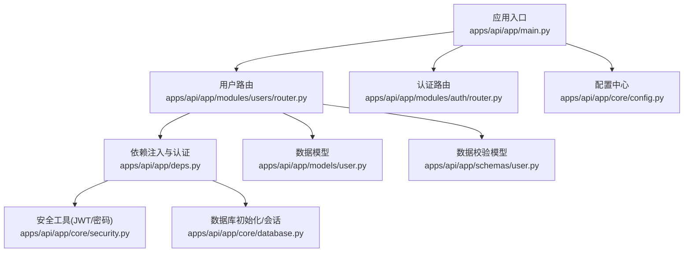
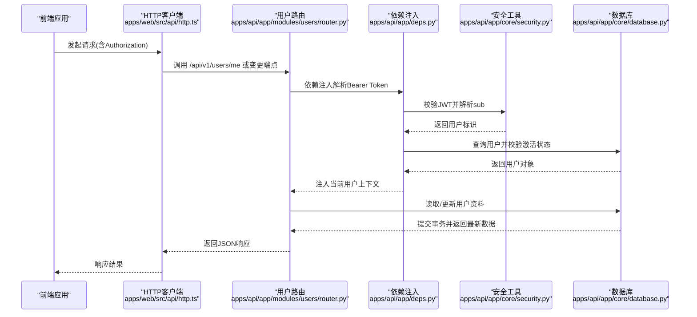
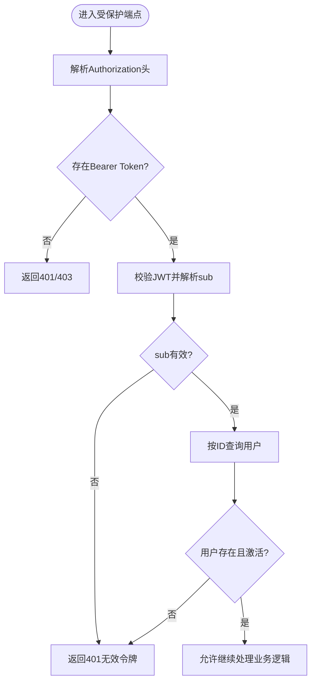
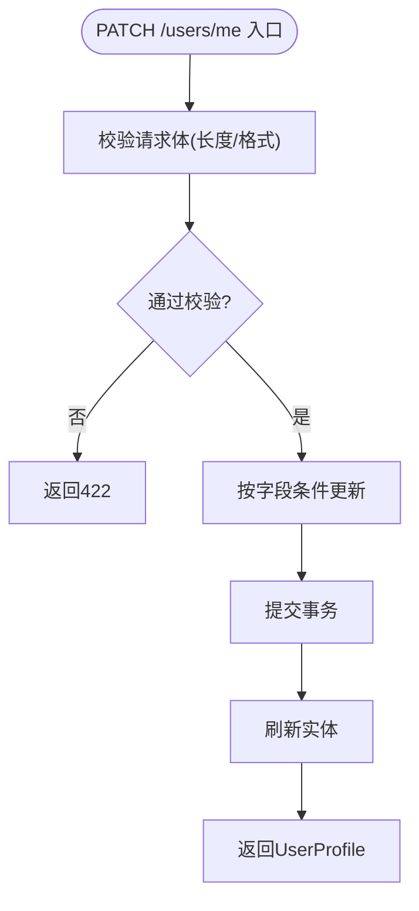
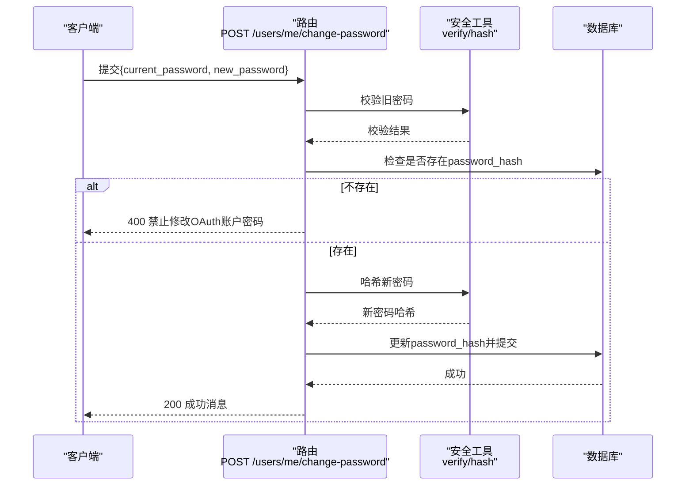
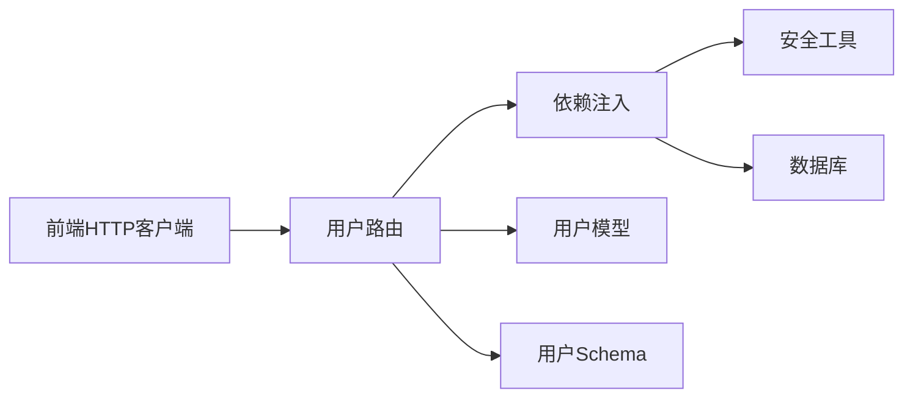
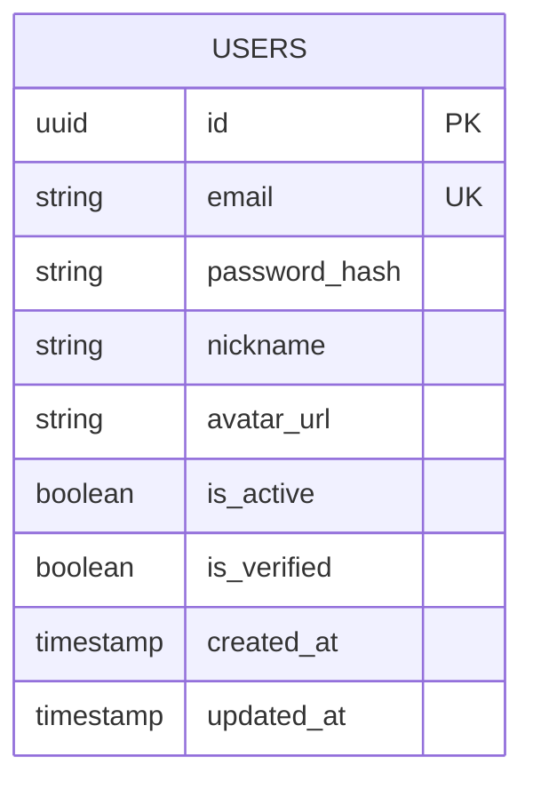

# 用户API

<cite>
**本文引用的文件**
- [apps/api/app/main.py](file://apps/api/app/main.py)
- [apps/api/app/modules/users/router.py](file://apps/api/app/modules/users/router.py)
- [apps/api/app/deps.py](file://apps/api/app/deps.py)
- [apps/api/app/schemas/user.py](file://apps/api/app/schemas/user.py)
- [apps/api/app/models/user.py](file://apps/api/app/models/user.py)
- [apps/api/app/core/security.py](file://apps/api/app/core/security.py)
- [apps/api/app/core/config.py](file://apps/api/app/core/config.py)
- [apps/api/app/core/database.py](file://apps/api/app/core/database.py)
- [apps/api/tests/test_users.py](file://apps/api/tests/test_users.py)
- [apps/web/src/api/auth.ts](file://apps/web/src/api/auth.ts)
- [apps/web/src/api/http.ts](file://apps/web/src/api/http.ts)
- [apps/api/app/modules/auth/router.py](file://apps/api/app/modules/auth/router.py)
</cite>

## 目录
1. [简介](#简介)
2. [项目结构](#项目结构)
3. [核心组件](#核心组件)
4. [架构总览](#架构总览)
5. [详细组件分析](#详细组件分析)
6. [依赖分析](#依赖分析)
7. [性能考虑](#性能考虑)
8. [故障排查指南](#故障排查指南)
9. [结论](#结论)
10. [附录](#附录)

## 简介
本文件为“AI摄影教练”项目中用户API的完整技术文档，聚焦于用户信息管理与个人资料更新相关端点。内容涵盖：
- HTTP方法、URL模式、请求参数与响应格式
- 权限控制与数据验证规则
- 个人资料修改的字段更新机制与数据一致性保障
- 请求/响应示例（以路径形式给出）
- 数据安全与隐私保护措施
- 最佳实践与常见问题解决方案

## 项目结构
用户API位于后端FastAPI应用中，采用模块化组织方式，核心路由集中在 users 模块，权限与安全工具在 core 子模块中提供。

图表来源
- [apps/api/app/main.py:1-36](file://apps/api/app/main.py#L1-L36)
- [apps/api/app/modules/users/router.py:1-71](file://apps/api/app/modules/users/router.py#L1-L71)
- [apps/api/app/deps.py:1-41](file://apps/api/app/deps.py#L1-L41)
- [apps/api/app/models/user.py:1-28](file://apps/api/app/models/user.py#L1-L28)
- [apps/api/app/schemas/user.py:1-30](file://apps/api/app/schemas/user.py#L1-L30)
- [apps/api/app/core/security.py:1-72](file://apps/api/app/core/security.py#L1-L72)
- [apps/api/app/core/database.py:1-39](file://apps/api/app/core/database.py#L1-L39)
- [apps/api/app/core/config.py:1-47](file://apps/api/app/core/config.py#L1-L47)

章节来源
- [apps/api/app/main.py:1-36](file://apps/api/app/main.py#L1-L36)
- [apps/api/app/modules/users/router.py:1-71](file://apps/api/app/modules/users/router.py#L1-L71)

## 核心组件
- 用户路由模块：提供“获取我的资料”“更新我的资料”“修改密码”三个端点，均需携带有效的Bearer Token访问。
- 依赖注入与认证：通过HTTP Bearer Token解析用户身份，校验令牌有效性与账户激活状态。
- 数据模型与Schema：定义用户实体字段及请求/响应的数据结构与约束。
- 安全工具：提供JWT签发/校验、密码哈希与校验能力。
- 数据库与配置：基于SQLAlchemy与Alembic迁移，配置CORS、API前缀、JWT密钥与过期策略等。

章节来源
- [apps/api/app/modules/users/router.py:1-71](file://apps/api/app/modules/users/router.py#L1-L71)
- [apps/api/app/deps.py:1-41](file://apps/api/app/deps.py#L1-L41)
- [apps/api/app/schemas/user.py:1-30](file://apps/api/app/schemas/user.py#L1-L30)
- [apps/api/app/models/user.py:1-28](file://apps/api/app/models/user.py#L1-L28)
- [apps/api/app/core/security.py:1-72](file://apps/api/app/core/security.py#L1-L72)
- [apps/api/app/core/config.py:1-47](file://apps/api/app/core/config.py#L1-L47)
- [apps/api/app/core/database.py:1-39](file://apps/api/app/core/database.py#L1-L39)

## 架构总览
用户API的调用链路如下：前端通过HTTP客户端发起请求，携带Authorization: Bearer Token；后端路由解析依赖，调用数据库服务，完成业务处理与数据持久化。

图表来源
- [apps/web/src/api/http.ts:1-94](file://apps/web/src/api/http.ts#L1-L94)
- [apps/api/app/modules/users/router.py:1-71](file://apps/api/app/modules/users/router.py#L1-L71)
- [apps/api/app/deps.py:1-41](file://apps/api/app/deps.py#L1-L41)
- [apps/api/app/core/security.py:1-72](file://apps/api/app/core/security.py#L1-L72)
- [apps/api/app/core/database.py:1-39](file://apps/api/app/core/database.py#L1-L39)

## 详细组件分析

### 用户路由与端点定义
- 基础路径：/api/v1/users
- 认证方式：HTTP Bearer Token（Authorization: Bearer <token>）
- 关键端点
  - GET /users/me：获取当前用户资料
  - PATCH /users/me：更新当前用户资料（昵称、头像）
  - POST /users/me/change-password：修改密码

章节来源
- [apps/api/app/modules/users/router.py:13-71](file://apps/api/app/modules/users/router.py#L13-L71)
- [apps/api/app/main.py:21-24](file://apps/api/app/main.py#L21-L24)

### 权限控制与认证流程
- 令牌解析：使用HTTPBearer自动提取Authorization头中的Bearer Token。
- 令牌校验：通过安全模块对JWT进行解码与有效期检查，解析sub（用户标识）。
- 用户查询：根据sub在数据库中查找用户，并确保账户处于激活状态。
- 未认证/无效令牌：返回401 Unauthorized或403 Forbidden（取决于框架默认行为）。

图表来源
- [apps/api/app/deps.py:15-33](file://apps/api/app/deps.py#L15-L33)
- [apps/api/app/core/security.py:49-71](file://apps/api/app/core/security.py#L49-L71)

章节来源
- [apps/api/app/deps.py:15-33](file://apps/api/app/deps.py#L15-L33)
- [apps/api/app/core/security.py:49-71](file://apps/api/app/core/security.py#L49-L71)

### 数据模型与Schema
- 用户模型字段（部分关键字段）
  - id: UUID 主键
  - email: 字符串，唯一，非空
  - password_hash: 字符串，可空（OAuth用户可能无密码）
  - nickname: 字符串，最大长度50，可空
  - avatar_url: 字符串，可空
  - is_active: 布尔，默认True
  - is_verified: 布尔，默认False
  - created_at/updated_at: 时间戳
- 响应模型UserProfile
  - id, email, nickname, avatar_url, is_verified, created_at
- 请求模型
  - UpdateProfileRequest：nickname(可空，最大50字符), avatar_url(可空)
  - ChangePasswordRequest：current_password(必填), new_password(必填，最小8字符)

章节来源
- [apps/api/app/models/user.py:12-28](file://apps/api/app/models/user.py#L12-L28)
- [apps/api/app/schemas/user.py:8-30](file://apps/api/app/schemas/user.py#L8-L30)

### 个人资料更新机制与一致性
- 更新策略
  - PATCH /users/me 支持部分更新：仅当传入字段非空时才更新对应属性。
  - 更新完成后提交事务并刷新实体，确保返回最新值。
- 一致性保障
  - 使用SQLAlchemy会话与commit确保原子性。
  - 刷新实体避免缓存导致的脏读。

图表来源
- [apps/api/app/modules/users/router.py:35-48](file://apps/api/app/modules/users/router.py#L35-L48)
- [apps/api/app/schemas/user.py:20-24](file://apps/api/app/schemas/user.py#L20-L24)

章节来源
- [apps/api/app/modules/users/router.py:35-48](file://apps/api/app/modules/users/router.py#L35-L48)
- [apps/api/app/schemas/user.py:20-24](file://apps/api/app/schemas/user.py#L20-L24)

### 密码修改流程与安全
- 限制条件
  - 仅当用户具备password_hash时允许修改密码；OAuth-only账户禁止修改密码。
  - 必须提供正确的current_password，否则拒绝。
- 处理流程
  - 校验旧密码
  - 对新密码进行哈希
  - 更新数据库并提交事务
- 安全要点
  - 新密码最小长度约束
  - 使用安全工具提供的哈希与校验函数

图表来源
- [apps/api/app/modules/users/router.py:51-70](file://apps/api/app/modules/users/router.py#L51-L70)
- [apps/api/app/core/security.py:22-29](file://apps/api/app/core/security.py#L22-L29)

章节来源
- [apps/api/app/modules/users/router.py:51-70](file://apps/api/app/modules/users/router.py#L51-L70)
- [apps/api/app/core/security.py:22-29](file://apps/api/app/core/security.py#L22-L29)

### API定义与示例

- 获取我的资料
  - 方法与路径：GET /api/v1/users/me
  - 认证：必需
  - 响应模型：UserProfile
  - 示例响应路径：[apps/web/src/api/auth.ts#L3-L10:3-10](file://apps/web/src/api/auth.ts#L3-L10)
  - 测试断言参考：[apps/api/tests/test_users.py#L80-87:80-87](file://apps/api/tests/test_users.py#L80-L87)

- 更新我的资料
  - 方法与路径：PATCH /api/v1/users/me
  - 认证：必需
  - 请求体字段：
    - nickname: 字符串，最大50字符（可空）
    - avatar_url: 字符串（可空）
  - 响应模型：UserProfile
  - 示例请求路径：[apps/web/src/api/auth.ts#L49-L51:49-51](file://apps/web/src/api/auth.ts#L49-L51)
  - 测试用例参考：
    - 更新昵称：[apps/api/tests/test_users.py#L97-L103:97-103](file://apps/api/tests/test_users.py#L97-L103)
    - 更新头像：[apps/api/tests/test_users.py#L105-L111:105-111](file://apps/api/tests/test_users.py#L105-L111)
    - 昵称超长校验：[apps/api/tests/test_users.py#L113-L118:113-118](file://apps/api/tests/test_users.py#L113-L118)

- 修改密码
  - 方法与路径：POST /api/v1/users/me/change-password
  - 认证：必需
  - 请求体字段：
    - current_password: 字符串（必填）
    - new_password: 字符串，最小8字符（必填）
  - 响应：成功消息
  - 示例请求路径：[apps/web/src/api/auth.ts#L53-L55:53-55](file://apps/web/src/api/auth.ts#L53-L55)
  - 测试用例参考：
    - 成功修改：[apps/api/tests/test_users.py#L124-L129:124-129](file://apps/api/tests/test_users.py#L124-L129)
    - 旧密码错误：[apps/api/tests/test_users.py#L131-L136:131-136](file://apps/api/tests/test_users.py#L131-L136)
    - 新密码过短：[apps/api/tests/test_users.py#L138-L143:138-143](file://apps/api/tests/test_users.py#L138-L143)

章节来源
- [apps/api/app/modules/users/router.py:29-70](file://apps/api/app/modules/users/router.py#L29-L70)
- [apps/api/app/schemas/user.py:8-30](file://apps/api/app/schemas/user.py#L8-L30)
- [apps/web/src/api/auth.ts:3-55](file://apps/web/src/api/auth.ts#L3-L55)
- [apps/api/tests/test_users.py:77-144](file://apps/api/tests/test_users.py#L77-L144)

## 依赖分析
- 组件耦合
  - 路由层依赖依赖注入与安全工具，职责清晰。
  - 数据模型与Schema分离，便于扩展与约束。
- 外部依赖
  - 数据库：PostgreSQL（通过SQLAlchemy与Alembic迁移）
  - 缓存/存储：Redis与S3（用于任务与图片存储，与用户API间接相关）
  - 前端：Axios封装HTTP客户端，自动注入Token与401刷新逻辑

图表来源
- [apps/api/app/modules/users/router.py:1-71](file://apps/api/app/modules/users/router.py#L1-L71)
- [apps/api/app/deps.py:1-41](file://apps/api/app/deps.py#L1-L41)
- [apps/api/app/models/user.py:1-28](file://apps/api/app/models/user.py#L1-L28)
- [apps/api/app/schemas/user.py:1-30](file://apps/api/app/schemas/user.py#L1-L30)
- [apps/api/app/core/security.py:1-72](file://apps/api/app/core/security.py#L1-L72)
- [apps/api/app/core/database.py:1-39](file://apps/api/app/core/database.py#L1-L39)
- [apps/web/src/api/http.ts:1-94](file://apps/web/src/api/http.ts#L1-L94)

章节来源
- [apps/api/app/modules/users/router.py:1-71](file://apps/api/app/modules/users/router.py#L1-L71)
- [apps/api/app/deps.py:1-41](file://apps/api/app/deps.py#L1-L41)
- [apps/web/src/api/http.ts:1-94](file://apps/web/src/api/http.ts#L1-L94)

## 性能考虑
- 会话与连接池
  - 使用SQLAlchemy连接池与pre_ping，提升连接稳定性。
- 序列化开销
  - Pydantic模型启用from_attributes，减少ORM映射成本。
- 事务粒度
  - 单次更新尽量合并为一次commit，避免频繁IO。
- 前端缓存
  - 建议在前端对UserProfile做轻量缓存，减少重复请求。

## 故障排查指南
- 401/403 未认证或令牌无效
  - 检查Authorization头是否正确携带Bearer Token
  - 校验令牌是否过期或被篡改
  - 确认用户账户处于激活状态
  - 参考：[apps/api/app/deps.py#L20-L33:20-33](file://apps/api/app/deps.py#L20-L33)，[apps/api/app/core/security.py#L49-L71:49-71](file://apps/api/app/core/security.py#L49-L71)
- PATCH /users/me 返回422
  - nickname超过最大长度（50字符）
  - 参考：[apps/api/tests/test_users.py#L113-L118:113-118](file://apps/api/tests/test_users.py#L113-L118)
- POST /users/me/change-password 返回400
  - OAuth-only账户无法修改密码
  - 旧密码不正确
  - 参考：[apps/api/app/modules/users/router.py#L58-L67:58-67](file://apps/api/app/modules/users/router.py#L58-L67)
- POST /users/me/change-password 返回422
  - 新密码长度不足（小于8位）
  - 参考：[apps/api/tests/test_users.py#L138-L143:138-143](file://apps/api/tests/test_users.py#L138-L143)
- 前端401自动刷新
  - Axios拦截器会在401时尝试刷新Token并重试原请求
  - 参考：[apps/web/src/api/http.ts#L37-L91:37-91](file://apps/web/src/api/http.ts#L37-L91)

章节来源
- [apps/api/app/deps.py:20-33](file://apps/api/app/deps.py#L20-L33)
- [apps/api/app/core/security.py:49-71](file://apps/api/app/core/security.py#L49-L71)
- [apps/api/tests/test_users.py:113-143](file://apps/api/tests/test_users.py#L113-L143)
- [apps/api/app/modules/users/router.py:58-67](file://apps/api/app/modules/users/router.py#L58-L67)
- [apps/web/src/api/http.ts:37-91](file://apps/web/src/api/http.ts#L37-L91)

## 结论
用户API围绕Bearer Token认证与Pydantic Schema实现了简洁而健壮的用户资料管理能力。通过明确的权限控制、严格的输入校验与一致的事务处理，保障了数据安全与用户体验。建议在生产环境中强化令牌轮换、速率限制与审计日志，并持续优化前端缓存与错误提示。

## 附录

### 数据模型图

图表来源
- [apps/api/app/models/user.py:12-28](file://apps/api/app/models/user.py#L12-L28)

### 配置项摘要
- API前缀：/api/v1
- CORS允许的源列表（运行时解析）
- JWT密钥、算法与过期时间
- 数据库与缓存/存储地址

章节来源
- [apps/api/app/core/config.py:9-47](file://apps/api/app/core/config.py#L9-L47)