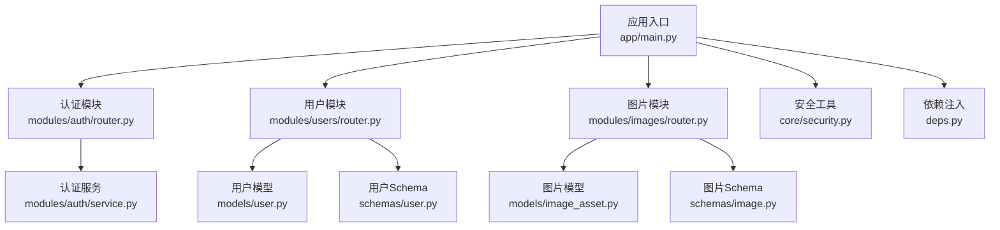
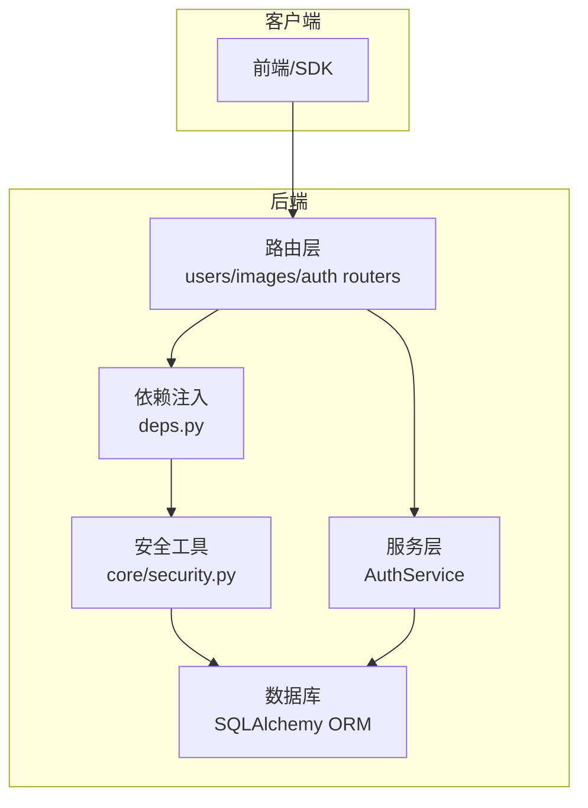
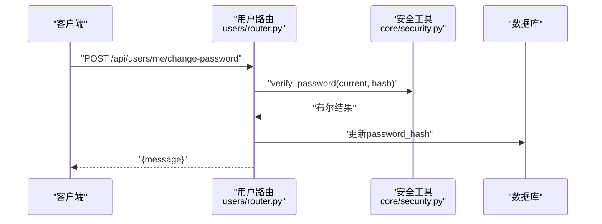
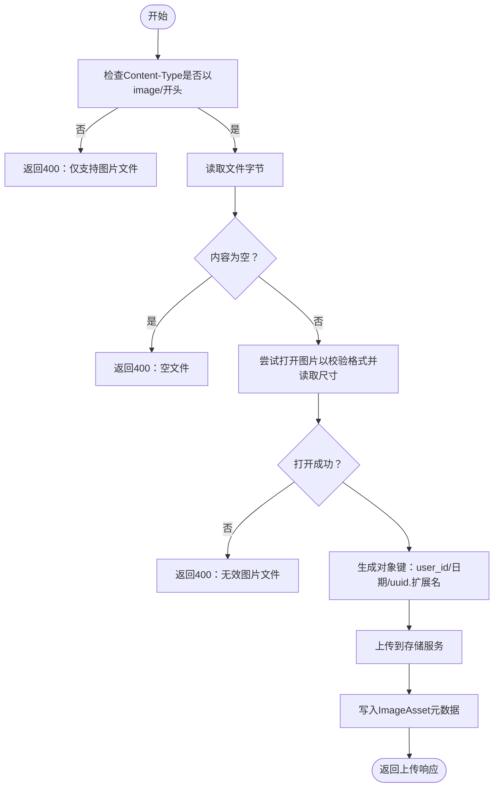
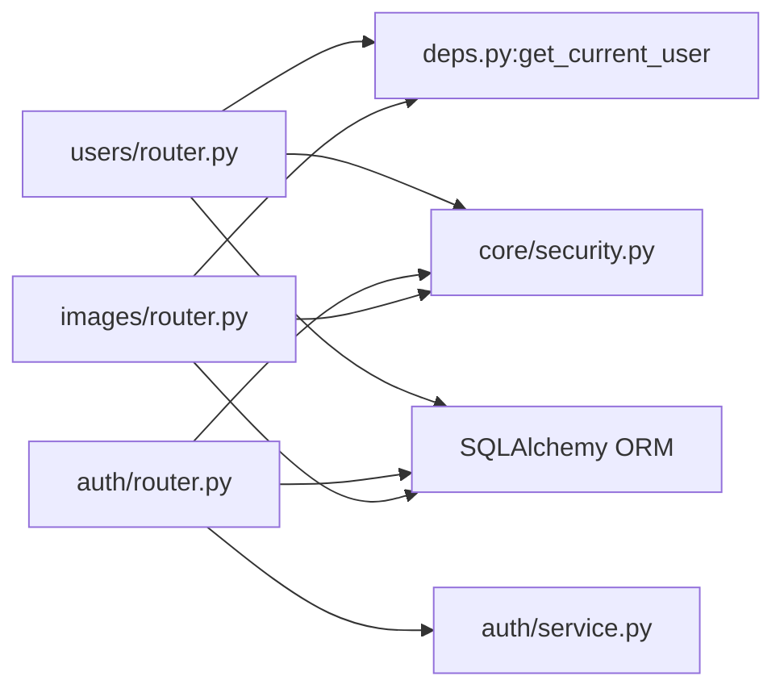

# 用户管理API

<cite>
**本文引用的文件**
- [apps/api/app/main.py](file://apps/api/app/main.py)
- [apps/api/app/modules/users/router.py](file://apps/api/app/modules/users/router.py)
- [apps/api/app/schemas/user.py](file://apps/api/app/schemas/user.py)
- [apps/api/app/models/user.py](file://apps/api/app/models/user.py)
- [apps/api/app/deps.py](file://apps/api/app/deps.py)
- [apps/api/app/core/security.py](file://apps/api/app/core/security.py)
- [apps/api/app/modules/auth/router.py](file://apps/api/app/modules/auth/router.py)
- [apps/api/app/modules/auth/service.py](file://apps/api/app/modules/auth/service.py)
- [apps/api/app/schemas/auth.py](file://apps/api/app/schemas/auth.py)
- [apps/api/app/modules/images/router.py](file://apps/api/app/modules/images/router.py)
- [apps/api/app/schemas/image.py](file://apps/api/app/schemas/image.py)
- [apps/api/app/models/image_asset.py](file://apps/api/app/models/image_asset.py)
</cite>

## 目录
1. [简介](#简介)
2. [项目结构](#项目结构)
3. [核心组件](#核心组件)
4. [架构总览](#架构总览)
5. [详细组件分析](#详细组件分析)
6. [依赖分析](#依赖分析)
7. [性能考虑](#性能考虑)
8. [故障排除指南](#故障排除指南)
9. [结论](#结论)
10. [附录](#附录)

## 简介
本文件为“AI摄影教练”用户管理系统提供完整的用户管理API文档。内容覆盖用户资料查询、更新、头像上传、密码修改、注册与认证、以及与用户相关的资源上传能力。文档基于实际代码实现，明确各接口的请求参数、响应结构、安全机制、错误处理与典型调用场景，并给出可视化图示帮助理解。

## 项目结构
后端采用FastAPI框架，按模块化组织：
- 应用入口与路由挂载：在应用主文件中注册认证、分析、图片、用户等模块路由。
- 用户模块：提供“获取/更新用户资料”和“修改密码”的接口。
- 认证模块：提供注册、登录、刷新、登出、邮箱验证、忘记/重置密码等接口。
- 图片模块：提供图片上传与存储能力，用于头像或分析素材的上传。
- 核心安全与依赖：统一的JWT令牌校验、密码哈希、当前用户解析依赖。

图表来源
- [apps/api/app/main.py:11-24](file://apps/api/app/main.py#L11-L24)
- [apps/api/app/modules/auth/router.py:21](file://apps/api/app/modules/auth/router.py#L21)
- [apps/api/app/modules/users/router.py:13](file://apps/api/app/modules/users/router.py#L13)
- [apps/api/app/modules/images/router.py:17](file://apps/api/app/modules/images/router.py#L17)
- [apps/api/app/modules/auth/service.py:21](file://apps/api/app/modules/auth/service.py#L21)
- [apps/api/app/models/user.py:12](file://apps/api/app/models/user.py#L12)
- [apps/api/app/schemas/user.py:8](file://apps/api/app/schemas/user.py#L8)
- [apps/api/app/models/image_asset.py:10](file://apps/api/app/models/image_asset.py#L10)
- [apps/api/app/schemas/image.py:6](file://apps/api/app/schemas/image.py#L6)
- [apps/api/app/core/security.py:32](file://apps/api/app/core/security.py#L32)
- [apps/api/app/deps.py:15](file://apps/api/app/deps.py#L15)

章节来源
- [apps/api/app/main.py:11-24](file://apps/api/app/main.py#L11-L24)

## 核心组件
- 用户模块路由：提供“获取我的资料”、“更新我的资料”、“修改密码”三个核心接口，均通过Bearer Token鉴权。
- 认证模块路由：提供“注册”、“登录”、“刷新”、“登出”、“邮箱验证”、“重发验证”、“忘记密码”、“重置密码”等接口。
- 图片模块路由：提供“上传图片”，支持图片类型校验、尺寸读取、对象键命名与存储。
- 安全工具：提供JWT生成/校验、密码哈希/校验、令牌载荷定义。
- 依赖注入：统一从Bearer Token解析当前用户，确保接口权限控制一致。

章节来源
- [apps/api/app/modules/users/router.py:13-71](file://apps/api/app/modules/users/router.py#L13-L71)
- [apps/api/app/modules/auth/router.py:21-93](file://apps/api/app/modules/auth/router.py#L21-L93)
- [apps/api/app/modules/images/router.py:17-77](file://apps/api/app/modules/images/router.py#L17-L77)
- [apps/api/app/core/security.py:12-72](file://apps/api/app/core/security.py#L12-L72)
- [apps/api/app/deps.py:15-41](file://apps/api/app/deps.py#L15-L41)

## 架构总览
下图展示用户管理相关模块之间的交互关系与数据流：

图表来源
- [apps/api/app/modules/users/router.py:17-26](file://apps/api/app/modules/users/router.py#L17-L26)
- [apps/api/app/deps.py:15-33](file://apps/api/app/deps.py#L15-L33)
- [apps/api/app/core/security.py:49-72](file://apps/api/app/core/security.py#L49-L72)
- [apps/api/app/modules/auth/service.py:21-145](file://apps/api/app/modules/auth/service.py#L21-L145)

## 详细组件分析

### 用户资料查询接口
- 接口路径：GET /api/users/me
- 权限：Bearer Token
- 功能：返回当前登录用户的资料，包含用户标识、邮箱、昵称、头像URL、是否已验证、创建时间等。
- 响应模型：UserProfile
- 典型响应字段：id、email、nickname、avatar_url、is_verified、created_at

章节来源
- [apps/api/app/modules/users/router.py:29-32](file://apps/api/app/modules/users/router.py#L29-L32)
- [apps/api/app/schemas/user.py:8-17](file://apps/api/app/schemas/user.py#L8-L17)

### 用户资料更新接口
- 接口路径：PATCH /api/users/me
- 权限：Bearer Token
- 请求体：UpdateProfileRequest
  - 字段：nickname（可选，最大长度50）、avatar_url（可选）
- 功能：仅允许更新昵称与头像URL；其他字段不可通过此接口修改。
- 成功响应：返回更新后的UserProfile

章节来源
- [apps/api/app/modules/users/router.py:35-48](file://apps/api/app/modules/users/router.py#L35-L48)
- [apps/api/app/schemas/user.py:20-24](file://apps/api/app/schemas/user.py#L20-L24)
- [apps/api/app/models/user.py:15-27](file://apps/api/app/models/user.py#L15-L27)

### 密码修改接口
- 接口路径：POST /api/users/me/change-password
- 权限：Bearer Token
- 请求体：ChangePasswordRequest
  - 字段：current_password（必填）、new_password（必填，最小长度8）
- 安全机制：
  - 仅当用户具备password_hash时允许修改；OAuth-only账户禁止修改密码。
  - 必须正确验证当前密码，否则拒绝。
  - 新密码将进行哈希存储。
- 成功响应：{"message": "Password changed successfully"}

图表来源
- [apps/api/app/modules/users/router.py:51-70](file://apps/api/app/modules/users/router.py#L51-L70)
- [apps/api/app/core/security.py:27-29](file://apps/api/app/core/security.py#L27-L29)

章节来源
- [apps/api/app/modules/users/router.py:51-70](file://apps/api/app/modules/users/router.py#L51-L70)
- [apps/api/app/schemas/user.py:26-29](file://apps/api/app/schemas/user.py#L26-L29)
- [apps/api/app/core/security.py:22-29](file://apps/api/app/core/security.py#L22-L29)

### 注册接口（验证规则与字段要求）
- 接口路径：POST /api/auth/register
- 请求体：RegisterRequest
  - 字段：email（必填，需符合邮箱格式）、password（必填，最小长度8）、nickname（可选）
- 行为：
  - 若邮箱已被注册，返回冲突错误。
  - 成功后立即发放访问/刷新令牌。
  - 后台会生成一个短期邮箱验证token（开发模式下记录日志）。
- 响应体：TokenResponse（access_token、refresh_token、token_type）

章节来源
- [apps/api/app/modules/auth/router.py:24-39](file://apps/api/app/modules/auth/router.py#L24-L39)
- [apps/api/app/modules/auth/service.py:27-48](file://apps/api/app/modules/auth/service.py#L27-L48)
- [apps/api/app/schemas/auth.py:5-9](file://apps/api/app/schemas/auth.py#L5-L9)
- [apps/api/app/schemas/auth.py:16-19](file://apps/api/app/schemas/auth.py#L16-L19)

### 登录/登出/刷新/邮箱验证
- 登录：POST /api/auth/login → TokenResponse
- 刷新：POST /api/auth/refresh → TokenResponse
- 登出：POST /api/auth/logout → {"message": "Successfully logged out"}
- 邮箱验证：POST /api/auth/verify-email → {"message": "Email verified successfully"}
- 重发验证邮件：POST /api/auth/resend-verification → {"message": "Verification email resent"}
- 忘记密码：POST /api/auth/forgot-password → {"message": "If the email exists, a reset link has been sent"}
- 重置密码：POST /api/auth/reset-password → {"message": "Password reset successfully"}

章节来源
- [apps/api/app/modules/auth/router.py:42-93](file://apps/api/app/modules/auth/router.py#L42-L93)
- [apps/api/app/modules/auth/service.py:50-92](file://apps/api/app/modules/auth/service.py#L50-L92)
- [apps/api/app/modules/auth/service.py:98-140](file://apps/api/app/modules/auth/service.py#L98-L140)

### 头像上传与管理接口
- 接口路径：POST /api/images/upload
- 权限：Bearer Token（通过依赖注入解析当前用户ID）
- 请求：multipart/form-data，字段file为图片文件
- 校验规则：
  - 仅允许image/*类型的文件；空文件拒绝。
  - 使用Pillow读取图片以校验合法性并获取宽高。
- 存储策略：
  - 生成对象键：{user_id}/{YYYYMMDD}/{uuid随机串.扩展名}
  - 上传至存储服务（MinIO），记录元数据（MIME、大小、宽高、SHA256等）。
- 响应体：ImageUploadResponse（image_id、mime_type、size_bytes、width、height、object_key）

图表来源
- [apps/api/app/modules/images/router.py:20-77](file://apps/api/app/modules/images/router.py#L20-L77)
- [apps/api/app/models/image_asset.py:10-32](file://apps/api/app/models/image_asset.py#L10-L32)
- [apps/api/app/schemas/image.py:6-13](file://apps/api/app/schemas/image.py#L6-L13)

章节来源
- [apps/api/app/modules/images/router.py:20-77](file://apps/api/app/modules/images/router.py#L20-L77)
- [apps/api/app/schemas/image.py:6-13](file://apps/api/app/schemas/image.py#L6-L13)
- [apps/api/app/models/image_asset.py:10-32](file://apps/api/app/models/image_asset.py#L10-L32)

### 用户设置管理接口
- 当前仓库未提供专门的“用户设置”接口（如通知偏好、隐私设置等）。
- 可扩展建议：
  - 在用户模型中新增设置字段（如JSON字段），并在用户路由中增加对应接口。
  - 通过PATCH /api/users/me/settings实现设置项的增删改查。
- 本节为概念性说明，不直接对应具体源码。

## 依赖分析
- 路由层依赖：
  - 用户路由依赖HTTP Bearer认证与数据库会话。
  - 认证路由依赖AuthService与数据库会话。
  - 图片路由依赖当前用户ID解析与存储服务。
- 安全与依赖：
  - 统一通过verify_token校验JWT，verify_password/hash_password处理密码。
  - get_current_user依赖HTTPBearer自动解析并校验令牌有效性。

图表来源
- [apps/api/app/modules/users/router.py:17-26](file://apps/api/app/modules/users/router.py#L17-L26)
- [apps/api/app/deps.py:15-33](file://apps/api/app/deps.py#L15-L33)
- [apps/api/app/modules/auth/router.py:24-39](file://apps/api/app/modules/auth/router.py#L24-L39)
- [apps/api/app/modules/auth/service.py:21-48](file://apps/api/app/modules/auth/service.py#L21-L48)
- [apps/api/app/modules/images/router.py:20-25](file://apps/api/app/modules/images/router.py#L20-L25)
- [apps/api/app/core/security.py:49-72](file://apps/api/app/core/security.py#L49-L72)

章节来源
- [apps/api/app/modules/users/router.py:17-26](file://apps/api/app/modules/users/router.py#L17-L26)
- [apps/api/app/deps.py:15-33](file://apps/api/app/deps.py#L15-L33)
- [apps/api/app/modules/auth/router.py:24-39](file://apps/api/app/modules/auth/router.py#L24-L39)
- [apps/api/app/modules/auth/service.py:21-48](file://apps/api/app/modules/auth/service.py#L21-L48)
- [apps/api/app/modules/images/router.py:20-25](file://apps/api/app/modules/images/router.py#L20-L25)
- [apps/api/app/core/security.py:49-72](file://apps/api/app/core/security.py#L49-L72)

## 性能考虑
- 图片上传：
  - 上传前进行格式与尺寸校验，避免无效图片进入存储层。
  - 建议在生产环境对单文件大小设置上限，防止内存压力。
- 数据库事务：
  - 更新用户资料与上传图片均使用commit/refresh，保证一致性。
- 密码处理：
  - 使用bcrypt哈希，避免明文存储；令牌有效期配置可通过配置文件调整。

## 故障排除指南
- 认证失败（401）：
  - 检查Bearer Token是否有效、是否过期、是否被篡改。
  - 确认用户状态为激活。
- 注册冲突（409）：
  - 邮箱已被注册，请更换邮箱或执行登录。
- 修改密码失败（400）：
  - OAuth-only账户无法修改密码。
  - 当前密码不正确。
- 图片上传失败（400）：
  - 文件非图片类型或为空。
  - 图片格式无法识别或尺寸异常。

章节来源
- [apps/api/app/deps.py:20-33](file://apps/api/app/deps.py#L20-L33)
- [apps/api/app/modules/auth/service.py:32-35](file://apps/api/app/modules/auth/service.py#L32-L35)
- [apps/api/app/modules/users/router.py:58-67](file://apps/api/app/modules/users/router.py#L58-L67)
- [apps/api/app/modules/images/router.py:26-37](file://apps/api/app/modules/images/router.py#L26-L37)

## 结论
本用户管理API围绕“资料查询/更新、密码修改、注册/登录/刷新/登出、邮箱验证、图片上传”构建，配合统一的JWT与密码安全机制，满足基础用户生命周期管理需求。若需扩展“用户设置”等高级功能，可在现有模型与路由基础上平滑扩展。

## 附录

### API清单与示例（请求/响应概览）
- 获取我的资料
  - 请求：GET /api/users/me
  - 认证：Bearer
  - 响应：UserProfile
- 更新我的资料
  - 请求：PATCH /api/users/me
  - 认证：Bearer
  - 请求体：UpdateProfileRequest（nickname、avatar_url）
  - 响应：UserProfile
- 修改密码
  - 请求：POST /api/users/me/change-password
  - 认证：Bearer
  - 请求体：ChangePasswordRequest（current_password、new_password）
  - 响应：{"message": "..."}
- 注册
  - 请求：POST /api/auth/register
  - 请求体：RegisterRequest（email、password、nickname）
  - 响应：TokenResponse
- 登录
  - 请求：POST /api/auth/login
  - 请求体：LoginRequest（email、password）
  - 响应：TokenResponse
- 刷新令牌
  - 请求：POST /api/auth/refresh
  - 请求体：RefreshRequest（refresh_token）
  - 响应：TokenResponse
- 登出
  - 请求：POST /api/auth/logout
  - 响应：{"message": "Successfully logged out"}
- 邮箱验证
  - 请求：POST /api/auth/verify-email
  - 请求体：VerifyEmailRequest（token）
  - 响应：{"message": "Email verified successfully"}
- 重发验证邮件
  - 请求：POST /api/auth/resend-verification
  - 响应：{"message": "Verification email resent"}
- 忘记密码
  - 请求：POST /api/auth/forgot-password
  - 请求体：ForgotPasswordRequest（email）
  - 响应：{"message": "..."}
- 重置密码
  - 请求：POST /api/auth/reset-password
  - 请求体：ResetPasswordRequest（token、new_password）
  - 响应：{"message": "Password reset successfully"}
- 上传图片
  - 请求：POST /api/images/upload
  - 认证：Bearer
  - 请求体：multipart/form-data（file）
  - 响应：ImageUploadResponse

章节来源
- [apps/api/app/modules/users/router.py:29-70](file://apps/api/app/modules/users/router.py#L29-L70)
- [apps/api/app/modules/auth/router.py:24-93](file://apps/api/app/modules/auth/router.py#L24-L93)
- [apps/api/app/modules/images/router.py:20-77](file://apps/api/app/modules/images/router.py#L20-L77)