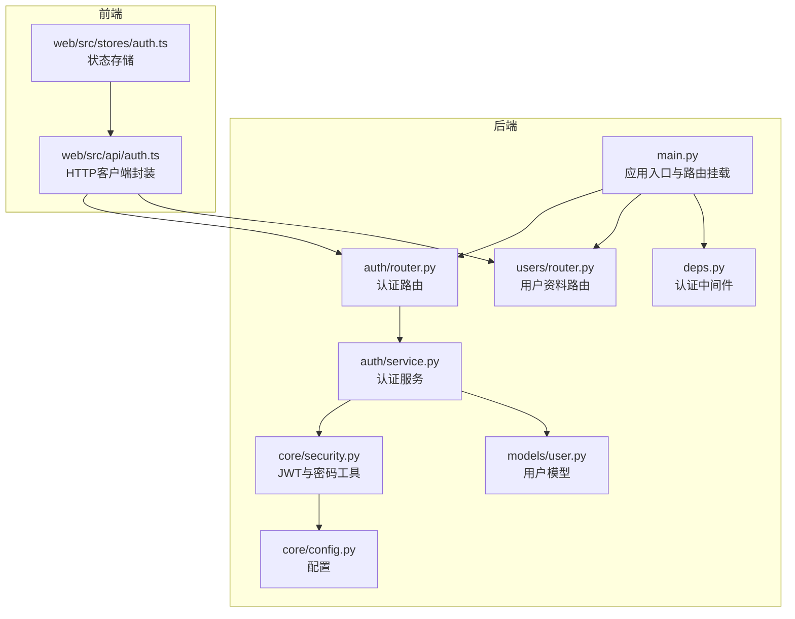
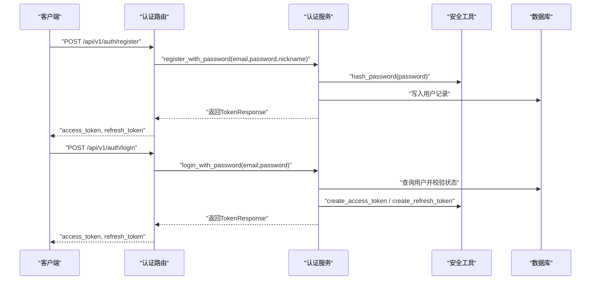
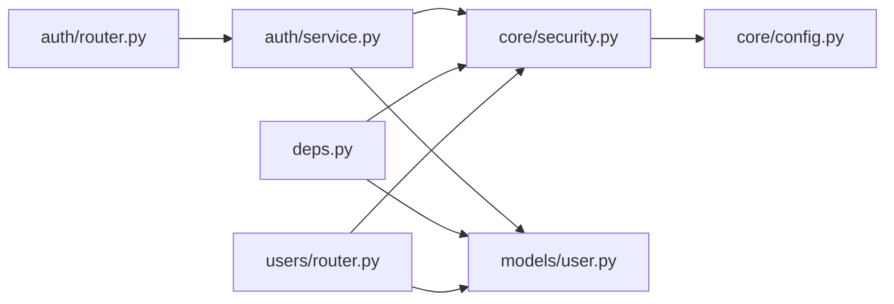
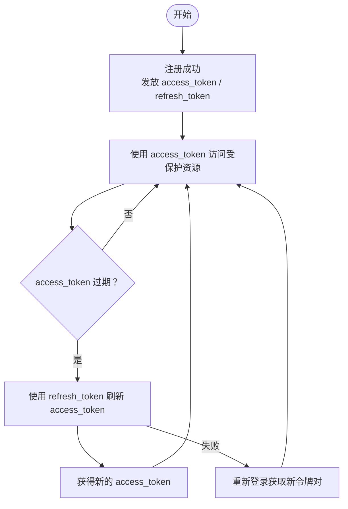

# 认证API

<cite>
**本文引用的文件**
- [apps/api/app/modules/auth/router.py](file://apps/api/app/modules/auth/router.py)
- [apps/api/app/modules/auth/service.py](file://apps/api/app/modules/auth/service.py)
- [apps/api/app/schemas/auth.py](file://apps/api/app/schemas/auth.py)
- [apps/api/app/core/security.py](file://apps/api/app/core/security.py)
- [apps/api/app/models/user.py](file://apps/api/app/models/user.py)
- [apps/api/app/core/config.py](file://apps/api/app/core/config.py)
- [apps/api/app/deps.py](file://apps/api/app/deps.py)
- [apps/api/app/main.py](file://apps/api/app/main.py)
- [apps/api/tests/test_auth.py](file://apps/api/tests/test_auth.py)
- [apps/web/src/api/auth.ts](file://apps/web/src/api/auth.ts)
- [apps/web/src/stores/auth.ts](file://apps/web/src/stores/auth.ts)
- [apps/api/app/modules/users/router.py](file://apps/api/app/modules/users/router.py)
- [apps/api/app/schemas/user.py](file://apps/api/app/schemas/user.py)
</cite>

## 目录
1. [简介](#简介)
2. [项目结构](#项目结构)
3. [核心组件](#核心组件)
4. [架构总览](#架构总览)
5. [详细组件分析](#详细组件分析)
6. [依赖关系分析](#依赖关系分析)
7. [性能考量](#性能考量)
8. [故障排查指南](#故障排查指南)
9. [结论](#结论)
10. [附录](#附录)

## 简介
本文件为“AI摄影教练”项目的认证API详细文档，覆盖用户注册、登录、令牌刷新、登出、邮箱验证、忘记/重置密码等完整认证流程。文档重点说明：
- HTTP端点定义（方法、路径、请求体、响应体）
- JWT令牌生成、验证与刷新机制
- 用户信息校验规则与错误处理
- 认证中间件与权限检查机制
- 安全考虑与最佳实践

## 项目结构
认证相关代码主要位于后端Python应用中，前端Web应用通过HTTP客户端调用这些端点。核心文件分布如下：
- 后端
  - 路由层：apps/api/app/modules/auth/router.py
  - 服务层：apps/api/app/modules/auth/service.py
  - 安全与配置：apps/api/app/core/security.py、apps/api/app/core/config.py
  - 数据模型：apps/api/app/models/user.py
  - 依赖注入与认证中间件：apps/api/app/deps.py
  - 主应用入口与路由挂载：apps/api/app/main.py
  - 测试：apps/api/tests/test_auth.py
- 前端
  - 认证API封装：apps/web/src/api/auth.ts
  - 认证状态管理：apps/web/src/stores/auth.ts
  - 用户资料端点：apps/api/app/modules/users/router.py

图表来源
- [apps/api/app/main.py:1-36](file://apps/api/app/main.py#L1-L36)
- [apps/api/app/modules/auth/router.py:1-93](file://apps/api/app/modules/auth/router.py#L1-L93)
- [apps/api/app/modules/auth/service.py:1-145](file://apps/api/app/modules/auth/service.py#L1-L145)
- [apps/api/app/core/security.py:1-72](file://apps/api/app/core/security.py#L1-L72)
- [apps/api/app/core/config.py:1-47](file://apps/api/app/core/config.py#L1-L47)
- [apps/api/app/models/user.py:1-28](file://apps/api/app/models/user.py#L1-L28)
- [apps/api/app/deps.py:1-41](file://apps/api/app/deps.py#L1-L41)
- [apps/api/app/modules/users/router.py:1-71](file://apps/api/app/modules/users/router.py#L1-L71)
- [apps/web/src/api/auth.ts:1-56](file://apps/web/src/api/auth.ts#L1-L56)
- [apps/web/src/stores/auth.ts:1-41](file://apps/web/src/stores/auth.ts#L1-L41)

章节来源
- [apps/api/app/main.py:1-36](file://apps/api/app/main.py#L1-L36)
- [apps/api/app/modules/auth/router.py:1-93](file://apps/api/app/modules/auth/router.py#L1-L93)

## 核心组件
- 认证路由（/api/v1/auth/*）
  - 注册：POST /auth/register
  - 登录：POST /auth/login
  - 刷新：POST /auth/refresh
  - 登出：POST /auth/logout
  - 邮箱验证：POST /auth/verify-email
  - 重发验证：POST /auth/resend-verification
  - 忘记密码：POST /auth/forgot-password
  - 重置密码：POST /auth/reset-password
- 认证服务
  - 提供注册、登录、刷新、邮箱验证、忘记/重置密码等业务逻辑
- 安全工具
  - 密码哈希与校验、JWT生成与验证
- 认证中间件
  - 从Authorization头解析Bearer Token，解析用户身份
- 数据模型
  - 用户表字段与约束（邮箱唯一、是否激活/验证）

章节来源
- [apps/api/app/modules/auth/router.py:24-92](file://apps/api/app/modules/auth/router.py#L24-L92)
- [apps/api/app/modules/auth/service.py:27-140](file://apps/api/app/modules/auth/service.py#L27-L140)
- [apps/api/app/core/security.py:22-72](file://apps/api/app/core/security.py#L22-L72)
- [apps/api/app/deps.py:15-33](file://apps/api/app/deps.py#L15-L33)
- [apps/api/app/models/user.py:12-27](file://apps/api/app/models/user.py#L12-L27)

## 架构总览
认证系统采用“路由-服务-安全工具-数据模型”的分层设计，配合FastAPI的依赖注入与中间件机制，实现端到端的认证流程。

图表来源
- [apps/api/app/modules/auth/router.py:24-46](file://apps/api/app/modules/auth/router.py#L24-L46)
- [apps/api/app/modules/auth/service.py:27-75](file://apps/api/app/modules/auth/service.py#L27-L75)
- [apps/api/app/core/security.py:32-46](file://apps/api/app/core/security.py#L32-L46)

## 详细组件分析

### 认证路由与端点定义
- 路由前缀：/api/v1/auth
- 关键端点
  - 注册
    - 方法：POST
    - 路径：/auth/register
    - 请求体：RegisterRequest（邮箱、密码、昵称可选）
    - 响应：TokenResponse（access_token、refresh_token、token_type）
    - 行为：检查邮箱唯一性，创建用户并设置默认状态，随后立即登录发放令牌
  - 登录
    - 方法：POST
    - 路径：/auth/login
    - 请求体：LoginRequest（邮箱、密码）
    - 响应：TokenResponse
    - 行为：校验用户存在、账户激活状态、密码正确性，生成访问与刷新令牌
  - 刷新
    - 方法：POST
    - 路径：/auth/refresh
    - 请求体：RefreshRequest（refresh_token）
    - 响应：TokenResponse（access_token更新，refresh_token不变）
    - 行为：验证refresh_token有效性，确保用户仍存在且激活
  - 登出
    - 方法：POST
    - 路径：/auth/logout
    - 请求体：无
    - 响应：通用消息
    - 行为：提示客户端清理本地token
  - 邮箱验证
    - 方法：POST
    - 路径：/auth/verify-email
    - 请求体：VerifyEmailRequest（token）
    - 响应：通用消息
    - 行为：验证token并标记用户为已验证
  - 重发验证
    - 方法：POST
    - 路径：/auth/resend-verification
    - 请求体：无
    - 响应：通用消息
    - 行为：开发阶段预留，后续Task5将增加认证依赖
  - 忘记密码
    - 方法：POST
    - 路径：/auth/forgot-password
    - 请求体：ForgotPasswordRequest（邮箱）
    - 响应：通用消息（无论邮箱是否存在）
    - 行为：在开发模式下输出重置token日志
  - 重置密码
    - 方法：POST
    - 路径：/auth/reset-password
    - 请求体：ResetPasswordRequest（token、新密码）
    - 响应：通用消息
    - 行为：验证token并更新密码

章节来源
- [apps/api/app/modules/auth/router.py:24-92](file://apps/api/app/modules/auth/router.py#L24-L92)
- [apps/api/app/schemas/auth.py:5-37](file://apps/api/app/schemas/auth.py#L5-L37)

### 认证服务（AuthService）
- 注册
  - 检查邮箱唯一性，否则返回冲突
  - 创建用户记录（UUID主键、邮箱、密码哈希、默认激活与未验证）
- 登录
  - 查询用户并校验账户状态与密码
  - 生成access_token与refresh_token
- 刷新
  - 验证refresh_token，查询用户并校验状态
  - 仅更新access_token，保留refresh_token
- 邮箱验证
  - 解析token并更新用户验证状态
- 忘记/重置密码
  - 发送重置token（开发模式记录日志）
  - 验证token并更新密码

章节来源
- [apps/api/app/modules/auth/service.py:27-140](file://apps/api/app/modules/auth/service.py#L27-L140)

### 安全工具与JWT机制
- 密码处理
  - bcrypt哈希与校验
- JWT
  - access_token：默认有效期30分钟
  - refresh_token：默认有效期7天
  - 算法：HS256
  - secret_key：需在生产环境替换
- Token载荷
  - sub：用户标识
  - exp：过期时间
  - type：access或refresh
- 验证
  - 解码并校验签名
  - 处理过期与无效token异常

章节来源
- [apps/api/app/core/security.py:22-72](file://apps/api/app/core/security.py#L22-L72)
- [apps/api/app/core/config.py:30-34](file://apps/api/app/core/config.py#L30-L34)

### 认证中间件与权限检查
- HTTP Bearer认证
  - 自动从Authorization头提取凭据
  - 通过verify_token解析用户ID
  - 校验用户存在且处于激活状态
- 在路由中的使用
  - 用户资料端点使用自定义依赖获取当前用户
  - 认证依赖可复用到其他受保护端点

章节来源
- [apps/api/app/deps.py:15-33](file://apps/api/app/deps.py#L15-L33)
- [apps/api/app/modules/users/router.py:17-26](file://apps/api/app/modules/users/router.py#L17-L26)

### 数据模型与约束
- 用户表字段
  - id：UUID主键
  - email：唯一、非空
  - password_hash：可为空（OAuth用户可能无密码）
  - nickname、avatar_url：可空
  - is_active：默认true
  - is_verified：默认false
  - created_at、updated_at：时间戳

章节来源
- [apps/api/app/models/user.py:12-27](file://apps/api/app/models/user.py#L12-L27)

### 前端交互与状态管理
- HTTP客户端封装
  - register、login、refreshTokenRequest、logout、getProfile、updateProfile、changePassword
- 状态管理
  - 存储access_token与refresh_token
  - 清理时移除本地存储

章节来源
- [apps/web/src/api/auth.ts:29-55](file://apps/web/src/api/auth.ts#L29-L55)
- [apps/web/src/stores/auth.ts:12-25](file://apps/web/src/stores/auth.ts#L12-L25)

## 依赖关系分析
- 组件耦合
  - 路由依赖服务；服务依赖安全工具与数据库；安全工具依赖配置
  - 认证中间件与用户资料路由共同依赖安全工具与数据库
- 外部依赖
  - FastAPI、SQLAlchemy、Pydantic、passlib、jose（PyJWT）、PostgreSQL/Redis（配置项）

图表来源
- [apps/api/app/modules/auth/router.py:1-17](file://apps/api/app/modules/auth/router.py#L1-L17)
- [apps/api/app/modules/auth/service.py:1-16](file://apps/api/app/modules/auth/service.py#L1-L16)
- [apps/api/app/core/security.py:1-9](file://apps/api/app/core/security.py#L1-L9)
- [apps/api/app/models/user.py:1-9](file://apps/api/app/models/user.py#L1-L9)
- [apps/api/app/core/config.py:1-7](file://apps/api/app/core/config.py#L1-L7)
- [apps/api/app/deps.py:1-10](file://apps/api/app/deps.py#L1-L10)
- [apps/api/app/modules/users/router.py:1-11](file://apps/api/app/modules/users/router.py#L1-L11)

## 性能考量
- 令牌有效期
  - access_token短周期（默认30分钟），refresh_token较长（默认7天），平衡安全性与用户体验
- 密码哈希
  - bcrypt成本适中，避免过度消耗CPU
- 数据库查询
  - 登录与验证均基于邮箱/用户ID的单条查询，索引建议：邮箱唯一索引
- 缓存与限流
  - 可在网关或应用层引入登录失败次数限制与IP限速策略（建议）

## 故障排查指南
- 常见错误与原因
  - 400 Bad Request：无效或过期的邮箱验证/重置token
  - 401 Unauthorized：无效token、过期token、账户未激活、邮箱/密码错误
  - 409 Conflict：注册时邮箱已被占用
  - 422 Unprocessable Entity：请求体字段校验失败（如邮箱格式、密码长度）
- 排查步骤
  - 检查Authorization头是否携带Bearer token
  - 确认token类型（access vs refresh）与有效期
  - 核对用户状态（is_active、is_verified）
  - 查看服务端日志（开发模式下重置/验证token会输出到日志）
- 单元测试参考
  - 覆盖注册、登录、刷新、登出、忘记/重置密码等场景

章节来源
- [apps/api/tests/test_auth.py:48-191](file://apps/api/tests/test_auth.py#L48-L191)
- [apps/api/app/modules/auth/service.py:50-92](file://apps/api/app/modules/auth/service.py#L50-L92)
- [apps/api/app/core/security.py:49-72](file://apps/api/app/core/security.py#L49-L72)

## 结论
该认证体系以JWT为核心，结合bcrypt密码哈希与严格的输入校验，提供了完整的注册、登录、令牌刷新与邮箱验证能力。通过依赖注入与中间件机制，实现了清晰的权限控制与可扩展的认证策略。建议在生产环境中强化密钥管理、引入速率限制与审计日志，并完善邮箱验证与密码重置的安全流程。

## 附录

### API端点一览与示例

- 注册
  - 方法：POST
  - 路径：/api/v1/auth/register
  - 请求体：RegisterRequest
    - 字段：email（邮箱）、password（至少8位）、nickname（可选）
  - 成功响应：TokenResponse
    - 字段：access_token、refresh_token、token_type
  - 失败示例：
    - 409：邮箱已注册
    - 422：邮箱格式或密码长度不合法
- 登录
  - 方法：POST
  - 路径：/api/v1/auth/login
  - 请求体：LoginRequest
    - 字段：email、password
  - 成功响应：TokenResponse
  - 失败示例：
    - 401：账户未激活或邮箱/密码错误
- 刷新
  - 方法：POST
  - 路径：/api/v1/auth/refresh
  - 请求体：RefreshRequest
    - 字段：refresh_token
  - 成功响应：TokenResponse（access_token更新）
  - 失败示例：
    - 401：无效或过期的refresh_token
- 登出
  - 方法：POST
  - 路径：/api/v1/auth/logout
  - 请求体：无
  - 成功响应：通用消息
- 邮箱验证
  - 方法：POST
  - 路径：/api/v1/auth/verify-email
  - 请求体：VerifyEmailRequest
    - 字段：token
  - 成功响应：通用消息
  - 失败示例：
    - 400：无效或过期的验证token
- 重发验证
  - 方法：POST
  - 路径：/api/v1/auth/resend-verification
  - 请求体：无
  - 成功响应：通用消息
- 忘记密码
  - 方法：POST
  - 路径：/api/v1/auth/forgot-password
  - 请求体：ForgotPasswordRequest
    - 字段：email
  - 成功响应：通用消息（无论邮箱是否存在）
- 重置密码
  - 方法：POST
  - 路径：/api/v1/auth/reset-password
  - 请求体：ResetPasswordRequest
    - 字段：token、new_password（至少8位）
  - 成功响应：通用消息
  - 失败示例：
    - 400：无效或过期的重置token

章节来源
- [apps/api/app/modules/auth/router.py:24-92](file://apps/api/app/modules/auth/router.py#L24-L92)
- [apps/api/app/schemas/auth.py:5-37](file://apps/api/app/schemas/auth.py#L5-L37)

### JWT令牌生命周期与刷新流程

图表来源
- [apps/api/app/modules/auth/service.py:77-92](file://apps/api/app/modules/auth/service.py#L77-L92)
- [apps/api/app/core/security.py:32-46](file://apps/api/app/core/security.py#L32-L46)

### 安全考虑与最佳实践
- 生产环境
  - 替换默认jwt_secret_key，使用强随机密钥
  - 使用HTTPS传输，避免明文泄露
  - 引入速率限制与防暴力破解策略
  - 审计日志记录关键认证事件
- 令牌管理
  - 客户端仅在内存中保存access_token，持久化refresh_token
  - 刷新失败时引导用户重新登录
- 输入校验
  - 严格校验邮箱格式与密码强度
  - 避免在错误响应中泄露敏感信息（如邮箱存在性）
- 权限控制
  - 所有受保护端点使用认证中间件
  - 用户资料端点需验证用户状态与令牌有效性

章节来源
- [apps/api/app/core/config.py:30-34](file://apps/api/app/core/config.py#L30-L34)
- [apps/api/app/deps.py:15-33](file://apps/api/app/deps.py#L15-L33)
- [apps/api/tests/test_auth.py:63-89](file://apps/api/tests/test_auth.py#L63-L89)