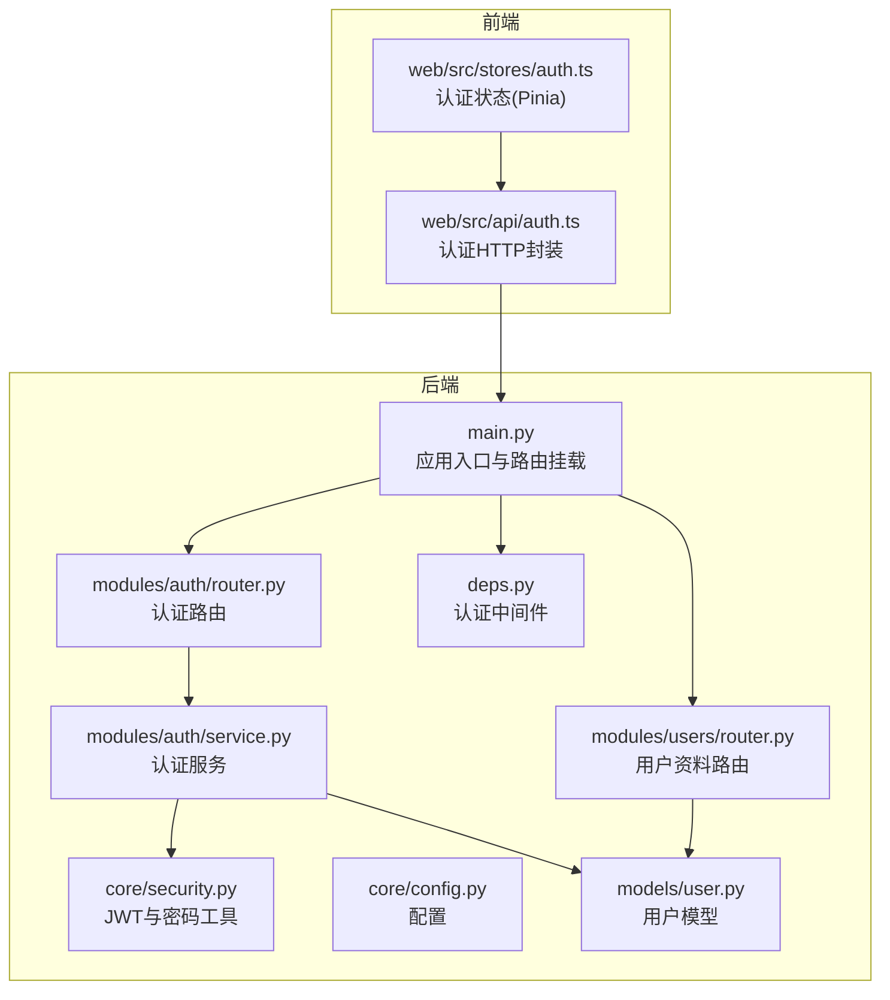
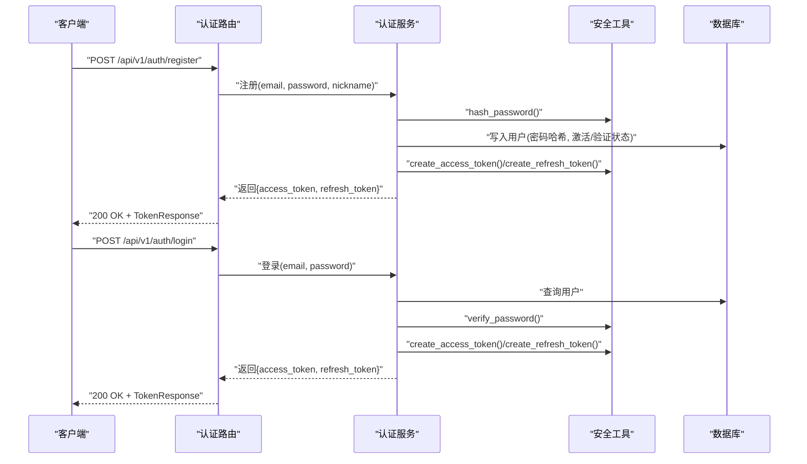
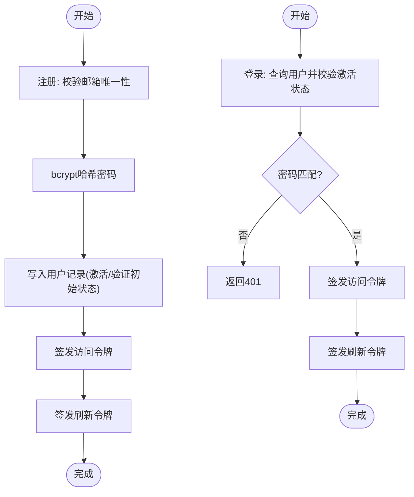
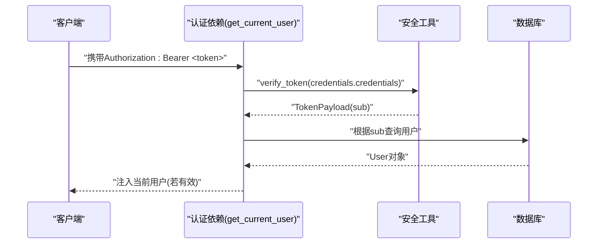
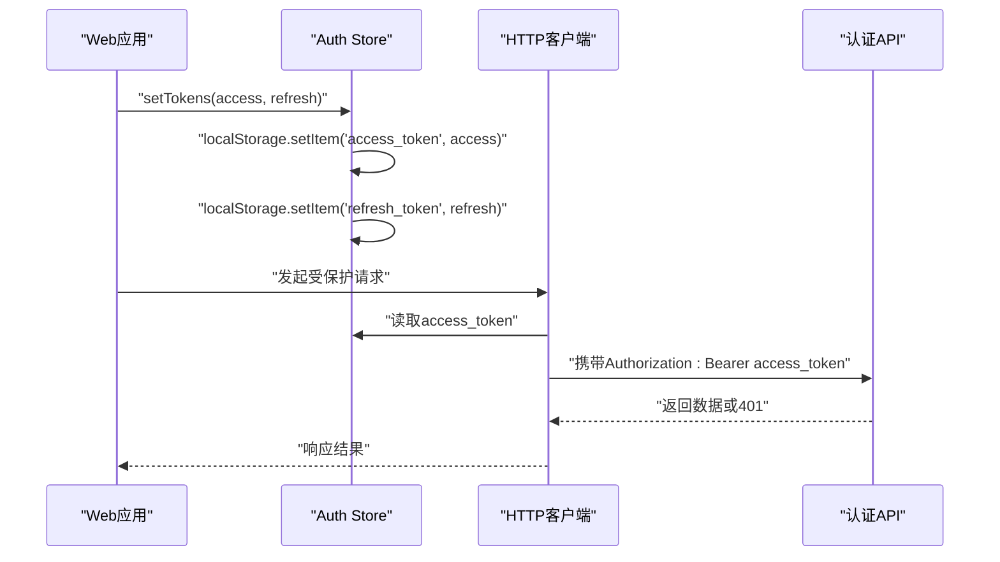
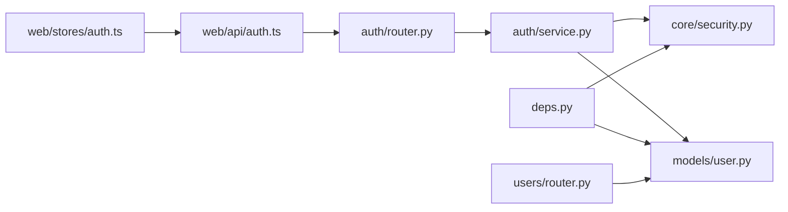

# 认证API

<cite>
**本文引用的文件**
- [apps/api/app/modules/auth/router.py](file://apps/api/app/modules/auth/router.py)
- [apps/api/app/modules/auth/service.py](file://apps/api/app/modules/auth/service.py)
- [apps/api/app/schemas/auth.py](file://apps/api/app/schemas/auth.py)
- [apps/api/app/core/security.py](file://apps/api/app/core/security.py)
- [apps/api/app/core/config.py](file://apps/api/app/core/config.py)
- [apps/api/app/models/user.py](file://apps/api/app/models/user.py)
- [apps/api/app/deps.py](file://apps/api/app/deps.py)
- [apps/api/app/modules/users/router.py](file://apps/api/app/modules/users/router.py)
- [apps/api/app/schemas/user.py](file://apps/api/app/schemas/user.py)
- [apps/api/app/main.py](file://apps/api/app/main.py)
- [apps/api/tests/test_auth.py](file://apps/api/tests/test_auth.py)
- [apps/web/src/api/auth.ts](file://apps/web/src/api/auth.ts)
- [apps/web/src/stores/auth.ts](file://apps/web/src/stores/auth.ts)
</cite>

## 目录
1. [简介](#简介)
2. [项目结构](#项目结构)
3. [核心组件](#核心组件)
4. [架构总览](#架构总览)
5. [详细组件分析](#详细组件分析)
6. [依赖分析](#依赖分析)
7. [性能考量](#性能考量)
8. [故障排查指南](#故障排查指南)
9. [结论](#结论)
10. [附录](#附录)

## 简介
本文件为“AI摄影教练认证系统”的认证API文档，覆盖用户注册、登录、登出、令牌刷新、邮箱验证、密码重置等完整流程。文档详细说明每个接口的HTTP方法、URL路径、请求参数、响应格式与状态码，并解释JWT令牌的生成、验证与刷新机制。同时提供认证中间件的使用方式、权限控制策略、安全注意事项以及客户端集成指南与常见问题解决方案。

## 项目结构
认证相关代码主要位于后端FastAPI应用中，前端Vue应用通过HTTP客户端调用认证接口。核心目录与文件如下：
- 后端
  - 认证路由：apps/api/app/modules/auth/router.py
  - 认证服务：apps/api/app/modules/auth/service.py
  - 认证Schema：apps/api/app/schemas/auth.py
  - 安全工具与JWT：apps/api/app/core/security.py
  - 配置：apps/api/app/core/config.py
  - 用户模型：apps/api/app/models/user.py
  - 全局依赖（认证中间件）：apps/api/app/deps.py
  - 用户资料路由：apps/api/app/modules/users/router.py
  - 用户资料Schema：apps/api/app/schemas/user.py
  - 应用入口与路由挂载：apps/api/app/main.py
  - 测试：apps/api/tests/test_auth.py
- 前端
  - 认证API封装：apps/web/src/api/auth.ts
  - 认证状态管理（Pinia）：apps/web/src/stores/auth.ts

图表来源
- [apps/api/app/main.py:1-36](file://apps/api/app/main.py#L1-L36)
- [apps/api/app/modules/auth/router.py:1-93](file://apps/api/app/modules/auth/router.py#L1-L93)
- [apps/api/app/modules/auth/service.py:1-145](file://apps/api/app/modules/auth/service.py#L1-L145)
- [apps/api/app/core/security.py:1-72](file://apps/api/app/core/security.py#L1-L72)
- [apps/api/app/core/config.py:1-47](file://apps/api/app/core/config.py#L1-L47)
- [apps/api/app/models/user.py:1-28](file://apps/api/app/models/user.py#L1-L28)
- [apps/api/app/deps.py:1-41](file://apps/api/app/deps.py#L1-L41)
- [apps/api/app/modules/users/router.py:1-71](file://apps/api/app/modules/users/router.py#L1-L71)
- [apps/web/src/api/auth.ts:1-56](file://apps/web/src/api/auth.ts#L1-L56)
- [apps/web/src/stores/auth.ts:1-41](file://apps/web/src/stores/auth.ts#L1-L41)

章节来源
- [apps/api/app/main.py:1-36](file://apps/api/app/main.py#L1-L36)
- [apps/api/app/modules/auth/router.py:1-93](file://apps/api/app/modules/auth/router.py#L1-L93)

## 核心组件
- 认证路由层：提供注册、登录、刷新、登出、邮箱验证、重发验证、忘记密码、重置密码等端点。
- 认证服务层：封装业务逻辑，包括密码哈希、JWT签发与校验、用户查询与状态检查、邮箱验证与密码重置。
- 安全工具：基于passlib的bcrypt密码哈希、基于jose的JWT编码/解码与校验。
- 配置：JWT密钥、算法、访问令牌与刷新令牌有效期等。
- 用户模型：存储用户邮箱、密码哈希、激活与验证状态等字段。
- 认证中间件：从Authorization Bearer中提取并验证JWT，解析用户ID并注入到依赖。
- 前端集成：HTTP客户端封装认证请求，Pinia状态持久化保存令牌并在请求头中携带。

章节来源
- [apps/api/app/modules/auth/router.py:21-93](file://apps/api/app/modules/auth/router.py#L21-L93)
- [apps/api/app/modules/auth/service.py:21-145](file://apps/api/app/modules/auth/service.py#L21-L145)
- [apps/api/app/core/security.py:12-72](file://apps/api/app/core/security.py#L12-L72)
- [apps/api/app/core/config.py:30-35](file://apps/api/app/core/config.py#L30-L35)
- [apps/api/app/models/user.py:12-28](file://apps/api/app/models/user.py#L12-L28)
- [apps/api/app/deps.py:15-41](file://apps/api/app/deps.py#L15-L41)
- [apps/web/src/api/auth.ts:18-56](file://apps/web/src/api/auth.ts#L18-L56)
- [apps/web/src/stores/auth.ts:5-41](file://apps/web/src/stores/auth.ts#L5-L41)

## 架构总览
认证系统采用分层设计：
- 表现层：FastAPI路由定义REST接口。
- 业务层：AuthService封装认证与授权相关业务。
- 数据访问层：SQLAlchemy ORM操作用户表。
- 安全层：JWT令牌生成与验证、密码哈希与校验。
- 前端层：HTTP客户端与状态管理，负责令牌持久化与请求头注入。

图表来源
- [apps/api/app/modules/auth/router.py:24-46](file://apps/api/app/modules/auth/router.py#L24-L46)
- [apps/api/app/modules/auth/service.py:27-76](file://apps/api/app/modules/auth/service.py#L27-L76)
- [apps/api/app/core/security.py:22-47](file://apps/api/app/core/security.py#L22-L47)
- [apps/api/app/models/user.py:12-28](file://apps/api/app/models/user.py#L12-L28)

## 详细组件分析

### 认证路由与端点
- 基础路径：/api/v1/auth
- 路由前缀：/auth（在main.py中挂载时加上/api/v1）
- 主要端点
  - POST /auth/register
    - 请求体：RegisterRequest
    - 成功响应：TokenResponse
    - 失败场景：邮箱已存在(409)、请求参数校验失败(422)
  - POST /auth/login
    - 请求体：LoginRequest
    - 成功响应：TokenResponse
    - 失败场景：凭证无效或账户未激活(401)
  - POST /auth/refresh
    - 请求体：RefreshRequest
    - 成功响应：TokenResponse
    - 失败场景：刷新令牌无效或过期(401)
  - POST /auth/logout
    - 请求体：无
    - 成功响应：{"message": "Successfully logged out"}
    - 失败场景：无
  - POST /auth/verify-email
    - 请求体：VerifyEmailRequest
    - 成功响应：{"message": "Email verified successfully"}
    - 失败场景：无效或过期令牌(400)
  - POST /auth/resend-verification
    - 请求体：无
    - 成功响应：{"message": "Verification email resent"}
    - 失败场景：无（注：当前为简化版，后续Task5会增加认证依赖）
  - POST /auth/forgot-password
    - 请求体：ForgotPasswordRequest
    - 成功响应：{"message": "If the email exists, a reset link has been sent"}
    - 失败场景：无（开发模式下记录日志）
  - POST /auth/reset-password
    - 请求体：ResetPasswordRequest
    - 成功响应：{"message": "Password reset successfully"}
    - 失败场景：无效或过期令牌(400)

章节来源
- [apps/api/app/modules/auth/router.py:21-93](file://apps/api/app/modules/auth/router.py#L21-L93)
- [apps/api/app/schemas/auth.py:5-37](file://apps/api/app/schemas/auth.py#L5-L37)
- [apps/api/tests/test_auth.py:48-191](file://apps/api/tests/test_auth.py#L48-L191)

### 认证服务与JWT机制
- 密码处理
  - 注册时使用bcrypt对明文密码进行哈希存储。
  - 登录时验证明文密码与哈希是否匹配。
- JWT令牌
  - 访问令牌：默认有效期30分钟；用于受保护资源访问。
  - 刷新令牌：默认有效期7天；用于换取新的访问令牌。
  - 验证：使用配置中的密钥与算法解码并校验令牌有效性。
- 邮箱验证
  - 生成短期JWT作为验证链接；验证通过后更新用户验证状态。
- 密码重置
  - 发送重置令牌（短期JWT）至日志（开发模式）；重置时验证令牌并更新密码哈希。

图表来源
- [apps/api/app/modules/auth/service.py:27-76](file://apps/api/app/modules/auth/service.py#L27-L76)
- [apps/api/app/core/security.py:22-47](file://apps/api/app/core/security.py#L22-L47)
- [apps/api/app/models/user.py:12-28](file://apps/api/app/models/user.py#L12-L28)

章节来源
- [apps/api/app/modules/auth/service.py:21-145](file://apps/api/app/modules/auth/service.py#L21-L145)
- [apps/api/app/core/security.py:12-72](file://apps/api/app/core/security.py#L12-L72)
- [apps/api/app/core/config.py:30-35](file://apps/api/app/core/config.py#L30-L35)

### 认证中间件与权限控制
- HTTP Bearer认证
  - 从Authorization头中提取Bearer令牌。
  - 使用verify_token解码并校验令牌有效性。
  - 解析用户ID并从数据库加载用户对象，检查是否激活。
- 依赖注入
  - get_current_user：返回当前用户对象，未认证或令牌无效时抛出401。
  - get_current_user_id：返回当前用户ID。
- 在用户资料路由中，部分端点直接使用HTTP Bearer认证（Task5完成后将统一到deps.py）。

图表来源
- [apps/api/app/deps.py:15-34](file://apps/api/app/deps.py#L15-L34)
- [apps/api/app/core/security.py:49-72](file://apps/api/app/core/security.py#L49-L72)
- [apps/api/app/models/user.py:12-28](file://apps/api/app/models/user.py#L12-L28)

章节来源
- [apps/api/app/deps.py:1-41](file://apps/api/app/deps.py#L1-L41)
- [apps/api/app/modules/users/router.py:17-26](file://apps/api/app/modules/users/router.py#L17-L26)

### 前端集成指南
- HTTP封装
  - register：POST /api/v1/auth/register
  - login：POST /api/v1/auth/login
  - refreshTokenRequest：POST /api/v1/auth/refresh
  - logout：POST /api/v1/auth/logout
  - getProfile：GET /api/v1/users/me
  - updateProfile：PATCH /api/v1/users/me
  - changePassword：POST /api/v1/users/me/change-password
- 状态管理
  - 使用Pinia存储access_token与refresh_token，自动持久化到localStorage。
  - 在HTTP拦截器中将access_token附加到Authorization头。
  - 登出时清理本地存储与状态。

图表来源
- [apps/web/src/api/auth.ts:29-55](file://apps/web/src/api/auth.ts#L29-L55)
- [apps/web/src/stores/auth.ts:12-25](file://apps/web/src/stores/auth.ts#L12-L25)

章节来源
- [apps/web/src/api/auth.ts:1-56](file://apps/web/src/api/auth.ts#L1-L56)
- [apps/web/src/stores/auth.ts:1-41](file://apps/web/src/stores/auth.ts#L1-L41)

## 依赖分析
- 组件耦合
  - 路由依赖服务层；服务层依赖安全工具与数据库。
  - 认证中间件依赖安全工具与数据库。
  - 前端依赖后端API与状态管理。
- 外部依赖
  - passlib：bcrypt密码哈希。
  - python-jose：JWT编码/解码与校验。
  - SQLAlchemy：ORM与数据库交互。
  - FastAPI：路由与依赖注入。
- 可能的循环依赖
  - 未发现明显循环依赖；各模块职责清晰。

图表来源
- [apps/api/app/modules/auth/router.py:1-93](file://apps/api/app/modules/auth/router.py#L1-L93)
- [apps/api/app/modules/auth/service.py:1-145](file://apps/api/app/modules/auth/service.py#L1-L145)
- [apps/api/app/core/security.py:1-72](file://apps/api/app/core/security.py#L1-L72)
- [apps/api/app/models/user.py:1-28](file://apps/api/app/models/user.py#L1-L28)
- [apps/api/app/deps.py:1-41](file://apps/api/app/deps.py#L1-L41)
- [apps/api/app/modules/users/router.py:1-71](file://apps/api/app/modules/users/router.py#L1-L71)
- [apps/web/src/api/auth.ts:1-56](file://apps/web/src/api/auth.ts#L1-L56)
- [apps/web/src/stores/auth.ts:1-41](file://apps/web/src/stores/auth.ts#L1-L41)

章节来源
- [apps/api/app/modules/auth/router.py:1-93](file://apps/api/app/modules/auth/router.py#L1-L93)
- [apps/api/app/modules/auth/service.py:1-145](file://apps/api/app/modules/auth/service.py#L1-L145)
- [apps/api/app/core/security.py:1-72](file://apps/api/app/core/security.py#L1-L72)
- [apps/api/app/models/user.py:1-28](file://apps/api/app/models/user.py#L1-L28)
- [apps/api/app/deps.py:1-41](file://apps/api/app/deps.py#L1-L41)
- [apps/api/app/modules/users/router.py:1-71](file://apps/api/app/modules/users/router.py#L1-L71)
- [apps/web/src/api/auth.ts:1-56](file://apps/web/src/api/auth.ts#L1-L56)
- [apps/web/src/stores/auth.ts:1-41](file://apps/web/src/stores/auth.ts#L1-L41)

## 性能考量
- JWT令牌大小与负载
  - 仅包含sub与exp等必要字段，开销较小。
- 密码哈希成本
  - bcrypt默认成本适中，建议生产环境根据硬件能力调整。
- 数据库查询
  - 登录与刷新均需查询用户并校验激活状态，建议在用户表上建立索引以优化查询。
- 令牌轮换
  - 刷新令牌有效期较长，但访问令牌短效可降低泄露风险。

[本节为通用指导，无需特定文件来源]

## 故障排查指南
- 常见错误与解决
  - 400 Bad Request：邮箱验证或密码重置令牌无效或过期。
  - 401 Unauthorized：登录凭证无效、账户未激活、令牌无效或过期。
  - 409 Conflict：注册时邮箱已被占用。
  - 422 Unprocessable Entity：请求参数校验失败（如邮箱格式、密码长度）。
- 日志与调试
  - 开发模式下，邮箱验证与密码重置令牌会在日志中输出，便于调试。
- 前端常见问题
  - 未设置Authorization头导致受保护接口401。
  - 令牌过期未及时刷新。
  - 登出后未清理本地存储导致仍携带旧令牌。

章节来源
- [apps/api/app/modules/auth/service.py:98-140](file://apps/api/app/modules/auth/service.py#L98-L140)
- [apps/api/app/modules/auth/router.py:33-35](file://apps/api/app/modules/auth/router.py#L33-L35)
- [apps/api/tests/test_auth.py:48-191](file://apps/api/tests/test_auth.py#L48-L191)

## 结论
该认证系统提供了完整的用户生命周期管理：注册、登录、令牌刷新、登出、邮箱验证与密码重置。通过bcrypt与JWT确保了密码安全与会话管理的安全性。前端通过Pinia与HTTP封装实现了便捷的令牌持久化与请求头注入。建议在生产环境中强化安全配置（如HTTPS、CSRF防护、令牌吊销策略）并完善邮箱验证与密码重置的邮件通知机制。

[本节为总结，无需特定文件来源]

## 附录

### 接口清单与规范

- 注册
  - 方法：POST
  - 路径：/api/v1/auth/register
  - 请求体：RegisterRequest
    - email: 邮箱
    - password: 密码（最少8位）
    - nickname: 昵称（可选）
  - 成功响应：TokenResponse
    - access_token: 访问令牌
    - refresh_token: 刷新令牌
    - token_type: bearer
  - 失败响应：409(邮箱已存在)、422(参数校验失败)
  - 示例
    - 请求：POST /api/v1/auth/register
      - Body: {"email":"user@example.com","password":"securePass123"}
    - 成功：200 OK
      - Body: {"access_token":"...","refresh_token":"...","token_type":"bearer"}

- 登录
  - 方法：POST
  - 路径：/api/v1/auth/login
  - 请求体：LoginRequest
    - email: 邮箱
    - password: 密码
  - 成功响应：TokenResponse
  - 失败响应：401(凭证无效或账户未激活)
  - 示例
    - 请求：POST /api/v1/auth/login
      - Body: {"email":"user@example.com","password":"securePass123"}
    - 成功：200 OK
      - Body: {"access_token":"...","refresh_token":"...","token_type":"bearer"}

- 刷新令牌
  - 方法：POST
  - 路径：/api/v1/auth/refresh
  - 请求体：RefreshRequest
    - refresh_token: 刷新令牌
  - 成功响应：TokenResponse
  - 失败响应：401(令牌无效或过期)
  - 示例
    - 请求：POST /api/v1/auth/refresh
      - Body: {"refresh_token":"..."}
    - 成功：200 OK
      - Body: {"access_token":"...","refresh_token":"...","token_type":"bearer"}

- 登出
  - 方法：POST
  - 路径：/api/v1/auth/logout
  - 请求体：无
  - 成功响应：{"message":"Successfully logged out"}
  - 失败响应：无
  - 示例
    - 请求：POST /api/v1/auth/logout
    - 成功：200 OK
      - Body: {"message":"Successfully logged out"}

- 邮箱验证
  - 方法：POST
  - 路径：/api/v1/auth/verify-email
  - 请求体：VerifyEmailRequest
    - token: 验证令牌
  - 成功响应：{"message":"Email verified successfully"}
  - 失败响应：400(令牌无效或过期)
  - 示例
    - 请求：POST /api/v1/auth/verify-email
      - Body: {"token":"..."}
    - 成功：200 OK
      - Body: {"message":"Email verified successfully"}

- 重发验证邮件
  - 方法：POST
  - 路径：/api/v1/auth/resend-verification
  - 请求体：无
  - 成功响应：{"message":"Verification email resent"}
  - 失败响应：无
  - 示例
    - 请求：POST /api/v1/auth/resend-verification
    - 成功：200 OK
      - Body: {"message":"Verification email resent"}

- 忘记密码
  - 方法：POST
  - 路径：/api/v1/auth/forgot-password
  - 请求体：ForgotPasswordRequest
    - email: 邮箱
  - 成功响应：{"message":"If the email exists, a reset link has been sent"}
  - 失败响应：无
  - 示例
    - 请求：POST /api/v1/auth/forgot-password
      - Body: {"email":"user@example.com"}
    - 成功：200 OK
      - Body: {"message":"If the email exists, a reset link has been sent"}

- 重置密码
  - 方法：POST
  - 路径：/api/v1/auth/reset-password
  - 请求体：ResetPasswordRequest
    - token: 重置令牌
    - new_password: 新密码（最少8位）
  - 成功响应：{"message":"Password reset successfully"}
  - 失败响应：400(令牌无效或过期)
  - 示例
    - 请求：POST /api/v1/auth/reset-password
      - Body: {"token":"...","new_password":"NewSecurePass123"}
    - 成功：200 OK
      - Body: {"message":"Password reset successfully"}

章节来源
- [apps/api/app/modules/auth/router.py:24-92](file://apps/api/app/modules/auth/router.py#L24-L92)
- [apps/api/app/schemas/auth.py:5-37](file://apps/api/app/schemas/auth.py#L5-L37)
- [apps/api/tests/test_auth.py:48-191](file://apps/api/tests/test_auth.py#L48-L191)

### 安全考虑
- 密码加密
  - 使用bcrypt进行密码哈希，避免明文存储。
- 会话管理
  - 访问令牌短效，刷新令牌长效；建议实现令牌吊销列表（黑名单）以支持主动登出。
- CSRF防护
  - 建议在生产环境启用CSRF中间件或同源策略限制，避免跨站请求伪造。
- 传输安全
  - 强制使用HTTPS，防止令牌在传输过程中被窃取。
- 邮箱验证与密码重置
  - 验证与重置令牌应具备合理有效期，并在日志中谨慎记录（生产环境避免敏感信息输出）。

[本节为通用指导，无需特定文件来源]

### 客户端集成步骤
- 初始化
  - 在应用启动时读取localStorage中的access_token与refresh_token。
  - 在HTTP拦截器中将access_token附加到Authorization头。
- 登录/注册
  - 调用登录或注册接口，成功后调用setTokens保存令牌。
- 刷新令牌
  - 在访问令牌即将过期时，调用刷新接口获取新access_token。
- 登出
  - 调用登出接口，清理本地存储与状态。

章节来源
- [apps/web/src/api/auth.ts:29-55](file://apps/web/src/api/auth.ts#L29-L55)
- [apps/web/src/stores/auth.ts:12-25](file://apps/web/src/stores/auth.ts#L12-L25)