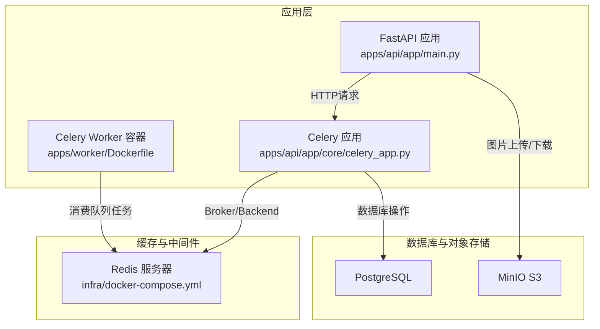
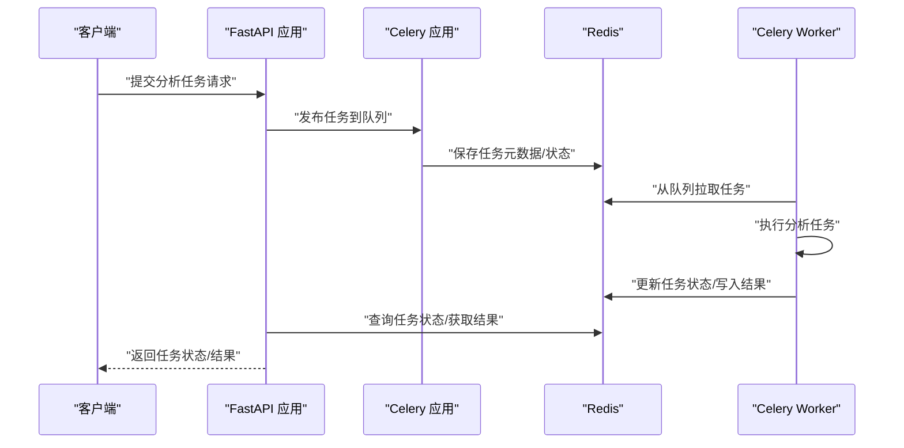
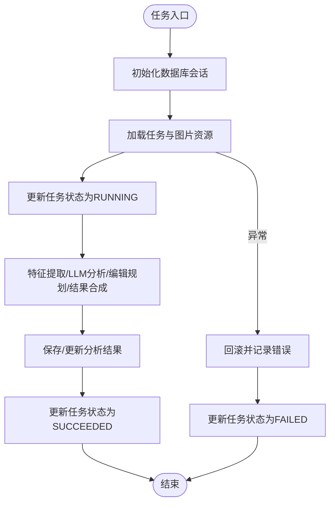
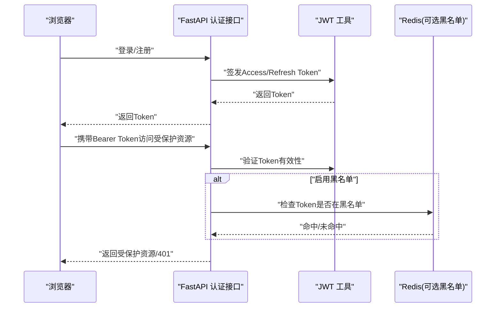
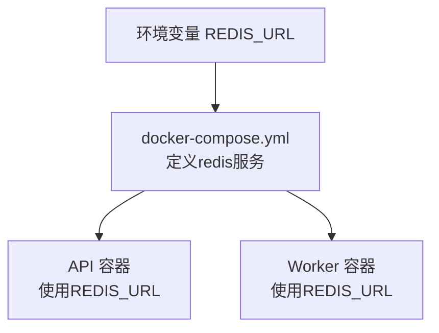
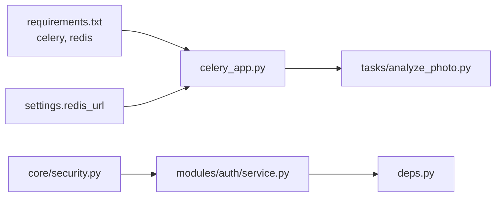

# Redis缓存系统

<cite>
**本文引用的文件**
- [apps/api/app/core/celery_app.py](file://apps/api/app/core/celery_app.py)
- [apps/api/app/core/config.py](file://apps/api/app/core/config.py)
- [apps/api/app/tasks/analyze_photo.py](file://apps/api/app/tasks/analyze_photo.py)
- [apps/api/app/core/security.py](file://apps/api/app/core/security.py)
- [apps/api/app/deps.py](file://apps/api/app/deps.py)
- [apps/api/app/modules/auth/service.py](file://apps/api/app/modules/auth/service.py)
- [apps/api/requirements.txt](file://apps/api/requirements.txt)
- [infra/docker-compose.yml](file://infra/docker-compose.yml)
- [apps/worker/Dockerfile](file://apps/worker/Dockerfile)
- [apps/api/app/main.py](file://apps/api/app/main.py)
</cite>

## 目录
1. [简介](#简介)
2. [项目结构](#项目结构)
3. [核心组件](#核心组件)
4. [架构总览](#架构总览)
5. [详细组件分析](#详细组件分析)
6. [依赖关系分析](#依赖关系分析)
7. [性能考虑](#性能考虑)
8. [故障排查指南](#故障排查指南)
9. [结论](#结论)
10. [附录](#附录)

## 简介
本技术文档围绕AI摄影教练项目中的Redis缓存系统展开，重点说明Redis在以下场景的应用：
- 会话与认证：当前实现采用JWT令牌，未直接使用Redis存储会话；设计文档中预留了“Token黑名单”以实现会话撤销（Redis黑名单）。
- 任务状态缓存：Celery使用Redis作为消息代理与结果后端，用于任务队列、任务状态持久化与结果缓存。
- 热点数据缓存：当前代码未显式使用Redis缓存热点数据；可在业务层按需引入。

此外，文档还涵盖Redis连接配置、连接池与性能调优、键命名规范、过期策略、内存管理、缓存失效与一致性、故障恢复、监控指标与优化建议等。

## 项目结构
Redis在本项目中的角色主要体现在：
- 应用服务（FastAPI）通过Celery与Redis交互，完成异步任务的分发与结果存储。
- Docker Compose编排Redis容器，为API与Worker提供统一的Redis服务。
- 认证模块使用JWT，未直接使用Redis存储会话；设计文档预留了“Token黑名单”的Redis实现路径。

图表来源
- [apps/api/app/main.py:1-36](file://apps/api/app/main.py#L1-L36)
- [apps/api/app/core/celery_app.py:1-21](file://apps/api/app/core/celery_app.py#L1-L21)
- [apps/worker/Dockerfile:1-19](file://apps/worker/Dockerfile#L1-L19)
- [infra/docker-compose.yml:19-30](file://infra/docker-compose.yml#L19-L30)

章节来源
- [apps/api/app/main.py:1-36](file://apps/api/app/main.py#L1-L36)
- [apps/api/app/core/celery_app.py:1-21](file://apps/api/app/core/celery_app.py#L1-L21)
- [apps/worker/Dockerfile:1-19](file://apps/worker/Dockerfile#L1-L19)
- [infra/docker-compose.yml:19-30](file://infra/docker-compose.yml#L19-L30)

## 核心组件
- Redis连接配置
  - 应用配置中定义了Redis连接字符串，API与Worker均通过环境变量使用该连接串。
  - Celery应用将Redis同时作为消息代理（broker）与结果后端（backend）。
- Celery任务队列
  - 任务路由将特定任务分配到“analysis”队列，Worker按队列消费。
  - 任务状态与结果由Redis持久化，便于查询任务进度与获取结果。
- 认证与会话
  - 当前实现基于JWT，未直接使用Redis存储会话；设计文档预留“Token黑名单”（Redis黑名单）以支持会话撤销。

章节来源
- [apps/api/app/core/config.py:13-14](file://apps/api/app/core/config.py#L13-L14)
- [apps/api/app/core/celery_app.py:5-19](file://apps/api/app/core/celery_app.py#L5-L19)
- [infra/docker-compose.yml:59](file://infra/docker-compose.yml#L59)
- [apps/worker/Dockerfile:19](file://apps/worker/Dockerfile#L19)

## 架构总览
Redis在本项目中的作用是：
- 作为Celery的消息代理（Broker）与结果后端（Backend），承载任务队列、任务状态与结果缓存。
- 为未来会话管理（Token黑名单）提供存储基础。

图表来源
- [apps/api/app/core/celery_app.py:5-19](file://apps/api/app/core/celery_app.py#L5-L19)
- [apps/api/app/tasks/analyze_photo.py:19-108](file://apps/api/app/tasks/analyze_photo.py#L19-L108)
- [apps/worker/Dockerfile:19](file://apps/worker/Dockerfile#L19)

## 详细组件分析

### 组件一：Celery与Redis集成
- 连接与配置
  - Celery实例使用settings.redis_url作为broker与backend。
  - 任务路由将“run_analysis_task”绑定到“analysis”队列。
- 任务生命周期
  - 任务启动时更新任务状态为RUNNING，记录开始时间与尝试次数。
  - 执行完成后根据结果更新任务状态与错误信息。
  - 异常时回滚并记录错误信息。
- 结果存储
  - 由于Celery backend为Redis，任务状态与结果默认由Redis持久化，便于API查询。

图表来源
- [apps/api/app/tasks/analyze_photo.py:19-108](file://apps/api/app/tasks/analyze_photo.py#L19-L108)

章节来源
- [apps/api/app/core/celery_app.py:5-19](file://apps/api/app/core/celery_app.py#L5-L19)
- [apps/api/app/tasks/analyze_photo.py:19-108](file://apps/api/app/tasks/analyze_photo.py#L19-L108)

### 组件二：认证与会话（JWT）
- 当前实现
  - 使用JWT进行认证，Access Token短寿命（30分钟），Refresh Token较长寿命（7天）。
  - 会话状态存储于客户端localStorage，服务端不使用Redis存储会话。
- 设计预留
  - 设计文档明确指出未来可引入“Token黑名单”（Redis黑名单）以支持会话撤销。
- 与Redis的关系
  - 若启用黑名单，可将已撤销的Token加入Redis集合，登录校验时检查黑名单。

图表来源
- [apps/api/app/modules/auth/service.py:50-92](file://apps/api/app/modules/auth/service.py#L50-L92)
- [apps/api/app/core/security.py:32-46](file://apps/api/app/core/security.py#L32-L46)
- [apps/api/app/deps.py:15-33](file://apps/api/app/deps.py#L15-L33)

章节来源
- [apps/api/app/modules/auth/service.py:50-92](file://apps/api/app/modules/auth/service.py#L50-L92)
- [apps/api/app/core/security.py:32-46](file://apps/api/app/core/security.py#L32-L46)
- [apps/api/app/deps.py:15-33](file://apps/api/app/deps.py#L15-L33)
- [openspec/changes/add-user-auth/design.md:83-86](file://openspec/changes/add-user-auth/design.md#L83-L86)

### 组件三：Redis连接配置与容器编排
- 应用配置
  - settings.redis_url提供Redis连接字符串，API与Worker共享。
- 容器编排
  - docker-compose定义Redis服务，暴露6379端口并挂载卷，健康检查使用redis-cli ping。
  - API与Worker通过环境变量REDIS_URL指向Redis服务。
- Worker运行
  - Worker容器以“analysis”队列为参数启动，从Redis队列拉取任务。

图表来源
- [apps/api/app/core/config.py:13-14](file://apps/api/app/core/config.py#L13-L14)
- [infra/docker-compose.yml:59](file://infra/docker-compose.yml#L59)
- [apps/worker/Dockerfile:19](file://apps/worker/Dockerfile#L19)

章节来源
- [apps/api/app/core/config.py:13-14](file://apps/api/app/core/config.py#L13-L14)
- [infra/docker-compose.yml:19-30](file://infra/docker-compose.yml#L19-L30)
- [apps/worker/Dockerfile:19](file://apps/worker/Dockerfile#L19)

## 依赖关系分析
- 外部依赖
  - Celery与Redis：通过requirements.txt可见celery与redis库。
  - FastAPI：应用框架，与Celery共同依赖Redis。
- 内部依赖
  - Celery应用依赖settings.redis_url，任务模块依赖Celery应用。
  - 认证模块依赖settings中的JWT配置与密钥。

图表来源
- [apps/api/requirements.txt:7-8](file://apps/api/requirements.txt#L7-L8)
- [apps/api/app/core/celery_app.py:7-8](file://apps/api/app/core/celery_app.py#L7-L8)
- [apps/api/app/tasks/analyze_photo.py:6](file://apps/api/app/tasks/analyze_photo.py#L6)
- [apps/api/app/core/security.py:32-46](file://apps/api/app/core/security.py#L32-L46)
- [apps/api/app/modules/auth/service.py:50-92](file://apps/api/app/modules/auth/service.py#L50-L92)
- [apps/api/app/deps.py:15-33](file://apps/api/app/deps.py#L15-L33)

章节来源
- [apps/api/requirements.txt:7-8](file://apps/api/requirements.txt#L7-L8)
- [apps/api/app/core/celery_app.py:7-8](file://apps/api/app/core/celery_app.py#L7-L8)
- [apps/api/app/tasks/analyze_photo.py:6](file://apps/api/app/tasks/analyze_photo.py#L6)
- [apps/api/app/core/security.py:32-46](file://apps/api/app/core/security.py#L32-L46)
- [apps/api/app/modules/auth/service.py:50-92](file://apps/api/app/modules/auth/service.py#L50-L92)
- [apps/api/app/deps.py:15-33](file://apps/api/app/deps.py#L15-L33)

## 性能考虑
- 连接与连接池
  - Celery默认使用连接池，建议在生产环境中通过Celery配置项调整并发连接数与超时参数，避免连接过多导致Redis压力过大。
- 队列与路由
  - 将高优先级任务放入专用队列（如“analysis”），有助于均衡负载与提升响应速度。
- 结果后端
  - Redis作为结果后端会占用内存，建议结合任务结果有效期与清理策略控制内存增长。
- 键空间与过期
  - 为任务键设置合理TTL，避免长期驻留造成内存压力。
- 监控与告警
  - 关注Redis内存使用率、连接数、命令耗时与慢查询日志，建立阈值告警。

[本节为通用性能建议，不直接分析具体文件]

## 故障排查指南
- Redis不可达
  - 检查docker-compose中redis服务是否健康，确认端口映射与网络连通性。
  - 确认API与Worker的REDIS_URL环境变量正确指向Redis服务。
- 任务状态异常
  - 查看Celery worker日志，确认任务是否被正确拉取与执行。
  - 在Redis中检查任务键是否存在、状态是否更新。
- 认证问题
  - 若启用“Token黑名单”，检查黑名单键是否存在、是否正确写入与查询。
  - 确认JWT密钥与算法配置一致，避免签名验证失败。

章节来源
- [infra/docker-compose.yml:19-30](file://infra/docker-compose.yml#L19-L30)
- [apps/worker/Dockerfile:19](file://apps/worker/Dockerfile#L19)
- [apps/api/app/core/celery_app.py:5-19](file://apps/api/app/core/celery_app.py#L5-L19)

## 结论
- Redis在本项目中主要用于Celery的任务队列与结果缓存，保障异步任务的可靠执行与状态查询。
- 认证采用JWT，未直接使用Redis存储会话；设计文档预留了“Token黑名单”（Redis黑名单）以支持会话撤销，可按需实现。
- 建议在生产环境中完善连接池配置、任务键过期策略与监控告警，确保Redis资源的高效利用与系统的稳定性。

[本节为总结性内容，不直接分析具体文件]

## 附录

### Redis在Celery中的使用方式
- 消息代理（Broker）：Redis负责接收与分发任务消息。
- 结果后端（Backend）：Redis负责存储任务状态与结果，便于API查询。
- 队列与路由：通过任务路由将任务分派到指定队列，Worker按队列消费。

章节来源
- [apps/api/app/core/celery_app.py:5-19](file://apps/api/app/core/celery_app.py#L5-L19)
- [apps/api/app/tasks/analyze_photo.py:19-108](file://apps/api/app/tasks/analyze_photo.py#L19-L108)

### 缓存键命名规范与过期策略
- 建议规范
  - 任务键：使用“task:<task_id>:status”与“task:<task_id>:result”命名，便于区分状态与结果。
  - 会话黑名单：使用“blacklist:jwt:<jti>”或“blacklist:token:<token>”命名，便于快速查找与清理。
- 过期策略
  - 任务键：根据任务最长执行时间设置TTL，避免长期占用内存。
  - 会话黑名单：黑名单键可设置较短TTL，结合定期清理策略降低内存压力。

[本节为通用规范建议，不直接分析具体文件]

### 内存管理机制
- 控制任务结果保留时间，避免长时间驻留。
- 定期清理过期键与无用键，防止内存碎片与膨胀。
- 监控内存使用趋势，必要时调整Redis内存上限或拆分实例。

[本节为通用内存管理建议，不直接分析具体文件]

### 数据一致性与故障恢复
- 一致性
  - 任务状态更新遵循事务性写入，异常时回滚并记录错误，确保状态一致。
  - 若引入会话黑名单，黑名单写入与查询需保证原子性与幂等性。
- 故障恢复
  - Redis主从或哨兵部署可提升可用性。
  - 任务失败重试与死信队列策略，避免单点故障导致任务丢失。

章节来源
- [apps/api/app/tasks/analyze_photo.py:97-107](file://apps/api/app/tasks/analyze_photo.py#L97-L107)

### 监控指标与优化建议
- 指标
  - 内存使用率、连接数、命令耗时、慢查询数量、键空间命中率。
- 优化
  - 合理设置连接池大小与超时，避免连接风暴。
  - 为热键设置合理的TTL与淘汰策略，避免热点Key导致内存压力。
  - 使用Redis集群或分片，提升吞吐与容量。

[本节为通用监控与优化建议，不直接分析具体文件]