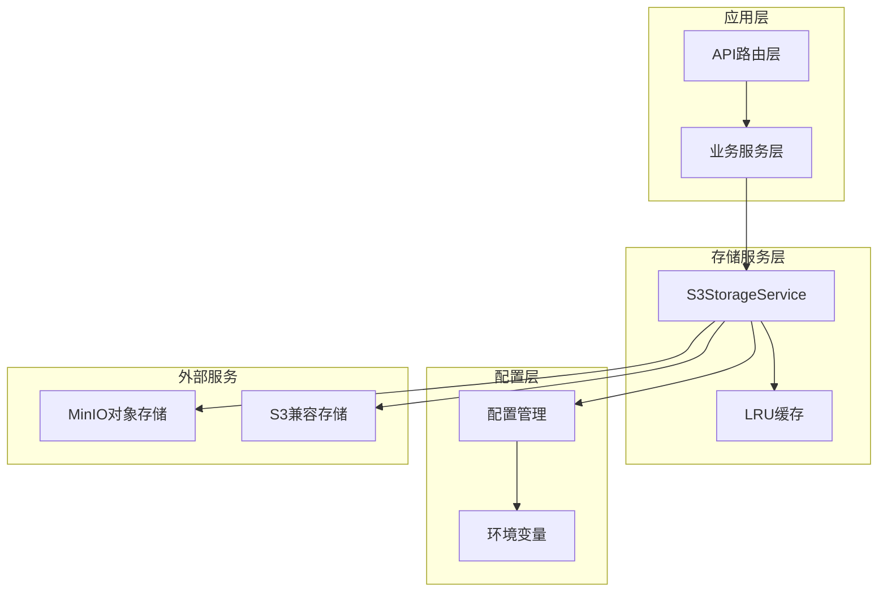
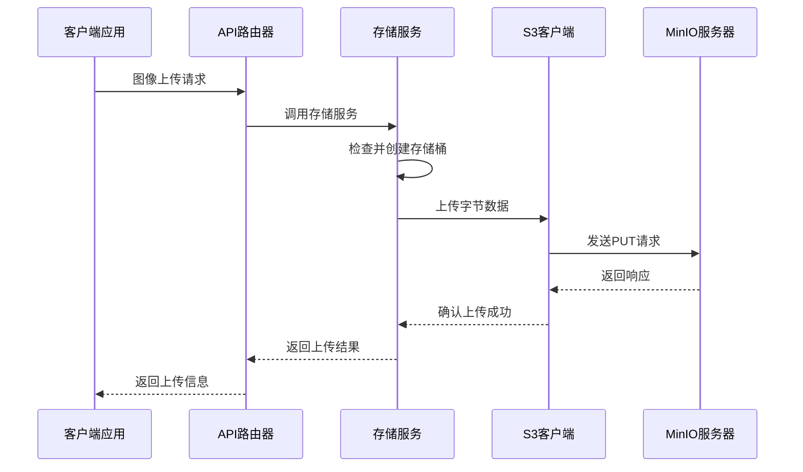
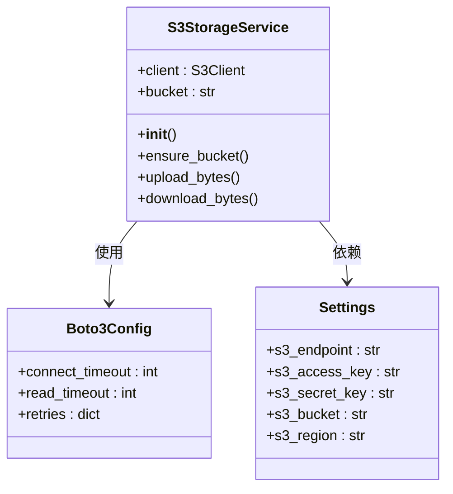
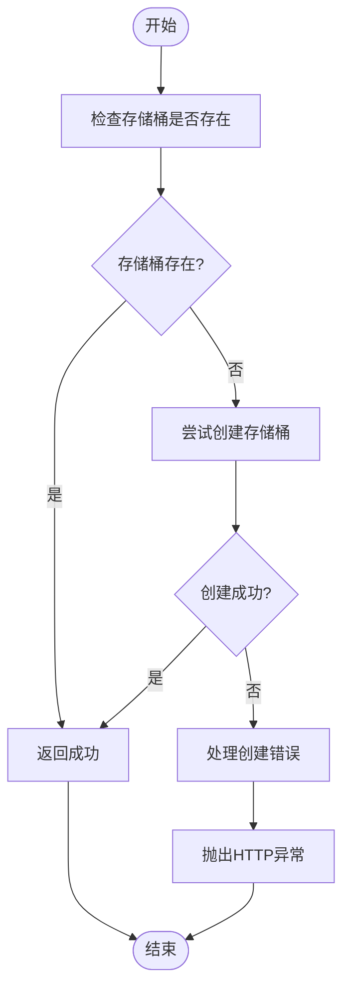
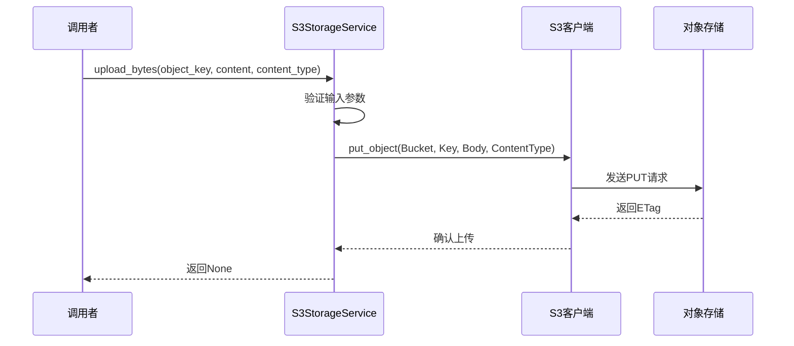
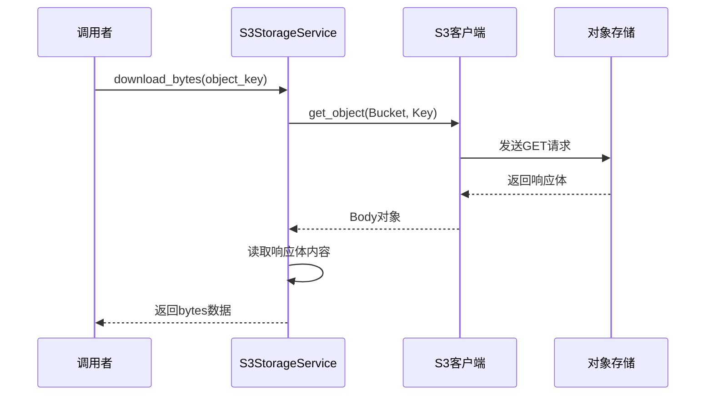
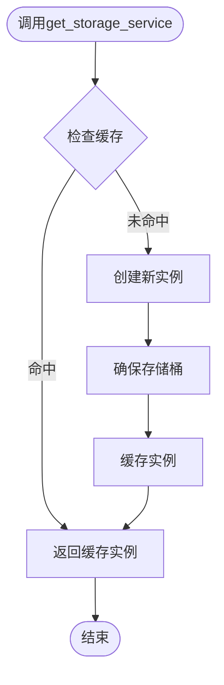
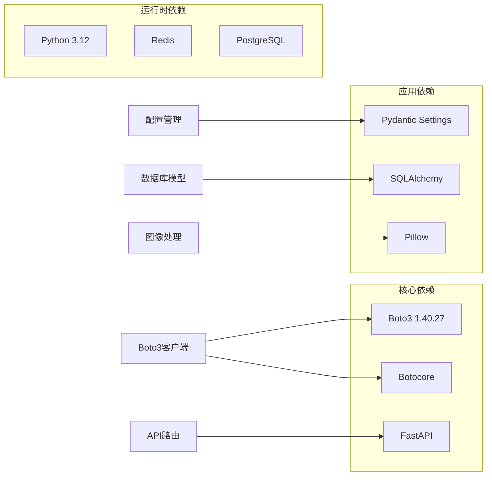
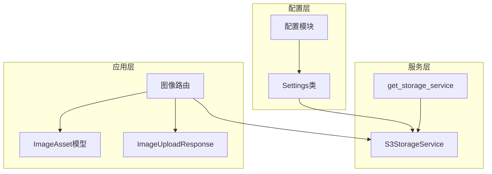

# S3存储服务

<cite>
**本文档引用的文件**
- [s3_storage.py](file://apps/api/app/services/storage/s3_storage.py)
- [config.py](file://apps/api/app/core/config.py)
- [router.py](file://apps/api/app/modules/images/router.py)
- [docker-compose.yml](file://infra/docker-compose.yml)
- [requirements.txt](file://apps/api/requirements.txt)
- [image_asset.py](file://apps/api/app/models/image_asset.py)
- [image.py](file://apps/api/app/schemas/image.py)
</cite>

## 目录
1. [简介](#简介)
2. [项目结构](#项目结构)
3. [核心组件](#核心组件)
4. [架构概览](#架构概览)
5. [详细组件分析](#详细组件分析)
6. [依赖关系分析](#依赖关系分析)
7. [性能考虑](#性能考虑)
8. [故障排除指南](#故障排除指南)
9. [结论](#结论)

## 简介

S3存储服务是AI Photo Coach项目中的关键基础设施组件，负责管理图像资产的存储和检索。该服务基于AWS SDK for Python (Boto3)构建，实现了与S3兼容的对象存储系统的完整功能。本文档深入解析了S3StorageService类的实现原理，包括Boto3客户端配置、连接参数优化、错误处理机制以及LRU缓存机制的作用和性能优化效果。

该服务支持自动桶创建、文件上传下载操作，并提供了完整的错误处理策略，包括超时配置和重试机制。文档还包含了S3兼容存储的配置示例，特别是MinIO本地部署的最佳实践。

## 项目结构

S3存储服务位于应用的模块化架构中，遵循分层设计原则：

**图表来源**
- [s3_storage.py:11-58](file://apps/api/app/services/storage/s3_storage.py#L11-L58)
- [config.py:6-47](file://apps/api/app/core/config.py#L6-L47)

**章节来源**
- [s3_storage.py:1-59](file://apps/api/app/services/storage/s3_storage.py#L1-L59)
- [config.py:1-47](file://apps/api/app/core/config.py#L1-L47)

## 核心组件

### S3StorageService类

S3StorageService是存储服务的核心类，封装了所有S3操作功能。该类通过依赖注入模式创建，确保单例实例的复用和资源的有效管理。

#### 主要特性

1. **Boto3客户端配置**：使用Botocore Config对象进行精细的连接参数控制
2. **自动桶管理**：确保目标存储桶存在并可访问
3. **文件操作**：提供上传和下载的完整功能
4. **错误处理**：统一的异常转换和HTTP状态码映射
5. **缓存机制**：通过LRU缓存优化性能

#### 关键属性

- `client`: 配置好的Boto3 S3客户端实例
- `bucket`: 目标存储桶名称
- `endpoint_url`: S3兼容服务端点
- `region_name`: 区域配置

**章节来源**
- [s3_storage.py:11-22](file://apps/api/app/services/storage/s3_storage.py#L11-L22)

## 架构概览

S3存储服务采用分层架构设计，实现了清晰的关注点分离：

**图表来源**
- [router.py:20-76](file://apps/api/app/modules/images/router.py#L20-L76)
- [s3_storage.py:34-50](file://apps/api/app/services/storage/s3_storage.py#L34-L50)

## 详细组件分析

### Boto3客户端配置

S3StorageService在初始化时创建了专门配置的Boto3客户端：

**图表来源**
- [s3_storage.py:12-21](file://apps/api/app/services/storage/s3_storage.py#L12-L21)
- [config.py:16-20](file://apps/api/app/core/config.py#L16-L20)

#### 连接参数优化

服务配置了以下关键连接参数：

- **连接超时 (3秒)**: 快速检测网络连接问题
- **读取超时 (8秒)**: 允许足够时间完成数据传输
- **重试次数 (1次)**: 平衡可靠性与响应速度

这些参数的选择体现了对性能和可靠性的平衡考虑。

**章节来源**
- [s3_storage.py:13-20](file://apps/api/app/services/storage/s3_storage.py#L13-L20)

### 自动桶创建机制

ensure_bucket方法实现了智能的存储桶管理：

**图表来源**
- [s3_storage.py:23-32](file://apps/api/app/services/storage/s3_storage.py#L23-L32)

#### 错误处理策略

自动桶创建过程包含多层错误处理：

1. **ClientError处理**: 捕获S3特定错误
2. **BotoCoreError处理**: 捕获底层网络错误
3. **统一异常转换**: 将所有错误转换为HTTP 503状态码

**章节来源**
- [s3_storage.py:23-32](file://apps/api/app/services/storage/s3_storage.py#L23-L32)

### 文件上传操作

upload_bytes方法提供了完整的文件上传功能：

**图表来源**
- [s3_storage.py:34-43](file://apps/api/app/services/storage/s3_storage.py#L34-L43)

#### 上传流程特点

- **类型安全**: 显式设置Content-Type头
- **错误隔离**: 所有异常统一转换为HTTP异常
- **资源管理**: 自动处理连接生命周期

**章节来源**
- [s3_storage.py:34-43](file://apps/api/app/services/storage/s3_storage.py#L34-L43)

### 文件下载操作

download_bytes方法实现了高效的文件检索：

**图表来源**
- [s3_storage.py:45-50](file://apps/api/app/services/storage/s3_storage.py#L45-L50)

#### 下载优化

- **流式处理**: 使用响应体的流式读取避免内存峰值
- **类型转换**: 自动将响应转换为bytes格式
- **异常处理**: 统一的错误处理机制

**章节来源**
- [s3_storage.py:45-50](file://apps/api/app/services/storage/s3_storage.py#L45-L50)

### LRU缓存机制

get_storage_service函数实现了单例模式的LRU缓存：

**图表来源**
- [s3_storage.py:53-57](file://apps/api/app/services/storage/s3_storage.py#L53-L57)

#### 性能优化效果

- **内存效率**: maxsize=1确保只缓存一个实例
- **资源复用**: 避免重复创建昂贵的Boto3客户端
- **延迟优化**: 减少初始化开销

**章节来源**
- [s3_storage.py:53-57](file://apps/api/app/services/storage/s3_storage.py#L53-L57)

## 依赖关系分析

### 外部依赖

S3存储服务依赖于多个关键组件：

**图表来源**
- [requirements.txt:1-19](file://apps/api/requirements.txt#L1-L19)

### 内部依赖关系

**图表来源**
- [config.py:6-47](file://apps/api/app/core/config.py#L6-L47)
- [s3_storage.py:11-58](file://apps/api/app/services/storage/s3_storage.py#L11-L58)
- [router.py:1-77](file://apps/api/app/modules/images/router.py#L1-L77)

**章节来源**
- [requirements.txt:1-19](file://apps/api/requirements.txt#L1-L19)
- [config.py:6-47](file://apps/api/app/core/config.py#L6-L47)

## 性能考虑

### 连接池和资源管理

S3存储服务在性能方面采用了多项优化策略：

1. **单例模式**: 通过LRU缓存确保只有一个Boto3客户端实例
2. **超时配置**: 合理的连接和读取超时设置
3. **重试策略**: 有限的重试次数平衡可靠性与性能

### 内存使用优化

- **流式下载**: 使用响应体的流式读取避免大文件内存峰值
- **单实例缓存**: maxsize=1的LRU缓存最小化内存占用
- **及时释放**: 依赖Python垃圾回收机制自动清理资源

### 网络性能

- **连接复用**: 单个客户端实例支持并发操作
- **超时控制**: 防止长时间阻塞影响整体性能
- **错误快速失败**: 及时发现并处理网络问题

## 故障排除指南

### 常见错误类型

#### S3连接错误

| 错误类型 | 触发条件 | 解决方案 |
|---------|---------|---------|
| ClientError | S3 API调用失败 | 检查凭证和权限配置 |
| BotoCoreError | 底层网络或协议错误 | 检查网络连接和代理设置 |
| HTTPException 503 | 存储服务不可用 | 检查MinIO服务状态 |

#### 配置问题

| 问题 | 症状 | 解决步骤 |
|------|------|----------|
| 端点配置错误 | 连接超时 | 验证S3_ENDPOINT环境变量 |
| 凭证无效 | 权限拒绝 | 检查ACCESS_KEY和SECRET_KEY |
| 存储桶不存在 | 404错误 | 确保ensure_bucket正确执行 |

### 调试建议

1. **启用详细日志**: 在开发环境中增加Boto3日志级别
2. **监控连接状态**: 使用健康检查端点验证服务可用性
3. **测试网络连通性**: 确保API容器可以访问MinIO服务

**章节来源**
- [s3_storage.py:23-50](file://apps/api/app/services/storage/s3_storage.py#L23-L50)

## 结论

S3存储服务通过精心设计的架构和实现，为AI Photo Coach项目提供了可靠的图像存储解决方案。该服务的主要优势包括：

1. **简洁高效**: 通过LRU缓存和单例模式优化性能
2. **健壮性强**: 完善的错误处理和超时配置
3. **易于集成**: 清晰的接口设计便于其他模块使用
4. **可扩展性**: 支持多种S3兼容存储服务

该实现为生产环境提供了稳定的基础，同时保留了足够的灵活性以适应不同的部署需求。通过合理的配置和监控，该服务能够满足高并发场景下的图像存储需求。