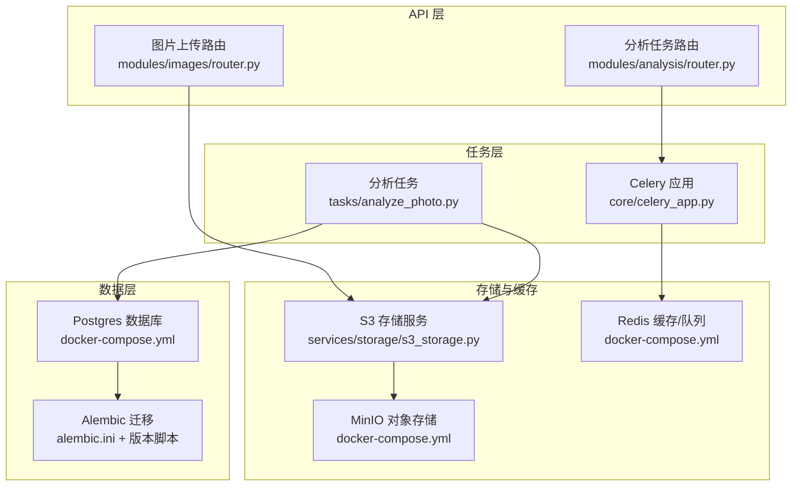
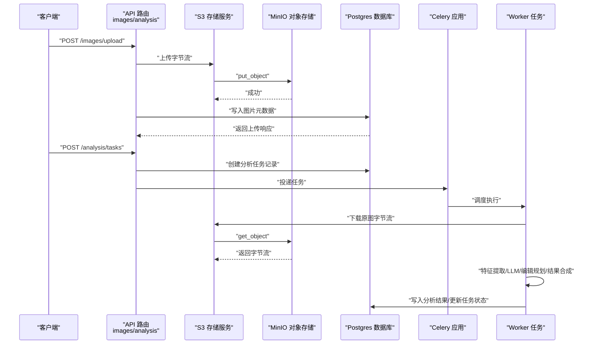
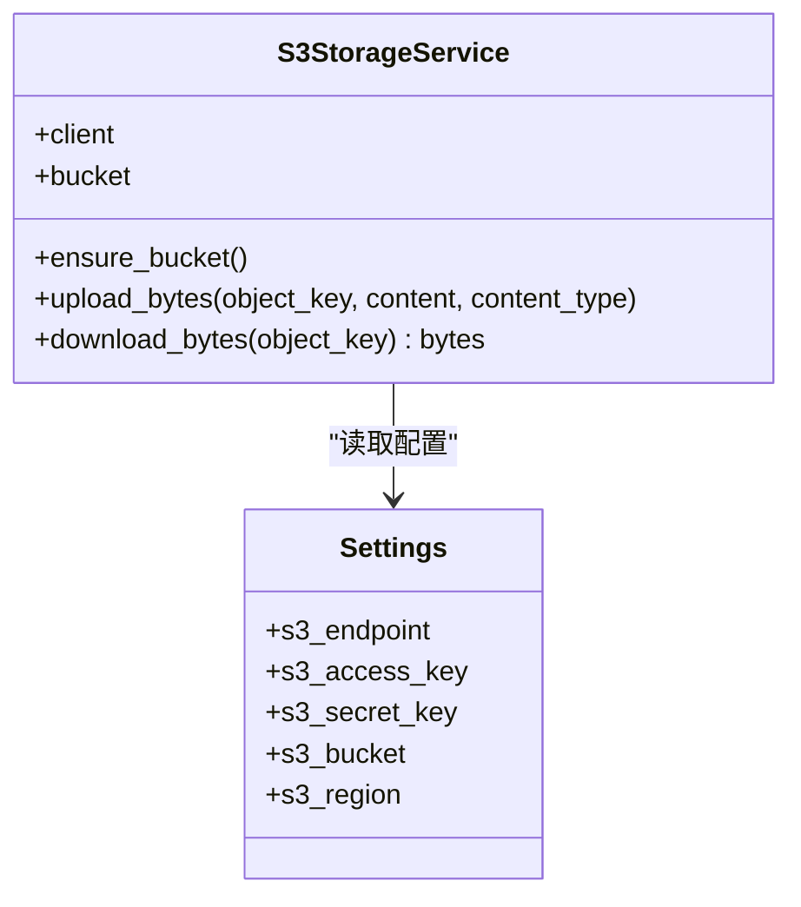
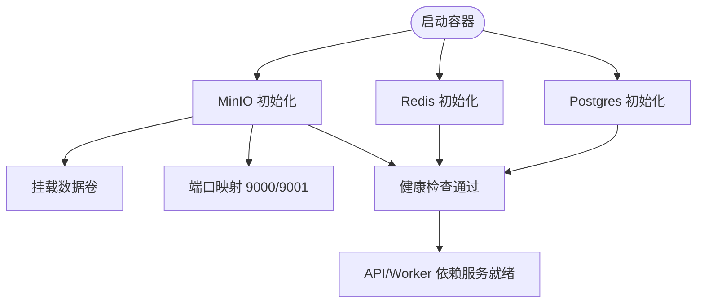
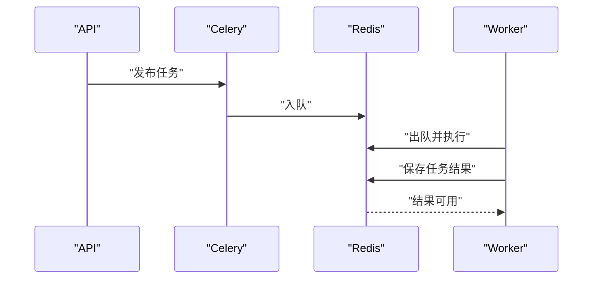
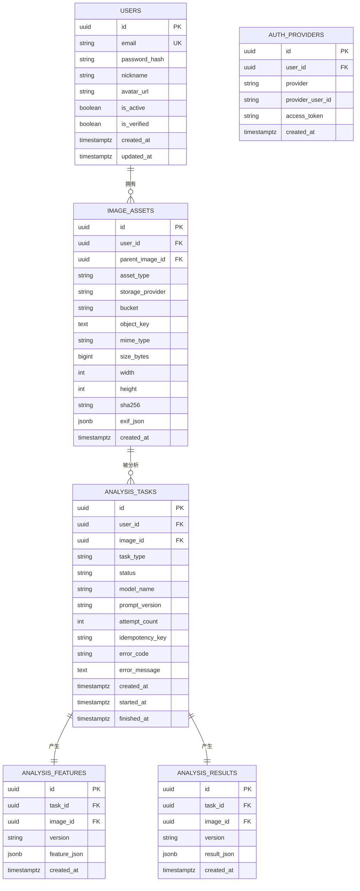
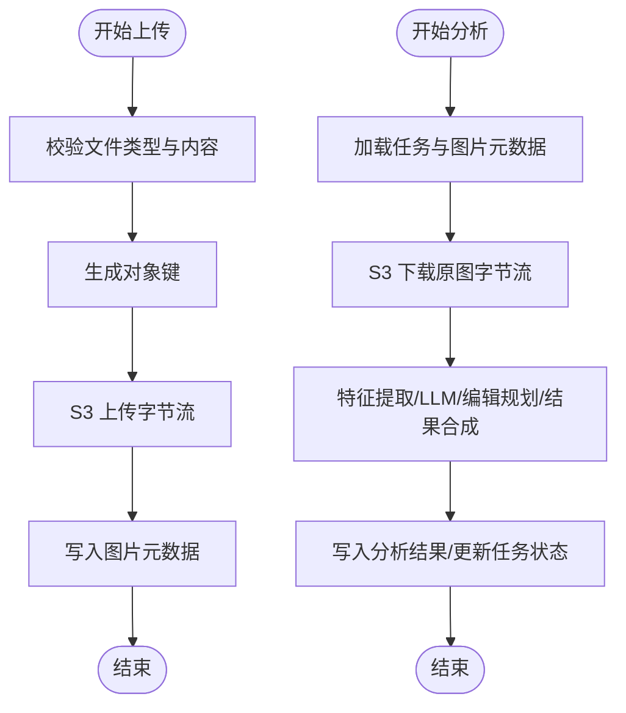
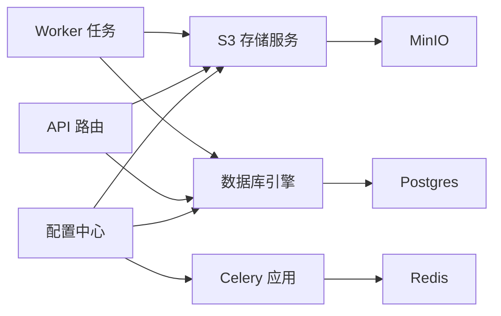

# 存储和缓存

<cite>
**本文引用的文件**
- [apps/api/app/services/storage/s3_storage.py](file://apps/api/app/services/storage/s3_storage.py)
- [apps/api/app/core/config.py](file://apps/api/app/core/config.py)
- [apps/api/app/core/database.py](file://apps/api/app/core/database.py)
- [apps/api/app/migrations/versions/708d1432f72e_initial_schema.py](file://apps/api/app/migrations/versions/708d1432f72e_initial_schema.py)
- [apps/api/alembic.ini](file://apps/api/alembic.ini)
- [apps/api/app/models/image_asset.py](file://apps/api/app/models/image_asset.py)
- [apps/api/app/models/analysis_task.py](file://apps/api/app/models/analysis_task.py)
- [apps/api/app/models/analysis_result.py](file://apps/api/app/models/analysis_result.py)
- [apps/api/app/modules/images/router.py](file://apps/api/app/modules/images/router.py)
- [apps/api/app/modules/analysis/router.py](file://apps/api/app/modules/analysis/router.py)
- [apps/api/app/tasks/analyze_photo.py](file://apps/api/app/tasks/analyze_photo.py)
- [apps/api/app/core/celery_app.py](file://apps/api/app/core/celery_app.py)
- [infra/docker-compose.yml](file://infra/docker-compose.yml)
</cite>

## 目录
1. [简介](#简介)
2. [项目结构](#项目结构)
3. [核心组件](#核心组件)
4. [架构总览](#架构总览)
5. [详细组件分析](#详细组件分析)
6. [依赖分析](#依赖分析)
7. [性能考虑](#性能考虑)
8. [故障排查指南](#故障排查指南)
9. [结论](#结论)
10. [附录](#附录)

## 简介
本文件聚焦于 AI 摄影教练项目的“存储与缓存”子系统，涵盖以下方面：
- S3 兼容存储（MinIO 本地部署）的集成与文件管理策略
- Redis 缓存在任务队列与会话中的使用场景与配置要点
- 数据库设计与迁移管理（基于 Alembic）
- 文件上传/下载的完整流程与性能优化建议
- 存储成本控制、备份策略与灾难恢复方案

## 项目结构
围绕存储与缓存的关键模块分布如下：
- 配置中心：集中管理数据库、Redis、S3 等外部服务连接参数
- 数据库与迁移：SQLAlchemy 引擎、会话工厂与 Alembic 迁移
- 对象存储：S3StorageService 封装 MinIO 客户端，提供桶校验与对象读写
- 业务路由：图片上传路由负责生成对象键、计算摘要并持久化元数据
- 分析任务：Celery 任务从 S3 下载原图，进行特征提取、LLM 分析与结果合成
- 本地编排：Docker Compose 提供 Postgres、Redis、MinIO 与 API/Worker 服务

图表来源
- [apps/api/app/modules/images/router.py:1-77](file://apps/api/app/modules/images/router.py#L1-L77)
- [apps/api/app/modules/analysis/router.py:1-151](file://apps/api/app/modules/analysis/router.py#L1-L151)
- [apps/api/app/tasks/analyze_photo.py:1-108](file://apps/api/app/tasks/analyze_photo.py#L1-L108)
- [apps/api/app/core/celery_app.py:1-21](file://apps/api/app/core/celery_app.py#L1-L21)
- [apps/api/app/services/storage/s3_storage.py:1-59](file://apps/api/app/services/storage/s3_storage.py#L1-L59)
- [apps/api/alembic.ini:1-147](file://apps/api/alembic.ini#L1-L147)
- [apps/api/app/migrations/versions/708d1432f72e_initial_schema.py:1-138](file://apps/api/app/migrations/versions/708d1432f72e_initial_schema.py#L1-L138)
- [infra/docker-compose.yml:1-107](file://infra/docker-compose.yml#L1-L107)

章节来源
- [apps/api/app/core/config.py:1-47](file://apps/api/app/core/config.py#L1-L47)
- [apps/api/app/core/database.py:1-39](file://apps/api/app/core/database.py#L1-L39)
- [apps/api/app/services/storage/s3_storage.py:1-59](file://apps/api/app/services/storage/s3_storage.py#L1-L59)
- [apps/api/app/modules/images/router.py:1-77](file://apps/api/app/modules/images/router.py#L1-L77)
- [apps/api/app/modules/analysis/router.py:1-151](file://apps/api/app/modules/analysis/router.py#L1-L151)
- [apps/api/app/tasks/analyze_photo.py:1-108](file://apps/api/app/tasks/analyze_photo.py#L1-L108)
- [apps/api/app/core/celery_app.py:1-21](file://apps/api/app/core/celery_app.py#L1-L21)
- [apps/api/alembic.ini:1-147](file://apps/api/alembic.ini#L1-L147)
- [apps/api/app/migrations/versions/708d1432f72e_initial_schema.py:1-138](file://apps/api/app/migrations/versions/708d1432f72e_initial_schema.py#L1-L138)
- [infra/docker-compose.yml:1-107](file://infra/docker-compose.yml#L1-L107)

## 核心组件
- 配置中心（Settings）：集中定义数据库、Redis、S3 等连接参数，提供 LRU 缓存实例
- 数据库引擎与会话：创建 SQLAlchemy 引擎与会话工厂，初始化时执行 Alembic 升级
- S3 存储服务：封装 boto3 客户端，确保桶存在，提供上传/下载字节流能力
- 图片上传路由：校验图片类型与内容，生成对象键，调用 S3 上传并持久化元数据
- 分析任务：从 S3 下载原图，执行多阶段处理，最终写回结果并更新任务状态
- Celery 应用：以 Redis 作为消息代理与结果后端，配置任务路由与时区

章节来源
- [apps/api/app/core/config.py:1-47](file://apps/api/app/core/config.py#L1-L47)
- [apps/api/app/core/database.py:1-39](file://apps/api/app/core/database.py#L1-L39)
- [apps/api/app/services/storage/s3_storage.py:1-59](file://apps/api/app/services/storage/s3_storage.py#L1-L59)
- [apps/api/app/modules/images/router.py:1-77](file://apps/api/app/modules/images/router.py#L1-L77)
- [apps/api/app/tasks/analyze_photo.py:1-108](file://apps/api/app/tasks/analyze_photo.py#L1-L108)
- [apps/api/app/core/celery_app.py:1-21](file://apps/api/app/core/celery_app.py#L1-L21)

## 架构总览
下图展示了从客户端上传图片到后台分析任务执行的端到端流程，以及各组件之间的交互关系。

图表来源
- [apps/api/app/modules/images/router.py:1-77](file://apps/api/app/modules/images/router.py#L1-L77)
- [apps/api/app/modules/analysis/router.py:1-151](file://apps/api/app/modules/analysis/router.py#L1-L151)
- [apps/api/app/tasks/analyze_photo.py:1-108](file://apps/api/app/tasks/analyze_photo.py#L1-L108)
- [apps/api/app/services/storage/s3_storage.py:1-59](file://apps/api/app/services/storage/s3_storage.py#L1-L59)
- [apps/api/app/core/celery_app.py:1-21](file://apps/api/app/core/celery_app.py#L1-L21)

## 详细组件分析

### S3 兼容存储与 MinIO 集成
- 客户端初始化：通过配置中心提供的 S3 参数创建 boto3 客户端，设置连接与读取超时及重试策略
- 桶管理：ensure_bucket 在不存在时自动创建桶，异常统一转换为 HTTP 503
- 对象操作：upload_bytes 与 download_bytes 提供字节级上传/下载，异常统一转换为 HTTP 503
- 缓存实例：get_storage_service 使用 LRU 缓存，首次初始化时完成桶校验

图表来源
- [apps/api/app/services/storage/s3_storage.py:11-59](file://apps/api/app/services/storage/s3_storage.py#L11-L59)
- [apps/api/app/core/config.py:16-20](file://apps/api/app/core/config.py#L16-L20)

章节来源
- [apps/api/app/services/storage/s3_storage.py:1-59](file://apps/api/app/services/storage/s3_storage.py#L1-L59)
- [apps/api/app/core/config.py:16-20](file://apps/api/app/core/config.py#L16-L20)

### MinIO 本地部署与文件管理策略
- 本地编排：docker-compose 定义 postgres、redis、minio 三类服务，API/Worker 通过环境变量指向对应服务
- 端口映射：MinIO 控制台与服务端口映射，便于本地调试
- 数据卷：MinIO 数据卷持久化，保障重启后数据不丢失
- 文件命名策略：上传路由按用户 ID/日期/UUID 生成对象键，避免冲突并利于归档

图表来源
- [infra/docker-compose.yml:1-107](file://infra/docker-compose.yml#L1-L107)

章节来源
- [infra/docker-compose.yml:1-107](file://infra/docker-compose.yml#L1-L107)
- [apps/api/app/modules/images/router.py:44-45](file://apps/api/app/modules/images/router.py#L44-L45)

### Redis 缓存与任务队列
- 任务队列：Celery 以 Redis 作为 broker 与 backend，用于任务投递与结果存储
- 队列路由：分析任务被路由到名为 analysis 的队列，便于资源隔离
- 会话存储：当前实现未显式使用 Redis 存储会话，认证令牌在前端 localStorage 中管理

图表来源
- [apps/api/app/core/celery_app.py:5-19](file://apps/api/app/core/celery_app.py#L5-L19)
- [apps/api/app/modules/analysis/router.py:71](file://apps/api/app/modules/analysis/router.py#L71)

章节来源
- [apps/api/app/core/celery_app.py:1-21](file://apps/api/app/core/celery_app.py#L1-L21)
- [apps/api/app/modules/analysis/router.py:1-151](file://apps/api/app/modules/analysis/router.py#L1-L151)

### 数据库设计与迁移管理
- 模型概览：users、auth_providers、image_assets、analysis_tasks、analysis_features、analysis_results
- 关系设计：外键约束保证用户与图片、任务与图片/用户的级联一致性；索引覆盖常用查询路径
- 迁移工具：Alembic 通过 ini 配置脚本位置与日志级别；应用启动时自动升级至 head

图表来源
- [apps/api/app/migrations/versions/708d1432f72e_initial_schema.py:25-117](file://apps/api/app/migrations/versions/708d1432f72e_initial_schema.py#L25-L117)
- [apps/api/app/models/image_asset.py:10-32](file://apps/api/app/models/image_asset.py#L10-L32)
- [apps/api/app/models/analysis_task.py:10-36](file://apps/api/app/models/analysis_task.py#L10-L36)
- [apps/api/app/models/analysis_result.py:10-28](file://apps/api/app/models/analysis_result.py#L10-L28)

章节来源
- [apps/api/app/core/database.py:19-39](file://apps/api/app/core/database.py#L19-L39)
- [apps/api/alembic.ini:1-147](file://apps/api/alembic.ini#L1-L147)
- [apps/api/app/migrations/versions/708d1432f72e_initial_schema.py:1-138](file://apps/api/app/migrations/versions/708d1432f72e_initial_schema.py#L1-L138)

### 文件上传与下载流程
- 上传流程：校验文件类型与内容，生成对象键，调用 S3 上传，随后写入 image_assets 元数据
- 下载流程：分析任务执行前从 S3 下载原图字节流，再进行特征提取与结果合成
- 错误处理：统一捕获客户端与核心异常，转换为 HTTP 503，避免泄露底层细节

图表来源
- [apps/api/app/modules/images/router.py:20-77](file://apps/api/app/modules/images/router.py#L20-L77)
- [apps/api/app/tasks/analyze_photo.py:19-108](file://apps/api/app/tasks/analyze_photo.py#L19-L108)
- [apps/api/app/services/storage/s3_storage.py:34-50](file://apps/api/app/services/storage/s3_storage.py#L34-L50)

章节来源
- [apps/api/app/modules/images/router.py:1-77](file://apps/api/app/modules/images/router.py#L1-L77)
- [apps/api/app/tasks/analyze_photo.py:1-108](file://apps/api/app/tasks/analyze_photo.py#L1-L108)
- [apps/api/app/services/storage/s3_storage.py:1-59](file://apps/api/app/services/storage/s3_storage.py#L1-L59)

## 依赖分析
- 组件耦合
  - S3StorageService 依赖 Settings，通过 LRU 缓存单例化
  - 数据库初始化依赖 Alembic，确保 schema 与版本一致
  - Celery 依赖 Redis，作为 broker 与 backend
  - 分析任务依赖 S3 下载原图，依赖数据库写入中间与最终结果
- 外部依赖
  - boto3/MinIO：对象存储访问
  - SQLAlchemy/Alembic：数据库 ORM 与迁移
  - Celery/Redis：异步任务队列
  - FastAPI：路由与依赖注入

图表来源
- [apps/api/app/core/config.py:6-47](file://apps/api/app/core/config.py#L6-L47)
- [apps/api/app/core/database.py:12-39](file://apps/api/app/core/database.py#L12-L39)
- [apps/api/app/core/celery_app.py:5-19](file://apps/api/app/core/celery_app.py#L5-L19)
- [apps/api/app/services/storage/s3_storage.py:11-21](file://apps/api/app/services/storage/s3_storage.py#L11-L21)

章节来源
- [apps/api/app/core/config.py:1-47](file://apps/api/app/core/config.py#L1-L47)
- [apps/api/app/core/database.py:1-39](file://apps/api/app/core/database.py#L1-L39)
- [apps/api/app/core/celery_app.py:1-21](file://apps/api/app/core/celery_app.py#L1-L21)
- [apps/api/app/services/storage/s3_storage.py:1-59](file://apps/api/app/services/storage/s3_storage.py#L1-L59)

## 性能考虑
- S3 传输优化
  - 超时与重试：合理设置连接与读取超时，降低弱网环境下的失败率
  - 流式处理：上传/下载采用字节流，避免一次性加载大文件到内存
  - 对象键命名：按用户/日期组织，便于分片与清理
- 数据库性能
  - 索引策略：针对任务状态与时间、图像与时间等高频查询建立复合索引
  - JSONB 查询：GIN 索引加速 JSONB 字段检索
- 任务并发
  - 队列隔离：分析任务独立队列，避免与其他任务争抢资源
  - 时区与时钟：Celery 时区配置与 UTC 切换，减少时间相关问题
- 缓存策略
  - 结果缓存：热点分析结果可考虑短期缓存（如 Redis），但需权衡一致性
  - 会话存储：当前未使用 Redis，建议结合 Token 黑名单与前端安全策略

## 故障排查指南
- S3 不可用
  - 现象：HTTP 503，提示存储不可用
  - 排查：确认 MinIO 服务健康、桶存在、凭证正确
- 数据库迁移失败
  - 现象：启动时报迁移错误或表缺失
  - 排查：检查 Alembic 配置、数据库连接、版本路径与权限
- 任务执行异常
  - 现象：任务状态变为 FAILED，记录错误码与信息
  - 排查：查看 Worker 日志、网络连通性、S3 下载是否成功
- 上传失败
  - 现象：文件类型不支持或空文件
  - 排查：确认 Content-Type、文件大小与 PIL 解码有效性

章节来源
- [apps/api/app/services/storage/s3_storage.py:23-50](file://apps/api/app/services/storage/s3_storage.py#L23-L50)
- [apps/api/app/core/database.py:27-39](file://apps/api/app/core/database.py#L27-L39)
- [apps/api/app/tasks/analyze_photo.py:97-107](file://apps/api/app/tasks/analyze_photo.py#L97-L107)
- [apps/api/app/modules/images/router.py:26-37](file://apps/api/app/modules/images/router.py#L26-L37)

## 结论
本项目通过 MinIO 实现本地化的 S3 兼容存储，结合 SQLAlchemy 与 Alembic 管理数据库模式演进；通过 Celery/Redis 实现异步任务队列。整体架构清晰、职责分离明确，具备良好的扩展性与可维护性。建议在生产环境中进一步完善缓存策略、监控告警与备份恢复方案。

## 附录
- 存储成本控制
  - 对象键命名与生命周期策略：按日期归档，定期清理临时文件
  - 压缩与去重：对重复图片计算哈希，避免重复存储
- 备份策略
  - 数据库：定期逻辑备份与增量备份，验证恢复流程
  - 对象存储：启用版本控制与跨区域复制（如使用 S3 兼容特性）
- 灾难恢复
  - 多活部署：数据库与对象存储分别异地部署
  - 快速回切：自动化健康检查与故障转移脚本