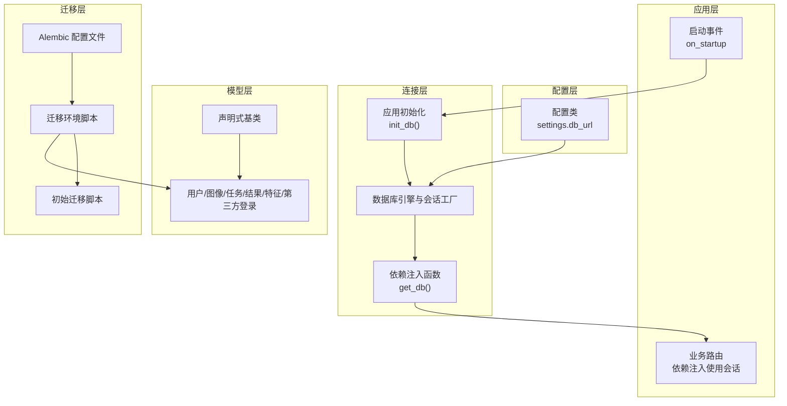
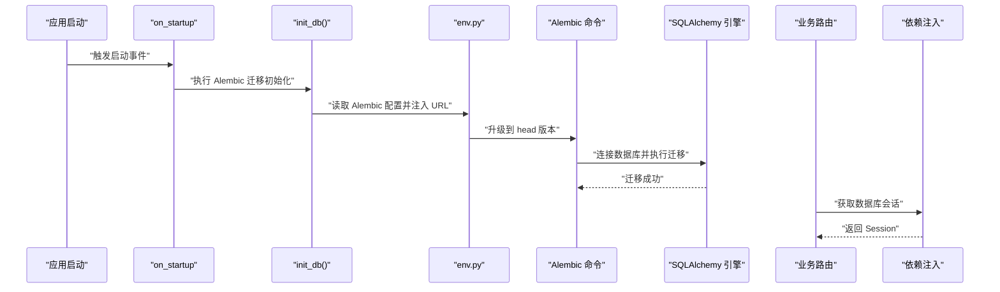
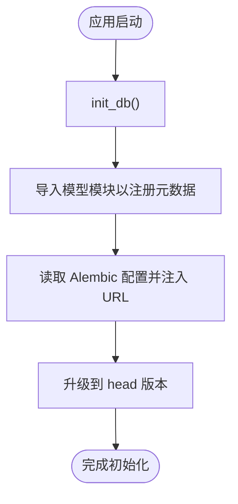
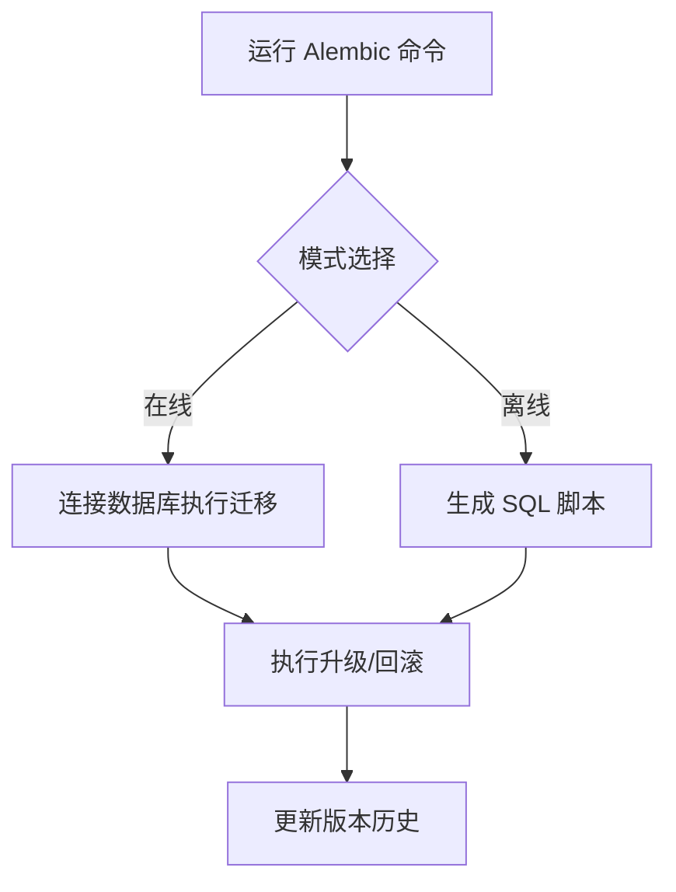
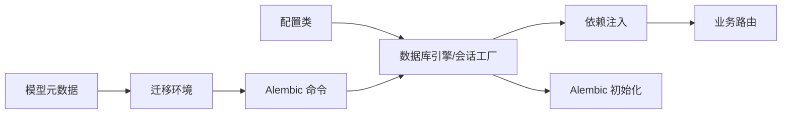

# 数据库管理

<cite>
**本文引用的文件**
- [apps/api/app/core/database.py](file://apps/api/app/core/database.py)
- [apps/api/app/core/config.py](file://apps/api/app/core/config.py)
- [apps/api/app/main.py](file://apps/api/app/main.py)
- [apps/api/alembic.ini](file://apps/api/alembic.ini)
- [apps/api/app/migrations/env.py](file://apps/api/app/migrations/env.py)
- [apps/api/app/migrations/versions/708d1432f72e_initial_schema.py](file://apps/api/app/migrations/versions/708d1432f72e_initial_schema.py)
- [apps/api/app/models/base.py](file://apps/api/app/models/base.py)
- [apps/api/app/models/__init__.py](file://apps/api/app/models/__init__.py)
- [apps/api/app/models/user.py](file://apps/api/app/models/user.py)
- [apps/api/app/models/image_asset.py](file://apps/api/app/models/image_asset.py)
- [apps/api/app/models/analysis_task.py](file://apps/api/app/models/analysis_task.py)
- [apps/api/app/models/analysis_result.py](file://apps/api/app/models/analysis_result.py)
- [apps/api/app/models/analysis_feature.py](file://apps/api/app/models/analysis_feature.py)
- [apps/api/app/models/auth_provider.py](file://apps/api/app/models/auth_provider.py)
- [apps/api/app/deps.py](file://apps/api/app/deps.py)
- [apps/api/app/modules/users/router.py](file://apps/api/app/modules/users/router.py)
</cite>

## 更新摘要
**所做更改**
- 更新了数据库初始化流程，完全采用 Alembic 迁移系统替代手动模式管理
- 新增了 Alembic 迁移工具的详细使用说明和最佳实践
- 完善了数据库架构演进能力和版本控制机制的说明
- 更新了依赖注入和连接管理的最佳实践

## 目录
1. [简介](#简介)
2. [项目结构](#项目结构)
3. [核心组件](#核心组件)
4. [架构总览](#架构总览)
5. [详细组件分析](#详细组件分析)
6. [依赖分析](#依赖分析)
7. [性能考虑](#性能考虑)
8. [故障排除指南](#故障排除指南)
9. [结论](#结论)
10. [附录](#附录)

## 简介
本文件面向数据库管理系统，围绕 SQLAlchemy ORM 配置与数据库连接管理、Alembic 迁移工具使用、数据库模型设计与最佳实践、初始化与种子数据策略、性能优化与查询优化、事务管理、备份与灾难恢复、监控与告警以及调试与故障排除进行系统化技术说明。文档以仓库中的实际实现为依据，结合架构图与流程图帮助读者快速理解并落地实践。

**更新** 本版本重点反映了 Alembic 数据库同步系统的全面应用变更，完全替换了原有的手动数据库模式管理方法，从 Base.metadata.create_all() 和手写 SQL 更新转换为基于 Alembic 的版本控制系统，显著增强了数据库架构的可维护性和演进能力。

## 项目结构
本项目的数据库相关代码集中在 API 应用层，采用"配置-连接-迁移-模型-路由"的分层组织方式：
- 配置层：集中于配置类，提供数据库连接字符串等环境参数
- 连接层：基于 SQLAlchemy 创建引擎与会话工厂，提供依赖注入的数据库会话
- 迁移层：Alembic 配置与环境脚本，支持在线/离线迁移
- 模型层：基于 declarative_base 的 ORM 映射，定义表结构、索引与约束
- 应用层：FastAPI 启动事件中执行 Alembic 迁移初始化；路由中通过依赖注入使用数据库会话



**图表来源**
- [apps/api/app/core/config.py:13-13](file://apps/api/app/core/config.py#L13-L13)
- [apps/api/app/core/database.py:12-24](file://apps/api/app/core/database.py#L12-L24)
- [apps/api/alembic.ini:8-8](file://apps/api/alembic.ini#L8-L8)
- [apps/api/app/migrations/env.py:13-28](file://apps/api/app/migrations/env.py#L13-L28)
- [apps/api/app/migrations/versions/708d1432f72e_initial_schema.py:22-118](file://apps/api/app/migrations/versions/708d1432f72e_initial_schema.py#L22-L118)
- [apps/api/app/models/base.py:1-5](file://apps/api/app/models/base.py#L1-L5)
- [apps/api/app/models/__init__.py:1-9](file://apps/api/app/models/__init__.py#L1-L9)
- [apps/api/app/main.py:27-29](file://apps/api/app/main.py#L27-L29)
- [apps/api/app/modules/users/router.py:17-26](file://apps/api/app/modules/users/router.py#L17-L26)

**章节来源**
- [apps/api/app/core/config.py:13-13](file://apps/api/app/core/config.py#L13-L13)
- [apps/api/app/core/database.py:12-24](file://apps/api/app/core/database.py#L12-L24)
- [apps/api/alembic.ini:8-8](file://apps/api/alembic.ini#L8-L8)
- [apps/api/app/migrations/env.py:13-28](file://apps/api/app/migrations/env.py#L13-L28)
- [apps/api/app/migrations/versions/708d1432f72e_initial_schema.py:22-118](file://apps/api/app/migrations/versions/708d1432f72e_initial_schema.py#L22-L118)
- [apps/api/app/models/base.py:1-5](file://apps/api/app/models/base.py#L1-L5)
- [apps/api/app/models/__init__.py:1-9](file://apps/api/app/models/__init__.py#L1-L9)
- [apps/api/app/main.py:27-29](file://apps/api/app/main.py#L27-L29)
- [apps/api/app/modules/users/router.py:17-26](file://apps/api/app/modules/users/router.py#L17-L26)

## 核心组件
- 数据库配置与连接
  - 通过配置类提供数据库连接字符串，创建 SQLAlchemy 引擎与会话工厂
  - 提供依赖注入函数，按需创建与关闭数据库会话
- Alembic 迁移系统
  - 配置文件指定迁移脚本位置与日志级别，完全替代了手动模式管理
  - 环境脚本注入数据库 URL 并加载模型元数据，支持在线/离线迁移
  - 初始迁移脚本定义完整 schema 与索引，确保数据库架构的版本控制
- 模型与表结构
  - 基于 declarative_base 定义用户、图像资产、分析任务、分析结果、分析特征、第三方登录等表
  - 显式定义主键、外键、唯一约束、索引与 JSON 字段类型
- 应用初始化
  - FastAPI 启动事件中调用 Alembic 迁移初始化，确保 schema 与版本一致

**更新** 核心组件现已完全基于 Alembic 迁移系统，替代了原有的手动数据库模式管理方法，提供了更强的版本控制和架构演进能力。

**章节来源**
- [apps/api/app/core/config.py:13-13](file://apps/api/app/core/config.py#L13-L13)
- [apps/api/app/core/database.py:12-24](file://apps/api/app/core/database.py#L12-L24)
- [apps/api/alembic.ini:8-8](file://apps/api/alembic.ini#L8-L8)
- [apps/api/app/migrations/env.py:13-28](file://apps/api/app/migrations/env.py#L13-L28)
- [apps/api/app/migrations/versions/708d1432f72e_initial_schema.py:22-118](file://apps/api/app/migrations/versions/708d1432f72e_initial_schema.py#L22-L118)
- [apps/api/app/models/base.py:1-5](file://apps/api/app/models/base.py#L1-L5)
- [apps/api/app/models/__init__.py:1-9](file://apps/api/app/models/__init__.py#L1-L9)
- [apps/api/app/main.py:27-29](file://apps/api/app/main.py#L27-L29)

## 架构总览
下图展示从应用启动到 Alembic 迁移、模型加载与请求处理的端到端流程：



**更新** 架构流程已完全基于 Alembic 迁移系统，替代了原有的手动模式管理流程，提供了更强的版本控制和一致性保证。

**图表来源**
- [apps/api/app/main.py:27-29](file://apps/api/app/main.py#L27-L29)
- [apps/api/app/core/database.py:27-38](file://apps/api/app/core/database.py#L27-L38)
- [apps/api/app/migrations/env.py:45-65](file://apps/api/app/migrations/env.py#L45-L65)
- [apps/api/alembic.ini:8-8](file://apps/api/alembic.ini#L8-L8)

## 详细组件分析

### SQLAlchemy ORM 配置与连接管理
- 引擎与会话工厂
  - 使用配置类提供的数据库 URL 创建引擎，启用 pre_ping 以提升连接稳定性
  - 使用会话工厂创建带绑定的会话，禁用自动 flush 与自动提交，便于手动控制事务
- 依赖注入
  - 提供生成器函数，按需创建会话并在 finally 分支中关闭，避免连接泄漏
- 初始化流程
  - 在应用启动时调用 Alembic 迁移初始化，确保 schema 与版本一致



**更新** 初始化流程已完全基于 Alembic 迁移系统，替代了原有的手动模式管理方法，提供了更强的版本控制和一致性保证。

**图表来源**
- [apps/api/app/core/database.py:27-38](file://apps/api/app/core/database.py#L27-L38)
- [apps/api/app/migrations/env.py:13-28](file://apps/api/app/migrations/env.py#L13-L28)

**章节来源**
- [apps/api/app/core/database.py:12-24](file://apps/api/app/core/database.py#L12-L24)
- [apps/api/app/core/database.py:19-24](file://apps/api/app/core/database.py#L19-L24)
- [apps/api/app/core/database.py:27-38](file://apps/api/app/core/database.py#L27-L38)
- [apps/api/app/main.py:27-29](file://apps/api/app/main.py#L27-L29)

### Alembic 迁移工具使用
- 配置与环境
  - 配置文件指定脚本位置与日志级别，环境脚本注入数据库 URL 并加载模型元数据
  - 支持在线与离线两种迁移模式：在线直接连接数据库执行，离线仅生成 SQL 脚本
- 迁移初始化
  - 完全替代了原有的 Base.metadata.create_all() 方法，通过 Alembic 命令升级到 head 版本
  - 确保所有数据库模式变更都经过版本控制，提供更强的可维护性
- 初始迁移
  - 定义用户、图像资产、分析任务、分析特征、分析结果与第三方登录表
  - 明确主键、外键、唯一约束与复合索引，满足查询与一致性需求
- 升级与回滚
  - 升级至 head 版本，回滚时按逆序删除索引与表，保证幂等性

**更新** Alembic 迁移工具已成为数据库管理的核心组件，完全替代了原有的手动模式管理方法，提供了版本控制、可追溯性和更强的架构演进能力。



**图表来源**
- [apps/api/alembic.ini:8-8](file://apps/api/alembic.ini#L8-L8)
- [apps/api/app/migrations/env.py:31-65](file://apps/api/app/migrations/env.py#L31-L65)
- [apps/api/app/migrations/versions/708d1432f72e_initial_schema.py:22-118](file://apps/api/app/migrations/versions/708d1432f72e_initial_schema.py#L22-L118)

**章节来源**
- [apps/api/alembic.ini:8-8](file://apps/api/alembic.ini#L8-L8)
- [apps/api/app/migrations/env.py:13-28](file://apps/api/app/migrations/env.py#L13-L28)
- [apps/api/app/migrations/env.py:31-65](file://apps/api/app/migrations/env.py#L31-L65)
- [apps/api/app/migrations/versions/708d1432f72e_initial_schema.py:22-118](file://apps/api/app/migrations/versions/708d1432f72e_initial_schema.py#L22-L118)

### 数据库模型设计与最佳实践
- 设计原则
  - 使用 UUID 作为主键，提升安全性与分布式扩展能力
  - 外键约束明确删除策略（如 CASCADE），保证级联删除的一致性
  - JSON 字段用于存储半结构化数据，配合 PostgreSQL GIN 索引加速查询
  - 复合索引覆盖高频查询路径，如"用户+时间"、"状态+时间"
- 表关系
  - 用户与图像资产：一对多，图像资产删除时级联清理
  - 图像资产与分析任务：一对多，任务删除时级联清理
  - 分析任务与分析结果/特征：一对一映射，通过唯一约束保障
- 约束与索引
  - 唯一约束保证对象键组合唯一
  - 复合索引与 GIN 索引提升查询效率
  - 时间戳字段使用服务器默认值与更新回调，减少应用侧逻辑

```mermaid
erDiagram
USERS {
uuid id PK
string email UK
string password_hash
string nickname
string avatar_url
boolean is_active
boolean is_verified
timestamptz created_at
timestamptz updated_at
}
IMAGE_ASSETS {
uuid id PK
uuid user_id FK
uuid parent_image_id FK
string asset_type
string storage_provider
string bucket
text object_key
string mime_type
bigint size_bytes
int width
int height
string sha256
jsonb exif_json
timestamptz created_at
}
ANALYSIS_TASKS {
uuid id PK
uuid user_id FK
uuid image_id FK
string task_type
string status
string model_name
string prompt_version
int attempt_count
string idempotency_key
string error_code
text error_message
timestamptz created_at
timestamptz started_at
timestamptz finished_at
}
ANALYSIS_FEATURES {
uuid id PK
uuid task_id FK UK
uuid image_id FK
string version
jsonb feature_json
timestamptz created_at
}
ANALYSIS_RESULTS {
uuid id PK
uuid task_id FK UK
uuid image_id FK
string version
jsonb result_json
timestamptz created_at
}
AUTH_PROVIDERS {
uuid id PK
uuid user_id FK IX
string provider
string provider_user_id
string access_token
timestamptz created_at
}
USERS ||--o{ IMAGE_ASSETS : "拥有"
IMAGE_ASSETS ||--o{ ANALYSIS_TASKS : "产生"
ANALYSIS_TASKS ||--|| ANALYSIS_FEATURES : "生成"
ANALYSIS_TASKS ||--|| ANALYSIS_RESULTS : "生成"
IMAGE_ASSETS ||--o{ ANALYSIS_FEATURES : "关联"
IMAGE_ASSETS ||--o{ ANALYSIS_RESULTS : "关联"
USERS ||--o{ AUTH_PROVIDERS : "绑定"
```

**更新** 数据库模型设计已完全适配 Alembic 迁移系统，通过版本控制确保模型演进的一致性和可追溯性。

**图表来源**
- [apps/api/app/models/user.py:12-27](file://apps/api/app/models/user.py#L12-L27)
- [apps/api/app/models/image_asset.py:10-31](file://apps/api/app/models/image_asset.py#L10-L31)
- [apps/api/app/models/analysis_task.py:10-35](file://apps/api/app/models/analysis_task.py#L10-L35)
- [apps/api/app/models/analysis_feature.py:10-27](file://apps/api/app/models/analysis_feature.py#L10-L27)
- [apps/api/app/models/analysis_result.py:10-27](file://apps/api/app/models/analysis_result.py#L10-L27)
- [apps/api/app/models/auth_provider.py:12-23](file://apps/api/app/models/auth_provider.py#L12-L23)

**章节来源**
- [apps/api/app/models/user.py:12-27](file://apps/api/app/models/user.py#L12-L27)
- [apps/api/app/models/image_asset.py:10-31](file://apps/api/app/models/image_asset.py#L10-L31)
- [apps/api/app/models/analysis_task.py:10-35](file://apps/api/app/models/analysis_task.py#L10-L35)
- [apps/api/app/models/analysis_feature.py:10-27](file://apps/api/app/models/analysis_feature.py#L10-L27)
- [apps/api/app/models/analysis_result.py:10-27](file://apps/api/app/models/analysis_result.py#L10-L27)
- [apps/api/app/models/auth_provider.py:12-23](file://apps/api/app/models/auth_provider.py#L12-L23)

### 数据库初始化与种子数据策略
- 初始化流程
  - 应用启动事件中调用 Alembic 迁移初始化，确保 schema 与版本一致
  - 通过 Alembic 升级到 head，完全替代了直接使用 metadata.create_all 的手动方法
- 种子数据
  - 当前仓库未提供种子数据脚本；建议在迁移脚本中添加数据插入或引入独立的种子服务

**更新** 数据库初始化流程已完全基于 Alembic 迁移系统，替代了原有的手动模式管理方法，提供了更强的版本控制和一致性保证。

**章节来源**
- [apps/api/app/main.py:27-29](file://apps/api/app/main.py#L27-L29)
- [apps/api/app/core/database.py:27-38](file://apps/api/app/core/database.py#L27-L38)

### 事务管理与依赖注入
- 依赖注入
  - 路由层通过依赖注入获取数据库会话，确保每个请求使用独立会话
  - 认证中间件在获取用户信息时同样使用会话，保证事务边界清晰
- 事务控制
  - 会话工厂禁用自动提交，业务层在需要时显式 commit 或回滚，避免隐式提交带来的副作用

**章节来源**
- [apps/api/app/deps.py:15-33](file://apps/api/app/deps.py#L15-L33)
- [apps/api/app/modules/users/router.py:17-26](file://apps/api/app/modules/users/router.py#L17-L26)
- [apps/api/app/core/database.py:12-13](file://apps/api/app/core/database.py#L12-L13)

## 依赖分析
- 组件耦合
  - 连接层依赖配置层提供的数据库 URL
  - 迁移层依赖模型层的元数据注册
  - 应用层在启动时依赖迁移层完成 Alembic 初始化
- 外部依赖
  - SQLAlchemy ORM 与 Alembic
  - PostgreSQL（JSONB、GIN 索引等特性）

**更新** 依赖关系已完全适配 Alembic 迁移系统，提供了更强的版本控制和架构演进能力。



**图表来源**
- [apps/api/app/core/config.py:13-13](file://apps/api/app/core/config.py#L13-L13)
- [apps/api/app/core/database.py:12-24](file://apps/api/app/core/database.py#L12-L24)
- [apps/api/app/migrations/env.py:13-28](file://apps/api/app/migrations/env.py#L13-L28)
- [apps/api/app/models/__init__.py:1-9](file://apps/api/app/models/__init__.py#L1-L9)
- [apps/api/app/modules/users/router.py:17-26](file://apps/api/app/modules/users/router.py#L17-L26)

**章节来源**
- [apps/api/app/core/config.py:13-13](file://apps/api/app/core/config.py#L13-L13)
- [apps/api/app/core/database.py:12-24](file://apps/api/app/core/database.py#L12-L24)
- [apps/api/app/migrations/env.py:13-28](file://apps/api/app/migrations/env.py#L13-L28)
- [apps/api/app/models/__init__.py:1-9](file://apps/api/app/models/__init__.py#L1-L9)
- [apps/api/app/modules/users/router.py:17-26](file://apps/api/app/modules/users/router.py#L17-L26)

## 性能考虑
- 连接池与健康检查
  - 启用 pre_ping 提升连接可用性，降低断连重试成本
- 索引优化
  - 为高频查询列建立复合索引（如"用户+时间"、"状态+时间"）
  - JSON 字段使用 GIN 索引加速查询与匹配
- 查询优化
  - 使用显式 JOIN 与 LIMIT 控制结果集大小
  - 避免 SELECT *，仅选择必要字段
- 事务与并发
  - 显式控制事务边界，批量写入时合并提交
  - 使用只读事务处理报表类查询，降低锁竞争

## 故障排除指南
- 迁移失败
  - 检查 Alembic 配置文件中的脚本位置与日志级别
  - 确认环境脚本正确注入数据库 URL 并加载模型元数据
- 连接异常
  - 核对配置类中的数据库 URL 是否可达
  - 查看 pre_ping 设置是否生效
- 权限与约束错误
  - 检查外键约束与唯一约束定义，确认数据一致性
- 查询缓慢
  - 检查是否存在缺失索引，必要时补充复合索引或 GIN 索引

**更新** 故障排除指南已更新以反映 Alembic 迁移系统的特性，重点关注版本控制和迁移一致性问题。

**章节来源**
- [apps/api/alembic.ini:8-8](file://apps/api/alembic.ini#L8-L8)
- [apps/api/app/migrations/env.py:13-28](file://apps/api/app/migrations/env.py#L13-L28)
- [apps/api/app/core/config.py:13-13](file://apps/api/app/core/config.py#L13-L13)
- [apps/api/app/models/analysis_task.py:32-35](file://apps/api/app/models/analysis_task.py#L32-L35)
- [apps/api/app/models/analysis_result.py:24-27](file://apps/api/app/models/analysis_result.py#L24-L27)

## 结论
本项目采用标准化的 SQLAlchemy + Alembic 方案，实现了可演进的数据库架构：通过依赖注入管理连接、通过 Alembic 迁移工具控制版本、通过模型层表达表关系与约束。Alembic 迁移系统的全面应用显著增强了数据库架构的可维护性和演进能力，完全替代了原有的手动数据库模式管理方法。结合合理的索引策略与事务控制，可在保证一致性的同时兼顾性能。建议后续补充种子数据与监控告警机制，进一步完善生产级数据库管理能力。

**更新** 结论部分已更新以反映 Alembic 迁移系统的全面应用，强调了其在数据库架构演进和可维护性方面的优势。

## 附录

### 数据库初始化流程（步骤化）
- 启动应用
- 触发启动事件
- 加载模型模块
- 读取 Alembic 配置并注入数据库 URL
- 升级到 head 版本
- 初始化完成

**更新** 初始化流程已完全基于 Alembic 迁移系统，替代了原有的手动模式管理方法。

**章节来源**
- [apps/api/app/main.py:27-29](file://apps/api/app/main.py#L27-L29)
- [apps/api/app/core/database.py:27-38](file://apps/api/app/core/database.py#L27-L38)
- [apps/api/app/migrations/env.py:13-28](file://apps/api/app/migrations/env.py#L13-L28)

### 迁移命令参考（示例）
- 升级到最新版本
  - 在项目根目录执行 Alembic 命令，指向迁移配置文件
- 生成新迁移
  - 基于模型变更自动生成迁移脚本
- 回滚至上一版本
  - 按逆序执行回滚脚本

**更新** 迁移命令参考已更新以反映 Alembic 迁移系统的标准操作流程。

**章节来源**
- [apps/api/alembic.ini:8-8](file://apps/api/alembic.ini#L8-L8)
- [apps/api/app/migrations/env.py:45-65](file://apps/api/app/migrations/env.py#L45-L65)
- [apps/api/app/migrations/versions/708d1432f72e_initial_schema.py:121-137](file://apps/api/app/migrations/versions/708d1432f72e_initial_schema.py#L121-L137)