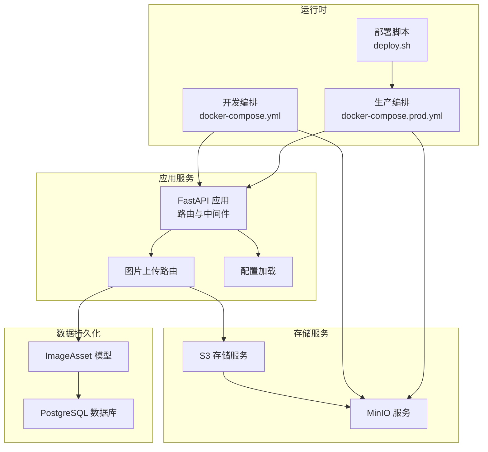
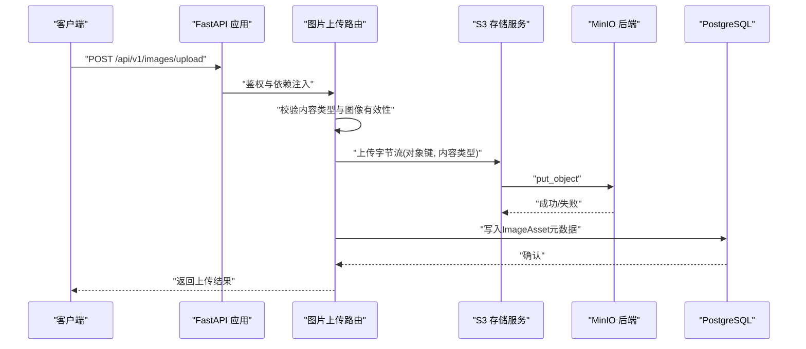
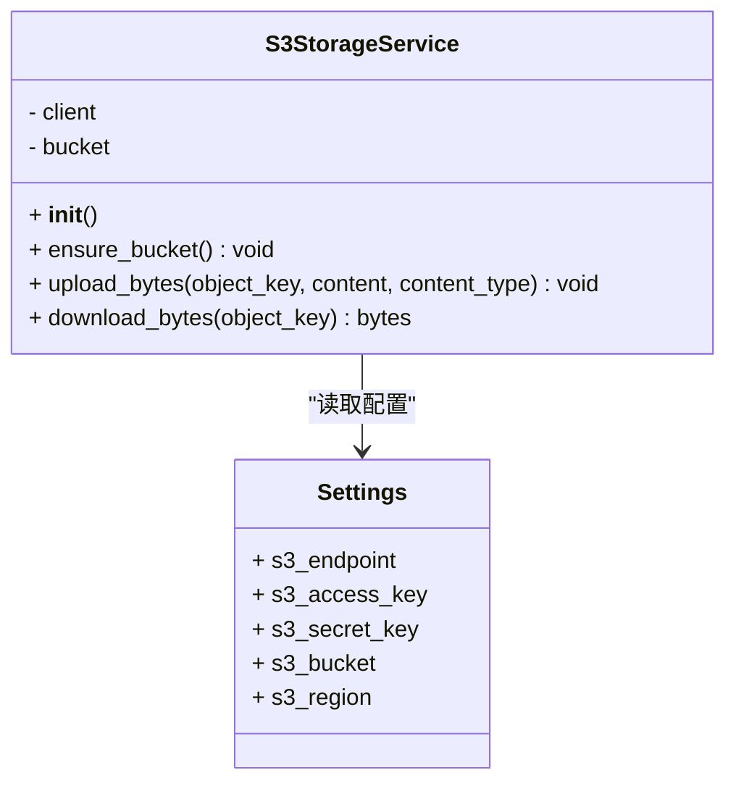
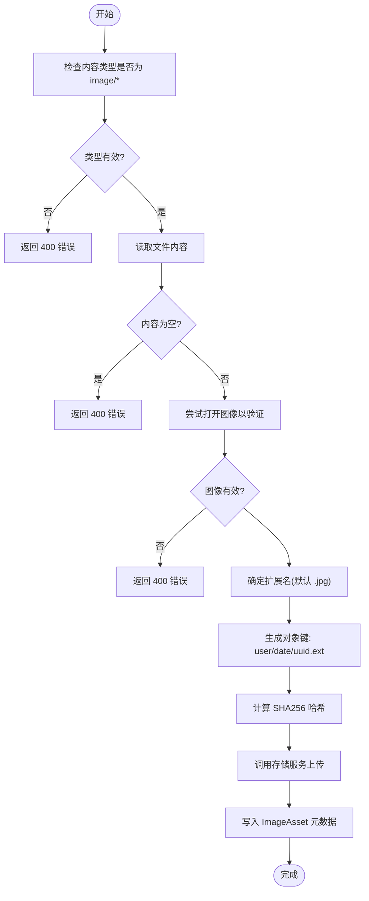
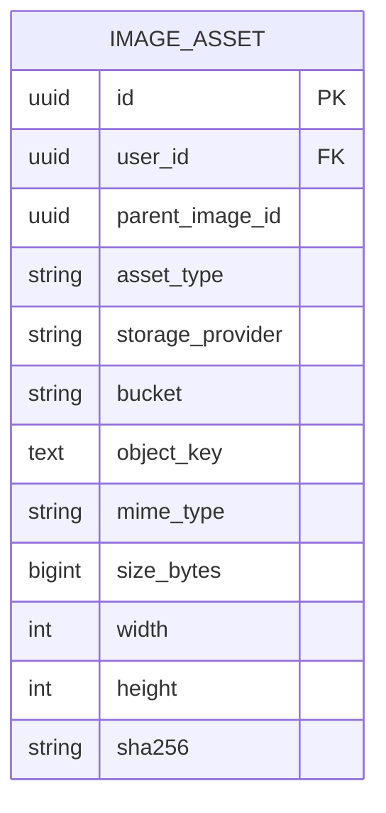
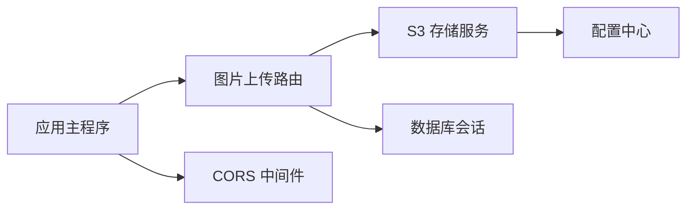

# 存储系统

<cite>
**本文引用的文件**
- [apps/api/app/services/storage/s3_storage.py](file://apps/api/app/services/storage/s3_storage.py)
- [apps/api/app/core/config.py](file://apps/api/app/core/config.py)
- [apps/api/app/models/image_asset.py](file://apps/api/app/models/image_asset.py)
- [apps/api/app/modules/images/router.py](file://apps/api/app/modules/images/router.py)
- [apps/api/app/schemas/image.py](file://apps/api/app/schemas/image.py)
- [apps/api/app/deps.py](file://apps/api/app/deps.py)
- [apps/api/app/main.py](file://apps/api/app/main.py)
- [infra/docker-compose.yml](file://infra/docker-compose.yml)
- [infra/docker-compose.prod.yml](file://infra/docker-compose.prod.yml)
- [infra/deploy.sh](file://infra/deploy.sh)
</cite>

## 目录
1. [简介](#简介)
2. [项目结构](#项目结构)
3. [核心组件](#核心组件)
4. [架构总览](#架构总览)
5. [详细组件分析](#详细组件分析)
6. [依赖分析](#依赖分析)
7. [性能考虑](#性能考虑)
8. [故障排查指南](#故障排查指南)
9. [结论](#结论)
10. [附录](#附录)

## 简介
本技术文档面向“AI摄影教练”项目的存储系统，聚焦于S3兼容存储（以MinIO作为本地存储后端）的配置与使用，覆盖文件上传流程（含校验、大小限制、格式检查与安全策略）、存储桶配置与访问权限管理、对象命名策略与目录结构设计、缓存与CDN集成思路、成本优化与性能调优建议、数据备份与恢复策略以及监控与容量管理最佳实践。文档基于仓库中实际实现进行梳理，确保可操作性与可追溯性。

## 项目结构
存储系统由以下关键部分组成：
- 配置层：集中定义S3端点、密钥、桶名、区域等参数
- 服务层：封装S3客户端、自动创建桶、提供上传/下载能力
- 模型层：持久化图片资产元数据（含桶名、对象键、MIME类型、尺寸、哈希等）
- 接口层：上传接口负责格式校验、生成对象键、调用存储服务并写入数据库
- 运行时编排：通过Docker Compose在开发与生产环境分别部署PostgreSQL、Redis、MinIO与API/Worker服务

图表来源
- [apps/api/app/main.py:1-36](file://apps/api/app/main.py#L1-L36)
- [apps/api/app/modules/images/router.py:1-77](file://apps/api/app/modules/images/router.py#L1-L77)
- [apps/api/app/services/storage/s3_storage.py:1-59](file://apps/api/app/services/storage/s3_storage.py#L1-L59)
- [apps/api/app/models/image_asset.py:1-32](file://apps/api/app/models/image_asset.py#L1-L32)
- [apps/api/app/core/config.py:1-47](file://apps/api/app/core/config.py#L1-L47)
- [infra/docker-compose.yml:1-107](file://infra/docker-compose.yml#L1-L107)
- [infra/docker-compose.prod.yml:1-128](file://infra/docker-compose.prod.yml#L1-L128)
- [infra/deploy.sh:1-62](file://infra/deploy.sh#L1-L62)

章节来源
- [apps/api/app/main.py:1-36](file://apps/api/app/main.py#L1-L36)
- [apps/api/app/core/config.py:1-47](file://apps/api/app/core/config.py#L1-L47)
- [apps/api/app/services/storage/s3_storage.py:1-59](file://apps/api/app/services/storage/s3_storage.py#L1-L59)
- [apps/api/app/models/image_asset.py:1-32](file://apps/api/app/models/image_asset.py#L1-L32)
- [apps/api/app/modules/images/router.py:1-77](file://apps/api/app/modules/images/router.py#L1-L77)
- [infra/docker-compose.yml:1-107](file://infra/docker-compose.yml#L1-L107)
- [infra/docker-compose.prod.yml:1-128](file://infra/docker-compose.prod.yml#L1-L128)
- [infra/deploy.sh:1-62](file://infra/deploy.sh#L1-L62)

## 核心组件
- S3存储服务：封装Boto3客户端，提供自动建桶、上传字节流、下载字节流能力；异常统一转换为HTTP 503
- 图片上传路由：负责内容类型校验、图像有效性校验、扩展名处理、对象键生成、调用存储服务与数据库写入
- 配置中心：集中管理S3端点、密钥、桶名、区域等，支持开发与生产环境差异化
- 数据模型：ImageAsset用于持久化图片资产元数据，包含桶名、对象键、MIME类型、尺寸、哈希等字段
- 运行时编排：通过Compose在本地快速搭建MinIO、PostgreSQL、Redis与API/Worker服务

章节来源
- [apps/api/app/services/storage/s3_storage.py:11-59](file://apps/api/app/services/storage/s3_storage.py#L11-L59)
- [apps/api/app/modules/images/router.py:20-77](file://apps/api/app/modules/images/router.py#L20-L77)
- [apps/api/app/core/config.py:16-20](file://apps/api/app/core/config.py#L16-L20)
- [apps/api/app/models/image_asset.py:10-32](file://apps/api/app/models/image_asset.py#L10-L32)
- [infra/docker-compose.yml:32-48](file://infra/docker-compose.yml#L32-L48)

## 架构总览
下图展示从客户端到存储后端的整体调用链路与数据流向：

图表来源
- [apps/api/app/modules/images/router.py:20-77](file://apps/api/app/modules/images/router.py#L20-L77)
- [apps/api/app/services/storage/s3_storage.py:34-43](file://apps/api/app/services/storage/s3_storage.py#L34-L43)
- [apps/api/app/models/image_asset.py:10-32](file://apps/api/app/models/image_asset.py#L10-L32)
- [apps/api/app/main.py:21-24](file://apps/api/app/main.py#L21-L24)

## 详细组件分析

### S3存储服务
- 初始化：根据配置构造Boto3 S3客户端，设置连接/读取超时与重试策略
- 自动建桶：若桶不存在则尝试创建，异常统一转为HTTP 503
- 上传/下载：提供上传字节流与下载字节流方法，异常统一转为HTTP 503
- 单例缓存：通过LRU缓存确保全局唯一实例并延迟初始化

图表来源
- [apps/api/app/services/storage/s3_storage.py:11-59](file://apps/api/app/services/storage/s3_storage.py#L11-L59)
- [apps/api/app/core/config.py:16-20](file://apps/api/app/core/config.py#L16-L20)

章节来源
- [apps/api/app/services/storage/s3_storage.py:11-59](file://apps/api/app/services/storage/s3_storage.py#L11-L59)
- [apps/api/app/core/config.py:16-20](file://apps/api/app/core/config.py#L16-L20)

### 图片上传流程
- 安全与格式校验：仅允许image/*类型；读取文件内容并尝试打开图像以验证有效性
- 对象键生成：采用“用户ID/日期/UUID扩展名”的分层结构，保证多用户隔离与时间维度归档
- 元数据采集：计算SHA256哈希、记录MIME类型、尺寸、字节数等
- 存储与持久化：调用S3存储服务上传，随后写入ImageAsset表

图表来源
- [apps/api/app/modules/images/router.py:20-77](file://apps/api/app/modules/images/router.py#L20-L77)

章节来源
- [apps/api/app/modules/images/router.py:20-77](file://apps/api/app/modules/images/router.py#L20-L77)
- [apps/api/app/schemas/image.py:6-13](file://apps/api/app/schemas/image.py#L6-L13)

### 数据模型与命名策略
- 数据模型：ImageAsset记录用户ID、父图（可空）、资产类型、存储提供商、桶名、对象键、MIME类型、大小、宽高、哈希、EXIF等
- 命名策略：对象键采用“用户ID/日期/UUID.扩展名”，既满足按用户隔离，又便于按日期归档
- 目录结构：逻辑上形成“用户/年月日/文件”的层次，利于后续清理与审计

图表来源
- [apps/api/app/models/image_asset.py:10-32](file://apps/api/app/models/image_asset.py#L10-L32)

章节来源
- [apps/api/app/models/image_asset.py:10-32](file://apps/api/app/models/image_asset.py#L10-L32)
- [apps/api/app/modules/images/router.py:44-45](file://apps/api/app/modules/images/router.py#L44-L45)

### 认证与依赖注入
- 依赖注入：通过HTTP Bearer认证获取当前用户，未提供或无效令牌时返回401
- 用户ID提取：提供便捷方法获取当前用户ID，供上传路由使用

章节来源
- [apps/api/app/deps.py:15-41](file://apps/api/app/deps.py#L15-L41)

### 配置与运行时编排
- 开发环境：本地默认S3端点指向localhost:9000，MinIO容器同时暴露控制台端口
- 生产环境：通过环境变量注入S3密钥、桶名、区域等，API/Worker均依赖健康的服务启动顺序
- 部署脚本：校验必要环境变量，使用docker compose拉起生产栈

章节来源
- [apps/api/app/core/config.py:16-20](file://apps/api/app/core/config.py#L16-L20)
- [infra/docker-compose.yml:32-48](file://infra/docker-compose.yml#L32-L48)
- [infra/docker-compose.prod.yml:44-58](file://infra/docker-compose.prod.yml#L44-L58)
- [infra/deploy.sh:35-42](file://infra/deploy.sh#L35-L42)

## 依赖分析
- 组件耦合：上传路由依赖存储服务与数据库；存储服务依赖配置；应用主程序注册路由与CORS
- 外部依赖：Boto3、botocore、FastAPI、SQLAlchemy、Pydantic等
- 可能的循环依赖：当前结构清晰，未发现循环导入

图表来源
- [apps/api/app/modules/images/router.py:1-77](file://apps/api/app/modules/images/router.py#L1-L77)
- [apps/api/app/services/storage/s3_storage.py:1-59](file://apps/api/app/services/storage/s3_storage.py#L1-L59)
- [apps/api/app/main.py:1-36](file://apps/api/app/main.py#L1-L36)

章节来源
- [apps/api/app/modules/images/router.py:1-77](file://apps/api/app/modules/images/router.py#L1-L77)
- [apps/api/app/services/storage/s3_storage.py:1-59](file://apps/api/app/services/storage/s3_storage.py#L1-L59)
- [apps/api/app/main.py:1-36](file://apps/api/app/main.py#L1-L36)

## 性能考虑
- 传输与超时：S3客户端配置了较短的连接与读取超时及有限重试，适合内网MinIO场景，避免长时间阻塞
- 并发上传：当前上传接口为同步处理，建议在高并发场景引入队列（如Celery）异步化上传与后续处理
- 缓存策略：可结合Redis缓存热点元数据（如最近上传列表），减少数据库压力
- CDN集成：对象键稳定且具备版本/哈希信息，可在边缘层启用CDN缓存静态资源，降低回源压力
- 存储成本优化：利用对象键的日期分层结构，制定生命周期策略（如冷热分层、定期归档）

## 故障排查指南
- 存储不可用：当MinIO不可达或桶不存在时，上传接口返回HTTP 503；检查S3端点、密钥、桶名与网络连通性
- 文件类型错误：非image/*类型或图像无法识别会返回HTTP 400；请确认前端上传类型与文件完整性
- 权限问题：生产环境需确保S3访问密钥与桶策略允许写入；可通过MinIO控制台或CLI检查策略
- 健康检查：API服务内置健康检查端点；部署脚本提供日志查看命令，便于定位问题

章节来源
- [apps/api/app/services/storage/s3_storage.py:23-32](file://apps/api/app/services/storage/s3_storage.py#L23-L32)
- [apps/api/app/modules/images/router.py:26-37](file://apps/api/app/modules/images/router.py#L26-L37)
- [infra/deploy.sh:57-58](file://infra/deploy.sh#L57-L58)

## 结论
本存储系统以S3兼容接口为核心，结合MinIO实现本地化、低成本的图片存储方案。通过严格的上传校验、规范的对象命名与目录结构、完善的配置与编排，实现了从上传到持久化的完整闭环。建议在生产环境中进一步完善权限策略、引入异步处理与CDN缓存，并建立备份与监控体系以保障稳定性与可维护性。

## 附录

### S3与MinIO配置清单
- 端点：S3_ENDPOINT
- 访问密钥：S3_ACCESS_KEY
- 秘密密钥：S3_SECRET_KEY
- 存储桶：S3_BUCKET
- 区域：S3_REGION

章节来源
- [apps/api/app/core/config.py:16-20](file://apps/api/app/core/config.py#L16-L20)
- [infra/docker-compose.yml:60-67](file://infra/docker-compose.yml#L60-L67)
- [infra/docker-compose.prod.yml:70-74](file://infra/docker-compose.prod.yml#L70-L74)

### 认证与CORS
- JWT密钥与算法：用于用户认证
- CORS来源：开发环境默认允许本地前后端域名

章节来源
- [apps/api/app/core/config.py:31-34](file://apps/api/app/core/config.py#L31-L34)
- [apps/api/app/main.py:13-19](file://apps/api/app/main.py#L13-L19)

### 部署与运维
- 开发：docker-compose一键启动MinIO、PostgreSQL、Redis与API/Worker
- 生产：通过部署脚本与环境变量拉起生产栈，包含健康检查与重启策略

章节来源
- [infra/docker-compose.yml:1-107](file://infra/docker-compose.yml#L1-L107)
- [infra/docker-compose.prod.yml:1-128](file://infra/docker-compose.prod.yml#L1-L128)
- [infra/deploy.sh:1-62](file://infra/deploy.sh#L1-L62)