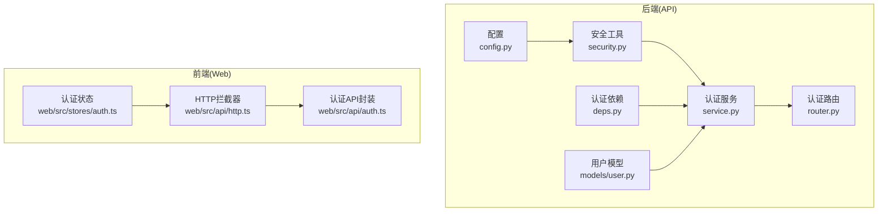
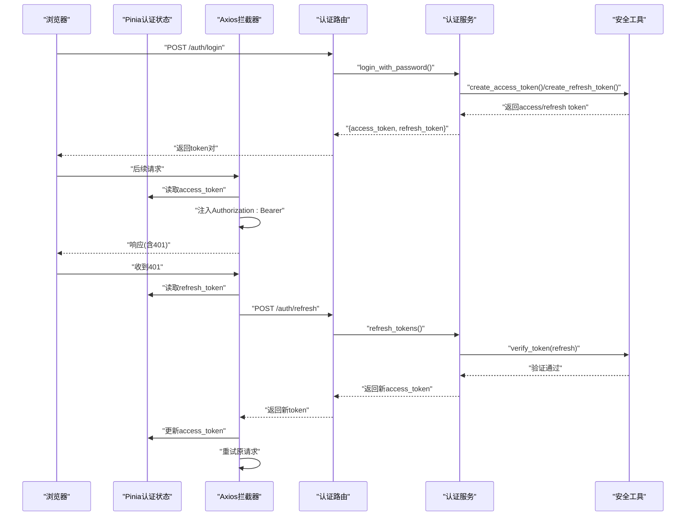
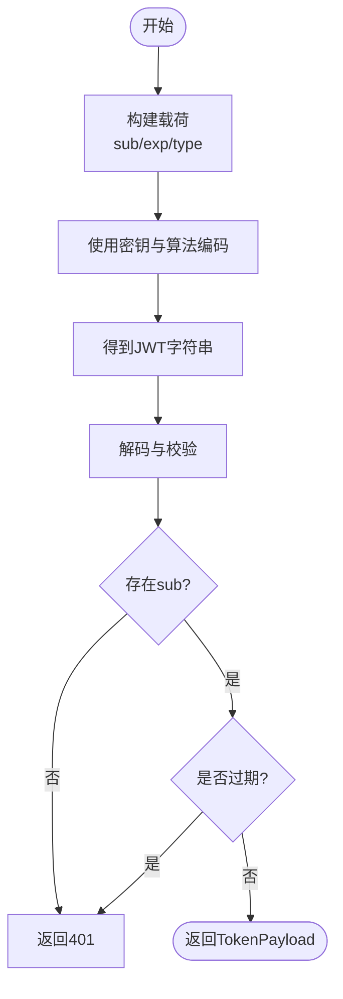
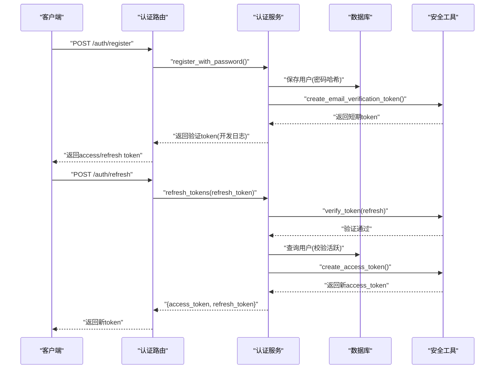
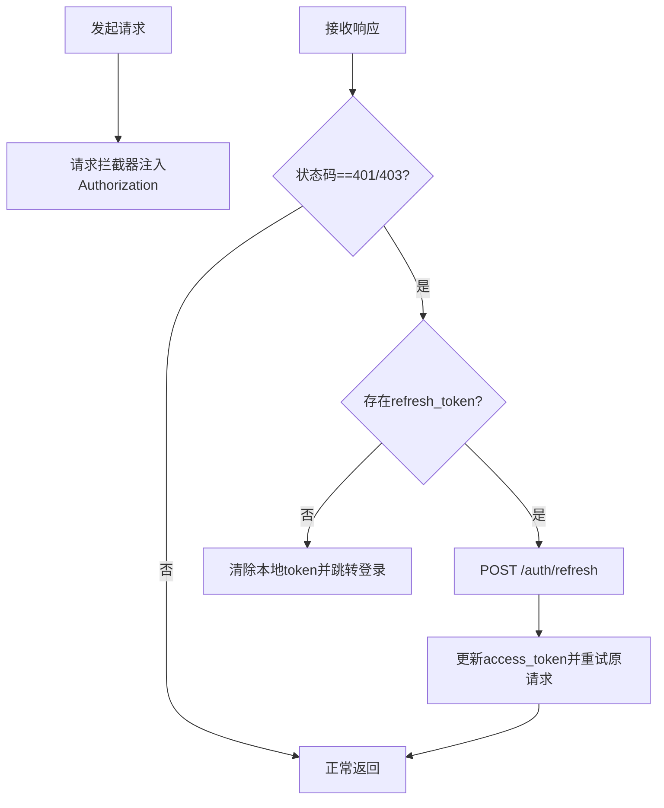
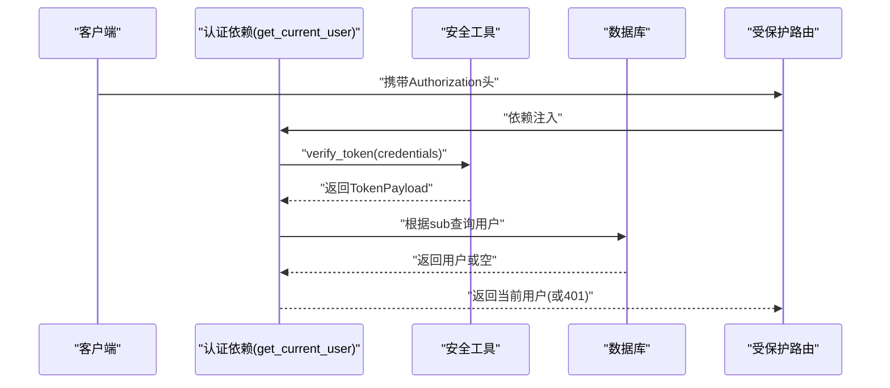
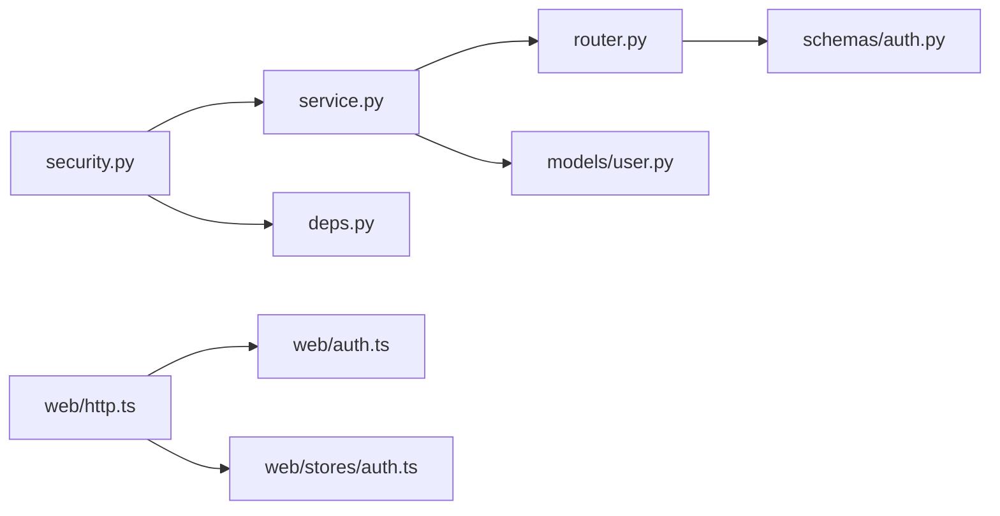

# JWT令牌管理

<cite>
**本文引用的文件**
- [apps/api/app/core/security.py](file://apps/api/app/core/security.py)
- [apps/api/app/core/config.py](file://apps/api/app/core/config.py)
- [apps/api/app/modules/auth/service.py](file://apps/api/app/modules/auth/service.py)
- [apps/api/app/modules/auth/router.py](file://apps/api/app/modules/auth/router.py)
- [apps/api/app/schemas/auth.py](file://apps/api/app/schemas/auth.py)
- [apps/api/app/deps.py](file://apps/api/app/deps.py)
- [apps/api/app/models/user.py](file://apps/api/app/models/user.py)
- [apps/api/tests/test_security.py](file://apps/api/tests/test_security.py)
- [apps/api/tests/test_auth.py](file://apps/api/tests/test_auth.py)
- [apps/web/src/api/http.ts](file://apps/web/src/api/http.ts)
- [apps/web/src/api/auth.ts](file://apps/web/src/api/auth.ts)
- [apps/web/src/stores/auth.ts](file://apps/web/src/stores/auth.ts)
- [openspec/changes/add-user-auth/spec.md](file://openspec/changes/add-user-auth/spec.md)
- [openspec/changes/add-user-auth/design.md](file://openspec/changes/add-user-auth/design.md)
</cite>

## 目录
1. [简介](#简介)
2. [项目结构](#项目结构)
3. [核心组件](#核心组件)
4. [架构总览](#架构总览)
5. [详细组件分析](#详细组件分析)
6. [依赖关系分析](#依赖关系分析)
7. [性能考量](#性能考量)
8. [故障排查指南](#故障排查指南)
9. [结论](#结论)
10. [附录](#附录)

## 简介
本文件为JWT令牌管理系统的详细技术文档，覆盖令牌生成、验证、刷新机制，以及access token与refresh token的差异与使用场景。文档还解释了令牌载荷结构、过期时间管理、算法配置、编码与解码实现细节，并给出令牌安全存储、传输与验证的最佳实践。最后提供令牌生命周期管理示例与错误处理机制。

## 项目结构
后端采用FastAPI + SQLAlchemy架构，认证模块位于apps/api/app/modules/auth，核心安全工具位于apps/api/app/core/security，配置位于apps/api/app/core/config。前端使用Vue + Pinia + Axios，认证状态与HTTP拦截器位于apps/web/src。

图表来源
- [apps/api/app/core/config.py:1-47](file://apps/api/app/core/config.py#L1-L47)
- [apps/api/app/core/security.py:1-72](file://apps/api/app/core/security.py#L1-L72)
- [apps/api/app/modules/auth/service.py:1-145](file://apps/api/app/modules/auth/service.py#L1-L145)
- [apps/api/app/modules/auth/router.py:1-93](file://apps/api/app/modules/auth/router.py#L1-L93)
- [apps/api/app/deps.py:1-40](file://apps/api/app/deps.py#L1-L40)
- [apps/api/app/models/user.py:1-28](file://apps/api/app/models/user.py#L1-L28)
- [apps/web/src/api/http.ts:1-94](file://apps/web/src/api/http.ts#L1-L94)
- [apps/web/src/api/auth.ts:1-56](file://apps/web/src/api/auth.ts#L1-L56)
- [apps/web/src/stores/auth.ts:1-41](file://apps/web/src/stores/auth.ts#L1-L41)

章节来源
- [apps/api/app/core/config.py:1-47](file://apps/api/app/core/config.py#L1-L47)
- [apps/api/app/core/security.py:1-72](file://apps/api/app/core/security.py#L1-L72)
- [apps/api/app/modules/auth/service.py:1-145](file://apps/api/app/modules/auth/service.py#L1-L145)
- [apps/api/app/modules/auth/router.py:1-93](file://apps/api/app/modules/auth/router.py#L1-L93)
- [apps/api/app/deps.py:1-40](file://apps/api/app/deps.py#L1-L40)
- [apps/api/app/models/user.py:1-28](file://apps/api/app/models/user.py#L1-L28)
- [apps/web/src/api/http.ts:1-94](file://apps/web/src/api/http.ts#L1-L94)
- [apps/web/src/api/auth.ts:1-56](file://apps/web/src/api/auth.ts#L1-L56)
- [apps/web/src/stores/auth.ts:1-41](file://apps/web/src/stores/auth.ts#L1-L41)

## 核心组件
- 令牌载荷与工具
  - TokenPayload：定义令牌子(subject)、过期(exp)、类型(type)字段。
  - 密码哈希：bcrypt上下文，提供hash_password与verify_password。
  - 令牌生成：create_access_token与create_refresh_token，分别设置不同的过期时间与类型。
  - 令牌验证：verify_token，统一解码与校验，异常映射为401。
- 认证服务
  - 注册/登录：返回access_token与refresh_token对。
  - 刷新：使用refresh_token换取新的access_token。
  - 邮箱验证与密码重置：使用短期access_token作为一次性验证令牌。
- 认证依赖
  - get_current_user：从Authorization头解析Bearer Token，校验并加载用户。
- 配置
  - jwt_secret_key、jwt_algorithm、access_token_expire_minutes、refresh_token_expire_days。

章节来源
- [apps/api/app/core/security.py:12-72](file://apps/api/app/core/security.py#L12-L72)
- [apps/api/app/modules/auth/service.py:21-145](file://apps/api/app/modules/auth/service.py#L21-L145)
- [apps/api/app/deps.py:15-33](file://apps/api/app/deps.py#L15-L33)
- [apps/api/app/core/config.py:30-34](file://apps/api/app/core/config.py#L30-L34)

## 架构总览
JWT认证在后端由安全工具与认证服务协作完成，在前端由HTTP拦截器自动注入与刷新令牌。

图表来源
- [apps/api/app/modules/auth/router.py:42-53](file://apps/api/app/modules/auth/router.py#L42-L53)
- [apps/api/app/modules/auth/service.py:50-92](file://apps/api/app/modules/auth/service.py#L50-L92)
- [apps/api/app/core/security.py:32-72](file://apps/api/app/core/security.py#L32-L72)
- [apps/web/src/api/http.ts:37-91](file://apps/web/src/api/http.ts#L37-L91)

## 详细组件分析

### 组件A：令牌生成与验证
- 令牌载荷结构
  - sub：用户唯一标识。
  - exp：UTC时间戳，用于过期控制。
  - type：令牌类型，"access"或"refresh"。
- 生成流程
  - access token：按配置的分钟数过期，type="access"。
  - refresh token：按配置的天数过期，type="refresh"。
- 验证流程
  - 解码并校验签名与算法。
  - 提取sub与type，缺失则401。
  - 过期则401。
  - 其他错误映射为401。

图表来源
- [apps/api/app/core/security.py:32-72](file://apps/api/app/core/security.py#L32-L72)

章节来源
- [apps/api/app/core/security.py:12-72](file://apps/api/app/core/security.py#L12-L72)
- [apps/api/app/core/config.py:30-34](file://apps/api/app/core/config.py#L30-L34)

### 组件B：认证服务与路由
- 注册/登录
  - 注册成功后生成邮箱验证token（短期），随后返回access/refresh token对。
  - 登录成功即返回access/refresh token对。
- 刷新
  - 使用refresh_token调用刷新端点，服务端验证后发放新access_token。
- 邮箱验证与密码重置
  - 使用短期access_token作为一次性令牌，验证通过后更新用户状态或密码。

图表来源
- [apps/api/app/modules/auth/router.py:24-53](file://apps/api/app/modules/auth/router.py#L24-L53)
- [apps/api/app/modules/auth/service.py:27-92](file://apps/api/app/modules/auth/service.py#L27-L92)
- [apps/api/app/core/security.py:32-46](file://apps/api/app/core/security.py#L32-L46)

章节来源
- [apps/api/app/modules/auth/router.py:24-93](file://apps/api/app/modules/auth/router.py#L24-L93)
- [apps/api/app/modules/auth/service.py:27-145](file://apps/api/app/modules/auth/service.py#L27-L145)

### 组件C：前端令牌存储与自动刷新
- 存储
  - 使用localStorage存储access_token与refresh_token。
- 传输
  - 请求拦截器自动在Authorization头注入Bearer token。
- 刷新
  - 响应拦截器捕获401/403，若存在refresh_token则调用刷新接口，更新本地token并重试原请求；否则清空并跳转登录。

图表来源
- [apps/web/src/api/http.ts:10-91](file://apps/web/src/api/http.ts#L10-L91)
- [apps/web/src/stores/auth.ts:6-25](file://apps/web/src/stores/auth.ts#L6-L25)
- [apps/web/src/api/auth.ts:37-43](file://apps/web/src/api/auth.ts#L37-L43)

章节来源
- [apps/web/src/api/http.ts:10-91](file://apps/web/src/api/http.ts#L10-L91)
- [apps/web/src/stores/auth.ts:6-25](file://apps/web/src/stores/auth.ts#L6-L25)
- [apps/web/src/api/auth.ts:37-43](file://apps/web/src/api/auth.ts#L37-L43)

### 组件D：受保护资源访问
- 依赖注入
  - get_current_user从Authorization头提取credentials，调用verify_token解析payload，再根据sub加载用户并校验活跃状态。
- 路由使用
  - 通过Depends(get_current_user_id)或get_current_user获取当前用户，实现受保护资源访问。

图表来源
- [apps/api/app/deps.py:15-33](file://apps/api/app/deps.py#L15-L33)
- [apps/api/app/core/security.py:49-72](file://apps/api/app/core/security.py#L49-L72)
- [apps/api/app/models/user.py:12-28](file://apps/api/app/models/user.py#L12-L28)

章节来源
- [apps/api/app/deps.py:15-33](file://apps/api/app/deps.py#L15-L33)
- [apps/api/app/models/user.py:12-28](file://apps/api/app/models/user.py#L12-L28)

## 依赖关系分析
- 后端模块耦合
  - security.py被service.py与deps.py共同依赖，提供统一的令牌生成与验证能力。
  - service.py依赖security.py与models.user，负责业务流程编排。
  - router.py依赖service.py与schemas，暴露REST接口。
  - deps.py依赖security.py与models.user，提供受保护路由的用户解析。
- 前端模块耦合
  - http.ts依赖store与auth.ts，实现自动注入与刷新。
  - auth.ts封装API调用，store管理令牌状态。

图表来源
- [apps/api/app/core/security.py:1-72](file://apps/api/app/core/security.py#L1-L72)
- [apps/api/app/modules/auth/service.py:1-145](file://apps/api/app/modules/auth/service.py#L1-L145)
- [apps/api/app/modules/auth/router.py:1-93](file://apps/api/app/modules/auth/router.py#L1-L93)
- [apps/api/app/deps.py:1-40](file://apps/api/app/deps.py#L1-L40)
- [apps/api/app/models/user.py:1-28](file://apps/api/app/models/user.py#L1-L28)
- [apps/web/src/api/http.ts:1-94](file://apps/web/src/api/http.ts#L1-L94)
- [apps/web/src/api/auth.ts:1-56](file://apps/web/src/api/auth.ts#L1-L56)
- [apps/web/src/stores/auth.ts:1-41](file://apps/web/src/stores/auth.ts#L1-L41)

章节来源
- [apps/api/app/core/security.py:1-72](file://apps/api/app/core/security.py#L1-L72)
- [apps/api/app/modules/auth/service.py:1-145](file://apps/api/app/modules/auth/service.py#L1-L145)
- [apps/api/app/modules/auth/router.py:1-93](file://apps/api/app/modules/auth/router.py#L1-L93)
- [apps/api/app/deps.py:1-40](file://apps/api/app/deps.py#L1-L40)
- [apps/api/app/models/user.py:1-28](file://apps/api/app/models/user.py#L1-L28)
- [apps/web/src/api/http.ts:1-94](file://apps/web/src/api/http.ts#L1-L94)
- [apps/web/src/api/auth.ts:1-56](file://apps/web/src/api/auth.ts#L1-L56)
- [apps/web/src/stores/auth.ts:1-41](file://apps/web/src/stores/auth.ts#L1-L41)

## 性能考量
- 令牌生成与验证
  - HS256算法计算开销低，适合高并发场景。
  - bcrypt密码哈希成本可控，建议在注册/修改密码时使用。
- 过期时间
  - access_token短寿命(默认30分钟)，降低泄露风险。
  - refresh_token较长(默认7天)，减少频繁登录。
- 前端刷新
  - 401自动刷新避免用户感知，但需避免并发刷新导致的请求风暴，代码中已通过标志位与队列控制。

## 故障排查指南
- 常见错误与处理
  - 401 Token invalid/Token expired：检查令牌是否过期或被篡改，必要时使用refresh_token刷新。
  - 401 Invalid email or password：确认凭证正确性与账户激活状态。
  - 409 Email already registered：更换邮箱或执行找回密码流程。
  - 400 Invalid or expired verification/reset token：确认邮件中的链接是否过期，重新申请。
- 单元测试参考
  - security模块测试覆盖密码哈希、令牌创建与验证、过期与无效令牌行为。
  - auth模块集成测试覆盖注册/登录/刷新/登出/密码重置等场景。

章节来源
- [apps/api/tests/test_security.py:15-98](file://apps/api/tests/test_security.py#L15-L98)
- [apps/api/tests/test_auth.py:48-191](file://apps/api/tests/test_auth.py#L48-L191)

## 结论
本系统采用JWT实现认证，access token与refresh token职责清晰：前者短寿命保障传输安全，后者长寿命提升用户体验。后端提供统一的令牌生成与验证工具，前端通过HTTP拦截器实现透明的令牌注入与刷新。整体设计简洁、可测试性强，满足MVP阶段的安全与可用性需求。后续可在服务端引入令牌黑名单与更严格的CORS策略以进一步增强安全性。

## 附录

### 令牌生命周期管理示例
- 注册/登录：返回access_token与refresh_token对。
- 访问受保护资源：请求自动注入Authorization头。
- 401自动刷新：拦截器检测401后使用refresh_token换取新access_token并重试。
- 登出：清理本地token，服务端无状态无需撤销。

章节来源
- [apps/api/app/modules/auth/router.py:24-59](file://apps/api/app/modules/auth/router.py#L24-L59)
- [apps/web/src/api/http.ts:37-91](file://apps/web/src/api/http.ts#L37-L91)
- [apps/web/src/stores/auth.ts:19-25](file://apps/web/src/stores/auth.ts#L19-L25)

### 令牌安全最佳实践
- 密钥与算法
  - 使用强随机密钥，避免硬编码；生产环境务必使用安全的密钥管理。
  - HS256算法性能好，确保密钥保密。
- 过期时间
  - access_token尽量短，refresh_token适度延长，结合业务场景调整。
- 存储与传输
  - 前端使用HttpOnly Cookie或更安全的存储方案可进一步降低XSS风险；当前MVP使用localStorage，建议配合CSP与HTTPS。
  - 传输必须使用HTTPS，防止中间人攻击。
- 会话与撤销
  - 当前为无状态JWT，refresh token无服务端撤销；如需更强安全，可引入Redis黑名单或JTI去重。
- 规范遵循
  - 所有受保护端点均需Bearer Token，未提供或过期返回401。

章节来源
- [openspec/changes/add-user-auth/design.md:46-87](file://openspec/changes/add-user-auth/design.md#L46-L87)
- [openspec/changes/add-user-auth/spec.md:64-104](file://openspec/changes/add-user-auth/spec.md#L64-L104)