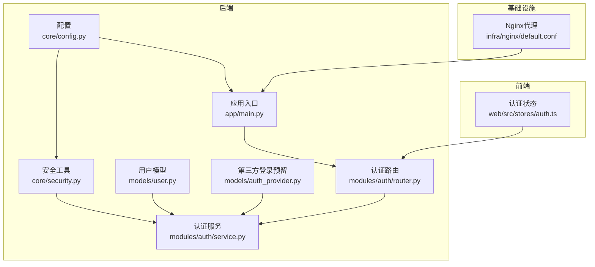
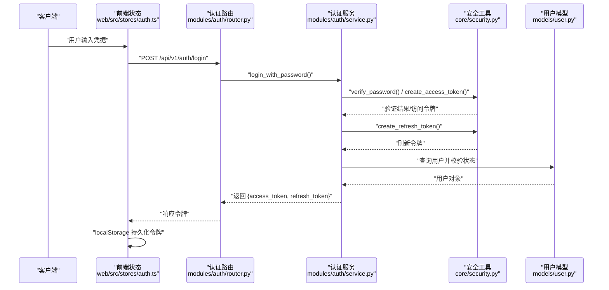
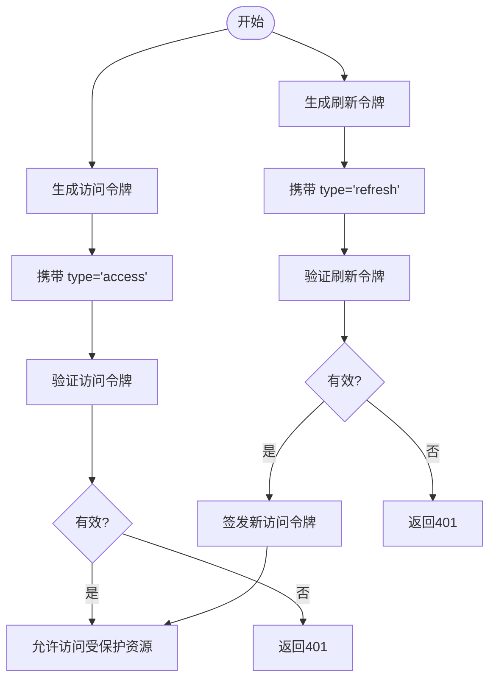
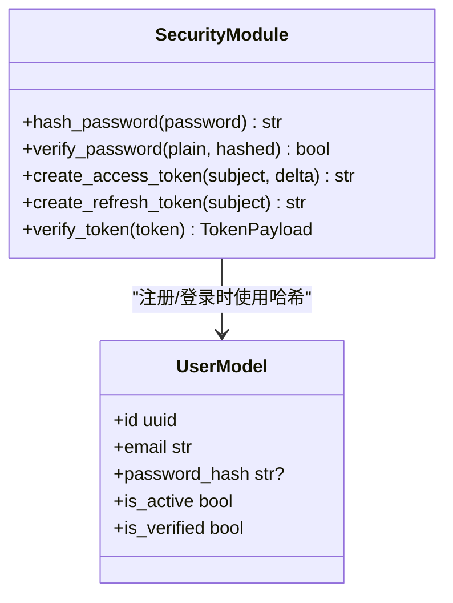
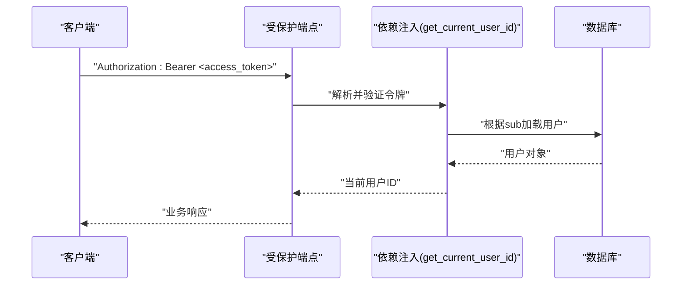
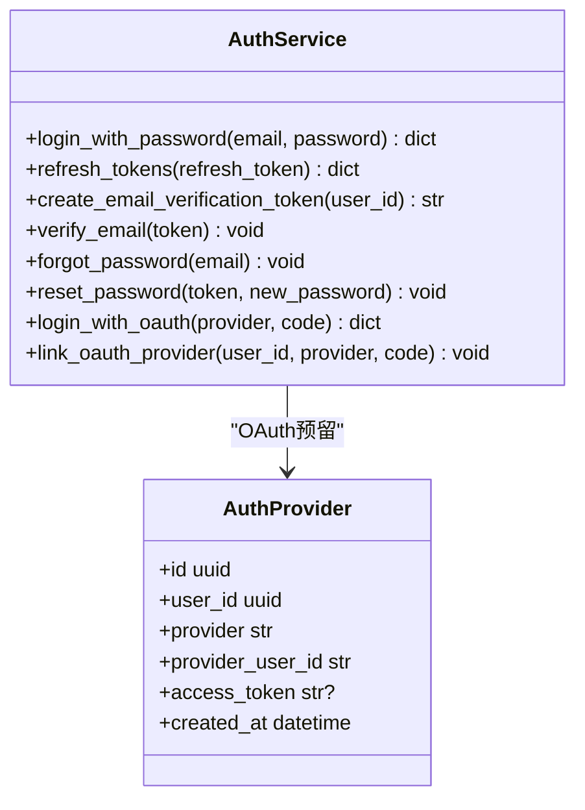
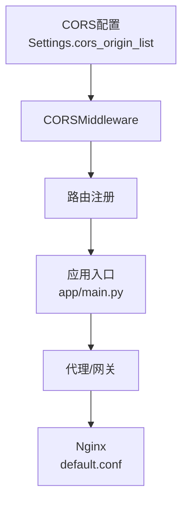
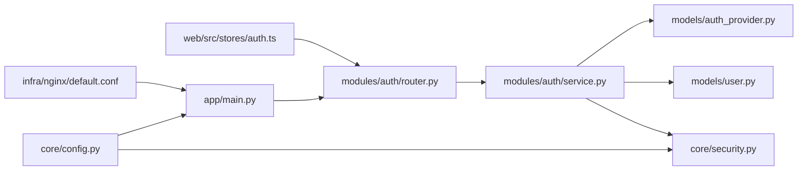

# 安全和认证

<cite>
**本文引用的文件**
- [apps/api/app/core/security.py](file://apps/api/app/core/security.py)
- [apps/api/app/modules/auth/service.py](file://apps/api/app/modules/auth/service.py)
- [apps/api/app/modules/auth/router.py](file://apps/api/app/modules/auth/router.py)
- [apps/api/app/schemas/auth.py](file://apps/api/app/schemas/auth.py)
- [apps/api/app/models/user.py](file://apps/api/app/models/user.py)
- [apps/api/app/models/auth_provider.py](file://apps/api/app/models/auth_provider.py)
- [apps/api/app/main.py](file://apps/api/app/main.py)
- [apps/api/app/core/config.py](file://apps/api/app/core/config.py)
- [apps/web/src/stores/auth.ts](file://apps/web/src/stores/auth.ts)
- [apps/api/tests/test_auth.py](file://apps/api/tests/test_auth.py)
- [apps/api/tests/test_security.py](file://apps/api/tests/test_security.py)
- [infra/nginx/default.conf](file://infra/nginx/default.conf)
- [openspec/changes/add-user-auth/design.md](file://openspec/changes/add-user-auth/design.md)
- [openspec/changes/add-user-auth/proposal.md](file://openspec/changes/add-user-auth/proposal.md)
- [openspec/changes/add-user-auth/specs/user-auth/spec.md](file://openspec/changes/add-user-auth/specs/user-auth/spec.md)
</cite>

## 目录
1. [简介](#简介)
2. [项目结构](#项目结构)
3. [核心组件](#核心组件)
4. [架构总览](#架构总览)
5. [详细组件分析](#详细组件分析)
6. [依赖分析](#依赖分析)
7. [性能考虑](#性能考虑)
8. [故障排查指南](#故障排查指南)
9. [结论](#结论)
10. [附录](#附录)

## 简介
本文件面向“AI摄影教练”的安全与认证子系统，系统性阐述JWT令牌管理机制（生成、验证、刷新）、密码加密策略与安全哈希算法、权限控制与角色管理设计、认证中间件实现细节与自定义认证提供者集成方法，并补充CORS配置、CSRF防护与安全头建议、安全审计与日志记录策略以及常见安全漏洞的防范措施。文档以代码为依据，结合需求规格与设计文档，帮助开发者与运维人员快速理解并安全落地认证体系。

## 项目结构
后端采用FastAPI + SQLAlchemy架构，认证相关代码集中在以下模块：
- 安全工具与配置：core/security.py、core/config.py
- 认证业务：modules/auth/service.py、modules/auth/router.py
- 数据模型：models/user.py、models/auth_provider.py
- 前端状态管理：web/src/stores/auth.ts
- Nginx反向代理：infra/nginx/default.conf
- 测试与规范：tests/test_auth.py、tests/test_security.py、openspec中的设计与规范文档

图表来源
- [apps/api/app/core/config.py:1-47](file://apps/api/app/core/config.py#L1-L47)
- [apps/api/app/core/security.py:1-72](file://apps/api/app/core/security.py#L1-L72)
- [apps/api/app/models/user.py:1-28](file://apps/api/app/models/user.py#L1-L28)
- [apps/api/app/models/auth_provider.py:1-24](file://apps/api/app/models/auth_provider.py#L1-L24)
- [apps/api/app/modules/auth/service.py:1-145](file://apps/api/app/modules/auth/service.py#L1-L145)
- [apps/api/app/modules/auth/router.py:1-93](file://apps/api/app/modules/auth/router.py#L1-L93)
- [apps/api/app/main.py:1-36](file://apps/api/app/main.py#L1-L36)
- [apps/web/src/stores/auth.ts:1-41](file://apps/web/src/stores/auth.ts#L1-L41)
- [infra/nginx/default.conf:1-30](file://infra/nginx/default.conf#L1-L30)

章节来源
- [apps/api/app/main.py:1-36](file://apps/api/app/main.py#L1-L36)
- [apps/api/app/core/config.py:1-47](file://apps/api/app/core/config.py#L1-L47)

## 核心组件
- JWT工具与密码哈希
  - Token载荷结构、访问令牌与刷新令牌生成、令牌验证与过期处理
  - 使用bcrypt进行密码哈希与校验
- 认证服务
  - 邮箱+密码注册、登录、刷新令牌、邮箱验证、密码重置
  - 预留OAuth2提供者扩展点
- 认证路由
  - 提供注册、登录、刷新、登出、邮箱验证、重发验证、忘记密码、重置密码等端点
- 数据模型
  - 用户模型与第三方登录绑定预留表
- 前端状态管理
  - 使用Pinia在本地持久化存储访问令牌与刷新令牌
- CORS与代理
  - FastAPI内置CORS中间件配置；Nginx代理转发与头部透传

章节来源
- [apps/api/app/core/security.py:12-72](file://apps/api/app/core/security.py#L12-L72)
- [apps/api/app/modules/auth/service.py:21-145](file://apps/api/app/modules/auth/service.py#L21-L145)
- [apps/api/app/modules/auth/router.py:21-93](file://apps/api/app/modules/auth/router.py#L21-L93)
- [apps/api/app/models/user.py:12-28](file://apps/api/app/models/user.py#L12-L28)
- [apps/api/app/models/auth_provider.py:12-24](file://apps/api/app/models/auth_provider.py#L12-L24)
- [apps/web/src/stores/auth.ts:5-41](file://apps/web/src/stores/auth.ts#L5-L41)
- [apps/api/app/main.py:13-19](file://apps/api/app/main.py#L13-L19)
- [infra/nginx/default.conf:8-24](file://infra/nginx/default.conf#L8-L24)

## 架构总览
认证系统采用“双令牌”模式：Access Token（短寿命）+ Refresh Token（长寿命）。前端通过Bearer Token访问受保护资源；后端通过中间件解析并验证令牌；密码以bcrypt哈希存储；OAuth2提供者预留扩展。

图表来源
- [apps/api/app/modules/auth/router.py:42-46](file://apps/api/app/modules/auth/router.py#L42-L46)
- [apps/api/app/modules/auth/service.py:50-75](file://apps/api/app/modules/auth/service.py#L50-L75)
- [apps/api/app/core/security.py:27-46](file://apps/api/app/core/security.py#L27-L46)
- [apps/api/app/models/user.py:12-28](file://apps/api/app/models/user.py#L12-L28)
- [apps/web/src/stores/auth.ts:12-17](file://apps/web/src/stores/auth.ts#L12-L17)

## 详细组件分析

### JWT令牌管理机制
- 令牌类型与载荷
  - 访问令牌与刷新令牌均使用HS256算法签名，载荷包含sub（用户标识）、exp（过期时间）、type（令牌类型）
- 生成流程
  - 访问令牌：基于配置的过期分钟数生成，用于短期访问
  - 刷新令牌：基于配置的过期天数生成，用于换取新的访问令牌
- 验证流程
  - 解码并校验签名；校验sub存在性；区分type；过期则抛出401；签名错误或格式错误抛出401
- 刷新流程
  - 使用刷新令牌换取新的访问令牌；用户仍需存在且处于活跃状态

图表来源
- [apps/api/app/core/security.py:32-72](file://apps/api/app/core/security.py#L32-L72)
- [apps/api/app/modules/auth/service.py:77-92](file://apps/api/app/modules/auth/service.py#L77-L92)

章节来源
- [apps/api/app/core/security.py:12-72](file://apps/api/app/core/security.py#L12-L72)
- [apps/api/app/modules/auth/service.py:77-92](file://apps/api/app/modules/auth/service.py#L77-L92)

### 密码加密策略与安全哈希
- 使用bcrypt进行密码哈希，确保抗GPU暴力破解
- 提供哈希与校验函数，注册时对明文密码进行哈希存储
- 用户模型中password_hash字段允许为空，为OAuth用户提供兼容

图表来源
- [apps/api/app/core/security.py:19-29](file://apps/api/app/core/security.py#L19-L29)
- [apps/api/app/models/user.py:17](file://apps/api/app/models/user.py#L17)

章节来源
- [apps/api/app/core/security.py:19-29](file://apps/api/app/core/security.py#L19-L29)
- [apps/api/app/models/user.py:17](file://apps/api/app/models/user.py#L17)

### 权限控制与角色管理
- 当前采用资源所有权模型：所有受保护端点通过依赖注入获取当前用户ID，实现按用户隔离
- 认证层通过Bearer Token替换原有的X-User-Id头，统一认证入口
- 角色管理未实现，当前无需RBAC；如需扩展可在AuthService或依赖注入处增加角色字段

图表来源
- [openspec/changes/add-user-auth/design.md:58-62](file://openspec/changes/add-user-auth/design.md#L58-L62)
- [openspec/changes/add-user-auth/specs/user-auth/spec.md:64-82](file://openspec/changes/add-user-auth/specs/user-auth/spec.md#L64-L82)

章节来源
- [openspec/changes/add-user-auth/design.md:58-62](file://openspec/changes/add-user-auth/design.md#L58-L62)
- [openspec/changes/add-user-auth/proposal.md:16-25](file://openspec/changes/add-user-auth/proposal.md#L16-L25)
- [openspec/changes/add-user-auth/specs/user-auth/spec.md:64-82](file://openspec/changes/add-user-auth/specs/user-auth/spec.md#L64-L82)

### 认证中间件与自定义认证提供者
- 认证中间件
  - FastAPI通过依赖注入实现认证中间件，无需额外中间件类
  - 令牌解析与验证在AuthService中完成，路由层仅依赖注入
- 自定义认证提供者集成
  - 预留AuthProvider表与OAuth相关方法签名，便于后续接入Google/GitHub等第三方登录
  - User.password_hash设为nullable，兼容OAuth用户

图表来源
- [apps/api/app/models/auth_provider.py:12-24](file://apps/api/app/models/auth_provider.py#L12-L24)
- [apps/api/app/modules/auth/service.py:142-145](file://apps/api/app/modules/auth/service.py#L142-L145)

章节来源
- [apps/api/app/models/auth_provider.py:12-24](file://apps/api/app/models/auth_provider.py#L12-L24)
- [apps/api/app/modules/auth/service.py:142-145](file://apps/api/app/modules/auth/service.py#L142-L145)

### CORS配置、CSRF防护与安全头
- CORS
  - FastAPI内置CORSMiddleware，允许配置origins、credentials、methods、headers
  - 配置来源于Settings.cors_origin_list，支持多源白名单
- CSRF防护
  - 当前未实现CSRF中间件；前端使用localStorage存储令牌，建议配合CSP与SameSite Cookie策略（若迁移到Cookie）
- 安全头
  - Nginx代理透传X-Forwarded-Proto等头部，便于后端识别HTTPS
  - 建议在生产环境增加Security Headers（HSTS、X-Content-Type-Options、X-Frame-Options、Referrer-Policy、Content-Security-Policy）

图表来源
- [apps/api/app/core/config.py:25-38](file://apps/api/app/core/config.py#L25-L38)
- [apps/api/app/main.py:13-19](file://apps/api/app/main.py#L13-L19)
- [infra/nginx/default.conf:8-24](file://infra/nginx/default.conf#L8-L24)

章节来源
- [apps/api/app/core/config.py:25-38](file://apps/api/app/core/config.py#L25-L38)
- [apps/api/app/main.py:13-19](file://apps/api/app/main.py#L13-L19)
- [infra/nginx/default.conf:8-24](file://infra/nginx/default.conf#L8-L24)

### 安全审计、日志记录与威胁检测
- 日志记录
  - 忘记密码与邮箱验证在开发模式下记录令牌到日志，便于调试
  - 建议生产环境接入结构化日志与集中式日志平台
- 威胁检测
  - 当前未实现速率限制、IP封禁、黑名单等；建议引入限流中间件与Redis黑名单
  - 建议对敏感操作（登录、重置密码、刷新令牌）增加审计事件

章节来源
- [apps/api/app/modules/auth/service.py:118-122](file://apps/api/app/modules/auth/service.py#L118-L122)
- [openspec/changes/add-user-auth/design.md:83-87](file://openspec/changes/add-user-auth/design.md#L83-L87)

## 依赖分析
- 组件耦合
  - AuthService依赖Security工具与User模型；路由层仅依赖服务层，职责清晰
  - 前端通过Pinia状态管理与后端交互，令牌持久化在localStorage
- 外部依赖
  - FastAPI（路由、依赖注入、HTTP异常）
  - passlib（bcrypt哈希）
  - python-jose（JWT编解码）
  - SQLAlchemy（用户模型）
  - Nginx（反向代理与头部透传）

图表来源
- [apps/api/app/modules/auth/router.py:1-93](file://apps/api/app/modules/auth/router.py#L1-L93)
- [apps/api/app/modules/auth/service.py:1-145](file://apps/api/app/modules/auth/service.py#L1-L145)
- [apps/api/app/core/security.py:1-72](file://apps/api/app/core/security.py#L1-L72)
- [apps/api/app/models/user.py:1-28](file://apps/api/app/models/user.py#L1-L28)
- [apps/api/app/models/auth_provider.py:1-24](file://apps/api/app/models/auth_provider.py#L1-L24)
- [apps/web/src/stores/auth.ts:1-41](file://apps/web/src/stores/auth.ts#L1-L41)
- [apps/api/app/core/config.py:1-47](file://apps/api/app/core/config.py#L1-L47)
- [apps/api/app/main.py:1-36](file://apps/api/app/main.py#L1-L36)
- [infra/nginx/default.conf:1-30](file://infra/nginx/default.conf#L1-L30)

章节来源
- [apps/api/app/modules/auth/router.py:1-93](file://apps/api/app/modules/auth/router.py#L1-L93)
- [apps/api/app/modules/auth/service.py:1-145](file://apps/api/app/modules/auth/service.py#L1-L145)
- [apps/api/app/core/security.py:1-72](file://apps/api/app/core/security.py#L1-L72)
- [apps/api/app/models/user.py:1-28](file://apps/api/app/models/user.py#L1-L28)
- [apps/api/app/models/auth_provider.py:1-24](file://apps/api/app/models/auth_provider.py#L1-L24)
- [apps/web/src/stores/auth.ts:1-41](file://apps/web/src/stores/auth.ts#L1-L41)
- [apps/api/app/core/config.py:1-47](file://apps/api/app/core/config.py#L1-L47)
- [apps/api/app/main.py:1-36](file://apps/api/app/main.py#L1-L36)
- [infra/nginx/default.conf:1-30](file://infra/nginx/default.conf#L1-L30)

## 性能考虑
- JWT验证开销低，适合高并发；建议将密钥与算法参数缓存至Settings
- bcrypt哈希成本适中，注册/登录时计算开销可接受
- 前端localStorage读写开销极低；建议在路由守卫中复用已解析的用户信息
- 建议对频繁的令牌刷新操作增加幂等与去抖策略，避免抖动导致的服务器压力

## 故障排查指南
- 常见问题与定位
  - 401未授权：检查Authorization头格式与令牌有效性；确认令牌未过期
  - 409邮箱已注册：注册时重复邮箱导致冲突
  - 400邮箱验证/重置令牌无效：令牌过期或伪造
  - 401刷新令牌无效：刷新令牌被篡改或用户状态异常
- 测试覆盖
  - 集成测试覆盖注册、登录、刷新、登出、忘记密码/重置密码等场景
  - 单元测试覆盖密码哈希、令牌创建与验证、过期处理

章节来源
- [apps/api/tests/test_auth.py:48-191](file://apps/api/tests/test_auth.py#L48-L191)
- [apps/api/tests/test_security.py:15-98](file://apps/api/tests/test_security.py#L15-L98)

## 结论
本认证体系以JWT为核心，采用双令牌模式平衡安全与体验；bcrypt保障密码存储安全；资源所有权模型满足当前权限需求；OAuth预留扩展点便于后续接入第三方登录。建议在生产环境中完善CORS白名单、安全头、CSRF防护、限流与审计，并逐步引入令牌黑名单与更强的前端安全策略（如CSP、HttpOnly Cookie等）。

## 附录

### 安全最佳实践清单
- 强制HTTPS与安全传输
- 设置严格CSP与安全头
- 使用HttpOnly Cookie（若迁移到Cookie存储）
- 实施速率限制与账户锁定策略
- 定期轮换JWT密钥
- 审计敏感操作日志并监控异常行为
- 对前端输入与令牌进行严格校验

### 常见安全漏洞与防范
- XSS：严格模板/渲染输出、CSP、输入过滤
- CSRF：CSRF中间件或SameSite Cookie
- 点击劫持：X-Frame-Options
- 信息泄露：最小化错误信息、统一错误格式
- 弱密码：强制复杂度、定期更换策略