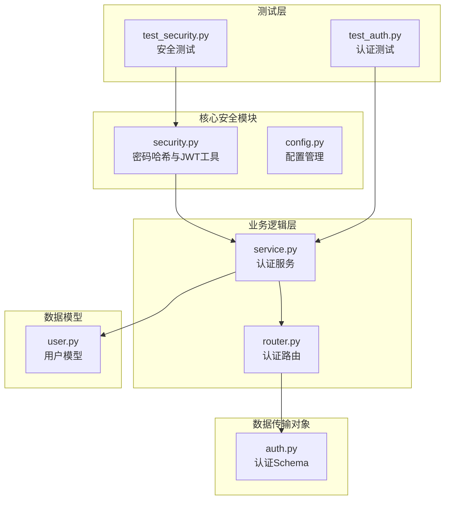
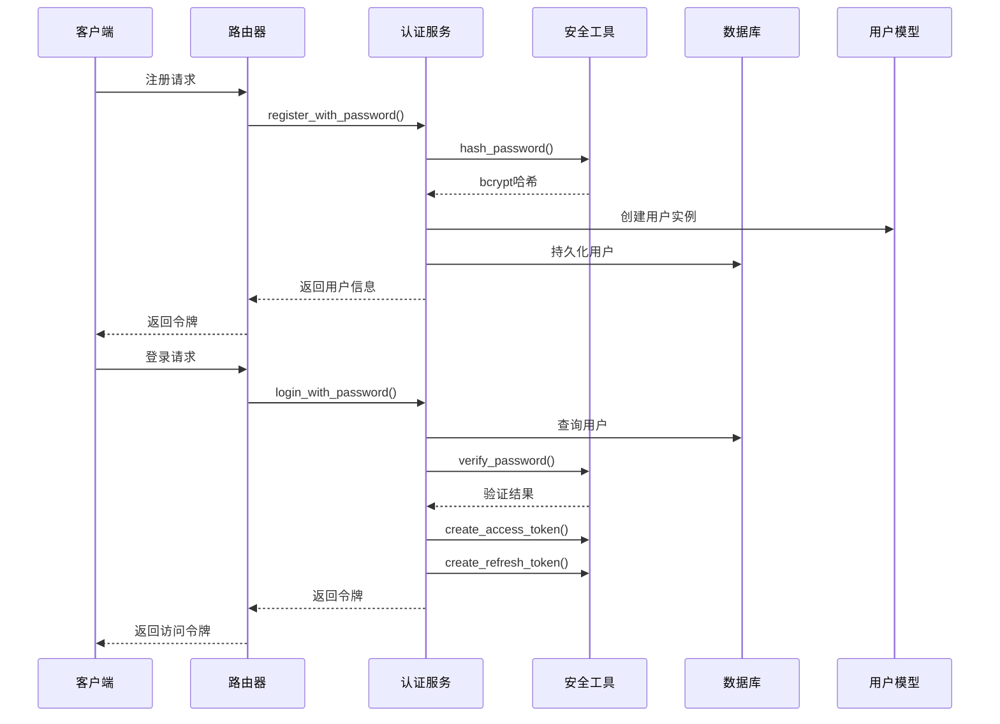
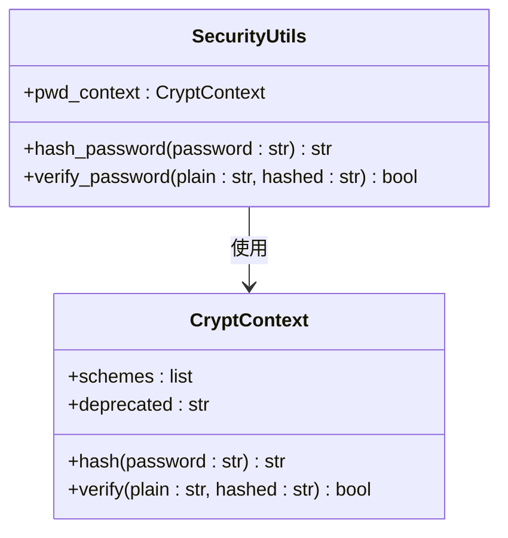
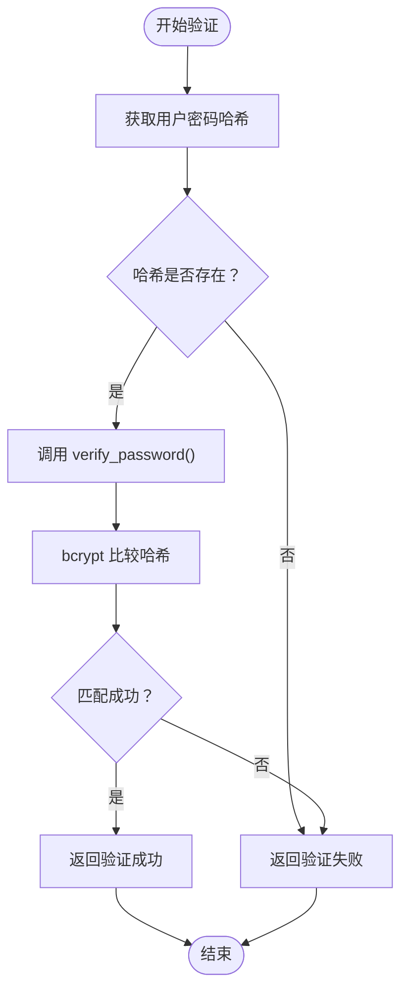
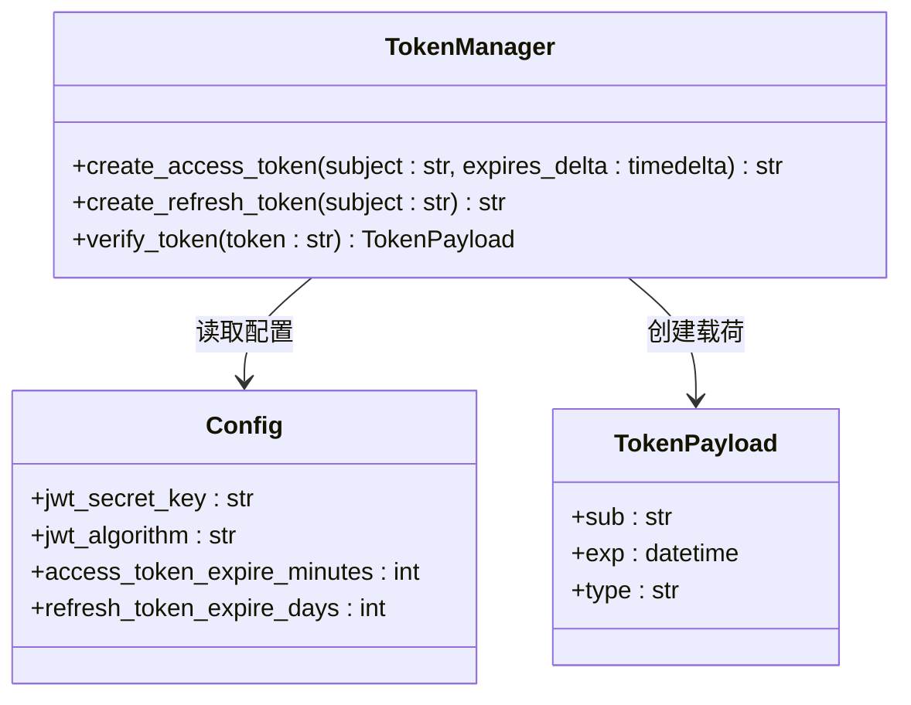
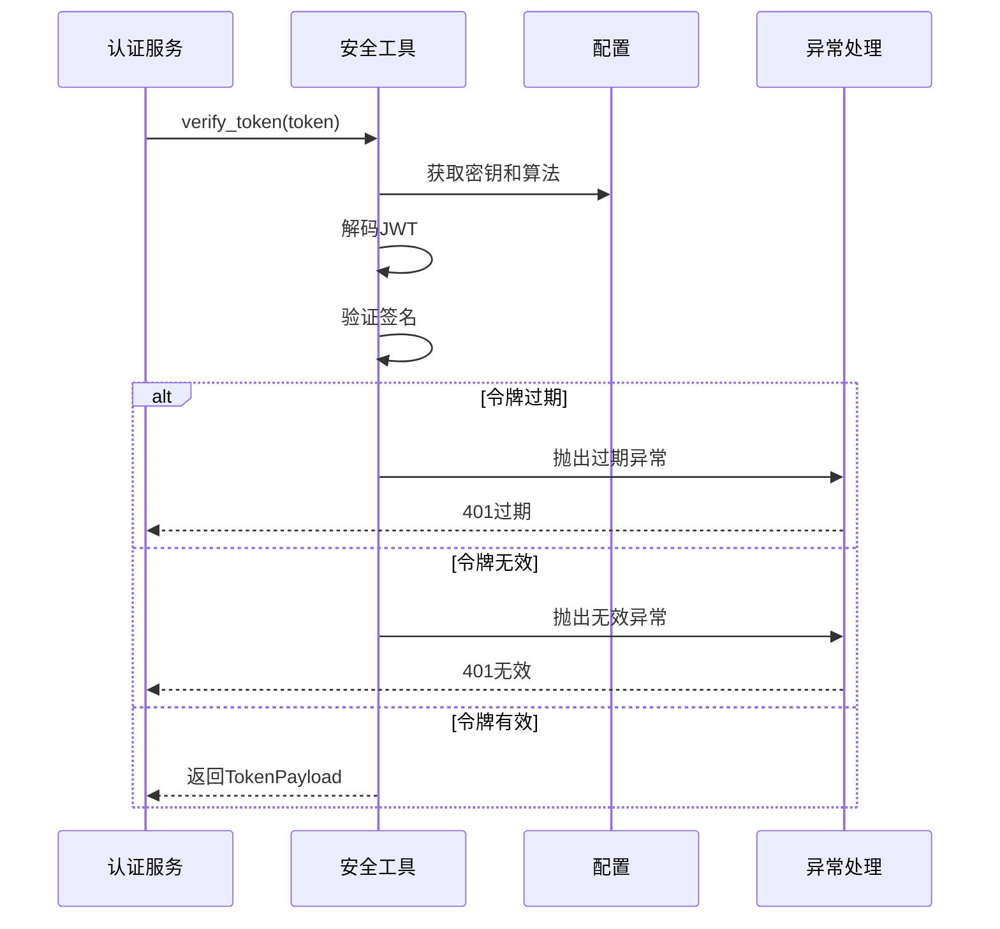
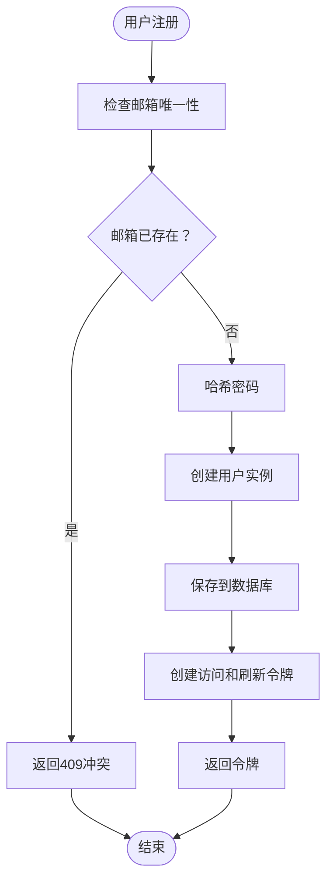
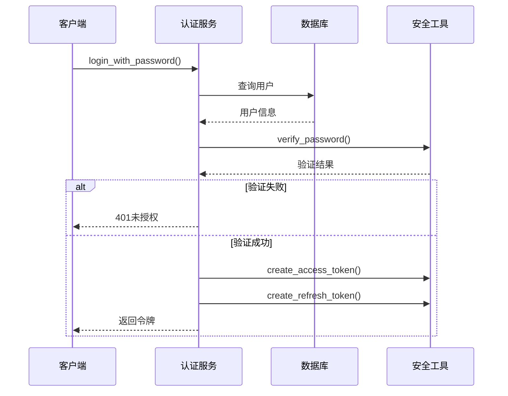
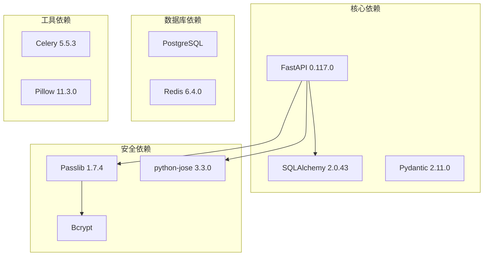
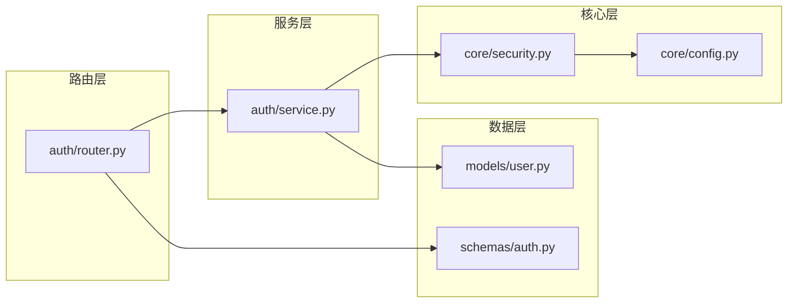

# 密码哈希与验证

<cite>
**本文档引用的文件**
- [security.py](file://apps/api/app/core/security.py)
- [config.py](file://apps/api/app/core/config.py)
- [user.py](file://apps/api/app/models/user.py)
- [service.py](file://apps/api/app/modules/auth/service.py)
- [router.py](file://apps/api/app/modules/auth/router.py)
- [auth.py](file://apps/api/app/schemas/auth.py)
- [test_security.py](file://apps/api/tests/test_security.py)
- [test_auth.py](file://apps/api/tests/test_auth.py)
- [requirements.txt](file://apps/api/requirements.txt)
- [main.py](file://apps/api/app/main.py)
</cite>

## 目录
1. [简介](#简介)
2. [项目结构](#项目结构)
3. [核心组件](#核心组件)
4. [架构概览](#架构概览)
5. [详细组件分析](#详细组件分析)
6. [依赖分析](#依赖分析)
7. [性能考虑](#性能考虑)
8. [故障排除指南](#故障排除指南)
9. [结论](#结论)
10. [附录](#附录)

## 简介

本项目实现了基于 bcrypt 的密码哈希和验证系统，采用现代安全标准确保用户凭据的安全存储和验证。系统集成了 JWT 令牌机制，提供了完整的用户认证、授权和密码管理功能。

该密码哈希系统的核心特性包括：
- 使用 passlib 的 bcrypt 实现进行密码哈希
- 自动盐值生成和管理
- 强大的密码验证机制
- 安全的令牌管理和过期控制
- 完整的密码重置流程

## 项目结构

密码哈希和验证系统在项目中的组织结构如下：

**图表来源**
- [security.py:1-72](file://apps/api/app/core/security.py#L1-L72)
- [service.py:1-145](file://apps/api/app/modules/auth/service.py#L1-L145)
- [router.py:1-93](file://apps/api/app/modules/auth/router.py#L1-L93)

**章节来源**
- [security.py:1-72](file://apps/api/app/core/security.py#L1-L72)
- [service.py:1-145](file://apps/api/app/modules/auth/service.py#L1-L145)
- [router.py:1-93](file://apps/api/app/modules/auth/router.py#L1-L93)

## 核心组件

### 密码哈希组件

密码哈希系统的核心由以下组件构成：

#### 密码上下文配置
系统使用 passlib 的 CryptContext 来管理密码哈希：
- 支持多种哈希算法（当前配置为 bcrypt）
- 自动处理盐值生成
- 向后兼容性支持

#### JWT 令牌管理
系统实现了完整的 JWT 令牌生命周期管理：
- 访问令牌（默认30分钟有效期）
- 刷新令牌（默认7天有效期）
- 邮箱验证令牌（24小时有效期）
- 密码重置令牌（1小时有效期）

#### 用户模型集成
用户模型包含必要的字段用于密码存储和验证：
- `password_hash`: 存储 bcrypt 哈希后的密码
- `is_active`: 用户账户状态控制
- `is_verified`: 邮箱验证状态

**章节来源**
- [security.py:19-29](file://apps/api/app/core/security.py#L19-L29)
- [config.py:30-34](file://apps/api/app/core/config.py#L30-L34)
- [user.py:15-27](file://apps/api/app/models/user.py#L15-L27)

## 架构概览

密码哈希和验证系统的整体架构采用分层设计：

**图表来源**
- [router.py:24-46](file://apps/api/app/modules/auth/router.py#L24-L46)
- [service.py:27-75](file://apps/api/app/modules/auth/service.py#L27-L75)
- [security.py:22-46](file://apps/api/app/core/security.py#L22-L46)

## 详细组件分析

### 密码哈希实现

#### bcrypt 算法配置
系统使用 passlib 的 CryptContext 进行密码哈希：

**图表来源**
- [security.py:19-29](file://apps/api/app/core/security.py#L19-L29)

密码哈希的关键特性：
- **自动盐值生成**: bcrypt 自动为每个密码生成唯一盐值
- **自适应成本因子**: 可根据硬件性能调整计算复杂度
- **向量格式**: 存储完整的 bcrypt 向量，包含成本因子和盐值

#### 密码验证流程

**图表来源**
- [security.py:27-29](file://apps/api/app/core/security.py#L27-L29)
- [service.py:63](file://apps/api/app/modules/auth/service.py#L63)

**章节来源**
- [security.py:22-29](file://apps/api/app/core/security.py#L22-L29)
- [service.py:63](file://apps/api/app/modules/auth/service.py#L63)

### JWT 令牌系统

#### 令牌类型和配置

**图表来源**
- [security.py:12-16](file://apps/api/app/core/security.py#L12-L16)
- [security.py:32-46](file://apps/api/app/core/security.py#L32-L46)
- [config.py:31-34](file://apps/api/app/core/config.py#L31-L34)

#### 令牌验证机制

**图表来源**
- [security.py:49-71](file://apps/api/app/core/security.py#L49-L71)

**章节来源**
- [security.py:32-46](file://apps/api/app/core/security.py#L32-L46)
- [security.py:49-71](file://apps/api/app/core/security.py#L49-L71)
- [config.py:31-34](file://apps/api/app/core/config.py#L31-L34)

### 认证服务实现

#### 注册流程

**图表来源**
- [service.py:27-48](file://apps/api/app/modules/auth/service.py#L27-L48)

#### 登录流程

**图表来源**
- [service.py:50-75](file://apps/api/app/modules/auth/service.py#L50-L75)

**章节来源**
- [service.py:27-75](file://apps/api/app/modules/auth/service.py#L27-L75)

### 密码重置系统

#### 重置流程设计

**图表来源**
- [service.py:116-140](file://apps/api/app/modules/auth/service.py#L116-L140)

**章节来源**
- [service.py:116-140](file://apps/api/app/modules/auth/service.py#L116-L140)

## 依赖分析

### 外部依赖关系

系统依赖的关键外部库：

**图表来源**
- [requirements.txt:1-19](file://apps/api/requirements.txt#L1-L19)

### 内部模块依赖

**图表来源**
- [router.py:1-93](file://apps/api/app/modules/auth/router.py#L1-L93)
- [service.py:1-145](file://apps/api/app/modules/auth/service.py#L1-L145)
- [security.py:1-72](file://apps/api/app/core/security.py#L1-L72)

**章节来源**
- [requirements.txt:1-19](file://apps/api/requirements.txt#L1-L19)
- [router.py:1-93](file://apps/api/app/modules/auth/router.py#L1-L93)
- [service.py:1-145](file://apps/api/app/modules/auth/service.py#L1-L145)

## 性能考虑

### bcrypt 性能优化

#### 成本因子调优
- **生产环境建议**: 将 bcrypt 成本因子设置为 12-14
- **开发环境建议**: 设置为 8-10 以提高开发效率
- **性能监控**: 定期监控密码哈希处理时间

#### 缓存策略
- **令牌缓存**: 使用 Redis 缓存频繁访问的令牌
- **用户会话**: 实现会话缓存减少数据库查询
- **配置缓存**: 使用 LRU 缓存配置信息

### 数据库优化

#### 索引优化
- 为 `users.email` 字段建立唯一索引
- 为 `users.password_hash` 字段建立索引
- 为 `users.created_at` 字段建立索引

#### 查询优化
- 使用批量操作减少数据库往返
- 实现连接池管理
- 优化事务处理

### 安全考虑

#### 密码策略
- **最小长度**: 至少 8 个字符
- **复杂性要求**: 包含大小写字母、数字和特殊字符
- **历史密码**: 禁止重复使用最近 5 个密码
- **锁定机制**: 连续 5 次失败后锁定账户 30 分钟

#### 令牌安全
- **随机性**: 使用 cryptographically secure random
- **过期时间**: 最小化令牌有效期
- **刷新令牌**: 实现安全的刷新令牌轮换
- **传输安全**: 仅通过 HTTPS 传输令牌

## 故障排除指南

### 常见问题诊断

#### 密码哈希问题
- **问题**: 密码无法验证
  - **原因**: 数据库中存储的密码哈希损坏
  - **解决方案**: 重新设置密码或检查数据库迁移

- **问题**: 新密码无法登录
  - **原因**: 密码哈希更新失败
  - **解决方案**: 检查数据库事务和回滚机制

#### 令牌验证问题
- **问题**: 令牌验证总是失败
  - **原因**: JWT 密钥配置错误
  - **解决方案**: 检查 `jwt_secret_key` 和 `jwt_algorithm` 配置

- **问题**: 令牌过期时间不正确
  - **原因**: 时间同步问题
  - **解决方案**: 确保服务器时间同步

### 测试覆盖

#### 单元测试要点
- 密码哈希函数返回非空字符串
- 正确密码验证通过
- 错误密码验证失败
- 不同密码产生不同哈希
- 令牌创建和验证功能正常

#### 集成测试要点
- 注册流程完整测试
- 登录流程测试
- 令牌刷新测试
- 密码重置流程测试

**章节来源**
- [test_security.py:15-98](file://apps/api/tests/test_security.py#L15-L98)
- [test_auth.py:48-191](file://apps/api/tests/test_auth.py#L48-L191)

## 结论

本密码哈希和验证系统实现了现代 Web 应用所需的安全标准，具有以下优势：

### 安全特性
- 基于 bcrypt 的强密码哈希
- 完整的 JWT 令牌生命周期管理
- 多层次的用户身份验证
- 安全的密码重置流程

### 架构优势
- 清晰的分层设计
- 良好的模块分离
- 完善的测试覆盖
- 易于扩展和维护

### 改进建议
- 实现密码强度验证
- 添加多因素认证支持
- 集成安全审计日志
- 实现密码历史管理

## 附录

### 配置参数说明

| 参数名 | 类型 | 默认值 | 描述 |
|--------|------|--------|------|
| `jwt_secret_key` | string | "change-me-in-production" | JWT 加密密钥 |
| `jwt_algorithm` | string | "HS256" | JWT 算法 |
| `access_token_expire_minutes` | int | 30 | 访问令牌有效期（分钟） |
| `refresh_token_expire_days` | int | 7 | 刷新令牌有效期（天） |

### API 端点

| 方法 | 路径 | 功能 | 请求体 | 响应 |
|------|------|------|--------|------|
| POST | `/api/v1/auth/register` | 用户注册 | RegisterRequest | TokenResponse |
| POST | `/api/v1/auth/login` | 用户登录 | LoginRequest | TokenResponse |
| POST | `/api/v1/auth/refresh` | 刷新令牌 | RefreshRequest | TokenResponse |
| POST | `/api/v1/auth/verify-email` | 邮箱验证 | VerifyEmailRequest | JSON |
| POST | `/api/v1/auth/forgot-password` | 忘记密码 | ForgotPasswordRequest | JSON |
| POST | `/api/v1/auth/reset-password` | 重置密码 | ResetPasswordRequest | JSON |

### 安全最佳实践

1. **密钥管理**
   - 使用环境变量存储敏感配置
   - 定期轮换 JWT 密钥
   - 实施密钥备份和恢复策略

2. **密码策略**
   - 强制执行密码复杂性要求
   - 实施密码历史限制
   - 提供密码强度反馈

3. **会话管理**
   - 实现会话超时和自动注销
   - 监控异常登录活动
   - 提供会话管理界面

4. **监控和审计**
   - 记录所有认证相关事件
   - 实施异常检测和告警
   - 定期安全评估和渗透测试