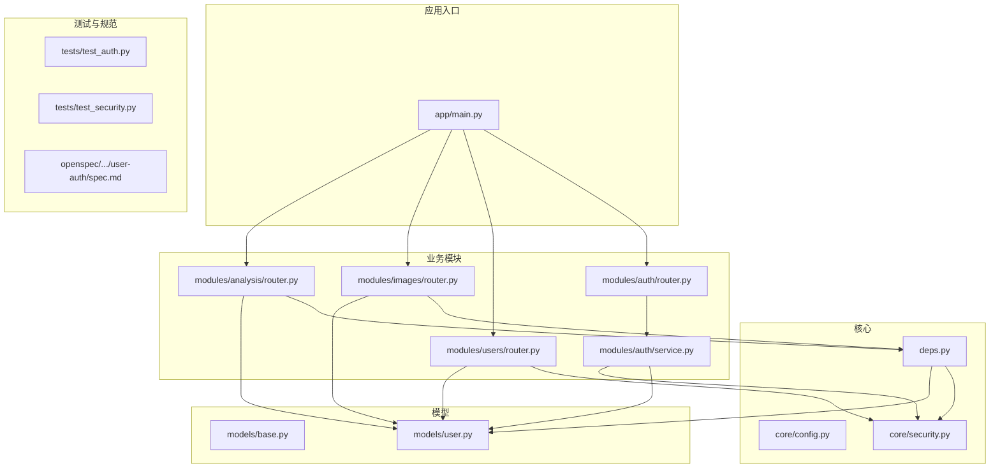
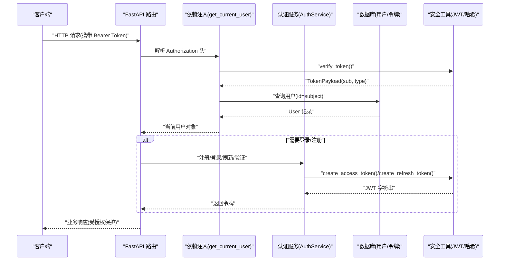
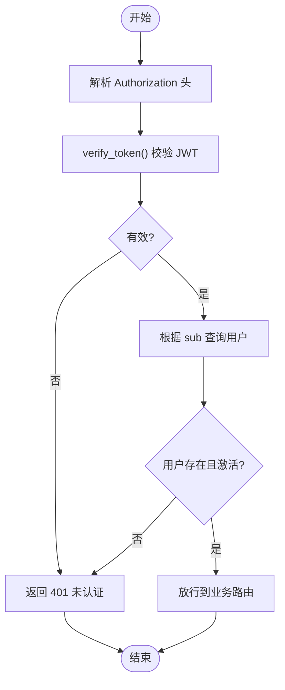
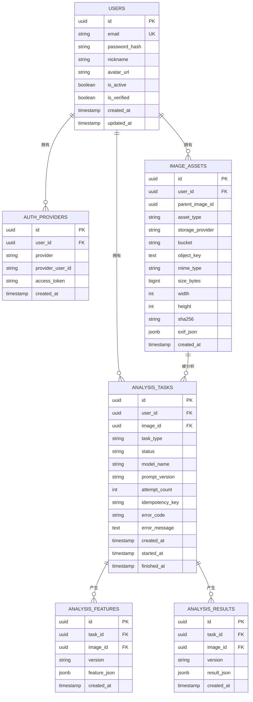
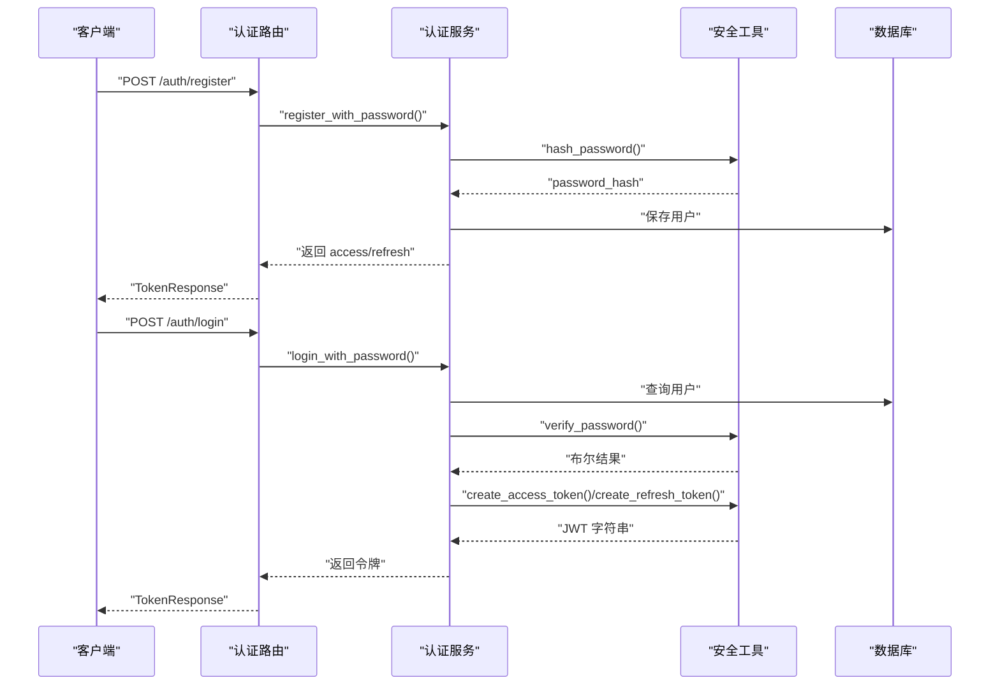
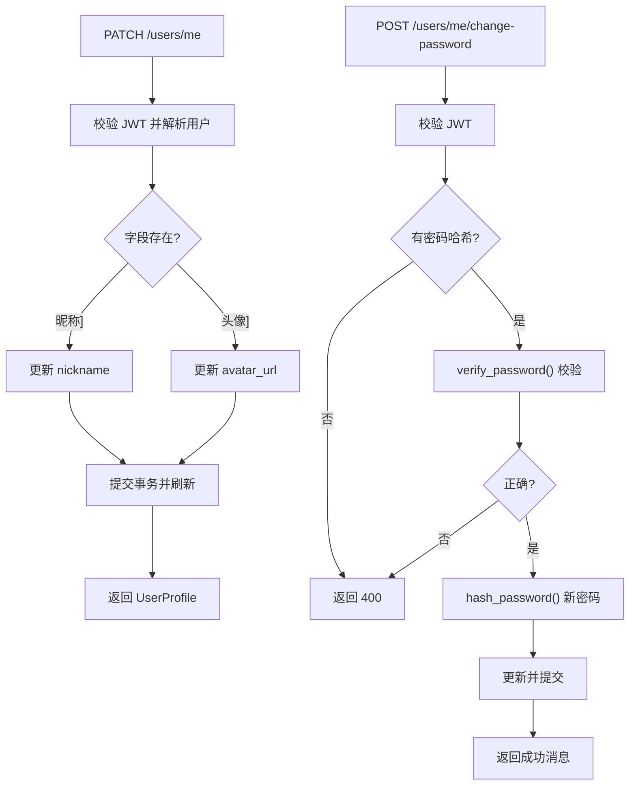
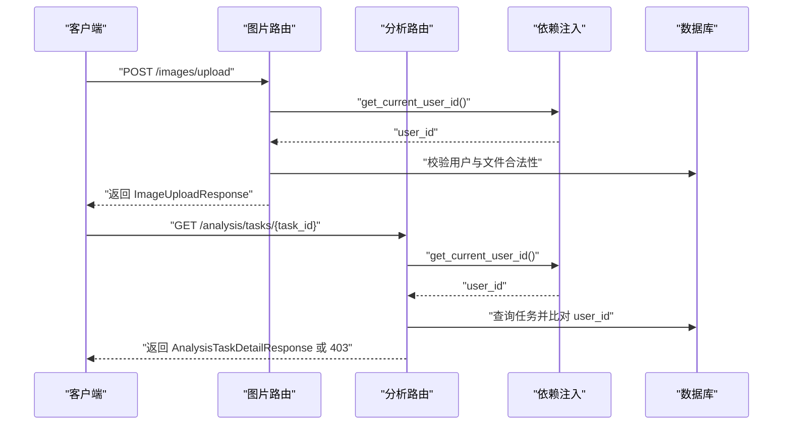
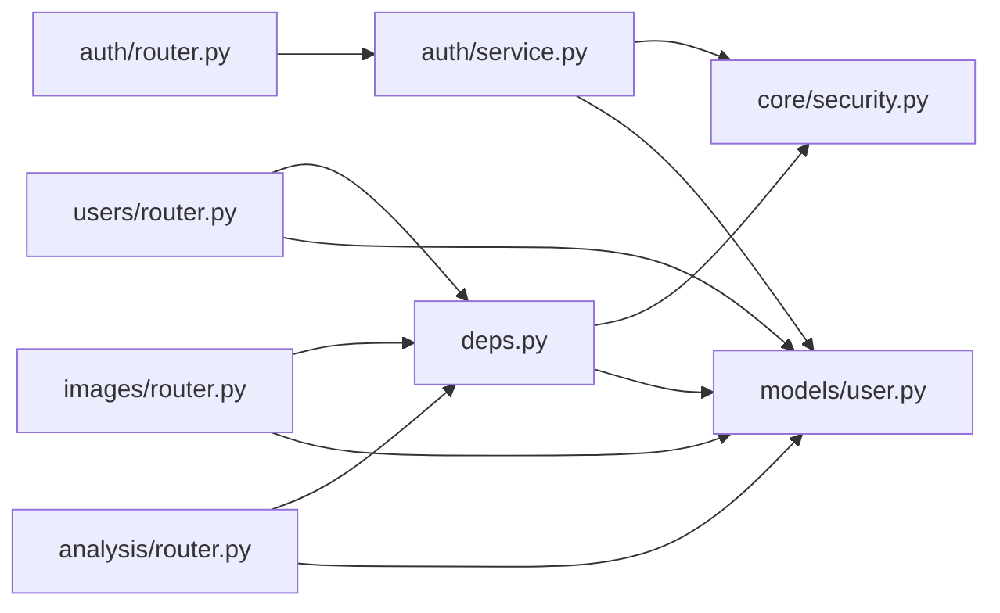

# 权限与角色管理

<cite>
**本文引用的文件**
- [apps/api/app/core/security.py](file://apps/api/app/core/security.py)
- [apps/api/app/core/config.py](file://apps/api/app/core/config.py)
- [apps/api/app/deps.py](file://apps/api/app/deps.py)
- [apps/api/app/models/user.py](file://apps/api/app/models/user.py)
- [apps/api/app/models/base.py](file://apps/api/app/models/base.py)
- [apps/api/app/schemas/user.py](file://apps/api/app/schemas/user.py)
- [apps/api/app/schemas/auth.py](file://apps/api/app/schemas/auth.py)
- [apps/api/app/modules/auth/service.py](file://apps/api/app/modules/auth/service.py)
- [apps/api/app/modules/auth/router.py](file://apps/api/app/modules/auth/router.py)
- [apps/api/app/modules/users/router.py](file://apps/api/app/modules/users/router.py)
- [apps/api/app/modules/analysis/router.py](file://apps/api/app/modules/analysis/router.py)
- [apps/api/app/modules/images/router.py](file://apps/api/app/modules/images/router.py)
- [apps/api/app/migrations/versions/708d1432f72e_initial_schema.py](file://apps/api/app/migrations/versions/708d1432f72e_initial_schema.py)
- [apps/api/app/main.py](file://apps/api/app/main.py)
- [apps/api/tests/test_auth.py](file://apps/api/tests/test_auth.py)
- [apps/api/tests/test_security.py](file://apps/api/tests/test_security.py)
- [openspec/changes/add-user-auth/specs/user-auth/spec.md](file://openspec/changes/add-user-auth/specs/user-auth/spec.md)
</cite>

## 目录
1. [简介](#简介)
2. [项目结构](#项目结构)
3. [核心组件](#核心组件)
4. [架构总览](#架构总览)
5. [详细组件分析](#详细组件分析)
6. [依赖分析](#依赖分析)
7. [性能考虑](#性能考虑)
8. [故障排查指南](#故障排查指南)
9. [结论](#结论)
10. [附录](#附录)

## 简介
本文件面向“权限与角色管理系统”的设计与实现，聚焦以下目标：
- 用户角色定义与权限分配机制
- 基于角色的访问控制（RBAC）实现思路
- 权限检查与授权验证的实现细节
- 用户角色继承与权限组合的管理策略
- 权限缓存与性能优化方案
- 权限配置与动态权限管理
- 完整的权限控制示例与安全审计功能

当前代码库实现了基础的认证与授权基础设施（JWT、密码哈希、用户模型、路由级授权），但尚未实现细粒度的角色与权限模型。本文在现有基础上给出 RBAC 的落地建议与扩展路径。

## 项目结构
后端采用 FastAPI + SQLAlchemy 架构，按功能模块划分：
- 核心模块：安全工具、配置、依赖注入
- 模型层：用户、分析任务、图像资产等
- 业务模块：认证、用户资料、图片上传、分析任务
- 测试与规范：单元测试、集成测试、需求规格

**图表来源**
- [apps/api/app/main.py:1-35](file://apps/api/app/main.py#L1-L35)
- [apps/api/app/core/config.py:1-47](file://apps/api/app/core/config.py#L1-L47)
- [apps/api/app/core/security.py:1-72](file://apps/api/app/core/security.py#L1-L72)
- [apps/api/app/deps.py:1-41](file://apps/api/app/deps.py#L1-L41)
- [apps/api/app/models/base.py:1-5](file://apps/api/app/models/base.py#L1-L5)
- [apps/api/app/models/user.py:1-28](file://apps/api/app/models/user.py#L1-L28)
- [apps/api/app/modules/auth/router.py:1-93](file://apps/api/app/modules/auth/router.py#L1-L93)
- [apps/api/app/modules/auth/service.py:1-145](file://apps/api/app/modules/auth/service.py#L1-L145)
- [apps/api/app/modules/users/router.py:1-71](file://apps/api/app/modules/users/router.py#L1-L71)
- [apps/api/app/modules/images/router.py:1-77](file://apps/api/app/modules/images/router.py#L1-L77)
- [apps/api/app/modules/analysis/router.py:1-151](file://apps/api/app/modules/analysis/router.py#L1-L151)
- [apps/api/tests/test_auth.py:1-190](file://apps/api/tests/test_auth.py#L1-L190)
- [apps/api/tests/test_security.py:1-45](file://apps/api/tests/test_security.py#L1-L45)
- [openspec/changes/add-user-auth/specs/user-auth/spec.md:1-134](file://openspec/changes/add-user-auth/specs/user-auth/spec.md#L1-L134)

**章节来源**
- [apps/api/app/main.py:1-35](file://apps/api/app/main.py#L1-L35)
- [apps/api/app/core/config.py:1-47](file://apps/api/app/core/config.py#L1-L47)

## 核心组件
- 安全工具（JWT、密码哈希、令牌校验）
  - 提供密码哈希与校验、访问/刷新令牌生成与校验、Token 载荷解析
  - 参考路径：[apps/api/app/core/security.py:1-72](file://apps/api/app/core/security.py#L1-L72)
- 依赖注入（当前用户解析）
  - 从 Authorization Bearer 中解析 JWT，查询用户并校验有效性
  - 参考路径：[apps/api/app/deps.py:1-41](file://apps/api/app/deps.py#L1-L41)
- 用户模型
  - 包含邮箱、密码哈希、激活/验证状态、创建/更新时间等字段
  - 参考路径：[apps/api/app/models/user.py:1-28](file://apps/api/app/models/user.py#L1-L28)
- 认证服务与路由
  - 注册、登录、刷新、邮箱验证、忘记/重置密码等
  - 参考路径：[apps/api/app/modules/auth/service.py:1-145](file://apps/api/app/modules/auth/service.py#L1-L145)，[apps/api/app/modules/auth/router.py:1-93](file://apps/api/app/modules/auth/router.py#L1-L93)
- 用户资料路由
  - 获取/更新资料、修改密码
  - 参考路径：[apps/api/app/modules/users/router.py:1-71](file://apps/api/app/modules/users/router.py#L1-L71)
- 图片上传与分析路由
  - 上传图片、创建/查询/重试分析任务；均基于当前用户 ID 授权
  - 参考路径：[apps/api/app/modules/images/router.py:1-77](file://apps/api/app/modules/images/router.py#L1-L77)，[apps/api/app/modules/analysis/router.py:1-151](file://apps/api/app/modules/analysis/router.py#L1-L151)

**章节来源**
- [apps/api/app/core/security.py:1-72](file://apps/api/app/core/security.py#L1-L72)
- [apps/api/app/deps.py:1-41](file://apps/api/app/deps.py#L1-L41)
- [apps/api/app/models/user.py:1-28](file://apps/api/app/models/user.py#L1-L28)
- [apps/api/app/modules/auth/service.py:1-145](file://apps/api/app/modules/auth/service.py#L1-L145)
- [apps/api/app/modules/auth/router.py:1-93](file://apps/api/app/modules/auth/router.py#L1-L93)
- [apps/api/app/modules/users/router.py:1-71](file://apps/api/app/modules/users/router.py#L1-L71)
- [apps/api/app/modules/images/router.py:1-77](file://apps/api/app/modules/images/router.py#L1-L77)
- [apps/api/app/modules/analysis/router.py:1-151](file://apps/api/app/modules/analysis/router.py#L1-L151)

## 架构总览
下图展示从客户端到后端服务的典型调用链路，以及权限控制的关键节点。

**图表来源**
- [apps/api/app/deps.py:15-33](file://apps/api/app/deps.py#L15-L33)
- [apps/api/app/core/security.py:32-71](file://apps/api/app/core/security.py#L32-L71)
- [apps/api/app/modules/auth/service.py:50-92](file://apps/api/app/modules/auth/service.py#L50-L92)
- [apps/api/app/modules/auth/router.py:24-46](file://apps/api/app/modules/auth/router.py#L24-L46)

## 详细组件分析

### 组件一：认证与授权流程（基于 JWT）
- 令牌生成与校验
  - 访问令牌默认 30 分钟过期，刷新令牌 7 天过期
  - 支持刷新换取新访问令牌
- 用户身份解析
  - 从 Authorization Bearer 中提取凭据，解码 JWT，查询用户并校验是否激活
- 路由级授权
  - 图片上传与分析任务接口通过依赖注入获取当前用户 ID，再与资源归属比对实现授权

**图表来源**
- [apps/api/app/deps.py:15-33](file://apps/api/app/deps.py#L15-L33)
- [apps/api/app/core/security.py:49-71](file://apps/api/app/core/security.py#L49-L71)

**章节来源**
- [apps/api/app/core/security.py:32-71](file://apps/api/app/core/security.py#L32-L71)
- [apps/api/app/deps.py:15-33](file://apps/api/app/deps.py#L15-L33)
- [apps/api/app/modules/images/router.py:20-25](file://apps/api/app/modules/images/router.py#L20-L25)
- [apps/api/app/modules/analysis/router.py:45-56](file://apps/api/app/modules/analysis/router.py#L45-L56)

### 组件二：用户模型与数据迁移
- 用户表包含邮箱唯一索引、密码哈希、激活/验证状态等
- 迁移脚本定义了初始表结构，为后续扩展角色/权限表预留空间

**图表来源**
- [apps/api/app/migrations/versions/708d1432f72e_initial_schema.py:25-117](file://apps/api/app/migrations/versions/708d1432f72e_initial_schema.py#L25-L117)
- [apps/api/app/models/user.py:12-28](file://apps/api/app/models/user.py#L12-L28)

**章节来源**
- [apps/api/app/migrations/versions/708d1432f72e_initial_schema.py:22-118](file://apps/api/app/migrations/versions/708d1432f72e_initial_schema.py#L22-L118)
- [apps/api/app/models/user.py:12-28](file://apps/api/app/models/user.py#L12-L28)

### 组件三：认证服务与路由（注册/登录/刷新/验证）
- 注册：邮箱唯一性检查、密码哈希、返回访问/刷新令牌
- 登录：邮箱+密码校验、返回令牌
- 刷新：使用刷新令牌换取新的访问令牌
- 邮箱验证与忘记/重置密码：短期令牌用于验证与恢复

**图表来源**
- [apps/api/app/modules/auth/router.py:24-46](file://apps/api/app/modules/auth/router.py#L24-L46)
- [apps/api/app/modules/auth/service.py:27-75](file://apps/api/app/modules/auth/service.py#L27-L75)
- [apps/api/app/core/security.py:22-46](file://apps/api/app/core/security.py#L22-L46)

**章节来源**
- [apps/api/app/modules/auth/service.py:27-145](file://apps/api/app/modules/auth/service.py#L27-L145)
- [apps/api/app/modules/auth/router.py:24-93](file://apps/api/app/modules/auth/router.py#L24-L93)
- [apps/api/app/schemas/auth.py:5-37](file://apps/api/app/schemas/auth.py#L5-L37)

### 组件四：用户资料与密码修改
- 获取/更新个人资料
- 修改密码：需当前密码正确且账户具备密码哈希

**图表来源**
- [apps/api/app/modules/users/router.py:35-71](file://apps/api/app/modules/users/router.py#L35-L71)
- [apps/api/app/core/security.py:22-29](file://apps/api/app/core/security.py#L22-L29)

**章节来源**
- [apps/api/app/modules/users/router.py:29-71](file://apps/api/app/modules/users/router.py#L29-L71)

### 组件五：图片上传与分析任务（授权示例）
- 图片上传：仅允许当前用户上传至其命名空间
- 分析任务：仅允许任务所属用户访问任务详情与历史

**图表来源**
- [apps/api/app/modules/images/router.py:20-77](file://apps/api/app/modules/images/router.py#L20-L77)
- [apps/api/app/modules/analysis/router.py:76-89](file://apps/api/app/modules/analysis/router.py#L76-L89)
- [apps/api/app/deps.py:36-41](file://apps/api/app/deps.py#L36-L41)

**章节来源**
- [apps/api/app/modules/images/router.py:20-77](file://apps/api/app/modules/images/router.py#L20-L77)
- [apps/api/app/modules/analysis/router.py:45-125](file://apps/api/app/modules/analysis/router.py#L45-L125)

## 依赖分析
- 组件耦合
  - 路由依赖依赖注入模块，依赖注入模块依赖安全工具与数据库
  - 认证服务依赖安全工具与用户模型
- 外部依赖
  - JWT 编解码、密码哈希、数据库 ORM、测试框架
- 潜在循环依赖
  - 当前模块间无直接循环导入；若新增角色/权限模型，需避免服务与路由互相依赖

**图表来源**
- [apps/api/app/modules/auth/router.py:1-93](file://apps/api/app/modules/auth/router.py#L1-L93)
- [apps/api/app/modules/auth/service.py:1-145](file://apps/api/app/modules/auth/service.py#L1-L145)
- [apps/api/app/modules/users/router.py:1-71](file://apps/api/app/modules/users/router.py#L1-L71)
- [apps/api/app/modules/images/router.py:1-77](file://apps/api/app/modules/images/router.py#L1-L77)
- [apps/api/app/modules/analysis/router.py:1-151](file://apps/api/app/modules/analysis/router.py#L1-L151)
- [apps/api/app/deps.py:1-41](file://apps/api/app/deps.py#L1-L41)
- [apps/api/app/core/security.py:1-72](file://apps/api/app/core/security.py#L1-L72)
- [apps/api/app/models/user.py:1-28](file://apps/api/app/models/user.py#L1-L28)

**章节来源**
- [apps/api/app/deps.py:1-41](file://apps/api/app/deps.py#L1-L41)
- [apps/api/app/modules/auth/service.py:1-145](file://apps/api/app/modules/auth/service.py#L1-L145)

## 性能考虑
- 令牌校验
  - 将频繁使用的令牌载荷放入本地缓存（如 Redis），减少数据库查询
  - 对于高并发场景，建议使用内存缓存（LRU）并设置合理 TTL
- 数据库访问
  - 在依赖注入中复用 Session，避免重复创建
  - 对用户查询使用索引（邮箱唯一索引已存在）
- 加密成本
  - 密码哈希使用一次性成本较高的算法，注意批量注册/登录的延迟
- 缓存策略建议
  - 访问令牌：短期缓存 + 失效回调
  - 刷新令牌：仅缓存必要元信息（如用户状态），不缓存完整令牌
  - 用户资料：读多写少，可引入只读副本与缓存

[本节为通用性能建议，不直接分析具体文件，故无“章节来源”]

## 故障排查指南
- 常见错误与定位
  - 401 未认证：检查 Authorization 头是否缺失或格式错误；确认令牌未过期
  - 401 无效令牌：检查密钥与算法配置；核对签发方与接收方一致
  - 403 无权限：检查资源归属与当前用户 ID 是否一致
  - 409 邮箱冲突：注册时邮箱重复
  - 400 验证/重置失败：令牌无效或过期
- 单元与集成测试参考
  - 密码哈希与校验、令牌创建与校验、注册/登录/刷新/重置流程均有测试覆盖
- 审计建议
  - 记录关键事件：登录/登出、密码变更、令牌刷新、资源访问（带用户 ID 与 IP）

**章节来源**
- [apps/api/tests/test_security.py:15-45](file://apps/api/tests/test_security.py#L15-L45)
- [apps/api/tests/test_auth.py:48-190](file://apps/api/tests/test_auth.py#L48-L190)
- [openspec/changes/add-user-auth/specs/user-auth/spec.md:1-134](file://openspec/changes/add-user-auth/specs/user-auth/spec.md#L1-L134)

## 结论
当前系统已建立完善的认证与基础授权能力（JWT、密码哈希、路由级授权）。为满足更复杂的权限管理需求，建议在现有基础上扩展 RBAC 模型：
- 引入角色与权限实体，建立用户-角色、角色-权限关联
- 在依赖注入中增加权限校验中间件
- 实施权限缓存与批量加载策略
- 提供动态权限配置与审计日志

[本节为总结性内容，不直接分析具体文件，故无“章节来源”]

## 附录

### RBAC 扩展设计要点
- 角色与权限
  - 角色：系统角色（如管理员、普通用户）、项目角色（如拥有者、编辑者）
  - 权限：细粒度操作（读取、创建、更新、删除、管理）
- 授权决策
  - 基于用户拥有的角色集合，合并权限集合，判断是否满足资源与动作要求
- 动态权限
  - 支持运行时调整角色与权限，结合缓存与失效策略
- 审计
  - 记录每次授权决策、权限变更、敏感操作

[本节为概念性内容，不直接分析具体文件，故无“章节来源”]