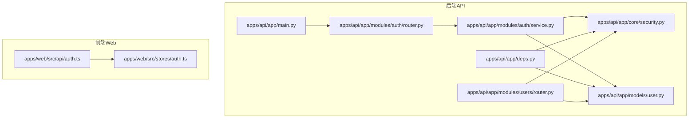
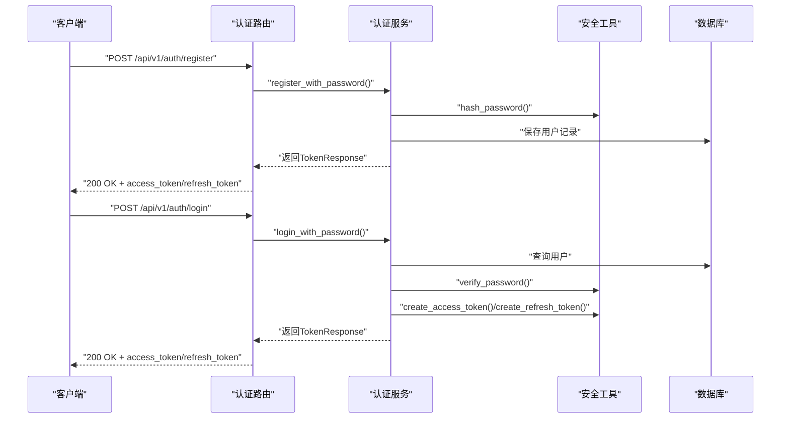
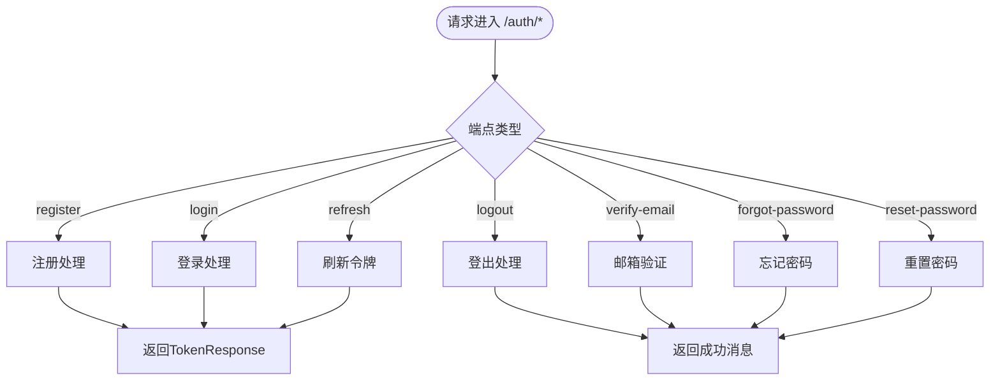
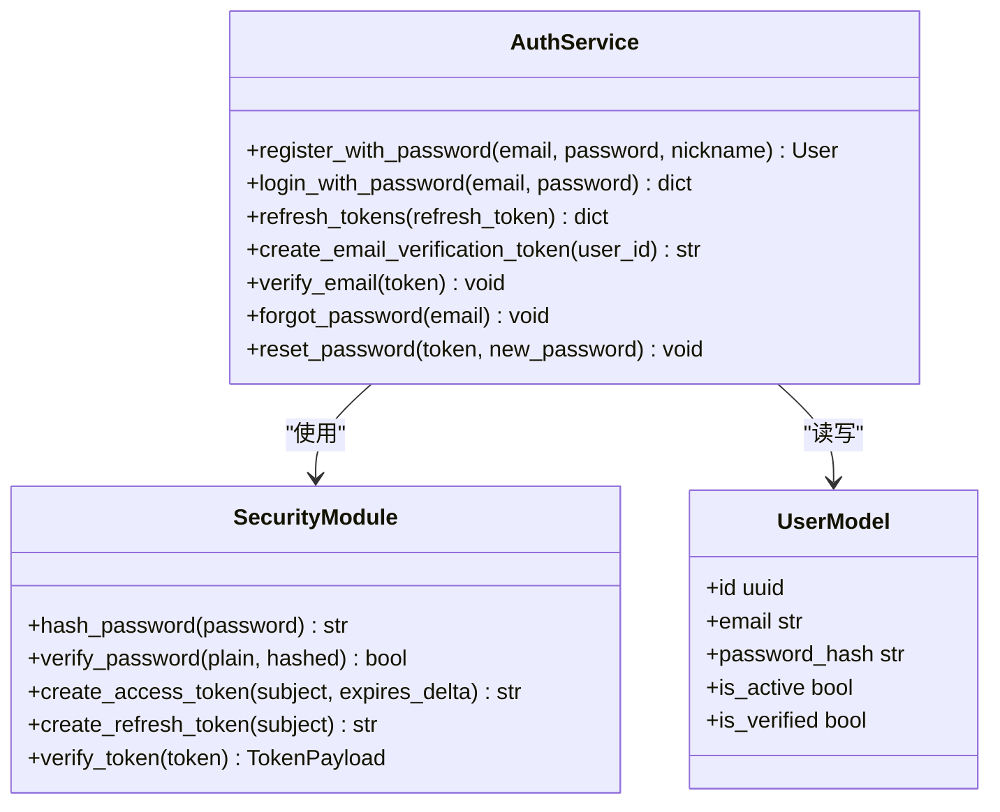
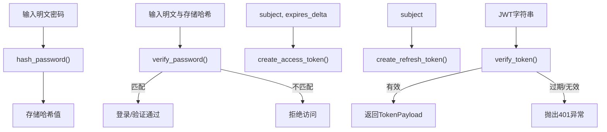
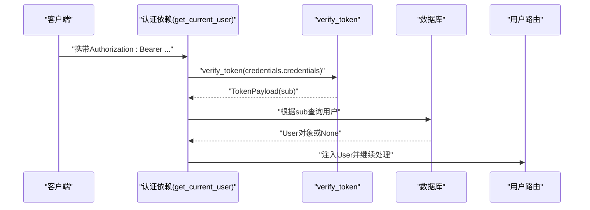
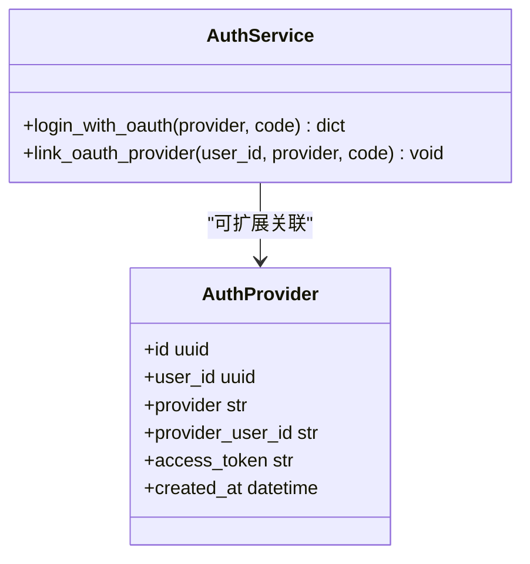
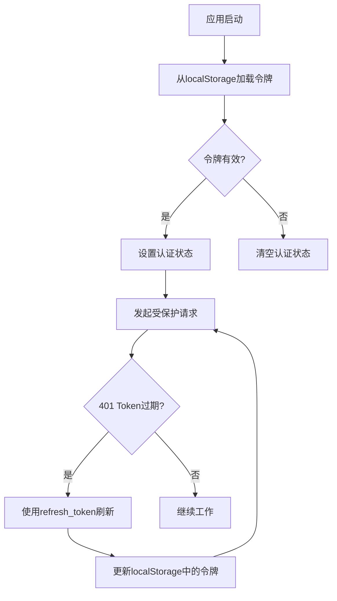
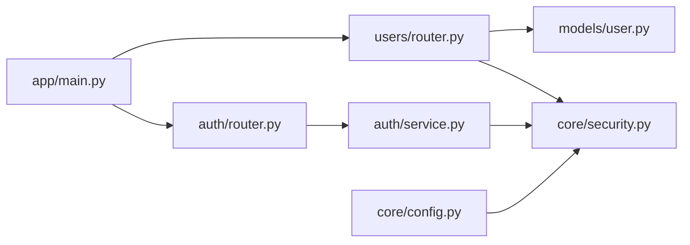
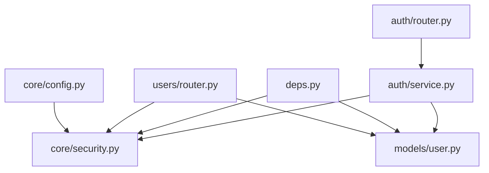

# 认证服务实现

<cite>
**本文档引用的文件**
- [apps/api/app/modules/auth/router.py](file://apps/api/app/modules/auth/router.py)
- [apps/api/app/modules/auth/service.py](file://apps/api/app/modules/auth/service.py)
- [apps/api/app/schemas/auth.py](file://apps/api/app/schemas/auth.py)
- [apps/api/app/core/security.py](file://apps/api/app/core/security.py)
- [apps/api/app/models/user.py](file://apps/api/app/models/user.py)
- [apps/api/app/models/auth_provider.py](file://apps/api/app/models/auth_provider.py)
- [apps/api/app/deps.py](file://apps/api/app/deps.py)
- [apps/api/app/main.py](file://apps/api/app/main.py)
- [apps/api/app/modules/users/router.py](file://apps/api/app/modules/users/router.py)
- [apps/web/src/api/auth.ts](file://apps/web/src/api/auth.ts)
- [apps/web/src/stores/auth.ts](file://apps/web/src/stores/auth.ts)
- [apps/api/app/core/config.py](file://apps/api/app/core/config.py)
- [apps/api/tests/test_auth.py](file://apps/api/tests/test_auth.py)
- [apps/api/tests/test_security.py](file://apps/api/tests/test_security.py)
</cite>

## 目录
1. [简介](#简介)
2. [项目结构](#项目结构)
3. [核心组件](#核心组件)
4. [架构总览](#架构总览)
5. [详细组件分析](#详细组件分析)
6. [依赖关系分析](#依赖关系分析)
7. [性能考虑](#性能考虑)
8. [故障排除指南](#故障排除指南)
9. [结论](#结论)
10. [附录](#附录)

## 简介
本文件系统性阐述认证服务的完整实现，覆盖用户注册、登录、登出、令牌刷新、邮箱验证、密码找回与重置等核心流程；解释认证中间件与请求拦截机制；说明认证提供者扩展接口与自定义认证实现路径；详述认证状态管理与会话保持策略；给出认证异常处理与错误响应机制；并展示认证服务与前端及其它模块的集成方式与最佳实践。

## 项目结构
认证相关代码主要分布在以下位置：
- 后端API层：认证路由、认证服务、安全工具、用户模型、认证依赖注入
- 前端Web层：认证API封装、Pinia状态管理
- 测试层：认证与安全模块的集成与单元测试

**图表来源**
- [apps/api/app/main.py:1-36](file://apps/api/app/main.py#L1-L36)
- [apps/api/app/modules/auth/router.py:1-93](file://apps/api/app/modules/auth/router.py#L1-L93)
- [apps/api/app/modules/auth/service.py:1-145](file://apps/api/app/modules/auth/service.py#L1-L145)
- [apps/api/app/core/security.py:1-72](file://apps/api/app/core/security.py#L1-L72)
- [apps/api/app/models/user.py:1-28](file://apps/api/app/models/user.py#L1-L28)
- [apps/api/app/deps.py:1-41](file://apps/api/app/deps.py#L1-L41)
- [apps/api/app/modules/users/router.py:1-71](file://apps/api/app/modules/users/router.py#L1-L71)
- [apps/web/src/api/auth.ts:1-56](file://apps/web/src/api/auth.ts#L1-L56)
- [apps/web/src/stores/auth.ts:1-41](file://apps/web/src/stores/auth.ts#L1-L41)

**章节来源**
- [apps/api/app/main.py:1-36](file://apps/api/app/main.py#L1-L36)
- [apps/api/app/modules/auth/router.py:1-93](file://apps/api/app/modules/auth/router.py#L1-L93)

## 核心组件
- 认证路由：提供注册、登录、刷新、登出、邮箱验证、重发验证、忘记密码、重置密码等端点
- 认证服务：封装业务逻辑，包括密码哈希、令牌签发与校验、邮箱验证、密码找回与重置
- 安全工具：密码哈希/校验、JWT访问/刷新令牌创建与校验
- 用户模型：存储用户基本信息、激活与验证状态
- 认证依赖：从HTTP Bearer Token解析用户身份
- 前端API与状态：封装认证请求、本地存储令牌与用户信息

**章节来源**
- [apps/api/app/modules/auth/router.py:24-93](file://apps/api/app/modules/auth/router.py#L24-L93)
- [apps/api/app/modules/auth/service.py:21-145](file://apps/api/app/modules/auth/service.py#L21-L145)
- [apps/api/app/core/security.py:22-72](file://apps/api/app/core/security.py#L22-L72)
- [apps/api/app/models/user.py:12-28](file://apps/api/app/models/user.py#L12-L28)
- [apps/api/app/deps.py:15-41](file://apps/api/app/deps.py#L15-L41)
- [apps/web/src/api/auth.ts:29-56](file://apps/web/src/api/auth.ts#L29-L56)
- [apps/web/src/stores/auth.ts:5-41](file://apps/web/src/stores/auth.ts#L5-L41)

## 架构总览
认证服务采用“路由-服务-模型-安全工具”的分层设计，配合FastAPI依赖注入与HTTP Bearer认证，形成可扩展、可测试的认证体系。

**图表来源**
- [apps/api/app/modules/auth/router.py:24-46](file://apps/api/app/modules/auth/router.py#L24-L46)
- [apps/api/app/modules/auth/service.py:27-75](file://apps/api/app/modules/auth/service.py#L27-L75)
- [apps/api/app/core/security.py:22-46](file://apps/api/app/core/security.py#L22-L46)
- [apps/api/app/models/user.py:12-28](file://apps/api/app/models/user.py#L12-L28)

## 详细组件分析

### 认证路由与端点
- 注册：接收邮箱、密码、昵称，检查重复邮箱后创建用户并返回登录令牌
- 登录：校验邮箱与密码，返回access/refresh令牌对
- 刷新：使用refresh_token换取新的access_token
- 登出：返回成功消息（客户端负责清理本地token）
- 邮箱验证：使用短期验证token标记用户为已验证
- 重发验证：预留端点（Task5完成后增加认证依赖）
- 忘记密码：对存在/不存在的邮箱均返回200（不泄露信息）
- 重置密码：使用短期重置token更新密码

**图表来源**
- [apps/api/app/modules/auth/router.py:24-93](file://apps/api/app/modules/auth/router.py#L24-L93)

**章节来源**
- [apps/api/app/modules/auth/router.py:24-93](file://apps/api/app/modules/auth/router.py#L24-L93)

### 认证服务与业务逻辑
- 注册：检查邮箱唯一性，生成UUID，哈希密码，创建用户并返回用户对象
- 登录：查询用户，校验账户激活状态与密码，签发access/refresh令牌
- 刷新：校验refresh_token有效性与用户状态，签发新access_token
- 邮箱验证：校验验证token并更新用户验证状态
- 密码找回：对存在用户生成短期重置token（开发模式记录日志）
- 密码重置：校验重置token并更新密码
- OAuth2预留：提供扩展接口注释，支持未来接入第三方登录

**图表来源**
- [apps/api/app/modules/auth/service.py:21-145](file://apps/api/app/modules/auth/service.py#L21-L145)
- [apps/api/app/core/security.py:22-72](file://apps/api/app/core/security.py#L22-L72)
- [apps/api/app/models/user.py:12-28](file://apps/api/app/models/user.py#L12-L28)

**章节来源**
- [apps/api/app/modules/auth/service.py:27-145](file://apps/api/app/modules/auth/service.py#L27-L145)

### 安全工具与JWT
- 密码哈希：基于bcrypt的密码哈希与校验
- 令牌创建：access_token默认有效期由配置控制；refresh_token长期有效
- 令牌校验：统一的verify_token方法，处理过期与无效场景并抛出401
- Token载荷：包含sub、exp、type字段，区分access与refresh

**图表来源**
- [apps/api/app/core/security.py:22-72](file://apps/api/app/core/security.py#L22-L72)

**章节来源**
- [apps/api/app/core/security.py:22-72](file://apps/api/app/core/security.py#L22-L72)

### 认证中间件与请求拦截
- HTTP Bearer认证：通过HTTPBearer自动从Authorization头提取凭据
- get_current_user：在依赖链中解析Bearer token，校验用户存在与激活状态，注入当前用户
- get_current_user_id：便捷获取当前用户ID
- 用户资料路由：在Task5完成后统一迁移到deps.py的认证依赖

**图表来源**
- [apps/api/app/deps.py:15-41](file://apps/api/app/deps.py#L15-L41)
- [apps/api/app/core/security.py:49-72](file://apps/api/app/core/security.py#L49-L72)
- [apps/api/app/models/user.py:12-28](file://apps/api/app/models/user.py#L12-L28)

**章节来源**
- [apps/api/app/deps.py:15-41](file://apps/api/app/deps.py#L15-L41)

### 认证提供者扩展接口与自定义实现
- AuthProvider模型：预留第三方登录绑定记录，包含provider、provider_user_id、access_token等字段
- 扩展思路：AuthService可新增OAuth2登录方法，结合AuthProvider完成第三方账号绑定与登录
- 接口预留：AuthService中提供OAuth2相关方法注释，便于后续实现

**图表来源**
- [apps/api/app/models/auth_provider.py:12-24](file://apps/api/app/models/auth_provider.py#L12-L24)
- [apps/api/app/modules/auth/service.py:142-145](file://apps/api/app/modules/auth/service.py#L142-L145)

**章节来源**
- [apps/api/app/models/auth_provider.py:12-24](file://apps/api/app/models/auth_provider.py#L12-L24)
- [apps/api/app/modules/auth/service.py:142-145](file://apps/api/app/modules/auth/service.py#L142-L145)

### 认证状态管理与会话保持
- 前端状态：使用Pinia store持久化access_token与refresh_token至localStorage
- 认证状态：通过accessToken是否存在判断登录态
- 令牌轮换：前端在access_token过期时使用refresh_token刷新
- 用户资料：通过/users/me端点获取当前用户信息并缓存

**图表来源**
- [apps/web/src/stores/auth.ts:5-41](file://apps/web/src/stores/auth.ts#L5-L41)
- [apps/web/src/api/auth.ts:29-56](file://apps/web/src/api/auth.ts#L29-L56)

**章节来源**
- [apps/web/src/stores/auth.ts:5-41](file://apps/web/src/stores/auth.ts#L5-L41)
- [apps/web/src/api/auth.ts:29-56](file://apps/web/src/api/auth.ts#L29-L56)

### 认证异常处理与错误响应
- 400：无效或过期的验证/重置token
- 401：无效邮箱/密码、账户未激活、无效或过期token
- 409：注册时邮箱已存在
- 422：请求参数校验失败（如邮箱格式、密码长度）
- 400：OAuth-only账户无法修改密码
- 忘记密码：对不存在邮箱也返回200，避免信息泄露

**章节来源**
- [apps/api/app/modules/auth/service.py:32-47](file://apps/api/app/modules/auth/service.py#L32-L47)
- [apps/api/app/modules/auth/service.py:54-67](file://apps/api/app/modules/auth/service.py#L54-L67)
- [apps/api/app/modules/auth/service.py:102-114](file://apps/api/app/modules/auth/service.py#L102-L114)
- [apps/api/app/modules/auth/service.py:126-140](file://apps/api/app/modules/auth/service.py#L126-L140)
- [apps/api/app/modules/users/router.py:58-67](file://apps/api/app/modules/users/router.py#L58-L67)
- [apps/api/tests/test_auth.py:63-90](file://apps/api/tests/test_auth.py#L63-L90)
- [apps/api/tests/test_auth.py:109-127](file://apps/api/tests/test_auth.py#L109-L127)
- [apps/api/tests/test_auth.py:146-151](file://apps/api/tests/test_auth.py#L146-L151)
- [apps/api/tests/test_auth.py:184-190](file://apps/api/tests/test_auth.py#L184-L190)

### 认证服务与其他模块的集成
- 主应用：在startup初始化数据库，并挂载各模块路由
- 用户模块：提供/users/me等受保护端点，依赖认证中间件
- 配置模块：集中管理JWT密钥、算法与过期时间

**图表来源**
- [apps/api/app/main.py:21-24](file://apps/api/app/main.py#L21-L24)
- [apps/api/app/modules/auth/router.py:1-21](file://apps/api/app/modules/auth/router.py#L1-L21)
- [apps/api/app/modules/users/router.py:1-14](file://apps/api/app/modules/users/router.py#L1-L14)
- [apps/api/app/modules/auth/service.py:9-16](file://apps/api/app/modules/auth/service.py#L9-L16)
- [apps/api/app/core/security.py:9](file://apps/api/app/core/security.py#L9)
- [apps/api/app/models/user.py:12-28](file://apps/api/app/models/user.py#L12-L28)
- [apps/api/app/core/config.py:30-34](file://apps/api/app/core/config.py#L30-L34)

**章节来源**
- [apps/api/app/main.py:21-24](file://apps/api/app/main.py#L21-L24)
- [apps/api/app/modules/users/router.py:17-26](file://apps/api/app/modules/users/router.py#L17-L26)
- [apps/api/app/core/config.py:30-34](file://apps/api/app/core/config.py#L30-L34)

### 认证API使用示例与最佳实践
- 注册：提交邮箱、密码、昵称；成功后获得access_token与refresh_token
- 登录：提交邮箱与密码；成功后获得access_token与refresh_token
- 刷新：使用refresh_token换取新的access_token
- 登出：调用登出端点；客户端需删除本地令牌
- 获取资料：携带Bearer token调用/users/me
- 修改密码：仅适用于有密码的账户，需提供当前密码与新密码

最佳实践：
- 生产环境务必更换JWT密钥与算法配置
- 前端严格区分令牌存储与使用，避免XSS与CSRF风险
- 刷新令牌用于延长会话，访问令牌用于短期授权
- 忘记密码端点返回统一状态，避免泄露邮箱存在性

**章节来源**
- [apps/web/src/api/auth.ts:29-56](file://apps/web/src/api/auth.ts#L29-L56)
- [apps/api/app/modules/auth/router.py:24-93](file://apps/api/app/modules/auth/router.py#L24-L93)
- [apps/api/app/modules/users/router.py:29-71](file://apps/api/app/modules/users/router.py#L29-L71)
- [apps/api/tests/test_auth.py:51-90](file://apps/api/tests/test_auth.py#L51-L90)
- [apps/api/tests/test_auth.py:95-127](file://apps/api/tests/test_auth.py#L95-L127)
- [apps/api/tests/test_auth.py:133-151](file://apps/api/tests/test_auth.py#L133-L151)

## 依赖关系分析
- 组件内聚：认证路由依赖认证服务；认证服务依赖安全工具与用户模型
- 外部依赖：FastAPI、SQLAlchemy、passlib、python-jose
- 循环依赖：未发现循环导入
- 配置耦合：JWT密钥、算法与过期时间集中于配置模块

**图表来源**
- [apps/api/app/modules/auth/router.py:7-8](file://apps/api/app/modules/auth/router.py#L7-L8)
- [apps/api/app/modules/auth/service.py:9-16](file://apps/api/app/modules/auth/service.py#L9-L16)
- [apps/api/app/core/security.py:9](file://apps/api/app/core/security.py#L9)
- [apps/api/app/models/user.py:9](file://apps/api/app/models/user.py#L9)
- [apps/api/app/deps.py:8-10](file://apps/api/app/deps.py#L8-L10)
- [apps/api/app/modules/users/router.py:8-11](file://apps/api/app/modules/users/router.py#L8-L11)
- [apps/api/app/core/config.py:30-34](file://apps/api/app/core/config.py#L30-L34)

**章节来源**
- [apps/api/app/modules/auth/router.py:7-8](file://apps/api/app/modules/auth/router.py#L7-L8)
- [apps/api/app/modules/auth/service.py:9-16](file://apps/api/app/modules/auth/service.py#L9-L16)
- [apps/api/app/deps.py:8-10](file://apps/api/app/deps.py#L8-L10)
- [apps/api/app/modules/users/router.py:8-11](file://apps/api/app/modules/users/router.py#L8-L11)
- [apps/api/app/core/config.py:30-34](file://apps/api/app/core/config.py#L30-L34)

## 性能考虑
- 密码哈希成本：bcrypt默认成本较高，建议在生产环境评估并发场景下的延迟
- 数据库查询：用户查询与令牌校验均为O(1)，索引完善可进一步优化
- 令牌大小：JWT载荷较小，网络传输开销低
- 缓存策略：可考虑Redis缓存活跃用户会话以减少数据库压力（待扩展）

## 故障排除指南
常见问题与定位：
- 401未认证：检查Authorization头是否包含Bearer token，确认token未过期
- 401无效或过期token：确认verify_token逻辑与配置的jwt_secret_key一致
- 409邮箱已注册：确保注册前进行邮箱去重检查
- 422参数校验失败：检查请求体字段类型与长度约束
- OAuth-only账户无法改密：确认账户具备password_hash

参考测试用例：
- 集成测试覆盖注册、登录、刷新、登出、密码重置等场景
- 安全模块测试覆盖密码哈希、令牌创建与验证

**章节来源**
- [apps/api/tests/test_auth.py:51-191](file://apps/api/tests/test_auth.py#L51-L191)
- [apps/api/tests/test_security.py:15-98](file://apps/api/tests/test_security.py#L15-L98)

## 结论
该认证服务实现了从路由到服务再到安全工具与模型的完整闭环，具备良好的扩展性（OAuth2预留）、可测试性（完善的单元与集成测试）与安全性（JWT与密码哈希）。通过前端Pinia状态管理与Bearer认证，形成前后端协同的认证体系。建议在生产环境中强化密钥管理、引入令牌黑名单与限流策略，并逐步完善第三方登录与更细粒度的权限控制。

## 附录
- 配置项要点：jwt_secret_key、jwt_algorithm、access_token_expire_minutes、refresh_token_expire_days
- 前端注意事项：localStorage存储令牌、刷新逻辑、登出清理

**章节来源**
- [apps/api/app/core/config.py:30-34](file://apps/api/app/core/config.py#L30-L34)
- [apps/web/src/stores/auth.ts:12-25](file://apps/web/src/stores/auth.ts#L12-L25)