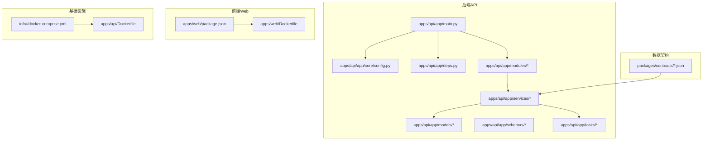
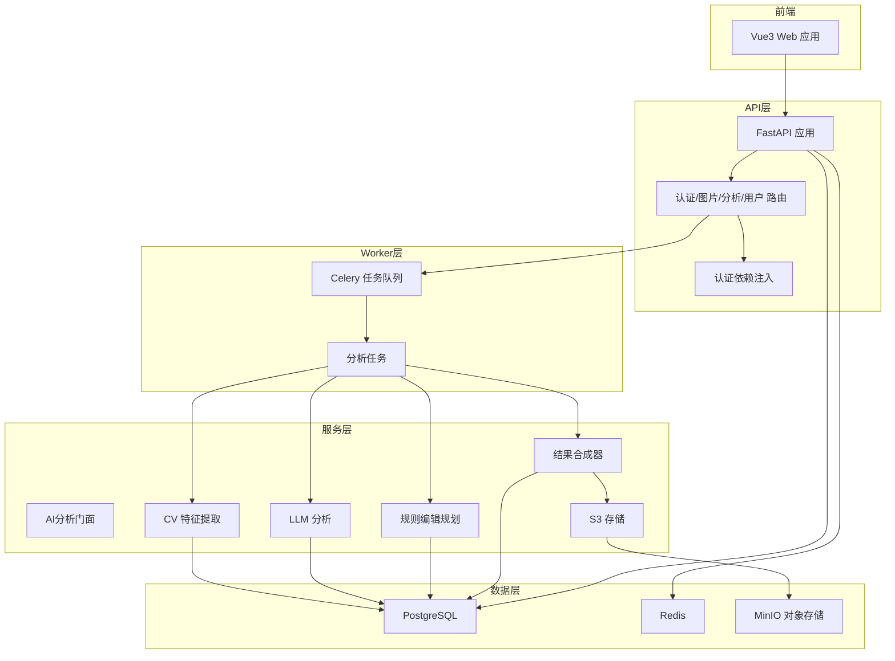
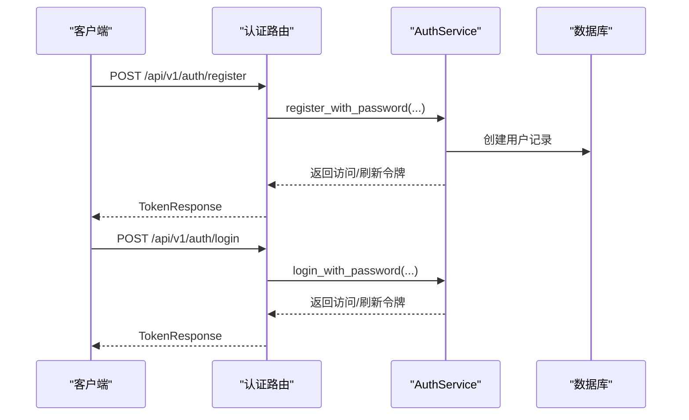
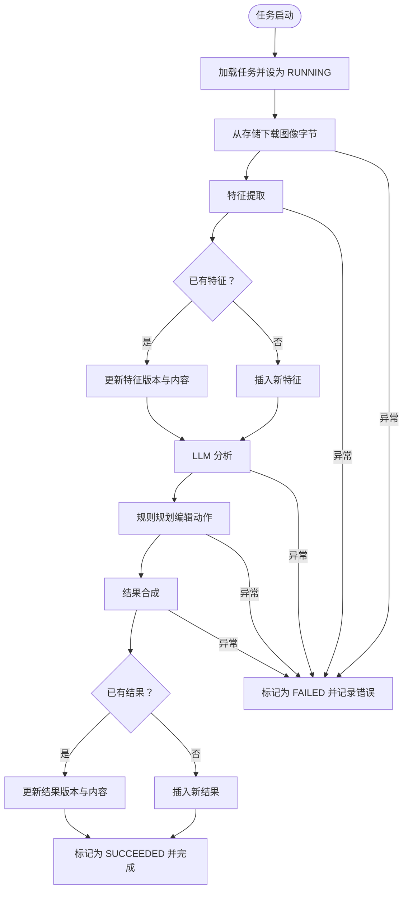
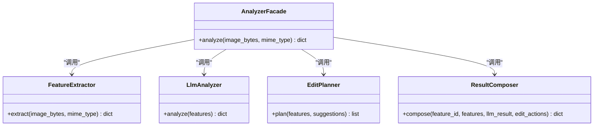
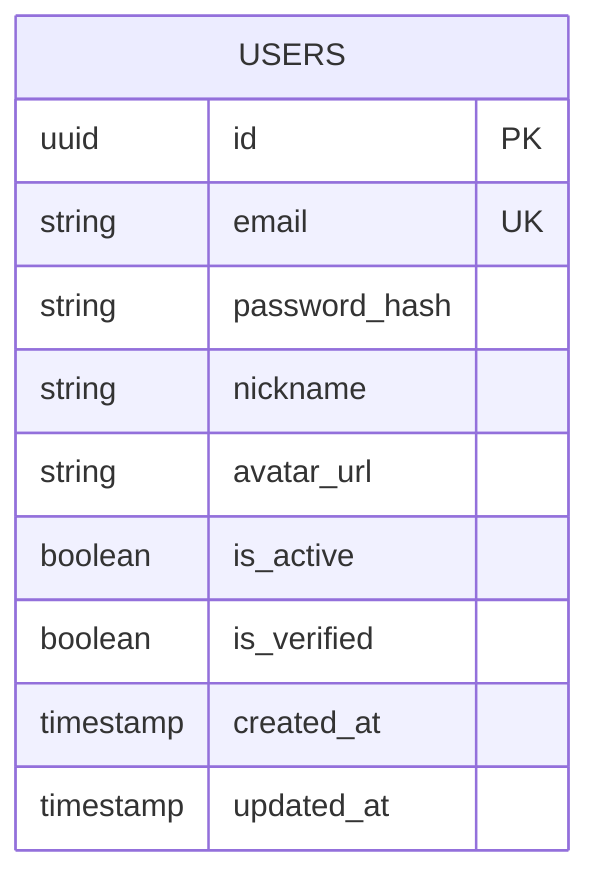
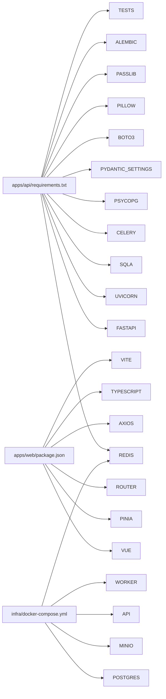

# 开发者指南

<cite>
**本文引用的文件**   
- [apps/api/app/main.py](file://apps/api/app/main.py)
- [apps/api/app/core/config.py](file://apps/api/app/core/config.py)
- [apps/api/app/deps.py](file://apps/api/app/deps.py)
- [apps/api/app/models/base.py](file://apps/api/app/models/base.py)
- [apps/api/app/models/user.py](file://apps/api/app/models/user.py)
- [apps/api/app/schemas/user.py](file://apps/api/app/schemas/user.py)
- [apps/api/app/modules/auth/router.py](file://apps/api/app/modules/auth/router.py)
- [apps/api/app/services/ai/analyzer.py](file://apps/api/app/services/ai/analyzer.py)
- [apps/api/app/tasks/analyze_photo.py](file://apps/api/app/tasks/analyze_photo.py)
- [packages/contracts/analysis-result.schema.json](file://packages/contracts/analysis-result.schema.json)
- [apps/api/requirements.txt](file://apps/api/requirements.txt)
- [apps/api/Dockerfile](file://apps/api/Dockerfile)
- [apps/web/Dockerfile](file://apps/web/Dockerfile)
- [apps/web/package.json](file://apps/web/package.json)
- [infra/docker-compose.yml](file://infra/docker-compose.yml)
- [docs/architecture-v2.md](file://docs/architecture-v2.md)
</cite>

## 目录
1. [简介](#简介)
2. [项目结构](#项目结构)
3. [核心组件](#核心组件)
4. [架构总览](#架构总览)
5. [详细组件分析](#详细组件分析)
6. [依赖分析](#依赖分析)
7. [性能考虑](#性能考虑)
8. [故障排查指南](#故障排查指南)
9. [结论](#结论)
10. [附录](#附录)

## 简介
本指南面向AI摄影教练项目的开发者，提供从代码规范、命名约定、架构原则到开发流程、调试与性能优化、扩展与插件开发、贡献与社区参与、数据契约与API版本管理、以及开发工具与IDE配置的完整指引。文档内容均基于仓库中实际实现与架构文档提炼而来，确保可操作性与一致性。

## 项目结构
项目采用多应用单仓布局，包含后端API、Web前端、Worker异步任务、基础设施编排与数据契约定义。核心模块划分清晰：API层负责HTTP接口与路由；Worker层承载异步任务；服务层拆分CV、LLM、规则引擎与结果合成；数据库通过SQLAlchemy ORM建模；前端使用Vue3 + TypeScript + Vite构建。

图表来源
- [apps/api/app/main.py:1-36](file://apps/api/app/main.py#L1-L36)
- [apps/api/app/core/config.py:1-47](file://apps/api/app/core/config.py#L1-L47)
- [apps/api/app/deps.py:1-41](file://apps/api/app/deps.py#L1-L41)
- [apps/api/app/models/base.py:1-5](file://apps/api/app/models/base.py#L1-L5)
- [apps/api/app/models/user.py:1-28](file://apps/api/app/models/user.py#L1-L28)
- [apps/api/app/schemas/user.py:1-30](file://apps/api/app/schemas/user.py#L1-L30)
- [apps/api/app/modules/auth/router.py:1-93](file://apps/api/app/modules/auth/router.py#L1-L93)
- [apps/api/app/services/ai/analyzer.py:1-27](file://apps/api/app/services/ai/analyzer.py#L1-L27)
- [apps/api/app/tasks/analyze_photo.py:1-108](file://apps/api/app/tasks/analyze_photo.py#L1-L108)
- [apps/api/requirements.txt:1-19](file://apps/api/requirements.txt#L1-L19)
- [apps/api/Dockerfile:1-23](file://apps/api/Dockerfile#L1-L23)
- [apps/web/Dockerfile:1-22](file://apps/web/Dockerfile#L1-L22)
- [apps/web/package.json:1-26](file://apps/web/package.json#L1-L26)
- [infra/docker-compose.yml:1-107](file://infra/docker-compose.yml#L1-L107)
- [packages/contracts/analysis-result.schema.json:1-76](file://packages/contracts/analysis-result.schema.json#L1-L76)

章节来源
- [apps/api/app/main.py:1-36](file://apps/api/app/main.py#L1-L36)
- [apps/api/app/core/config.py:1-47](file://apps/api/app/core/config.py#L1-L47)
- [apps/api/app/deps.py:1-41](file://apps/api/app/deps.py#L1-L41)
- [apps/api/app/models/base.py:1-5](file://apps/api/app/models/base.py#L1-L5)
- [apps/api/app/models/user.py:1-28](file://apps/api/app/models/user.py#L1-L28)
- [apps/api/app/schemas/user.py:1-30](file://apps/api/app/schemas/user.py#L1-L30)
- [apps/api/app/modules/auth/router.py:1-93](file://apps/api/app/modules/auth/router.py#L1-L93)
- [apps/api/app/services/ai/analyzer.py:1-27](file://apps/api/app/services/ai/analyzer.py#L1-L27)
- [apps/api/app/tasks/analyze_photo.py:1-108](file://apps/api/app/tasks/analyze_photo.py#L1-L108)
- [apps/api/requirements.txt:1-19](file://apps/api/requirements.txt#L1-L19)
- [apps/api/Dockerfile:1-23](file://apps/api/Dockerfile#L1-L23)
- [apps/web/Dockerfile:1-22](file://apps/web/Dockerfile#L1-L22)
- [apps/web/package.json:1-26](file://apps/web/package.json#L1-L26)
- [infra/docker-compose.yml:1-107](file://infra/docker-compose.yml#L1-L107)
- [packages/contracts/analysis-result.schema.json:1-76](file://packages/contracts/analysis-result.schema.json#L1-L76)

## 核心组件
- 应用入口与路由聚合：后端FastAPI应用在入口文件中注册CORS中间件，并按API前缀挂载各模块路由，启动事件初始化数据库。
- 配置中心：集中管理应用名称、环境、API前缀、数据库/Redis/S3连接、JWT密钥与过期时间、CORS来源列表等。
- 依赖注入与认证：提供基于Bearer Token的认证依赖，从数据库解析当前用户并进行有效性校验。
- 数据模型与Schema：用户模型采用UUID主键、布尔激活标志与时间戳；Pydantic Schema用于请求/响应数据结构。
- 认证模块：提供注册、登录、刷新、注销、邮箱验证、重发验证、忘记密码与重置密码等端点。
- AI分析门面：封装CV特征提取、LLM分析与规则编辑规划，统一由结果合成器输出稳定协议。
- 异步分析任务：Worker任务从存储下载图像，依次执行特征提取、LLM分析、规则规划与结果合成，持久化至分析特征与结果表。
- 数据契约：通过JSON Schema定义分析结果、标注与编辑动作的稳定协议，确保前后端一致。

章节来源
- [apps/api/app/main.py:1-36](file://apps/api/app/main.py#L1-L36)
- [apps/api/app/core/config.py:1-47](file://apps/api/app/core/config.py#L1-L47)
- [apps/api/app/deps.py:1-41](file://apps/api/app/deps.py#L1-L41)
- [apps/api/app/models/user.py:1-28](file://apps/api/app/models/user.py#L1-L28)
- [apps/api/app/schemas/user.py:1-30](file://apps/api/app/schemas/user.py#L1-L30)
- [apps/api/app/modules/auth/router.py:1-93](file://apps/api/app/modules/auth/router.py#L1-L93)
- [apps/api/app/services/ai/analyzer.py:1-27](file://apps/api/app/services/ai/analyzer.py#L1-L27)
- [apps/api/app/tasks/analyze_photo.py:1-108](file://apps/api/app/tasks/analyze_photo.py#L1-L108)
- [packages/contracts/analysis-result.schema.json:1-76](file://packages/contracts/analysis-result.schema.json#L1-L76)

## 架构总览
系统采用“CV产出事实、LLM产出解释、规则引擎产出可执行动作”的分层原则，API层负责参数校验与任务创建，Worker层执行重型计算，服务层解耦AI能力，数据契约保证前后端协议稳定。

图表来源
- [apps/api/app/main.py:1-36](file://apps/api/app/main.py#L1-L36)
- [apps/api/app/modules/auth/router.py:1-93](file://apps/api/app/modules/auth/router.py#L1-L93)
- [apps/api/app/deps.py:1-41](file://apps/api/app/deps.py#L1-L41)
- [apps/api/app/tasks/analyze_photo.py:1-108](file://apps/api/app/tasks/analyze_photo.py#L1-L108)
- [apps/api/app/services/ai/analyzer.py:1-27](file://apps/api/app/services/ai/analyzer.py#L1-L27)
- [infra/docker-compose.yml:1-107](file://infra/docker-compose.yml#L1-L107)

章节来源
- [docs/architecture-v2.md:1-424](file://docs/architecture-v2.md#L1-L424)
- [apps/api/app/main.py:1-36](file://apps/api/app/main.py#L1-L36)
- [apps/api/app/modules/auth/router.py:1-93](file://apps/api/app/modules/auth/router.py#L1-L93)
- [apps/api/app/deps.py:1-41](file://apps/api/app/deps.py#L1-L41)
- [apps/api/app/tasks/analyze_photo.py:1-108](file://apps/api/app/tasks/analyze_photo.py#L1-L108)
- [apps/api/app/services/ai/analyzer.py:1-27](file://apps/api/app/services/ai/analyzer.py#L1-L27)
- [infra/docker-compose.yml:1-107](file://infra/docker-compose.yml#L1-L107)

## 详细组件分析

### 认证与依赖注入
- 认证依赖：提供从Authorization头解析Bearer Token并查询用户，校验是否有效与活跃，否则抛出未授权异常。
- 认证路由：覆盖注册、登录、刷新、注销、邮箱验证、重发验证、忘记/重置密码等端点，便于逐步完善鉴权依赖。

图表来源
- [apps/api/app/modules/auth/router.py:1-93](file://apps/api/app/modules/auth/router.py#L1-L93)
- [apps/api/app/deps.py:1-41](file://apps/api/app/deps.py#L1-L41)

章节来源
- [apps/api/app/deps.py:1-41](file://apps/api/app/deps.py#L1-L41)
- [apps/api/app/modules/auth/router.py:1-93](file://apps/api/app/modules/auth/router.py#L1-L93)

### 异步分析任务流程
- 任务状态机：接收任务ID，标记为运行中，拉取图像字节，执行特征提取、LLM分析、规则规划与结果合成，最终持久化特征与结果并更新任务状态。
- 错误处理：捕获异常，回滚事务，记录错误码与消息，结束任务。

图表来源
- [apps/api/app/tasks/analyze_photo.py:1-108](file://apps/api/app/tasks/analyze_photo.py#L1-L108)

章节来源
- [apps/api/app/tasks/analyze_photo.py:1-108](file://apps/api/app/tasks/analyze_photo.py#L1-L108)

### AI分析门面
- 门面职责：协调CV特征提取、LLM分析与规则编辑规划，交由结果合成器输出统一协议。
- 缓存策略：使用LRU缓存确保全局唯一实例，降低初始化成本。

图表来源
- [apps/api/app/services/ai/analyzer.py:1-27](file://apps/api/app/services/ai/analyzer.py#L1-L27)

章节来源
- [apps/api/app/services/ai/analyzer.py:1-27](file://apps/api/app/services/ai/analyzer.py#L1-L27)

### 数据模型与Schema
- 用户模型：UUID主键、邮箱唯一、布尔激活/验证标志、时间戳字段。
- 用户Schema：响应模型与更新/改密请求模型，遵循Pydantic字段约束。

图表来源
- [apps/api/app/models/user.py:1-28](file://apps/api/app/models/user.py#L1-L28)

章节来源
- [apps/api/app/models/user.py:1-28](file://apps/api/app/models/user.py#L1-L28)
- [apps/api/app/schemas/user.py:1-30](file://apps/api/app/schemas/user.py#L1-L30)

### 数据契约与协议
- 分析结果协议：包含版本、摘要、建议、评分、特征引用、标注数组与编辑动作数组，建议优先使用结构化字段而非自由文本。
- 标注协议：统一几何类型与来源，坐标使用原图像素坐标系，支持多建议关联。
- 编辑动作协议：可执行对象，包含动作类型、来源、参数、原因、可预览与应用模式等。

章节来源
- [packages/contracts/analysis-result.schema.json:1-76](file://packages/contracts/analysis-result.schema.json#L1-L76)
- [docs/architecture-v2.md:239-350](file://docs/architecture-v2.md#L239-L350)

## 依赖分析
- 后端依赖：FastAPI、Uvicorn、SQLAlchemy、Celery、Redis、PostgreSQL驱动、Pydantic Settings、boto3、Pillow、Passlib、Alembic、测试框架等。
- 前端依赖：Vue3、Pinia、Vue Router、Axios、TypeScript、Vite等。
- 容器编排：PostgreSQL、Redis、MinIO对象存储、API与Worker容器、Nginx静态资源服务。

图表来源
- [apps/api/requirements.txt:1-19](file://apps/api/requirements.txt#L1-L19)
- [apps/web/package.json:1-26](file://apps/web/package.json#L1-L26)
- [infra/docker-compose.yml:1-107](file://infra/docker-compose.yml#L1-L107)

章节来源
- [apps/api/requirements.txt:1-19](file://apps/api/requirements.txt#L1-L19)
- [apps/web/package.json:1-26](file://apps/web/package.json#L1-L26)
- [infra/docker-compose.yml:1-107](file://infra/docker-compose.yml#L1-L107)

## 性能考虑
- 异步任务与队列：利用Celery与Redis实现CPU/IO密集型任务解耦，避免阻塞API响应。
- 缓存与连接池：合理配置数据库连接池与Redis缓存，减少连接开销；对热点数据与模型推理结果进行缓存。
- 存储优化：对象存储采用分层存储策略，原图与派生图分离，避免重复计算。
- 前端构建：生产构建开启压缩与Tree-shaking，按需加载模块，减少首屏体积。
- 监控与指标：在API与Worker中埋点关键路径耗时，结合日志与APM工具定位瓶颈。

## 故障排查指南
- 健康检查：后端提供健康探针端点；容器健康检查脚本可用于快速判断服务可用性。
- 日志与追踪：认证路由中使用标准日志记录关键事件；建议在任务中记录任务ID与关键步骤。
- 数据库迁移：使用Alembic管理迁移，确保本地与CI环境一致；迁移失败时回滚并检查变更。
- CORS与鉴权：确认CORS来源列表与Bearer Token格式正确；认证失败时检查密钥与过期时间。
- 存储连通性：对象存储端点、凭证与桶名需与配置一致；下载/上传失败时检查网络与权限。

章节来源
- [apps/api/app/main.py:32-36](file://apps/api/app/main.py#L32-L36)
- [apps/api/app/modules/auth/router.py:1-93](file://apps/api/app/modules/auth/router.py#L1-L93)
- [apps/api/Dockerfile:1-23](file://apps/api/Dockerfile#L1-L23)
- [apps/web/Dockerfile:1-22](file://apps/web/Dockerfile#L1-L22)
- [infra/docker-compose.yml:1-107](file://infra/docker-compose.yml#L1-L107)

## 结论
本指南提供了从架构原则、模块职责、数据契约到开发流程与运维保障的全栈实践建议。建议团队在新功能开发中严格遵循分层与协议约束，优先使用异步任务与缓存策略提升性能，并通过容器化与自动化部署保障交付质量。

## 附录

### 代码规范与命名约定
- 文件与模块：按功能分层组织，如core、models、modules、services、tasks、schemas等；路由模块按领域划分。
- 类与函数：采用清晰语义命名，避免缩写；服务类以名词+Service结尾，任务函数以动词+名词描述。
- 常量与配置：统一在配置模块集中管理，避免魔法数；敏感信息通过环境变量注入。
- 命名空间：包内相对导入，避免循环依赖；跨应用通信通过数据契约与API。

### 开发流程与协作
- 分支管理：采用特性分支开发，主分支仅合并通过CI与评审的变更；发布前打标签并同步文档。
- 提交规范：使用清晰的提交信息，描述动机与影响；大型变更配合设计文档与变更说明。
- 代码审查：至少一次同行评审，关注架构一致性、性能与安全性；通过自动化检查与手动审查双重保障。

### 新功能开发最佳实践与模板
- 遵循“CV事实、LLM解释、规则动作”的分层原则，新增服务时先定义数据契约，再实现服务与任务。
- 使用任务模板：创建任务实体、编写Worker任务、在API中暴露查询端点、在前端补充状态展示。
- 协议演进：通过版本号与Schema约束保证向前兼容，旧版本数据迁移与降级策略需纳入设计。

### 调试技巧与性能分析
- 后端：启用详细日志级别，结合任务ID追踪执行链；使用性能探针测量关键路径耗时。
- 前端：利用浏览器性能面板与网络面板定位瓶颈；对大图与Canvas渲染进行节流与懒加载。
- 基础设施：监控容器资源占用与队列积压，及时扩容或优化任务粒度。

### 扩展点与插件开发指南
- 服务扩展：新增AI服务时，遵循现有工厂/缓存模式，确保可替换与可测试。
- 协议扩展：通过JSON Schema定义新字段与枚举值，保持版本兼容与向后兼容。
- 插件化：对外部模型或第三方服务抽象接口，通过配置切换实现插件式替换。

### 贡献指南与社区参与
- 提交Issue：描述问题背景、复现步骤与期望行为；建议附带日志与截图。
- 发PR：关联相关Issue，提供测试用例与变更说明；确保通过所有检查项。
- 社区交流：遵守行为准则，尊重不同观点，聚焦技术方案与改进措施。

### 数据契约与API版本管理策略
- 版本策略：采用语义化版本控制，小版本用于新增非破坏性字段，大版本用于破坏性变更。
- 兼容性：新增字段默认可选，旧客户端可安全忽略；删除字段需保留别名一段时间。
- 协议治理：通过JSON Schema与单元测试约束契约，禁止在未声明版本下修改既有字段。

### 开发工具配置与IDE设置建议
- Python：启用类型检查与格式化，推荐使用pyright与ruff；虚拟环境隔离依赖。
- TypeScript/Vue：启用严格的类型检查与ESLint规则；配置Volar增强体验。
- Docker：统一镜像构建参数与运行时用户，避免权限问题；健康检查确保服务可用。
- Git：配置提交钩子与提交模板，保持历史整洁；保护主分支并强制PR合并。