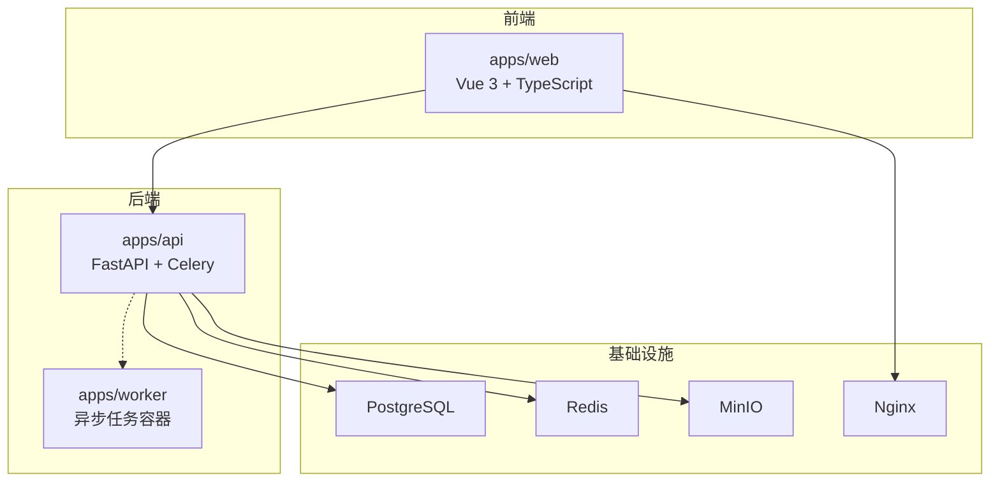
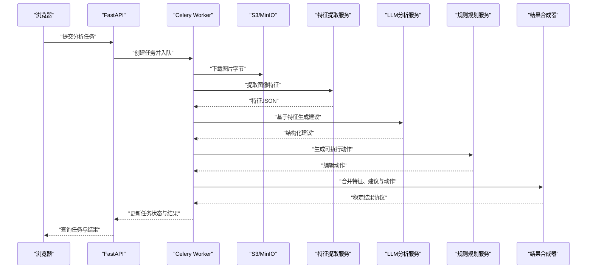
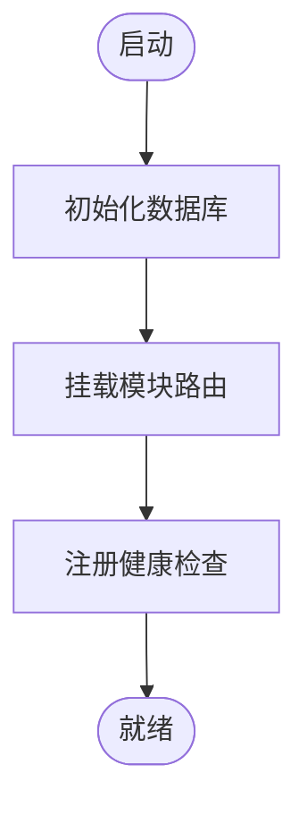
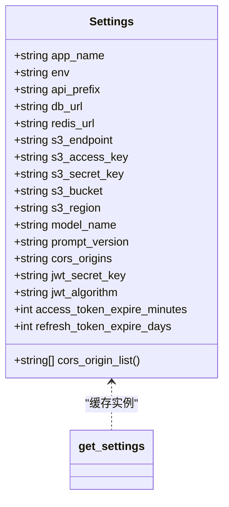
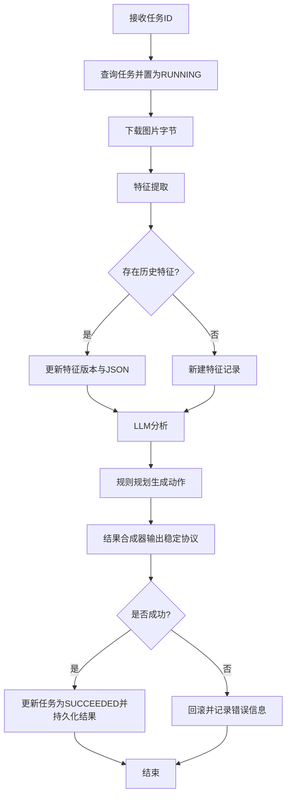
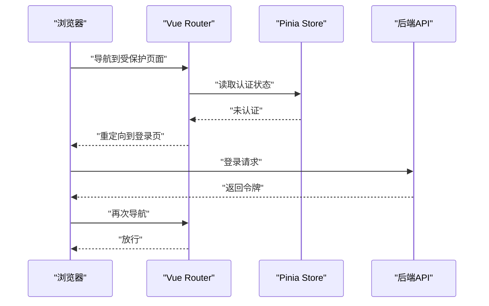
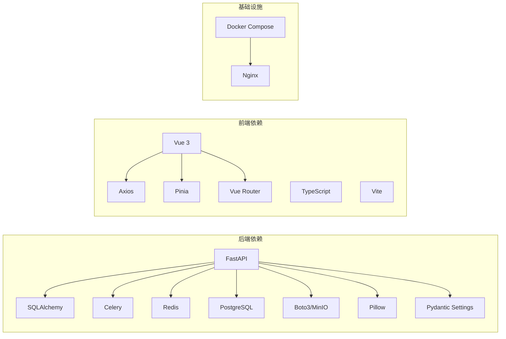

# 开发者指南

<cite>
**本文引用的文件**
- [apps/api/app/main.py](file://apps/api/app/main.py)
- [apps/api/app/core/config.py](file://apps/api/app/core/config.py)
- [apps/api/app/models/base.py](file://apps/api/app/models/base.py)
- [apps/api/app/schemas/analysis.py](file://apps/api/app/schemas/analysis.py)
- [apps/api/app/tasks/analyze_photo.py](file://apps/api/app/tasks/analyze_photo.py)
- [apps/api/requirements.txt](file://apps/api/requirements.txt)
- [apps/api/Dockerfile](file://apps/api/Dockerfile)
- [apps/web/src/main.ts](file://apps/web/src/main.ts)
- [apps/web/src/router.ts](file://apps/web/src/router.ts)
- [apps/web/vite.config.ts](file://apps/web/vite.config.ts)
- [apps/web/package.json](file://apps/web/package.json)
- [apps/web/Dockerfile](file://apps/web/Dockerfile)
- [infra/docker-compose.yml](file://infra/docker-compose.yml)
- [infra/deploy.sh](file://infra/deploy.sh)
- [docs/architecture-v2.md](file://docs/architecture-v2.md)
- [openspec/config.yaml](file://openspec/config.yaml)
- [packages/contracts/analysis-result.schema.json](file://packages/contracts/analysis-result.schema.json)
- [packages/contracts/annotation.schema.json](file://packages/contracts/annotation.schema.json)
- [packages/contracts/edit-action.schema.json](file://packages/contracts/edit-action.schema.json)
</cite>

## 目录
1. [简介](#简介)
2. [项目结构](#项目结构)
3. [核心组件](#核心组件)
4. [架构总览](#架构总览)
5. [详细组件分析](#详细组件分析)
6. [依赖关系分析](#依赖关系分析)
7. [性能考虑](#性能考虑)
8. [故障排查指南](#故障排查指南)
9. [结论](#结论)
10. [附录](#附录)

## 简介
本指南面向AI摄影教练项目的开发者，提供从代码规范、开发流程、工具配置到性能优化与团队协作的完整实践手册。文档以仓库现有代码与架构文档为基础，结合FastAPI、Vue 3、TypeScript、Docker Compose等技术栈，给出可落地的最佳实践与操作步骤。

## 项目结构
项目采用多应用单仓（monorepo）组织方式，包含后端API、前端Web、异步Worker、基础设施编排与规格文档等模块。核心目录与职责如下：
- apps/api：FastAPI后端，包含路由、模型、服务、任务与核心配置
- apps/web：Vue 3前端，包含路由、状态管理、视图与构建配置
- apps/worker：异步任务运行环境（Docker镜像）
- infra：Docker Compose编排与部署脚本
- docs：架构设计文档
- openspec：OpenSpec规格驱动相关配置
- packages/contracts：前后端稳定协议的JSON Schema定义

图表来源
- [infra/docker-compose.yml:1-107](file://infra/docker-compose.yml#L1-L107)
- [apps/api/app/main.py:1-36](file://apps/api/app/main.py#L1-L36)
- [apps/web/src/main.ts:1-14](file://apps/web/src/main.ts#L1-L14)

章节来源
- [infra/docker-compose.yml:1-107](file://infra/docker-compose.yml#L1-L107)
- [apps/api/app/main.py:1-36](file://apps/api/app/main.py#L1-L36)
- [apps/web/src/main.ts:1-14](file://apps/web/src/main.ts#L1-L14)

## 核心组件
- 后端入口与路由注册：后端通过主程序注册CORS、数据库初始化与各模块路由，并提供健康检查端点。
- 配置体系：集中使用Pydantic Settings加载环境变量，支持缓存与跨域配置。
- 数据模型基类：统一的SQLAlchemy声明式基类，便于扩展。
- 任务编排：Celery任务按流程执行特征提取、LLM分析、规则规划与结果合成。
- 前端应用与路由：Vue应用挂载Pinia与路由；路由守卫控制访问权限。
- 构建与代理：Vite开发服务器配置代理，前端打包后由Nginx提供静态服务。
- 协议契约：通过JSON Schema定义分析结果、标注与编辑动作的稳定协议。

章节来源
- [apps/api/app/main.py:1-36](file://apps/api/app/main.py#L1-L36)
- [apps/api/app/core/config.py:1-47](file://apps/api/app/core/config.py#L1-L47)
- [apps/api/app/models/base.py:1-5](file://apps/api/app/models/base.py#L1-L5)
- [apps/api/app/tasks/analyze_photo.py:1-108](file://apps/api/app/tasks/analyze_photo.py#L1-L108)
- [apps/web/src/main.ts:1-14](file://apps/web/src/main.ts#L1-L14)
- [apps/web/src/router.ts:1-30](file://apps/web/src/router.ts#L1-L30)
- [apps/web/vite.config.ts:1-26](file://apps/web/vite.config.ts#L1-L26)
- [packages/contracts/analysis-result.schema.json](file://packages/contracts/analysis-result.schema.json)
- [packages/contracts/annotation.schema.json](file://packages/contracts/annotation.schema.json)
- [packages/contracts/edit-action.schema.json](file://packages/contracts/edit-action.schema.json)

## 架构总览
后端采用“CV产出事实、LLM产出解释、规则引擎产出可执行动作”的分层设计，通过异步任务流水线串联存储、特征提取、LLM分析与结果合成，最终将稳定协议返回前端渲染。

图表来源
- [apps/api/app/tasks/analyze_photo.py:1-108](file://apps/api/app/tasks/analyze_photo.py#L1-L108)
- [apps/api/app/services/storage/s3_storage.py](file://apps/api/app/services/storage/s3_storage.py)
- [apps/api/app/services/cv/feature_extractor.py](file://apps/api/app/services/cv/feature_extractor.py)
- [apps/api/app/services/llm/analyzer.py](file://apps/api/app/services/llm/analyzer.py)
- [apps/api/app/services/rules/edit_planner.py](file://apps/api/app/services/rules/edit_planner.py)
- [apps/api/app/services/composer/result_composer.py](file://apps/api/app/services/composer/result_composer.py)

章节来源
- [docs/architecture-v2.md:1-424](file://docs/architecture-v2.md#L1-L424)
- [apps/api/app/tasks/analyze_photo.py:1-108](file://apps/api/app/tasks/analyze_photo.py#L1-L108)

## 详细组件分析

### 后端入口与路由
- 注册CORS中间件，允许指定来源访问
- 初始化数据库连接
- 动态挂载各模块路由前缀
- 提供健康检查端点

图表来源
- [apps/api/app/main.py:1-36](file://apps/api/app/main.py#L1-L36)

章节来源
- [apps/api/app/main.py:1-36](file://apps/api/app/main.py#L1-L36)

### 配置与环境变量
- 使用Pydantic Settings集中管理配置，支持缓存
- 关键配置项：数据库URL、Redis、S3、JWT、CORS、模型名与提示版本
- CORS来源列表动态解析

图表来源
- [apps/api/app/core/config.py:1-47](file://apps/api/app/core/config.py#L1-L47)

章节来源
- [apps/api/app/core/config.py:1-47](file://apps/api/app/core/config.py#L1-L47)

### 数据模型基类
- 统一的SQLAlchemy声明式基类，便于扩展ORM模型

章节来源
- [apps/api/app/models/base.py:1-5](file://apps/api/app/models/base.py#L1-L5)

### 任务编排与流水线
- 任务状态机：PENDING → RUNNING → SUCCEEDED/FAILED
- 幂等处理：重复任务会更新已有记录
- 错误回滚与错误码记录
- 任务完成后写入特征与结果表

图表来源
- [apps/api/app/tasks/analyze_photo.py:1-108](file://apps/api/app/tasks/analyze_photo.py#L1-L108)

章节来源
- [apps/api/app/tasks/analyze_photo.py:1-108](file://apps/api/app/tasks/analyze_photo.py#L1-L108)

### 前端应用与路由
- 应用初始化：挂载Pinia与路由
- 路由守卫：根据meta标记控制登录/游客访问
- 开发代理：将/api与/healthz转发至后端

图表来源
- [apps/web/src/router.ts:1-30](file://apps/web/src/router.ts#L1-L30)
- [apps/web/src/main.ts:1-14](file://apps/web/src/main.ts#L1-L14)

章节来源
- [apps/web/src/main.ts:1-14](file://apps/web/src/main.ts#L1-L14)
- [apps/web/src/router.ts:1-30](file://apps/web/src/router.ts#L1-L30)
- [apps/web/vite.config.ts:1-26](file://apps/web/vite.config.ts#L1-L26)

### 协议契约与Schema
- 分析结果协议：包含版本、摘要、建议、评分、特征引用、标注与编辑动作
- 标注协议：统一几何类型与数据来源，坐标使用原图像素空间
- 编辑动作协议：可执行对象，包含动作类型、参数与预览属性

章节来源
- [docs/architecture-v2.md:239-350](file://docs/architecture-v2.md#L239-L350)
- [packages/contracts/analysis-result.schema.json](file://packages/contracts/analysis-result.schema.json)
- [packages/contracts/annotation.schema.json](file://packages/contracts/annotation.schema.json)
- [packages/contracts/edit-action.schema.json](file://packages/contracts/edit-action.schema.json)

## 依赖关系分析
- 后端依赖：FastAPI、SQLAlchemy、Celery、Redis、PostgreSQL、Boto3、Pillow、Pydantic Settings等
- 前端依赖：Vue 3、Pinia、Vue Router、Axios、TypeScript、Vite等
- 基础设施：PostgreSQL、Redis、MinIO、Nginx，通过Docker Compose编排

图表来源
- [apps/api/requirements.txt:1-19](file://apps/api/requirements.txt#L1-L19)
- [apps/web/package.json:1-26](file://apps/web/package.json#L1-L26)
- [infra/docker-compose.yml:1-107](file://infra/docker-compose.yml#L1-L107)

章节来源
- [apps/api/requirements.txt:1-19](file://apps/api/requirements.txt#L1-L19)
- [apps/web/package.json:1-26](file://apps/web/package.json#L1-L26)
- [infra/docker-compose.yml:1-107](file://infra/docker-compose.yml#L1-L107)

## 性能考虑
- 异步任务解耦：将CPU/IO密集的特征提取与模型分析放入Celery Worker，避免阻塞API
- 幂等与复用：特征表与结果表支持重复任务的更新，减少重复计算
- 存储优化：使用S3兼容存储，支持缩略图与派生图的高效管理
- 前端静态化：Vite构建产物交由Nginx提供，降低前端服务器压力
- 数据库与缓存：合理索引与连接池配置，避免热点查询导致的延迟

## 故障排查指南
- 健康检查：后端提供/healthz端点，前端通过Vite代理访问
- 日志定位：生产部署使用Docker Compose日志查看，部署脚本提供常用命令
- 环境变量：确认关键变量（如数据库、S3、CORS）已正确配置
- 任务失败：查看任务表中的错误码与消息，定位具体环节

章节来源
- [apps/api/app/main.py:32-35](file://apps/api/app/main.py#L32-L35)
- [apps/web/vite.config.ts:1-26](file://apps/web/vite.config.ts#L1-L26)
- [infra/deploy.sh:57-62](file://infra/deploy.sh#L57-L62)

## 结论
本指南基于现有代码与架构文档，给出了从开发到运维的全流程实践建议。建议团队在遵循现有分层与协议的基础上，持续完善鉴权、标注与自动修图能力，确保系统在演进过程中保持稳定与可扩展。

## 附录

### 代码规范与最佳实践

- Python（后端）
  - 遵循PEP 8风格，模块命名使用下划线，类名使用驼峰
  - 类型注解优先，Pydantic模型用于输入/输出校验
  - 事务边界清晰，异常捕获后进行回滚与状态更新
  - 配置集中管理，敏感信息通过环境变量注入
  - 任务幂等：重复执行应覆盖历史结果，避免脏数据

- TypeScript（前端）
  - 使用严格模式，接口与类型定义前置
  - Pinia状态管理按模块拆分，避免全局臃肿
  - Vue组件职责单一，事件与状态分离
  - API封装统一，错误处理与重试策略一致

- Vue.js组件设计原则
  - 单文件组件内联样式与逻辑清晰，必要时拆分工具函数
  - 路由守卫与权限控制集中在router中，组件内仅关注UI
  - 移动端优先：避免hover交互，统一使用点击+底部抽屉

- Git工作流程与分支管理
  - 主分支：release/develop两条长期分支，功能从develop切出
  - 功能分支：feature/*，修复hotfix/*，发布release/*
  - 提交信息：采用约定式提交（如feat/fix/docs/chore），配合CI校验
  - 合并与审核：Pull Request强制开启，至少一次同行评审

- 代码审查标准与流程
  - 正确性：逻辑无漏洞，边界条件覆盖
  - 可维护性：命名清晰、注释必要、复杂度可控
  - 兼容性：前后端协议契约遵守，数据库迁移安全
  - 性能：避免N+1查询，合理使用缓存与异步任务

- 开发工具配置与IDE建议
  - VS Code：安装Python、ESLint、Prettier、Vue扩展
  - Python：启用type checking与lint（如ruff/pylint），格式化black/isort
  - TypeScript：tsconfig严格模式，路径别名与模块解析配置
  - 前端：Vite Dev Server代理配置与断点调试
  - Docker：本地compose一键拉起所有依赖

- 调试技巧与问题排查
  - 后端：使用uvicorn调试模式，结合数据库客户端查看任务与结果表
  - 前端：利用Vue DevTools与网络面板，检查路由守卫与API响应
  - 基础设施：通过Docker日志与健康检查快速定位服务异常

- 性能优化与重构指导
  - 任务拆分：将大任务拆为子任务，提升并发与可观测性
  - 缓存策略：对热点查询与特征结果增加缓存层
  - 数据库：为高频查询建立索引，避免全表扫描
  - 前端：懒加载组件与路由，按需引入第三方库

- 团队协作与沟通规范
  - 每日站会：同步进度与阻塞项
  - 规格驱动：使用OpenSpec进行需求与变更的规范化描述
  - 文档同步：变更随代码更新，README与架构文档保持一致

- 新成员入职与知识传承
  - 提供环境搭建清单与一键脚本
  - 指定导师与结对编程，参与首次PR评审
  - 定期回顾与分享：架构演进、性能优化案例、最佳实践

章节来源
- [openspec/config.yaml:1-21](file://openspec/config.yaml#L1-L21)
- [docs/architecture-v2.md:1-424](file://docs/architecture-v2.md#L1-L424)