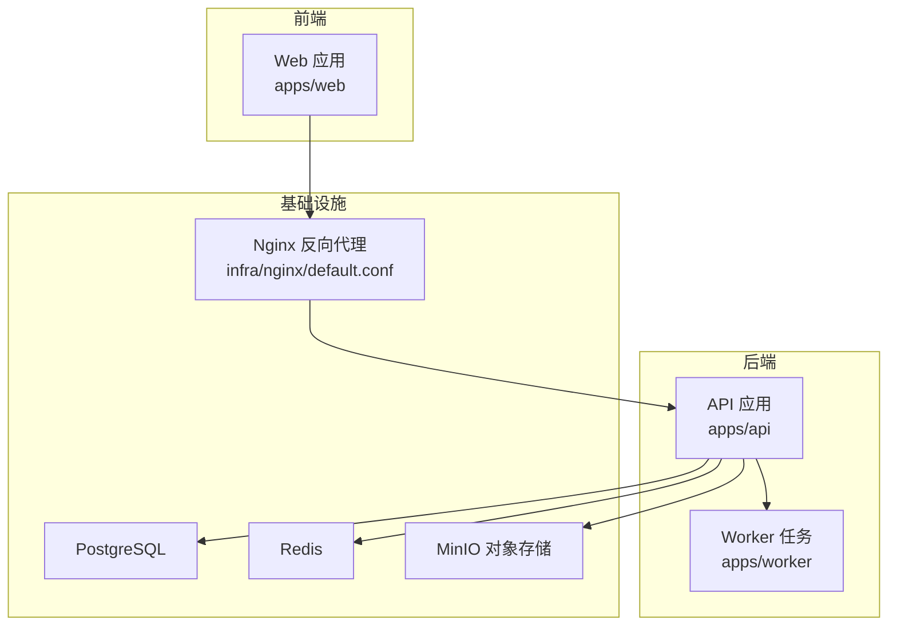
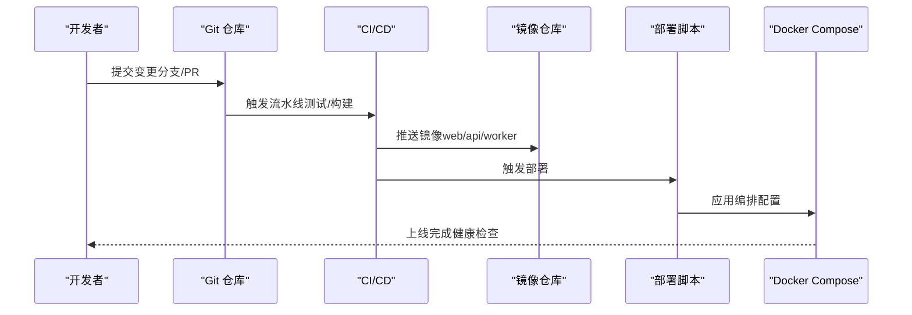
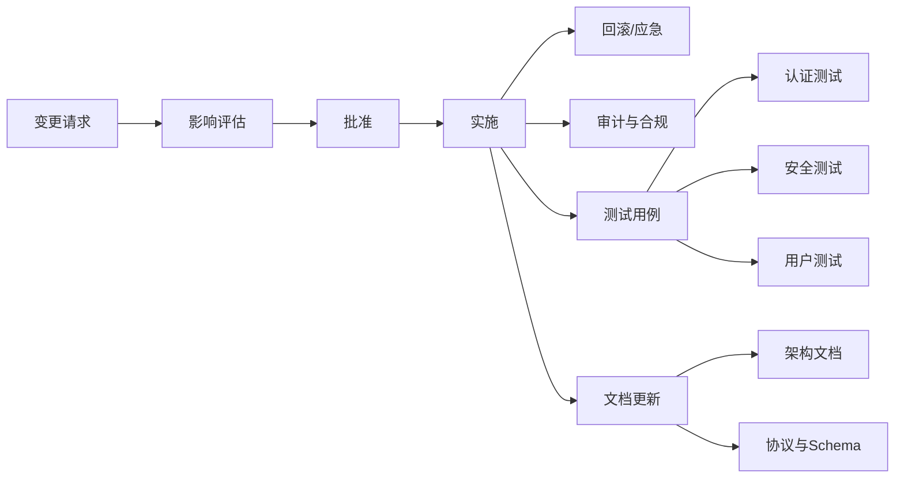

# 变更控制

<cite>
**本文引用的文件**
- [架构文档](file://docs/architecture-v2.md)
- [部署脚本](file://infra/deploy.sh)
- [生产编排](file://infra/docker-compose.prod.yml)
- [API Dockerfile](file://apps/api/Dockerfile)
- [Web Dockerfile](file://apps/web/Dockerfile)
- [Worker Dockerfile](file://apps/worker/Dockerfile)
- [API 依赖清单](file://apps/api/requirements.txt)
- [前端包配置](file://apps/web/package.json)
- [OpenSpec 配置](file://openspec/config.yaml)
- [API 集成测试（认证）](file://apps/api/tests/test_auth.py)
- [API 单元测试（安全）](file://apps/api/tests/test_security.py)
- [API 集成测试（用户）](file://apps/api/tests/test_users.py)
</cite>

## 目录
1. [引言](#引言)
2. [项目结构](#项目结构)
3. [核心组件](#核心组件)
4. [架构总览](#架构总览)
5. [详细组件分析](#详细组件分析)
6. [依赖关系分析](#依赖关系分析)
7. [性能考量](#性能考量)
8. [故障排查指南](#故障排查指南)
9. [结论](#结论)
10. [附录](#附录)

## 引言
本变更控制文档面向“AI摄影教练”项目，旨在建立规范化的变更请求提交、评估、批准与实施流程；明确变更影响分析方法与工具；量化变更风险并制定缓解措施；提供变更跟踪与状态管理机制；记录变更回滚与应急处理预案；规范变更沟通与通知流程；落实变更审计与合规性检查要求；并说明变更对测试与文档的影响。

## 项目结构
项目采用多仓多服务架构，包含 Web 前端、API 后端、Worker 异步任务、数据库与对象存储等基础设施。生产环境通过 Docker Compose 编排，部署脚本负责环境校验与启动。

图表来源
- [生产编排:1-128](file://infra/docker-compose.prod.yml#L1-L128)
- [Web Dockerfile:1-22](file://apps/web/Dockerfile#L1-L22)
- [API Dockerfile:1-23](file://apps/api/Dockerfile#L1-L23)
- [Worker Dockerfile:1-20](file://apps/worker/Dockerfile#L1-L20)

章节来源
- [生产编排:1-128](file://infra/docker-compose.prod.yml#L1-L128)
- [架构文档:1-424](file://docs/architecture-v2.md#L1-L424)

## 核心组件
- 变更请求生命周期：提交 → 评估 → 批准 → 实施 → 回滚/应急 → 审计
- 影响分析：技术影响、数据影响、接口影响、测试影响、文档影响
- 风险评估：功能风险、性能风险、安全风险、合规风险
- 跟踪与状态：变更编号、状态机、责任人、里程碑
- 回滚与应急：版本标签、镜像回退、配置回滚、数据备份策略
- 沟通与通知：变更公告、影响范围、上线窗口、回退通知
- 审计与合规：变更日志、审批记录、合规检查清单

章节来源
- [架构文档:1-424](file://docs/architecture-v2.md#L1-L424)
- [OpenSpec 配置:1-21](file://openspec/config.yaml#L1-L21)

## 架构总览
下图展示变更实施过程中的关键节点与交互，包括前端、API、Worker、数据库与对象存储之间的数据与控制流。

图表来源
- [部署脚本:1-63](file://infra/deploy.sh#L1-L63)
- [生产编排:1-128](file://infra/docker-compose.prod.yml#L1-L128)
- [Web Dockerfile:1-22](file://apps/web/Dockerfile#L1-L22)
- [API Dockerfile:1-23](file://apps/api/Dockerfile#L1-L23)
- [Worker Dockerfile:1-20](file://apps/worker/Dockerfile#L1-L20)

## 详细组件分析

### 变更请求提交与评估
- 提交方式：通过 Git 分支与 Pull Request，遵循约定式提交与 OpenSpec 规范
- 评估维度：
  - 技术影响：是否涉及核心模块（API、Worker、CV/LLM/Rules 组合器）
  - 数据影响：是否涉及数据库表结构或 schema 变更
  - 接口影响：是否影响对外 API 或前端协议
  - 测试影响：是否需要补充/调整测试用例
  - 文档影响：是否需要更新架构文档、API 文档或用户文档
- 影响分析工具与方法：
  - 代码扫描：静态检查、依赖变更分析
  - 架构一致性：对照架构文档中分层与协议
  - 数据一致性：对照数据库设计与 schema
  - 接口契约：对照分析结果协议、标注协议、编辑动作协议

章节来源
- [OpenSpec 配置:1-21](file://openspec/config.yaml#L1-L21)
- [架构文档:1-424](file://docs/architecture-v2.md#L1-L424)

### 变更批准与实施
- 批准流程：至少两名维护者审查，关键变更需架构师批准
- 实施步骤：
  - 在受控环境（预发布）先行部署
  - 运行自动化测试（集成测试、安全测试）
  - 健康检查与端到端验证
  - 生产发布与监控告警
- 部署与回滚：
  - 使用部署脚本与编排文件进行一键部署
  - 通过镜像版本标签实现快速回滚
  - 配置回滚与数据库迁移回退策略

章节来源
- [部署脚本:1-63](file://infra/deploy.sh#L1-L63)
- [生产编排:1-128](file://infra/docker-compose.prod.yml#L1-L128)

### 变更跟踪与状态管理
- 变更编号：以“变更号-主题”命名，贯穿 PR、测试、部署与回溯
- 状态机：草稿 → 待评审 → 已批准 → 实施中 → 已上线 → 已归档
- 责任人：提交者、评审者、测试负责人、运维负责人
- 里程碑：需求冻结、预发布、生产发布、回滚完成

章节来源
- [架构文档:1-424](file://docs/architecture-v2.md#L1-L424)

### 变更回滚与应急处理预案
- 回滚策略：
  - 镜像回滚：使用上一个稳定镜像版本
  - 配置回滚：恢复上一个已知正确的环境变量与编排配置
  - 数据回滚：基于备份的时间点恢复（数据库与对象存储）
- 应急预案：
  - 降级方案：关闭高风险功能，启用降级接口
  - 限流与熔断：在 API 层增加速率限制与超时保护
  - 通知机制：自动告警与人工通知双通道

章节来源
- [部署脚本:1-63](file://infra/deploy.sh#L1-L63)
- [生产编排:1-128](file://infra/docker-compose.prod.yml#L1-L128)

### 变更沟通与通知流程
- 沟通渠道：邮件列表、即时通讯群组、变更公告板
- 通知内容：变更摘要、影响范围、上线时间、回退预案
- 闭环确认：变更完成后由测试负责人与运维负责人确认

章节来源
- [架构文档:1-424](file://docs/architecture-v2.md#L1-L424)

### 变更审计与合规性检查
- 审计要求：
  - 变更日志：记录变更原因、影响、批准人、实施人、时间
  - 审批记录：PR 审查意见与决策依据
  - 合规检查：安全扫描、依赖许可证检查、数据保护合规
- 合规工具：依赖扫描、许可证检查、静态安全分析

章节来源
- [API 依赖清单:1-19](file://apps/api/requirements.txt#L1-L19)

### 变更对测试与文档的影响
- 测试影响：
  - 新增或修改功能需补充/调整测试用例
  - 集成测试覆盖认证、安全、用户资料等关键路径
  - 安全测试覆盖密码哈希、令牌创建与验证
- 文档影响：
  - 架构文档随模块拆分与协议演进同步更新
  - API 文档与前端协议保持一致

章节来源
- [API 集成测试（认证）:1-191](file://apps/api/tests/test_auth.py#L1-L191)
- [API 单元测试（安全）:1-98](file://apps/api/tests/test_security.py#L1-L98)
- [API 集成测试（用户）:1-144](file://apps/api/tests/test_users.py#L1-L144)
- [架构文档:1-424](file://docs/architecture-v2.md#L1-L424)

## 依赖关系分析
变更控制流程与项目技术栈的耦合关系如下：

图表来源
- [API 集成测试（认证）:1-191](file://apps/api/tests/test_auth.py#L1-L191)
- [API 单元测试（安全）:1-98](file://apps/api/tests/test_security.py#L1-L98)
- [API 集成测试（用户）:1-144](file://apps/api/tests/test_users.py#L1-L144)
- [架构文档:1-424](file://docs/architecture-v2.md#L1-L424)

章节来源
- [API 依赖清单:1-19](file://apps/api/requirements.txt#L1-L19)
- [前端包配置:1-26](file://apps/web/package.json#L1-L26)

## 性能考量
- 变更对性能的影响需在评估阶段量化，包括：
  - API 响应时间与吞吐量变化
  - Worker 并发与队列积压情况
  - 数据库查询与索引开销
- 性能回归测试纳入自动化流水线，确保变更不引入性能退化

## 故障排查指南
- 常见问题定位：
  - 健康检查失败：检查容器日志与依赖服务状态
  - 认证失败：核对密钥、令牌有效期与数据库连接
  - 存储访问异常：检查对象存储凭证与桶权限
- 快速恢复：
  - 使用上一个稳定镜像版本回滚
  - 恢复上一个编排配置与环境变量
  - 基于备份进行数据恢复

章节来源
- [部署脚本:1-63](file://infra/deploy.sh#L1-L63)
- [生产编排:1-128](file://infra/docker-compose.prod.yml#L1-L128)

## 结论
通过建立标准化的变更控制流程与工具链，结合自动化测试、健康检查与回滚预案，项目能够在保证质量与稳定性的同时，持续演进与交付价值。建议将本流程纳入团队开发规范，并定期回顾与优化。

## 附录
- 变更模板与检查清单（示例）
  - 变更描述、动机、影响范围
  - 技术方案与风险评估
  - 测试计划与验收标准
  - 回滚与应急预案
  - 审计与合规检查项
- 关键参考文件
  - 架构文档、部署脚本、编排文件、依赖清单、测试用例、前端包配置、OpenSpec 配置