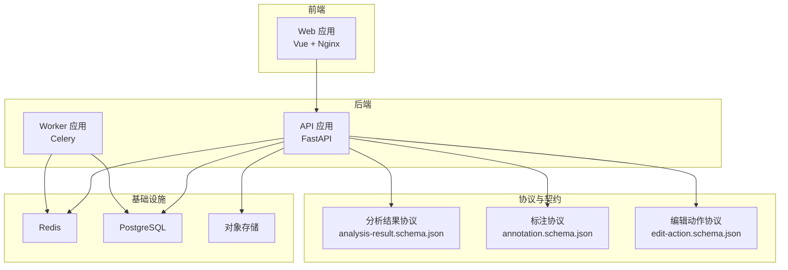
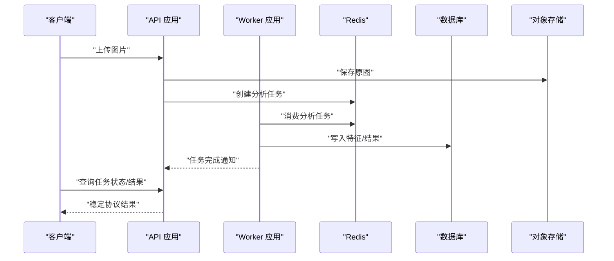
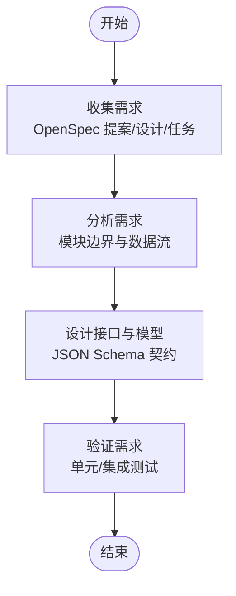
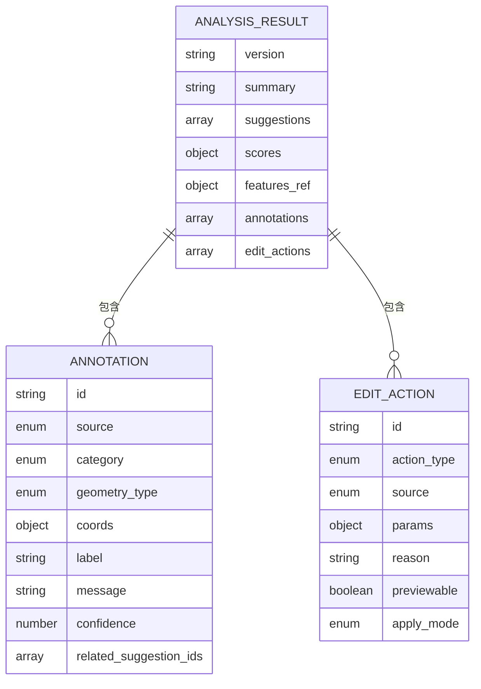
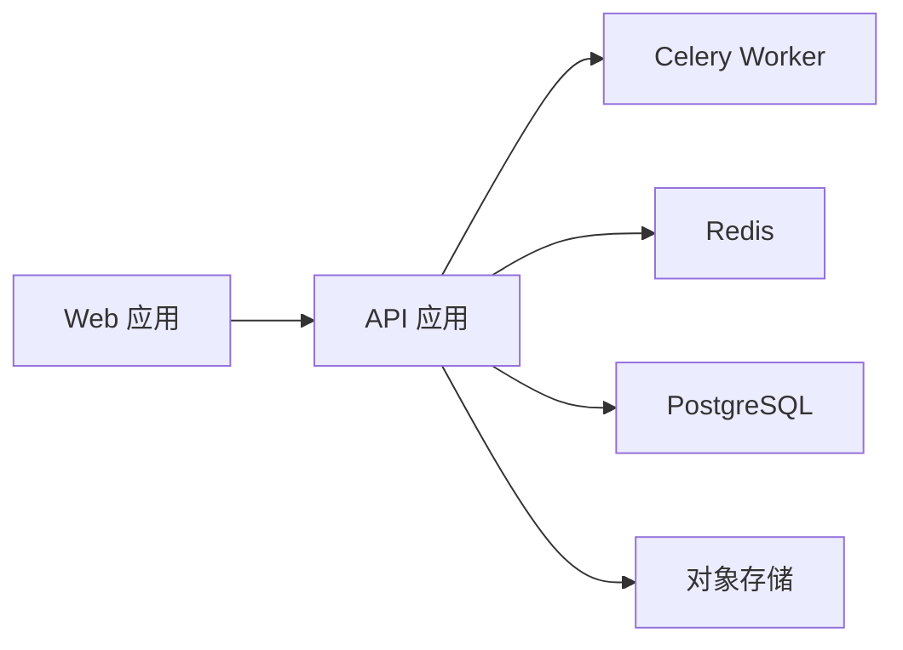

# 开放规范

<cite>
**本文引用的文件**
- [apps/api/app/main.py](file://apps/api/app/main.py)
- [apps/api/app/deps.py](file://apps/api/app/deps.py)
- [apps/api/app/core/celery_app.py](file://apps/api/app/core/celery_app.py)
- [apps/api/app/schemas/analysis.py](file://apps/api/app/schemas/analysis.py)
- [apps/api/app/schemas/auth.py](file://apps/api/app/schemas/auth.py)
- [apps/api/app/schemas/image.py](file://apps/api/app/schemas/image.py)
- [apps/api/Dockerfile](file://apps/api/Dockerfile)
- [apps/api/requirements.txt](file://apps/api/requirements.txt)
- [apps/web/Dockerfile](file://apps/web/Dockerfile)
- [apps/worker/Dockerfile](file://apps/worker/Dockerfile)
- [packages/contracts/analysis-result.schema.json](file://packages/contracts/analysis-result.schema.json)
- [packages/contracts/annotation.schema.json](file://packages/contracts/annotation.schema.json)
- [packages/contracts/edit-action.schema.json](file://packages/contracts/edit-action.schema.json)
- [docs/architecture-v2.md](file://docs/architecture-v2.md)
- [openspec/config.yaml](file://openspec/config.yaml)
</cite>

## 目录
1. [引言](#引言)
2. [项目结构](#项目结构)
3. [核心组件](#核心组件)
4. [架构总览](#架构总览)
5. [详细组件分析](#详细组件分析)
6. [依赖分析](#依赖分析)
7. [性能考虑](#性能考虑)
8. [故障排查指南](#故障排查指南)
9. [结论](#结论)
10. [附录](#附录)

## 引言
本开放规范面向“AI摄影教练”项目，旨在建立一套可演进、可协作、可验证的需求与设计规范。文档覆盖需求规格管理生命周期（收集、分析、设计、验证）、变更与版本控制策略、接口契约与数据模型规范、设计与实现文档编写标准、任务分配与进度跟踪方法、评审与验收流程、文档版本与发布策略，以及团队协作与沟通最佳实践。内容以代码仓库中的实际实现为依据，确保规范可落地、可追踪。

## 项目结构
项目采用多应用与多容器的分层组织方式：
- 后端 API 应用：FastAPI + SQLAlchemy + Celery 异步队列
- Web 前端应用：Vue + Vite 构建，Nginx 静态托管
- Worker 应用：独立 Celery Worker 容器，处理异步任务
- 协议与契约：JSON Schema 定义分析结果、标注与编辑动作的稳定协议
- 文档与规范：架构文档与 OpenSpec 配置，指导规范制定与执行

图表来源
- [apps/api/app/main.py:1-36](file://apps/api/app/main.py#L1-L36)
- [apps/api/app/core/celery_app.py:1-21](file://apps/api/app/core/celery_app.py#L1-L21)
- [apps/api/Dockerfile:1-23](file://apps/api/Dockerfile#L1-L23)
- [apps/web/Dockerfile:1-22](file://apps/web/Dockerfile#L1-L22)
- [apps/worker/Dockerfile:1-20](file://apps/worker/Dockerfile#L1-L20)
- [packages/contracts/analysis-result.schema.json:1-76](file://packages/contracts/analysis-result.schema.json#L1-L76)
- [packages/contracts/annotation.schema.json:1-60](file://packages/contracts/annotation.schema.json#L1-L60)
- [packages/contracts/edit-action.schema.json:1-30](file://packages/contracts/edit-action.schema.json#L1-L30)

章节来源
- [apps/api/app/main.py:1-36](file://apps/api/app/main.py#L1-L36)
- [apps/api/app/core/celery_app.py:1-21](file://apps/api/app/core/celery_app.py#L1-L21)
- [apps/api/Dockerfile:1-23](file://apps/api/Dockerfile#L1-L23)
- [apps/web/Dockerfile:1-22](file://apps/web/Dockerfile#L1-L22)
- [apps/worker/Dockerfile:1-20](file://apps/worker/Dockerfile#L1-L20)
- [packages/contracts/analysis-result.schema.json:1-76](file://packages/contracts/analysis-result.schema.json#L1-L76)
- [packages/contracts/annotation.schema.json:1-60](file://packages/contracts/annotation.schema.json#L1-L60)
- [packages/contracts/edit-action.schema.json:1-30](file://packages/contracts/edit-action.schema.json#L1-L30)

## 核心组件
- API 应用：提供认证、图片上传、分析任务创建与查询、用户管理等接口；内置 CORS 中间件与健康检查端点。
- Worker 应用：基于 Celery 的异步任务执行器，按队列执行分析任务。
- 协议与契约：通过 JSON Schema 明确分析结果、标注与编辑动作的结构与约束，保证前后端稳定协议。
- 前端应用：Vue 应用，构建后由 Nginx 提供静态托管。
- 基础设施：Redis 用于消息队列与结果缓存；PostgreSQL 用于持久化；对象存储用于图片资产。

章节来源
- [apps/api/app/main.py:1-36](file://apps/api/app/main.py#L1-L36)
- [apps/api/app/core/celery_app.py:1-21](file://apps/api/app/core/celery_app.py#L1-L21)
- [apps/api/Dockerfile:1-23](file://apps/api/Dockerfile#L1-L23)
- [apps/web/Dockerfile:1-22](file://apps/web/Dockerfile#L1-L22)
- [apps/worker/Dockerfile:1-20](file://apps/worker/Dockerfile#L1-L20)
- [packages/contracts/analysis-result.schema.json:1-76](file://packages/contracts/analysis-result.schema.json#L1-L76)
- [packages/contracts/annotation.schema.json:1-60](file://packages/contracts/annotation.schema.json#L1-L60)
- [packages/contracts/edit-action.schema.json:1-30](file://packages/contracts/edit-action.schema.json#L1-L30)

## 架构总览
系统遵循“CV 产出事实、LLM 产出解释、规则引擎产出可执行动作”的分层原则，通过异步任务链路串联特征提取、分析与结果合成，最终以稳定协议返回给前端。

图表来源
- [apps/api/app/main.py:1-36](file://apps/api/app/main.py#L1-L36)
- [apps/api/app/core/celery_app.py:1-21](file://apps/api/app/core/celery_app.py#L1-L21)
- [packages/contracts/analysis-result.schema.json:1-76](file://packages/contracts/analysis-result.schema.json#L1-L76)

章节来源
- [docs/architecture-v2.md:1-424](file://docs/architecture-v2.md#L1-L424)
- [apps/api/app/main.py:1-36](file://apps/api/app/main.py#L1-L36)
- [apps/api/app/core/celery_app.py:1-21](file://apps/api/app/core/celery_app.py#L1-L21)
- [packages/contracts/analysis-result.schema.json:1-76](file://packages/contracts/analysis-result.schema.json#L1-L76)

## 详细组件分析

### 需求规格管理流程
- 需求收集：通过 OpenSpec 配置与变更目录，沉淀提案、设计、任务清单与归档，形成可追溯的需求来源。
- 需求分析：结合架构文档，明确模块边界与数据流，确定任务拆分与依赖关系。
- 需求设计：以 JSON Schema 协议为契约，约束接口与数据模型，减少歧义。
- 需求验证：通过单元测试与集成测试，验证接口行为与数据一致性。

章节来源
- [openspec/config.yaml:1-21](file://openspec/config.yaml#L1-L21)
- [docs/architecture-v2.md:1-424](file://docs/architecture-v2.md#L1-L424)
- [packages/contracts/analysis-result.schema.json:1-76](file://packages/contracts/analysis-result.schema.json#L1-L76)
- [packages/contracts/annotation.schema.json:1-60](file://packages/contracts/annotation.schema.json#L1-L60)
- [packages/contracts/edit-action.schema.json:1-30](file://packages/contracts/edit-action.schema.json#L1-L30)

### 变更管理与版本控制策略
- 变更入口：通过 OpenSpec 变更目录进行规范化提交，包含提案、设计、任务与归档。
- 版本策略：以语义化版本管理协议文件与规范文档；每次重大协议变更需同步更新版本号与变更说明。
- 回滚机制：协议与契约采用 JSON Schema，便于在不破坏向后兼容的前提下进行增量演进。

章节来源
- [openspec/config.yaml:1-21](file://openspec/config.yaml#L1-L21)

### 接口契约定义与数据模型规范
- 分析结果协议：统一版本、摘要、建议、评分、标注与编辑动作的结构与约束。
- 标注协议：定义来源、类别、几何类型、坐标系、置信度与关联建议的标准化结构。
- 编辑动作协议：定义可执行的动作类型、参数、原因与应用模式。

图表来源
- [packages/contracts/analysis-result.schema.json:1-76](file://packages/contracts/analysis-result.schema.json#L1-L76)
- [packages/contracts/annotation.schema.json:1-60](file://packages/contracts/annotation.schema.json#L1-L60)
- [packages/contracts/edit-action.schema.json:1-30](file://packages/contracts/edit-action.schema.json#L1-L30)

章节来源
- [packages/contracts/analysis-result.schema.json:1-76](file://packages/contracts/analysis-result.schema.json#L1-L76)
- [packages/contracts/annotation.schema.json:1-60](file://packages/contracts/annotation.schema.json#L1-L60)
- [packages/contracts/edit-action.schema.json:1-30](file://packages/contracts/edit-action.schema.json#L1-L30)

### 设计文档与实现文档编写标准
- 设计文档：以架构文档为纲，明确分层、模块、数据流与协议契约，指导实现。
- 实现文档：围绕模块与路由，记录接口定义、请求/响应模型、依赖注入与中间件配置。
- 统一风格：使用一致的术语与结构，确保跨模块一致性。

章节来源
- [docs/architecture-v2.md:1-424](file://docs/architecture-v2.md#L1-L424)
- [apps/api/app/main.py:1-36](file://apps/api/app/main.py#L1-L36)
- [apps/api/app/deps.py:1-41](file://apps/api/app/deps.py#L1-L41)

### 任务分配与进度跟踪
- 任务拆分：以 OpenSpec 任务清单为依据，将需求拆解为可执行的任务块。
- 进度跟踪：通过任务清单与变更目录记录进展，结合 CI/CD 与容器化部署进行可视化跟踪。
- 评审与验收：以接口契约与测试用例为验收标准，确保交付质量。

章节来源
- [openspec/config.yaml:1-21](file://openspec/config.yaml#L1-L21)

### 评审与验收流程
- 评审：由技术负责人组织，依据设计文档与契约进行技术评审。
- 验收：以接口契约与测试用例为验收标准，确保功能正确与协议稳定。

章节来源
- [packages/contracts/analysis-result.schema.json:1-76](file://packages/contracts/analysis-result.schema.json#L1-L76)
- [apps/api/app/schemas/analysis.py:1-52](file://apps/api/app/schemas/analysis.py#L1-L52)
- [apps/api/app/schemas/auth.py:1-37](file://apps/api/app/schemas/auth.py#L1-L37)
- [apps/api/app/schemas/image.py:1-14](file://apps/api/app/schemas/image.py#L1-L14)

### 文档版本管理与发布策略
- 版本管理：协议文件与规范文档采用语义化版本，变更时更新版本号与变更日志。
- 发布策略：通过 CI/CD 自动化打包与部署，确保前后端与协议的一致性发布。

章节来源
- [packages/contracts/analysis-result.schema.json:1-76](file://packages/contracts/analysis-result.schema.json#L1-L76)
- [apps/api/Dockerfile:1-23](file://apps/api/Dockerfile#L1-L23)
- [apps/web/Dockerfile:1-22](file://apps/web/Dockerfile#L1-L22)
- [apps/worker/Dockerfile:1-20](file://apps/worker/Dockerfile#L1-L20)

### 团队协作与沟通最佳实践
- 规范先行：OpenSpec 配置与架构文档为团队提供共同语言与执行依据。
- 可追溯性：变更目录与任务清单确保每项工作可追踪、可审计。
- 协作工具：结合 Git 工作流与容器化部署，提升协作效率与交付稳定性。

章节来源
- [openspec/config.yaml:1-21](file://openspec/config.yaml#L1-L21)
- [docs/architecture-v2.md:1-424](file://docs/architecture-v2.md#L1-L424)

## 依赖分析
后端应用依赖关系清晰，API 应用通过中间件与路由聚合各模块，Celery Worker 仅依赖 Redis 与数据库，前端通过 Nginx 提供静态托管。

图表来源
- [apps/api/app/main.py:1-36](file://apps/api/app/main.py#L1-L36)
- [apps/api/app/core/celery_app.py:1-21](file://apps/api/app/core/celery_app.py#L1-L21)
- [apps/web/Dockerfile:1-22](file://apps/web/Dockerfile#L1-L22)

章节来源
- [apps/api/app/main.py:1-36](file://apps/api/app/main.py#L1-L36)
- [apps/api/app/core/celery_app.py:1-21](file://apps/api/app/core/celery_app.py#L1-L21)
- [apps/api/Dockerfile:1-23](file://apps/api/Dockerfile#L1-L23)
- [apps/web/Dockerfile:1-22](file://apps/web/Dockerfile#L1-L22)
- [apps/worker/Dockerfile:1-20](file://apps/worker/Dockerfile#L1-L20)

## 性能考虑
- 异步处理：通过 Celery 与 Redis 解耦 CPU 密集型任务，提升吞吐与响应性。
- 缓存与队列：合理设置队列与任务路由，避免热点任务阻塞。
- 存储优化：对象存储与数据库分离，降低 IO 压力。
- 前端静态化：Nginx 承载静态资源，减少后端压力。

## 故障排查指南
- 认证失败：检查 Bearer Token 是否有效与用户状态是否激活。
- 任务异常：查看任务状态与错误码，定位具体环节（特征提取/分析/合成）。
- 协议不匹配：核对协议版本与字段约束，确保前后端一致。

章节来源
- [apps/api/app/deps.py:1-41](file://apps/api/app/deps.py#L1-L41)
- [apps/api/app/schemas/analysis.py:1-52](file://apps/api/app/schemas/analysis.py#L1-L52)
- [packages/contracts/analysis-result.schema.json:1-76](file://packages/contracts/analysis-result.schema.json#L1-L76)

## 结论
本开放规范以架构文档与 JSON Schema 协议为核心，结合 OpenSpec 变更与任务管理，形成从需求到实现、从设计到验证的闭环。通过容器化与异步任务链路，确保系统可扩展、可维护与可演进。

## 附录
- 术语表：API 应用、Worker 应用、协议契约、异步任务、容器化部署
- 参考链接：架构文档、协议文件路径、Dockerfile 与 requirements.txt