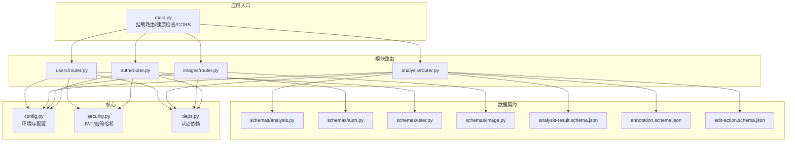
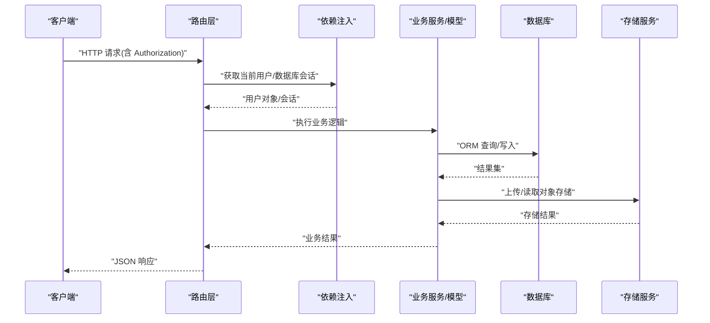
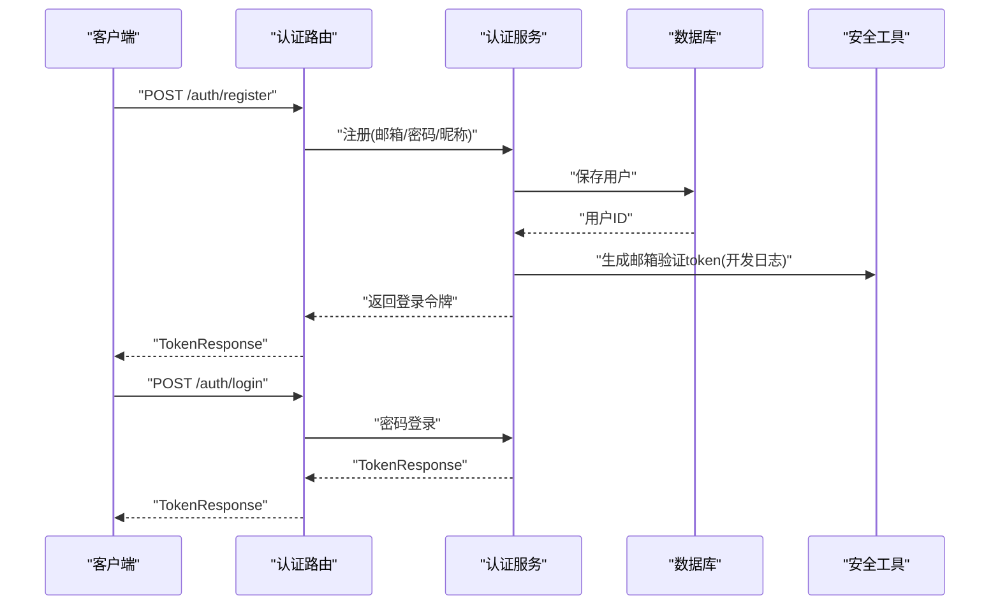
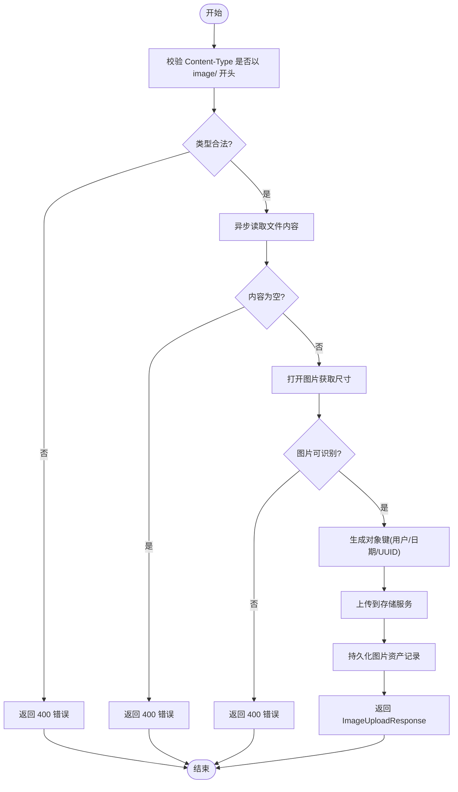
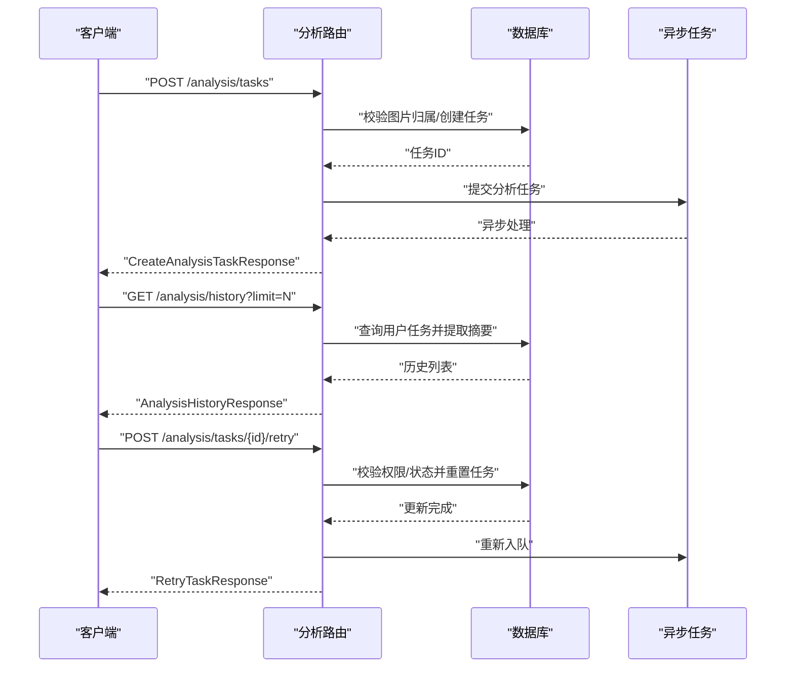
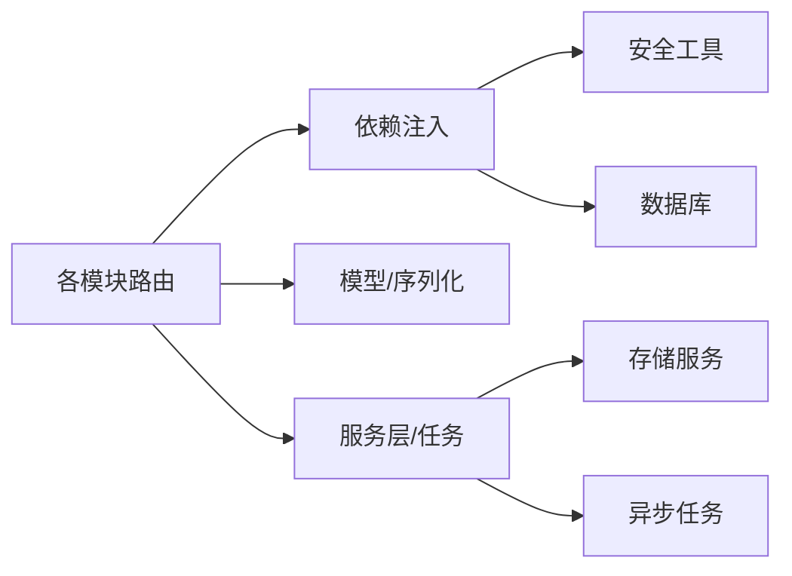

# 接口契约

<cite>
**本文引用的文件**
- [apps/api/app/main.py](file://apps/api/app/main.py)
- [apps/api/app/deps.py](file://apps/api/app/deps.py)
- [apps/api/app/core/config.py](file://apps/api/app/core/config.py)
- [apps/api/app/core/security.py](file://apps/api/app/core/security.py)
- [apps/api/app/schemas/analysis.py](file://apps/api/app/schemas/analysis.py)
- [apps/api/app/schemas/auth.py](file://apps/api/app/schemas/auth.py)
- [apps/api/app/schemas/user.py](file://apps/api/app/schemas/user.py)
- [apps/api/app/schemas/image.py](file://apps/api/app/schemas/image.py)
- [apps/api/app/modules/analysis/router.py](file://apps/api/app/modules/analysis/router.py)
- [apps/api/app/modules/auth/router.py](file://apps/api/app/modules/auth/router.py)
- [apps/api/app/modules/images/router.py](file://apps/api/app/modules/images/router.py)
- [apps/api/app/modules/users/router.py](file://apps/api/app/modules/users/router.py)
- [packages/contracts/analysis-result.schema.json](file://packages/contracts/analysis-result.schema.json)
- [packages/contracts/annotation.schema.json](file://packages/contracts/annotation.schema.json)
- [packages/contracts/edit-action.schema.json](file://packages/contracts/edit-action.schema.json)
</cite>

## 目录
1. [引言](#引言)
2. [项目结构](#项目结构)
3. [核心组件](#核心组件)
4. [架构总览](#架构总览)
5. [详细组件分析](#详细组件分析)
6. [依赖关系分析](#依赖关系分析)
7. [性能考虑](#性能考虑)
8. [故障排查指南](#故障排查指南)
9. [结论](#结论)
10. [附录](#附录)

## 引言
本接口契约文档面向“AI摄影教练”后端服务，系统化梳理REST API接口设计原则、数据传输格式与序列化标准、JSON Schema定义与验证规则、接口版本管理与向后兼容策略、错误码与异常处理规范、性能要求与限流策略、接口测试与模拟数据规范，以及接口文档生成与维护流程。目标是为前端与第三方集成提供清晰、一致、可演进的接口契约。

## 项目结构
后端采用FastAPI框架，按功能模块组织路由与业务逻辑，使用Pydantic进行请求/响应模型校验，并通过依赖注入实现认证与数据库访问。核心模块包括：
- 根应用与中间件：CORS、路由挂载、健康检查
- 认证模块：注册、登录、令牌刷新、邮箱验证、忘记/重置密码
- 图片模块：图片上传、存储与元数据记录
- 分析模块：分析任务创建、查询、历史与重试
- 用户模块：个人信息读取与更新、密码修改
- 核心配置与安全：环境变量、JWT密钥与过期策略、CORS白名单
- 数据契约：JSON Schema用于结果与标注等外部契约

图表来源
- [apps/api/app/main.py:1-36](file://apps/api/app/main.py#L1-L36)
- [apps/api/app/modules/auth/router.py:1-93](file://apps/api/app/modules/auth/router.py#L1-L93)
- [apps/api/app/modules/images/router.py:1-77](file://apps/api/app/modules/images/router.py#L1-L77)
- [apps/api/app/modules/analysis/router.py:1-151](file://apps/api/app/modules/analysis/router.py#L1-L151)
- [apps/api/app/modules/users/router.py:1-71](file://apps/api/app/modules/users/router.py#L1-L71)
- [apps/api/app/deps.py:1-41](file://apps/api/app/deps.py#L1-L41)
- [apps/api/app/core/security.py:1-72](file://apps/api/app/core/security.py#L1-L72)
- [apps/api/app/core/config.py:1-47](file://apps/api/app/core/config.py#L1-L47)
- [apps/api/app/schemas/analysis.py:1-52](file://apps/api/app/schemas/analysis.py#L1-L52)
- [apps/api/app/schemas/auth.py:1-37](file://apps/api/app/schemas/auth.py#L1-L37)
- [apps/api/app/schemas/user.py:1-30](file://apps/api/app/schemas/user.py#L1-L30)
- [apps/api/app/schemas/image.py:1-14](file://apps/api/app/schemas/image.py#L1-L14)
- [packages/contracts/analysis-result.schema.json](file://packages/contracts/analysis-result.schema.json)
- [packages/contracts/annotation.schema.json](file://packages/contracts/annotation.schema.json)
- [packages/contracts/edit-action.schema.json](file://packages/contracts/edit-action.schema.json)

章节来源
- [apps/api/app/main.py:1-36](file://apps/api/app/main.py#L1-L36)
- [apps/api/app/core/config.py:1-47](file://apps/api/app/core/config.py#L1-L47)

## 核心组件
- 应用入口与中间件
  - 挂载四个模块路由，统一前缀为配置项
  - 启动事件初始化数据库
  - 健康检查端点
  - CORS跨域配置基于环境变量
- 认证与授权
  - Bearer Token依赖注入，未提供或无效/过期时返回401
  - 密码哈希与校验采用bcrypt
  - JWT载荷包含sub与类型(type)，支持access/refresh两类令牌
- 数据模型与序列化
  - 使用Pydantic模型定义请求/响应字段与约束
  - 字段级校验（如最小长度、最大长度、Email格式）
  - 时间字段统一为UTC时区
- 存储与图片处理
  - 仅允许image/*类型文件
  - 读取图片尺寸，计算SHA256指纹
  - 对象键按用户ID/日期/UUID命名，便于归档与检索

章节来源
- [apps/api/app/main.py:1-36](file://apps/api/app/main.py#L1-L36)
- [apps/api/app/deps.py:1-41](file://apps/api/app/deps.py#L1-L41)
- [apps/api/app/core/security.py:1-72](file://apps/api/app/core/security.py#L1-L72)
- [apps/api/app/schemas/auth.py:1-37](file://apps/api/app/schemas/auth.py#L1-L37)
- [apps/api/app/schemas/user.py:1-30](file://apps/api/app/schemas/user.py#L1-L30)
- [apps/api/app/schemas/image.py:1-14](file://apps/api/app/schemas/image.py#L1-L14)
- [apps/api/app/modules/images/router.py:1-77](file://apps/api/app/modules/images/router.py#L1-L77)

## 架构总览
下图展示API调用链路与关键组件交互：客户端通过Bearer Token访问受保护端点；路由层解析请求并调用服务层；依赖注入提供数据库会话与当前用户；最终返回标准化的JSON响应。

图表来源
- [apps/api/app/modules/analysis/router.py:1-151](file://apps/api/app/modules/analysis/router.py#L1-L151)
- [apps/api/app/modules/auth/router.py:1-93](file://apps/api/app/modules/auth/router.py#L1-L93)
- [apps/api/app/modules/images/router.py:1-77](file://apps/api/app/modules/images/router.py#L1-L77)
- [apps/api/app/modules/users/router.py:1-71](file://apps/api/app/modules/users/router.py#L1-L71)
- [apps/api/app/deps.py:1-41](file://apps/api/app/deps.py#L1-L41)
- [apps/api/app/core/security.py:1-72](file://apps/api/app/core/security.py#L1-L72)

## 详细组件分析

### 认证与授权接口
- 设计原则
  - 所有受保护端点需携带Bearer Token
  - 令牌类型区分access/refresh，过期时间由配置控制
  - 密码修改需校验当前密码
- 数据契约
  - 注册/登录/刷新/忘记/重置密码请求模型
  - 令牌响应模型包含access_token、refresh_token与token_type
- 错误处理
  - 未认证/无效/过期令牌统一返回401
  - 密码不匹配返回400
- 性能与安全
  - bcrypt哈希，避免明文存储
  - access_token短期有效，refresh_token较长有效期

图表来源
- [apps/api/app/modules/auth/router.py:1-93](file://apps/api/app/modules/auth/router.py#L1-L93)
- [apps/api/app/schemas/auth.py:1-37](file://apps/api/app/schemas/auth.py#L1-L37)
- [apps/api/app/core/security.py:1-72](file://apps/api/app/core/security.py#L1-L72)

章节来源
- [apps/api/app/modules/auth/router.py:1-93](file://apps/api/app/modules/auth/router.py#L1-L93)
- [apps/api/app/schemas/auth.py:1-37](file://apps/api/app/schemas/auth.py#L1-L37)
- [apps/api/app/core/security.py:1-72](file://apps/api/app/core/security.py#L1-L72)

### 图片上传接口
- 设计原则
  - 仅接受图像文件，拒绝空内容
  - 读取图片宽高，计算SHA256指纹
  - 对象键按用户ID/日期/UUID组织，确保唯一性与可归档性
- 数据契约
  - 上传成功返回image_id、mime_type、size_bytes、width、height、object_key
- 错误处理
  - 非图像类型、空文件、无法识别的图片均返回400
- 性能与安全
  - 异步读取文件内容，避免阻塞
  - 严格校验Content-Type与文件扩展名

图表来源
- [apps/api/app/modules/images/router.py:1-77](file://apps/api/app/modules/images/router.py#L1-L77)
- [apps/api/app/schemas/image.py:1-14](file://apps/api/app/schemas/image.py#L1-L14)

章节来源
- [apps/api/app/modules/images/router.py:1-77](file://apps/api/app/modules/images/router.py#L1-L77)
- [apps/api/app/schemas/image.py:1-14](file://apps/api/app/schemas/image.py#L1-L14)

### 分析任务接口
- 设计原则
  - 任务创建后立即入队异步处理
  - 详情查询包含任务状态、尝试次数、错误信息与结果JSON
  - 历史列表支持分页与摘要提取
  - 仅允许对本人任务进行操作
- 数据契约
  - 创建任务请求/响应、任务详情、历史条目、重试响应
- 错误处理
  - 任务不存在/无权限返回404/403
  - 运行中任务不可重试返回400
- 性能与可靠性
  - 任务状态机：PENDING/RUNNING/SUCCEEDED/FAILED
  - 失败任务可重试，重置错误字段并重新入队

图表来源
- [apps/api/app/modules/analysis/router.py:1-151](file://apps/api/app/modules/analysis/router.py#L1-L151)
- [apps/api/app/schemas/analysis.py:1-52](file://apps/api/app/schemas/analysis.py#L1-L52)

章节来源
- [apps/api/app/modules/analysis/router.py:1-151](file://apps/api/app/modules/analysis/router.py#L1-L151)
- [apps/api/app/schemas/analysis.py:1-52](file://apps/api/app/schemas/analysis.py#L1-L52)

### 用户资料接口
- 设计原则
  - 个人信息读取与更新需携带有效Bearer Token
  - 更新字段支持昵称与头像URL
  - 修改密码需校验当前密码且新密码长度≥8
- 数据契约
  - 用户资料模型、更新请求模型、修改密码请求模型
- 错误处理
  - OAuth账户不可修改密码返回400
  - 当前密码错误返回400

章节来源
- [apps/api/app/modules/users/router.py:1-71](file://apps/api/app/modules/users/router.py#L1-L71)
- [apps/api/app/schemas/user.py:1-30](file://apps/api/app/schemas/user.py#L1-L30)

## 依赖关系分析
- 组件耦合
  - 路由层依赖依赖注入与安全工具，降低与具体服务层耦合
  - 数据模型与序列化通过Pydantic集中管理，提升一致性
- 外部依赖
  - 数据库：SQLAlchemy ORM
  - 存储：MinIO兼容的对象存储
  - 异步任务：Celery（通过任务模块触发）
- 可能的循环依赖
  - 未发现直接循环导入；路由与依赖注入分离良好

图表来源
- [apps/api/app/deps.py:1-41](file://apps/api/app/deps.py#L1-L41)
- [apps/api/app/core/security.py:1-72](file://apps/api/app/core/security.py#L1-L72)
- [apps/api/app/modules/analysis/router.py:1-151](file://apps/api/app/modules/analysis/router.py#L1-L151)
- [apps/api/app/modules/images/router.py:1-77](file://apps/api/app/modules/images/router.py#L1-L77)
- [apps/api/app/modules/auth/router.py:1-93](file://apps/api/app/modules/auth/router.py#L1-L93)
- [apps/api/app/modules/users/router.py:1-71](file://apps/api/app/modules/users/router.py#L1-L71)

章节来源
- [apps/api/app/deps.py:1-41](file://apps/api/app/deps.py#L1-L41)
- [apps/api/app/core/security.py:1-72](file://apps/api/app/core/security.py#L1-L72)

## 性能考虑
- 接口性能要求
  - 上传接口：建议限制单次上传大小（例如10MB以内），并提供分片上传能力（扩展点）
  - 分析接口：异步处理，避免阻塞；对高频重试场景增加退避策略
- 限流策略
  - 建议在网关或应用层实现基于IP/用户维度的速率限制
  - 短期内对登录/验证码相关接口实施更严格限流
- 缓存与索引
  - 分析历史列表按创建时间倒序，建议在created_at上建立索引
  - 结果摘要提取可缓存热点任务的摘要字段

[本节为通用性能指导，无需特定文件来源]

## 故障排查指南
- 常见错误码
  - 400：请求参数非法（非图像文件、空文件、密码长度不足、当前密码错误等）
  - 401：未认证/令牌无效/已过期
  - 403：无权限访问他人资源
  - 404：任务/图片不存在
  - 500：服务器内部错误
- 排查步骤
  - 检查Authorization头是否为Bearer Token
  - 校验令牌类型与有效期
  - 确认资源归属（用户ID匹配）
  - 查看任务状态与错误码
- 日志与监控
  - 认证与鉴权路径输出必要日志（开发环境）
  - 异常捕获与结构化错误响应

章节来源
- [apps/api/app/deps.py:1-41](file://apps/api/app/deps.py#L1-L41)
- [apps/api/app/modules/analysis/router.py:1-151](file://apps/api/app/modules/analysis/router.py#L1-L151)
- [apps/api/app/modules/images/router.py:1-77](file://apps/api/app/modules/images/router.py#L1-L77)
- [apps/api/app/modules/users/router.py:1-71](file://apps/api/app/modules/users/router.py#L1-L71)

## 结论
本接口契约明确了AI摄影教练后端的接口设计原则、数据契约、错误处理与性能策略。通过Pydantic模型与依赖注入实现强一致的输入输出与认证机制；通过异步任务与对象存储支撑高并发与可扩展的分析能力。建议在生产环境中完善限流、缓存与可观测性，并持续演进接口版本与向后兼容策略。

[本节为总结性内容，无需特定文件来源]

## 附录

### 接口版本管理与向后兼容
- 版本策略
  - 路径前缀统一为/api/v1，未来升级至/api/v2时保留v1不变
  - 新增端点优先在现有前缀下扩展，避免破坏既有契约
- 兼容性原则
  - 不删除或变更已有字段类型
  - 新增字段默认可选并提供默认值
  - 对于破坏性变更，提供迁移指引与过渡期

章节来源
- [apps/api/app/core/config.py:1-47](file://apps/api/app/core/config.py#L1-L47)
- [apps/api/app/main.py:1-36](file://apps/api/app/main.py#L1-L36)

### 数据传输格式与序列化标准
- 内容类型
  - JSON：application/json
  - 表单上传：multipart/form-data
- 时间与时区
  - 统一使用UTC时间
- 字段命名
  - 驼峰命名（camelCase）用于JSON键
- 分页与排序
  - 历史列表支持limit参数（1~100）

章节来源
- [apps/api/app/modules/analysis/router.py:1-151](file://apps/api/app/modules/analysis/router.py#L1-L151)
- [apps/api/app/schemas/analysis.py:1-52](file://apps/api/app/schemas/analysis.py#L1-L52)

### JSON Schema定义与验证规则
- 分析结果Schema
  - 用于描述分析结果的JSON结构，包含评分、建议、摘要等字段
- 标注Schema
  - 描述图像标注的数据结构，包含坐标、类别、置信度等
- 编辑动作Schema
  - 描述编辑建议的动作结构，包含调整项与参数
- 验证方式
  - 前端/集成侧可使用对应Schema进行本地校验
  - 后端仍以Pydantic模型作为最终校验

章节来源
- [packages/contracts/analysis-result.schema.json](file://packages/contracts/analysis-result.schema.json)
- [packages/contracts/annotation.schema.json](file://packages/contracts/annotation.schema.json)
- [packages/contracts/edit-action.schema.json](file://packages/contracts/edit-action.schema.json)

### 接口测试与模拟数据规范
- 测试策略
  - 单元测试：针对路由与服务层的关键分支
  - 集成测试：端到端覆盖认证、上传、分析与用户资料
- 模拟数据
  - 使用固定UUID与时间戳，确保可重复性
  - 使用Mock存储与任务后端，避免真实依赖
- 建议工具
  - pytest + pytest-mock
  - Swagger/OpenAPI文档驱动的自动化测试

章节来源
- [apps/api/app/tests/test_auth.py](file://apps/api/app/tests/test_auth.py)
- [apps/api/app/tests/test_security.py](file://apps/api/app/tests/test_security.py)
- [apps/api/app/tests/test_users.py](file://apps/api/app/tests/test_users.py)

### 接口文档生成与维护流程
- 文档生成
  - 利用FastAPI自动生成OpenAPI规范
  - 通过Swagger UI或Redoc进行浏览
- 维护流程
  - 变更路由/模型时同步更新Schema与示例
  - 在变更日志中标注破坏性变更与迁移说明
- 合规性
  - 保持与JSON Schema的一致性
  - 对外发布前进行一致性校验

章节来源
- [apps/api/app/main.py:1-36](file://apps/api/app/main.py#L1-L36)
- [apps/api/app/core/config.py:1-47](file://apps/api/app/core/config.py#L1-L47)