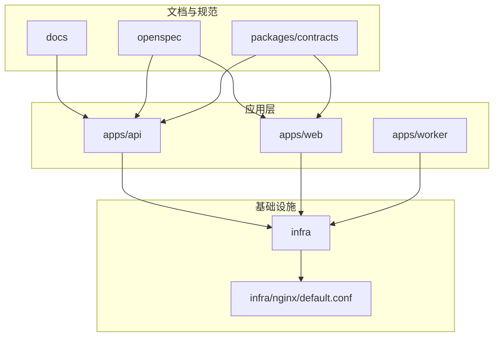
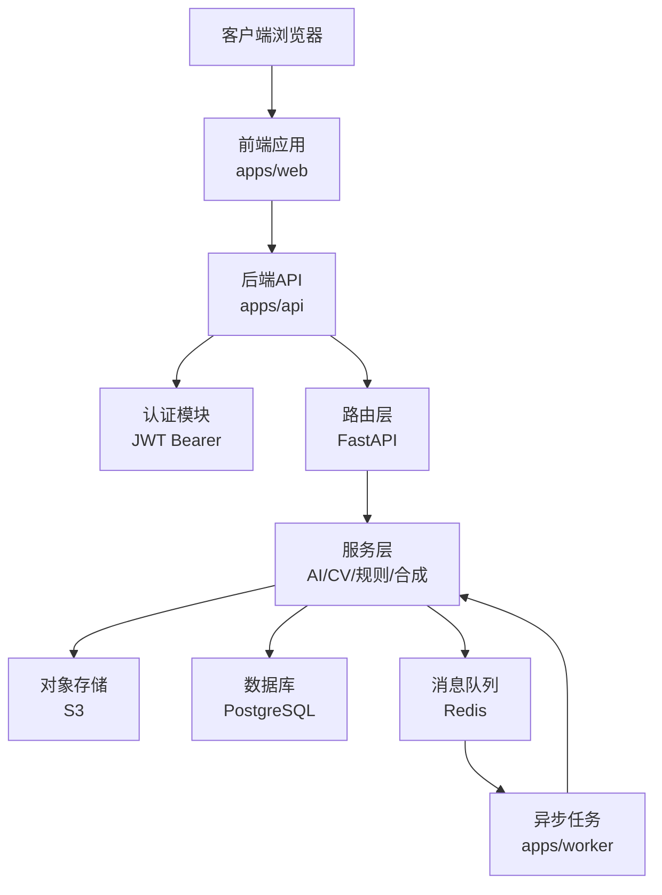
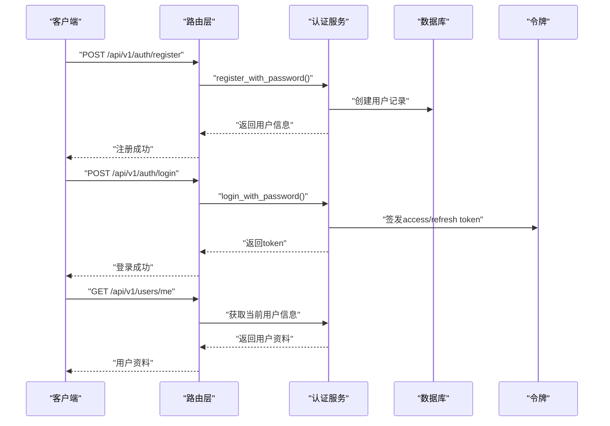
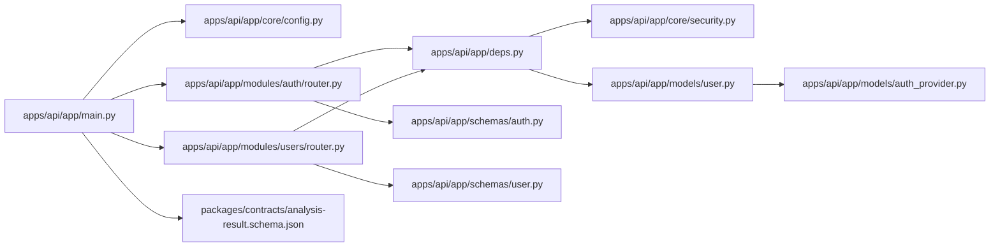

# 文档标准

<cite>
**本文引用的文件**
- [apps/api/app/main.py](file://apps/api/app/main.py)
- [apps/api/app/deps.py](file://apps/api/app/deps.py)
- [apps/api/app/core/config.py](file://apps/api/app/core/config.py)
- [apps/api/app/core/security.py](file://apps/api/app/core/security.py)
- [apps/api/app/models/user.py](file://apps/api/app/models/user.py)
- [apps/api/app/models/auth_provider.py](file://apps/api/app/models/auth_provider.py)
- [apps/api/app/modules/auth/service.py](file://apps/api/app/modules/auth/service.py)
- [apps/api/app/modules/auth/router.py](file://apps/api/app/modules/auth/router.py)
- [apps/api/app/modules/users/router.py](file://apps/api/app/modules/users/router.py)
- [apps/api/app/schemas/auth.py](file://apps/api/app/schemas/auth.py)
- [apps/api/app/schemas/user.py](file://apps/api/app/schemas/user.py)
- [apps/api/Dockerfile](file://apps/api/Dockerfile)
- [apps/web/Dockerfile](file://apps/web/Dockerfile)
- [docs/architecture-v2.md](file://docs/architecture-v2.md)
- [openspec/config.yaml](file://openspec/config.yaml)
- [openspec/changes/add-user-auth/.openspec.yaml](file://openspec/changes/add-user-auth/.openspec.yaml)
- [openspec/changes/add-user-auth/proposal.md](file://openspec/changes/add-user-auth/proposal.md)
- [openspec/changes/add-user-auth/design.md](file://openspec/changes/add-user-auth/design.md)
- [openspec/changes/add-user-auth/tasks.md](file://openspec/changes/add-user-auth/tasks.md)
- [packages/contracts/analysis-result.schema.json](file://packages/contracts/analysis-result.schema.json)
- [packages/contracts/annotation.schema.json](file://packages/contracts/annotation.schema.json)
- [packages/contracts/edit-action.schema.json](file://packages/contracts/edit-action.schema.json)
</cite>

## 目录
1. [引言](#引言)
2. [项目结构](#项目结构)
3. [核心组件](#核心组件)
4. [架构总览](#架构总览)
5. [详细组件分析](#详细组件分析)
6. [依赖关系分析](#依赖关系分析)
7. [性能考虑](#性能考虑)
8. [故障排查指南](#故障排查指南)
9. [结论](#结论)
10. [附录](#附录)

## 引言
本文件为“AI摄影教练”项目制定统一的文档标准与规范，覆盖技术文档模板、命名约定、目录结构、版本控制与更新策略、审查与批准流程、质量评估与验收标准、自动化生成与维护工具、协作与共享最佳实践以及归档与长期保存策略。其目标是确保项目文档与代码同样具备可维护性、一致性与可演进性。

## 项目结构
项目采用多仓多应用的组织方式，包含后端API、前端Web、Worker异步任务、基础设施脚本、架构与规范文档、契约Schema等。核心目录与职责如下：
- apps/api：FastAPI后端服务，包含核心配置、依赖注入、认证与用户模块、分析与图片模块、服务层与任务队列集成。
- apps/web：Vue3前端应用，包含API封装、状态管理、路由与视图。
- apps/worker：异步任务容器，承载Celery任务执行。
- infra：部署与Nginx配置。
- docs：架构与设计文档。
- openspec：规范驱动变更的提案、设计、任务清单与归档。
- packages/contracts：前后端稳定协议的JSON Schema契约。

图表来源
- [apps/api/app/main.py:1-36](file://apps/api/app/main.py#L1-L36)
- [apps/web/Dockerfile:1-22](file://apps/web/Dockerfile#L1-L22)
- [apps/api/Dockerfile:1-23](file://apps/api/Dockerfile#L1-L23)
- [docs/architecture-v2.md:73-105](file://docs/architecture-v2.md#L73-L105)
- [openspec/config.yaml:1-21](file://openspec/config.yaml#L1-L21)

章节来源
- [apps/api/app/main.py:1-36](file://apps/api/app/main.py#L1-L36)
- [apps/web/Dockerfile:1-22](file://apps/web/Dockerfile#L1-L22)
- [apps/api/Dockerfile:1-23](file://apps/api/Dockerfile#L1-L23)
- [docs/architecture-v2.md:73-105](file://docs/architecture-v2.md#L73-L105)
- [openspec/config.yaml:1-21](file://openspec/config.yaml#L1-L21)

## 核心组件
- 认证与授权：基于JWT的Bearer Token认证，提供注册、登录、刷新、登出、邮箱验证与密码重置能力，并通过依赖注入在路由层透明替换原有的X-User-Id机制。
- 用户资料：提供用户信息查看与编辑、修改密码等能力。
- API网关与路由：统一CORS配置、路由前缀与健康检查端点。
- 配置中心：集中管理数据库、缓存、对象存储、S3、JWT等配置项。
- 协议契约：以JSON Schema定义分析结果、标注与编辑动作的稳定协议，确保前后端一致。

章节来源
- [apps/api/app/deps.py:1-41](file://apps/api/app/deps.py#L1-L41)
- [apps/api/app/core/security.py](file://apps/api/app/core/security.py)
- [apps/api/app/modules/auth/service.py](file://apps/api/app/modules/auth/service.py)
- [apps/api/app/modules/auth/router.py](file://apps/api/app/modules/auth/router.py)
- [apps/api/app/modules/users/router.py](file://apps/api/app/modules/users/router.py)
- [apps/api/app/schemas/auth.py](file://apps/api/app/schemas/auth.py)
- [apps/api/app/schemas/user.py](file://apps/api/app/schemas/user.py)
- [apps/api/app/core/config.py:1-47](file://apps/api/app/core/config.py#L1-L47)
- [packages/contracts/analysis-result.schema.json:1-76](file://packages/contracts/analysis-result.schema.json#L1-L76)

## 架构总览
系统采用前后端分离与异步任务解耦的设计：前端通过HTTP与后端交互，后端通过Celery与Redis进行异步任务编排，对象存储用于图片资产的持久化。认证层统一接入，路由层按模块划分，服务层按AI/CV/规则/合成拆分，确保职责清晰与可扩展。

图表来源
- [apps/api/app/main.py:1-36](file://apps/api/app/main.py#L1-L36)
- [apps/api/app/deps.py:1-41](file://apps/api/app/deps.py#L1-L41)
- [apps/api/app/core/config.py:13-20](file://apps/api/app/core/config.py#L13-L20)
- [apps/api/Dockerfile:1-23](file://apps/api/Dockerfile#L1-L23)
- [apps/web/Dockerfile:1-22](file://apps/web/Dockerfile#L1-L22)
- [docs/architecture-v2.md:39-71](file://docs/architecture-v2.md#L39-L71)

章节来源
- [apps/api/app/main.py:1-36](file://apps/api/app/main.py#L1-L36)
- [apps/api/app/deps.py:1-41](file://apps/api/app/deps.py#L1-L41)
- [apps/api/app/core/config.py:13-20](file://apps/api/app/core/config.py#L13-L20)
- [apps/api/Dockerfile:1-23](file://apps/api/Dockerfile#L1-L23)
- [apps/web/Dockerfile:1-22](file://apps/web/Dockerfile#L1-L22)
- [docs/architecture-v2.md:39-71](file://docs/architecture-v2.md#L39-L71)

## 详细组件分析

### 认证与授权模块
- 目标：以JWT Bearer Token替换X-User-Id，提供完整的注册、登录、Token刷新、登出、邮箱验证与密码重置能力。
- 关键实现要点：
  - 依赖注入：通过HTTPBearer与verify_token完成令牌校验，保持get_current_user_id接口签名不变。
  - 用户模型扩展：新增昵称、头像、激活状态、邮箱验证标记，密码字段设为nullable以支持OAuth用户。
  - 认证服务：封装注册、登录、刷新、验证、重置等流程。
  - 路由与Schema：提供/auth与/users相关端点与数据结构。
  - 配置：JWT算法、过期时间、密钥等集中管理。

图表来源
- [apps/api/app/deps.py:15-41](file://apps/api/app/deps.py#L15-L41)
- [apps/api/app/modules/auth/service.py](file://apps/api/app/modules/auth/service.py)
- [apps/api/app/modules/auth/router.py](file://apps/api/app/modules/auth/router.py)
- [apps/api/app/schemas/auth.py](file://apps/api/app/schemas/auth.py)
- [apps/api/app/models/user.py](file://apps/api/app/models/user.py)
- [apps/api/app/core/security.py](file://apps/api/app/core/security.py)

章节来源
- [apps/api/app/deps.py:1-41](file://apps/api/app/deps.py#L1-L41)
- [apps/api/app/modules/auth/service.py](file://apps/api/app/modules/auth/service.py)
- [apps/api/app/modules/auth/router.py](file://apps/api/app/modules/auth/router.py)
- [apps/api/app/schemas/auth.py](file://apps/api/app/schemas/auth.py)
- [apps/api/app/models/user.py](file://apps/api/app/models/user.py)
- [apps/api/app/core/security.py](file://apps/api/app/core/security.py)

### 用户资料模块
- 目标：提供用户资料查看与编辑、修改密码能力。
- 关键实现要点：
  - Schema定义：UserProfile、UpdateProfileRequest、ChangePasswordRequest。
  - 路由：GET /users/me、PATCH /users/me、POST /users/me/change-password。
  - 依赖注入：通过get_current_user获取当前用户上下文。

章节来源
- [apps/api/app/modules/users/router.py](file://apps/api/app/modules/users/router.py)
- [apps/api/app/schemas/user.py](file://apps/api/app/schemas/user.py)
- [apps/api/app/deps.py:36-41](file://apps/api/app/deps.py#L36-L41)

### API网关与路由
- 目标：统一CORS、路由前缀、健康检查与模块化路由注册。
- 关键实现要点：
  - CORS中间件：允许指定源列表。
  - 路由前缀：/api/v1。
  - 模块化注册：images、analysis、auth、users四个模块路由。
  - 健康检查：/healthz。

章节来源
- [apps/api/app/main.py:1-36](file://apps/api/app/main.py#L1-L36)

### 配置中心
- 目标：集中管理数据库、缓存、对象存储、S3、JWT等配置。
- 关键实现要点：
  - 环境变量加载：.env文件。
  - 配置项：db_url、redis_url、s3_*、jwt_*、cors_origins等。
  - 工具属性：cors_origin_list。

章节来源
- [apps/api/app/core/config.py:1-47](file://apps/api/app/core/config.py#L1-L47)

### 协议契约
- 目标：以JSON Schema定义分析结果、标注与编辑动作的稳定协议，确保前后端一致。
- 关键实现要点：
  - AnalysisResult：version、summary、suggestions、scores、annotations、edit_actions。
  - Annotation：id、source、category、geometry_type、coords、label、message、confidence、related_suggestion_ids。
  - EditAction：id、action_type、source、params、reason、previewable、apply_mode。

章节来源
- [packages/contracts/analysis-result.schema.json:1-76](file://packages/contracts/analysis-result.schema.json#L1-L76)
- [packages/contracts/annotation.schema.json](file://packages/contracts/annotation.schema.json)
- [packages/contracts/edit-action.schema.json](file://packages/contracts/edit-action.schema.json)

### 规范驱动变更（OpenSpec）
- 目标：以规范驱动的方式管理需求、设计、任务与归档，确保变更可追踪、可审计。
- 关键实现要点：
  - 配置：spec-driven模式与artifact规则。
  - 变更：add-user-auth提案、设计、任务清单与归档。
  - 元数据：.openspec.yaml记录创建日期。

章节来源
- [openspec/config.yaml:1-21](file://openspec/config.yaml#L1-L21)
- [openspec/changes/add-user-auth/.openspec.yaml:1-3](file://openspec/changes/add-user-auth/.openspec.yaml#L1-L3)
- [openspec/changes/add-user-auth/proposal.md:1-35](file://openspec/changes/add-user-auth/proposal.md#L1-L35)
- [openspec/changes/add-user-auth/design.md:1-102](file://openspec/changes/add-user-auth/design.md#L1-L102)
- [openspec/changes/add-user-auth/tasks.md:1-54](file://openspec/changes/add-user-auth/tasks.md#L1-L54)

## 依赖关系分析
- 组件内聚与耦合：
  - 认证模块与路由层通过依赖注入解耦，便于替换与测试。
  - 服务层按功能拆分，降低模块间耦合。
- 外部依赖：
  - FastAPI、SQLAlchemy、Celery、Redis、PostgreSQL、Boto3、Pillow等。
- 接口契约：
  - JSON Schema契约确保前后端协议稳定，减少沟通成本。

图表来源
- [apps/api/app/main.py:1-36](file://apps/api/app/main.py#L1-L36)
- [apps/api/app/deps.py:1-41](file://apps/api/app/deps.py#L1-L41)
- [apps/api/app/core/config.py:1-47](file://apps/api/app/core/config.py#L1-L47)
- [apps/api/app/core/security.py](file://apps/api/app/core/security.py)
- [apps/api/app/modules/auth/router.py](file://apps/api/app/modules/auth/router.py)
- [apps/api/app/modules/users/router.py](file://apps/api/app/modules/users/router.py)
- [apps/api/app/schemas/auth.py](file://apps/api/app/schemas/auth.py)
- [apps/api/app/schemas/user.py](file://apps/api/app/schemas/user.py)
- [apps/api/app/models/user.py](file://apps/api/app/models/user.py)
- [apps/api/app/models/auth_provider.py](file://apps/api/app/models/auth_provider.py)
- [packages/contracts/analysis-result.schema.json:1-76](file://packages/contracts/analysis-result.schema.json#L1-L76)

章节来源
- [apps/api/app/main.py:1-36](file://apps/api/app/main.py#L1-L36)
- [apps/api/app/deps.py:1-41](file://apps/api/app/deps.py#L1-L41)
- [apps/api/app/core/config.py:1-47](file://apps/api/app/core/config.py#L1-L47)
- [apps/api/app/core/security.py](file://apps/api/app/core/security.py)
- [apps/api/app/modules/auth/router.py](file://apps/api/app/modules/auth/router.py)
- [apps/api/app/modules/users/router.py](file://apps/api/app/modules/users/router.py)
- [apps/api/app/schemas/auth.py](file://apps/api/app/schemas/auth.py)
- [apps/api/app/schemas/user.py](file://apps/api/app/schemas/user.py)
- [apps/api/app/models/user.py](file://apps/api/app/models/user.py)
- [apps/api/app/models/auth_provider.py](file://apps/api/app/models/auth_provider.py)
- [packages/contracts/analysis-result.schema.json:1-76](file://packages/contracts/analysis-result.schema.json#L1-L76)

## 性能考虑
- 异步任务：利用Celery与Redis解耦重型计算，提升吞吐与稳定性。
- 对象存储：S3分桶与多类型资产（原图、缩略图、预览、编辑结果）分离，便于缓存与CDN加速。
- 数据库：合理索引与查询优化，避免在热点路径上执行复杂JOIN。
- 前端构建：多阶段Docker构建与Nginx静态托管，减少运行时开销。
- 认证：短寿命Access Token与刷新Token策略降低泄露风险与服务端压力。

## 故障排查指南
- 认证失败：检查Authorization头是否为Bearer Token，核对JWT密钥与算法配置，确认用户状态为激活。
- 路由问题：确认路由前缀与模块注册，检查CORS配置是否允许当前源。
- 任务异常：检查Redis连接、Celery worker状态与日志，确认任务类型与幂等键设置。
- 存储异常：核对S3端点、凭证与桶名，确认对象Key与MIME类型正确。
- 健康检查：/healthz返回ok表示服务正常，否则逐项排查依赖服务。

章节来源
- [apps/api/app/deps.py:15-41](file://apps/api/app/deps.py#L15-L41)
- [apps/api/app/core/config.py:13-20](file://apps/api/app/core/config.py#L13-L20)
- [apps/api/app/main.py:32-35](file://apps/api/app/main.py#L32-L35)

## 结论
通过建立统一的文档标准与规范，结合规范驱动的变更管理、稳定的协议契约与清晰的架构分层，项目能够在快速迭代的同时保证文档与代码的质量、一致性与可维护性。建议持续完善自动化工具链与审查流程，确保文档与代码同步演进。

## 附录

### A. 技术文档模板与格式要求
- 架构设计文档
  - 标题：项目名称 + 版本 + 设计主题（如“架构设计 V2”）
  - 内容：目标、推荐分层、目录结构、数据库设计、稳定结果协议、标注协议、编辑动作协议、处理流程、迭代计划、实际结论
  - 示例参考：[docs/architecture-v2.md](file://docs/architecture-v2.md)
- 规范驱动变更文档
  - 标题：变更主题（如“添加用户认证”）
  - 内容：Why、What Changes、Capabilities、Impact、Goals/Non-Goals、Decisions、Risks/Trade-offs、Migration Plan、Open Questions
  - 示例参考：[openspec/changes/add-user-auth/proposal.md](file://openspec/changes/add-user-auth/proposal.md)、[openspec/changes/add-user-auth/design.md](file://openspec/changes/add-user-auth/design.md)
- 协议契约文档
  - 标题：协议名称（如“分析结果协议”）
  - 内容：协议概述、字段定义、示例、约束与规则
  - 示例参考：[packages/contracts/analysis-result.schema.json](file://packages/contracts/analysis-result.schema.json)

章节来源
- [docs/architecture-v2.md:1-424](file://docs/architecture-v2.md#L1-L424)
- [openspec/changes/add-user-auth/proposal.md:1-35](file://openspec/changes/add-user-auth/proposal.md#L1-L35)
- [openspec/changes/add-user-auth/design.md:1-102](file://openspec/changes/add-user-auth/design.md#L1-L102)
- [packages/contracts/analysis-result.schema.json:1-76](file://packages/contracts/analysis-result.schema.json#L1-L76)

### B. 文档命名约定与目录结构规范
- 命名约定
  - 使用语义化英文命名，避免缩写，必要时在首次出现时给出注释。
  - 文件名使用小写与连字符分隔，如architecture-v2.md。
- 目录结构
  - docs：架构与设计文档
  - openspec：规范驱动变更的提案、设计、任务与归档
  - packages/contracts：前后端稳定协议的JSON Schema契约
  - apps/api/docs：后端模块级文档（可选）
  - apps/web/docs：前端模块级文档（可选）

章节来源
- [docs/architecture-v2.md:73-105](file://docs/architecture-v2.md#L73-L105)
- [openspec/config.yaml:1-21](file://openspec/config.yaml#L1-L21)

### C. 文档版本控制与更新策略
- 版本号：采用语义化版本（主.次.修订），重大架构变更升主版本，破坏性变更升主版本，修复升修订版本。
- 更新策略：
  - 重大变更：在openspec中提交提案与设计，形成共识后再实施。
  - 日常更新：遵循“先评审、后合并”的流程，确保文档与代码同步演进。
  - 归档：变更完成后在openspec/changes/archive中归档旧版本。

章节来源
- [openspec/changes/add-user-auth/.openspec.yaml:1-3](file://openspec/changes/add-user-auth/.openspec.yaml#L1-L3)

### D. 文档审查与批准流程
- 审查范围：涉及架构、协议、认证与用户模块的关键文档。
- 审查流程：
  - 提交：作者提交PR，附变更说明与影响评估。
  - 评审：至少一名维护者评审，必要时组织线上评审。
  - 批准：评审通过后由维护者批准合并。
  - 发布：合并后更新版本号并通知相关团队。

章节来源
- [openspec/changes/add-user-auth/proposal.md:27-35](file://openspec/changes/add-user-auth/proposal.md#L27-L35)
- [openspec/changes/add-user-auth/design.md:89-96](file://openspec/changes/add-user-auth/design.md#L89-L96)

### E. 文档质量评估与验收标准
- 内容完整性：涵盖目标、背景、设计决策、风险与回退策略。
- 一致性：术语统一、协议契约完整、与代码实现一致。
- 可操作性：提供足够的上下文与示例，便于读者理解和实施。
- 可维护性：结构清晰、命名规范、版本可追踪。

章节来源
- [openspec/changes/add-user-auth/design.md:7-25](file://openspec/changes/add-user-auth/design.md#L7-L25)

### F. 文档自动化生成与维护工具
- 自动化生成：可使用工具自动生成API文档（如基于FastAPI的自动OpenAPI）、契约校验（如JSON Schema验证）。
- 维护工具：CI中集成文档构建与校验，确保每次提交都通过格式与内容检查。
- 版本管理：通过Git标签与分支策略管理文档版本。

章节来源
- [apps/api/app/main.py:1-36](file://apps/api/app/main.py#L1-L36)
- [packages/contracts/analysis-result.schema.json:1-76](file://packages/contracts/analysis-result.schema.json#L1-L76)

### G. 文档协作与共享最佳实践
- 协作：使用Pull Request进行协作，评论与讨论在PR中进行，避免在邮件或聊天中重复。
- 共享：通过Git仓库与CI/CD流水线共享文档，确保团队成员随时可访问最新版本。
- 培训：定期组织文档培训，确保团队成员理解文档标准与流程。

章节来源
- [openspec/config.yaml:12-21](file://openspec/config.yaml#L12-L21)

### H. 文档归档与长期保存策略
- 归档：变更完成后在openspec/changes/archive中归档旧版本，保留历史记录。
- 长期保存：使用Git标签与分支策略，确保历史版本可追溯。
- 迁移：当协议或架构发生重大变化时，提供迁移指南与兼容策略。

章节来源
- [openspec/changes/add-user-auth/tasks.md:49-54](file://openspec/changes/add-user-auth/tasks.md#L49-L54)