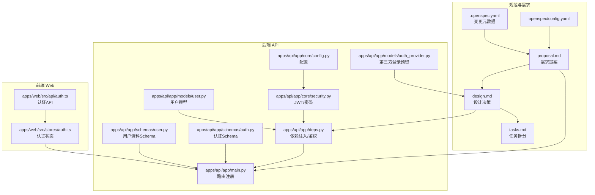
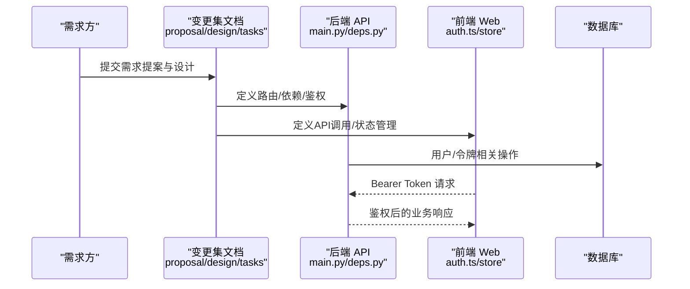
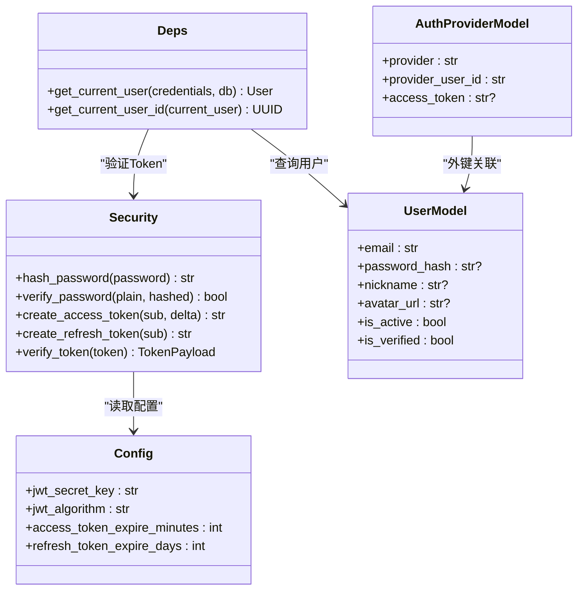
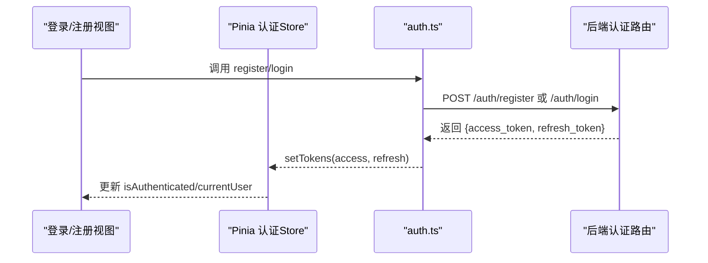
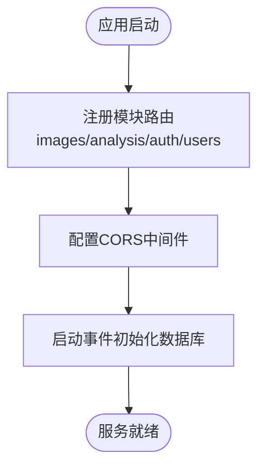
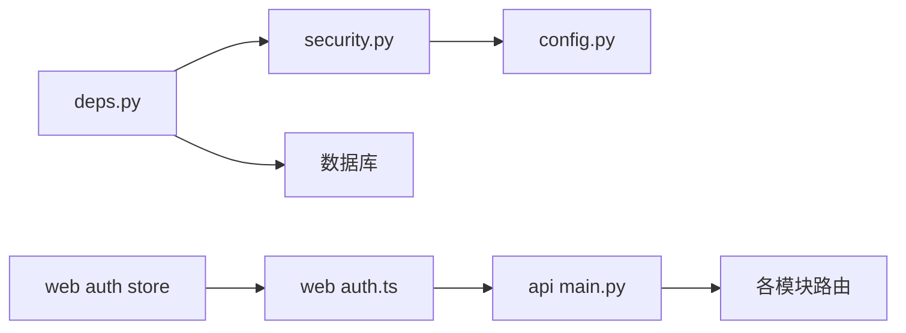

# 需求管理

<cite>
**本文引用的文件**
- [openspec/config.yaml](file://openspec/config.yaml)
- [openspec/changes/add-user-auth/proposal.md](file://openspec/changes/add-user-auth/proposal.md)
- [openspec/changes/add-user-auth/design.md](file://openspec/changes/add-user-auth/design.md)
- [openspec/changes/add-user-auth/tasks.md](file://openspec/changes/add-user-auth/tasks.md)
- [openspec/changes/add-user-auth/.openspec.yaml](file://openspec/changes/add-user-auth/.openspec.yaml)
- [apps/api/app/main.py](file://apps/api/app/main.py)
- [apps/api/app/deps.py](file://apps/api/app/deps.py)
- [apps/api/app/core/config.py](file://apps/api/app/core/config.py)
- [apps/api/app/core/security.py](file://apps/api/app/core/security.py)
- [apps/api/app/models/user.py](file://apps/api/app/models/user.py)
- [apps/api/app/models/auth_provider.py](file://apps/api/app/models/auth_provider.py)
- [apps/api/app/schemas/auth.py](file://apps/api/app/schemas/auth.py)
- [apps/api/app/schemas/user.py](file://apps/api/app/schemas/user.py)
- [apps/web/src/api/auth.ts](file://apps/web/src/api/auth.ts)
- [apps/web/src/stores/auth.ts](file://apps/web/src/stores/auth.ts)
</cite>

## 目录
1. [引言](#引言)
2. [项目结构](#项目结构)
3. [核心组件](#核心组件)
4. [架构总览](#架构总览)
5. [详细组件分析](#详细组件分析)
6. [依赖分析](#依赖分析)
7. [性能考虑](#性能考虑)
8. [故障排查指南](#故障排查指南)
9. [结论](#结论)
10. [附录](#附录)

## 引言
本文件面向“AI摄影教练”项目的“需求管理”，基于仓库内现有的规范驱动工作流与实现，系统化梳理需求收集、分析、定义与验证的流程，给出需求规格文档的编写标准与模板要点，明确需求优先级评估方法与需求跟踪矩阵，制定需求变更请求的处理流程与审批机制，建立需求与功能实现的映射关系，并提出需求质量评估标准与验收准则，以及版本控制与发布管理策略。

## 项目结构
本项目采用“规范驱动（spec-driven）”的组织方式，需求以变更集（change）形式沉淀于 openspec/changes 下，配套 proposal、design、tasks 三类文档，形成“需求提案—设计决策—任务拆分”的闭环。后端 API 使用 FastAPI + SQLAlchemy，前端使用 Vue3 + Pinia，认证与鉴权通过 JWT Bearer Token 实现。

图表来源
- [openspec/config.yaml:1-21](file://openspec/config.yaml#L1-L21)
- [openspec/changes/add-user-auth/.openspec.yaml:1-3](file://openspec/changes/add-user-auth/.openspec.yaml#L1-L3)
- [openspec/changes/add-user-auth/proposal.md:1-35](file://openspec/changes/add-user-auth/proposal.md#L1-L35)
- [openspec/changes/add-user-auth/design.md:1-102](file://openspec/changes/add-user-auth/design.md#L1-L102)
- [openspec/changes/add-user-auth/tasks.md:1-54](file://openspec/changes/add-user-auth/tasks.md#L1-L54)
- [apps/api/app/main.py:1-36](file://apps/api/app/main.py#L1-L36)
- [apps/api/app/deps.py:1-41](file://apps/api/app/deps.py#L1-L41)
- [apps/api/app/core/config.py:1-47](file://apps/api/app/core/config.py#L1-L47)
- [apps/api/app/core/security.py:1-72](file://apps/api/app/core/security.py#L1-L72)
- [apps/api/app/models/user.py:1-28](file://apps/api/app/models/user.py#L1-L28)
- [apps/api/app/models/auth_provider.py:1-24](file://apps/api/app/models/auth_provider.py#L1-L24)
- [apps/api/app/schemas/auth.py:1-37](file://apps/api/app/schemas/auth.py#L1-L37)
- [apps/api/app/schemas/user.py:1-30](file://apps/api/app/schemas/user.py#L1-L30)
- [apps/web/src/api/auth.ts:1-56](file://apps/web/src/api/auth.ts#L1-L56)
- [apps/web/src/stores/auth.ts:1-41](file://apps/web/src/stores/auth.ts#L1-L41)

章节来源
- [openspec/config.yaml:1-21](file://openspec/config.yaml#L1-L21)
- [openspec/changes/add-user-auth/.openspec.yaml:1-3](file://openspec/changes/add-user-auth/.openspec.yaml#L1-L3)
- [openspec/changes/add-user-auth/proposal.md:1-35](file://openspec/changes/add-user-auth/proposal.md#L1-L35)
- [openspec/changes/add-user-auth/design.md:1-102](file://openspec/changes/add-user-auth/design.md#L1-L102)
- [openspec/changes/add-user-auth/tasks.md:1-54](file://openspec/changes/add-user-auth/tasks.md#L1-L54)
- [apps/api/app/main.py:1-36](file://apps/api/app/main.py#L1-L36)

## 核心组件
- 规范驱动框架：通过 openspec/config.yaml 声明 schema: spec-driven，约束变更集的组织与规则。
- 变更集（add-user-auth）：以 proposal、design、tasks 三文一体的方式，完整描述需求背景、目标、非目标、决策、风险、迁移与任务清单。
- 认证与鉴权实现：后端通过 deps.py 与 security.py 实现 Bearer Token 鉴权，配置由 config.py 提供；前端通过 auth.ts 与 Pinia store 管理令牌与用户状态。
- 数据模型与接口：user.py 与 auth_provider.py 定义用户与第三方登录预留模型；schemas/auth.py 与 schemas/user.py 定义认证与用户资料的请求/响应模型。

章节来源
- [openspec/config.yaml:1-21](file://openspec/config.yaml#L1-L21)
- [openspec/changes/add-user-auth/proposal.md:1-35](file://openspec/changes/add-user-auth/proposal.md#L1-L35)
- [openspec/changes/add-user-auth/design.md:1-102](file://openspec/changes/add-user-auth/design.md#L1-L102)
- [openspec/changes/add-user-auth/tasks.md:1-54](file://openspec/changes/add-user-auth/tasks.md#L1-L54)
- [apps/api/app/deps.py:1-41](file://apps/api/app/deps.py#L1-L41)
- [apps/api/app/core/security.py:1-72](file://apps/api/app/core/security.py#L1-L72)
- [apps/api/app/core/config.py:1-47](file://apps/api/app/core/config.py#L1-L47)
- [apps/api/app/models/user.py:1-28](file://apps/api/app/models/user.py#L1-L28)
- [apps/api/app/models/auth_provider.py:1-24](file://apps/api/app/models/auth_provider.py#L1-L24)
- [apps/api/app/schemas/auth.py:1-37](file://apps/api/app/schemas/auth.py#L1-L37)
- [apps/api/app/schemas/user.py:1-30](file://apps/api/app/schemas/user.py#L1-L30)
- [apps/web/src/api/auth.ts:1-56](file://apps/web/src/api/auth.ts#L1-L56)
- [apps/web/src/stores/auth.ts:1-41](file://apps/web/src/stores/auth.ts#L1-L41)

## 架构总览
下图展示了从需求提案到前后端实现与路由注册的端到端映射关系，体现需求如何转化为具体的功能模块与接口。

图表来源
- [openspec/changes/add-user-auth/proposal.md:1-35](file://openspec/changes/add-user-auth/proposal.md#L1-L35)
- [openspec/changes/add-user-auth/design.md:1-102](file://openspec/changes/add-user-auth/design.md#L1-L102)
- [openspec/changes/add-user-auth/tasks.md:1-54](file://openspec/changes/add-user-auth/tasks.md#L1-L54)
- [apps/api/app/main.py:1-36](file://apps/api/app/main.py#L1-L36)
- [apps/api/app/deps.py:1-41](file://apps/api/app/deps.py#L1-L41)
- [apps/web/src/api/auth.ts:1-56](file://apps/web/src/api/auth.ts#L1-L56)
- [apps/web/src/stores/auth.ts:1-41](file://apps/web/src/stores/auth.ts#L1-L41)

## 详细组件分析

### 组件A：认证与鉴权（后端）
- 依赖注入与鉴权：通过 deps.py 的 get_current_user 与 get_current_user_id 实现 Bearer Token 鉴权，保持接口签名向后兼容。
- 安全工具：security.py 提供 JWT 编解码、密码哈希与校验、Access/Refresh Token 的生成与校验。
- 配置：config.py 提供 jwt_secret_key、jwt_algorithm、过期时间等配置项。
- 数据模型：user.py 定义用户字段（含邮箱、昵称、头像、激活/验证状态等）；auth_provider.py 为 OAuth2 预留表。
- 接口契约：auth.py 与 user.py 的 Pydantic 模型定义了认证与用户资料的请求/响应结构。

图表来源
- [apps/api/app/core/security.py:1-72](file://apps/api/app/core/security.py#L1-L72)
- [apps/api/app/core/config.py:1-47](file://apps/api/app/core/config.py#L1-L47)
- [apps/api/app/deps.py:1-41](file://apps/api/app/deps.py#L1-L41)
- [apps/api/app/models/user.py:1-28](file://apps/api/app/models/user.py#L1-L28)
- [apps/api/app/models/auth_provider.py:1-24](file://apps/api/app/models/auth_provider.py#L1-L24)

章节来源
- [apps/api/app/deps.py:1-41](file://apps/api/app/deps.py#L1-L41)
- [apps/api/app/core/security.py:1-72](file://apps/api/app/core/security.py#L1-L72)
- [apps/api/app/core/config.py:1-47](file://apps/api/app/core/config.py#L1-L47)
- [apps/api/app/models/user.py:1-28](file://apps/api/app/models/user.py#L1-L28)
- [apps/api/app/models/auth_provider.py:1-24](file://apps/api/app/models/auth_provider.py#L1-L24)
- [apps/api/app/schemas/auth.py:1-37](file://apps/api/app/schemas/auth.py#L1-L37)
- [apps/api/app/schemas/user.py:1-30](file://apps/api/app/schemas/user.py#L1-L30)

### 组件B：前端认证与状态管理
- API 层：auth.ts 封装认证相关接口（注册、登录、刷新、登出、获取/更新资料、改密）。
- 状态层：store/auth.ts 使用 Pinia 管理 access_token/refresh_token、用户信息与认证状态，持久化至 localStorage。
- 与后端交互：通过统一的 http 拦截器注入 Bearer Token，自动处理 401 与刷新。

图表来源
- [apps/web/src/api/auth.ts:1-56](file://apps/web/src/api/auth.ts#L1-L56)
- [apps/web/src/stores/auth.ts:1-41](file://apps/web/src/stores/auth.ts#L1-L41)

章节来源
- [apps/web/src/api/auth.ts:1-56](file://apps/web/src/api/auth.ts#L1-L56)
- [apps/web/src/stores/auth.ts:1-41](file://apps/web/src/stores/auth.ts#L1-L41)

### 组件C：路由与模块集成
- 主程序：main.py 注册 images、analysis、auth、users 四个模块路由，统一前缀与中间件。
- 依赖注入：deps.py 在路由层注入 get_current_user/get_current_user_id，确保所有受保护端点均需有效 Bearer Token。

图表来源
- [apps/api/app/main.py:1-36](file://apps/api/app/main.py#L1-L36)

章节来源
- [apps/api/app/main.py:1-36](file://apps/api/app/main.py#L1-L36)

## 依赖分析
- 组件耦合：后端依赖 security.py 与 config.py 提供认证与配置；deps.py 依赖数据库会话与用户模型；前端依赖 auth.ts 与 Pinia store。
- 外部依赖：JWT 与密码哈希库在 requirements 中声明；S3/Redis/数据库连接在配置中定义。
- 风险与权衡：短期使用 localStorage 存储 Token，结合短寿命 Access Token 降低泄露影响；OAuth2 预留扩展点最小化当前复杂度。

图表来源
- [apps/api/app/core/security.py:1-72](file://apps/api/app/core/security.py#L1-L72)
- [apps/api/app/core/config.py:1-47](file://apps/api/app/core/config.py#L1-L47)
- [apps/api/app/deps.py:1-41](file://apps/api/app/deps.py#L1-L41)
- [apps/api/app/main.py:1-36](file://apps/api/app/main.py#L1-L36)
- [apps/web/src/api/auth.ts:1-56](file://apps/web/src/api/auth.ts#L1-L56)
- [apps/web/src/stores/auth.ts:1-41](file://apps/web/src/stores/auth.ts#L1-L41)

章节来源
- [apps/api/app/core/security.py:1-72](file://apps/api/app/core/security.py#L1-L72)
- [apps/api/app/core/config.py:1-47](file://apps/api/app/core/config.py#L1-L47)
- [apps/api/app/deps.py:1-41](file://apps/api/app/deps.py#L1-L41)
- [apps/api/app/main.py:1-36](file://apps/api/app/main.py#L1-L36)
- [apps/web/src/api/auth.ts:1-56](file://apps/web/src/api/auth.ts#L1-L56)
- [apps/web/src/stores/auth.ts:1-41](file://apps/web/src/stores/auth.ts#L1-L41)

## 性能考虑
- Token 生命周期：Access Token 短寿命（30 分钟）与 Refresh Token 长寿命（7 天）平衡安全与体验。
- 前端存储：localStorage 简化 SPA 场景下的状态管理，结合 CSP 与安全编码实践降低 XSS 风险。
- 数据库与缓存：Redis 用于异步任务队列，PostgreSQL 存储用户与资源数据；建议在高并发场景下对鉴权接口进行限流与缓存优化。

## 故障排查指南
- 401 未认证：检查前端是否正确注入 Authorization: Bearer <token>，后端 deps.py 是否成功解析 Token。
- Token 过期或无效：确认 jwt_secret_key 与算法一致，verify_token 是否抛出过期或无效异常。
- 用户不存在或未激活：deps.py 中对用户状态的校验会返回 401，需检查用户表状态字段。
- 前端状态不同步：确认 Pinia store 是否正确持久化与清除 tokens，路由守卫是否生效。

章节来源
- [apps/api/app/deps.py:1-41](file://apps/api/app/deps.py#L1-L41)
- [apps/api/app/core/security.py:1-72](file://apps/api/app/core/security.py#L1-L72)
- [apps/web/src/stores/auth.ts:1-41](file://apps/web/src/stores/auth.ts#L1-L41)

## 结论
本项目以“规范驱动”为核心，将需求从提案、设计到任务拆分与实现闭环串联，形成了清晰的需求管理与交付路径。通过 JWT Bearer Token 实现认证与鉴权，前后端职责边界清晰，具备良好的扩展性与可维护性。建议在后续迭代中持续完善变更评审与回归测试流程，确保需求质量与交付一致性。

## 附录

### 需求收集、分析、定义与验证流程
- 需求收集：通过变更集（change）形式在 openspec/changes 下沉淀，明确背景、范围与影响。
- 需求分析：在 proposal 与 design 中界定目标/非目标、决策依据、风险与迁移计划。
- 需求定义：在 tasks 中将需求拆解为可执行的任务清单，明确责任人与交付物。
- 需求验证：通过路由注册、依赖注入与前后端联调，验证鉴权与业务流程符合预期。

章节来源
- [openspec/changes/add-user-auth/proposal.md:1-35](file://openspec/changes/add-user-auth/proposal.md#L1-L35)
- [openspec/changes/add-user-auth/design.md:1-102](file://openspec/changes/add-user-auth/design.md#L1-L102)
- [openspec/changes/add-user-auth/tasks.md:1-54](file://openspec/changes/add-user-auth/tasks.md#L1-L54)
- [apps/api/app/main.py:1-36](file://apps/api/app/main.py#L1-L36)
- [apps/api/app/deps.py:1-41](file://apps/api/app/deps.py#L1-L41)

### 需求规格文档编写标准与模板
- 标准：遵循 openspec/schema: spec-driven，统一变更集命名与目录结构。
- 模板：包含 Proposal（Why/What Changes/Capabilities）、Design（Goals/Decisions/Risks/Migration）、Tasks（任务清单）三部分，必要时补充 .openspec.yaml 元数据。

章节来源
- [openspec/config.yaml:1-21](file://openspec/config.yaml#L1-L21)
- [openspec/changes/add-user-auth/.openspec.yaml:1-3](file://openspec/changes/add-user-auth/.openspec.yaml#L1-L3)
- [openspec/changes/add-user-auth/proposal.md:1-35](file://openspec/changes/add-user-auth/proposal.md#L1-L35)
- [openspec/changes/add-user-auth/design.md:1-102](file://openspec/changes/add-user-auth/design.md#L1-L102)
- [openspec/changes/add-user-auth/tasks.md:1-54](file://openspec/changes/add-user-auth/tasks.md#L1-L54)

### 需求优先级评估方法
- 评估维度：业务价值、技术复杂度、依赖关系、风险与影响面。
- 方法：采用四象限法（高/低价值 × 高/低复杂度）或相对评分法（权重分配），结合团队容量与排期进行排序。

### 需求跟踪矩阵
- 建议字段：需求编号、标题、所属变更集、模块/路由、接口/Schema、前端页面/Store、任务编号、负责人、状态、验收人。
- 用途：覆盖“需求→设计→任务→实现→测试→上线”的全流程追踪。

### 需求变更请求处理流程与审批机制
- 流程：提交变更请求 → 影响评估 → 设计评审 → 任务拆分 → 开发与测试 → 上线评审 → 归档。
- 审批：关键变更（如 Breaking Change）需至少两名核心开发者同意；涉及安全与数据模型变更需安全与DBA参与。

### 需求与功能实现映射关系
- 后端：main.py 路由注册 → deps.py 依赖注入 → security.py/ config.py 配置 → models/schemas 定义 → modules 路由与服务。
- 前端：auth.ts API → Pinia store → 路由守卫与页面 → 统一拦截器注入 Bearer Token。

章节来源
- [apps/api/app/main.py:1-36](file://apps/api/app/main.py#L1-L36)
- [apps/api/app/deps.py:1-41](file://apps/api/app/deps.py#L1-L41)
- [apps/api/app/core/security.py:1-72](file://apps/api/app/core/security.py#L1-L72)
- [apps/api/app/core/config.py:1-47](file://apps/api/app/core/config.py#L1-L47)
- [apps/api/app/models/user.py:1-28](file://apps/api/app/models/user.py#L1-L28)
- [apps/api/app/models/auth_provider.py:1-24](file://apps/api/app/models/auth_provider.py#L1-L24)
- [apps/api/app/schemas/auth.py:1-37](file://apps/api/app/schemas/auth.py#L1-L37)
- [apps/api/app/schemas/user.py:1-30](file://apps/api/app/schemas/user.py#L1-L30)
- [apps/web/src/api/auth.ts:1-56](file://apps/web/src/api/auth.ts#L1-L56)
- [apps/web/src/stores/auth.ts:1-41](file://apps/web/src/stores/auth.ts#L1-L41)

### 需求质量评估标准与验收准则
- 质量标准：需求完整、可验证、可追溯、无二义性；变更影响清晰、风险可控。
- 验收准则：接口契约一致、鉴权生效、前端状态同步、错误处理明确、日志与监控可用。

### 版本控制与发布管理策略
- 版本控制：变更集以目录为单位纳入版本管理，.openspec.yaml 记录创建时间；变更集内文档与代码同步演进。
- 发布策略：采用蓝绿/滚动发布，认证切换阶段（deps.py）与前端同步部署，提供回滚策略（恢复 X-User-Id 逻辑）。

章节来源
- [openspec/changes/add-user-auth/.openspec.yaml:1-3](file://openspec/changes/add-user-auth/.openspec.yaml#L1-L3)
- [openspec/changes/add-user-auth/design.md:89-96](file://openspec/changes/add-user-auth/design.md#L89-L96)
- [apps/api/app/deps.py:1-41](file://apps/api/app/deps.py#L1-L41)